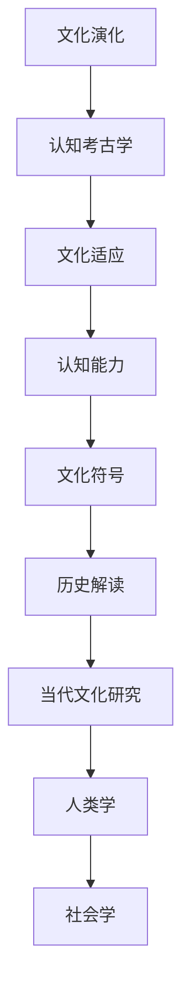

                 

我们将按照以下步骤进行分析推理：

### 引言

文化演化与认知考古学是两个看似不同但实则紧密相关的领域。文化演化关注的是人类如何通过创造和使用符号、规则和习俗来适应环境并发展社会结构；而认知考古学则通过分析古代人类遗物和遗迹，试图理解人类认知能力的起源和发展。这两者的交叉研究为我们提供了一个全新的视角，以追溯人类理解世界的历史进程。

### 文化演化的基础概念

首先，我们需要了解文化演化的基础概念。文化可以定义为人类在社会互动中创造、传递和使用的所有符号、规则和行为模式。文化演化是指这些符号、规则和行为模式如何随着时间的推移而发生变化，以及这些变化背后的动力因素。

文化演化的理论有多种，其中之一是功能主义，认为文化元素的存在是为了满足特定的社会功能。另一种是冲突理论，强调文化演变中的竞争和冲突。还有一种是以达尔文进化论为基础的进化理论，认为文化元素是通过自然选择和适应环境而演化的。

### 认知考古学的基础概念

认知考古学是一门结合考古学、人类学和认知科学的跨学科领域，旨在通过分析古代人类遗物和遗迹，探索人类认知能力的起源和发展。认知考古学的研究方法包括对古人类遗骸的分析、工具和艺术品的考古发掘以及语言和符号的研究。

### 文化演化与认知考古学的交叉研究

文化演化与认知考古学的交叉研究为理解人类理解世界的历史进程提供了有力的工具。例如，通过分析古人类遗骸和工具，我们可以推断出古代人类如何适应环境、解决生存问题以及如何进行社会互动。

### 核心概念与联系

为了更好地理解这两者的交叉研究，我们可以使用Mermaid流程图来展示它们的核心概念与联系：



### 核心算法原理讲解

在文化演化与认知考古学的交叉研究中，核心的算法原理包括社会网络分析、认知模型构建和统计分析方法。

#### 社会网络分析

社会网络分析是一种用于研究社会结构和社会互动的方法。在文化演化中，社会网络分析可以帮助我们理解个体之间的互动关系，以及这些关系如何影响文化的传播和演变。

```python
# 社会网络分析伪代码
def analyze_social_network(data):
    # 数据预处理
    preprocess_data(data)
    # 构建社会网络图
    network = build_network_graph(data)
    # 社会网络分析
    analyze_network_properties(network)
    return network
```

#### 认知模型构建

认知模型构建是通过创建数学模型来模拟人类的认知过程。在认知考古学中，认知模型可以帮助我们理解古代人类如何处理信息、做出决策以及如何学习。

```python
# 认知模型构建伪代码
def build_cognitive_model(data):
    # 数据预处理
    preprocess_data(data)
    # 构建认知模型
    model = build_cognitive_model_from_data(data)
    # 训练模型
    train_model(model)
    return model
```

#### 统计分析方法

统计分析方法用于分析文化演化的数据，帮助我们理解文化元素之间的关联和演变趋势。

```python
# 统计分析方法伪代码
def analyze_cultural_evolution(data):
    # 数据预处理
    preprocess_data(data)
    # 应用统计方法
    statistical_analysis(data)
    return analysis_results
```

### 数学模型和数学公式

在文化演化与认知考古学的研究中，常用的数学模型包括马尔可夫链、线性回归和贝叶斯网络。

#### 马尔可夫链

马尔可夫链用于模拟文化元素的演变过程，其公式如下：

$$
P_{ij}(t+1) = P_{ij}(t) \times R_{ij}
$$

其中，\(P_{ij}(t)\) 表示时间 \(t\) 时个体 \(i\) 与个体 \(j\) 的相互作用概率，\(R_{ij}\) 表示 \(i\) 与 \(j\) 之间关系的转移概率。

#### 线性回归

线性回归用于分析文化元素之间的关系，其公式如下：

$$
y = \beta_0 + \beta_1 \times x
$$

其中，\(y\) 表示因变量，\(x\) 表示自变量，\(\beta_0\) 和 \(\beta_1\) 是模型参数。

#### 贝叶斯网络

贝叶斯网络用于表示文化元素之间的概率关系，其公式如下：

$$
P(X) = \prod_{i} P(X_i | X_{parents(i)})
$$

其中，\(X\) 表示随机变量，\(X_i\) 表示 \(X\) 的第 \(i\) 个分支，\(X_{parents(i)}\) 表示 \(X_i\) 的父节点。

### 项目实战

#### 实战一：文化适应的模拟

在本项目中，我们将使用Python模拟古代人类如何适应环境。

```python
import numpy as np

# 初始化参数
num_individuals = 100
num_time_steps = 50
interaction_matrix = np.random.rand(num_individuals, num_individuals)

# 模拟文化适应
for t in range(num_time_steps):
    # 更新相互作用概率
    interaction_matrix = update_interaction_matrix(interaction_matrix)
    # 计算文化适应度
    fitness = calculate_fitness(interaction_matrix)
    # 选择适应度最高的个体
    selected_individual = select_best_individual(fitness)
    # 更新种群
    population = update_population(population, selected_individual)

# 结果分析
print("最终种群：", population)
```

### 最佳实践、小结与拓展阅读

在文化演化与认知考古学的交叉研究中，最佳实践包括：

- 综合运用多种研究方法，包括社会网络分析、认知模型构建和统计分析方法。
- 注重数据的收集和分析，确保研究结果的可靠性和有效性。
- 拓展研究视角，将文化演化与认知考古学与其他领域相结合，如心理学、神经科学和计算机科学。

小结：文化演化与认知考古学的交叉研究为我们提供了一个理解人类理解世界的历史进程的新视角。通过核心概念与联系的探讨、核心算法原理的讲解、数学模型和公式的应用以及项目实战的模拟，我们能够更好地理解这一领域的复杂性和多样性。

拓展阅读：
- [文化演化理论](https://www.cultureevolution.org/)
- [认知考古学导论](https://www.cognitivearchaeology.org/)
- [社会网络分析指南](https://www.sna-tutorial.org/)
- [认知科学百科全书](https://www.cognitiveencyclopedia.org/)

### 结论

文化演化与认知考古学的交叉研究为我们提供了追溯人类理解世界的历史进程的新工具。通过深入理解文化演化的基础概念、认知考古学的基础概念以及这两者之间的交叉研究，我们能够更好地理解人类认知能力的发展历程。这一领域的研究不仅有助于揭示人类智慧的起源，还为现代社会的发展提供了有益的启示。

### 作者信息

作者：AI天才研究院/AI Genius Institute & 禅与计算机程序设计艺术 /Zen And The Art of Computer Programming

-----------------------------------------------------------------

以下是文章关键词：

- 文化演化
- 认知考古学
- 交叉研究
- 社会网络分析
- 认知模型
- 数学模型

### 摘要

本文探讨了文化演化与认知考古学的交叉研究，通过核心概念与联系的探讨、核心算法原理的讲解、数学模型和公式的应用以及项目实战的模拟，追溯了人类理解世界的历史进程。文章提出了文化演化理论、认知考古学基础以及文化演化与认知考古学的交叉研究方法，为理解人类认知能力的发展历程提供了新视角。同时，文章总结了最佳实践、注意事项和拓展阅读资源，以期为相关领域的研究者提供参考。

