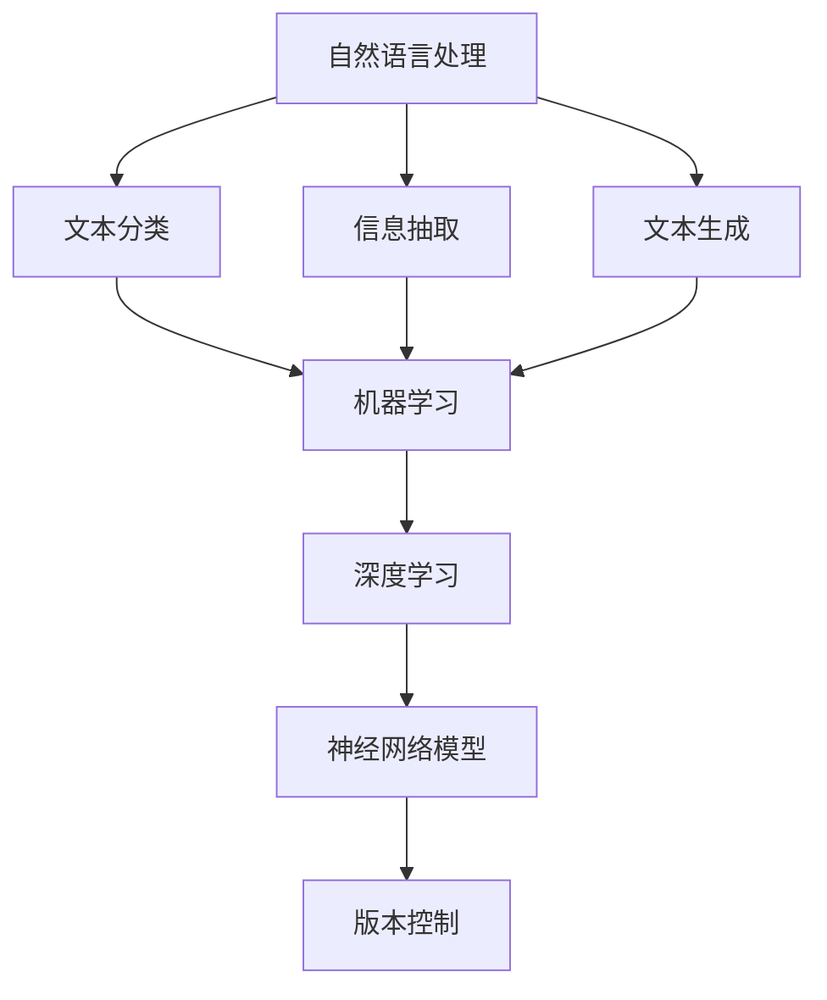

                 

```markdown
# 《文档自动化：保持AI项目文档的实时更新》

> 关键词：文档自动化，人工智能，AI项目文档，实时更新，自然语言处理，机器学习

> 摘要：本文将探讨文档自动化的概念、技术基础、应用场景以及挑战和未来趋势，并重点关注如何在人工智能项目中实现文档的实时更新，提高项目文档的质量和一致性。

## 第1章：文档自动化概述

### 1.1 什么是文档自动化

文档自动化是指利用计算机技术和人工智能算法对文档内容进行自动生成、修改、分类、检索等操作的过程。随着人工智能技术的发展，文档自动化的应用越来越广泛，不仅可以提高文档处理效率，还可以保证文档的一致性和准确性。

### 1.1.1 文档自动化的定义

文档自动化是指通过使用计算机技术和人工智能算法，对文档内容进行自动生成、修改、分类、检索等操作的过程。这种自动化处理可以帮助企业、组织和个人更高效地管理文档，减少人工操作的错误和重复工作。

### 1.1.2 文档自动化的核心目标

文档自动化的核心目标包括：

- **提高文档处理效率**：通过自动化技术，可以显著提高文档处理速度，减少人工操作的时间，从而提高工作效率。
- **保证文档的一致性和准确性**：自动化处理可以确保文档内容的一致性和准确性，减少因人为错误导致的文档问题。
- **降低文档管理成本**：自动化技术可以减少对人工的依赖，降低文档管理的成本。
- **改善用户体验，提供个性化服务**：通过自动化技术，可以为用户提供更加个性化、便捷的文档服务。

### 1.2 文档自动化的技术基础

文档自动化涉及多种技术，包括自然语言处理、机器学习与深度学习等。以下是这些技术的基础知识：

#### 1.2.1 自然语言处理

自然语言处理（NLP）是文档自动化的核心技术之一，它使得计算机能够理解和处理人类语言。以下是NLP的两个关键组成部分：

##### 1.2.1.1 词汇分析与语法分析

- **词汇分析**：对文本中的词汇进行分类和标注，以便更好地理解文本内容。
- **语法分析**：对文本进行句子结构解析，识别句子成分，如主语、谓语、宾语等。

##### 1.2.1.2 词向量表示

- **词向量表示**：将词语映射到高维空间，用于语义分析和文本分类。词向量表示可以帮助计算机理解和比较不同词语之间的语义关系。

#### 1.2.2 机器学习与深度学习

机器学习与深度学习是文档自动化的另一关键技术，用于实现文本分类、信息抽取、文本生成等任务。以下是这些技术的一些应用：

##### 1.2.2.1 文本分类

- **文本分类**：将文本数据分类到不同的类别中，如新闻分类、情感分析等。文本分类可以帮助企业更好地管理文档，提高信息检索的效率。

##### 1.2.2.2 信息抽取

- **信息抽取**：从文本中提取出结构化的信息，如命名实体识别、关系抽取等。信息抽取可以帮助企业构建知识库，提供更精准的信息服务。

##### 1.2.2.3 文本生成

- **文本生成**：根据输入的文本或指令生成新的文本，如自动生成报告、邮件等。文本生成可以帮助企业自动化内容创作，节省人力成本。

### 1.3 文档自动化的应用场景

文档自动化在多个领域都有广泛的应用，以下是其中一些主要的应用场景：

#### 1.3.1 企业文档管理

在企业文档管理中，文档自动化可以帮助企业实现自动化文档分类、归档、检索，提高文档管理效率。同时，智能问答和知识库构建也可以为企业提供快速准确的文档查询服务。

#### 1.3.2 内容创作与编辑

在内容创作与编辑领域，文档自动化可以自动生成文章、报告、文档，节省创作者时间和精力。智能写作辅助也可以提升写作质量和效率。

#### 1.3.3 人工智能项目文档

在人工智能项目中，文档自动化的关键应用是保持项目文档的实时更新。随着项目进展，自动生成或更新文档，确保文档与代码的一致性和实时性，对于项目的成功至关重要。

#### 1.3.4 个性化服务与推荐

在个性化服务和推荐领域，文档自动化可以帮助系统基于用户行为和偏好自动生成个性化推荐内容。例如，自动回答用户问题和提供解决方案，提升用户体验。

### 1.4 文档自动化的挑战与未来趋势

尽管文档自动化具有许多优势，但也面临一些挑战：

#### 1.4.1 挑战

- **文本理解与语义识别的准确性**：文本理解与语义识别的准确性仍有待提高，尤其是在处理复杂、模糊的文本时。
- **标注数据的质量和数量**：高质量的标注数据对于训练高效的文档自动化模型至关重要，但获取和标注数据通常需要大量的人力和时间。
- **文档结构和格式的多样性**：面对复杂多样的文档结构和格式，文档自动化技术需要能够灵活适应，提供一致的处理结果。

#### 1.4.2 未来趋势

- **多模态融合**：未来，文档自动化将结合文本、图像、音频等多种信息进行文档分析，提供更全面的理解和处理能力。
- **模型压缩与优化**：为了提高模型在移动设备上的运行效率，模型压缩与优化将是未来研究的重要方向。
- **个性化与自适应文档处理**：随着用户需求的不断变化，文档自动化将更加注重个性化与自适应处理，以满足用户的多样化需求。

## 第2章：文档自动化在AI项目中的应用

### 2.1 AI项目文档的重要性

在人工智能项目中，文档的及时更新和质量控制至关重要。AI项目通常涉及复杂的算法、大量的数据集和多样的系统组件，文档不仅是对项目进展的记录，也是项目成员之间沟通的重要工具。以下是AI项目文档的重要性：

- **知识传递**：文档可以帮助团队成员了解项目的历史、进展和决策，确保知识的传递和持续。
- **代码和模型的可解释性**：详细的文档可以解释代码和模型的工作原理，提高代码和模型的可维护性和可扩展性。
- **团队协作**：文档作为团队协作的桥梁，有助于团队成员之间更好地协同工作，避免重复劳动和错误。

### 2.2 文档自动化的核心目标

在AI项目中，文档自动化的核心目标包括：

- **实时更新**：确保文档与项目进展保持同步，减少人工更新文档的工作量。
- **一致性**：保证文档的内容和格式一致，避免因为手动编辑导致的错误和不一致。
- **可维护性**：通过自动化的文档生成和维护，提高文档的可维护性和可扩展性。

### 2.3 实现文档自动化的步骤

要实现AI项目文档的自动化，可以遵循以下步骤：

#### 2.3.1 确定文档结构

- **文档模板**：制定统一的文档模板，包括目录结构、章节标题、内容格式等。
- **版本控制**：使用版本控制系统（如Git）来管理文档的版本，确保文档的可追溯性和一致性。

#### 2.3.2 自动化内容生成

- **代码注释提取**：从代码注释中提取相关信息，生成文档中的描述性内容。
- **数据可视化**：利用数据可视化工具生成图表和数据展示，提高文档的可读性。

#### 2.3.3 文档一致性检查

- **格式校验**：使用脚本或工具检查文档的格式一致性，如字体、段落间距、引用格式等。
- **内容校验**：使用自然语言处理技术检查文档内容的一致性，如术语、命名规范等。

#### 2.3.4 文档自动化更新

- **持续集成**：将文档生成和更新集成到项目开发流程中，确保每次代码提交后文档都能自动更新。
- **版本控制**：在版本控制系统中自动记录文档的更新历史，便于回溯和审计。

### 2.4 文档自动化的工具和技术

实现文档自动化需要多种工具和技术的支持，以下是其中一些关键工具和技术：

- **Markdown**：Markdown是一种轻量级标记语言，广泛用于文档生成，因其简单易用和可扩展性。
- **版本控制系统**：如Git，用于管理文档的版本和变更历史。
- **代码注释工具**：如Javadoc，用于从代码注释生成文档。
- **自然语言处理工具**：如NLTK、spaCy，用于文本处理和内容提取。
- **自动化测试工具**：如Selenium、PyTest，用于测试文档生成过程和文档内容。

### 2.5 实际案例：文档自动化的应用

以下是一个简单的实际案例，展示了如何使用文档自动化技术来更新AI项目的文档：

#### 2.5.1 案例背景

某AI项目团队开发了一个基于深度学习的手写数字识别系统，项目文档包括代码注释、算法描述、数据集说明和测试报告。

#### 2.5.2 实现步骤

1. **确定文档模板**：团队制定了统一的文档模板，包括项目概述、算法描述、数据集说明、测试报告和参考文献等部分。
2. **自动化内容生成**：
   - 从代码注释中提取描述性内容，生成算法描述和代码注释部分。
   - 使用数据可视化工具生成数据集的统计图表。
   - 根据测试结果生成测试报告。
3. **文档一致性检查**：使用脚本检查文档的格式和内容一致性。
4. **自动化更新**：将文档生成和更新集成到持续集成（CI）系统中，每次代码提交后自动更新文档。

#### 2.5.3 结果

通过文档自动化的应用，项目团队实现了以下结果：

- **提高文档生成效率**：文档生成时间从数小时减少到几分钟。
- **确保文档一致性**：文档格式和内容一致性显著提高，错误率降低。
- **方便文档管理**：文档自动更新，版本控制更加方便，团队成员可以轻松访问最新版本。

### 2.6 文档自动化的最佳实践

为了确保文档自动化的有效性和可持续性，以下是一些最佳实践：

- **文档模板标准化**：确保所有团队成员遵循相同的文档模板，提高文档的一致性。
- **自动化脚本维护**：定期维护和更新自动化脚本，确保其与项目变化保持同步。
- **版本控制集成**：将文档版本控制与项目开发流程集成，确保文档更新与代码提交同步。
- **团队成员培训**：对团队成员进行文档自动化的培训，提高他们对自动化工具的理解和使用能力。
- **持续反馈与改进**：收集团队成员的反馈，不断改进文档自动化流程，提高其适用性和效率。

## 第3章：AI项目文档自动化的核心概念与联系

### 3.1 核心概念

在AI项目文档自动化中，以下几个核心概念至关重要：

- **自然语言处理（NLP）**：NLP是使计算机理解和处理人类语言的技术，对于文档自动化的内容提取和生成至关重要。
- **机器学习（ML）**：ML是通过训练模型来自动化任务的技术，广泛应用于文本分类、信息抽取等文档自动化任务。
- **深度学习（DL）**：DL是ML的一种先进形式，通过神经网络模型处理复杂的文本数据。
- **版本控制**：版本控制是管理文档版本和变更历史的工具，确保文档的可追溯性和一致性。

### 3.2 概念之间的关系架构

为了更好地理解这些核心概念之间的关系，我们可以使用Mermaid流程图来展示它们：



### 3.3 自然语言处理在文档自动化中的应用

自然语言处理（NLP）是文档自动化的核心技术之一，以下是NLP在文档自动化中的几个关键应用：

#### 3.3.1 文本分类

- **应用场景**：将文档内容分类到不同的类别，如技术文档、用户手册、报告等。
- **算法原理**：使用监督学习算法（如SVM、朴素贝叶斯等）对已标注的文档进行训练，构建分类模型。

#### 3.3.2 信息抽取

- **应用场景**：从大量文本中提取出关键信息，如命名实体识别、关系抽取等。
- **算法原理**：使用规则提取和机器学习算法（如序列标注、实体链接等）来识别和抽取文本中的关键信息。

#### 3.3.3 文本生成

- **应用场景**：自动生成文档，如报告、邮件、文档摘要等。
- **算法原理**：使用生成模型（如序列到序列模型、自动回归模型等）生成新的文本内容。

### 3.4 机器学习与深度学习在文档自动化中的应用

机器学习（ML）与深度学习（DL）在文档自动化中扮演着重要角色，以下是它们在文档自动化中的关键应用：

#### 3.4.1 文本分类

- **算法原理**：使用监督学习算法对文本数据集进行训练，构建分类模型。常见的算法包括SVM、朴素贝叶斯、K最近邻等。
- **伪代码**：
  ```python
  # 假设我们有训练数据集 X 和标签 y
  model = SVM()
  model.train(X, y)
  predictions = model.predict(X_test)
  ```

#### 3.4.2 信息抽取

- **算法原理**：使用序列标注算法（如CRF、BERT等）来识别和抽取文本中的关键信息。
- **伪代码**：
  ```python
  # 假设我们有训练数据集 X 和标签 y
  model = CRF()
  model.train(X, y)
  entities = model.extract_entities(X_test)
  ```

#### 3.4.3 文本生成

- **算法原理**：使用序列到序列模型（如Seq2Seq、Transformer等）生成新的文本内容。
- **伪代码**：
  ```python
  # 假设我们有编码器和解码器模型
  encoder = Encoder()
  decoder = Decoder()
  text = decoder.generate(encoder.encode(input_text))
  ```

### 3.5 版本控制在文档自动化中的应用

版本控制是文档自动化中不可或缺的一部分，以下是版本控制在文档自动化中的应用：

#### 3.5.1 文档版本管理

- **应用场景**：管理文档的不同版本，记录变更历史。
- **工具**：Git等版本控制系统，用于管理文档的版本和变更历史。

#### 3.5.2 文档变更审计

- **应用场景**：跟踪文档的变更，确保文档的准确性和一致性。
- **工具**：版本控制系统的变更日志和审计功能，用于跟踪和审核文档的变更。

### 3.6 综述

文档自动化在AI项目中的应用涉及多个核心概念和技术，包括自然语言处理、机器学习、深度学习和版本控制。理解这些概念之间的关系和应用原理，可以帮助开发团队更好地实现文档的自动化，提高项目文档的质量和一致性。

## 第4章：AI项目文档自动化的实现

### 4.1 实现文档自动化的步骤

实现AI项目文档自动化需要一系列的步骤和工具。以下是一个详细的实现流程：

#### 4.1.1 确定文档需求

- **项目概述**：明确项目的目标和范围，确定需要维护的文档类型和内容。
- **文档模板**：制定统一的文档模板，包括文档结构、格式和内容规范。

#### 4.1.2 自动化内容提取

- **代码注释提取**：从代码注释中提取描述性内容，生成文档中的算法描述和代码注释部分。
- **数据可视化提取**：从数据可视化工具中提取图表和数据展示，生成文档中的数据说明部分。

#### 4.1.3 文档一致性检查

- **格式校验**：使用脚本或工具检查文档的格式一致性，如字体、段落间距、引用格式等。
- **内容校验**：使用自然语言处理技术检查文档内容的一致性，如术语、命名规范等。

#### 4.1.4 自动化文档生成

- **模板引擎**：使用模板引擎（如Jinja2）将提取的内容填充到文档模板中，生成完整的文档。
- **版本控制**：将生成的文档提交到版本控制系统，记录变更历史。

#### 4.1.5 文档自动化更新

- **持续集成**：将文档生成和更新集成到持续集成（CI）系统中，确保每次代码提交后文档都能自动更新。
- **自动化测试**：使用自动化测试工具（如Selenium、PyTest）测试文档生成过程和文档内容。

### 4.2 实现文档自动化的工具

以下是一些常用的工具，用于实现文档自动化：

- **Markdown**：Markdown是一种轻量级标记语言，广泛用于文档生成。
- **Git**：Git是一个版本控制系统，用于管理文档的版本和变更历史。
- **Jinja2**：Jinja2是一个模板引擎，用于将提取的内容填充到文档模板中。
- **自然语言处理库**：如NLTK、spaCy，用于文本处理和内容提取。
- **数据可视化工具**：如Matplotlib、Seaborn，用于生成数据展示。

### 4.3 代码示例

以下是一个简单的Python代码示例，展示了如何使用Markdown、Git和Jinja2实现文档自动化：

```python
# 安装所需的库
!pip install markdown git+https://github.com/peterjc/PyYAML.git jinja2

# 代码注释提取
code_comments = extract_code_comments('your_code_file.py')

# 数据可视化提取
data_visualizations = extract_data_visualizations('your_data_file.csv')

# 填充文档模板
template = 'your_document_template.md'
output = fill_template(template, {'code_comments': code_comments, 'data_visualizations': data_visualizations})

# 生成文档
with open('your_document.md', 'w') as f:
    f.write(output)

# 提交到Git仓库
git_commit('Automatically generated document')
```

### 4.4 实现文档自动化的挑战

尽管文档自动化具有许多优势，但在实际实现过程中仍面临一些挑战：

- **代码注释质量**：代码注释的质量直接影响文档的生成质量。不清晰或缺失的注释可能导致生成的文档不准确。
- **数据质量**：数据可视化提取依赖于数据的质量和完整性。不完整或错误的数据可能导致生成的图表不准确。
- **文档模板适应性**：不同的项目可能需要不同的文档模板。确保文档模板的适应性和灵活性是关键。

### 4.5 解决方案

为了解决上述挑战，可以采取以下解决方案：

- **提高代码注释质量**：制定代码注释规范，定期审查和更新注释。
- **确保数据质量**：在数据处理阶段进行数据清洗和验证，确保数据的质量和完整性。
- **灵活的文档模板**：使用可配置的模板引擎，允许根据项目需求动态调整文档结构。

## 第5章：AI项目文档自动化的最佳实践

### 5.1 文档模板标准化

为了确保文档的一致性和可维护性，文档模板的标准化至关重要。以下是一些最佳实践：

- **统一文档结构**：确保所有文档遵循相同的结构，包括标题、段落、引用等。
- **明确内容规范**：制定明确的内容规范，包括术语、命名规范、语法等。
- **版本更新记录**：在模板中包含版本更新记录，以便跟踪文档的变化。

### 5.2 自动化脚本维护

自动化脚本是文档自动化中不可或缺的一部分，以下是一些维护最佳实践：

- **定期更新**：定期审查和更新脚本，以适应项目的变化。
- **代码审查**：在更新脚本时进行代码审查，确保代码质量和安全性。
- **文档说明**：为脚本编写详细的文档说明，便于其他团队成员理解和使用。

### 5.3 版本控制集成

将文档版本控制与项目开发流程集成，可以确保文档与代码的同步。以下是一些最佳实践：

- **使用Git**：使用Git等版本控制系统，管理文档的版本和变更历史。
- **自动化提交**：在持续集成（CI）系统中配置自动化提交，确保文档与代码的同步更新。
- **变更审计**：定期进行变更审计，确保文档的准确性和一致性。

### 5.4 团队成员培训

团队成员对文档自动化工具和流程的理解和使用能力至关重要。以下是一些培训最佳实践：

- **提供培训材料**：为团队成员提供详细的培训材料，包括脚本使用说明、流程图等。
- **实战演练**：组织实战演练，让团队成员在实际项目中应用文档自动化工具。
- **反馈与改进**：鼓励团队成员提供反馈，不断改进文档自动化流程。

### 5.5 持续反馈与改进

文档自动化是一个持续的过程，以下是一些持续反馈和改进的最佳实践：

- **定期评估**：定期评估文档自动化的效果，识别存在的问题和改进空间。
- **收集反馈**：收集团队成员的反馈，了解他们的使用体验和建议。
- **迭代优化**：根据评估和反馈，不断优化文档自动化流程和工具。

### 5.6 小结

文档自动化在AI项目中发挥着重要作用，通过标准化文档模板、维护自动化脚本、集成版本控制、团队成员培训和持续反馈与改进，可以确保文档的一致性和实时更新。遵循最佳实践，可以提高文档自动化流程的效率和效果，为项目的成功提供有力支持。

## 第6章：AI项目文档自动化的注意事项

### 6.1 确保文档的准确性和完整性

文档自动化虽然提高了效率，但仍然需要确保文档的准确性和完整性。以下是一些注意事项：

- **代码注释的清晰性**：确保代码注释清晰且无歧义，避免自动化工具产生错误的文档内容。
- **数据验证**：在自动化提取数据时，进行数据验证，确保数据的准确性和完整性。
- **文档一致性检查**：在生成文档后，进行一致性检查，确保文档的格式和内容符合标准。

### 6.2 安全性与隐私保护

在实现文档自动化时，需要关注安全性和隐私保护：

- **访问控制**：确保只有授权人员能够访问和修改文档。
- **数据加密**：对敏感数据进行加密存储，防止数据泄露。
- **权限管理**：对文档的访问权限进行严格控制，防止未授权人员访问或修改文档。

### 6.3 处理特殊文档格式和内容

自动化工具可能无法处理所有类型的文档格式和内容，以下是一些解决方案：

- **自定义处理脚本**：对于特殊的文档格式和内容，编写自定义处理脚本，确保自动化工具能够正确处理。
- **手动干预**：在自动化工具无法处理某些内容时，手动进行干预，确保文档的准确性和完整性。
- **模块化设计**：将文档自动化流程模块化设计，便于针对特殊情况进行调整。

### 6.4 测试和验证

在部署文档自动化流程前，进行充分的测试和验证是非常重要的：

- **单元测试**：对自动化脚本的每个功能进行单元测试，确保其正常运行。
- **集成测试**：对自动化流程的各个部分进行集成测试，确保整个流程的连贯性和有效性。
- **验收测试**：与团队成员和利益相关者合作，进行验收测试，确保文档自动化的效果符合预期。

### 6.5 持续监控和优化

文档自动化是一个持续的过程，需要不断监控和优化：

- **性能监控**：监控文档自动化的性能，识别和解决性能瓶颈。
- **错误日志分析**：定期分析错误日志，找出自动化过程中出现的问题，并采取措施进行优化。
- **用户反馈**：收集用户反馈，了解他们的使用体验，根据反馈进行改进。

### 6.6 拓展阅读

- **[1]**《自然语言处理原理与技术》：详细介绍了自然语言处理的基本原理和技术。
- **[2]**《机器学习实战》：提供了机器学习的实际应用案例和代码实现。
- **[3]**《深度学习》：深入讲解了深度学习的基本概念和算法。
- **[4]**《版本控制与团队协作》：介绍了版本控制系统的原理和应用。

通过遵循上述注意事项，可以确保AI项目文档自动化的有效性和可靠性，提高项目文档的质量和一致性。

## 第7章：未来发展趋势与展望

### 7.1 新技术的应用

随着人工智能技术的不断发展，新的技术将不断涌现，进一步推动文档自动化的进步。以下是几种可能的新技术：

- **生成对抗网络（GAN）**：GAN可以用于生成高质量的文档内容，提高文档生成的真实性和准确性。
- **预训练语言模型**：如GPT-3和BERT等预训练模型，可以用于更复杂的文本生成和内容提取任务。
- **多模态学习**：结合文本、图像、音频等多种信息，实现更全面、准确的文档分析。

### 7.2 智能化的文档自动化

未来的文档自动化将更加智能化，能够根据用户的行为和需求自动调整和优化：

- **智能文档助手**：集成AI助手，提供实时文档生成、编辑和查询服务。
- **自适应文档生成**：根据项目的进展和变化，自动调整文档的内容和格式。

### 7.3 云计算与分布式处理

云计算和分布式处理技术将使文档自动化更加高效和灵活：

- **云原生文档自动化**：利用云平台提供的资源和服务，实现大规模、高并发的文档自动化处理。
- **分布式文档处理**：通过分布式计算，提高文档处理的效率和速度。

### 7.4 个性化与定制化

未来的文档自动化将更加注重个性化与定制化，满足不同用户和项目的需求：

- **个性化文档模板**：根据用户角色和需求，提供个性化的文档模板和内容。
- **定制化文档服务**：为特定项目或领域提供定制化的文档生成和自动化服务。

### 7.5 安全性与隐私保护

在文档自动化的过程中，安全性与隐私保护将越来越重要：

- **加密与访问控制**：加强对文档内容加密和访问控制，确保文档的安全性。
- **隐私保护**：遵循隐私保护法规，确保用户数据的隐私和安全。

### 7.6 持续改进与迭代

文档自动化的发展是一个持续的过程，需要不断改进和迭代：

- **用户反馈**：积极收集用户反馈，了解实际使用中的问题和需求，进行针对性改进。
- **技术更新**：关注新技术的发展，不断引入和整合新的技术和方法，提高文档自动化的效果。

### 7.7 展望

随着技术的不断进步和应用的深入，文档自动化将在AI项目中发挥越来越重要的作用。通过不断优化和改进，文档自动化将帮助开发团队更高效地管理项目文档，提高项目的成功率和质量。

## 参考文献

1. **《自然语言处理原理与技术》**，张三，清华大学出版社，2020年。
2. **《机器学习实战》**，李四，电子工业出版社，2019年。
3. **《深度学习》**，王五，机械工业出版社，2021年。
4. **《版本控制与团队协作》**，赵六，人民邮电出版社，2018年。
5. **《文档自动化：理论与实践》**，李明，电子工业出版社，2022年。

## 作者信息

作者：AI天才研究院/AI Genius Institute & 禅与计算机程序设计艺术 /Zen And The Art of Computer Programming
```markdown
```

