                 


### 文章标题

《日志管理：洞察AI应用运行状态的重要工具》

### 关键词

日志管理，AI应用，运行状态，监控，异常检测，数据处理，可视化，开源工具

### 摘要

本文旨在探讨日志管理在人工智能（AI）应用中的重要性。日志管理作为AI应用运行状态的重要工具，不仅能够帮助开发者了解系统的运行情况，还能在出现问题时提供宝贵的诊断信息。文章将首先介绍日志管理的基本概念，包括日志收集、存储和分析。随后，我们将深入探讨日志处理与可视化的方法，并展示如何将日志分析应用于AI应用中。通过实际案例和最佳实践，读者将了解如何在AI应用开发、运维中有效利用日志管理，确保系统的稳定运行。

### 目录

**第一部分：日志管理基础**

#### 第1章：日志管理概述

1.1 日志管理的定义与重要性

1.2 日志管理的基本概念

1.3 日志管理的常见类型

1.4 日志管理的挑战与解决方案

#### 第2章：日志收集与存储

2.1 日志收集机制

2.2 常见的日志收集工具

2.3 日志存储解决方案

2.4 数据库与日志存储

**第二部分：日志分析与处理**

#### 第3章：日志分析概述

3.1 日志分析的重要性

3.2 日志分析的基本方法

3.3 日志分析的关键技术

3.4 日志分析的实际应用场景

#### 第4章：日志处理与转换

4.1 日志处理的基本流程

4.2 常见的日志处理工具

4.3 日志格式转换与标准化

4.4 日志清洗与预处理

#### 第5章：日志可视化

5.1 日志可视化的意义

5.2 常见的日志可视化工具

5.3 日志可视化最佳实践

5.4 日志可视化案例

**第三部分：日志管理与AI应用**

#### 第6章：日志分析与AI

6.1 利用日志数据进行机器学习

6.2 常见的日志分析算法

6.3 基于日志的异常检测

6.4 日志分析在AI应用中的案例分析

#### 第7章：日志管理在AI应用中的实践

7.1 AI应用日志管理策略

7.2 日志管理在AI应用开发中的实际案例

7.3 日志管理在AI应用运维中的应用

7.4 日志管理在AI应用中的未来发展趋势

### 附录

A.1 常见日志管理工具与框架

A.2 日志管理相关的开源资源和文档

### Mermaid 流程图

```mermaid
graph TD
A[日志管理] --> B[日志收集]
A --> C[日志存储]
B --> D[日志收集机制]
B --> E[常见日志收集工具]
C --> F[日志存储解决方案]
C --> G[数据库与日志存储]

H[日志分析] --> I[日志分析概述]
H --> J[日志分析基本方法]
H --> K[日志分析关键技术]
H --> L[日志分析实际应用场景]

M[日志处理与转换] --> N[日志处理基本流程]
M --> O[常见日志处理工具]
M --> P[日志格式转换与标准化]
M --> Q[日志清洗与预处理]

R[日志可视化] --> S[日志可视化概述]
R --> T[常见日志可视化工具]
R --> U[日志可视化最佳实践]
R --> V[日志可视化案例]

W[日志分析与AI] --> X[利用日志数据进行机器学习]
W --> Y[常见日志分析算法]
W --> Z[基于日志的异常检测]
W --> AA[日志分析在AI应用中的案例分析]

BB[日志管理在AI应用中的实践] --> CC[AI应用日志管理策略]
BB --> DD[日志管理在AI应用开发中的实际案例]
BB --> EE[日志管理在AI应用运维中的应用]
BB --> FF[日志管理在AI应用中的未来发展趋势]

GG[常见日志管理工具与框架] --> HH[常见日志管理工具]
GG --> II[日志管理相关开源资源和文档]
```



### 第1章：日志管理概述

#### 1.1 日志管理的定义与重要性

日志管理是指对系统运行过程中产生的日志数据进行收集、存储、分析和处理的一系列操作。这些日志数据包含了系统运行的各种事件信息，如用户操作、系统错误、性能指标等。通过日志管理，我们可以实现对系统运行状态的实时监控，及时发现并解决潜在问题，从而保障系统的稳定性和可靠性。

日志管理的重要性主要体现在以下几个方面：

1. **问题诊断**：日志记录了系统运行中的各种事件和异常，通过分析日志，我们可以迅速定位问题的根源，为故障排除提供有力支持。
2. **性能优化**：通过对日志数据的分析，我们可以了解系统的运行性能，找出性能瓶颈，进行针对性的优化。
3. **安全监控**：日志中记录了用户登录、数据访问等操作，通过对日志数据的监控，可以有效防范恶意攻击和内部违规行为。
4. **审计追踪**：日志数据可以作为系统审计的重要依据，有助于合规性检查和责任追溯。

#### 1.2 日志管理的基本概念

1. **日志**：日志是一种记录系统运行过程中事件和状态的文本文件或数据库。日志通常包含时间戳、事件类型、事件内容等信息。
2. **日志文件**：日志管理中最常见的存储形式，通常以文本文件的形式存储在文件系统中。日志文件可以是单文件，也可以是多个文件的组合。
3. **日志收集**：将系统产生的日志数据从一个或多个来源收集到中央存储位置的过程。日志收集可以通过日志聚合工具、代理程序或网络流等方式实现。
4. **日志存储**：将收集到的日志数据存储在持久化存储介质中的过程。日志存储可以采用文件系统、数据库或云存储等方式。
5. **日志分析**：对日志数据进行处理、分析和解释的过程，以提取有用信息和洞察。日志分析可以通过自定义脚本、商业工具或开源框架实现。
6. **日志处理**：对原始日志数据进行格式转换、清洗、聚合等操作，使其更适合分析和处理的过程。

#### 1.3 日志管理的常见类型

1. **系统日志**：记录系统运行过程中产生的各种事件，如启动、关闭、错误、警告等。系统日志通常由操作系统、应用服务器或中间件产生。
2. **应用日志**：记录应用程序运行过程中产生的日志数据，包括用户操作、业务逻辑、异常信息等。应用日志通常由开发人员自定义格式和内容。
3. **安全日志**：记录与安全相关的日志数据，如用户登录、文件访问、安全策略变更等。安全日志有助于监控和防范恶意攻击。
4. **性能日志**：记录系统运行过程中的性能指标，如响应时间、吞吐量、系统负载等。性能日志可用于性能优化和资源调度。

#### 1.4 日志管理的挑战与解决方案

1. **日志数据量大**：随着系统规模的扩大，日志数据量呈指数级增长，如何高效地收集、存储和分析大量日志数据成为一大挑战。
   - **解决方案**：采用分布式日志收集和存储系统，如Apache Kafka、ELK（Elasticsearch、Logstash、Kibana）等，实现日志数据的高效管理和处理。

2. **日志格式多样**：不同系统和应用产生的日志格式各异，如何统一日志格式，实现高效日志分析是一个难题。
   - **解决方案**：采用日志格式转换工具，如Logstash、Fluentd等，将不同格式的日志转换为统一的格式，便于后续分析。

3. **日志分析复杂**：日志数据中包含了丰富的信息，如何有效地提取和分析这些信息，以发现潜在问题和优化系统性能，是一个复杂的过程。
   - **解决方案**：采用日志分析工具和框架，如Grok、Splunk、Prometheus等，实现日志数据的自动化分析和可视化。

4. **日志安全**：日志数据中包含了敏感信息，如用户密码、关键业务数据等，如何保证日志数据的安全性和隐私性是一个重要问题。
   - **解决方案**：采用加密技术对日志数据进行加密存储，限制日志访问权限，确保日志数据的安全性。

### 第2章：日志收集与存储

#### 2.1 日志收集机制

日志收集是日志管理的重要环节，它涉及到日志数据的收集、传输和存储。一个有效的日志收集机制应该具备以下特点：

1. **分布式**：支持分布式系统中的多节点收集，确保日志数据不丢失。
2. **高效**：具备高吞吐量和高性能，能够快速收集大量日志数据。
3. **可靠**：具备故障转移和容错能力，确保日志数据收集的连续性和可靠性。
4. **可扩展**：支持日志收集系统的动态扩展，以适应不断增长的数据量。

日志收集机制通常包括以下步骤：

1. **日志生成**：系统在运行过程中生成日志数据。
2. **日志收集器**：负责将日志数据从各个节点收集到中央存储位置。常见的日志收集器有Logstash、Fluentd、Filebeat等。
3. **日志传输**：将收集到的日志数据从一个节点传输到另一个节点或中央存储位置。常见的日志传输方式有文件传输、网络传输和消息队列等。
4. **日志存储**：将收集到的日志数据存储在持久化存储介质中，如文件系统、数据库或云存储等。

#### 2.2 常见的日志收集工具

1. **Logstash**：是Elastic Stack中的日志收集工具，支持从多种数据源（如文件、网络、数据库等）收集日志数据，并进行格式转换和传输。它采用Java编写，具有良好的性能和扩展性。

   - **配置**：Logstash通过配置文件定义输入、过滤器、输出等组件，以实现日志收集和处理流程。
   - **输入**：支持文件、TCP、UDP、数据库等多种输入方式。
   - **过滤器**：支持Grok、JSON路径、Ruby等过滤器，对日志数据进行格式转换和内容提取。
   - **输出**：支持Elasticsearch、文件系统、SMTP等多种输出方式。

2. **Fluentd**：是另一个流行的日志收集工具，支持多种操作系统和平台，采用C++编写，具有良好的性能和可扩展性。

   - **配置**：Fluentd通过配置文件定义输入、输出和处理规则，以实现日志收集和处理流程。
   - **输入**：支持文件、网络、JDBC等多种输入方式。
   - **过滤器**：支持Grok、正则表达式等过滤器，对日志数据进行格式转换和内容提取。
   - **输出**：支持Elasticsearch、Kafka、文件系统等多种输出方式。

3. **Filebeat**：是Elastic Stack中的轻量级日志收集器，适用于在边缘设备和服务器上收集日志数据。它采用Go语言编写，具有低资源消耗和高性能的特点。

   - **配置**：Filebeat通过配置文件定义日志路径、日志格式和处理规则，以实现日志收集和处理流程。
   - **输入**：支持文件和日志轮转文件。
   - **输出**：支持Elasticsearch、Logstash、Kafka等多种输出方式。

#### 2.3 日志存储解决方案

日志存储是日志管理的关键环节，一个有效的日志存储解决方案应该具备以下特点：

1. **高可靠性**：确保日志数据的安全存储，防止数据丢失。
2. **高性能**：能够快速响应日志数据的读写请求，满足实时分析和查询的需求。
3. **可扩展性**：支持日志存储系统的动态扩展，以适应不断增长的数据量。
4. **易管理性**：提供方便的管理和监控工具，降低运维成本。

常见的日志存储解决方案包括以下几种：

1. **文件系统**：文件系统是一种传统的日志存储方式，具有简单易用、成本低廉的特点。但它也存在一些缺点，如数据量受限、不支持分布式存储等。

   - **优点**：简单易用、成本低廉。
   - **缺点**：数据量受限、不支持分布式存储。

2. **数据库**：数据库是一种关系型或非关系型存储方式，可以高效地存储和管理大量日志数据。

   - **优点**：支持分布式存储、高性能、易于查询和分析。
   - **缺点**：成本较高、需要额外的数据库维护。

3. **云存储**：云存储是一种基于云计算的日志存储方式，提供高可靠性、高可用性和灵活的计费模式。

   - **优点**：高可靠性、高可用性、灵活的计费模式。
   - **缺点**：成本较高、数据安全性问题。

4. **分布式日志存储系统**：分布式日志存储系统是一种基于分布式技术的日志存储解决方案，可以高效地存储和管理大量日志数据。

   - **优点**：支持分布式存储、高可靠性、高性能。
   - **缺点**：需要额外的维护和配置。

#### 2.4 数据库与日志存储

数据库在日志存储中扮演着重要角色，可以提供高效的数据查询和分析功能。以下是一些常用的数据库和日志存储方案：

1. **关系型数据库**：如MySQL、PostgreSQL等，可以用于存储结构化日志数据。

   - **优点**：支持SQL查询、易于使用和管理。
   - **缺点**：性能受限、扩展性较差。

2. **非关系型数据库**：如MongoDB、Cassandra等，可以用于存储非结构化或半结构化日志数据。

   - **优点**：灵活的文档模型、支持分布式存储。
   - **缺点**：查询性能受限、维护成本较高。

3. **日志聚合平台**：如ELK（Elasticsearch、Logstash、Kibana）、Splunk等，提供完整的日志存储、分析和可视化解决方案。

   - **优点**：一站式解决方案、强大的数据处理和分析功能。
   - **缺点**：成本较高、配置和维护较复杂。

### 第3章：日志分析概述

#### 3.1 日志分析的重要性

日志分析在信息技术领域具有重要地位，它不仅有助于开发者了解系统运行状态，还能为运维人员提供问题诊断和性能优化的依据。具体来说，日志分析的重要性体现在以下几个方面：

1. **问题诊断**：日志记录了系统运行过程中发生的事件和异常，通过对日志数据的分析，可以迅速定位问题的根源，为故障排除提供有力支持。
2. **性能优化**：通过对日志数据的分析，可以了解系统的运行性能，找出性能瓶颈，进行针对性的优化，提高系统的运行效率。
3. **安全监控**：日志中记录了用户登录、数据访问等操作，通过对日志数据的监控，可以及时发现潜在的安全威胁，防范恶意攻击。
4. **审计追踪**：日志数据可以作为系统审计的重要依据，有助于合规性检查和责任追溯。

#### 3.2 日志分析的基本方法

日志分析的基本方法包括数据采集、数据预处理、数据存储、数据分析和结果展示等环节。以下是日志分析的基本流程：

1. **数据采集**：通过日志收集器从各个系统或应用中采集日志数据。
2. **数据预处理**：对采集到的日志数据进行清洗、格式化等处理，使其符合分析需求。
3. **数据存储**：将预处理后的日志数据存储到数据库或数据仓库中，以便后续分析和查询。
4. **数据分析**：运用各种数据分析技术，对日志数据进行处理和挖掘，提取有价值的信息和洞察。
5. **结果展示**：将分析结果以图表、报表等形式展示给用户，帮助用户更好地理解和利用日志数据。

#### 3.3 日志分析的关键技术

日志分析的关键技术包括日志解析、日志聚合、日志关联分析和日志可视化等。以下是这些关键技术的详细解释：

1. **日志解析**：日志解析是指将原始日志数据转换为结构化数据的过程。日志解析的关键技术包括正则表达式、模式识别和自然语言处理等。通过日志解析，可以将无结构的日志数据转换为具有明确字段和属性的结构化数据，便于后续分析。

2. **日志聚合**：日志聚合是指将来自多个源或多个时段的日志数据进行汇总和整理的过程。日志聚合有助于降低数据存储和处理的复杂性，提高分析效率。常见的日志聚合方法包括时间窗口聚合、事件计数、求和、平均值等。

3. **日志关联分析**：日志关联分析是指将来自不同源或不同类型的日志数据进行关联，以发现潜在问题和优化系统性能。日志关联分析的关键技术包括关联规则挖掘、聚类分析和图论等。通过日志关联分析，可以挖掘出日志数据之间的隐藏关系，为问题诊断和性能优化提供有力支持。

4. **日志可视化**：日志可视化是指将分析结果以图表、报表等形式展示给用户的过程。日志可视化有助于用户更好地理解和利用日志数据，发现潜在问题和优化系统性能。常见的日志可视化工具包括Kibana、Grafana等。

#### 3.4 日志分析的实际应用场景

日志分析在实际应用场景中具有广泛的应用，以下是一些典型的应用场景：

1. **问题诊断**：通过日志分析，可以迅速定位系统故障和异常，为故障排除提供有力支持。例如，在Web应用中，通过对访问日志的分析，可以发现请求失败的原因和频率，从而定位性能瓶颈和优化方案。

2. **安全监控**：通过日志分析，可以实时监控系统安全状况，发现潜在的安全威胁。例如，在网络安全领域，通过对网络流量日志的分析，可以识别恶意攻击行为和异常流量，从而采取相应的安全措施。

3. **性能优化**：通过对日志数据的分析，可以了解系统的运行性能，找出性能瓶颈，进行针对性的优化。例如，在数据库系统中，通过对慢查询日志的分析，可以找出性能较差的SQL语句，优化查询语句或调整数据库配置。

4. **业务分析**：通过日志分析，可以挖掘用户行为和业务模式，为业务决策提供支持。例如，在电子商务领域，通过对用户访问日志的分析，可以了解用户购买习惯、偏好和需求，优化营销策略和产品推荐。

### 第4章：日志处理与转换

#### 4.1 日志处理的基本流程

日志处理是指对原始日志数据的一系列操作，以提取有用信息、优化存储和便于分析。日志处理的基本流程通常包括以下步骤：

1. **日志采集**：从不同的系统和应用中收集日志数据，可以通过日志收集工具如Logstash、Fluentd或Filebeat等实现。
2. **日志过滤**：根据预定的规则，筛选出有用的日志数据，去除无用或无关的信息。例如，可以过滤掉包含特定关键词的日志条目。
3. **日志解析**：将原始日志数据转换为结构化的数据格式，如JSON或XML，以便于存储和进一步处理。日志解析通常使用正则表达式或专门的解析工具。
4. **日志转换**：将日志数据转换为特定的格式或结构，如将不同格式的日志转换为统一的日志格式，或将其转换为适用于特定分析工具的格式。
5. **日志清洗**：对日志数据进行清洗，包括去除重复项、纠正错误格式、填补缺失值等，以提高数据质量。
6. **日志聚合**：将来自不同时间窗口或不同源的日志数据进行汇总，以减少数据量并提高分析效率。例如，可以按小时、天或周对日志数据进行聚合。
7. **日志存储**：将处理后的日志数据存储到数据库、文件系统或云存储中，以便后续分析和查询。

#### 4.2 常见的日志处理工具

日志处理工具是实现日志数据清洗、转换和聚合的重要工具。以下是一些常见的日志处理工具及其特点：

1. **Logstash**：Logstash是Elastic Stack中的一个组件，用于收集、转换和存储日志数据。它支持多种输入和输出插件，可以灵活地处理不同格式的日志数据。Logstash的优点在于其强大的可扩展性和集成能力，但配置相对复杂。

   - **优点**：强大的数据处理能力、良好的扩展性、与Elastic Stack集成。
   - **缺点**：配置复杂、性能要求较高。

2. **Fluentd**：Fluentd是另一个流行的日志处理工具，由日本公司Trend Micro开发。它采用C++编写，具有良好的性能和可扩展性。Fluentd支持多种日志输入和输出格式，易于配置和使用。

   - **优点**：高性能、易于配置、支持多种输入和输出格式。
   - **缺点**：相对于Logstash，扩展性稍弱。

3. **Filebeat**：Filebeat是Elastic Stack中的一个轻量级日志收集器，适用于边缘设备和服务器。它专门用于收集和转发日志数据，非常适合在分布式环境中使用。Filebeat的优点在于其轻量级和易于部署。

   - **优点**：轻量级、易于部署、与Elastic Stack集成。
   - **缺点**：功能相对简单，适合小规模应用。

4. **Apache Kafka**：Kafka是一种分布式流处理平台，常用于大规模日志数据的收集和传输。Kafka具有高吞吐量、可扩展性和容错性，适合处理大量日志数据。

   - **优点**：高吞吐量、可扩展性、容错性。
   - **缺点**：需要一定的运维技能和配置。

5. **Splunk**：Splunk是一个商业的日志分析和处理平台，具有强大的数据处理和分析功能。Splunk能够实时收集和分析各种来源的日志数据，并提供直观的可视化界面。

   - **优点**：强大的数据处理和分析功能、直观的界面、丰富的功能。
   - **缺点**：商业软件，成本较高。

#### 4.3 日志格式转换与标准化

日志格式转换与标准化是日志处理中的一个重要环节，目的是将不同格式和结构的日志数据转换为统一的格式，以便于存储、分析和共享。以下是一些常用的日志格式转换与标准化方法：

1. **正则表达式**：使用正则表达式可以对日志数据中的特定部分进行提取和格式化。例如，可以使用正则表达式提取HTTP访问日志中的请求方法和URL。

2. **解析器库**：许多编程语言提供了专门的库来解析和转换日志格式。例如，Python中的`re`库可以用于处理正则表达式，而`dateutil`库可以用于处理日期和时间格式。

3. **自定义脚本**：使用编程语言（如Python、Go等）编写自定义脚本，可以自动化地处理日志格式转换和标准化。自定义脚本可以根据具体需求灵活处理日志数据。

4. **开源工具**：一些开源工具（如Logstash、Fluentd、Filebeat等）提供了内置的格式转换功能，可以方便地将不同格式的日志转换为统一格式。

5. **日志聚合平台**：如ELK（Elasticsearch、Logstash、Kibana）和Splunk等日志聚合平台，提供了强大的日志格式转换和标准化功能，可以自动处理不同来源的日志数据。

#### 4.4 日志清洗与预处理

日志清洗与预处理是确保日志数据质量和可用性的重要步骤。以下是一些常用的日志清洗与预处理方法：

1. **去重**：去除重复的日志条目，以防止重复分析和存储。
2. **字段提取**：提取日志数据中的关键字段，如时间戳、用户ID、事件类型等。
3. **格式校验**：检查日志数据的格式是否符合预期，如时间戳是否为有效日期格式，字段是否完整等。
4. **错误纠正**：纠正日志数据中的错误，如日期格式错误、缺失字段等。
5. **缺失值处理**：处理缺失的日志数据，如使用平均值、中位数或填充特定值。
6. **异常值检测**：检测并处理异常值，如超出正常范围的数值或不符合逻辑的记录。
7. **字段标准化**：将不同格式的字段转换为统一的格式，如将时间戳转换为ISO 8601格式。
8. **数据分类**：将日志数据根据特定字段进行分类，以便于后续分析和处理。

通过日志清洗与预处理，可以提高日志数据的准确性和一致性，为后续的数据分析和挖掘提供可靠的数据基础。

### 第5章：日志可视化

#### 5.1 日志可视化的意义

日志可视化是将日志数据以图形化方式展示的过程，有助于用户直观地理解和分析日志数据。日志可视化的意义主要体现在以下几个方面：

1. **信息直观性**：通过图表、仪表板等形式，日志可视化使得复杂的日志数据变得更加直观易懂，有助于用户快速识别关键信息。
2. **问题定位**：日志可视化可以帮助用户迅速发现系统故障、性能瓶颈和安全威胁等异常情况，实现快速问题定位。
3. **趋势分析**：通过日志可视化，可以直观地观察系统运行趋势，如用户访问量、错误率、资源利用率等，为性能优化和资源规划提供依据。
4. **决策支持**：日志可视化提供的可视化报告和仪表板，有助于管理层和决策者更清晰地了解系统运行状况和业务指标，支持决策制定。
5. **知识传递**：日志可视化可以将技术知识和经验以图形化的形式传递给非技术人员，提高团队的整体技术素养和协作效率。

#### 5.2 常见的日志可视化工具

在日志管理中，有许多工具可以帮助用户将日志数据可视化。以下是一些常见的日志可视化工具及其特点：

1. **Kibana**：Kibana是Elastic Stack中的一个关键组件，它提供了丰富的可视化功能，可以与Elasticsearch结合使用。Kibana支持多种图表类型，如柱状图、折线图、饼图、地图等，并且可以通过拖拽操作自定义仪表板。

   - **优点**：与Elastic Stack集成、功能丰富、易于使用。
   - **缺点**：性能要求较高、配置复杂。

2. **Grafana**：Grafana是一个开源的监控和可视化工具，支持多种数据源，如InfluxDB、Prometheus、MySQL等。Grafana提供了强大的仪表板功能，用户可以自定义图表和面板布局。

   - **优点**：开源、支持多种数据源、易于扩展。
   - **缺点**：配置相对复杂、性能优化要求较高。

3. **Splunk**：Splunk是一个商业的日志分析和可视化平台，提供了强大的日志搜索、分析和可视化功能。Splunk的仪表板功能丰富，可以自定义各种图表和报告。

   - **优点**：功能全面、直观的界面、丰富的报告和仪表板。
   - **缺点**：商业软件、成本较高。

4. **Grafite**：Grafite是一个开源的监控和可视化工具，主要用于生成图表和仪表板。它支持多种数据源，如InfluxDB、Prometheus、Elasticsearch等。

   - **优点**：开源、轻量级、易于部署。
   - **缺点**：功能相对简单、扩展性有限。

5. **LogView**：LogView是一个基于Web的日志查看和分析工具，提供了日志流的实时监控和可视化功能。它支持多种日志格式，如CSV、JSON、XML等。

   - **优点**：实时日志流监控、易于使用。
   - **缺点**：功能相对单一、性能要求较高。

#### 5.3 日志可视化最佳实践

为了实现高效的日志可视化，以下是一些最佳实践：

1. **选择合适的图表类型**：根据日志数据的特性和分析需求，选择合适的图表类型。例如，对于趋势分析，使用折线图或柱状图；对于分布情况，使用饼图或直方图。
2. **保持界面简洁**：避免在仪表板中添加过多的图表和面板，保持界面简洁，便于用户集中精力分析和理解关键信息。
3. **使用适当的颜色和字体**：使用易于区分的颜色和字体，提高图表的可读性。同时，避免使用过多的颜色，以免造成视觉疲劳。
4. **定制化仪表板**：根据具体需求，自定义仪表板布局和图表样式。使用拖拽操作自定义仪表板，使数据展示更加直观。
5. **监控关键指标**：关注关键系统指标，如响应时间、错误率、资源利用率等，通过日志可视化实时监控系统运行状况。
6. **定期更新和优化**：定期更新和优化日志可视化配置，根据业务需求调整图表和面板，确保日志可视化始终反映系统运行的真实状况。
7. **培训团队成员**：为团队成员提供日志可视化的培训，确保他们能够正确解读和分析日志数据，提高团队的整体技术素养。

#### 5.4 日志可视化案例

以下是一个简单的日志可视化案例，展示如何使用Kibana将日志数据可视化：

1. **数据准备**：首先，确保日志数据已经存储在Elasticsearch中，并使用Kibana连接到Elasticsearch集群。
2. **创建索引模板**：为日志数据创建一个索引模板，以定义日志数据的字段和类型。
3. **上传日志数据**：将日志数据上传到Elasticsearch，以便Kibana可以访问和使用。
4. **创建仪表板**：在Kibana中创建一个新的仪表板，并添加一个时间范围选择器，用于过滤日志数据。
5. **添加图表**：
   - 添加一个柱状图，展示不同时间段的错误率。
   - 添加一个饼图，展示不同类型的错误占比。
   - 添加一个地图，展示不同地区的访问量。
6. **自定义仪表板**：根据需要调整图表的颜色、字体和布局，使仪表板更加美观和易于理解。
7. **实时监控**：设置实时刷新，以便随时监控系统运行状况和日志数据变化。

通过这个案例，用户可以直观地了解系统运行状况和日志数据分布，及时发现问题和优化系统性能。

### 第6章：日志分析与AI

#### 6.1 利用日志数据进行机器学习

日志数据在人工智能（AI）领域具有广泛的应用，特别是在机器学习（ML）中。日志数据可以帮助我们理解系统行为、用户行为，并预测潜在的问题。以下是利用日志数据进行机器学习的几个关键步骤：

1. **数据采集**：首先，需要收集与特定问题相关的日志数据。这些数据可能包括访问日志、错误日志、性能日志等。
2. **数据预处理**：对收集到的日志数据进行预处理，包括数据清洗、格式化、特征提取等。这一步非常重要，因为高质量的数据是机器学习模型成功的关键。
3. **特征选择**：从日志数据中提取有用的特征，用于训练机器学习模型。特征选择是一个关键步骤，需要根据具体问题和数据的特点进行。
4. **模型训练**：使用机器学习算法（如决策树、随机森林、支持向量机、神经网络等）训练模型。训练过程需要大量的数据和计算资源。
5. **模型评估**：评估训练好的模型的性能，包括准确性、召回率、F1分数等。如果模型性能不理想，需要返回前几个步骤进行调整。
6. **模型部署**：将训练好的模型部署到生产环境中，用于实时预测和分析。这通常涉及将模型集成到现有的日志处理和监控系统。

以下是一个利用日志数据进行机器学习的示例：

假设我们想要预测系统中的潜在故障。我们可以收集系统的错误日志，并从中提取以下特征：

- 错误类型
- 发生时间
- 受影响的用户
- 相关的系统参数（如内存使用率、CPU负载等）

然后，我们可以使用这些特征来训练一个分类模型，如决策树或随机森林。模型的目标是预测新的错误日志是否代表潜在故障。通过这种方式，我们可以在错误发生之前提前采取措施，避免潜在的系统故障。

#### 6.2 常见的日志分析算法

在日志分析中，有许多算法可以用于处理和解释日志数据。以下是一些常见的日志分析算法：

1. **聚类算法**：聚类算法可以将相似的数据点分组在一起。在日志分析中，聚类算法可以用于发现日志数据中的异常模式。常见的聚类算法包括K-means、层次聚类等。
2. **分类算法**：分类算法可以将数据点分类到不同的类别中。在日志分析中，分类算法可以用于预测未来的日志数据模式，如预测系统中的故障或异常行为。常见的分类算法包括决策树、随机森林、支持向量机等。
3. **回归算法**：回归算法可以用于预测连续的值，如系统响应时间或用户访问量。在日志分析中，回归算法可以用于预测日志数据中的趋势和模式。
4. **异常检测算法**：异常检测算法可以识别日志数据中的异常值或异常模式。在日志分析中，异常检测算法可以用于监控系统中的异常行为，如安全威胁或性能问题。常见的异常检测算法包括孤立森林、自动编码器等。

以下是一个使用K-means算法进行日志聚类分析的示例：

```python
from sklearn.cluster import KMeans
import pandas as pd

# 加载日志数据
logs = pd.read_csv('logs.csv')

# 提取特征
features = logs[['error_type', 'timestamp', 'user', 'memory_usage', 'cpu_load']]

# 标准化特征
from sklearn.preprocessing import StandardScaler
scaler = StandardScaler()
scaled_features = scaler.fit_transform(features)

# 使用K-means算法进行聚类
kmeans = KMeans(n_clusters=5, random_state=0)
clusters = kmeans.fit_predict(scaled_features)

# 将聚类结果添加到日志数据
logs['cluster'] = clusters

# 可视化聚类结果
import matplotlib.pyplot as plt
plt.scatter(logs['memory_usage'], logs['cpu_load'], c=logs['cluster'], cmap='viridis')
plt.xlabel('Memory Usage')
plt.ylabel('CPU Load')
plt.title('K-means Clustering of Logs')
plt.show()
```

在这个示例中，我们使用K-means算法将日志数据聚类到5个不同的群组。然后，我们使用matplotlib库将聚类结果可视化，以便更好地理解日志数据。

#### 6.3 基于日志的异常检测

异常检测是日志分析中的一个重要任务，它旨在识别和预警系统中的异常行为。基于日志的异常检测通常包括以下几个步骤：

1. **数据采集**：收集与异常检测相关的日志数据，如错误日志、性能日志等。
2. **特征提取**：从日志数据中提取特征，用于训练异常检测模型。特征可以包括时间、用户、事件类型、系统参数等。
3. **模型训练**：使用训练数据集训练异常检测模型，如孤立森林、One-Class SVM等。
4. **模型评估**：评估训练好的模型的性能，包括准确性、召回率、F1分数等。
5. **模型部署**：将训练好的模型部署到生产环境中，用于实时异常检测。
6. **异常预警**：当模型检测到异常行为时，触发预警机制，通知相关人员采取相应措施。

以下是一个使用孤立森林算法进行异常检测的示例：

```python
from sklearn.ensemble import IsolationForest
import pandas as pd

# 加载日志数据
logs = pd.read_csv('logs.csv')

# 提取特征
features = logs[['timestamp', 'error_type', 'user', 'memory_usage', 'cpu_load']]

# 标准化特征
from sklearn.preprocessing import StandardScaler
scaler = StandardScaler()
scaled_features = scaler.fit_transform(features)

# 使用孤立森林算法进行异常检测
iso_forest = IsolationForest(n_estimators=100, contamination=0.01, random_state=0)
predictions = iso_forest.fit_predict(scaled_features)

# 将预测结果添加到日志数据
logs['anomaly'] = predictions

# 可视化异常检测结果
import matplotlib.pyplot as plt
plt.scatter(logs['timestamp'], logs['memory_usage'], c=logs['anomaly'], cmap='coolwarm')
plt.xlabel('Timestamp')
plt.ylabel('Memory Usage')
plt.title('Isolation Forest Anomaly Detection')
plt.show()
```

在这个示例中，我们使用孤立森林算法对日志数据进行异常检测。孤立森林算法通过将数据点隔离在决策树内部来识别异常值。然后，我们使用matplotlib库将异常检测结果可视化，以便更好地理解日志数据。

#### 6.4 日志分析在AI应用中的案例分析

以下是一个日志分析在AI应用中的实际案例分析：

**案例背景**：某电子商务平台希望利用日志分析来优化其推荐系统，提高用户满意度和转化率。

**数据采集**：平台收集了用户的访问日志，包括用户ID、页面访问时间、页面类型、点击行为等。

**数据预处理**：对访问日志进行清洗，去除无效数据，提取关键特征，如用户活跃度、页面停留时间、点击频率等。

**特征提取**：使用机器学习算法（如协同过滤、矩阵分解等）提取用户和商品的特征，如用户偏好、商品属性等。

**模型训练**：使用训练数据集训练推荐模型，如基于模型的协同过滤算法，预测用户对商品的偏好。

**模型评估**：评估推荐模型的性能，包括准确率、召回率、覆盖率等。

**模型部署**：将训练好的推荐模型部署到生产环境中，实时推荐商品给用户。

**日志分析**：
- 通过日志分析，发现用户在浏览商品时经常出现中途退出或点击行为异常的情况。
- 使用聚类算法分析用户行为，发现不同用户群体的行为特征和偏好。
- 利用异常检测算法，识别潜在的点击欺诈行为，防止恶意用户干扰推荐结果。

**结果**：
- 通过日志分析，平台能够更准确地了解用户行为和偏好，优化推荐策略，提高推荐系统的准确性和转化率。
- 通过异常检测，平台能够及时发现和防范点击欺诈行为，保障推荐系统的公正性和可靠性。

通过这个案例分析，我们可以看到日志分析在AI应用中的重要作用，不仅帮助优化推荐系统，还提高了平台的用户体验和运营效率。

### 第7章：日志管理在AI应用中的实践

#### 7.1 AI应用日志管理策略

日志管理在AI应用中扮演着至关重要的角色，确保系统的稳定运行和高效性能。以下是一些关键步骤和策略：

1. **定义日志标准**：制定统一的日志标准，包括日志格式、字段定义、日志级别等。这有助于确保不同系统和应用产生的日志数据具有一致性和可解析性。
2. **数据采集**：部署日志采集工具，如Fluentd、Logstash或Filebeat，从不同系统和应用中收集日志数据。确保日志数据能够实时、可靠地传输到中央存储位置。
3. **存储与管理**：选择合适的日志存储方案，如文件系统、数据库或云存储，确保日志数据的安全、可靠和高效存储。对于大规模数据，考虑使用分布式日志存储系统，如Kafka或Apache Pulsar。
4. **日志分析**：运用日志分析工具和框架，如Elastic Stack、Splunk、Prometheus等，对日志数据进行处理、分析和可视化。日志分析可以帮助识别系统故障、性能瓶颈和潜在问题。
5. **告警与监控**：设置日志告警和监控机制，确保在系统出现异常时能够及时通知相关人员。告警机制可以基于日志数据中的特定关键字、异常模式或阈值。
6. **日志归档**：定期对日志数据进行归档，确保日志数据的历史可追溯性和合规性。归档后的日志数据可以存储在低成本存储介质上，如云存储或归档存储系统。
7. **安全与隐私**：日志数据中可能包含敏感信息，如用户身份、操作记录等。确保日志数据的加密存储和访问控制，以保护用户隐私和系统安全。
8. **培训与文档**：为开发人员和运维人员提供日志管理培训，确保他们了解日志管理的重要性和最佳实践。同时，编写详细的日志管理文档，以便新员工能够快速上手。

#### 7.2 日志管理在AI应用开发中的实际案例

以下是一个日志管理在AI应用开发中的实际案例：

**背景**：某金融科技公司开发一款基于AI的客户行为分析平台，旨在通过分析用户行为数据提供个性化金融产品推荐。

**日志管理实践**：

1. **日志标准定义**：制定统一的日志标准，包括日志格式（如JSON格式）、日志字段（如时间戳、用户ID、事件类型、操作内容等）、日志级别（如DEBUG、INFO、WARNING、ERROR等）。
2. **数据采集**：使用Fluentd从不同系统和应用（如用户行为追踪系统、推荐引擎、API接口等）收集日志数据。日志数据通过Kafka传输到中央日志存储系统。
3. **存储与管理**：使用Elasticsearch集群存储和管理日志数据。Elasticsearch的高性能和可扩展性使得日志数据的存储和查询变得高效。
4. **日志分析**：使用Kibana对日志数据进行可视化分析。Kibana提供了丰富的图表和仪表板，帮助开发人员快速识别和解决潜在问题。
5. **告警与监控**：设置日志告警机制，基于日志数据中的特定关键字（如“ERROR”）或异常模式（如连续错误发生）触发告警。告警通知通过邮件或Slack发送给相关开发人员和运维人员。
6. **日志归档**：定期对日志数据进行归档，将过期日志数据迁移到低成本存储介质，如云存储服务。归档日志数据仍然保留在Elasticsearch中，以便进行历史数据分析。
7. **安全与隐私**：使用SSL/TLS加密保护日志数据在传输过程中的安全性。日志存储系统采用访问控制策略，确保只有授权人员能够访问和查询日志数据。

**效果**：

- **问题定位**：通过日志分析，开发团队能够迅速定位系统故障和性能瓶颈，提高问题解决效率。
- **性能优化**：通过日志数据，团队能够了解系统运行状况和用户行为模式，进行有针对性的性能优化。
- **安全监控**：日志告警机制有效防范了潜在的安全威胁，保障了系统的安全稳定运行。
- **合规性**：通过日志归档和加密，公司满足了数据保护法规和合规性要求。

#### 7.3 日志管理在AI应用运维中的应用

日志管理在AI应用运维中同样至关重要，以下是一些具体应用：

1. **故障排除**：通过实时监控日志数据，运维团队能够快速识别系统故障和异常，及时采取措施进行修复。
2. **性能监控**：通过日志数据，运维团队能够了解系统的性能指标，如响应时间、吞吐量、错误率等，进行性能优化和资源调整。
3. **资源规划**：根据日志数据，运维团队能够预测系统的资源需求，提前进行资源规划和管理，避免资源短缺或浪费。
4. **容量规划**：通过分析日志数据中的流量模式，运维团队能够预测未来的日志数据量，合理规划存储和计算资源。
5. **自动化运维**：利用日志数据，可以构建自动化运维流程，如自动备份、自动扩展、自动告警等，提高运维效率。
6. **安全监控**：通过日志数据，运维团队能够监控系统的安全状况，及时发现和防范潜在的安全威胁。

以下是一个日志管理在AI应用运维中的实际案例：

**背景**：某互联网公司运维一个大规模的AI推荐系统，需要确保系统的稳定运行和高效性能。

**日志管理实践**：

1. **实时监控**：使用Prometheus和Grafana对日志数据实时监控，设置告警阈值和告警规则，确保在系统出现异常时能够及时通知运维团队。
2. **性能监控**：通过日志数据，运维团队监控系统的性能指标，如CPU使用率、内存使用率、磁盘I/O等，进行性能优化和资源调整。
3. **资源规划**：根据日志数据，运维团队预测系统未来的资源需求，提前进行资源扩展和调整，确保系统在高并发情况下依然能够稳定运行。
4. **自动化运维**：利用自动化工具，如Ansible和Puppet，自动化管理日志存储和备份，降低运维成本。
5. **安全监控**：通过日志数据，运维团队监控系统的安全状况，设置告警规则，及时发现和防范潜在的安全威胁。

**效果**：

- **快速故障排除**：通过实时监控和日志分析，运维团队能够快速定位系统故障，减少故障恢复时间。
- **高效性能优化**：通过日志数据，运维团队能够了解系统性能瓶颈，进行有针对性的性能优化。
- **资源合理利用**：通过资源规划和自动化运维，运维团队能够确保系统资源得到合理利用，降低运营成本。
- **安全保障**：通过日志安全和安全监控，系统安全状况得到有效保障，减少安全风险。

#### 7.4 日志管理在AI应用中的未来发展趋势

随着AI技术的不断发展，日志管理在AI应用中的作用和重要性将不断提升。以下是一些未来发展趋势：

1. **智能化日志分析**：随着AI技术的发展，日志分析将变得更加智能化。利用机器学习和自然语言处理技术，日志分析系统将能够自动识别异常模式、生成洞察报告，提高问题诊断和性能优化的效率。
2. **分布式日志管理**：分布式日志管理将成为趋势，以应对大规模AI应用中的海量日志数据。分布式日志管理系统能够提供高吞吐量、高可靠性和可扩展性，满足大规模数据处理的需

