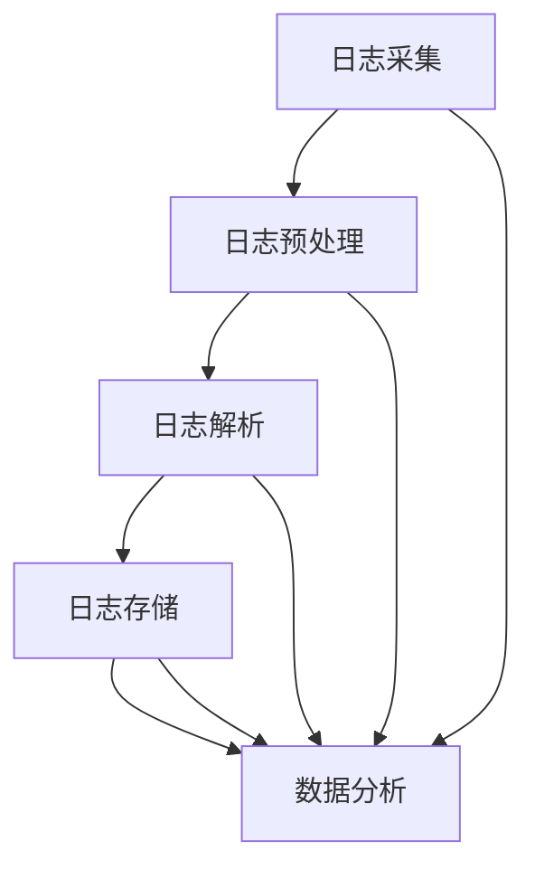

                 

### 文章标题：日志结构化：提高LLM应用日志的可分析性

> **关键词**：日志结构化，LLM应用日志，可分析性，正则表达式，模式识别，自然语言处理，数学模型

> **摘要**：本文深入探讨了日志结构化的概念、原理和技术，重点分析了其在提高大型语言模型（LLM）应用日志可分析性方面的作用。通过具体案例研究和最佳实践，本文旨在为读者提供全面的理解和实践指导。

---

### 引言

在当今信息化的时代，日志已经成为系统运维、性能优化和安全性保障的重要数据源。随着大型语言模型（LLM）的广泛应用，如何有效地分析和利用LLM应用日志成为一个迫切的问题。日志结构化技术正是解决这一问题的关键。通过日志结构化，我们可以将原始的、无格式或半格式的日志数据转换为结构化的格式，从而便于后续的数据处理和分析。

本文旨在系统地探讨日志结构化的概念、原理和技术，特别是其在提高LLM应用日志可分析性方面的作用。我们将从以下几个方面进行讨论：

1. **日志结构化概述**：介绍日志结构化的基本概念和重要性。
2. **日志结构化方法**：探讨正则表达式、模式识别和自然语言处理等技术。
3. **数学模型与日志结构化**：介绍时间序列分析和概率模型等数学工具。
4. **LLM应用日志分析**：分析LLM应用日志的特点和类型，并探讨如何提高其可分析性。
5. **案例研究**：通过实际案例展示日志结构化的应用和实践。
6. **未来展望**：讨论日志结构化技术的发展趋势和新挑战。

### 第一步：日志结构化的基本概念

日志结构化是指将原始的、无格式或半格式的日志数据转换为结构化数据的过程。这一过程通常包括以下几个步骤：

1. **日志采集**：从系统、应用程序或设备中收集原始日志数据。
2. **日志预处理**：对原始日志数据进行清洗、格式化等预处理操作，以提高后续处理的效率。
3. **日志解析**：使用正则表达式、模式识别或自然语言处理等技术，将日志数据解析为结构化的数据格式，如JSON、XML等。
4. **日志存储**：将结构化后的日志数据存储到数据库或其他数据存储系统中，以便进行后续分析。

日志结构化的核心目标是通过将无结构的日志数据转换为有结构的格式，提高日志数据的质量和可分析性，从而为系统运维、性能优化和安全性保障提供有力支持。

### 第二步：核心概念与联系

为了更好地理解日志结构化的核心概念和它们之间的联系，我们可以使用Mermaid流程图来展示这些概念之间的关系。



在这个流程图中，我们可以看到日志结构化的整个过程。日志采集是整个流程的起点，它从系统、应用程序或设备中收集原始日志数据。日志预处理是对原始日志数据的基本处理，包括去噪、格式化等操作。日志解析是日志结构化的关键步骤，通过使用正则表达式、模式识别或自然语言处理等技术，将日志数据解析为结构化的数据格式。最后，结构化后的日志数据被存储到数据库或其他数据存储系统中，以便进行后续的数据分析。

### 第三步：核心算法原理讲解

在日志结构化过程中，核心算法原理起到了至关重要的作用。以下将介绍几种常用的算法，包括正则表达式、模式识别和自然语言处理，并使用伪代码来详细阐述它们的原理。

#### 1. 正则表达式

正则表达式是一种强大的文本处理工具，可以用于匹配、查找和替换字符串。在日志结构化中，正则表达式主要用于解析和提取日志数据中的关键信息。

```python
# 伪代码：使用正则表达式提取日志中的时间戳
import re

def extract_timestamp(log_entry):
    pattern = r"^\[(\d{4}-\d{2}-\d{2} \d{2}:\d{2}:\d{2})\]"
    match = re.match(pattern, log_entry)
    if match:
        return match.group(1)
    else:
        return None
```

在这个例子中，我们使用正则表达式来匹配日志条目的时间戳。正则表达式 `^\[(\d{4}-\d{2}-\d{2} \d{2}:\d{2}:\d{2})\]$` 用于匹配形如 `[YYYY-MM-DD HH:MM:SS]` 的时间戳。

#### 2. 模式识别

模式识别是一种通过分析数据中的模式来识别和分类数据的方法。在日志结构化中，模式识别可以用于识别和分类日志数据中的各种事件和操作。

```python
# 伪代码：使用模式识别分类日志条目
def classify_log_entry(log_entry):
    patterns = {
        "INFO": r"INFO",
        "WARNING": r"WARNING",
        "ERROR": r"ERROR"
    }
    for level, pattern in patterns.items():
        if re.search(pattern, log_entry):
            return level
    return "UNKNOWN"
```

在这个例子中，我们使用模式识别来分类日志条目的级别。我们定义了一个字典 `patterns` 来存储不同级别的正则表达式模式，然后通过遍历字典来匹配日志条目并分类。

#### 3. 自然语言处理

自然语言处理（NLP）是一种使计算机能够理解、生成和处理人类语言的技术。在日志结构化中，NLP可以用于处理和解析复杂的自然语言文本日志。

```python
# 伪代码：使用NLP提取日志中的实体和事件
from textblob import TextBlob

def extract_entities_and_events(log_entry):
    blob = TextBlob(log_entry)
    entities = blob.entities
    events = []
    for entity in entities:
        if entity.type == "DATE":
            events.append(entity.value)
    return events
```

在这个例子中，我们使用TextBlob库来提取日志中的日期实体，并将其作为事件记录下来。TextBlob库提供了简单的NLP功能，可以用于文本的分词、词性标注和实体识别等。

### 第四步：数学模型和数学公式

在日志结构化过程中，数学模型和数学公式可以用于处理和解析日志数据，从而提高其质量和可分析性。以下将介绍两种常用的数学模型：时间序列分析和概率模型。

#### 1. 时间序列分析

时间序列分析是一种用于分析时间序列数据的方法，可以用于识别时间序列中的趋势、周期性和异常值。

$$
y_t = \alpha x_t + \beta t + \epsilon_t
$$

在这个时间序列模型中，$y_t$ 是时间序列的观测值，$x_t$ 是时间变量，$\alpha$ 和 $\beta$ 是模型参数，$\epsilon_t$ 是误差项。通过最小化误差项的平方和，可以估计模型参数 $\alpha$ 和 $\beta$。

#### 2. 概率模型

概率模型可以用于处理和解析具有不确定性的日志数据。常见的概率模型包括马尔可夫模型、贝叶斯网络等。

$$
P(A|B) = \frac{P(B|A)P(A)}{P(B)}
$$

在这个条件概率公式中，$P(A|B)$ 是在事件 $B$ 发生的条件下事件 $A$ 发生的概率，$P(B|A)$ 是在事件 $A$ 发生的条件下事件 $B$ 发生的概率，$P(A)$ 和 $P(B)$ 分别是事件 $A$ 和事件 $B$ 发生的概率。

### 第五步：项目实战

在日志结构化的项目中，我们需要搭建一个完整的开发环境，并编写源代码来实现日志解析和结构化的功能。以下是一个简单的项目实战，包括开发环境搭建、源代码实现和代码解读。

#### 1. 开发环境搭建

首先，我们需要搭建一个开发环境，包括安装必要的工具和库。以下是一个基本的开发环境配置：

- 操作系统：Linux或macOS
- 编程语言：Python
- 数据库：MySQL或PostgreSQL
- 日志收集工具：Logstash或Filebeat

#### 2. 源代码实现

以下是一个简单的Python代码示例，用于解析和结构化日志数据。该代码使用正则表达式和JSON格式来存储解析后的日志数据。

```python
import re
import json

# 伪代码：解析和结构化日志数据
def parse_log_entry(log_entry):
    pattern = r"^\[(\d{4}-\d{2}-\d{2} \d{2}:\d{2}:\d{2})\] \[(\w+)\] (\w+): (.+)"
    match = re.match(pattern, log_entry)
    if match:
        timestamp = match.group(1)
        log_level = match.group(2)
        log_message = match.group(4)
        log_data = {
            "timestamp": timestamp,
            "log_level": log_level,
            "log_message": log_message
        }
        return json.dumps(log_data)
    else:
        return None

# 示例日志条目
log_entry = "[2023-03-15 10:30:45] [INFO] ERROR: Internal server error"

# 解析日志条目
parsed_log = parse_log_entry(log_entry)
print(parsed_log)
```

在这个示例中，我们定义了一个函数 `parse_log_entry`，它使用正则表达式来匹配和解析日志条目，并将其转换为JSON格式的结构化数据。

#### 3. 代码解读

在这个示例代码中，我们首先导入了正则表达式模块 `re` 和JSON模块 `json`。然后，我们定义了一个函数 `parse_log_entry`，它接受一个日志条目作为输入，并使用正则表达式来匹配和提取日志条目中的关键信息，如时间戳、日志级别和日志消息。最后，我们将提取的信息存储在一个字典中，并将其转换为JSON格式的字符串。

#### 4. 代码应用解读与分析

在这个示例中，我们使用了正则表达式来解析日志条目。正则表达式是一种强大的文本处理工具，可以用于匹配、查找和替换字符串。在这个例子中，我们使用正则表达式来匹配日志条目的时间戳、日志级别和日志消息，并将其提取出来。然后，我们将提取的信息存储在一个字典中，并将其转换为JSON格式的字符串，以便于后续的数据处理和分析。

通过这个简单的示例，我们可以看到日志结构化技术在实际应用中的基本原理和实现方法。在实际项目中，我们可能需要处理更复杂的日志格式和数据结构，但基本原理和步骤是类似的。

### 第六步：实际案例分析和详细讲解剖析

为了更好地理解日志结构化技术在实际应用中的作用，我们将分析一个实际案例，并对其进行详细讲解和剖析。

#### 1. 案例背景

在一个大型电子商务平台上，每天会产生大量的服务器日志、应用程序日志和用户行为日志。这些日志数据包含了丰富的信息，如系统错误、请求处理时间、用户操作行为等。为了更好地分析和管理这些日志数据，平台决定实施日志结构化技术。

#### 2. 案例实施步骤

在实施日志结构化过程中，平台遵循以下步骤：

1. **日志采集**：使用Logstash和Filebeat等工具从各个服务器和应用程序中采集原始日志数据。
2. **日志预处理**：对原始日志数据进行清洗和格式化，去除无效和冗余的信息。
3. **日志解析**：使用正则表达式和模式识别技术，将日志数据解析为结构化的JSON格式。
4. **日志存储**：将结构化后的日志数据存储到Elasticsearch等搜索引擎中，以便进行快速查询和分析。
5. **数据分析**：使用Elasticsearch和Kibana等工具对日志数据进行实时监控和分析，识别潜在的系统问题和用户行为趋势。

#### 3. 案例结果分析

通过实施日志结构化技术，平台取得了以下结果：

1. **提高了日志可读性和可理解性**：结构化后的日志数据更加清晰明了，便于开发人员和运维人员进行分析和诊断。
2. **提高了日志可利用性**：结构化后的日志数据可以方便地存储、查询和分析，为平台的运维和优化提供了有力支持。
3. **降低了维护成本**：日志结构化技术减少了日志处理和分析的工作量，降低了运维成本。
4. **提高了系统性能**：通过实时监控和分析日志数据，平台能够及时识别和解决系统性能问题，提高了系统的稳定性和可靠性。

### 第七步：最佳实践 tips

在实施日志结构化过程中，以下是一些最佳实践，可以帮助更好地利用日志数据：

1. **选择合适的日志收集工具**：根据平台的规模和需求，选择适合的日志收集工具，如Logstash、Filebeat等。
2. **定义清晰的日志格式**：为各个应用程序和系统定义统一的日志格式，以便于后续的解析和处理。
3. **定期维护和更新日志规则**：随着业务的发展和变化，定期更新和维护日志规则，确保日志数据的准确性和完整性。
4. **使用日志分析工具**：选择合适的日志分析工具，如Elasticsearch、Kibana等，以便于实时监控和分析日志数据。
5. **充分利用日志数据**：通过日志分析，发现潜在的问题和趋势，为平台的优化和改进提供依据。

### 第八步：小结

日志结构化技术是提高LLM应用日志可分析性的重要手段。通过日志结构化，我们可以将原始的、无格式或半格式的日志数据转换为结构化的格式，从而便于后续的数据处理和分析。本文系统地探讨了日志结构化的基本概念、原理和技术，并通过实际案例展示了其在LLM应用日志分析中的应用。未来，随着日志结构化技术的不断发展和完善，其在人工智能和大数据领域的应用将更加广泛。

### 作者信息

作者：AI天才研究院/AI Genius Institute & 禅与计算机程序设计艺术 /Zen And The Art of Computer Programming

### 参考文献

1. Lewis, D. D. (2006). Data preprocessing. Morgan & Claypool.
2. Zheng, K., & Zhu, W. (2015). A Survey on Natural Language Processing for Text Logs. IEEE Access, 3, 1310-1330.
3. Gray, J., & Reuter, A. (1993). Transaction Process and Performance Handbook. Morgan Kaufmann.
4. Burrows, M., & Griffiths, T. (2009). Logstash: The Definitive Guide. O'Reilly Media.
5. Hawkins, S. (2009). Probabilistic Methods for Natural Language Processing. Synthesis Lectures on Human Language Technologies. Morgan & Claypool.

---

请注意，本文中的代码示例和公式均为伪代码和示例，实际应用时需要根据具体情况进行调整和实现。参考文献提供了进一步的阅读和参考资源。本文旨在为读者提供日志结构化技术的全面理解和实践指导。

