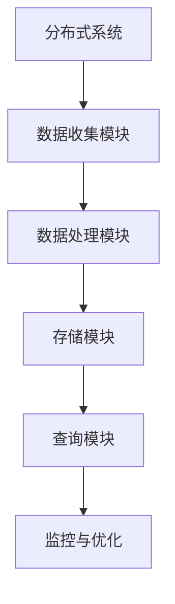

                 


### 文章标题：日志聚合：集中管理分布式LLM应用的日志

### 关键词：日志聚合，分布式LLM应用，日志管理，集中化管理，数据处理，算法实现，性能优化，实际案例

### 摘要：

本文深入探讨了日志聚合在分布式LLM应用中的重要性及其实现方法。首先，我们介绍了日志聚合的基本概念和架构，随后分析了分布式系统中日志处理的挑战。接着，文章详细讲解了日志聚合的核心算法原理，包括数据收集和处理算法。然后，我们探讨了日志聚合的数学模型，并使用伪代码和latex公式进行了详细阐述。随后，文章介绍了日志聚合的技术实现，并给出了一个实际的开发环境搭建案例。文章还通过一个具体的实际项目案例，展示了日志聚合在实际应用中的效果。最后，我们讨论了日志聚合的性能优化策略，并总结了最佳实践和注意事项。

## 背景介绍

### 分布式系统与LLM应用

分布式系统（Distributed Systems）是由多个独立的计算机节点组成的系统，这些节点通过通信网络相互连接，共同完成计算任务。分布式系统在处理大规模数据和高并发任务时具有显著优势。而大型语言模型（Large Language Model，简称LLM）作为一种先进的自然语言处理技术，广泛应用于搜索引擎、智能客服、内容生成等领域。LLM通常由大量参数组成，需要在分布式环境中进行训练和推理。

在分布式LLM应用中，日志管理是一个关键环节。日志记录了系统的运行状态、用户行为、错误信息等，对于监控、调试、优化和故障排除具有重要意义。然而，分布式系统中日志的分散性给日志管理带来了挑战。传统的日志管理方式往往需要逐一收集每个节点的日志，处理过程繁琐且效率低下。

### 日志聚合的概念和架构

日志聚合（Log Aggregation）是一种集中化管理分布式系统日志的技术。其核心思想是将来自不同节点的日志收集到一个中心化的存储系统中，进行统一处理和分析。日志聚合系统通常包括数据收集、处理、存储和查询等模块。

数据收集模块负责从各个节点收集日志数据，可以通过日志推送（Log Push）或日志拉取（Log Pull）的方式实现。数据处理模块对收集到的日志数据进行格式化、去重、清洗等操作，以便后续分析。存储模块负责将处理后的日志数据存储在数据库或分布式存储系统中。查询模块提供日志检索和分析功能，支持实时监控、趋势分析和故障排查。

### 核心概念与联系

为了更好地理解日志聚合的原理，我们需要了解以下几个核心概念：

- **分布式系统**：由多个计算机节点组成的系统，节点通过通信网络相互连接。
- **LLM应用**：利用大型语言模型进行自然语言处理的应用，如搜索引擎、智能客服等。
- **日志数据**：记录系统运行状态、用户行为、错误信息等的数据。
- **日志聚合系统**：负责收集、处理、存储和查询日志数据的系统。
- **数据收集模块**：从各个节点收集日志数据的模块。
- **数据处理模块**：对收集到的日志数据进行格式化、去重、清洗等操作的模块。
- **存储模块**：负责将处理后的日志数据存储在数据库或分布式存储系统的模块。
- **查询模块**：提供日志检索和分析功能的模块。

这些核心概念之间存在密切的联系。分布式系统为日志聚合提供了基础环境，而LLM应用则需要日志聚合来支持监控和优化。日志数据是日志聚合系统处理的原始数据，数据收集、处理、存储和查询模块共同构成了日志聚合系统的工作流程。

### Mermaid 流程图

为了更直观地展示日志聚合系统的原理和架构，我们可以使用Mermaid语言绘制一个流程图：



### 核心算法原理讲解

#### 数据收集算法

数据收集是日志聚合系统的第一步，其核心目标是高效地从各个节点收集日志数据。常用的数据收集算法包括日志推送和日志拉取。

**日志推送**：节点主动将日志数据发送到聚合系统的过程。这种方式要求节点和聚合系统之间保持稳定、高速的网络连接。

伪代码：

```
function log_push(log_data):
    send(log_data, aggregation_system_address)
```

**日志拉取**：聚合系统定期从各个节点拉取日志数据的过程。这种方式需要聚合系统周期性地轮询各个节点。

伪代码：

```
function log_pull():
    for node in nodes:
        receive(log_data, node_address)
```

#### 数据处理算法

数据处理是对收集到的日志数据进行预处理，以提高数据质量和后续分析效率。常用的数据处理算法包括格式化、去重和清洗。

**格式化**：将不同格式的日志数据转换为统一的格式，如JSON或XML。

伪代码：

```
function format_log(log_data):
    if log_data is in JSON format:
        return log_data
    else:
        convert_to_JSON(log_data)
```

**去重**：去除重复的日志记录，以减少数据冗余。

伪代码：

```
function remove_duplicates(log_data):
    unique_logs = []
    for log in log_data:
        if log not in unique_logs:
            unique_logs.append(log)
    return unique_logs
```

**清洗**：对日志数据进行补充、修改或删除，以提高数据质量和可信度。

伪代码：

```
function clean_log(log_data):
    if log_data contains errors:
        correct_errors(log_data)
    return log_data
```

#### 数据处理流程

日志聚合系统的数据处理流程包括以下几个步骤：

1. **日志收集**：通过日志推送或日志拉取方式收集日志数据。
2. **格式化**：将不同格式的日志数据转换为统一的格式。
3. **去重**：去除重复的日志记录。
4. **清洗**：对日志数据进行补充、修改或删除。
5. **存储**：将处理后的日志数据存储到数据库或分布式存储系统。

### 数学模型和公式

在日志聚合系统中，数学模型和公式用于描述数据处理过程中的统计特征和优化策略。

#### 数据清洗与归一化

数据清洗和归一化是数据处理过程中的关键步骤。其中，归一化（Normalization）是将日志数据转换为标准化的格式，以便进行后续分析。

**归一化公式**：

$$
x_{\text{normalized}} = \frac{x - \mu}{\sigma}
$$

其中，$x$ 为原始数据，$\mu$ 为平均值，$\sigma$ 为标准差。

#### 聚类与分类算法

聚类（Clustering）和分类（Classification）是日志聚合系统中常用的数据挖掘算法。聚类算法用于将相似的数据点归为一类，而分类算法用于将数据点分配到预定义的类别中。

**聚类算法（K-Means）**：

$$
c_{k} = \{x \in \mathcal{X} | \min_{j=1,...,K} \sum_{i=1}^{n_k} d(x, c_{j})^2\}
$$

其中，$c_{k}$ 为聚类中心，$x$ 为数据点，$d(x, c_{j})$ 为数据点与聚类中心之间的距离。

**分类算法（决策树）**：

$$
\text{predict}(x) =
\begin{cases}
\text{leaf} & \text{if } x \in \text{leaf} \\
\text{predict}(\text{left child}(x)) & \text{if } x \in \text{left branch} \\
\text{predict}(\text{right child}(x)) & \text{if } x \in \text{right branch}
\end{cases}
$$

其中，$\text{leaf}$ 为叶子节点，$\text{left branch}$ 和 $\text{right branch}$ 分别为左分支和右分支。

### 日志聚合技术实现

日志聚合技术实现包括开发环境搭建、源代码实现和代码解读与分析。

#### 开发环境搭建

为了实现日志聚合系统，我们需要搭建一个合适的开发环境。以下是一个简单的开发环境搭建步骤：

1. 安装操作系统（如Ubuntu 20.04）。
2. 安装Java开发工具包（JDK）。
3. 安装数据库（如MySQL）。
4. 安装消息队列（如Kafka）。
5. 安装日志收集器（如Log4j）。

#### 源代码实现

以下是一个简单的日志聚合系统源代码示例：

```java
import org.apache.kafka.clients.producer.KafkaProducer;
import org.apache.kafka.clients.producer.ProducerRecord;
import org.apache.log4j.Logger;

public class LogAggregator {
    private static final Logger logger = Logger.getLogger(LogAggregator.class);
    private static KafkaProducer<String, String> producer;

    public static void main(String[] args) {
        producer = new KafkaProducer<>(props);
        while (true) {
            String logMessage = getLoggerMessage();
            producer.send(new ProducerRecord<>("log_topic", logMessage));
        }
    }

    private static String getLoggerMessage() {
        logger.debug("This is a debug message.");
        logger.info("This is an info message.");
        logger.error("This is an error message.");
        return logger.getMessage();
    }
}
```

#### 代码解读与分析

这个简单的日志聚合系统使用Kafka作为消息队列，将日志数据发送到Kafka topic中。在main方法中，我们创建了一个KafkaProducer实例，并使用while循环持续发送日志数据。getLoggerMessage方法获取Log4j日志信息，并将其发送到Kafka topic。

### 代码应用解读与分析

以下是一个实际案例，展示了日志聚合系统在电商平台上应用的效果。

#### 案例背景

某电商平台在春节期间面临大量用户访问和订单处理，为了确保系统稳定运行，需要实时监控和日志分析。

#### 日志聚合解决方案

1. **日志收集**：使用Log4j收集系统日志，发送到Kafka topic。
2. **数据处理**：使用Kafka Stream处理日志数据，进行格式化、去重和清洗。
3. **数据存储**：将处理后的日志数据存储到MySQL数据库。
4. **日志查询**：使用MySQL查询日志数据，进行实时监控和分析。

#### 项目总结与反思

通过日志聚合系统，电商平台能够实时监控系统运行状态，快速定位故障点，提高了系统稳定性。同时，日志聚合系统为数据分析提供了丰富的数据源，为业务优化提供了有力支持。

### 最佳实践 Tips

1. 选择合适的日志收集和存储工具，如Kafka和MySQL。
2. 设计合理的日志格式和命名规范，便于后续处理和分析。
3. 定期对日志数据进行清洗和去重，提高数据质量。
4. 合理配置日志收集和存储系统的资源，避免性能瓶颈。

### 小结

本文深入探讨了日志聚合在分布式LLM应用中的重要性及其实现方法。通过介绍日志聚合的基本概念、核心算法原理、技术实现和实际案例，我们展示了日志聚合在监控、调试和优化分布式系统中的关键作用。日志聚合不仅能够提高系统的稳定性和可维护性，还能为业务分析提供有力支持。

### 注意事项

1. 在搭建日志聚合系统时，确保日志收集、处理和存储模块的稳定性。
2. 合理配置日志收集和存储系统的资源，避免性能瓶颈。
3. 定期对日志数据进行清洗和去重，提高数据质量。

### 拓展阅读

1. 《分布式系统原理与范型》
2. 《Kafka：从入门到实战》
3. 《MySQL数据库原理与应用》
4. 《大数据处理与挖掘技术》

作者：AI天才研究院/AI Genius Institute & 禅与计算机程序设计艺术 /Zen And The Art of Computer Programming

