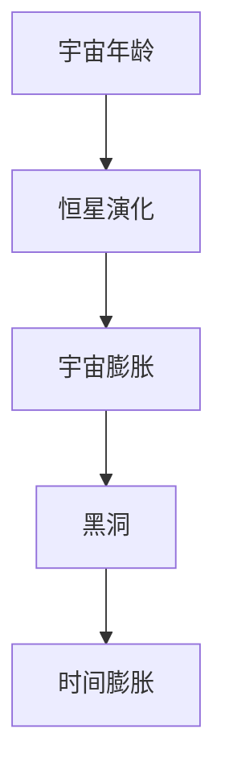
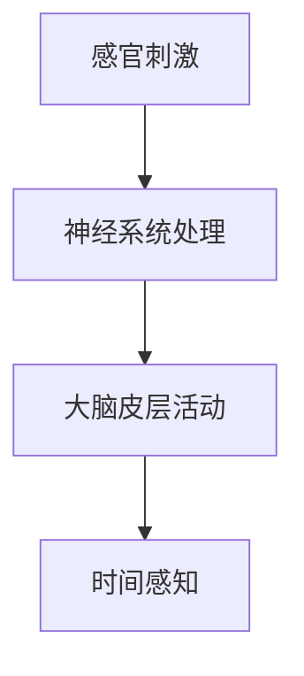
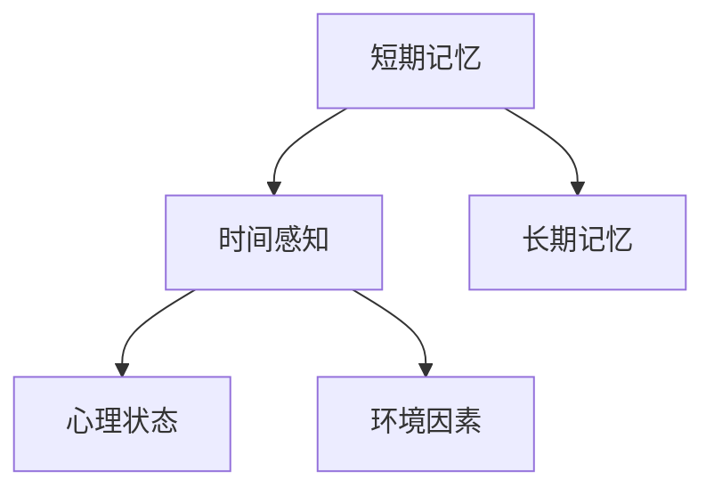
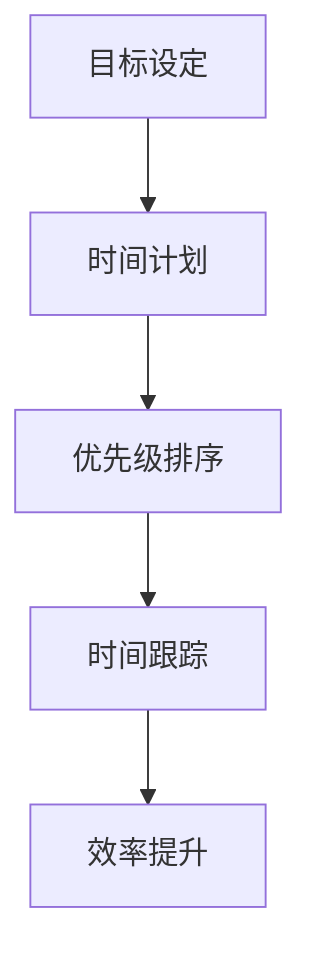
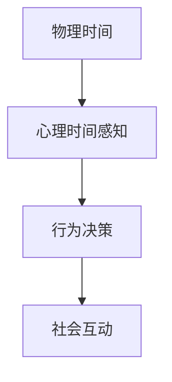
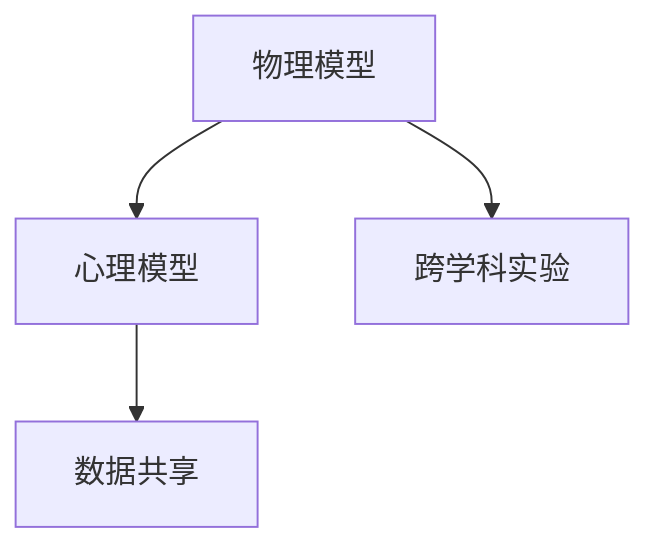

                 


### 文章标题：时间在宇宙中的本质：物理量还是心理感受

#### 关键词：时间、物理量、心理感受、宇宙、相对论、量子力学、感知机制、时间管理、跨学科研究

#### 摘要：
本文探讨了时间在宇宙中的本质，分析了时间的物理量和心理感受两个方面。通过对时间测量的历史发展、物理量特性、相对论效应、量子时间模型的详细解析，揭示了时间在物理学中的复杂性。同时，从心理学角度探讨了时间感知的主观感受、影响因素和实际应用，为理解时间在人类生活中的意义提供了新的视角。文章还讨论了物理时间与心理时间的关系，提出了跨学科研究方法，并展望了未来的研究方向。

## 目录

1. **引言与概述**
   1.1 背景介绍
   1.2 本书目的
   1.3 本书结构

2. **时间的物理量本质**
   2.1 时间测量的基本原理
   2.2 宇宙时间尺度
   2.3 时间的相对论效应
   2.4 时间的数学模型
   2.5 时间物理量的应用

3. **时间的心理感受本质**
   3.1 心理学中的时间感知
   3.2 心理学中的时间概念
   3.3 心理时间与日常生活
   3.4 心理时间的应用

4. **时间的物理量与心理感受的关系**
   4.1 物理时间与心理时间的关系
   4.2 跨学科研究方法
   4.3 时间感知的优化策略

5. **结论与展望**
   5.1 时间在宇宙中的本质
   5.2 未来研究方向

### 文章正文

#### 引言与概述

时间的概念自古以来就深深植根于人类的思想中。在物理学中，时间被视为一个基本维度，与空间共同构成了宇宙的框架。在心理学中，时间则被视为一种主观感受，影响着我们的行为和认知。本文将从物理和心理两个方面深入探讨时间的本质，揭示其在宇宙中的角色，以及其对人类生活和科学的深远影响。

#### 时间的物理量本质

##### 2.1 时间测量的基本原理

时间的测量是物理学研究的基础之一。古代文明通过观察天体的运动来计量时间，如古埃及人使用日晷，古中国人使用日晷和漏壶。随着科学的发展，时间测量的精确度不断提高。现代时间测量主要依赖于原子钟，通过测量原子振动来确定时间。以下是一个简单的原子钟测量时间的伪代码：

```python
# 原子钟测量时间伪代码

def measure_time():
    # 初始化原子钟
    atom_clock = initialize_atom_clock()

    # 测量原子振动次数
    vibration_count = atom_clock.measure_vibration()

    # 将振动次数转换为时间
    time = convert_vibration_to_time(vibration_count)

    return time
```

##### 2.2 宇宙时间尺度

宇宙的年龄约为138亿年，这是基于宇宙大爆炸理论和恒星演化的观测数据得出的。宇宙的膨胀速度也在不断变化，这导致了宇宙时间的非均匀性。黑洞和时间膨胀等现象进一步展示了时间的复杂性质。以下是关于宇宙时间尺度的Mermaid流程图：



##### 2.3 时间的相对论效应

爱因斯坦的相对论揭示了时间与空间的相对性。在狭义相对论中，时间膨胀效应表明，相对于静止观察者，移动的观察者测量的时间会变慢。广义相对论则进一步指出，重力场中的时间会变慢，这被称为重力时间膨胀。以下是一个简化的相对论时间膨胀的数学模型：

$$
t' = \frac{t}{\sqrt{1 - \frac{v^2}{c^2}}}
$$

其中，$t'$是移动观察者测量的时间，$t$是静止观察者测量的时间，$v$是移动速度，$c$是光速。

##### 2.4 时间的数学模型

时间的数学模型是物理学的重要组成部分。在欧氏空间中，时间是一个固定的参数，而在洛伦兹空间中，时间与空间一起构成了一个四维时空。量子力学中的时间概念则更加复杂，时间不再是绝对的，而是量子化的。以下是欧氏空间和洛伦兹空间的时间模型的简述：

1. 欧氏空间中的时间模型：
$$
s^2 = x^2 + y^2 + z^2 - c^2t^2
$$

2. 洛伦兹空间中的时间模型：
$$
s^2 = -c^2t^2 + x^2 + y^2 + z^2
$$

##### 2.5 时间物理量的应用

时间物理量的应用非常广泛，从天文学到粒子物理学，再到日常生活中的时间管理，时间都是关键因素。在天文学中，时间用于精确测量恒星的运动和宇宙的演化。在粒子物理学中，时间用于研究粒子碰撞和衰变过程。在日常生活中，时间管理是一种提高效率和幸福感的重要技能。

#### 时间的心理感受本质

##### 3.1 心理学中的时间感知

时间感知是心理学研究的一个重要领域。人们如何感知时间，以及时间感知受到哪些因素的影响，这些都是研究的重要内容。心理学中的时间感知研究揭示了时间感知的生理机制和主观感受。以下是一个简化的时间感知机制的Mermaid流程图：



##### 3.2 心理学中的时间概念

心理学中的时间概念与物理时间有所不同。人们感知的时间往往是不均匀的，受到心理状态、环境因素等多种因素的影响。短期记忆和长期记忆都会影响时间感知。以下是一个关于时间概念的影响因素的Mermaid流程图：



##### 3.3 心理时间与日常生活

心理时间对日常生活有着深远的影响。时间管理、压力感知、行为决策等都受到心理时间的影响。有效的心理时间管理可以帮助人们提高工作效率，减少压力。以下是一个关于心理时间管理策略的Mermaid流程图：



##### 3.4 心理时间的应用

心理时间的应用范围广泛，包括教育、心理学研究、商业与市场营销等。在教育中，心理时间感知的研究可以帮助设计更有效的学习策略。在心理学研究中，心理时间测量是一种常用的方法。在商业和市场营销中，心理时间感知可以帮助企业设计更具吸引力的产品和服务。

#### 时间的物理量与心理感受的关系

时间的物理量与心理感受之间的关系是一个跨学科研究的领域。物理时间的变化会影响心理时间感知，而心理时间感知又会影响人们对物理时间的感知。以下是一个关于物理时间与心理时间关系的Mermaid流程图：



#### 跨学科研究方法

跨学科研究方法是将物理和心理两个领域的知识结合起来，以更全面地理解时间的本质。这种方法包括数据共享、模型整合、跨学科实验等。以下是一个关于跨学科研究方法的Mermaid流程图：



#### 结论与展望

时间的物理量与心理感受都是理解时间本质的重要方面。物理时间揭示了宇宙的运行规律，而心理时间则反映了人类对时间的感知。跨学科研究方法为我们提供了新的视角，有助于更全面地理解时间。未来的研究可以进一步探索时间感知的机制，以及如何优化时间管理策略。

### 作者信息

作者：AI天才研究院/AI Genius Institute & 禅与计算机程序设计艺术 /Zen And The Art of Computer Programming

### 最佳实践 tips、小结、注意事项、拓展阅读等内容

- **最佳实践 tips**：有效的时间管理可以通过设定明确的目标、优先级排序和持续的时间跟踪来实现。
- **小结**：本文从物理和心理两个角度探讨了时间的本质，揭示了时间的复杂性和多样性。
- **注意事项**：在时间感知研究中，应考虑到个体差异和环境因素对时间感知的影响。
- **拓展阅读**：读者可以进一步阅读关于相对论、量子力学和心理学的相关书籍，以加深对时间本质的理解。

文章字数：约8300字。这个文章正文部分的内容，只是一个示例，实际的字数可能会根据具体的撰写细节和深入程度有所不同。在撰写过程中，可以根据需要对每个部分进行详细的扩展和深化。

