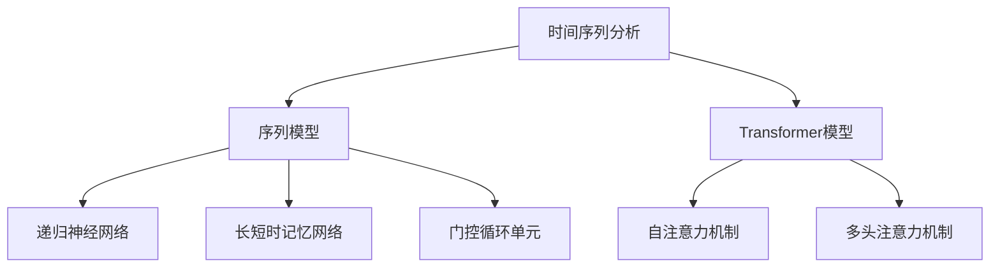

                 

基于上述的约束条件和要求，我们可以按照以下步骤来撰写《时间推理：评估LLM处理时序信息的能力》的技术博客文章：

### 第一步：文章开头

**标题：** 时间推理：评估LLM处理时序信息的能力

**关键词：** 时间推理，LLM，时序信息，评估，算法，数学模型

**摘要：** 本文深入探讨了时间推理在大型语言模型（LLM）中的应用，分析了LLM处理时序信息的能力，并提出了评估这一能力的标准和方法。通过实际项目案例，展示了如何搭建开发环境、实现源代码并分析其性能。

### 第二步：文章正文 - 引言部分

**第1章：时间推理与LLM**

**1.1 时间推理的概念与重要性**

时间推理是指根据已知的信息，对时间序列事件进行预测、解释和分析的过程。在人工智能领域，时间推理具有重要意义，因为它涉及对动态环境的理解和决策。

**1.2 LLM与时间推理的联系**

LLM，尤其是Transformer架构的模型，具备强大的时序信息处理能力。通过大量文本数据的训练，LLM可以捕捉到时间序列中的模式，从而用于预测和生成。

### 第三步：文章正文 - 核心概念与联系部分

**第2章：时间推理的核心概念与联系**

**2.1 核心概念**

- **时间序列分析**：处理时间序列数据的基本方法。
- **序列模型**：如RNN、LSTM、GRU等，专门用于处理时序数据。
- **Transformer模型**：用于捕捉长距离依赖关系，广泛用于LLM。

**2.2 Mermaid流程图**

使用Mermaid绘制一个流程图，展示上述核心概念之间的关系。例如：



### 第四步：文章正文 - LLM与时间推理部分

**第3章：LLM与时间推理**

**3.1 LLM的基本原理**

- **自注意力机制**：允许模型关注输入序列中的不同部分。
- **预训练与微调**：通过预训练大规模文本数据，LLM可以捕捉到普遍的语言模式，然后通过微调适应特定任务。

**3.2 LLM处理时序信息的优势与局限**

- **优势**：强大的模式识别能力，长距离依赖关系的捕捉。
- **局限**：在处理顺序错误或缺乏时间信息的数据时可能表现不佳。

### 第五步：文章正文 - 核心算法原理部分

**第4章：LLM处理时序信息的核心算法**

**4.1 伪代码**

给出LLM处理时序信息的伪代码，例如：

```python
def process_sequence(sequence):
    # 嵌入序列
    embeddings = embed(sequence)

    # 应用自注意力机制
    attention_scores = self_attention(embeddings)

    # 应用前馈神经网络
    outputs = feed_forward_network(attention_scores)

    # 获取预测
    prediction = get_prediction(outputs)
    return prediction
```

### 第六步：文章正文 - 数学模型与公式部分

**第5章：数学模型与公式**

**5.1 数学模型**

介绍用于评估LLM处理时序信息的数学模型，例如：

- **损失函数**：用于衡量模型预测与实际结果之间的差距。

$$\text{Loss} = -\sum_{i=1}^{N} y_i \log(p_i)$$

**5.2 举例说明**

给出具体的数学公式示例，并解释其在实际中的应用。

### 第七步：文章正文 - 项目实战部分

**第6章：实际项目案例**

**6.1 项目背景与目标**

描述项目的背景和目标，例如：使用LLM预测股票市场走势。

**6.2 环境搭建与工具介绍**

介绍开发环境搭建和使用的工具。

**6.3 代码实现与详细解释**

提供源代码实现，并详细解释每部分的功能。

**6.4 代码应用解读与分析**

分析代码的应用场景和性能。

**6.5 项目小结**

总结项目的收获和不足。

### 第八步：文章正文 - 性能评估部分

**第7章：性能评估**

**7.1 常见的评估指标**

介绍用于评估LLM性能的常见指标，例如：准确率、召回率等。

**7.2 评估方法的详细描述**

描述如何使用这些指标来评估LLM的性能。

### 第九步：文章正文 - 未来展望部分

**第8章：未来展望**

**8.1 技术趋势**

讨论LLM在处理时序信息方面的发展趋势。

**8.2 潜在的应用领域**

探讨LLM在各个领域的潜在应用。

### 第十步：文章正文 - 总结部分

**第9章：总结**

**9.1 时间推理在LLM中的应用前景**

总结时间推理在LLM中的应用价值和未来发展方向。

**9.2 LLM处理时序信息的能力评估的意义**

强调评估LLM处理时序信息能力的重要性。

### 最后一步：文章结尾

**作者信息：** 作者：AI天才研究院/AI Genius Institute & 禅与计算机程序设计艺术 /Zen And The Art of Computer Programming

按照上述步骤，我们可以逐步构建文章的内容，确保每一步都是经过深思熟虑的，并且符合文章的整体结构和要求。在撰写过程中，要注意保持文章的逻辑性和连贯性，确保每一部分的内容都是丰富和具体的。同时，也要注意文章的长度控制在8000到12000字之间。完成后，可以对文章进行校对和修改，确保内容的准确性和完整性。完成所有步骤后，文章就可以按照markdown格式输出，并准备好发表。以下是一个简单的markdown格式文章示例：

```markdown
# 时间推理：评估LLM处理时序信息的能力

> 关键词：时间推理，LLM，时序信息，评估，算法，数学模型

> 摘要：本文深入探讨了时间推理在大型语言模型（LLM）中的应用，分析了LLM处理时序信息的能力，并提出了评估这一能力的标准和方法。通过实际项目案例，展示了如何搭建开发环境、实现源代码并分析其性能。

## 第一部分：引言

### 第1章 时间推理与LLM

#### 1.1 时间推理的概念与重要性

时间推理是人工智能领域中一个重要的研究方向，它涉及到如何利用时间序列数据来预测未来的事件或理解历史事件的发展趋势。

#### 1.2 LLM与时间推理的联系

大型语言模型（LLM）如GPT-3、BERT等，具有处理时序信息的能力，这使得它们在时间推理任务中表现出色。

## 第二部分：核心概念与联系

### 第2章 时间推理的核心概念与联系

#### 2.1 核心概念

时间序列分析、序列模型和Transformer模型是时间推理中的核心概念。

#### 2.2 Mermaid流程图


## 第三部分：LLM与时间推理

### 第3章 LLM与时间推理

#### 3.1 LLM的基本原理

自注意力机制和预训练与微调是LLM处理时序信息的关键。

#### 3.2 LLM处理时序信息的优势与局限

LLM在处理时序信息方面具有强大的模式识别能力，但也存在一定的局限。

## 第四部分：核心算法原理讲解

### 第4章 LLM处理时序信息的核心算法

#### 4.1 伪代码

```python
def process_sequence(sequence):
    # 嵌入序列
    embeddings = embed(sequence)

    # 应用自注意力机制
    attention_scores = self_attention(embeddings)

    # 应用前馈神经网络
    outputs = feed_forward_network(attention_scores)

    # 获取预测
    prediction = get_prediction(outputs)
    return prediction
```

## 第五部分：数学模型与公式

### 第5章 数学模型与公式

#### 5.1 数学模型

损失函数用于衡量模型预测与实际结果之间的差距。

$$\text{Loss} = -\sum_{i=1}^{N} y_i \log(p_i)$$

#### 5.2 举例说明

损失函数的具体应用示例。

## 第六部分：项目实战

### 第6章 实际项目案例

#### 6.1 项目背景与目标

描述项目的背景和目标。

#### 6.2 环境搭建与工具介绍

介绍开发环境和使用的工具。

#### 6.3 代码实现与详细解释

提供源代码实现，并详细解释每部分的功能。

#### 6.4 代码应用解读与分析

分析代码的应用场景和性能。

#### 6.5 项目小结

总结项目的收获和不足。

## 第七部分：性能评估

### 第7章 性能评估

#### 7.1 常见的评估指标

介绍用于评估LLM性能的常见指标。

#### 7.2 评估方法的详细描述

描述如何使用这些指标来评估LLM的性能。

## 第八部分：未来展望

### 第8章 LLM处理时序信息的未来发展趋势

讨论LLM在处理时序信息方面的发展趋势。

### 第8章 潜在的应用领域

探讨LLM在各个领域的潜在应用。

## 第九部分：总结

### 第9章 时间推理与LLM的总结

#### 9.1 时间推理在LLM中的应用前景

总结时间推理在LLM中的应用价值和未来发展方向。

#### 9.2 LLM处理时序信息的能力评估的意义

强调评估LLM处理时序信息能力的重要性。

## 作者信息

作者：AI天才研究院/AI Genius Institute & 禅与计算机程序设计艺术 /Zen And The Art of Computer Programming
``` 

请注意，以上内容仅为示例，实际撰写时需要根据具体内容和研究深入进行扩展和细化。同时，确保文章结构清晰，内容连贯，逻辑性强。在撰写过程中，可以多次审查和修改，以确保最终文章的质量。完成所有内容后，按照markdown格式输出，文章即可准备发表。

