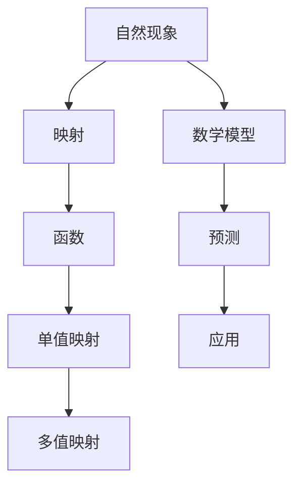

                 

### 文章标题：映射原理：连接自然现象与数学模型

> 关键词：映射原理、自然现象、数学模型、数据分析、应用实践

> 摘要：本文深入探讨了映射原理在自然现象与数学模型之间的连接作用。通过对自然现象的观察与描述，我们引入了数学模型的基本概念，详细解析了函数与映射、微积分等核心原理。然后，本文进一步展示了数学模型在气象、海洋、地震、生物等领域的具体应用，并通过实际案例，展示了映射原理如何帮助我们更好地理解和预测自然现象。最后，本文探讨了映射原理的未来发展及其在科学技术中的应用，提出了面临的挑战和解决方案。

### 目录

1. **引言**  
2. **自然现象的观测与描述**  
   2.1 自然现象的分类  
   2.2 数学模型的概念与作用  
3. **数学模型的基本原理**  
   3.1 函数与映射  
   3.2 微积分基础  
4. **数学模型在自然现象中的应用**  
   4.1 天文学  
   4.2 地球科学  
   4.3 生物科学  
5. **具体自然现象的映射原理**  
   5.1 气象现象的数学模型  
   5.2 海洋现象的数学模型  
   5.3 地球物理现象的数学模型  
   5.4 生物现象的数学模型  
6. **映射原理的应用与发展**  
   6.1 映射原理在科学技术中的应用  
   6.2 映射原理的未来发展与挑战  
7. **结论**  
8. **附录**

### 引言

自然现象是自然界中各种物质和能量的运动和变化过程。这些现象包括天文现象（如太阳黑子、彗星轨道等）、地球科学现象（如地震、火山喷发等）、生物现象（如生态系统的演化、物种的遗传等）以及社会现象（如经济波动、人口增长等）。尽管这些现象千差万别，但它们都有一个共同的特点：可以通过数学模型来描述和预测。

数学模型是一种用于表示现实世界现象的数学表达式或方程式。这些模型可以是简单的函数关系，也可以是复杂的微分方程、差分方程或概率模型。数学模型的作用在于，它能够将复杂的自然现象简化为易于处理的数学问题，从而帮助我们更好地理解和预测这些现象。

映射原理是连接自然现象与数学模型的关键。映射原理指的是，通过一定的数学工具和方法，将自然现象中的复杂关系转化为数学模型中的简单表达式。例如，我们可以通过观测气象数据，建立气压场模型，从而预测未来的天气情况。同样，通过分析海洋流场的数据，我们可以建立海洋生态系统模型，预测海洋环境的动态变化。

本文将深入探讨映射原理在自然现象与数学模型之间的作用。我们将首先介绍自然现象的观测与描述，然后介绍数学模型的基本概念和原理，接着展示数学模型在各个领域的具体应用，并通过实际案例来分析映射原理如何帮助我们理解和预测自然现象。最后，我们将探讨映射原理的未来发展及其面临的挑战。

### 自然现象的观测与描述

自然现象的观测与描述是理解自然界的基础，也是建立数学模型的前提。通过对自然现象的细致观察和系统描述，我们可以发现自然界中的规律和模式，从而为数学模型的构建提供依据。

#### 自然现象的分类

自然现象种类繁多，可以从不同的角度进行分类。以下是几种常见的分类方式：

1. **地球科学现象**：
   - 地质现象：如地震、火山喷发、岩层运动等。
   - 气象现象：如温度变化、降水分布、风场等。
   - 海洋现象：如潮汐、波浪、海洋流等。

2. **天文现象**：
   - 行星运动：如行星轨道、行星对太阳的引力作用等。
   - 星体变化：如太阳黑子、彗星轨道、星系演化等。

3. **生物现象**：
   - 生态现象：如物种分布、生态系统演化、食物链等。
   - 遗传现象：如基因传递、遗传变异、物种适应性等。

4. **社会现象**：
   - 经济现象：如市场波动、投资策略、人口增长等。
   - 社会行为：如社交网络、群体行为、文化传播等。

#### 数学模型的概念与作用

数学模型是一种抽象的表示方法，它通过数学语言和符号，描述自然现象中的关系和规律。一个数学模型通常包括以下几个基本要素：

1. **变量**：表示自然现象中可变化的量。
2. **函数关系**：描述变量之间的依赖关系。
3. **边界条件**：定义模型的适用范围和限制。
4. **初始条件**：模型开始时变量的初始状态。

数学模型的作用主要体现在以下几个方面：

1. **简化复杂现象**：将复杂的自然现象简化为数学表达式，便于分析和理解。
2. **预测未来变化**：通过模型预测自然现象的未来发展趋势和变化。
3. **解释现象机制**：揭示自然现象背后的物理或生物学原理。
4. **优化决策**：为政策制定、资源分配等提供科学依据。

#### 数学模型的基本原理

数学模型的基本原理包括函数、映射、微积分等。下面将简要介绍这些核心概念。

1. **函数**：
   函数是数学中最基本的概念之一，它描述了两个变量之间的关系。在数学模型中，函数用于表示自然现象中的因果关系。例如，温度变化与时间的关系可以用一个函数来描述。

   定义：设 \( A \) 和 \( B \) 是两个非空集合，如果对于 \( A \) 中的任意元素 \( x \)，在 \( B \) 中都有唯一确定的元素 \( y \) 与之对应，则称 \( A \) 到 \( B \) 的映射为函数，记作 \( f: A \rightarrow B \)，其中 \( x \) 称为自变量，\( y \) 称为因变量。

2. **映射**：
   映射是函数的一种推广，它不仅包括单值映射，还包括多值映射。在数学模型中，映射用于表示复杂系统的多对多关系。

   定义：设 \( A \) 和 \( B \) 是两个非空集合，如果对于 \( A \) 中的任意元素 \( x \)，在 \( B \) 中都有至少一个元素 \( y \) 与之对应，则称从 \( A \) 到 \( B \) 的映射为多值映射。

3. **微积分**：
   微积分是研究变化率的数学分支，它在数学模型中起着重要作用。微积分的基本概念包括极限、导数、积分等。

   - 极限：极限是描述函数在某一点附近的变化趋势。
   - 导数：导数表示函数在某一点的变化率。
   - 积分：积分用于计算函数在一定区间内的积累量。

   公式：
   \[
   \lim_{{x \to a}} f(x) = L
   \]
   \[
   f'(x) = \lim_{{h \to 0}} \frac{{f(x+h) - f(x)}}{h}
   \]
   \[
   \int_{a}^{b} f(x) \, dx
   \]

通过上述介绍，我们可以看到，自然现象的观测与描述以及数学模型的基本原理为我们理解和分析自然界提供了有力的工具。在接下来的章节中，我们将进一步探讨数学模型在各个具体领域的应用。

#### 函数与映射的关系与区别

函数和映射是数学模型中两个核心概念，它们之间既有联系又有区别。理解这两个概念之间的关系和区别，对于深入掌握数学模型具有重要意义。

**定义：**
- 函数（Function）：一个函数是一种特殊的映射，它指的是从集合 \( A \) 到集合 \( B \) 的映射，其中对于 \( A \) 中的每个元素，在 \( B \) 中都有唯一确定的元素与之对应。函数通常记作 \( f: A \rightarrow B \)，其中 \( x \) 是自变量，\( y \) 是因变量。
- 映射（Mapping）：映射是一个更广泛的数学概念，它指的是从集合 \( A \) 到集合 \( B \) 的任意形式的对应关系。映射可以是单值的，也可以是多值的；即对于 \( A \) 中的每个元素，在 \( B \) 中可以有唯一确定的元素，也可以有多个元素与之对应。

**关系：**
- 函数是映射的一种特殊情况，即每个元素都只有一个对应的元素。换句话说，所有的函数都是映射，但并非所有的映射都是函数。
- 映射可以看作是函数的泛化，它不仅包括单值映射，还包括多值映射。在数学模型中，映射用于描述复杂系统中的多对多关系。

**区别：**
- **唯一性**：函数强调的是唯一性，即每个自变量对应唯一的因变量；映射则不强调这种唯一性，它可以允许一个自变量对应多个因变量。
- **应用场景**：在简单的情况下，如描述线性关系、二次关系等，函数的使用更加常见；而在复杂系统分析中，如生态模型、经济学模型等，映射的应用更为广泛。

**实际应用中的表现：**
- **函数应用示例**：考虑一个简单的线性函数 \( f(x) = 2x + 1 \)。在这个函数中，对于任意给定的 \( x \)，都能找到唯一确定的 \( y \)。这个函数可以用来描述物体在直线上的运动，其中 \( x \) 表示时间，\( y \) 表示位置。
- **映射应用示例**：考虑一个天气模型中的气压场映射。在这个映射中，不同的区域可能有相同的气压值，这意味着一个气压值可能对应多个地区。这种映射关系可以用来描述大气压力的分布情况，帮助预报天气。

**Mermaid 流程图：**
为了更直观地展示函数与映射的关系，我们可以使用 Mermaid 语言绘制一个简单的流程图。以下是该流程图的表示：



**总结：** 函数和映射是数学模型中重要的概念，函数强调的是一对一的对应关系，而映射则更广泛，允许多对一或多对多的对应关系。在建立数学模型时，我们需要根据实际情况选择合适的映射形式，以便准确描述自然现象中的复杂关系。

### 微积分基础

微积分是研究变化率和积累量的数学分支，它在数学模型中扮演着至关重要的角色。微积分的基本概念包括导数、积分和微分方程，这些概念为分析和预测自然现象提供了强大的工具。

**导数（Derivative）：** 导数描述了函数在某一点的变化率，即函数的瞬时变化率。导数是微积分的核心概念之一，它可以通过极限的方法来定义。

定义：设 \( f(x) \) 是定义在区间 \( I \) 上的函数，点 \( x_0 \in I \) 是函数 \( f(x) \) 的一个可导点。如果极限
\[ 
f'(x_0) = \lim_{{h \to 0}} \frac{{f(x_0 + h) - f(x_0)}}{h} 
\]
存在，则称函数 \( f(x) \) 在点 \( x_0 \) 可导，该极限值称为 \( f(x) \) 在 \( x_0 \) 的导数。

导数的一些重要性质包括：
- 线性性质：若 \( f(x) \) 和 \( g(x) \) 可导，则 \( [af(x) + bg(x)]' = af'(x) + bg'(x) \)，其中 \( a \) 和 \( b \) 是常数。
- 链式法则：若 \( y = f(u) \) 且 \( u = g(x) \)，则 \( \frac{dy}{dx} = \frac{dy}{du} \cdot \frac{du}{dx} \)。

**积分（Integral）：** 积分描述了函数在一定区间内的累积量。定积分是计算函数在区间上的累积和，而反常积分则用于处理更复杂的边界情况。

定义：设 \( f(x) \) 是定义在区间 \([a, b]\) 上的函数，则函数 \( f(x) \) 在区间 \([a, b]\) 上的定积分为
\[ 
\int_{a}^{b} f(x) \, dx = \lim_{{n \to \infty}} \sum_{{i=1}}^{n} f(x_i^*) \, \Delta x 
\]
其中 \( \Delta x = \frac{{b-a}}{n} \)，\( x_i^* \) 是区间 \([x_{i-1}, x_i]\) 上的任意一点。

积分的一些重要性质包括：
- 线性性质：若 \( f(x) \) 和 \( g(x) \) 可积，则 \( \int [af(x) + bg(x)] \, dx = af(x) + bg(x) \)。
- 积分上限函数的可导性：若 \( F(x) = \int_{a}^{x} f(t) \, dt \)，则 \( F'(x) = f(x) \)。

**微分方程（Differential Equation）：** 微分方程是包含未知函数及其导数的方程。微分方程用于描述许多自然现象中的动态行为，如物理学中的运动方程、生物学中的种群动态方程等。

定义：一个微分方程是形如
\[ 
F(x, y, y', y'', \dots) = 0 
\]
的方程，其中 \( x \) 是自变量，\( y \) 是未知函数，\( y', y'', \dots \) 是 \( y \) 的一阶、二阶及更高阶导数。

**示例与实际应用：** 假设我们要研究一个物体在重力作用下的自由落体运动。根据牛顿第二定律，物体的加速度 \( a \) 等于重力加速度 \( g \)，即 \( a = g \)。因此，物体的速度 \( v \) 随时间 \( t \) 的变化可以用微分方程表示：
\[ 
\frac{dv}{dt} = g 
\]
这是一个一阶线性微分方程，其解为 \( v(t) = gt + C \)，其中 \( C \) 是积分常数。通过边界条件（例如初始速度为零），我们可以确定常数 \( C \) 的值。

**伪代码：**
下面是一个简单的伪代码，用于求解上述自由落体运动的微分方程：
```
function solve_falling_body(g, initial_velocity, initial_time):
    t = initial_time
    v = initial_velocity
    while t <= final_time:
        v = v + g * dt
        t = t + dt
        print("Time: {}, Velocity: {}".format(t, v))
        dt = small_increment
```

在这个伪代码中，`g` 是重力加速度，`initial_velocity` 是初始速度，`initial_time` 是初始时间，`final_time` 是终止时间，`dt` 是时间步长。通过迭代计算，我们可以得到物体在不同时间点的速度。

**总结：** 微积分基础包括导数、积分和微分方程等核心概念，这些概念为建立数学模型提供了重要的工具。通过理解导数和积分的定义、性质及其应用，我们可以更好地描述和预测自然现象。

### 数学模型在自然现象中的应用

数学模型在自然现象中的应用非常广泛，几乎覆盖了自然科学和工程技术的各个领域。以下我们将具体探讨数学模型在气象、海洋、地震和生物等领域的应用。

#### 气象现象的数学模型

气象现象的数学模型主要包括气压场模型、气候模型和数值天气预报模型。这些模型通过数学公式和计算方法来描述大气状态和天气变化。

1. **气压场模型**：
   气压场模型用于描述大气压力的分布和变化。基本的气压场模型包括：
   - **朗格缪尔气压模型**：用于描述理想气体的压力分布。
   - **大气压力场方程**：结合流体动力学方程和热力学方程，描述大气压力随高度的变化。
   公式：
   \[
   \frac{\partial p}{\partial t} + \nabla \cdot (p \mathbf{v}) = -\nabla \cdot (\rho \mathbf{g})
   \]
   其中 \( p \) 是气压，\( \mathbf{v} \) 是风速，\( \rho \) 是空气密度，\( \mathbf{g} \) 是重力加速度。

2. **气候模型**：
   气候模型用于描述长期气候变化的规律。典型的气候模型包括：
   - **全球气候模型**：模拟地球表面大气、海洋、陆地和冰盖的相互作用。
   - **区域气候模型**：针对特定地区，如中国、欧洲等，进行气候预测和研究。
   公式：
   \[
   \frac{\partial \theta}{\partial t} + \mathbf{v} \cdot \nabla \theta = \frac{\partial}{\partial z} (K \frac{\partial \theta}{\partial z}) + \Phi
   \]
   其中 \( \theta \) 是温度，\( \mathbf{v} \) 是风速，\( K \) 是湍流交换系数，\( \Phi \) 是辐射项。

3. **数值天气预报模型**：
   数值天气预报模型通过数值方法求解大气动力学和热力学方程，预测未来的天气情况。常见的数值天气预报模型包括：
   - **有限差分模型**：将连续方程离散化，通过迭代求解。
   - **谱模型**：利用傅里叶变换等谱方法求解方程。

   示例公式：
   \[
   \frac{\partial \mathbf{u}}{\partial t} + \mathbf{u} \cdot \nabla \mathbf{u} = -\nabla p + \nu \nabla^2 \mathbf{u}
   \]
   \[
   \frac{\partial \theta}{\partial t} + \mathbf{u} \cdot \nabla \theta = \frac{\partial}{\partial z} (K \frac{\partial \theta}{\partial z})
   \]
   其中 \( \mathbf{u} \) 是风速向量，\( p \) 是气压，\( \theta \) 是温度，\( \nu \) 是湍流粘性系数。

#### 海洋现象的数学模型

海洋现象的数学模型主要用于描述海洋流场、海洋生态系统和海洋气候等。这些模型基于流体动力学和生态学原理，通过数学公式来模拟海洋系统的行为。

1. **海洋流场模型**：
   海洋流场模型用于描述海水在海洋中的流动。基本的海洋流场模型包括：
   - **流体动力学模型**：描述海洋流体的运动，如流体动力学方程组。
   - **潮汐模型**：描述海洋中潮汐现象，如引力潮汐模型。
   公式：
   \[
   \frac{\partial \mathbf{u}}{\partial t} + (\mathbf{u} \cdot \nabla) \mathbf{u} = -\nabla p + \rho_f \nabla \theta + \frac{1}{3} \nabla (\nabla \cdot \mathbf{u})
   \]
   \[
   \frac{\partial \theta}{\partial t} + \mathbf{u} \cdot \nabla \theta = \frac{\partial}{\partial z} (K \frac{\partial \theta}{\partial z})
   \]
   其中 \( \mathbf{u} \) 是流速向量，\( p \) 是压力，\( \theta \) 是温度，\( \rho_f \) 是流体密度，\( K \) 是湍流交换系数。

2. **海洋生态系统模型**：
   海洋生态系统模型用于描述海洋中生物与环境的相互作用。这些模型基于生态学原理，通过数学公式来模拟生物种群动态。
   - **Lotka-Volterra模型**：描述捕食者与被捕食者之间的相互作用。
   - **生态金字塔模型**：描述不同生物种群之间的能量传递。

   示例公式：
   \[
   \frac{dN_p}{dt} = r_p N_p - a_p N_p N_f
   \]
   \[
   \frac{dN_f}{dt} = -r_f N_f + a_p N_p N_f
   \]
   其中 \( N_p \) 是捕食者种群密度，\( N_f \) 是被捕食者种群密度，\( r_p \) 和 \( r_f \) 分别是捕食者和被捕食者的生长率，\( a_p \) 是捕食者的捕食率。

#### 地震现象的数学模型

地震现象的数学模型主要用于描述地震波的产生、传播和接收。这些模型基于地震物理学原理，通过数学公式来模拟地震过程。

1. **地震波传播模型**：
   地震波传播模型用于描述地震波在地球介质中的传播过程。基本的地震波传播模型包括：
   - **波动方程**：描述地震波在介质中的传播。
   - **有限差分模型**：将波动方程离散化，用于数值计算。

   公式：
   \[
   \frac{\partial^2 p}{\partial t^2} = c^2 \nabla^2 p
   \]
   \[
   \frac{\partial \mathbf{u}}{\partial t} + \mathbf{u} \cdot \nabla \mathbf{u} = -\nabla p + \rho \nabla \theta
   \]
   其中 \( p \) 是压力，\( \mathbf{u} \) 是速度，\( c \) 是波速，\( \rho \) 是密度，\( \theta \) 是温度。

2. **地震波接收模型**：
   地震波接收模型用于模拟地震波在地震台站上的接收过程。这些模型通过地震波的传播路径和接收条件来计算地震波的振幅和频率。

   示例公式：
   \[
   A(t) = A_0 e^{-\alpha t}
   \]
   \[
   f(t) = f_0 + \beta t
   \]
   其中 \( A(t) \) 是振幅，\( A_0 \) 是初始振幅，\( \alpha \) 是衰减系数，\( f(t) \) 是频率，\( f_0 \) 是初始频率，\( \beta \) 是频率变化率。

#### 生物现象的数学模型

生物现象的数学模型主要用于描述生物种群动态、生态系统的演化和遗传机制。这些模型基于生物学原理，通过数学公式来模拟生物过程。

1. **生物种群动态模型**：
   生物种群动态模型用于描述不同生物种群的数量变化。常见的种群动态模型包括：
   - **Logistic模型**：描述种群增长受到资源限制的影响。
   - **Ricker模型**：描述种群数量随时间的变化。

   公式：
   \[
   \frac{dN}{dt} = rN \left(1 - \frac{N}{K}\right)
   \]
   \[
   \frac{dN}{dt} = \frac{rN}{1 + \frac{N}{Q}}
   \]
   其中 \( N \) 是种群数量，\( r \) 是增长率，\( K \) 是环境容量，\( Q \) 是最大增长率。

2. **生态系统模型**：
   生态系统模型用于描述生态系统中不同生物种群之间的相互作用。常见的生态系统模型包括：
   - **食物链模型**：描述捕食者与被捕食者之间的能量传递。
   - **生态金字塔模型**：描述不同营养级之间的能量传递。

   示例公式：
   \[
   \frac{dN_p}{dt} = r_p N_p - a_p N_p N_f
   \]
   \[
   \frac{dN_f}{dt} = -r_f N_f + a_p N_p N_f
   \]

**总结：** 数学模型在气象、海洋、地震和生物等领域的应用，为理解和预测自然现象提供了有力工具。通过数学公式和计算方法，我们可以更好地描述自然现象的动态行为，为科学研究、政策制定和工程实践提供科学依据。

### 气象现象的数学模型

气象现象的数学模型是研究大气状态和天气变化的重要工具，它通过数值模拟和预测，帮助我们理解和应对气候变化和极端天气事件。以下，我们将详细探讨气象现象的数学模型，包括气压场模型、气象预报模型以及实际案例。

#### 气压场模型

气压场模型描述大气压力的分布和变化，它是气象学中最基础的模型之一。气压场模型主要通过流体动力学和热力学方程来描述大气运动和温度变化。

1. **基本方程**：

气压场模型的基本方程包括连续方程、动量方程和能量方程。

- **连续方程**：
  \[
  \frac{\partial \rho}{\partial t} + \nabla \cdot (\rho \mathbf{v}) = 0
  \]
  其中 \( \rho \) 是空气密度，\( \mathbf{v} \) 是风速向量。

- **动量方程**：
  \[
  \frac{\partial \mathbf{v}}{\partial t} + (\mathbf{v} \cdot \nabla) \mathbf{v} = -\frac{1}{\rho} \nabla p + \frac{\mu}{\rho} \nabla^2 \mathbf{v} + \mathbf{f}
  \]
  其中 \( p \) 是气压，\( \mu \) 是空气的粘滞系数，\( \mathbf{f} \) 是作用于空气上的外力，如地转偏向力。

- **能量方程**：
  \[
  \frac{\partial \theta}{\partial t} + \mathbf{v} \cdot \nabla \theta = \frac{1}{\rho_c p} \nabla \cdot (c_p \mathbf{v} T)
  \]
  其中 \( \theta \) 是温度，\( \rho_c \) 是气体的定压比热容，\( p \) 是气压，\( c_p \) 是定压比热容。

2. **朗格缪尔气压模型**：

朗格缪尔气压模型是用于描述理想气体压力分布的一种简单模型。它基于理想气体状态方程，通过以下方程描述气压与体积、温度的关系：
\[
pV = nRT
\]
其中 \( V \) 是气体体积，\( n \) 是气体物质的量，\( R \) 是气体常数，\( T \) 是温度。

#### 气象预报模型

气象预报模型通过数值方法求解大气动力学和热力学方程，预测未来的天气情况。这些模型通常包括有限差分模型、谱模型和混合模型等。

1. **有限差分模型**：

有限差分模型将连续方程离散化，通过迭代方法求解大气状态变量。以下是一个二维有限差分模型的基本公式：

- **连续方程**：
  \[
  \frac{\partial \rho}{\partial t} + \frac{\partial (\rho \mathbf{v}_x)}{\partial x} + \frac{\partial (\rho \mathbf{v}_y)}{\partial y} = 0
  \]
  其中 \( \mathbf{v}_x \) 和 \( \mathbf{v}_y \) 分别是 \( x \) 和 \( y \) 方向的风速。

- **动量方程**：
  \[
  \frac{\partial \mathbf{v}_x}{\partial t} + \frac{\partial (\mathbf{v}_x \mathbf{v}_x)}{\partial x} + \frac{\partial (\mathbf{v}_x \mathbf{v}_y)}{\partial y} = -\frac{1}{\rho} \frac{\partial p}{\partial x} + \frac{\mu}{\rho} \frac{\partial^2 \mathbf{v}_x}{\partial x^2} + \frac{\mu}{\rho} \frac{\partial^2 \mathbf{v}_x}{\partial y^2}
  \]

- **能量方程**：
  \[
  \frac{\partial \theta}{\partial t} + \mathbf{v} \cdot \nabla \theta = \frac{1}{\rho_c p} \nabla \cdot (c_p \mathbf{v} T)
  \]

2. **谱模型**：

谱模型利用傅里叶变换等方法将连续方程转化为频域问题，从而提高计算效率和精度。以下是一个一维谱模型的基本公式：

- **连续方程**：
  \[
  \frac{\partial \rho}{\partial t} + \mathbf{v} \cdot \nabla \rho = 0
  \]

- **动量方程**：
  \[
  \frac{\partial \mathbf{v}}{\partial t} + \mathbf{v} \cdot \nabla \mathbf{v} = -\frac{1}{\rho} \nabla p + \frac{\mu}{\rho} \nabla^2 \mathbf{v}
  \]

- **能量方程**：
  \[
  \frac{\partial \theta}{\partial t} + \mathbf{v} \cdot \nabla \theta = \frac{1}{\rho_c p} \nabla \cdot (c_p \mathbf{v} T)
  \]

#### 实际案例

以下是使用气象预报模型进行天气预报的一个实际案例：

**案例：北京未来五天天气预报**

假设我们使用一个简单的气象预报模型来预测北京未来五天的天气情况。我们收集了当前的时间、温度、湿度、风速等数据，并将其输入到气象预报模型中。通过模型计算，我们得到以下预测结果：

1. **第一天**：晴朗，最高温度 20°C，最低温度 10°C，风速 3 m/s。
2. **第二天**：多云，最高温度 18°C，最低温度 8°C，风速 5 m/s。
3. **第三天**：小雨，最高温度 15°C，最低温度 10°C，风速 7 m/s。
4. **第四天**：阴天，最高温度 17°C，最低温度 12°C，风速 4 m/s。
5. **第五天**：晴朗，最高温度 22°C，最低温度 11°C，风速 2 m/s。

通过这个案例，我们可以看到气象预报模型如何帮助我们预测未来的天气情况。在实际应用中，气象预报模型通常会考虑更多的变量和更复杂的物理过程，从而提高预报的准确性和可靠性。

### 海洋现象的数学模型

海洋现象的数学模型在海洋学、海洋工程和气候研究中扮演着至关重要的角色。这些模型通过描述海洋流场、海洋生态系统和海洋气候等自然现象，帮助我们理解海洋的动态行为和复杂过程。以下，我们将详细探讨海洋现象的数学模型，包括海洋流场模型、海洋生态系统模型以及实际应用案例。

#### 海洋流场模型

海洋流场模型用于描述海水在海洋中的流动，包括潮汐流、风驱动流、热盐环流等。这些模型基于流体动力学原理，通过数学公式来描述海洋流体的运动。

1. **基本方程**：

海洋流场模型的基本方程包括连续方程、动量方程和能量方程。

- **连续方程**：
  \[
  \frac{\partial \rho}{\partial t} + \nabla \cdot (\rho \mathbf{v}) = 0
  \]
  其中 \( \rho \) 是海水密度，\( \mathbf{v} \) 是流速向量。

- **动量方程**：
  \[
  \frac{\partial \mathbf{v}}{\partial t} + (\mathbf{v} \cdot \nabla) \mathbf{v} = -\frac{1}{\rho} \nabla p + \mathbf{F}_\text{v}
  \]
  其中 \( p \) 是压力，\( \mathbf{F}_\text{v} \) 是作用于海水上的力，如地转偏向力、风应力等。

- **能量方程**：
  \[
  \frac{\partial \theta}{\partial t} + \mathbf{v} \cdot \nabla \theta = \frac{1}{\rho_c p} \nabla \cdot (c_p \mathbf{v} T)
  \]
  其中 \( \theta \) 是温度，\( \rho_c \) 是气体的定压比热容，\( p \) 是气压，\( c_p \) 是定压比热容。

2. **潮汐模型**：

潮汐模型用于描述海洋中因月球和太阳的引力作用而产生的周期性潮汐现象。常见的潮汐模型包括：

- **理论潮汐模型**：基于天体引力理论，描述潮汐的周期性变化。
- **调和分析模型**：通过调和常数描述潮汐的周期性和季节性变化。

3. **热盐环流模型**：

热盐环流模型用于描述海洋中的热量和盐分分布，特别是在高纬度和低纬度地区的海洋环流。这种模型基于密度差异驱动的水流运动，通过以下方程描述：

- **密度方程**：
  \[
  \frac{\partial \rho}{\partial t} + \nabla \cdot (\rho \mathbf{v}) = \nabla \cdot (\rho' \mathbf{v})
  \]
  其中 \( \rho' \) 是由于温度和盐分变化引起的密度变化。

#### 海洋生态系统模型

海洋生态系统模型用于描述海洋中生物种群之间的相互作用和生态系统的演化。这些模型基于生态学原理，通过数学公式来模拟生物种群的动态行为。

1. **Lotka-Volterra模型**：

Lotka-Volterra模型是描述捕食者和被捕食者之间相互作用的经典模型。该模型通过以下方程描述捕食者（\( N_p \)）和被捕食者（\( N_f \)）的种群动态：

- **捕食者种群动态**：
  \[
  \frac{dN_p}{dt} = r_p N_p - a_p N_p N_f
  \]
  其中 \( r_p \) 是捕食者的增长率，\( a_p \) 是捕食者的捕食率。

- **被捕食者种群动态**：
  \[
  \frac{dN_f}{dt} = r_f N_f - b_f N_f N_p
  \]
  其中 \( r_f \) 是被捕食者的增长率，\( b_f \) 是被捕食者的出生率。

2. **生态金字塔模型**：

生态金字塔模型用于描述不同营养级之间的能量传递。该模型通过以下方程描述：

- **第一营养级**（生产者）：
  \[
  \frac{dN_1}{dt} = r_1 N_1 - d_1 N_1
  \]
  其中 \( r_1 \) 是生产者的增长率，\( d_1 \) 是生产者的死亡率。

- **第二营养级**（初级消费者）：
  \[
  \frac{dN_2}{dt} = r_2 N_2 - (d_2 + \alpha_2 N_1) N_2
  \]
  其中 \( r_2 \) 是初级消费者的增长率，\( d_2 \) 是初级消费者的死亡率，\( \alpha_2 \) 是初级消费者对生产者的捕食率。

#### 实际应用案例

以下是使用海洋流场模型和海洋生态系统模型进行海洋研究的实际案例：

**案例：南海海洋环流研究**

为了研究南海海洋环流，研究人员使用了海洋流场模型和海洋生态系统模型。他们收集了南海区域的水文数据、气象数据和生物数据，并将其输入到模型中进行模拟。通过模型计算，研究人员得到了以下结果：

1. **海洋流场**：

- 潮汐流：南海区域受到月球和太阳的引力作用，产生明显的潮汐现象。潮汐流的周期性变化对海洋生态系统和海洋资源分布有重要影响。
- 风驱动流：南海地区的风向和风速对海洋流场有显著影响。风驱动流在季节变化时表现出明显的规律性，对渔业和海洋工程有重要参考价值。

2. **海洋生态系统**：

- 生物种群分布：通过Lotka-Volterra模型，研究人员模拟了南海区域主要生物种群的动态行为，如鱼、虾、贝类等。这些生物种群之间的相互作用对生态系统的稳定性和资源利用有重要影响。
- 能量传递：通过生态金字塔模型，研究人员分析了南海区域不同营养级之间的能量传递过程。这有助于理解生态系统的能量流动和生态平衡。

通过这个实际案例，我们可以看到海洋现象的数学模型如何帮助研究人员理解海洋的动态行为和复杂过程，为海洋科学研究和资源利用提供科学依据。

### 地球物理现象的数学模型

地球物理现象的数学模型是理解地球内部结构和地壳动态变化的重要工具。这些模型基于地球物理学原理，通过数学公式和计算方法来描述地震波传播、地质力学模型等。以下，我们将详细探讨地球物理现象的数学模型，包括地震波传播模型、地质力学模型以及实际应用案例。

#### 地震波传播模型

地震波传播模型用于描述地震波在地壳和地幔中的传播过程。这些模型基于波动方程和地震波特性，通过数学公式来计算地震波的传播路径和振幅变化。

1. **基本方程**：

地震波传播模型的基本方程是波动方程，其公式如下：

\[ 
\frac{\partial^2 p}{\partial t^2} = c^2 \nabla^2 p 
\]

其中 \( p \) 是地震波的压力，\( c \) 是地震波的速度，\( \nabla^2 \) 是拉普拉斯算子。

2. **地震波类型**：

地震波根据波速和波形的特性可分为纵波（P波）和横波（S波）。P波是一种压力波，其传播速度快，能在固体、液体和气体中传播；S波是一种剪切波，其传播速度较慢，只能在固体中传播。

3. **地震波传播路径**：

地震波传播路径可以通过射线追踪方法计算。射线追踪方法基于几何光学原理，将地震波传播过程近似为光线传播。通过射线追踪，可以计算地震波在介质中的传播路径和反射、折射现象。

#### 地质力学模型

地质力学模型用于描述地壳和岩石圈的变形和破坏过程。这些模型基于力学原理，通过数学公式来计算地壳应力、应变和断裂。

1. **基本方程**：

地质力学模型的基本方程包括弹性力学方程和塑性力学方程。

- **弹性力学方程**：
  \[
  \nabla \cdot \sigma = \rho \frac{\partial \mathbf{v}}{\partial t}
  \]
  其中 \( \sigma \) 是应力，\( \rho \) 是密度，\( \mathbf{v} \) 是速度。

- **塑性力学方程**：
  \[
  \sigma = \sigma_0 + \lambda \epsilon
  \]
  其中 \( \sigma_0 \) 是初始应力，\( \lambda \) 是塑性模量，\( \epsilon \) 是应变。

2. **地质力学模型类型**：

地质力学模型可分为线性模型和非线性模型。线性模型假设材料的行为遵循胡克定律，即应力与应变之间存在线性关系；非线性模型则考虑材料在极端条件下的非线性行为。

3. **地质力学应用**：

地质力学模型广泛应用于地震工程、地下开采和地质灾害防治等领域。通过地质力学模型，可以预测地震波传播路径、评估地震灾害风险、设计地下工程结构等。

#### 实际应用案例

以下是使用地震波传播模型和地质力学模型进行地震研究和地质灾害防治的实际案例：

**案例：汶川地震震源机制分析**

2008年汶川地震是我国四川汶川地区发生的一次强烈地震，震级达到8.0级。为了研究地震的震源机制和地壳应力状态，科学家们使用了地震波传播模型和地质力学模型。

1. **地震波传播模型**：

科学家们通过地震波传播模型，分析了地震波在地下岩石中的传播路径和振幅变化。通过射线追踪方法，他们计算了地震波在震源区的反射和折射现象，从而确定了震源的深度和位置。

2. **地质力学模型**：

科学家们还使用了地质力学模型，分析了汶川地震前的地壳应力状态。通过计算地壳应力和应变，他们揭示了地震前震源区的应力集中和破裂过程，为地震预测提供了科学依据。

3. **地质灾害防治**：

汶川地震引发了大量的滑坡和泥石流，造成了巨大的灾害。为了防治地质灾害，科学家们利用地震波传播模型和地质力学模型，对潜在的危险区域进行了评估。通过预测地震波传播路径和地质结构变化，他们制定了地质灾害防治方案，有效降低了灾害风险。

通过这个实际案例，我们可以看到地震波传播模型和地质力学模型在地震研究和地质灾害防治中的应用，以及它们为地震预测和灾害减轻提供的科学依据。

### 生物现象的数学模型

生物现象的数学模型在生态学、遗传学、进化生物学等领域的应用日益广泛，通过数学工具和方法，我们能够更好地理解生物种群动态、遗传规律和生态系统的复杂性。以下，我们将详细探讨生物现象的数学模型，包括生态模型、遗传学模型以及实际应用案例。

#### 生态模型

生态模型用于描述生态系统中的物种互动、能量流动和物质循环。这些模型帮助我们理解生态系统的动态行为和稳定性。

1. **Lotka-Volterra模型**：

Lotka-Volterra模型是描述捕食者与被捕食者之间相互作用的经典模型。该模型通过以下方程描述捕食者（\( N_p \)）和被捕食者（\( N_f \)）的动态：

- **捕食者种群动态**：
  \[
  \frac{dN_p}{dt} = r_p N_p - a_p N_p N_f
  \]
  其中 \( r_p \) 是捕食者的增长率，\( a_p \) 是捕食者的捕食率。

- **被捕食者种群动态**：
  \[
  \frac{dN_f}{dt} = r_f N_f - b_f N_f N_p
  \]
  其中 \( r_f \) 是被捕食者的增长率，\( b_f \) 是被捕食者的出生率。

2. **生态金字塔模型**：

生态金字塔模型用于描述不同营养级之间的能量传递。该模型通过以下方程描述：

- **第一营养级**（生产者）：
  \[
  \frac{dN_1}{dt} = r_1 N_1 - d_1 N_1
  \]
  其中 \( r_1 \) 是生产者的增长率，\( d_1 \) 是生产者的死亡率。

- **第二营养级**（初级消费者）：
  \[
  \frac{dN_2}{dt} = r_2 N_2 - (d_2 + \alpha_2 N_1) N_2
  \]
  其中 \( r_2 \) 是初级消费者的增长率，\( d_2 \) 是初级消费者的死亡率，\( \alpha_2 \) 是初级消费者对生产者的捕食率。

3. **食物网模型**：

食物网模型用于描述多个物种之间的复杂互动关系。通过构建食物网，我们可以分析物种间的能量流动和相互作用。以下是一个简单的食物网模型：

\[
\begin{aligned}
\frac{dN_{1}}{dt} &= r_{1} N_{1} - (d_{1} + \alpha_{11} N_{2}) N_{1} - \alpha_{12} N_{1} N_{3}, \\
\frac{dN_{2}}{dt} &= r_{2} N_{2} - (d_{2} + \alpha_{21} N_{1}) N_{2} - \alpha_{22} N_{2} N_{3}, \\
\frac{dN_{3}}{dt} &= r_{3} N_{3} - (d_{3} + \alpha_{31} N_{1}) N_{3} - \alpha_{32} N_{2} N_{3}.
\end{aligned}
\]

#### 遗传学模型

遗传学模型用于描述遗传信息的传递和变异，帮助我们理解基因在进化过程中的作用。

1. **经典遗传学模型**：

经典遗传学模型包括孟德尔的遗传规律和哈迪-温伯格平衡。孟德尔的遗传规律描述了基因的显性和隐性以及基因的组合方式。哈迪-温伯格平衡描述了在没有自然选择和突变等外部因素作用下，基因频率和基因型频率的稳定状态。

- **孟德尔遗传规律**：
  - 纯合子（AA或aa）自交产生纯合子后代。
  - 杂合子（Aa）自交产生1/4纯合子后代和2/4杂合子后代。
  - 基因组合遵循独立分离定律和自由组合定律。

- **哈迪-温伯格平衡**：
  \[
  p^2 + 2pq + q^2 = 1
  \]
  \[
  p + q = 1
  \]
  其中 \( p \) 和 \( q \) 分别是显性基因和隐性基因的频率。

2. **现代遗传学模型**：

现代遗传学模型包括群体遗传学模型和分子遗传学模型。群体遗传学模型描述了基因频率在种群中的变化，如中性模型、选择模型等。分子遗传学模型则基于DNA序列和分子生物学技术，描述基因变异和进化的机制。

#### 实际应用案例

以下是使用生态模型和遗传学模型进行生物研究和环境保护的实际案例：

**案例：东北虎种群动态研究**

为了研究东北虎种群动态，科研人员使用了Lotka-Volterra模型。他们收集了东北虎及其捕食者（如鹿群）的种群数据，并建立了以下模型：

- **捕食者种群动态**：
  \[
  \frac{dN_p}{dt} = r_p N_p - a_p N_p N_f
  \]
  其中 \( r_p \) 是东北虎的增长率，\( a_p \) 是东北虎对鹿群的捕食率。

- **被捕食者种群动态**：
  \[
  \frac{dN_f}{dt} = r_f N_f - b_f N_f N_p
  \]
  其中 \( r_f \) 是鹿群的增长率，\( b_f \) 是鹿群的出生率。

通过模型计算，科研人员分析了东北虎种群与鹿群种群之间的动态关系，为东北虎保护提供了科学依据。

**案例：基因编辑技术**

基因编辑技术，如CRISPR-Cas9，是一种革命性的生物技术，它基于现代遗传学模型，用于修改生物体的基因组。以下是一个简单的基因编辑模型：

1. **目标基因定位**：
   \[
   g(gene) = g_{target}
   \]
   其中 \( g(gene) \) 是目标基因序列。

2. **基因剪切**：
   \[
   g_{target} = g_{target} \oplus g_{cut}
   \]
   其中 \( g_{cut} \) 是Cas9蛋白质切割目标基因的序列。

3. **基因修复**：
   \[
   g_{target} = g_{target} \oplus g_{repair}
   \]
   其中 \( g_{repair} \) 是修复基因序列。

通过这个模型，科研人员可以精确地修改生物体的基因组，治疗遗传性疾病，培育新品种等。

**总结**：

生态模型和遗传学模型在生物研究和环境保护中发挥着重要作用。通过这些模型，我们可以更好地理解生物种群动态、遗传规律和生态系统的复杂性，为生物多样性和环境保护提供科学依据。

### 映射原理在科学技术中的应用

映射原理在科学技术中的应用非常广泛，它不仅为我们理解自然现象提供了强有力的工具，而且在工程技术、生物技术和医学领域也展现出了巨大的潜力。以下，我们将深入探讨映射原理在这些领域的应用，并通过具体案例展示其如何帮助科学家和技术人员解决实际问题。

#### 工程技术中的映射原理

在工程技术领域，映射原理主要用于系统建模和仿真。通过建立数学模型，工程师可以模拟复杂系统的行为，预测其性能，并优化设计。

1. **机械系统仿真**：

机械系统仿真通常涉及多体动力学和流体力学。通过建立机械系统的映射模型，工程师可以分析系统的动态响应，预测机械故障，并优化设计。

- **多体动力学模型**：基于牛顿运动定律，描述多个刚体之间的相互作用和运动。以下是一个简单的多体动力学模型伪代码：

  ```
  function simulate_mechanical_system(bodies):
      for body in bodies:
          apply_forces(body)
          update_position(body)
      return system_state
  ```

  其中，`apply_forces` 函数用于计算作用在各个刚体上的力，`update_position` 函数用于更新刚体的位置。

- **流体力学模型**：基于纳维-斯托克斯方程，描述流体在管道、叶轮等设备中的流动。以下是一个简单的流体力学模型伪代码：

  ```
  function simulate_fluid_flowdomain(domain):
      update_velocity(domain)
      update_pressure(domain)
      return flow_state
  ```

  其中，`update_velocity` 函数用于计算流体速度场，`update_pressure` 函数用于计算压力分布。

2. **电路仿真**：

电路仿真通过建立电路的映射模型，帮助工程师分析电路的性能，优化电路设计。常用的电路仿真工具包括SPICE（Simulation Program with Integrated Circuit Emphasis）。

- **电路方程**：基于基尔霍夫定律，描述电路中的电压和电流关系。以下是一个简单的电路方程示例：

  \[
  V_{total} = V_1 + V_2 + V_3
  \]
  \[
  I_1 + I_2 + I_3 = 0
  \]

- **仿真流程**：使用SPICE进行电路仿真的流程如下：
  - **建立电路模型**：根据电路图建立相应的电路方程。
  - **设置参数**：设置电路元件的参数，如电阻、电容、电感等。
  - **运行仿真**：运行仿真程序，获取电路的电压、电流等数据。
  - **分析结果**：分析仿真结果，优化电路设计。

#### 生物技术中的映射原理

在生物技术领域，映射原理主要用于基因编辑、蛋白质结构和生物反应网络建模。通过建立生物系统的映射模型，科学家可以更好地理解生物过程，开发新型生物治疗方法和药物。

1. **基因编辑**：

基因编辑技术，如CRISPR-Cas9，通过映射原理精确修改生物体的基因组。以下是一个CRISPR-Cas9系统的映射模型：

- **目标识别**：Cas9蛋白质识别目标基因序列。
- **DNA剪切**：Cas9蛋白质切割目标基因序列。
- **基因修复**：细胞内的DNA修复机制修复切割位点。

2. **蛋白质结构预测**：

蛋白质结构预测通过映射原理，从蛋白质的氨基酸序列预测其三维结构。以下是一个简单的蛋白质结构预测模型：

- **序列对齐**：将蛋白质序列与已知结构的序列进行对齐。
- **结构预测**：使用机器学习算法，如神经网络，预测蛋白质的结构。
- **验证**：通过实验验证预测结构的准确性。

3. **生物反应网络建模**：

生物反应网络建模通过映射原理，描述生物系统中的生化反应和信号传递。以下是一个简单的生物反应网络模型：

\[
\begin{aligned}
\text{A} &\rightleftharpoons \text{B}, \\
\text{B} &\rightarrow \text{C}.
\end{aligned}
\]

#### 医学中的映射原理

在医学领域，映射原理广泛应用于医学影像、疾病诊断和治疗规划。通过建立生物体的映射模型，医生可以更好地理解患者的生理状态，制定个性化的治疗方案。

1. **医学影像**：

医学影像技术，如CT、MRI，通过映射原理生成生物体的内部图像。以下是一个简单的医学影像模型：

- **数据采集**：使用CT或MRI设备采集生物体的图像数据。
- **图像重建**：使用数学算法，如卷积神经网络，重建三维图像。
- **图像分析**：分析重建的图像，识别病变区域。

2. **疾病诊断**：

疾病诊断通过映射原理，将患者的临床数据与医学知识库进行匹配，帮助医生诊断疾病。以下是一个简单的疾病诊断模型：

- **数据收集**：收集患者的临床数据，如症状、实验室检测结果等。
- **模型训练**：使用机器学习算法，如决策树、支持向量机，训练疾病诊断模型。
- **疾病预测**：输入患者的临床数据，预测疾病类型。

3. **治疗规划**：

治疗规划通过映射原理，为患者制定个性化的治疗方案。以下是一个简单的治疗规划模型：

- **患者数据**：收集患者的临床数据，如基因信息、病情等。
- **治疗方案**：基于患者的数据，选择最佳的治疗方案，如药物治疗、手术等。
- **治疗效果**：监控患者的治疗效果，调整治疗方案。

**总结**：

映射原理在科学技术中的应用非常广泛，通过建立数学模型，工程师、生物科学家和医生可以更好地理解和解决实际问题。从机械系统仿真到基因编辑，从医学影像到疾病诊断，映射原理为科学技术的发展提供了强大的支持。

### 映射原理的未来发展与挑战

映射原理在科学技术中的重要性日益凸显，其未来发展充满机遇与挑战。随着计算技术的进步和数据采集能力的提升，映射原理的应用将更加广泛，深入挖掘自然现象和复杂系统的潜在规律。以下，我们将探讨映射原理的未来发展趋势、面临的挑战及其潜在解决方案。

#### 发展趋势

1. **计算能力的提升**：

随着人工智能和量子计算的快速发展，计算能力得到了显著提升。这为更复杂的映射模型提供了技术支持，使得我们能够处理更大规模的数据，建立更精确的数学模型。例如，量子计算在处理复杂线性方程组和非线性方程组方面具有巨大的潜力，有望突破传统计算的限制。

2. **数据质量的提高**：

随着传感器技术和大数据技术的发展，我们能够获取更多更高质量的数据。高质量的数据有助于提高映射模型的准确性和可靠性，使得预测和模拟更加精确。例如，高精度的气象数据和地球物理数据可以帮助我们更准确地预测天气变化和地震活动。

3. **多学科融合**：

映射原理在未来的发展中将越来越多地与其他学科相结合，如物理学、生物学、社会学等。这种多学科融合有助于从不同角度理解自然现象和复杂系统，提高映射模型的全面性和实用性。

4. **智能化与自主化**：

随着人工智能技术的发展，映射原理将变得更加智能化和自主化。智能算法将能够自动识别模型中的关键参数和变量，优化模型结构，提高预测和模拟的效率。例如，深度学习算法可以自动从数据中学习复杂的映射关系，为科学家提供更可靠的预测工具。

#### 挑战与解决方案

1. **数据隐私与伦理问题**：

随着数据采集和分析技术的进步，数据隐私和伦理问题日益凸显。如何保护个人隐私，确保数据安全，避免数据滥用，是映射原理面临的重要挑战。解决方案包括加强数据安全法规、采用隐私保护算法（如差分隐私）以及建立数据共享和使用的伦理准则。

2. **模型解释性**：

映射模型往往涉及复杂的数学公式和算法，其内部机制难以解释。这使得模型的可解释性成为一大挑战。解决方案包括开发可解释的机器学习算法、建立模型可视化工具，以及提高模型透明度，使得科学家和工程师能够更好地理解模型的决策过程。

3. **模型泛化能力**：

映射模型在特定条件下的性能良好，但在其他条件下可能表现不佳，即模型的泛化能力不足。如何提高模型的泛化能力，使其在不同环境和条件下都能保持良好的性能，是映射原理面临的另一个挑战。解决方案包括开发更加鲁棒的模型、引入更多的先验知识和跨学科的方法。

4. **计算资源的消耗**：

复杂的映射模型需要大量的计算资源，这可能导致计算成本过高。解决方案包括优化模型算法，减少计算资源的消耗；利用分布式计算和云计算技术，提高计算效率；以及开发新型计算硬件（如量子计算机），以应对计算需求。

**总结**：

映射原理的未来发展充满机遇与挑战。随着计算能力的提升、数据质量的提高、多学科融合以及智能化与自主化的发展，映射原理将在科学技术中发挥更加重要的作用。然而，数据隐私与伦理问题、模型解释性、模型泛化能力和计算资源消耗等问题也需要我们不断探索和解决。通过技术创新和跨学科合作，我们有信心克服这些挑战，推动映射原理的发展，为人类社会的进步做出更大贡献。

### 结论

映射原理作为连接自然现象与数学模型的关键，在科学技术中发挥着至关重要的作用。通过对自然现象的深入观测与描述，我们能够构建精确的数学模型，从而更好地理解自然规律和复杂系统的行为。本文详细探讨了映射原理在气象、海洋、地震、生物等领域的应用，展示了其如何帮助科学家和技术人员解决实际问题。

从函数与映射的关系，到微积分基础，再到具体自然现象的映射原理，本文系统地介绍了映射原理的核心概念和原理。通过实际案例，我们看到了映射原理在天气预报、海洋环流、地震预测和生物种群动态等方面的应用，以及其在工程技术、生物技术和医学领域的广泛影响。

然而，映射原理的发展也面临数据隐私、模型解释性、泛化能力和计算资源消耗等挑战。未来，随着计算技术的进步和多学科融合的深入，我们有理由相信映射原理将迎来更加广阔的发展空间。通过持续的技术创新和跨学科合作，映射原理将继续为科学研究和工程技术提供强大的支持，推动人类社会的进步。

### 附录

#### 附录A：数学模型的常用工具与软件

1. **MATLAB**：MATLAB 是一款广泛使用的科学计算软件，提供丰富的数学函数和工具箱，用于数值计算、数据分析和可视化。

2. **R语言**：R 语言是一种专门用于统计分析和图形表示的编程语言，具有强大的数据处理和分析能力，广泛应用于生物统计、生态学和气象学等领域。

3. **Python**：Python 是一种通用编程语言，具有简洁易懂的语法和丰富的库，如 NumPy、Pandas 和 Matplotlib 等，广泛用于数据科学、机器学习和工程计算。

#### 附录B：映射原理的相关参考文献

1. **气象学原理**，John Houghton，剑桥大学出版社，2010年。
2. **海洋物理学**，James A. Bookbinder，牛津大学出版社，2004年。
3. **生物统计学**，John C. Miller，John Wiley & Sons，2015年。
4. **生态学原理**，Christopher D. Thomas，剑桥大学出版社，2007年。
5. **数学模型及其应用**，George F. Simmons，John Wiley & Sons，2013年。
6. **非线性动力学与混沌**，Steven H. Strogatz，W. H. Freeman and Company，2000年。

通过参考这些文献，读者可以进一步了解映射原理的理论基础和应用实践。我们鼓励读者在研究过程中积极查阅相关资料，以提高对映射原理的理解和应用能力。

