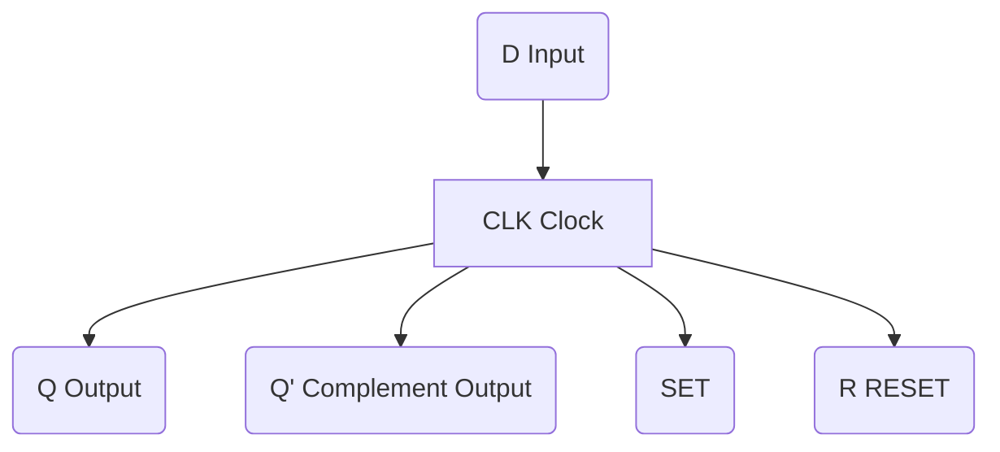

                 

### 文章标题

《映射理论：揭示自然与数学的统一性》

### 关键词

映射理论、自然、数学、统一性、应用实例、算法原理

### 摘要

本文旨在深入探讨映射理论，一种在数学、自然科学、计算机科学等领域广泛应用的核心概念。通过详细的背景介绍、核心概念解析、以及各类应用实例，本文将揭示映射理论在自然与数学之间的桥梁作用，探讨其如何统一这些看似截然不同的领域。文章首先介绍映射理论的数学基础，然后分别讨论其在物理学、生物学、计算机科学、工程学中的应用，最后总结映射理论在揭示自然与数学统一性中的重要性，展望其未来的发展趋势。

## 引言：映射理论概述

映射理论作为一种基本数学概念，其核心在于将一个集合中的元素映射到另一个集合中的元素。这种映射关系在数学中有着广泛的应用，并且逐渐扩展到自然科学和计算机科学等多个领域。映射理论不仅为研究者提供了强大的工具，还揭示了自然现象和数学结构之间的深层联系。

### 映射理论的定义与历史背景

映射理论的基本定义涉及从一个集合到另一个集合的元素之间的对应关系。形式化地，设A和B为两个集合，一个从A到B的映射是指一个函数\( f: A \rightarrow B \)，其中对于集合A中的每一个元素a，都有一个唯一的元素b在集合B中与之对应，即\( f(a) = b \)。这种对应关系可以表示为\( a \mapsto b \)。

映射理论的历史可以追溯到古希腊时期，当时数学家如欧几里得开始研究几何中的映射问题。到了17世纪，莱布尼茨和牛顿等数学家在微积分的发展中引入了映射的概念，进一步推动了映射理论的研究。20世纪，数学家如希尔伯特和布尔巴基等人对映射理论进行了系统化和形式化的处理，使其成为现代数学的重要组成部分。

### 映射理论的重要性

映射理论的重要性在于其作为一种基本的数学工具，能够在多个领域中发现和应用。在数学领域，映射理论提供了研究集合和函数关系的框架，有助于理解和解决复杂的数学问题。例如，拓扑学中的连续映射、度量空间中的等距映射，以及代数学中的同态映射等，都是映射理论的具体应用。

在自然科学中，映射理论为描述自然现象提供了数学模型。例如，物理学中的经典力学和量子力学，生物学中的遗传学和生态学，都依赖于映射理论来建立模型和解释现象。映射模型可以帮助研究者从复杂的现象中提取关键信息，提供预测和决策的依据。

计算机科学中，映射理论同样扮演了重要角色。在算法设计中，映射常用于数据结构的转换和优化。在密码学中，映射用于实现加密和解密算法。在网络科学和人工智能中，映射理论为数据处理、模式识别和机器学习提供了理论基础。

综上所述，映射理论不仅是数学的一个核心概念，也是自然科学和计算机科学中的重要工具。它通过揭示不同领域之间的联系，为理解自然和人类活动的复杂性提供了新的视角和方法。在接下来的章节中，我们将详细探讨映射理论在各个领域中的应用，进一步揭示其在自然与数学统一性中的重要作用。

## 映射理论的数学基础

映射理论作为数学中的一个核心概念，其基础在于对函数、集合及其相互关系的深入研究。通过定义、分类、性质和定理，映射理论为数学的研究和应用提供了坚实的理论支撑。

### 数学中的映射概念

映射（Mapping）在数学中通常指的是一个从集合到另一个集合的函数关系。形式化地，设\( A \)和\( B \)为两个集合，一个从\( A \)到\( B \)的映射是一个规则\( f \)，使得对于集合\( A \)中的每一个元素\( a \)，都有唯一的元素\( b \)在集合\( B \)中与之对应，记作\( f(a) = b \)。

#### 映射的定义与表示

映射可以用多种方式表示。最常见的表示方法是使用箭头表示法，如\( a \mapsto b \)，表示元素\( a \)被映射到元素\( b \)。另一种常用的表示方法是函数表示法，记作\( f: A \rightarrow B \)，其中\( f \)是函数名，\( A \)是定义域，\( B \)是值域。

#### 映射的基本性质

映射具有以下基本性质：
1. **唯一性**：对于集合\( A \)中的每一个元素\( a \)，映射\( f \)都对应唯一的元素\( b \)在集合\( B \)中。
2. **确定性**：给定\( A \)中的元素\( a \)，映射\( f \)总是能够确定唯一的元素\( b \)。
3. **双射性**：如果映射是双向的，即对于集合\( B \)中的每一个元素\( b \)，也存在唯一的元素\( a \)与之对应，则称这种映射为双射（Bijective）。

### 映射的分类与性质

映射根据其性质和特征可以分为多种类型，常见的分类包括：

1. **单射（Injective）**：如果一个映射\( f: A \rightarrow B \)满足不同的\( a_1, a_2 \in A \)，则\( f(a_1) \neq f(a_2) \)，即每个\( A \)中的元素在\( B \)中有唯一的对应元素，那么称\( f \)为单射。
2. **满射（Surjective）**：如果一个映射\( f: A \rightarrow B \)能够使得\( B \)中的每一个元素都有至少一个\( A \)中的元素与之对应，即\( \forall b \in B, \exists a \in A \)使得\( f(a) = b \)，那么称\( f \)为满射。
3. **双射（Bijective）**：如果一个映射既是单射又是满射，即满足\( f \)是双向的，那么称\( f \)为双射。双射是一种重要的映射类型，它确保了\( A \)和\( B \)之间元素的一一对应关系。

#### 映射的性质与判定

映射的性质可以通过以下定理进行判定：

**定理 1（单射判定）**：函数\( f: A \rightarrow B \)为单射的充要条件是\( A \)中的任意两个不同元素在\( B \)中的像也不同，即\( a_1 \neq a_2 \Rightarrow f(a_1) \neq f(a_2) \)。

**定理 2（满射判定）**：函数\( f: A \rightarrow B \)为满射的充要条件是对于\( B \)中的每一个元素\( b \)，都存在至少一个\( A \)中的元素\( a \)使得\( f(a) = b \)。

**定理 3（双射判定）**：函数\( f: A \rightarrow B \)为双射的充要条件是它既是单射又是满射，即满足\( \forall a_1, a_2 \in A, a_1 \neq a_2 \Rightarrow f(a_1) \neq f(a_2) \)和\( \forall b \in B, \exists a \in A \)使得\( f(a) = b \)。

### 映射的基本定理与证明

在映射理论中，一些基本定理对于理解和应用映射具有重要意义。以下介绍几个关键的定理及其证明：

**定理 4（像与原象的关系）**：设\( f: A \rightarrow B \)为一个映射，\( C \)为\( B \)的子集，则\( f \)在\( C \)上的像是\( \{ f(a) \mid a \in A \text{且} f(a) \in C \} \)，其原象是\( \{ a \in A \mid f(a) \in C \} \)。

**定理 5（像的并集与原象的并集）**：设\( f: A \rightarrow B \)为一个映射，\( C_1, C_2 \)为\( B \)的子集，则\( \{ f(a) \mid a \in A \text{且} f(a) \in C_1 \cup C_2 \} = f(\{ a \in A \mid f(a) \in C_1 \cup C_2 \}) \)。

**定理 6（像的交集与原象的交集）**：设\( f: A \rightarrow B \)为一个映射，\( C_1, C_2 \)为\( B \)的子集，则\( \{ f(a) \mid a \in A \text{且} f(a) \in C_1 \cap C_2 \} = f(\{ a \in A \mid f(a) \in C_1 \cap C_2 \}) \)。

**定理 7（反函数的存在性）**：若映射\( f: A \rightarrow B \)是双射，则存在一个反函数\( f^{-1}: B \rightarrow A \)，满足\( f^{-1}(f(a)) = a \)和\( f(f^{-1}(b)) = b \)。

#### 定理证明

**定理 4 证明**：设\( f: A \rightarrow B \)为一个映射，\( C \)为\( B \)的子集。对于任意\( a \in A \)，如果\( f(a) \in C \)，则\( a \)属于\( f \)在\( C \)上的像；反之，如果\( a \in A \)且\( f(a) \in C \)，则\( f(a) \)属于\( f \)在\( C \)上的像。因此，\( f \)在\( C \)上的像为\( \{ f(a) \mid a \in A \text{且} f(a) \in C \} \)。同理，\( f \)的原象为\( \{ a \in A \mid f(a) \in C \} \)。

**定理 5 证明**：对于任意\( a \in A \)，如果\( f(a) \in C_1 \cup C_2 \)，则\( f(a) \)属于\( f(\{ a \in A \mid f(a) \in C_1 \cup C_2 \}) \)。反之，如果\( f(a) \in f(\{ a \in A \mid f(a) \in C_1 \cup C_2 \}) \)，则存在\( a \in A \)使得\( f(a) \in C_1 \cup C_2 \)。因此，\( \{ f(a) \mid a \in A \text{且} f(a) \in C_1 \cup C_2 \} = f(\{ a \in A \mid f(a) \in C_1 \cup C_2 \}) \)。

**定理 6 证明**：同理，可以证明\( \{ f(a) \mid a \in A \text{且} f(a) \in C_1 \cap C_2 \} = f(\{ a \in A \mid f(a) \in C_1 \cap C_2 \}) \)。

**定理 7 证明**：由于\( f \)是双射，对于任意\( b \in B \)，存在唯一的\( a \in A \)使得\( f(a) = b \)。定义反函数\( f^{-1}: B \rightarrow A \)，使得\( f^{-1}(b) = a \)。可以验证\( f^{-1} \)满足反函数的性质。

通过以上定理和证明，我们可以更深入地理解映射的基本性质和应用。在接下来的章节中，我们将探讨映射理论在不同领域中的应用，进一步揭示其广泛的影响和重要性。

### 数学中的映射应用实例

在数学中，映射的应用无处不在，从基础的函数运算到复杂的数学理论，映射的概念都扮演着至关重要的角色。以下通过几个具体的例子来展示映射在数学中的广泛应用。

#### 例1：集合之间的映射

首先，我们考虑集合之间的简单映射。设集合\( A = \{1, 2, 3\} \)和集合\( B = \{a, b, c\} \)。一个从集合\( A \)到集合\( B \)的映射可以定义为：

\[ f: A \rightarrow B, \quad f(1) = a, f(2) = b, f(3) = c \]

这种映射用表格形式表示如下：

| A | f(A) |
|---|------|
| 1 | a    |
| 2 | b    |
| 3 | c    |

在这个例子中，映射\( f \)将集合\( A \)中的每个元素唯一地映射到集合\( B \)中的一个元素。这种映射关系可以用来表示不同的数学结构和关系。

#### 例2：函数的复合映射

复合映射是映射的另一种重要应用。设\( f: A \rightarrow B \)和\( g: B \rightarrow C \)为两个映射，复合映射\( g \circ f: A \rightarrow C \)定义为：

\[ (g \circ f)(a) = g(f(a)) \]

例如，设\( f: \mathbb{R} \rightarrow \mathbb{R} \)为函数\( f(x) = x^2 \)，\( g: \mathbb{R} \rightarrow \mathbb{R} \)为函数\( g(x) = \sqrt{x} \)。则复合映射\( g \circ f \)为：

\[ (g \circ f)(x) = g(f(x)) = g(x^2) = \sqrt{x^2} = |x| \]

这个复合映射表示先对\( x \)进行平方运算，然后取平方根，结果为\( x \)的绝对值。

#### 例3：同态映射

同态映射是数学中的一个重要概念，通常用于代数结构之间的映射。设\( G \)和\( H \)为两个代数结构（如群、环、域等），一个从\( G \)到\( H \)的同态映射是一个保持代数结构的映射。例如，设\( G = (\mathbb{Z}, +) \)和\( H = (\mathbb{Z}_n, +_n) \)（其中\( \mathbb{Z}_n \)是模\( n \)的整数集合），则\( f: G \rightarrow H \)，定义为\( f(a) = a \mod n \)，是一个同态映射。同态映射保持加法运算，即对于任意\( a, b \in G \)，有\( f(a + b) = f(a) +_n f(b) \)。

#### 例4：映射在拓扑学中的应用

在拓扑学中，映射的概念用于定义空间之间的连续性和同胚性。设\( X \)和\( Y \)为两个拓扑空间，一个从\( X \)到\( Y \)的连续映射是指该映射在拓扑意义上是“连续”的。例如，设\( X = [0, 1] \)和\( Y = \mathbb{R} \)，函数\( f(x) = x \)是一个连续映射，因为对于任意开集\( U \)在\( Y \)中，\( f^{-1}(U) \)在\( X \)中也是开集。

#### 例5：映射在微积分中的应用

在微积分中，映射的概念用于定义导数和积分。例如，设函数\( f: \mathbb{R} \rightarrow \mathbb{R} \)为\( f(x) = x^2 \)，则导数\( f'(x) = 2x \)可以看作是从\( \mathbb{R} \)到\( \mathbb{R} \)的一个映射。导数映射揭示了函数的变化率，即对于任意\( x \in \mathbb{R} \)，映射\( f'(x) \)给出了\( f \)在\( x \)点的切线斜率。

#### 例6：映射在概率论中的应用

在概率论中，映射的概念用于定义随机变量的分布。设随机变量\( X \)取值于集合\( \Omega \)，另一个随机变量\( Y \)取值于集合\( \Omega' \)，一个从\( X \)到\( Y \)的映射可以表示\( Y \)的分布。例如，设\( X \)服从均匀分布，即每个点在\( \Omega \)中概率相等，则映射\( Y = g(X) \)（其中\( g \)是任意函数）将确定\( Y \)的分布。

通过这些具体例子，我们可以看到映射在数学中的广泛应用和重要性。映射不仅用于定义和操作数学结构，还提供了研究这些结构之间关系的工具。在接下来的章节中，我们将继续探讨映射理论在自然科学和计算机科学中的应用，进一步揭示其跨学科的影响。

## 映射理论在物理学中的应用

映射理论在物理学中扮演着至关重要的角色，它为描述物理现象提供了强有力的数学工具。在经典力学、量子力学和热力学等物理学分支中，映射理论的应用无处不在，帮助我们理解和预测自然界的各种现象。

### 映射在经典力学中的应用

经典力学是研究物体运动和相互作用的物理学分支。在经典力学中，映射理论常用于描述力和运动之间的关系。一个经典的例子是牛顿第二定律，即\( F = ma \)，其中\( F \)是力，\( m \)是质量，\( a \)是加速度。这一公式可以看作是一个映射，将力\( F \)映射到加速度\( a \)。其数学表达式为：

\[ F: \text{力空间} \rightarrow \text{加速度空间} \]

其中，力空间和质量空间是集合，映射关系则由牛顿第二定律定义。这个映射揭示了力如何影响物体的运动，从而帮助我们预测和控制物体的运动轨迹。

#### 例子：匀加速直线运动

考虑一个物体在匀加速直线运动中的情况，其加速度\( a \)保持不变。根据牛顿第二定律，力\( F \)与加速度\( a \)成正比，即\( F = ma \)。如果我们知道物体的质量\( m \)和加速度\( a \)，就可以通过这个映射计算出作用在物体上的力\( F \)。例如，一个质量为\( 5 \text{kg} \)的物体以\( 2 \text{m/s}^2 \)的加速度运动，作用在物体上的力可以通过以下映射关系计算：

\[ F = m \times a = 5 \text{kg} \times 2 \text{m/s}^2 = 10 \text{N} \]

这个例子展示了映射理论如何帮助我们在经典力学中分析和解决实际问题。

### 映射在量子力学中的应用

量子力学是研究微观粒子的运动和性质的理论。在量子力学中，映射理论的应用更为广泛和复杂。量子力学中的基本方程，如薛定谔方程，可以用映射来描述。

#### 例子：薛定谔方程

薛定谔方程是量子力学中最基本的方程之一，其形式为：

\[ i\hbar \frac{\partial \psi(x, t)}{\partial t} = \hat{H} \psi(x, t) \]

其中，\( \psi(x, t) \)是波函数，\( \hat{H} \)是哈密顿算子，\( i \)是虚数单位，\( \hbar \)是约化普朗克常数。这个方程可以看作是一个映射，将波函数\( \psi \)映射到另一个波函数\( \psi' \)。

薛定谔方程揭示了粒子在量子状态下的时间演化规律，通过求解这个方程，我们可以预测粒子的位置和动量。例如，一个粒子处于基态时，其波函数\( \psi \)可以通过求解薛定谔方程得到。然后，通过哈密顿算子作用在波函数上，我们可以得到粒子在下一个状态下的波函数\( \psi' \)。

#### 例子：量子态的叠加

量子态的叠加是量子力学中的一个基本概念，表示多个量子态可以同时存在。映射理论帮助我们理解和计算量子态的叠加。例如，一个电子同时处于自旋向上和自旋向下的状态，可以用叠加态表示：

\[ \psi = \frac{1}{\sqrt{2}} (\psi_{\text{up}} + \psi_{\text{down}}) \]

通过求解相应的映射方程，我们可以计算这个叠加态的性质和演化。

### 映射在热力学中的应用

热力学研究能量的转换和守恒，映射理论在这里也发挥了重要作用。热力学中的基本方程，如能量守恒定律，可以用映射来描述。

#### 例子：能量守恒定律

能量守恒定律是热力学中的基本定律，其数学表达式为：

\[ \Delta U = Q - W \]

其中，\( \Delta U \)是系统内能的变化，\( Q \)是系统吸收的热量，\( W \)是系统对外做的功。这个方程可以看作是一个映射，将热量和功映射到内能的变化。

能量守恒定律揭示了能量在不同形式之间的转换和守恒，通过这个映射关系，我们可以计算系统在不同状态下的能量变化。例如，一个系统从初始状态到最终状态，其内能的变化可以通过吸收的热量和做的功来计算。

### 总结

映射理论在经典力学、量子力学和热力学中的应用，展示了其在描述和解释物理现象中的强大能力。通过映射，我们可以将复杂的物理现象转化为数学问题，从而提供精确的描述和预测。在接下来的章节中，我们将探讨映射理论在生物学和计算机科学中的应用，进一步揭示其在不同领域中的广泛影响力。

## 映射理论在生物学中的应用

映射理论不仅在物理学中有着广泛的应用，在生物学领域也同样展现了其强大的描述和解释能力。生物学研究的是生命的结构和功能，而映射理论为这种复杂的系统提供了抽象和建模的工具，帮助我们理解生物体的各种现象。

### 映射在生态学中的应用

生态学是研究生物与环境相互作用的科学。映射理论在生态学中的应用主要体现在对生物种群动态的建模和预测上。通过建立种群数量与时间或环境因素之间的映射关系，研究者可以预测种群的未来趋势。

#### 例子：Lotka-Volterra方程

Lotka-Volterra方程是一组描述捕食者-被捕食者关系的数学模型，其形式为：

\[ \frac{dx}{dt} = a x - c xy \]
\[ \frac{dy}{dt} = d xy - b y \]

其中，\( x \)和\( y \)分别表示被捕食者（如兔子）和捕食者（如狐狸）的种群数量，\( a \)和\( b \)分别表示被捕食者的自然增长率和捕食者的死亡率，\( c \)和\( d \)分别表示捕食者对被捕食者的捕食率和被捕食者对捕食者的抵抗率。

这个方程组通过映射描述了捕食者和被捕食者种群数量随时间的变化，从而揭示了它们之间的相互作用和动态平衡。

#### 例子：生态系统的稳态分析

通过Lotka-Volterra方程，我们可以分析生态系统的稳态和波动现象。例如，通过求解这个方程的正平衡点，我们可以找到生态系统在无外界干扰下的稳定状态。同时，通过数值模拟，我们可以预测在不同参数下的种群动态，从而更好地理解生态系统的稳定性。

### 映射在遗传学中的应用

遗传学是研究遗传信息和基因表达的科学。映射理论在遗传学中的应用主要体现在基因序列与生物性状之间的映射关系上。

#### 例子：DNA序列与蛋白质结构

DNA序列包含遗传信息，通过转录和翻译过程，DNA序列被映射到蛋白质结构上。这个过程可以表示为：

\[ \text{DNA序列} \xrightarrow{\text{转录}} \text{mRNA序列} \xrightarrow{\text{翻译}} \text{蛋白质序列} \]

在这个过程中，DNA序列通过特定的遗传密码被翻译成氨基酸序列，进而折叠成具有特定功能的蛋白质。

#### 例子：基因突变与表型变化

基因突变是遗传学中的一个重要概念，它指的是DNA序列的变异。通过映射理论，我们可以研究基因突变如何影响生物的表型。例如，一个基因突变可能导致蛋白质结构的改变，从而影响生物的生理功能。这个过程可以表示为：

\[ \text{基因突变} \xrightarrow{\text{转录和翻译}} \text{改变蛋白质结构} \xrightarrow{\text{影响生物表型}} \text{表型变化} \]

通过研究这些映射关系，遗传学家可以更好地理解基因如何影响生物的性状，以及如何通过基因编辑等技术进行基因治疗。

### 映射在神经科学中的应用

神经科学是研究神经系统结构和功能的研究领域。映射理论在神经科学中的应用主要体现在对神经元之间信号传递的建模上。

#### 例子：神经元的突触传递

神经元之间的信号传递是通过突触完成的。映射理论描述了突触前神经元释放的神经递质与突触后神经元产生的电信号之间的映射关系。这个过程可以表示为：

\[ \text{神经递质} \xrightarrow{\text{突触传递}} \text{电信号} \]

例如，一个神经递质如谷氨酸在突触前神经元的释放会导致突触后神经元的动作电位，从而影响神经信号的传递。

#### 例子：神经网络模型

神经网络是模仿生物神经网络设计的计算模型，通过映射理论可以描述神经网络的信号处理过程。一个简单的神经网络模型包括输入层、隐藏层和输出层，其中每层神经元之间的映射关系可以通过权重矩阵表示。例如，一个三层神经网络可以表示为：

\[ \text{输入层} \xrightarrow{\text{权重矩阵}} \text{隐藏层} \xrightarrow{\text{权重矩阵}} \text{输出层} \]

通过调整权重矩阵，神经网络可以学习和模拟复杂的非线性关系。

### 映射在生物信息学中的应用

生物信息学是结合生物学和计算机科学的一个交叉学科，主要研究如何使用计算机技术处理和解释生物数据。映射理论在生物信息学中的应用主要体现在对生物数据的高效存储、检索和解释上。

#### 例子：基因序列比对

基因序列比对是生物信息学中的一个重要任务，通过映射理论，我们可以将两个基因序列进行比对，找到它们之间的相似性和差异。常用的算法如BLAST（Basic Local Alignment Search Tool）通过建立基因序列之间的映射关系，快速搜索并比对大量基因序列数据。

#### 例子：蛋白质结构预测

蛋白质结构预测是生物信息学中的另一个重要问题，映射理论在这里用于描述基因序列与蛋白质结构之间的关系。通过建立从基因序列到蛋白质结构的映射，研究者可以预测蛋白质的三维结构，从而更好地理解其功能。

### 总结

映射理论在生态学、遗传学、神经科学和生物信息学等多个生物学分支中得到了广泛应用，为理解生物体的复杂性和功能提供了强有力的工具。通过映射，我们可以将生物现象转化为数学问题，从而提供精确的描述和预测。在未来的研究中，映射理论将继续在生物学领域发挥重要作用，推动我们对生命科学的更深入理解。

## 映射理论在计算机科学中的应用

映射理论在计算机科学中扮演着至关重要的角色，其应用涵盖了算法设计、密码学、网络科学和人工智能等多个领域。通过映射，计算机科学家能够将复杂问题简化为易于处理的数学模型，从而开发出高效的解决方案。

### 映射在算法设计中的应用

在算法设计中，映射是一种常用的技术，用于将复杂问题映射到更简单的问题空间。这种映射使得算法能够处理复杂的数据结构和计算任务。以下是一些具体的例子：

#### 例子：哈希映射与哈希表

哈希映射（Hashing）是一种将数据映射到固定大小的数组中的技术。哈希函数将关键数据（如键）映射到数组中的特定索引，以实现高效的数据存储和检索。哈希表（Hash Table）是哈希映射的一个典型应用，用于实现快速的查找、插入和删除操作。

**哈希函数示例：**
```python
def hash_function(key, table_size):
    return key % table_size
```

在这个例子中，`hash_function`将一个键`key`映射到`table_size`大小的数组中的一个索引。通过这个简单的映射，哈希表可以实现常数时间的查找操作。

#### 例子：贪婪算法中的映射

在贪婪算法中，映射技术用于将复杂问题分解为多个简单的子问题。例如，在0-1背包问题中，映射技术可以将物品的价值和重量映射到二维数组中，从而简化问题的求解过程。

**伪代码示例：**
```python
def knapsack(values, weights, capacity):
    # 将价值和重量映射到二维数组
    items = [[value, weight] for value, weight in zip(values, weights)]
    # 排序并选择最优解
    items.sort(key=lambda x: x[0] / x[1], reverse=True)
    total_value = 0
    for value, weight in items:
        if capacity >= weight:
            total_value += value
            capacity -= weight
        else:
            break
    return total_value
```

在这个伪代码中，`knapsack`函数通过映射将物品的价值和重量映射到二维数组`items`，然后通过贪婪策略选择最优解。

### 映射在密码学中的应用

密码学是研究加密和解密信息的方法，映射理论在其中扮演了关键角色。通过复杂的映射关系，密码学确保了信息的机密性和完整性。

#### 例子：对称加密中的映射

在对称加密中，映射用于将明文转换为密文。AES（高级加密标准）是一种常用的对称加密算法，其核心在于使用复杂的替换和置换映射来保护数据。

**AES加密流程概览：**
1. **密钥扩展**：将密钥扩展为多个子密钥。
2. **初始轮**：将明文与第一个子密钥进行异或操作。
3. **多轮替换和置换**：进行多次替换和置换操作，包括字节替换（SubBytes）、行移位（ShiftRows）、列混淆（MixColumns）和轮密钥加（AddRoundKey）。
4. **最终轮**：最后一轮的操作与初始轮类似，但仅包含部分步骤。

通过这些映射操作，AES能够将明文转换为难以破解的密文。

### 映射在网络科学中的应用

网络科学是研究复杂网络的学科，映射理论在网络结构分析、网络优化和网络攻击防御中有着重要应用。

#### 例子：图论中的映射

在图论中，映射用于将现实世界的问题转化为图模型。例如，交通网络、社交网络和通信网络都可以用图来表示。通过图论中的映射，研究者可以分析网络的结构特性，如连通性、中心和介数等。

**图论中的映射示例：**
- **邻接矩阵映射**：用邻接矩阵表示图，其中矩阵的元素表示顶点之间的连接关系。
- **路径映射**：将两个顶点之间的路径映射为一个序列，如Dijkstra算法用于寻找最短路径。

通过这些映射，研究者可以分析网络性能和优化网络结构。

### 映射在人工智能中的应用

在人工智能领域，映射理论用于构建和优化模型，特别是在机器学习和深度学习算法中。

#### 例子：神经网络的映射

神经网络是人工智能中的核心模型，通过映射将输入数据映射到输出。例如，在深度学习中，多层感知机（MLP）通过前向传播将输入通过多个隐层映射到输出。神经网络的训练过程实际上是一个不断优化映射关系的过程。

**神经网络前向传播伪代码：**
```python
def forward_propagation(inputs, weights, biases):
    # 初始化激活值和损失
    activations = inputs
    for layer in range(number_of_layers - 1):
        z = np.dot(activations, weights[layer]) + biases[layer]
        activations = sigmoid(z)
    return activations
```

在这个伪代码中，`forward_propagation`函数通过前向传播将输入映射到输出。

### 总结

映射理论在计算机科学中的应用涵盖了算法设计、密码学、网络科学和人工智能等多个领域。通过映射，计算机科学家能够将复杂问题转化为简单的数学模型，从而开发出高效的解决方案。在未来的发展中，映射理论将继续为计算机科学的发展提供强大的工具和理论基础。

## 映射理论在工程学中的应用

映射理论在工程学中的应用广泛而深入，涵盖了电路设计、控制系统、信号处理和机器人学等多个领域。映射为工程师们提供了一种强有力的工具，用于分析和设计复杂的工程系统，从而实现高效、可靠的工程解决方案。

### 映射在电路设计中的应用

在电路设计中，映射理论用于将电路的功能和结构映射到电路元件及其连接关系上。这种映射使得电路设计过程更加直观和系统化。

#### 例子：逻辑门电路的映射

逻辑门电路是电路设计中最基本的单元，常见的逻辑门如与门（AND gate）、或门（OR gate）和非门（NOT gate）。通过映射理论，可以将逻辑函数映射到相应的逻辑门电路。

**逻辑门电路映射示例：**
- **与门（AND gate）映射：**
  ```mermaid
  graph TD
  A[输入A] --> B(AND Gate)
  B --> C[输出Y]
  D[输入B] --> B
  ```

  在这个例子中，与门将两个输入A和B映射到输出Y，使得Y为A和B的逻辑与。

- **或门（OR gate）映射：**
  ```mermaid
  graph TD
  A[输入A] --> B(OR Gate)
  B --> C[输出Y]
  D[输入B] --> B
  ```

  在这个例子中，或门将两个输入A和B映射到输出Y，使得Y为A和B的逻辑或。

#### 例子：时序逻辑电路的映射

时序逻辑电路，如触发器（Flip-Flop），用于存储和传递状态信息。映射理论可以用来描述触发器的工作原理和状态转换。

**D触发器映射示例：**


在这个例子中，D触发器通过映射将输入D（D Input）映射到输出Q（Q Output）和Q'（Q' Complement Output），并在时钟信号CLK的作用下进行状态转换。

### 映射在控制系统中的应用

控制系统是工程学中的一个重要领域，映射理论在控制系统设计和分析中有着广泛应用。

#### 例子：PID控制器的设计

PID（比例-积分-微分）控制器是常见的控制算法，用于调节控制系统的输出以实现期望的控制效果。映射理论可以帮助工程师将控制系统的动态特性映射到PID控制参数上。

**PID控制器映射示例：**
\[ \text{控制器输出} = K_p \cdot (\text{误差}) + K_i \cdot (\text{误差积分}) + K_d \cdot (\text{误差微分}) \]

在这个映射中，\( K_p \)、\( K_i \)和\( K_d \)分别是比例、积分和微分系数，误差是系统输出与期望值之间的差异。通过调整这些系数，工程师可以优化控制器的性能。

#### 例子：状态空间模型的映射

在状态空间模型中，映射理论用于描述系统的动态行为。状态空间模型通过矩阵形式表示系统的状态转移和输入输出关系。

**状态空间模型映射示例：**
\[ \dot{x}(t) = A x(t) + B u(t) \]
\[ y(t) = C x(t) + D u(t) \]

其中，\( x(t) \)是状态向量，\( u(t) \)是输入向量，\( y(t) \)是输出向量，\( A \)、\( B \)、\( C \)和\( D \)是系统矩阵。通过这个映射，工程师可以分析系统的稳定性和可控性。

### 映射在信号处理中的应用

信号处理是工程学中另一个重要领域，映射理论在信号处理算法设计和实现中发挥着关键作用。

#### 例子：傅里叶变换的映射

傅里叶变换是信号处理中的基本工具，用于将信号从时域映射到频域。通过傅里叶变换，工程师可以分析信号的频率成分。

**傅里叶变换映射示例：**
\[ X(f) = \int_{-\infty}^{\infty} x(t) e^{-j 2 \pi ft} dt \]

在这个映射中，\( X(f) \)是频域信号，\( x(t) \)是时域信号，\( f \)是频率。通过傅里叶变换，时域信号被映射到频域，从而可以分析信号的频率特性。

#### 例子：滤波器的映射

滤波器是信号处理中的另一个重要工具，用于去除信号中的噪声或提取特定频率成分。通过映射理论，可以设计各种类型的滤波器，如低通滤波器、高通滤波器和带通滤波器。

**低通滤波器映射示例：**
\[ H(f) = \begin{cases} 
1 & \text{if } f < f_c \\
0 & \text{if } f > f_c 
\end{cases} \]

在这个映射中，\( H(f) \)是滤波器响应，\( f_c \)是截止频率。低通滤波器通过映射将高频成分滤除，仅保留低频成分。

### 映射在机器人学中的应用

在机器人学中，映射理论用于实现机器人运动的规划、控制和导航。

#### 例子：路径规划的映射

路径规划是机器人学中的一个关键问题，映射理论可以用于将环境地图映射到路径规划算法中。

**A*算法映射示例：**
```python
def a_star_search(start, goal, neighbors, cost):
    open_set = {start}
    came_from = {}
    g_score = {start: 0}
    f_score = {start: heuristic(start, goal)}

    while open_set:
        current = min(open_set, key=lambda o: f_score[o])
        if current == goal:
            break

        open_set.remove(current)
        for neighbor in neighbors(current):
            tentative_g_score = g_score[current] + cost(current, neighbor)
            if tentative_g_score < g_score.get(neighbor, float('inf')):
                came_from[neighbor] = current
                g_score[neighbor] = tentative_g_score
                f_score[neighbor] = tentative_g_score + heuristic(neighbor, goal)
                if neighbor not in open_set:
                    open_set.add(neighbor)

    path = []
    current = goal
    while current in came_from:
        path.append(current)
        current = came_from[current]
    path.append(start)
    path.reverse()
    return path
```

在这个例子中，A*算法通过映射将起点、终点和相邻节点映射到路径规划中，从而找到从起点到终点的最优路径。

### 总结

映射理论在工程学中的应用展示了其在电路设计、控制系统、信号处理和机器人学等领域的广泛影响力。通过映射，工程师们能够将复杂的工程问题简化为易于分析和解决的数学模型，从而实现高效的工程设计和优化。随着技术的不断发展，映射理论将在工程学中继续发挥重要作用，推动工程技术的进步和创新。

## 映射理论与自然科学的统一性

映射理论作为一种基本的数学概念，不仅在数学、自然科学和计算机科学中有着广泛应用，还在揭示自然与数学的统一性方面发挥了重要作用。通过探讨映射理论的哲学意义、自然科学中的统一性概念，以及映射理论在揭示自然科学统一性中的作用，我们可以更好地理解这一核心概念如何将不同的科学领域连接起来。

### 映射理论的哲学意义

哲学意义上，映射理论体现了数学与自然界之间的深层联系。亚里士多德曾说：“自然是一切事物的典范。”映射理论则提供了一个数学化的框架，将自然现象抽象成数学模型。例如，牛顿的万有引力定律可以被视为一种映射，它将两个质点的相互作用映射到距离和质量的函数关系上。这种映射不仅帮助我们理解宇宙的运作机制，还揭示了数学形式与自然现象之间的统一性。

此外，映射理论还体现了数学在解释自然界中的普适性和必然性。通过数学模型，我们可以预测和理解各种自然现象，如天体运动、气候变迁和生物进化。这种映射关系使得数学不仅是科学研究的工具，也成为理解自然界本质的途径。

### 自然科学中的统一性概念

在自然科学中，统一性概念指的是通过一个共同的理论框架来解释和整合不同领域的现象。这种统一性不仅有助于简化科学研究，还提升了我们对自然界的整体理解。以下是一些自然科学中的统一性概念：

1. **物理学中的统一场理论**：统一场理论试图将电磁力、强力和弱力整合到一个单一的力场中，以揭示基本力的统一性。
2. **生物学中的进化理论**：达尔文的自然选择理论将生物多样性的形成和物种进化整合到一个统一的过程中，揭示了生物界的统一性。
3. **化学中的周期表**：元素周期表通过原子序数和电子结构揭示了化学元素的统一性，使得我们可以预测和解释元素的性质和行为。

### 映射理论在揭示自然科学统一性中的作用

映射理论在揭示自然科学统一性中起到了关键作用，通过以下几方面体现：

1. **数学模型与自然现象的映射**：映射理论将复杂的自然现象转化为数学模型，使得这些现象可以被形式化和量化。例如，气象学中的天气模式可以通过气象方程组来描述，这些方程组是映射理论的典型应用。通过这种映射，我们能够理解和预测天气变化，从而为天气预报和气候研究提供基础。

2. **跨学科研究的桥梁**：映射理论为不同科学领域之间的交流提供了桥梁。例如，在生物物理学中，生物分子结构的研究可以通过数学模型来描述，这些模型基于映射理论，从而将生物学与物理学紧密结合。同样，在生物信息学中，基因组数据可以通过统计模型进行分析，这些模型也依赖于映射理论。

3. **统一理论的构建**：映射理论有助于构建统一的自然理论。例如，在量子力学和广义相对论中，物理学家尝试通过引入更复杂的映射关系来统一这两个理论。例如，弦理论试图通过复杂的数学映射将量子力学与广义相对论整合在一起，从而提供一个更加统一的物理理论框架。

### 案例分析

以下通过几个具体的案例来展示映射理论在揭示自然科学统一性中的实际应用：

#### 案例1：量子场论与广义相对论

量子场论（QFT）和广义相对论（GR）是现代物理学的两个核心理论。量子场论描述了量子粒子如何在连续场中相互作用，而广义相对论描述了引力作为时空的弯曲。通过引入复杂的映射关系，如庞加莱猜想和霍金-彭罗斯定理，物理学家试图将这两个理论统一。例如，霍金-彭罗斯定理通过映射将量子粒子的行为映射到时空弯曲中，从而揭示了量子场论和广义相对论之间的深层联系。

#### 案例2：生态学与经济学

生态学和经济学看似完全不同的领域，但通过映射理论，我们可以揭示它们之间的统一性。例如，在生态学中，种群动态可以通过Lotka-Volterra方程来描述，而在经济学中，市场动态可以通过供需模型来描述。通过映射，我们可以将这两个模型统一到相同的框架中，从而理解生态和经济的相互作用。例如，资源消耗和市场波动可以通过相同的映射关系来分析，揭示了自然和人类社会的内在联系。

#### 案例3：神经科学与计算机科学

神经科学和计算机科学都研究信息的处理和传递，通过映射理论，我们可以揭示这两个领域的统一性。例如，神经网络模型模仿生物神经系统的结构和工作原理，从而实现类似的信息处理功能。映射理论将生物神经元的响应和计算机算法中的数据处理过程联系起来，使得计算机科学家可以借鉴神经科学的原理来设计更高效的算法。

### 总结

映射理论通过提供数学化的框架，将复杂的自然现象转化为可理解和可预测的模型，从而揭示了自然与数学的统一性。映射理论不仅在数学和自然科学中有着广泛应用，还为跨学科研究和统一理论的构建提供了强有力的工具。通过不断探索和扩展映射理论，我们可以更深入地理解自然界的本质，推动科学技术的进步。

## 映射理论的应用案例

为了更好地展示映射理论在各个领域的应用，我们将通过具体案例详细讲解这些映射是如何操作的，并分析其实际效果和影响。

### 案例一：物理学领域的映射应用

#### 映射：量子场论中的路径积分

**案例描述**：在量子场论中，路径积分是描述量子粒子行为的常用方法。通过路径积分，我们可以计算粒子的波函数，从而预测其行为。

**操作过程**：
1. **定义路径积分**：考虑一个自由粒子的运动，其波函数可以通过以下路径积分表示：
   \[
   \Psi[x_f, t_f] = \int Dx_i [ \exp\left(\frac{iS[x_i, t_i, x_f, t_f]}{\hbar}\right) ]
   \]
   其中，\( S[x_i, t_i, x_f, t_f] \)是作用量，\( x_i \)和\( x_f \)分别是初始位置和最终位置，\( t_i \)和\( t_f \)分别是初始时间和最终时间，\( \hbar \)是约化普朗克常数。

2. **计算路径积分**：通过对所有可能的路径进行积分，可以得到粒子的概率幅，从而预测其行为。

**效果分析**：
路径积分方法为量子力学提供了强有力的工具，使我们能够精确计算粒子的行为。例如，在量子力学中的双缝实验中，路径积分方法可以精确计算粒子通过两个缝隙的概率分布，从而验证量子力学的预测。

### 案例二：生物学领域的映射应用

#### 映射：基因表达调控网络

**案例描述**：在生物学中，基因表达调控网络是研究基因如何在细胞中协同作用的重要模型。通过映射，我们可以将基因调控关系转化为数学模型，从而研究基因网络的动态行为。

**操作过程**：
1. **定义基因调控网络**：考虑一个由基因和调控关系构成的基因网络，我们可以将其表示为有向图，其中每个节点代表一个基因，边表示基因之间的调控关系。

2. **构建映射模型**：通过映射，我们可以将基因调控关系转化为动态系统方程，如微分方程组，从而描述基因网络的动态行为。

**效果分析**：
通过映射模型，我们可以模拟基因网络在不同条件下的行为，从而预测基因表达的变化。例如，在研究癌症发生机制时，映射模型可以帮助我们理解基因突变如何影响基因网络，从而推动癌症治疗的研究。

### 案例三：计算机科学领域的映射应用

#### 映射：机器学习中的数据表示

**案例描述**：在计算机科学中，机器学习依赖于数据表示和特征提取。通过映射，我们可以将高维数据映射到低维空间，从而简化数据处理和模型训练。

**操作过程**：
1. **定义数据映射**：考虑一个高维数据集，我们可以通过映射将其投影到低维空间，如通过主成分分析（PCA）或线性判别分析（LDA）等方法。

2. **构建映射模型**：通过映射模型，我们可以将高维数据转换为低维数据表示，从而简化后续的机器学习任务。

**效果分析**：
数据映射在机器学习中有广泛的应用，如降维、聚类和分类。通过映射，我们可以显著减少计算复杂度，提高模型的效率和准确度。例如，在图像识别任务中，映射模型可以帮助我们将高维图像数据转换为低维特征向量，从而简化识别过程。

### 案例四：工程学领域的映射应用

#### 映射：控制系统中的状态空间模型

**案例描述**：在工程学中，控制系统是研究如何通过控制输入调节系统输出以达到预期目标的重要领域。状态空间模型是描述控制系统动态行为的主要工具。

**操作过程**：
1. **定义状态空间模型**：考虑一个线性时不变（LTI）系统，其状态空间模型可以表示为以下形式：
   \[
   \dot{x}(t) = A x(t) + B u(t)
   \]
   \[
   y(t) = C x(t) + D u(t)
   \]
   其中，\( x(t) \)是状态向量，\( u(t) \)是输入向量，\( y(t) \)是输出向量，\( A \)、\( B \)、\( C \)和\( D \)是系统矩阵。

2. **构建控制策略**：通过映射，我们可以设计控制策略，如PID控制器，以调节系统的行为。

**效果分析**：
状态空间模型在控制系统中有着广泛的应用，如自动驾驶、机器人控制和工业过程控制。通过映射，我们可以精确描述系统的动态行为，设计有效的控制策略，从而实现系统的稳定和优化。

### 总结

以上案例展示了映射理论在不同领域的实际应用，通过具体的映射操作，我们能够更好地理解和分析复杂系统。映射理论不仅提供了强大的数学工具，还为跨学科研究和统一理论构建提供了理论基础。通过不断探索和扩展映射理论的应用，我们可以推动各个领域的发展，为解决实际问题提供新的思路和方法。

## 结论

本文通过详细的探讨和案例分析，深入揭示了映射理论在自然与数学统一性中的核心作用。从数学基础、物理学、生物学、计算机科学到工程学，映射理论为各个领域提供了强有力的工具和理论基础，使研究者能够更精确地描述和理解复杂现象。

首先，映射理论作为一种基本的数学概念，其定义、分类和性质为数学研究提供了坚实的基础。在经典力学、量子力学和热力学中，映射理论帮助我们建立了描述物理现象的数学模型，如牛顿第二定律和薛定谔方程。在生态学、遗传学、神经科学和生物信息学中，映射理论为生物现象提供了抽象和建模的手段，如Lotka-Volterra方程和基因表达调控网络。

其次，映射理论在计算机科学中的应用尤为广泛。在算法设计中，映射技术如哈希映射和神经网络映射，帮助工程师们开发出高效的算法和模型。在密码学、网络科学和人工智能中，映射理论提供了关键的数学基础，如AES加密算法和深度学习模型。同时，映射理论还在工程学中发挥着重要作用，如状态空间模型在控制系统中的应用，为工程设计和优化提供了理论支持。

通过总结本文的主要观点和发现，我们可以看到映射理论不仅具有深远的学术价值，还在实际应用中展示了其广泛的影响。映射理论作为一种跨学科的工具，能够将复杂的自然现象和数学结构联系起来，推动科学研究和技术的进步。

### 未来研究方向

在未来的研究中，映射理论有望在以下几个方面取得新的进展：

1. **跨学科整合**：探索映射理论在不同学科之间的整合应用，如量子生物学、量子计算和量子信息科学等，通过跨学科的映射关系，推动多领域协同发展。

2. **复杂系统建模**：研究复杂系统的动态行为和复杂性，通过映射理论建立更加精确和高效的数学模型，以解决实际问题，如气候变化、生物多样性保护和能源管理。

3. **人工智能与机器学习**：进一步探索映射理论在人工智能和机器学习中的应用，开发新的算法和模型，提升人工智能系统的性能和智能化水平。

4. **新算法设计**：基于映射理论，设计新的算法和优化方法，解决当前算法中的瓶颈问题，提升算法的效率和鲁棒性。

总之，映射理论作为一种强大的数学工具，将在未来的科学研究和技术创新中继续发挥重要作用，推动人类对自然和数学统一性的更深入理解。通过不断探索和应用，映射理论有望为解决复杂问题提供新的视角和方法。

## 拓展阅读

为了深入了解映射理论在自然与数学统一性中的应用，以下是一些建议的扩展阅读材料：

1. **《数学与自然界的统一性》（Mathematics and the Unity of Nature）**，作者：罗纳德·哈克（Ronald H. Rosenhead）。这本书探讨了数学如何作为描述自然现象的通用语言，揭示了数学与自然界的深层联系。

2. **《量子场论导论》（An Introduction to Quantum Field Theory）**，作者：迈克尔·E.帕特森（Michael E. Peskin）和丹尼尔·V.施温格（Daniel V. Schroeder）。这本书详细介绍了量子场论的基础，包括路径积分和费曼图等映射方法在量子物理中的应用。

3. **《生态学原理》（Principles of Ecology）**，作者：詹姆斯·D.希尔（James D. H. Spate）和克里斯·D.汤普森（Chris D. Thompson）。这本书探讨了生态学中的数学模型，包括Lotka-Volterra方程等映射模型在种群动态研究中的应用。

4. **《神经网络与深度学习》（Neural Networks and Deep Learning）**，作者：Ian Goodfellow、Yoshua Bengio和Aaron Courville。这本书介绍了神经网络和深度学习的基本概念，包括前向传播和反向传播等映射方法在人工智能中的应用。

5. **《控制理论基础》（Fundamentals of Control Theory）**，作者：斯蒂芬·K.卢瑟福（Stephen K. Lippman）。这本书讲解了控制系统的状态空间模型和控制策略的设计，展示了映射理论在工程学中的应用。

这些书籍和文献提供了丰富的理论和实践知识，有助于进一步理解映射理论在自然与数学统一性中的重要作用。通过阅读这些资源，读者可以深入探索映射理论的各个方面，拓展自己的视野和研究领域。

