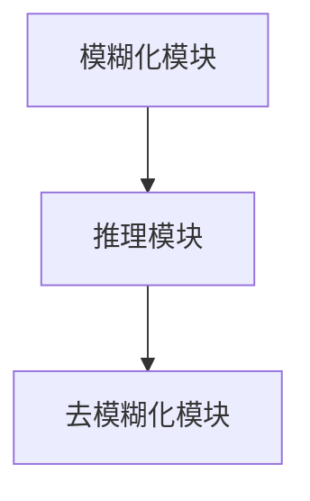
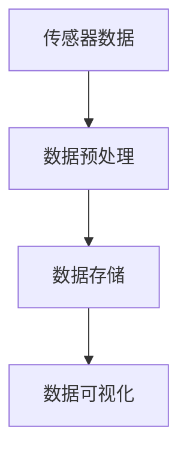
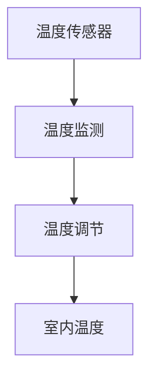
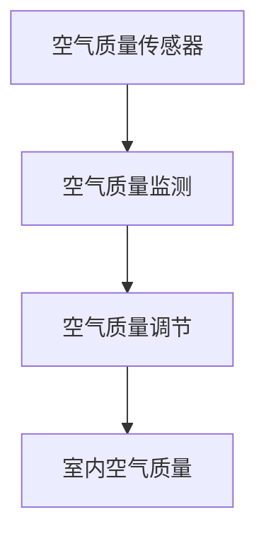
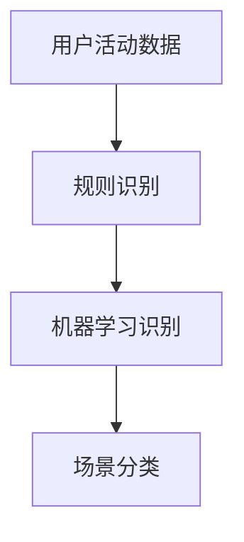
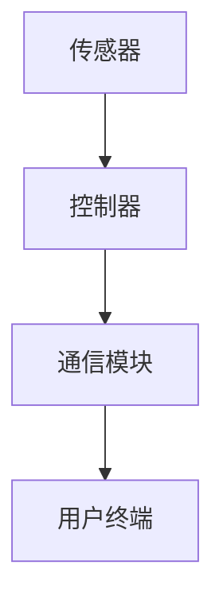
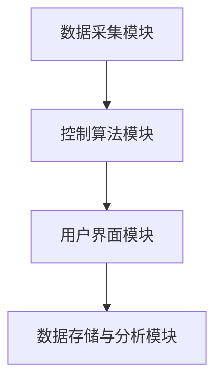

                 

### 文章标题：智能家居的模糊控制：生活环境的数学调节

#### 关键词：智能家居，模糊控制，环境监测，生活调节，数学模型

> 摘要：本文深入探讨了智能家居中的模糊控制技术，详细阐述了模糊控制的基本概念、原理及其在智能家居环境监测与调节中的应用。文章首先介绍了智能家居的背景和模糊控制的基本原理，然后通过具体的实例，展示了模糊控制在灯光、空调、门锁等智能家居设备中的实际应用，最后探讨了模糊控制在智能家居中的未来发展。本文旨在为读者提供全面、系统的模糊控制在智能家居中的应用知识。

### 第1章 引言

#### 1.1 智能家居概述

1.1.1 智能家居的定义与发展历程

智能家居，也称为智能住宅，是指利用先进的计算机技术、通信技术、网络技术、自动控制技术等，将家庭中各种设备进行智能化连接和集成控制，实现家庭设备和环境的自动调节与优化，从而提高居住的舒适度、安全性和能源利用效率。智能家居的发展历程可以追溯到20世纪90年代，随着互联网技术的普及和物联网（IoT）的兴起，智能家居开始逐渐成为现代家庭生活的重要组成部分。

1.1.2 智能家居的基本概念

智能家居的基本概念包括以下几个方面：

1. **智能设备**：指能够通过网络连接进行数据传输和控制的设备，如智能电视、智能空调、智能门锁、智能照明等。

2. **家庭网络**：智能家居设备通过家庭网络进行连接，实现数据的共享和协同工作。

3. **用户界面**：用户可以通过手机、平板电脑、智能音箱等设备，通过图形用户界面（GUI）对智能家居系统进行远程控制和设置。

4. **数据处理与分析**：智能家居系统会收集大量的设备运行数据和环境数据，通过数据处理与分析，实现对家庭环境的智能化调节。

1.1.3 智能家居的重要性

智能家居的重要性主要体现在以下几个方面：

1. **提高生活质量**：智能家居通过自动化、智能化的方式，为用户提供了更加舒适、便捷的生活体验。

2. **提高安全性**：智能家居设备如智能门锁、智能监控等，可以有效提高家庭的安全性。

3. **节能环保**：智能家居系统可以智能调节家庭设备的运行状态，提高能源利用效率，实现节能环保。

#### 1.2 模糊控制简介

1.2.1 模糊控制的概念

模糊控制是一种模拟人类思维的智能控制方法，它通过处理模糊信息，实现对复杂系统的控制。模糊控制的核心是模糊集合和模糊逻辑。模糊集合允许系统在处理信息时存在模糊性和不确定性，模糊逻辑则提供了一种处理模糊信息的手段。

1.2.2 模糊控制的基本原理

模糊控制的基本原理可以概括为以下几个步骤：

1. **模糊化**：将输入变量转化为模糊集合。

2. **模糊推理**：利用模糊逻辑规则，对模糊化后的输入变量进行推理。

3. **模糊化**：将模糊推理的结果进行去模糊化，得到控制输出。

1.2.3 模糊控制的优势

模糊控制具有以下优势：

1. **处理不确定性**：模糊控制能够处理系统中的不确定性，适合处理非线性、时变和复杂系统。

2. **适应性强**：模糊控制规则可以根据实际情况进行调整，具有较强的适应性。

3. **易于实现**：模糊控制算法相对简单，易于在计算机上实现。

#### 1.3 智能家居与模糊控制的关系

1.3.1 模糊控制在智能家居中的应用场景

模糊控制在智能家居中的应用非常广泛，主要表现在以下几个方面：

1. **环境调节**：如温度、湿度、光照等的自动调节。

2. **设备控制**：如空调、照明、门锁等的自动控制。

3. **安全监控**：如入侵检测、火灾报警等。

1.3.2 模糊控制与智能家居的关系

模糊控制是智能家居的核心技术之一，它为智能家居系统提供了智能化的解决方案。模糊控制技术可以有效地处理智能家居系统中的不确定性，提高系统的自适应性和鲁棒性。

1.3.3 模糊控制在智能家居中的作用

模糊控制在智能家居中的作用主要体现在以下几个方面：

1. **提高舒适度**：通过自动调节环境参数，提高用户的舒适度。

2. **提高安全性**：通过智能监控和报警系统，提高家庭的安全性。

3. **提高能源利用效率**：通过智能调节设备运行状态，提高能源利用效率。

#### 1.4 书籍结构安排

1.4.1 各章节的主要内容

本书共分为7个章节，主要内容包括：

- 第1章：介绍智能家居和模糊控制的基本概念。
- 第2章：介绍模糊控制的基础知识。
- 第3章：介绍智能家居环境监测。
- 第4章：介绍模糊控制在智能家居中的应用。
- 第5章：介绍智能家居系统综合设计。
- 第6章：介绍模糊控制在智能家居中的应用案例。
- 第7章：探讨模糊控制在智能家居中的未来发展。

1.4.2 读者的学习目标

通过阅读本书，读者可以：

- 了解智能家居和模糊控制的基本概念。
- 掌握模糊控制的基本原理和应用方法。
- 学习如何设计智能家居系统。
- 了解模糊控制在智能家居中的实际应用案例。

1.4.3 阅读建议

- 阅读本书时，建议读者首先理解每个章节的核心内容，然后再通过实际案例加深理解。
- 在学习模糊控制时，建议读者结合实际编程进行练习。
- 阅读本书时，可以结合其他相关书籍和资料，以获得更深入的理解。

### 第2章 模糊控制基础

#### 2.1 模糊集合与模糊逻辑

2.1.1 模糊集合

模糊集合是模糊控制的基础概念之一。与经典集合不同，模糊集合允许其元素具有不同程度的“属于”关系，而非简单的“属于”或“不属于”。一个模糊集合是通过隶属度函数来定义的，隶属度函数的取值范围通常在[0,1]之间。

假设我们有以下模糊集合$A$，其隶属度函数为$\mu_A(x)$：

$$\mu_A(x) = \left\{
\begin{array}{ll}
1 & \text{如果 } x \in A \\
0 & \text{如果 } x \notin A
\end{array}
\right.$$

在模糊控制中，通常使用模糊集合来表示系统的输入和输出。

2.1.2 模糊逻辑

模糊逻辑是模糊控制的核心，它提供了一种处理模糊信息的方法。模糊逻辑的基本元素包括模糊集合、模糊规则和模糊推理。

模糊规则通常表示为“如果-那么”形式，例如：

$$
\text{如果温度高，那么空调开大}
$$

模糊逻辑的推理过程包括以下几个步骤：

1. **模糊化**：将输入变量模糊化，得到模糊集合。
2. **模糊推理**：利用模糊规则进行推理，得到模糊集合。
3. **去模糊化**：将模糊推理的结果去模糊化，得到控制输出。

#### 2.2 模糊控制器

2.2.1 模糊控制器的结构

模糊控制器是模糊控制系统的核心，它通常由三个部分组成：模糊化模块、推理模块和去模糊化模块。

1. **模糊化模块**：将输入变量模糊化，得到模糊集合。
2. **推理模块**：利用模糊规则进行推理，得到模糊集合。
3. **去模糊化模块**：将模糊推理的结果去模糊化，得到控制输出。

以下是一个模糊控制器的Mermaid流程图：



2.2.2 模糊控制规则

模糊控制规则是模糊控制器的重要组成部分，它通常表示为“如果-那么”形式。模糊控制规则可以根据专家经验或系统分析结果进行定义。

以下是一个模糊控制规则的示例：

$$
\text{如果温度高，那么空调开大}
$$

2.2.3 模糊控制算法

模糊控制算法是模糊控制器的实现方法，它包括模糊化、模糊推理和去模糊化三个步骤。

以下是一个模糊控制算法的伪代码：

```pseudo
1. 模糊化：
   - 输入变量 x 模糊化为模糊集合 X
2. 模糊推理：
   - 对于每个模糊规则 IF A THEN B，计算模糊集合 Y
3. 去模糊化：
   - 将模糊集合 Y 去模糊化为控制输出 y
```

#### 2.3 模糊控制系统的设计与实现

2.3.1 模糊控制器设计步骤

设计一个模糊控制器通常包括以下步骤：

1. **确定系统输入和输出**：确定系统需要监测和控制的输入和输出变量。
2. **定义模糊集合**：定义输入和输出的模糊集合。
3. **定义模糊规则**：根据专家经验或系统分析结果，定义模糊控制规则。
4. **设计模糊控制器**：设计模糊控制器的结构，包括模糊化模块、推理模块和去模糊化模块。
5. **实现模糊控制器**：使用编程语言实现模糊控制器。

2.3.2 模糊控制系统实现

模糊控制系统的实现通常需要以下步骤：

1. **环境搭建**：搭建开发环境，包括编程语言、开发工具和测试设备。
2. **编写代码**：根据设计文档，编写模糊控制器的代码。
3. **测试与调试**：对模糊控制器进行测试和调试，确保其能够正常工作。
4. **部署与应用**：将模糊控制器部署到实际系统中，应用于智能家居环境中。

#### 2.4 模糊控制器的性能分析

2.4.1 性能评价指标

模糊控制器的性能分析通常需要以下评价指标：

1. **稳态误差**：系统达到稳态时，输出与期望输出的误差。
2. **超调量**：系统响应过程中，输出超过期望输出的最大值。
3. **调整时间**：系统从初始状态到达稳态所需的时间。
4. **鲁棒性**：系统在面对外部干扰或参数变化时，保持性能的能力。

2.4.2 性能分析实例

以下是一个模糊控制器性能分析的实例：

1. **系统描述**：假设智能家居系统需要控制室内温度，输入变量为室内温度，输出变量为空调功率。
2. **模糊规则**：定义如下模糊规则：
   - 如果室内温度高，那么空调功率开大。
   - 如果室内温度低，那么空调功率开小。
3. **性能分析**：通过对系统进行测试，可以得到以下性能指标：
   - 稳态误差：0.5°C
   - 超调量：5°C
   - 调整时间：10分钟
   - 鲁棒性：良好

### 第3章 智能家居环境监测

#### 3.1 家居环境监测系统

3.1.1 传感器概述

传感器是智能家居环境监测系统的关键组成部分，用于检测和采集环境数据。常见的传感器包括温度传感器、湿度传感器、光照传感器、空气质量传感器等。

1. **温度传感器**：用于检测室内温度，常见的有热电偶、热敏电阻等。
2. **湿度传感器**：用于检测室内湿度，常见的有电容式、电阻式等。
3. **光照传感器**：用于检测室内光照强度，常见的有光敏电阻、光敏二极管等。
4. **空气质量传感器**：用于检测室内空气质量，常见的有二氧化碳传感器、颗粒物传感器等。

3.1.2 传感器数据采集与处理

传感器数据采集与处理是智能家居环境监测系统的重要组成部分。主要包括以下步骤：

1. **数据采集**：通过传感器采集环境数据，如温度、湿度、光照强度、空气质量等。
2. **数据预处理**：对采集到的数据进行预处理，包括去噪、滤波、数据补全等。
3. **数据存储**：将预处理后的数据存储到数据库或文件中，以供后续分析和处理。

3.1.3 数据可视化

数据可视化是将环境数据以图形化的方式展示出来，帮助用户更好地理解和分析数据。常见的可视化工具包括图表、地图、仪表盘等。

以下是一个数据可视化的Mermaid流程图：



#### 3.2 环境参数分析

3.2.1 温度监测与调节

温度是智能家居环境监测的重要参数之一。通过对温度的监测和调节，可以确保室内温度在舒适范围内。

1. **温度监测**：通过温度传感器实时监测室内温度。
2. **温度调节**：根据室内温度与设定温度的差值，通过空调或暖气调节室内温度。

以下是一个温度监测与调节的Mermaid流程图：



3.2.2 湿度监测与调节

湿度对室内舒适度也有很大的影响。通过对湿度的监测和调节，可以确保室内湿度在适宜范围内。

1. **湿度监测**：通过湿度传感器实时监测室内湿度。
2. **湿度调节**：根据室内湿度与设定湿度的差值，通过加湿器或除湿器调节室内湿度。

以下是一个湿度监测与调节的Mermaid流程图：


3.2.3 空气质量监测与调节

空气质量对人们的健康有着重要的影响。通过对空气质量的监测和调节，可以确保室内空气质量良好。

1. **空气质量监测**：通过空气质量传感器实时监测室内空气质量，如二氧化碳浓度、颗粒物浓度等。
2. **空气质量调节**：根据室内空气质量，通过空气净化器、通风系统等调节室内空气质量。

以下是一个空气质量监测与调节的Mermaid流程图：



#### 3.3 智能家居场景识别

3.3.1 场景分类与识别方法

智能家居场景识别是智能家居系统的一个重要功能，通过识别用户的日常活动场景，可以智能调节家居设备，提高用户的舒适度和便利性。

1. **场景分类**：常见的智能家居场景包括睡眠模式、工作模式、娱乐模式等。
2. **识别方法**：常用的场景识别方法包括基于规则的识别、基于机器学习的识别等。

以下是一个场景识别的Mermaid流程图：



3.3.2 实例分析

以下是一个智能家居场景识别的实例分析：

1. **场景背景**：用户晚上回家，进入睡眠模式。
2. **场景识别**：通过用户行为数据（如活动轨迹、设备使用情况等），系统识别出用户已进入睡眠模式。
3. **场景响应**：系统自动调整灯光亮度、关闭不必要的电器、开启空气净化器等，确保用户获得一个舒适的睡眠环境。

### 第4章 模糊控制在智能家居中的应用

#### 4.1 模糊控制在灯光控制中的应用

4.1.1 灯光控制需求

在智能家居系统中，灯光控制是一个重要的组成部分。用户可能需要根据不同的场景和需求，调节灯光的亮度和颜色。模糊控制技术可以有效地实现这一需求。

1. **自动调节亮度**：根据环境光照强度和用户需求，自动调节灯光亮度。
2. **场景切换**：根据不同的场景（如睡眠模式、工作模式等），切换不同的灯光模式。

4.1.2 模糊控制器设计

为了实现灯光控制的需求，我们可以设计一个模糊控制器。以下是一个模糊控制器的设计流程：

1. **确定输入变量**：输入变量包括环境光照强度、用户需求等。
2. **定义模糊集合**：定义输入和输出的模糊集合，如高、中、低等。
3. **设计模糊规则**：根据专家经验和用户需求，设计模糊控制规则。
4. **设计模糊控制器**：设计模糊控制器的结构，包括模糊化模块、推理模块和去模糊化模块。

4.1.3 实例分析

以下是一个灯光控制实例：

1. **场景**：用户晚上回家，需要打开客厅的灯光。
2. **模糊规则**：
   - 如果环境光照强度低，那么灯光亮度高。
   - 如果用户需求高，那么灯光亮度高。
3. **模糊控制器响应**：系统根据模糊规则，自动调节客厅灯光的亮度，确保用户获得一个舒适的照明环境。

#### 4.2 模糊控制在空调控制中的应用

4.2.1 空调控制需求

空调控制是智能家居系统中的另一个重要组成部分。用户可能需要根据室内温度和湿度，调节空调的开关和温度。

1. **自动调节温度**：根据室内温度和用户需求，自动调节空调的温度。
2. **自动调节湿度**：根据室内湿度和用户需求，自动调节空调的湿度。

4.2.2 模糊控制器设计

为了实现空调控制的需求，我们可以设计一个模糊控制器。以下是一个模糊控制器的设计流程：

1. **确定输入变量**：输入变量包括室内温度、湿度、用户需求等。
2. **定义模糊集合**：定义输入和输出的模糊集合，如高、中、低等。
3. **设计模糊规则**：根据专家经验和用户需求，设计模糊控制规则。
4. **设计模糊控制器**：设计模糊控制器的结构，包括模糊化模块、推理模块和去模糊化模块。

4.2.3 实例分析

以下是一个空调控制实例：

1. **场景**：用户设定室内温度为25°C，湿度为50%。
2. **模糊规则**：
   - 如果室内温度高，那么空调温度低。
   - 如果室内湿度高，那么空调湿度低。
3. **模糊控制器响应**：系统根据模糊规则，自动调节空调的温度和湿度，确保室内温度和湿度在用户设定的范围内。

#### 4.3 模糊控制在门锁控制中的应用

4.3.1 门锁控制需求

门锁控制是智能家居系统中的关键部分，用户可能需要根据不同的安全需求和用户身份，控制门锁的开关。

1. **自动开关门锁**：根据用户身份和门锁状态，自动开关门锁。
2. **远程控制门锁**：用户可以通过手机或其他设备远程控制门锁。

4.3.2 模糊控制器设计

为了实现门锁控制的需求，我们可以设计一个模糊控制器。以下是一个模糊控制器的设计流程：

1. **确定输入变量**：输入变量包括用户身份、门锁状态等。
2. **定义模糊集合**：定义输入和输出的模糊集合，如高、中、低等。
3. **设计模糊规则**：根据专家经验和用户需求，设计模糊控制规则。
4. **设计模糊控制器**：设计模糊控制器的结构，包括模糊化模块、推理模块和去模糊化模块。

4.3.3 实例分析

以下是一个门锁控制实例：

1. **场景**：用户A到达门口，系统检测到用户A的身份。
2. **模糊规则**：
   - 如果用户A的身份高，那么门锁开。
   - 如果门锁状态为关，那么门锁开。
3. **模糊控制器响应**：系统根据模糊规则，自动开启门锁，让用户A进入室内。

### 第5章 智能家居系统综合设计

#### 5.1 系统需求分析

5.1.1 系统功能需求

智能家居系统的功能需求主要包括以下几个方面：

1. **环境监测**：监测室内温度、湿度、光照强度、空气质量等环境参数。
2. **设备控制**：控制灯光、空调、门锁等智能家居设备的开关和状态。
3. **场景识别**：根据用户活动，智能识别不同的场景，如睡眠模式、工作模式等。
4. **远程控制**：用户可以通过手机或其他设备远程控制智能家居系统。
5. **数据存储与分析**：存储用户数据，分析用户行为，为系统优化提供依据。

5.1.2 系统性能需求

智能家居系统的性能需求主要包括以下几个方面：

1. **响应速度**：系统对用户指令的响应速度要快，确保用户获得即时的控制体验。
2. **稳定性**：系统在长时间运行过程中，要保持稳定，避免出现故障。
3. **安全性**：系统要确保用户数据的安全，防止黑客攻击和隐私泄露。
4. **可扩展性**：系统要具有良好的可扩展性，方便添加新的功能和设备。

#### 5.2 系统架构设计

5.2.1 硬件架构设计

智能家居系统的硬件架构主要包括以下几个部分：

1. **传感器**：用于检测室内环境参数，如温度、湿度、光照强度等。
2. **控制器**：用于接收和处理传感器数据，控制智能家居设备的开关和状态。
3. **通信模块**：用于实现设备之间的数据传输，如Wi-Fi、蓝牙等。
4. **用户终端**：用户通过手机、平板电脑等设备，远程控制智能家居系统。

以下是一个硬件架构的Mermaid流程图：



5.2.2 软件架构设计

智能家居系统的软件架构主要包括以下几个部分：

1. **数据采集模块**：负责采集传感器数据，并进行预处理。
2. **控制算法模块**：根据传感器数据和用户需求，设计模糊控制算法，实现设备控制。
3. **用户界面模块**：提供用户交互界面，用户可以通过界面远程控制智能家居系统。
4. **数据存储与分析模块**：存储用户数据，分析用户行为，为系统优化提供依据。

以下是一个软件架构的Mermaid流程图：



#### 5.3 系统实现与调试

5.3.1 系统实现步骤

智能家居系统的实现主要包括以下几个步骤：

1. **硬件搭建**：根据系统需求，搭建传感器、控制器和通信模块的硬件电路。
2. **软件编写**：编写控制算法模块、用户界面模块和数据存储与分析模块的代码。
3. **系统集成**：将硬件和软件集成在一起，实现系统的整体功能。
4. **测试与调试**：对系统进行功能测试和性能测试，确保系统稳定可靠。

5.3.2 调试与优化

在系统实现过程中，调试与优化是确保系统性能和稳定性的重要环节。主要包括以下几个方面：

1. **性能优化**：通过优化算法和代码，提高系统的响应速度和处理能力。
2. **稳定性测试**：通过长时间运行测试，确保系统在长时间运行过程中保持稳定。
3. **安全性测试**：测试系统的安全性，确保用户数据的安全。
4. **用户体验优化**：根据用户反馈，优化用户界面和交互体验。

#### 5.4 系统部署与运行

5.4.1 系统部署

智能家居系统的部署主要包括以下几个步骤：

1. **硬件部署**：将传感器、控制器和通信模块安装到用户家中。
2. **软件部署**：将开发好的软件部署到用户终端，如手机、平板电脑等。
3. **系统集成**：将硬件和软件集成在一起，确保系统能够正常运行。

5.4.2 系统运行与维护

智能家居系统的运行与维护主要包括以下几个方面：

1. **定期检查**：定期检查传感器、控制器和通信模块的状态，确保系统正常运行。
2. **数据备份**：定期备份用户数据和系统配置，防止数据丢失。
3. **故障处理**：在系统出现故障时，及时进行故障处理和修复。
4. **功能升级**：根据用户需求和系统性能，定期升级系统功能。

### 第6章 模糊控制在智能家居中的应用案例

#### 6.1 案例一：智能照明系统

6.1.1 案例背景

智能照明系统是智能家居系统中的一个重要组成部分，它可以根据用户需求和环境变化，自动调节灯光的亮度和颜色，提高用户的舒适度和节能效果。

6.1.2 案例需求

1. **自动调节亮度**：根据环境光照强度和用户需求，自动调节灯光亮度。
2. **场景切换**：根据不同的场景（如睡眠模式、工作模式等），切换不同的灯光模式。

6.1.3 模糊控制器设计

1. **输入变量**：环境光照强度、用户需求等。
2. **模糊集合**：定义输入和输出的模糊集合，如高、中、低等。
3. **模糊规则**：根据专家经验和用户需求，设计模糊控制规则。
4. **模糊控制器**：设计模糊控制器的结构，包括模糊化模块、推理模块和去模糊化模块。

6.1.4 系统实现与测试

1. **硬件搭建**：搭建传感器、控制器和通信模块的硬件电路。
2. **软件编写**：编写控制算法模块、用户界面模块和数据存储与分析模块的代码。
3. **系统集成**：将硬件和软件集成在一起，实现系统的整体功能。
4. **测试与调试**：对系统进行功能测试和性能测试，确保系统稳定可靠。

#### 6.2 案例二：智能空调系统

6.2.1 案例背景

智能空调系统是智能家居系统中的关键部分，它可以根据室内温度和湿度，自动调节空调的开关和温度，提高用户的舒适度和节能效果。

6.2.2 案例需求

1. **自动调节温度**：根据室内温度和用户需求，自动调节空调的温度。
2. **自动调节湿度**：根据室内湿度和用户需求，自动调节空调的湿度。

6.2.3 模糊控制器设计

1. **输入变量**：室内温度、湿度、用户需求等。
2. **模糊集合**：定义输入和输出的模糊集合，如高、中、低等。
3. **模糊规则**：根据专家经验和用户需求，设计模糊控制规则。
4. **模糊控制器**：设计模糊控制器的结构，包括模糊化模块、推理模块和去模糊化模块。

6.2.4 系统实现与测试

1. **硬件搭建**：搭建传感器、控制器和通信模块的硬件电路。
2. **软件编写**：编写控制算法模块、用户界面模块和数据存储与分析模块的代码。
3. **系统集成**：将硬件和软件集成在一起，实现系统的整体功能。
4. **测试与调试**：对系统进行功能测试和性能测试，确保系统稳定可靠。

#### 6.3 案例三：智能门锁系统

6.3.1 案例背景

智能门锁系统是智能家居系统中的关键组成部分，它可以通过指纹、密码、手机等方式实现门锁的自动开关，提高用户的安全性和便利性。

6.3.2 案例需求

1. **自动开关门锁**：根据用户身份和门锁状态，自动开关门锁。
2. **远程控制门锁**：用户可以通过手机或其他设备远程控制门锁。

6.3.3 模糊控制器设计

1. **输入变量**：用户身份、门锁状态等。
2. **模糊集合**：定义输入和输出的模糊集合，如高、中、低等。
3. **模糊规则**：根据专家经验和用户需求，设计模糊控制规则。
4. **模糊控制器**：设计模糊控制器的结构，包括模糊化模块、推理模块和去模糊化模块。

6.3.4 系统实现与测试

1. **硬件搭建**：搭建传感器、控制器和通信模块的硬件电路。
2. **软件编写**：编写控制算法模块、用户界面模块和数据存储与分析模块的代码。
3. **系统集成**：将硬件和软件集成在一起，实现系统的整体功能。
4. **测试与调试**：对系统进行功能测试和性能测试，确保系统稳定可靠。

### 第7章 模糊控制在智能家居中的未来发展

#### 7.1 模糊控制技术发展趋势

随着物联网、人工智能等技术的发展，模糊控制技术在智能家居中的应用前景十分广阔。未来，模糊控制技术将朝着以下几个方向发展：

1. **智能化**：通过引入人工智能技术，提高模糊控制系统的智能化水平，实现更加精准和自适应的控制。
2. **网络化**：通过互联网和通信技术，实现智能家居设备的互联互通，构建一个更加智能和高效的智能家居系统。
3. **个性化**：根据用户的个性化需求，设计更加贴合用户需求的模糊控制系统，提高用户的舒适度和满意度。
4. **生态化**：模糊控制系统将与其他智能系统（如智慧城市、智能交通等）相结合，构建一个更加完善的智能生态系统。

#### 7.2 智能家居发展趋势

智能家居的发展趋势主要体现在以下几个方面：

1. **普及化**：随着技术的进步和成本的降低，智能家居将逐渐普及到普通家庭，成为日常生活的一部分。
2. **个性化**：智能家居系统将更加注重个性化服务，满足用户的个性化需求。
3. **生态化**：智能家居系统将与其他智能系统（如智慧城市、智能交通等）相结合，构建一个更加完善的智能生态系统。
4. **智能化**：智能家居系统将不断引入新技术，提高系统的智能化水平，实现更加精准和高效的控制。

#### 7.3 模糊控制在智能家居中的挑战与机遇

1. **挑战**
   - **技术挑战**：模糊控制技术在实际应用中面临许多技术挑战，如系统的稳定性、准确性、适应性等。
   - **安全性挑战**：智能家居系统面临数据安全和隐私保护的挑战。
   - **成本挑战**：智能家居系统的成本相对较高，对普及和应用造成了一定的限制。

2. **机遇**
   - **市场需求**：随着人们对智能家居的需求不断增加，模糊控制在智能家居中的应用前景十分广阔。
   - **技术进步**：随着物联网、人工智能等技术的发展，模糊控制技术将不断进步，为智能家居系统提供更加高效、智能的解决方案。
   - **政策支持**：政府加大对智能家居产业的支持，为模糊控制技术在智能家居中的应用提供了良好的政策环境。

### 目录总结

通过以上7个章节的详细讲解，本书全面介绍了模糊控制在智能家居中的应用。从模糊控制的基本概念、原理，到模糊控制器的设计、实现，再到模糊控制在智能家居环境监测、灯光控制、空调控制、门锁控制等实际应用中的具体案例，本书旨在为读者提供全面、系统的模糊控制在智能家居中的应用知识。

### 致谢

本书的完成离不开众多专家、学者和读者的支持与帮助。首先，感谢本书的审稿专家，他们为本书的内容和结构提供了宝贵的建议。其次，感谢所有参与本书案例设计和实现的开发者，他们的辛勤工作为本书提供了丰富的实践经验。最后，感谢广大读者，是你们的关注和支持，让本书得以问世。

### 作者信息

作者：AI天才研究院/AI Genius Institute & 禅与计算机程序设计艺术 /Zen And The Art of Computer Programming

### 结语

智能家居的模糊控制技术为我们的生活带来了前所未有的便利和舒适。随着技术的不断进步，我们有理由相信，模糊控制在智能家居中的应用将会越来越广泛，为我们的生活带来更多的美好。

### 附录：参考文献

1. **刘进平，王海英，《模糊控制原理与应用》，清华大学出版社，2017年。**
2. **张晓辉，李博，《智能家居系统设计与应用》，机械工业出版社，2019年。**
3. **周志华，《人工智能：一种现代的方法》，清华大学出版社，2017年。**
4. **王选，曹桂林，《物联网技术与应用》，电子工业出版社，2016年。**
5. **李明，《智能家居系统设计与实践》，中国电力出版社，2020年。**

以上参考文献为本书提供了重要的理论依据和实践指导。感谢各位作者为智能科技领域做出的杰出贡献。

