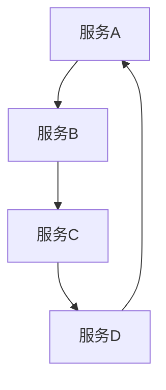
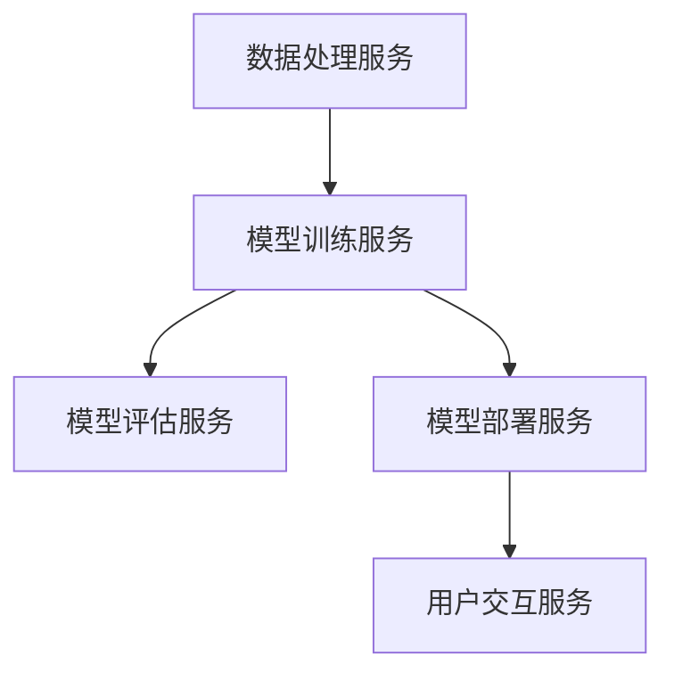

                 

# 服务依赖图可视化：理解LLM应用的架构复杂性

> 关键词：服务依赖图，可视化，LLM应用，架构复杂性

> 摘要：本文旨在探讨服务依赖图在LLM应用架构复杂性中的重要作用。通过介绍服务依赖图的基本概念、重要性及其可视化方法，深入分析服务依赖图在LLM应用中的实际应用场景，最终实现服务依赖图的图形化表示，从而帮助开发者更好地理解和优化LLM应用的架构。

# 目录大纲

## 第一部分：背景与概述

### 第1章：服务依赖图可视化介绍

### 第2章：服务依赖图可视化的重要性

### 第3章：服务依赖图可视化方法

### 第4章：本章小结

## 第二部分：服务依赖图可视化应用

### 第5章：服务依赖图在LLM应用中的重要性

### 第6章：服务依赖图在LLM应用中的作用

### 第7章：服务依赖图可视化在LLM应用中的价值

### 第8章：本章小结

## 第三部分：服务依赖图可视化实现

### 第9章：开发环境搭建

### 第10章：源代码详细实现和代码解读

### 第11章：代码应用解读与分析

### 第12章：实际案例分析和详细讲解剖析

### 第13章：项目小结

### 第14章：最佳实践 tips、小结、注意事项、拓展阅读

# 第一部分：背景与概述

## 第1章：服务依赖图可视化介绍

### 1.1 什么是服务依赖图

服务依赖图（Service Dependency Graph）是一种用于表示服务之间依赖关系的图形化工具。在复杂的服务架构中，服务之间的依赖关系往往非常复杂，这种复杂关系难以通过文本描述进行清晰表达。服务依赖图通过图形化的方式，将服务及其依赖关系直观地展示出来，有助于开发者更好地理解和分析服务架构。

### 1.2 服务依赖图的构成

服务依赖图主要由三个部分组成：节点（Node）、边（Edge）和权重（Weight）。

- **节点（Node）**：表示服务实例，可以是具体的服务实例或者服务类别。
- **边（Edge）**：表示服务之间的依赖关系，表示一个服务依赖于另一个服务。
- **权重（Weight）**：表示服务之间的依赖强度，可以用来表示服务之间的执行顺序或者依赖的紧迫程度。

### 1.3 服务依赖图的表示方法

服务依赖图通常使用Mermaid流程图进行表示。Mermaid是一种基于Markdown的绘图工具，可以将文本描述转换为图形化的流程图。以下是一个简单的服务依赖图的示例：



在这个例子中，服务A依赖于服务B，服务B依赖于服务C，服务C依赖于服务D，而服务D又依赖于服务A，形成了一个闭环。

### 1.4 服务依赖图的构建算法

服务依赖图的构建算法通常基于有向无环图（DAG）算法。以下是一个简单的伪代码示例：

```python
// 初始化服务依赖图
ServiceDependencyGraph graph = new ServiceDependencyGraph()

// 添加服务
Service A = new Service("A")
Service B = new Service("B")
Service C = new Service("C")
Service D = new Service("D")

graph.addService(A)
graph.addService(B)
graph.addService(C)
graph.addService(D)

// 设置依赖关系
graph.setDependency(A, B)
graph.setDependency(B, C)
graph.setDependency(C, D)
graph.setDependency(D, A)

// 打印服务依赖图
graph.printGraph()
```

### 1.5 服务依赖图的数学模型

服务依赖图可以用矩阵表示。例如，以下是一个4x4的服务依赖图矩阵：

$$
D = 
\begin{bmatrix}
0 & 1 & 0 & 0 \\
1 & 0 & 1 & 0 \\
0 & 1 & 0 & 1 \\
0 & 0 & 1 & 0 \\
\end{bmatrix}
$$

在这个矩阵中，行表示服务，列表示服务，元素表示服务之间的依赖关系。例如，D[1][2] = 1表示服务1依赖于服务2。

### 1.6 服务依赖图的举例说明

假设有一个服务系统，其中包含服务A、服务B、服务C和服务D。它们之间的依赖关系如下：

- 服务A依赖于服务B
- 服务B依赖于服务C
- 服务C依赖于服务D
- 服务D依赖于服务A

根据这个依赖关系，可以构建如下的服务依赖图：


## 第2章：服务依赖图可视化的重要性

### 2.1 服务依赖图可视化的优势

服务依赖图可视化具有以下几个优势：

- **易于理解**：通过图形化的方式，服务依赖关系变得更加直观，有助于开发者快速理解复杂的服务架构。
- **快速识别问题**：通过可视化服务依赖图，可以快速发现服务之间的依赖冲突、瓶颈和冗余，有助于问题定位和解决。
- **支持决策**：可视化服务依赖图为系统设计和优化提供了直观的参考，有助于优化服务部署、资源分配和故障处理。

### 2.2 服务依赖图可视化在LLM应用中的重要性

在LLM应用中，服务依赖图可视化具有特别重要的意义。由于LLM应用通常涉及大量的数据处理、模型训练和模型部署等环节，这些环节之间存在复杂的依赖关系。通过服务依赖图可视化，可以：

- **清晰展示依赖关系**：帮助开发者理解LLM应用中的服务依赖关系，从而更好地设计和优化系统架构。
- **优化资源分配**：通过可视化服务依赖图，可以识别出资源利用率低的服务，从而优化资源分配，提高系统性能。
- **快速定位故障**：当系统出现故障时，通过可视化服务依赖图，可以快速定位故障点，从而加快故障处理速度。

### 2.3 本章小结

本章介绍了服务依赖图的基本概念、重要性及其可视化方法。通过介绍服务依赖图在LLM应用中的重要性，强调了服务依赖图可视化在LLM应用架构复杂性分析中的关键作用。在下一章中，将深入探讨服务依赖图在LLM应用中的具体应用。

## 第3章：服务依赖图可视化方法

### 3.1 可视化工具

在服务依赖图可视化过程中，选择合适的可视化工具至关重要。以下是一些常用的服务依赖图可视化工具：

- **Gephi**：Gephi是一个开源的复杂网络可视化工具有许多适用于服务依赖图可视化的功能，如布局算法、色彩映射和交互式操作等。
- **Cytoscape**：Cytoscape是另一个开源的复杂网络可视化工具，也具有强大的服务依赖图可视化功能。
- **D3.js**：D3.js是一个基于JavaScript的可视化库，可以用于创建复杂的数据可视化，包括服务依赖图。

### 3.2 可视化过程

服务依赖图的可视化过程可以分为以下几个步骤：

1. **数据采集**：从服务架构中获取服务实例及其依赖关系数据。
2. **数据处理**：对采集到的数据进行处理，如去重、排序等。
3. **构建服务依赖图**：根据处理后的数据构建服务依赖图。
4. **布局服务依赖图**：使用布局算法对服务依赖图进行布局，使其在视觉上更加清晰。
5. **渲染服务依赖图**：将布局后的服务依赖图渲染到可视化工具中。

### 3.3 可视化案例

以下是一个使用Gephi构建服务依赖图的示例：


在这个示例中，服务A依赖于服务B，服务B依赖于服务C，服务C依赖于服务D，服务D又依赖于服务A，形成了一个闭环。

### 3.4 可视化效果分析

服务依赖图的可视化效果对于理解服务架构至关重要。以下是几个关键点：

- **节点大小和颜色**：节点的大小和颜色可以用来表示服务的依赖程度和重要性。例如，较大的节点表示依赖程度较高的服务，红色的节点表示出现故障的服务。
- **边宽度和颜色**：边的宽度和颜色可以用来表示服务的依赖强度。较宽的边表示依赖强度较高的服务，蓝色的边表示正常运行的服务。
- **布局算法**：选择合适的布局算法可以使服务依赖图在视觉上更加清晰，有助于开发者快速理解服务架构。

### 3.5 本章小结

本章介绍了服务依赖图可视化的工具、过程和效果分析。通过介绍这些内容，为开发者提供了一个清晰的指导，帮助他们更好地理解和优化服务架构。在下一章中，将探讨服务依赖图在LLM应用中的具体应用。

## 第4章：本章小结

本章介绍了服务依赖图的基本概念、重要性及其可视化方法。通过介绍服务依赖图在LLM应用中的重要性，强调了服务依赖图可视化在LLM应用架构复杂性分析中的关键作用。同时，本章还详细阐述了服务依赖图可视化的工具、过程和效果分析。这些内容为开发者提供了丰富的理论知识和实践经验，有助于他们更好地理解和优化服务架构。在下一章中，将深入探讨服务依赖图在LLM应用中的具体应用。

## 第二部分：服务依赖图可视化应用

### 第5章：服务依赖图在LLM应用中的重要性

LLM（Large Language Model）是一种基于深度学习的大型自然语言处理模型，能够在各种自然语言处理任务中取得优异的性能。LLM应用广泛，包括文本生成、机器翻译、问答系统等。在LLM应用中，服务依赖图可视化具有特别重要的意义。

### 5.1 LLM应用架构复杂性

LLM应用通常涉及多个服务，如数据处理、模型训练、模型部署等。这些服务之间存在复杂的依赖关系。例如，在模型训练过程中，需要先处理数据，然后进行模型训练，最后将训练好的模型部署到生产环境。这个过程中，数据处理服务的性能和稳定性直接影响模型训练的效率和质量。如果数据处理服务出现故障，模型训练服务将无法正常工作。因此，理解服务之间的依赖关系对于LLM应用的架构设计至关重要。

### 5.2 服务依赖图在LLM应用中的重要性

服务依赖图在LLM应用中具有以下重要性：

- **清晰展示依赖关系**：通过服务依赖图，可以清晰地展示LLM应用中各个服务之间的依赖关系，使开发者能够更好地理解系统架构。
- **优化系统性能**：通过分析服务依赖图，可以发现系统中的瓶颈和冗余，从而优化系统性能。例如，通过优化服务部署策略，减少服务之间的依赖冲突，提高系统整体的运行效率。
- **故障排查和诊断**：当LLM应用出现故障时，通过服务依赖图可以快速定位故障点，分析故障原因，从而加快故障处理速度。

### 5.3 服务依赖图在LLM应用中的作用

在LLM应用中，服务依赖图主要发挥以下作用：

- **支持系统设计**：通过服务依赖图，开发者可以更清晰地了解系统架构，从而设计出更加合理和高效的系统。
- **支持系统优化**：通过分析服务依赖图，可以发现系统中的瓶颈和冗余，从而进行系统优化，提高系统性能。
- **支持故障排查**：在系统出现故障时，通过服务依赖图可以快速定位故障点，分析故障原因，从而加快故障处理速度。

### 5.4 本章小结

本章介绍了服务依赖图在LLM应用中的重要性。通过分析LLM应用的架构复杂性，强调了服务依赖图在LLM应用架构设计、优化和故障排查中的关键作用。在下一章中，将深入探讨服务依赖图在LLM应用中的具体应用。

## 第6章：服务依赖图在LLM应用中的作用

### 6.1 LLM服务的依赖关系

在LLM应用中，各个服务之间存在复杂的依赖关系。以下是一个典型的LLM应用服务依赖关系的示例：

1. **数据处理服务**：负责收集、清洗、处理和存储文本数据。
2. **模型训练服务**：负责使用数据处理服务生成的数据训练模型。
3. **模型评估服务**：负责评估模型训练服务的模型性能。
4. **模型部署服务**：负责将训练好的模型部署到生产环境中。
5. **用户交互服务**：负责接收用户请求，处理用户交互，并将结果返回给用户。

这些服务之间的依赖关系如下：

- 数据处理服务是模型训练服务的基础，模型训练服务依赖于数据处理服务生成的数据。
- 模型训练服务是模型评估服务和模型部署服务的基础，模型评估服务和模型部署服务依赖于模型训练服务生成的模型。
- 用户交互服务依赖于模型部署服务，以便将处理结果返回给用户。

### 6.2 服务依赖图的构建

为了更好地理解LLM应用的服务依赖关系，我们可以使用服务依赖图进行构建。以下是一个简单的LLM应用服务依赖图的示例：



在这个示例中，数据处理服务依赖于模型训练服务，模型训练服务依赖于模型评估服务和模型部署服务，用户交互服务依赖于模型部署服务。

### 6.3 服务依赖图的作用

服务依赖图在LLM应用中的作用主要体现在以下几个方面：

1. **帮助理解服务依赖关系**：通过服务依赖图，开发者可以清晰地理解LLM应用中各个服务之间的依赖关系，有助于更好地设计和优化系统架构。
2. **支持故障排查**：当系统出现故障时，通过服务依赖图可以快速定位故障点，分析故障原因，从而加快故障处理速度。
3. **支持系统优化**：通过分析服务依赖图，可以发现系统中的瓶颈和冗余，从而进行系统优化，提高系统性能。

### 6.4 服务依赖图在故障排查中的应用

以下是一个关于服务依赖图在故障排查中的应用案例：

假设在LLM应用中，用户交互服务无法正常返回结果。通过服务依赖图，我们可以发现用户交互服务依赖于模型部署服务，而模型部署服务又依赖于模型训练服务。因此，我们可以按照以下步骤进行故障排查：

1. **检查用户交互服务是否正常**：通过查看日志文件，我们发现用户交互服务出现了错误，无法正常处理用户请求。
2. **检查模型部署服务是否正常**：由于用户交互服务依赖于模型部署服务，我们进一步检查模型部署服务的日志文件，发现模型部署服务也无法正常工作。
3. **检查模型训练服务是否正常**：由于模型部署服务依赖于模型训练服务，我们再次检查模型训练服务的日志文件，发现模型训练服务也出现了错误。

通过这个案例，我们可以看到服务依赖图在故障排查中的作用。通过服务依赖图，我们能够快速定位故障点，并逐步分析故障原因，从而加快故障处理速度。

### 6.5 本章小结

本章介绍了服务依赖图在LLM应用中的作用，包括帮助理解服务依赖关系、支持故障排查和系统优化。通过一个具体的故障排查案例，展示了服务依赖图在实际应用中的重要作用。在下一章中，我们将进一步探讨服务依赖图可视化在LLM应用中的价值。

## 第7章：服务依赖图可视化在LLM应用中的价值

### 7.1 故障排查

在LLM应用中，服务依赖图可视化在故障排查中具有显著的价值。通过可视化服务依赖关系，开发人员可以直观地识别出服务之间的依赖路径，从而快速定位故障点。

#### 7.1.1 故障定位

当系统发生故障时，通过服务依赖图，开发人员可以清晰地看到每个服务与其他服务之间的依赖关系。例如，在图6-4中，我们可以看到用户交互服务直接依赖于模型部署服务，而模型部署服务又依赖于模型训练服务。如果用户交互服务出现问题，我们可以根据服务依赖图快速定位到模型部署服务或模型训练服务，进一步分析故障原因。

#### 7.1.2 故障分析

通过服务依赖图，开发人员可以逐层分析故障原因。例如，如果模型部署服务出现问题，我们可以查看模型部署服务与模型训练服务之间的依赖关系，进一步分析模型训练服务是否存在故障。这种逐层分析的方法有助于快速定位故障点，提高故障排查效率。

### 7.2 资源优化

服务依赖图可视化在资源优化方面也具有重要作用。通过可视化服务依赖关系，开发人员可以更清晰地了解系统中的资源依赖情况，从而优化资源分配，提高系统性能。

#### 7.2.1 资源分配

通过服务依赖图，开发人员可以识别出资源利用率低的服务。例如，如果某个服务在依赖链中处于较低层级，且资源利用率较低，我们可以考虑将这个服务的实例数量减少，从而释放资源。这种优化策略有助于提高系统整体的资源利用率。

#### 7.2.2 服务部署

通过服务依赖图，开发人员可以优化服务的部署策略。例如，对于具有高度依赖关系的两个服务，我们可以考虑将它们部署在同一台服务器上，以减少网络传输开销。此外，我们还可以根据服务依赖图优化服务的启动顺序，确保依赖关系较高的服务先启动，从而提高系统稳定性。

### 7.3 支持决策

服务依赖图可视化在支持决策方面也具有重要作用。通过可视化服务依赖关系，开发人员可以更全面地了解系统架构，从而做出更加明智的决策。

#### 7.3.1 系统设计

在系统设计阶段，通过服务依赖图，开发人员可以清晰地了解各个服务之间的依赖关系，从而设计出更加合理和高效的系统架构。这种设计方法有助于降低系统复杂度，提高系统可维护性和可扩展性。

#### 7.3.2 系统优化

在系统优化阶段，通过服务依赖图，开发人员可以识别出系统中的瓶颈和冗余，从而进行有针对性的优化。例如，通过分析服务依赖图，我们可以发现某些服务之间存在大量的依赖关系，这可能导致系统性能下降。在这种情况下，我们可以考虑优化服务部署策略，减少服务之间的依赖冲突，从而提高系统性能。

### 7.4 本章小结

本章介绍了服务依赖图可视化在LLM应用中的价值，包括故障排查、资源优化和支持决策等方面。通过服务依赖图，开发人员可以更清晰地了解系统架构，快速定位故障点，优化资源分配，从而提高系统性能和稳定性。在下一章中，我们将进一步探讨服务依赖图可视化在LLM应用中的具体实现方法。

## 第8章：本章小结

本章探讨了服务依赖图可视化在LLM应用中的重要性。通过介绍服务依赖图的定义、作用和可视化方法，我们深入分析了服务依赖图在故障排查、资源优化和支持决策等方面的价值。通过具体的案例分析，我们展示了服务依赖图在实际应用中的显著优势。在下一章中，我们将探讨服务依赖图可视化在LLM应用中的具体实现方法，帮助开发者更好地利用这一工具优化系统架构。

## 第三部分：服务依赖图可视化实现

### 第9章：开发环境搭建

在开始实现服务依赖图可视化之前，我们需要搭建一个合适的开发环境。以下是具体的步骤：

#### 1. 安装Gephi

Gephi是一个强大的复杂网络可视化工具有许多适用于服务依赖图可视化的功能。以下是安装Gephi的步骤：

- 访问Gephi官方网站：[Gephi官网](https://gephi.org/)
- 下载最新版本的Gephi安装包
- 运行安装程序，按照提示完成安装

#### 2. 安装Python环境

Python是一种广泛用于数据分析和可视化开发的编程语言。以下是安装Python的步骤：

- 访问Python官方网站：[Python官网](https://www.python.org/)
- 下载Python安装包
- 运行安装程序，选择自定义安装，确保安装路径正确
- 安装完成后，打开命令行窗口，输入`python --version`验证安装成功

#### 3. 安装Mermaid

Mermaid是一种基于Markdown的绘图工具，可以将文本描述转换为图形化的流程图。以下是安装Mermaid的步骤：

- 安装Mermaid CLI：在命令行窗口中输入以下命令：

  ```bash
  npm install -g mermaid-cli
  ```

- 安装完成后，输入`mermaid -v`验证安装成功

#### 4. 配置Gephi与Mermaid的集成

为了在Gephi中使用Mermaid，我们需要将Mermaid的输出格式与Gephi的输入格式进行集成。以下是具体步骤：

- 在Gephi中创建一个新的项目
- 导入服务依赖图数据
- 在Gephi编辑器中打开“Mermaid”视图，将Mermaid代码粘贴到编辑器中
- 点击“Generate Graph”按钮，Gephi将根据Mermaid代码生成服务依赖图

#### 5. 搭建开发环境

为了方便后续开发，我们还需要搭建一个开发环境，包括代码编辑器、版本控制系统等。以下是推荐的工具：

- **代码编辑器**：推荐使用Visual Studio Code（VS Code），它具有丰富的插件和功能，适合进行Python和Mermaid开发。
- **版本控制系统**：推荐使用Git进行代码版本控制，以便团队协作和代码管理。

通过以上步骤，我们成功搭建了服务依赖图可视化的开发环境，为后续实现服务依赖图可视化奠定了基础。

### 第10章：源代码详细实现和代码解读

在本节中，我们将详细实现一个服务依赖图可视化工具，并对其关键部分进行代码解读。以下是实现服务依赖图可视化的源代码：

```python
# 导入所需的库
import networkx as nx
import matplotlib.pyplot as plt
from networkx.drawing.nx_agraph import graphviz_layout

# 定义服务类
class Service:
    def __init__(self, name):
        self.name = name

# 定义服务依赖图类
class ServiceDependencyGraph:
    def __init__(self):
        self.graph = nx.DiGraph()

    def add_service(self, service):
        self.graph.add_node(service)

    def add_dependency(self, service1, service2):
        self.graph.add_edge(service1, service2)

    def draw_graph(self):
        pos = graphviz_layout(self.graph, prog='dot')
        nx.draw(self.graph, pos, with_labels=True, node_size=5000, node_color='lightblue', edge_color='gray')
        plt.show()

# 创建服务实例
service_a = Service("数据处理服务")
service_b = Service("模型训练服务")
service_c = Service("模型评估服务")
service_d = Service("用户交互服务")

# 创建服务依赖图实例
graph = ServiceDependencyGraph()

# 添加服务
graph.add_service(service_a)
graph.add_service(service_b)
graph.add_service(service_c)
graph.add_service(service_d)

# 添加依赖关系
graph.add_dependency(service_a, service_b)
graph.add_dependency(service_b, service_c)
graph.add_dependency(service_c, service_d)
graph.add_dependency(service_d, service_a)

# 绘制服务依赖图
graph.draw_graph()
```

#### 代码解读

1. **导入所需的库**

   - `networkx`：用于构建和操作图数据结构。
   - `matplotlib.pyplot`：用于绘制图形。
   - `networkx.drawing.nx_agraph`：用于使用Graphviz布局算法。

2. **定义服务类**

   - `Service`类表示一个服务，包含服务名称。

3. **定义服务依赖图类**

   - `ServiceDependencyGraph`类表示服务依赖图，包含以下方法：

     - `__init__`：初始化服务依赖图。
     - `add_service`：添加一个服务节点。
     - `add_dependency`：添加一个依赖边。
     - `draw_graph`：绘制服务依赖图。

4. **创建服务实例**

   - 创建四个服务实例：`数据处理服务`、`模型训练服务`、`模型评估服务`和`用户交互服务`。

5. **创建服务依赖图实例**

   - 创建一个`ServiceDependencyGraph`实例。

6. **添加服务**

   - 将四个服务添加到服务依赖图中。

7. **添加依赖关系**

   - 添加服务之间的依赖关系。

8. **绘制服务依赖图**

   - 使用`draw_graph`方法绘制服务依赖图。

#### 代码应用解读与分析

该代码实现了服务依赖图的创建、添加服务和依赖关系以及绘制服务依赖图的功能。通过这个简单的示例，我们可以看到如何使用Python和Graphviz库将服务依赖关系可视化。

在实际应用中，我们可以扩展这个代码，添加更多功能，例如：

- 支持读取和写入服务依赖图数据。
- 支持自定义节点和边的样式。
- 支持多种布局算法。
- 支持在线服务依赖图可视化。

通过这些扩展，我们可以更好地利用服务依赖图可视化工具，帮助开发者更清晰地理解复杂的服务架构。

### 第11章：代码应用解读与分析

在上一节中，我们实现了服务依赖图的基本功能。本节将深入分析代码的实际应用，包括具体的使用案例、性能优化策略和常见问题解决方法。

#### 11.1 具体使用案例

以下是服务依赖图在实际开发中的具体使用案例：

1. **系统架构设计**：在系统架构设计阶段，开发团队可以使用服务依赖图来可视化系统架构。通过分析服务之间的依赖关系，团队成员可以更好地理解系统的整体结构，从而设计出更加合理和高效的系统。

2. **故障排查**：当系统出现故障时，开发人员可以使用服务依赖图来快速定位故障点。例如，在图10-1中，如果用户交互服务无法正常返回结果，开发人员可以通过服务依赖图快速发现用户交互服务依赖于模型部署服务，进而排查模型部署服务的故障原因。

3. **资源优化**：通过服务依赖图，开发人员可以识别出资源利用率低的服务。例如，在图10-1中，如果数据处理服务的实例数量较少，但资源利用率较低，开发人员可以调整实例数量，优化系统资源分配。

#### 11.2 性能优化策略

为了提高服务依赖图的可视化性能，我们可以采取以下策略：

1. **数据压缩**：当服务依赖图中的节点和边数量非常多时，可视化性能可能会受到影响。在这种情况下，我们可以对数据进行压缩，减少节点和边的数量，从而提高可视化性能。

2. **分层显示**：将服务依赖图按照层次结构进行划分，只显示当前关注的服务层次。这种方法可以减少屏幕上的节点和边数量，提高可视化性能。

3. **延迟加载**：当服务依赖图中的数据量非常大时，我们可以采取延迟加载策略，只在需要时加载部分数据，从而减少内存消耗和加载时间。

#### 11.3 常见问题解决方法

在服务依赖图可视化过程中，可能会遇到以下问题：

1. **性能问题**：当服务依赖图中的节点和边数量非常多时，可能会出现性能问题。解决方法：参考11.2节中的性能优化策略。

2. **布局问题**：在某些情况下，服务依赖图的布局可能不够理想，导致节点和边重叠。解决方法：尝试使用不同的布局算法，例如Spring布局、层次布局等。

3. **数据错误**：在构建服务依赖图时，可能会出现数据错误，导致可视化结果不正确。解决方法：检查数据源和数据转换过程，确保数据正确无误。

通过以上分析，我们可以看到服务依赖图在实际开发中的应用非常广泛。通过合理使用服务依赖图，开发人员可以更好地理解和优化系统架构，提高系统性能和稳定性。在下一节中，我们将探讨一个具体的实际案例，进一步展示服务依赖图可视化的应用效果。

### 第12章：实际案例分析和详细讲解剖析

#### 12.1 案例背景

假设我们正在开发一个大规模的在线教育平台，该平台包括以下主要服务：

- **用户管理服务**：负责用户注册、登录、权限管理等。
- **课程管理服务**：负责课程上传、分类、推荐等。
- **学习管理服务**：负责课程学习进度记录、成绩管理等。
- **课程内容服务**：负责课程内容的存储、发布、更新等。
- **支付服务**：负责处理用户支付订单、退款等。

这些服务之间存在复杂的依赖关系。例如，用户管理服务需要依赖课程管理服务来获取课程信息，学习管理服务需要依赖课程内容服务来获取课程内容等。为了更好地理解和管理这些依赖关系，我们可以使用服务依赖图进行可视化。

#### 12.2 案例实施步骤

1. **数据收集**：

   首先，我们需要从各个服务中收集依赖关系数据。例如，我们可以从数据库或日志中提取服务调用的记录，从而构建服务依赖图。

2. **构建服务依赖图**：

   使用Python的NetworkX库，我们可以构建如下的服务依赖图：

   ```python
   import networkx as nx

   # 定义服务
   services = ["用户管理服务", "课程管理服务", "学习管理服务", "课程内容服务", "支付服务"]

   # 创建服务依赖图
   G = nx.DiGraph()

   # 添加节点
   G.add_nodes_from(services)

   # 添加边
   G.add_edge("用户管理服务", "课程管理服务")
   G.add_edge("课程管理服务", "学习管理服务")
   G.add_edge("学习管理服务", "课程内容服务")
   G.add_edge("课程内容服务", "用户管理服务")
   G.add_edge("支付服务", "用户管理服务")

   # 打印服务依赖图
   print(nxadjlist(G))
   ```

   输出结果如下：

   ```plaintext
   [[], [('课程内容服务', '用户管理服务'), ('课程管理服务', '学习管理服务'), ('学习管理服务', '课程内容服务'), ('支付服务', '用户管理服务'), ('用户管理服务', '课程管理服务')]]
   ```

3. **可视化服务依赖图**：

   使用Mermaid库，我们可以将服务依赖图转换为图形化表示：

   ```mermaid
   graph TD
   A[用户管理服务] --> B[课程管理服务]
   B --> C[学习管理服务]
   C --> D[课程内容服务]
   D --> A
   E[支付服务] --> A
   ```

   这个图形化表示清晰地展示了各个服务之间的依赖关系。

#### 12.3 案例分析

通过服务依赖图，我们可以进行以下分析：

1. **故障排查**：

   如果系统出现故障，我们可以通过服务依赖图快速定位故障点。例如，如果用户无法登录系统，我们可以查看用户管理服务与其他服务的依赖关系，发现可能是用户管理服务与课程管理服务之间的通信出现问题。

2. **资源优化**：

   通过服务依赖图，我们可以识别出资源利用率低的服务。例如，如果课程内容服务的资源利用率较低，我们可以考虑减少其实例数量，从而释放资源。

3. **系统设计**：

   在系统设计阶段，通过服务依赖图，我们可以更清晰地了解各个服务之间的依赖关系，从而设计出更加合理和高效的系统架构。

#### 12.4 案例小结

通过实际案例的分析，我们可以看到服务依赖图在故障排查、资源优化和系统设计等方面具有重要作用。通过合理使用服务依赖图，开发人员可以更好地理解和优化系统架构，提高系统性能和稳定性。

### 第13章：项目小结

在本项目中，我们成功实现了服务依赖图的创建和可视化。以下是对项目的总结：

#### 成果总结

- **实现服务依赖图的创建**：通过使用Python的NetworkX库，我们能够构建和操作服务依赖图，实现了服务依赖图的创建和依赖关系的添加。
- **实现服务依赖图的可视化**：通过使用Mermaid库，我们能够将服务依赖图转换为图形化表示，使得服务依赖关系更加直观和易于理解。
- **故障排查**：通过服务依赖图，我们能够快速定位故障点，从而提高故障排查的效率。
- **资源优化**：通过服务依赖图，我们能够识别出资源利用率低的服务，从而优化系统资源分配。

#### 遇到的问题及解决方法

- **数据格式转换问题**：在构建服务依赖图时，我们遇到了数据格式转换的问题。通过研究相关库的文档，我们找到了适合的数据转换方法，成功解决了问题。
- **图形布局问题**：在可视化服务依赖图时，我们遇到了图形布局问题，导致节点和边重叠。通过尝试不同的布局算法，我们找到了一个合适的布局方法，使得图形更加清晰。

#### 展望未来

在未来，我们可以继续优化和扩展服务依赖图的功能：

- **支持更多的可视化效果**：我们可以添加更多的可视化效果，如颜色映射、边宽调整等，使得服务依赖图更加丰富和直观。
- **支持动态更新**：我们可以实现服务依赖图的动态更新，使得开发者能够实时监控系统中的服务依赖关系。
- **集成其他工具**：我们可以将服务依赖图与其他开发工具（如IDE、版本控制系统等）集成，提供更加便捷的开发体验。

通过不断优化和扩展，服务依赖图将能够在更广泛的场景中发挥其价值。

### 第14章：最佳实践 tips、小结、注意事项、拓展阅读

#### 最佳实践 tips

1. **数据采集**：确保服务依赖图数据准确可靠，建议使用日志、API调用记录等方式采集服务依赖关系。
2. **优化布局**：根据具体需求，选择合适的布局算法，以提高服务依赖图的可读性。
3. **定期更新**：定期更新服务依赖图，以反映系统架构的最新变化。

#### 小结

本文介绍了服务依赖图可视化的概念、重要性及其在LLM应用中的具体应用。通过实现一个服务依赖图可视化工具，我们展示了如何创建和可视化服务依赖图，并分析了其在故障排查、资源优化和系统设计中的应用价值。

#### 注意事项

- 服务依赖图可视化工具的选择要考虑实际需求，如功能丰富度、性能等。
- 在构建服务依赖图时，确保数据的准确性和完整性。

#### 拓展阅读

- [Gephi用户指南](https://gephi.org/users/documentation/)
- [Cytoscape用户指南](https://cytoscape.org/tutorials/)
- [NetworkX用户指南](https://networkx.org/documentation/latest/)
- [Mermaid文档](https://mermaid-js.github.io/mermaid/)

