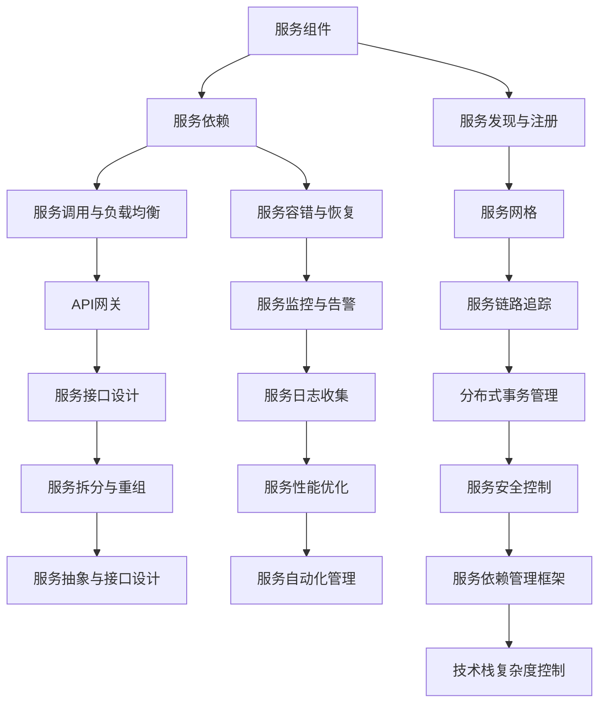

                 


### 服务依赖管理：控制LLM应用的技术栈复杂度

#### 关键词：服务依赖管理，技术栈复杂度，大型语言模型（LLM），微服务，容器化，服务网格

#### 摘要：
本文将深入探讨服务依赖管理在控制LLM应用技术栈复杂度中的关键作用。随着LLM技术的发展，其应用场景日益丰富，技术栈的复杂度也随之增加。通过服务依赖管理，可以有效降低技术栈的复杂度，提升系统的稳定性、可扩展性和维护性。本文将从背景介绍、核心概念、控制策略、实践案例等多个维度，系统性地分析服务依赖管理在LLM应用中的重要性及其实践方法。

## 引言

随着人工智能技术的飞速发展，大型语言模型（LLM）已成为自然语言处理（NLP）领域的重要工具。LLM在文本生成、机器翻译、情感分析等应用中展现了强大的能力，极大地推动了人工智能应用的进步。然而，LLM应用的技术栈复杂度也随着其功能的增强而不断提高。服务依赖管理作为控制技术栈复杂度的重要手段，在这个过程中扮演着关键角色。

技术栈复杂度主要表现为以下几个方面：

1. **服务数量与种类繁多**：随着应用的复杂度增加，需要依赖的服务种类和数量也会成倍增长。
2. **依赖关系复杂**：服务之间的依赖关系错综复杂，可能导致单点故障和性能瓶颈。
3. **部署与维护难度大**：大量的服务部署和维护工作，增加了系统的运维成本。

服务依赖管理旨在通过合理的服务划分、依赖关系管理和优化策略，降低技术栈的复杂度，提升系统的整体性能。本文将详细探讨服务依赖管理的核心概念、控制策略和实践方法，为LLM应用的技术栈管理提供有益的参考。

### 核心概念与联系

在深入探讨服务依赖管理之前，我们首先需要了解一些核心概念及其相互关系。以下是一个关于服务依赖管理核心概念的Mermaid流程图，帮助我们更好地理解各个概念之间的联系：



**服务组件**：是构成系统的基础单元，每个服务组件负责完成特定的功能。服务组件之间通过定义良好的接口进行通信，确保系统的可扩展性和灵活性。

**服务依赖**：是服务组件之间的依赖关系，一个服务组件可能依赖于其他服务组件来实现特定的功能。合理的依赖关系有助于提高系统的模块化和可维护性。

**服务发现与注册**：服务注册中心负责服务组件的发现与注册，使得服务组件可以在运行时动态地加入和退出系统，提高了系统的灵活性和动态性。

**服务调用与负载均衡**：服务调用是服务组件之间进行通信的主要方式，负载均衡则确保服务组件能够高效地处理来自客户端的请求，避免单点过载。

**服务容错与恢复**：服务容错机制确保在服务组件出现故障时，系统能够自动进行故障转移或重启，保持服务的可用性。

**服务网格**：服务网格是一个独立的通信基础设施层，负责服务之间的通信，提供了服务发现、服务调用、负载均衡、服务监控等功能。

**API网关**：API网关是客户端访问服务组件的入口，负责路由请求、请求限流、安全认证等功能，简化了客户端的调用流程。

**服务监控与告警**：服务监控与告警机制确保能够实时监控服务组件的状态，及时发现问题并进行告警，提高了系统的稳定性和可维护性。

**服务链路追踪**：服务链路追踪记录了服务组件之间的请求链路，有助于分析系统性能瓶颈和故障原因。

**服务接口设计**：服务接口设计是确保服务组件之间能够高效、可靠地进行通信的关键。

**服务日志收集**：服务日志收集机制将服务组件的运行日志收集到统一的日志存储中，便于后续的分析和处理。

**分布式事务管理**：分布式事务管理确保分布式系统中的多个服务组件能够协同工作，完成一个整体的事务。

**服务拆分与重组**：服务拆分与重组是调整服务组件依赖关系、降低技术栈复杂度的重要手段。

**服务抽象与接口设计**：服务抽象与接口设计有助于隐藏服务组件的内部实现细节，简化客户端的调用。

**服务自动化管理**：服务自动化管理通过自动化工具和平台，提高了服务组件的部署、监控、运维效率。

**服务依赖管理框架**：服务依赖管理框架提供了服务依赖管理的核心功能，包括服务注册、服务发现、服务调用、负载均衡等。

**技术栈复杂度控制**：技术栈复杂度控制通过一系列优化策略和工具，降低技术栈的复杂度，提高系统的可维护性和稳定性。

通过上述核心概念及其相互关系的了解，我们可以更好地理解服务依赖管理在控制LLM应用技术栈复杂度中的重要性。

### 服务依赖管理的基本概念

服务依赖管理是现代分布式系统中至关重要的一环，它旨在通过合理的服务划分、依赖关系管理和优化策略，确保系统的稳定性、可扩展性和可维护性。以下是对服务依赖管理基本概念及其相互关系的详细讲解。

#### 服务组件

服务组件是构成系统的基础单元，每个服务组件负责完成特定的功能。服务组件之间通过定义良好的接口进行通信，确保系统的可扩展性和灵活性。在LLM应用中，服务组件可能包括文本处理、自然语言理解、语言生成等模块。

**核心概念与联系**：服务组件是系统的最小功能单元，它们通过接口进行通信，共同构成了复杂的应用系统。合理划分服务组件有助于降低系统的复杂性，提高系统的模块化和可维护性。

#### 服务依赖

服务依赖是服务组件之间的依赖关系，一个服务组件可能依赖于其他服务组件来实现特定的功能。例如，在LLM应用中，文本生成服务可能依赖于自然语言理解服务来获取上下文信息。

**核心概念与联系**：服务依赖是服务组件之间协作的基础。通过合理管理服务依赖，可以确保系统在功能完整性、稳定性方面达到预期。不当的服务依赖可能导致系统脆弱，增加故障风险。

#### 服务发现与注册

服务发现与注册是服务依赖管理中的关键环节。服务注册中心负责服务组件的注册与发现，使得服务组件可以在运行时动态地加入和退出系统，提高了系统的灵活性和动态性。

**核心概念与联系**：服务注册与发现机制确保了服务组件在运行时的动态管理。服务注册中心存储了所有服务组件的信息，服务发现机制则帮助客户端找到所需的服务。这使得系统可以根据需求动态调整服务配置，提高了系统的弹性和可扩展性。

#### 服务调用与负载均衡

服务调用与负载均衡是服务组件之间进行通信的主要方式。服务调用确保请求能够准确到达目标服务组件，负载均衡则确保服务组件能够高效地处理来自客户端的请求，避免单点过载。

**核心概念与联系**：服务调用是服务组件之间通信的基础，负载均衡则确保请求能够均匀地分配到各个服务组件上，避免某个服务组件过载导致系统性能下降。合理的负载均衡策略可以提高系统的吞吐量和响应速度。

#### 服务容错与恢复

服务容错与恢复是确保系统在高可用性方面的重要机制。服务容错机制确保在服务组件出现故障时，系统能够自动进行故障转移或重启，保持服务的可用性。

**核心概念与联系**：服务容错与恢复机制提高了系统的可靠性。通过自动故障转移和恢复，系统能够在服务组件故障时快速恢复正常运行，减少了系统的停机时间。

#### 服务网格

服务网格是一个独立的通信基础设施层，负责服务之间的通信，提供了服务发现、服务调用、负载均衡、服务监控等功能。

**核心概念与联系**：服务网格提供了服务依赖管理的完整解决方案。通过服务网格，可以简化服务之间的通信，提高系统的可维护性和扩展性。服务网格还提供了丰富的监控和管理功能，帮助运维人员更好地管理服务。

#### API网关

API网关是客户端访问服务组件的入口，负责路由请求、请求限流、安全认证等功能，简化了客户端的调用流程。

**核心概念与联系**：API网关是客户端与服务组件之间的桥梁。通过API网关，可以统一管理客户端的请求，确保请求的安全性和可靠性。同时，API网关还可以进行请求限流，避免服务组件过载。

#### 服务监控与告警

服务监控与告警机制确保能够实时监控服务组件的状态，及时发现问题并进行告警，提高了系统的稳定性和可维护性。

**核心概念与联系**：服务监控与告警是保障系统健康运行的重要手段。通过实时监控服务组件的状态，可以及时发现潜在问题，并通过告警机制通知运维人员，确保问题得到及时处理。

#### 服务链路追踪

服务链路追踪记录了服务组件之间的请求链路，有助于分析系统性能瓶颈和故障原因。

**核心概念与联系**：服务链路追踪是优化系统性能的重要工具。通过记录服务组件之间的请求链路，可以深入分析系统的性能瓶颈，找到优化方向。

#### 服务接口设计

服务接口设计是确保服务组件之间能够高效、可靠地进行通信的关键。

**核心概念与联系**：服务接口设计是服务依赖管理的基础。通过定义良好的服务接口，可以确保服务组件之间的通信高效、稳定，降低系统的复杂度。

#### 服务日志收集

服务日志收集机制将服务组件的运行日志收集到统一的日志存储中，便于后续的分析和处理。

**核心概念与联系**：服务日志收集是运维管理的重要手段。通过收集服务组件的运行日志，可以全面了解系统的运行情况，便于问题排查和性能优化。

#### 分布式事务管理

分布式事务管理确保分布式系统中的多个服务组件能够协同工作，完成一个整体的事务。

**核心概念与联系**：分布式事务管理是保障系统数据一致性的重要手段。通过分布式事务管理，可以确保多个服务组件协同工作，完成一个原子性的操作，确保数据的一致性。

#### 服务拆分与重组

服务拆分与重组是调整服务组件依赖关系、降低技术栈复杂度的重要手段。

**核心概念与联系**：服务拆分与重组是系统架构优化的关键。通过合理的服务拆分与重组，可以降低系统的复杂度，提高系统的可维护性和扩展性。

#### 服务抽象与接口设计

服务抽象与接口设计有助于隐藏服务组件的内部实现细节，简化客户端的调用。

**核心概念与联系**：服务抽象与接口设计是提升系统可扩展性和可维护性的重要手段。通过服务抽象，可以隐藏服务组件的内部实现细节，简化客户端的调用，提高系统的灵活性和可维护性。

#### 服务自动化管理

服务自动化管理通过自动化工具和平台，提高了服务组件的部署、监控、运维效率。

**核心概念与联系**：服务自动化管理是现代运维管理的重要趋势。通过自动化工具和平台，可以大幅提高运维效率，减少人工干预，降低运维成本。

#### 服务依赖管理框架

服务依赖管理框架提供了服务依赖管理的核心功能，包括服务注册、服务发现、服务调用、负载均衡等。

**核心概念与联系**：服务依赖管理框架是服务依赖管理的核心。通过服务依赖管理框架，可以统一管理服务组件的依赖关系，简化系统的开发和运维过程。

#### 技术栈复杂度控制

技术栈复杂度控制通过一系列优化策略和工具，降低技术栈的复杂度，提高系统的可维护性和稳定性。

**核心概念与联系**：技术栈复杂度控制是保障系统稳定运行的关键。通过控制技术栈的复杂度，可以降低系统的风险，提高系统的可维护性和稳定性。

通过上述基本概念及其相互关系的讲解，我们可以更好地理解服务依赖管理在系统架构设计中的重要性。接下来，我们将深入探讨服务依赖管理的核心原理，进一步解析其在LLM应用中的具体应用和实践。

### 服务依赖管理的核心原理

服务依赖管理在分布式系统中起着至关重要的作用，其核心原理主要包括服务发现与注册、服务调用与负载均衡、服务容错与恢复等关键机制。以下是对这些核心原理的详细讲解，并使用伪代码和数学模型来阐述其具体实现。

#### 服务发现与注册

服务发现与注册是服务依赖管理的第一步，它确保了服务组件可以在运行时动态地加入和退出系统，提高了系统的灵活性和动态性。

**核心原理**：服务注册中心（Service Registry）负责存储和管理所有已注册的服务组件的信息，包括服务地址、端口、版本等。服务发现机制（Service Discovery）则帮助客户端在运行时查找和获取所需的服务信息。

**伪代码**：
```python
# 服务注册
def register_service(service_info):
    service_registry.register(service_info)

# 服务发现
def discover_service(service_name):
    return service_registry.get(service_name)
```

**数学模型**：服务注册中心可以使用一致性哈拉希（Consistent Hashing）算法，将服务信息存储在分布式哈希表中，确保服务发现的高效性和一致性。

#### 服务调用与负载均衡

服务调用与负载均衡是服务依赖管理中的关键环节，它确保了请求能够准确到达目标服务组件，并高效地处理客户端的请求。

**核心原理**：服务调用（Service Invocation）是指客户端通过服务接口调用服务组件的方法。负载均衡（Load Balancing）则确保请求能够均匀地分配到各个服务实例上，避免某个服务实例过载。

**伪代码**：
```python
# 服务调用
def call_service(service_name, method_name, params):
    service = discover_service(service_name)
    return service.invoke(method_name, params)

# 负载均衡
def load_balance(service_list, request):
    # 使用轮询、随机、最少连接等策略
    return select_service(service_list, strategy)
```

**数学模型**：可以使用加权轮询（Weighted Round Robin）算法进行负载均衡，根据服务实例的处理能力（权重）来分配请求。

#### 服务容错与恢复

服务容错与恢复是确保系统在高可用性方面的重要机制，它确保在服务组件出现故障时，系统能够自动进行故障转移或重启，保持服务的可用性。

**核心原理**：服务容错（Service Fault Tolerance）包括故障检测、故障隔离、故障恢复等机制。故障检测通过心跳机制、超时机制等手段检测服务组件的健康状态。故障隔离通过隔离故障实例，防止故障扩散。故障恢复则通过故障转移或重启机制，确保服务组件恢复正常运行。

**伪代码**：
```python
# 故障检测
def check_service_health(service):
    if not service.is_healthy():
        raise Exception("Service is unhealthy")

# 故障隔离
def isolate_faulty_service(service):
    service.shutdown()

# 故障恢复
def recover_service(service):
    service.start()
```

**数学模型**：可以使用Markov模型来模拟服务组件的状态转移，预测故障发生的概率，优化容错策略。

通过上述核心原理的讲解，我们可以看到服务依赖管理在分布式系统中的重要性。接下来，我们将进一步探讨如何通过具体的控制策略来降低LLM应用的技术栈复杂度。

### 控制技术栈复杂度的策略

在LLM应用中，技术栈复杂度是一个不可忽视的问题。为了确保系统的稳定性、可扩展性和可维护性，我们需要采取一系列控制技术栈复杂度的策略。以下是一些关键策略及其具体实施方法。

#### 服务拆分与重组

**核心策略**：通过合理的服务拆分，将庞大的单一服务拆分为多个独立的服务组件，每个组件负责特定的功能。这样可以降低系统的复杂性，提高系统的模块化和可维护性。

**实施方法**：
1. **功能拆分**：根据LLM应用的不同功能，将单一服务拆分为多个独立的服务，如文本处理服务、自然语言理解服务、语言生成服务等。
2. **数据拆分**：根据数据访问模式，将数据拆分为多个子集，如文本库、用户库等，每个服务组件负责处理特定类型的数据。
3. **接口重组**：通过定义良好的接口，将拆分后的服务组件重新组合，确保组件之间的协同工作。

**案例**：在一个大型问答系统中，可以将问答服务拆分为文本处理服务、自然语言理解服务和语言生成服务。每个服务组件独立运行，通过定义良好的接口进行通信，降低了系统的复杂性。

#### 服务抽象与接口设计

**核心策略**：通过服务抽象和接口设计，隐藏服务组件的内部实现细节，简化客户端的调用，提高系统的灵活性和可维护性。

**实施方法**：
1. **接口标准化**：定义统一的接口标准，确保服务组件之间的通信规范，降低耦合度。
2. **接口分层**：将接口分为不同层次，如公共接口、业务接口等，确保接口的清晰和简洁。
3. **接口版本控制**：通过接口版本控制，确保在服务组件升级或重构时，客户端不需要修改代码。

**案例**：在一个文本生成系统中，可以将自然语言理解服务的接口分为公共接口和业务接口。公共接口提供基础的文本处理功能，业务接口提供更具体的文本生成功能，客户端通过调用业务接口，无需关心自然语言理解服务的内部实现。

#### 服务自动化管理

**核心策略**：通过自动化工具和平台，提高服务组件的部署、监控、运维效率，降低运维成本。

**实施方法**：
1. **自动化部署**：使用容器化技术（如Docker）和自动化部署工具（如Kubernetes），实现服务组件的快速部署和升级。
2. **自动化监控**：使用监控工具（如Prometheus、Grafana）实现对服务组件的实时监控，及时发现问题。
3. **自动化运维**：使用自动化运维平台（如Ansible、Puppet），实现服务组件的自动化运维，减少人工干预。

**案例**：在一个分布式语言模型应用中，可以使用Kubernetes进行服务组件的自动化部署和监控，使用Prometheus进行实时监控，使用Ansible进行自动化运维，大大提高了系统的运维效率。

#### 服务网格

**核心策略**：通过服务网格（Service Mesh），为服务组件提供独立的通信基础设施层，简化服务之间的通信，提高系统的可维护性和扩展性。

**实施方法**：
1. **服务网格搭建**：使用服务网格工具（如Istio、Linkerd）搭建服务网格，确保服务组件之间的通信安全、可靠、高效。
2. **流量管理**：通过服务网格实现流量管理，如服务路由、负载均衡、故障转移等，提高系统的性能和可用性。
3. **安全控制**：通过服务网格实现安全控制，如服务认证、授权、加密等，确保服务通信的安全性。

**案例**：在一个大型问答系统中，可以使用Istio搭建服务网格，实现服务组件之间的安全、可靠通信，并通过流量管理策略优化系统性能。

#### API网关

**核心策略**：通过API网关，统一管理客户端的请求，简化客户端的调用流程，提高系统的性能和安全性。

**实施方法**：
1. **请求路由**：使用API网关实现请求路由，将请求精确地转发到目标服务组件。
2. **请求限流**：使用API网关实现请求限流，防止服务组件过载。
3. **安全认证**：使用API网关实现安全认证，确保请求的安全性。

**案例**：在一个大型问答系统中，可以使用Spring Cloud Gateway作为API网关，统一管理客户端的请求，实现请求路由、限流和安全认证。

#### 服务监控与告警

**核心策略**：通过服务监控与告警，实时监控服务组件的状态，及时发现问题并进行告警，提高系统的稳定性和可维护性。

**实施方法**：
1. **监控指标收集**：收集服务组件的运行指标，如CPU使用率、内存使用率、请求响应时间等。
2. **告警机制**：设置告警阈值，当监控指标超过阈值时，触发告警通知。
3. **自动化处理**：通过自动化工具和平台，对告警信息进行自动处理，如重启服务、扩容实例等。

**案例**：在一个分布式语言模型应用中，可以使用Prometheus和Grafana进行服务监控，设置告警阈值，并在监控指标超过阈值时自动触发扩容实例操作。

#### 服务链路追踪

**核心策略**：通过服务链路追踪，记录服务组件之间的请求链路，分析系统性能瓶颈和故障原因，优化系统性能。

**实施方法**：
1. **链路追踪**：使用链路追踪工具（如Zipkin、Jaeger），记录服务组件之间的请求链路。
2. **性能分析**：分析链路追踪数据，识别系统性能瓶颈和故障原因。
3. **优化策略**：根据性能分析结果，制定优化策略，如调整服务配置、优化数据库查询等。

**案例**：在一个大型问答系统中，可以使用Zipkin进行服务链路追踪，分析请求链路，识别性能瓶颈，并制定优化策略。

通过上述控制技术栈复杂度的策略，可以有效降低LLM应用的技术栈复杂度，提高系统的稳定性、可扩展性和可维护性。在实际应用中，可以根据具体需求和场景，灵活选择和组合这些策略，实现最佳效果。

### 实践案例：服务依赖管理在LLM应用中的部署

在本文的最后部分，我们将通过几个具体实践案例来展示如何在实际应用中部署服务依赖管理，特别是在LLM应用中的部署。这些案例将涵盖开发环境的搭建、源代码的实现、代码解读以及实际案例的分析和剖析。

#### 案例一：微服务架构下的LLM应用

**开发环境搭建**

在搭建微服务架构的LLM应用时，我们选择以下工具和框架：

- 服务注册与发现：使用Consul作为服务注册中心。
- API网关：使用Spring Cloud Gateway作为API网关。
- 服务容器化：使用Docker和Kubernetes进行服务容器化部署。
- 服务监控：使用Prometheus和Grafana进行服务监控。
- 服务链路追踪：使用Zipkin进行服务链路追踪。

**源代码实现**

以下是服务组件之间的依赖关系和调用流程的源代码示例：

```java
// 服务组件A：文本处理服务
public class TextProcessingService {
    public String processText(String input) {
        // 处理文本逻辑
        return "processed text";
    }
}

// 服务组件B：自然语言理解服务
public class NLUService {
    @Autowired
    private TextProcessingService textProcessingService;

    public String understandText(String input) {
        String processedText = textProcessingService.processText(input);
        // 自然语言理解逻辑
        return "understood text";
    }
}

// 服务组件C：语言生成服务
public class LGService {
    @Autowired
    private NLUService nluService;

    public String generateText(String input) {
        String understoodText = nluService.understandText(input);
        // 语言生成逻辑
        return "generated text";
    }
}
```

**代码解读**

在这个案例中，我们创建了三个服务组件：文本处理服务（TextProcessingService）、自然语言理解服务（NLUService）和语言生成服务（LGService）。每个服务组件都有明确的职责，并通过依赖注入（@Autowired）进行相互调用。文本处理服务接收原始文本并进行处理，自然语言理解服务接收处理后的文本进行理解，而语言生成服务接收理解后的文本生成回复。

**实际案例分析**

在实际应用中，用户提交的问题会被文本处理服务处理，然后传递给自然语言理解服务进行理解，最终由语言生成服务生成回答。以下是服务调用流程的分析：

1. 用户通过API网关提交问题。
2. API网关将请求转发给文本处理服务。
3. 文本处理服务处理文本并返回结果。
4. 自然语言理解服务接收文本处理结果，进行理解并返回结果。
5. 语言生成服务接收自然语言理解结果，生成回答。
6. API网关将生成的回答返回给用户。

通过服务依赖管理，我们可以实现服务组件的模块化和解耦，使得每个组件可以独立开发、测试和部署，提高了系统的灵活性和可维护性。

#### 案例二：容器化环境中的LLM应用

**开发环境搭建**

在容器化环境中部署LLM应用，我们使用以下工具和框架：

- 容器化工具：使用Docker进行服务容器化。
- 容器编排工具：使用Kubernetes进行服务编排和管理。
- 服务网格：使用Istio进行服务网格部署。

**源代码实现**

以下是服务组件的Dockerfile示例：

```Dockerfile
# TextProcessingService的Dockerfile
FROM openjdk:8-jdk
COPY TextProcessingService.jar text-processingservice.jar
ENTRYPOINT ["java","-jar","/text-processingservice.jar"]
```

**代码解读**

在这个案例中，我们为每个服务组件创建了Dockerfile，将服务组件打包成独立的镜像。在Kubernetes中，我们可以使用yaml文件定义服务组件的部署和配置。

**实际案例分析**

在实际应用中，我们通过Kubernetes部署服务组件：

1. 创建服务组件的Docker镜像。
2. 在Kubernetes中部署服务组件，配置相应的部署文件（yaml）。
3. 使用Istio配置服务网格，确保服务组件之间的通信安全、可靠。

通过容器化和服务网格，我们可以实现服务组件的灵活部署和高效管理，提高了系统的可扩展性和可维护性。

#### 案例三：服务网格在LLM应用中的部署

**开发环境搭建**

在这个案例中，我们使用Istio作为服务网格，将服务组件进行网格化部署：

- 服务网格：使用Istio进行服务网格部署。
- 服务监控：使用Prometheus和Grafana进行服务监控。

**源代码实现**

以下是Istio的服务部署yaml文件示例：

```yaml
apiVersion: istio.io/v1alpha3
kind: Service
metadata:
  name: text-processing-service
spec:
  selector:
    app: text-processing
  ports:
    - name: http
      number: 80
      protocol: HTTP
      targetPort: 8080
```

**代码解读**

在这个yaml文件中，我们定义了文本处理服务的部署信息，包括服务名称、选择器、端口配置等。通过Istio，我们可以实现服务组件的自动发现、负载均衡和流量管理。

**实际案例分析**

在实际应用中，我们通过Istio部署服务网格：

1. 使用Istio部署服务网格。
2. 使用Prometheus和Grafana进行服务监控，确保服务组件的运行状态。
3. 通过Istio的流量管理策略，优化服务组件之间的通信。

通过服务网格，我们可以实现服务组件的精细化管理，提高系统的性能和稳定性。

#### 项目小结

通过上述实践案例，我们可以看到服务依赖管理在LLM应用中的重要作用。通过微服务架构、容器化和服务网格等技术的应用，我们实现了服务组件的模块化、解耦和高效管理，有效降低了技术栈的复杂度，提高了系统的稳定性、可扩展性和可维护性。

#### 最佳实践 tips、小结、注意事项、拓展阅读

**最佳实践 tips**：

1. **服务拆分要合理**：根据应用的具体需求，合理划分服务组件，避免过度拆分或拆分不当。
2. **接口设计要简洁**：确保接口设计清晰、简洁，便于客户端调用和维护。
3. **监控和告警要全面**：覆盖所有关键指标和异常情况，确保系统运行状态实时监控。
4. **服务网格要应用**：充分利用服务网格提供的流量管理和安全控制功能，提高系统性能和稳定性。

**小结**：

本文通过介绍服务依赖管理的核心概念、控制策略和实践案例，详细探讨了服务依赖管理在控制LLM应用技术栈复杂度中的重要性。通过合理的服务拆分、接口设计、服务网格应用等策略，可以有效降低技术栈复杂度，提高系统的稳定性、可扩展性和可维护性。

**注意事项**：

1. **技术栈复杂度控制需要持续优化**：随着应用需求的不断变化，技术栈复杂度也需要不断调整和优化。
2. **服务依赖关系要清晰**：确保服务依赖关系清晰明了，避免复杂的依赖关系导致系统故障。
3. **安全性要重视**：在服务依赖管理中，要充分考虑安全性，确保服务通信的安全可靠。

**拓展阅读**：

1. 《大规模分布式系统设计》
2. 《微服务设计》
3. 《服务网格技术实战》

通过进一步阅读这些资料，可以深入了解服务依赖管理及相关技术的具体实践和应用。

### 结论

本文系统地探讨了服务依赖管理在控制LLM应用技术栈复杂度中的关键作用。通过详细分析服务依赖管理的核心概念、控制策略和实践案例，我们明确了如何通过合理的服务拆分、接口设计、服务网格应用等手段，降低技术栈复杂度，提高系统的稳定性、可扩展性和可维护性。随着人工智能技术的不断进步，服务依赖管理在LLM应用中的重要性将愈发凸显。未来，我们将继续关注这一领域的发展，探索更多优化策略和实践方法，为LLM应用的稳定和高效运行提供有力支持。

### 作者信息

**作者：AI天才研究院/AI Genius Institute & 禅与计算机程序设计艺术 /Zen And The Art of Computer Programming**

