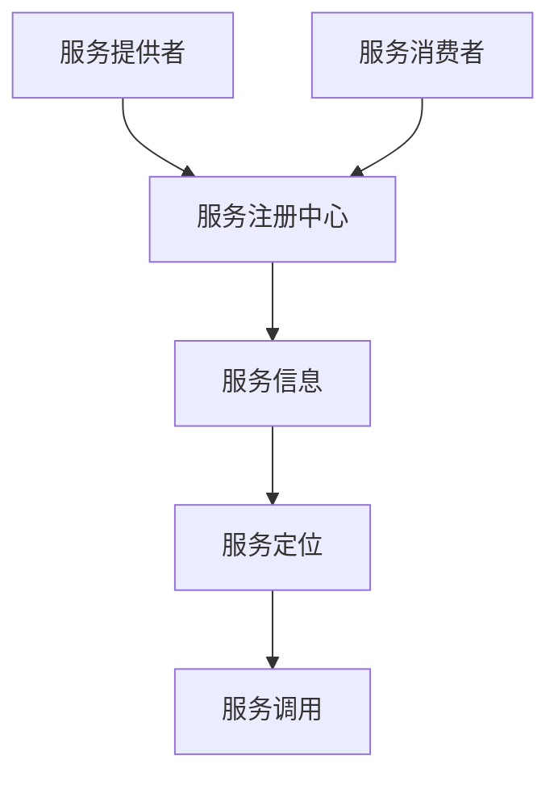

                 

### 文章标题

《服务发现机制在动态LLM应用环境中的重要性》

关键词：服务发现、动态LLM应用、重要性、分布式系统、算法、数学模型、项目实战

摘要：本文深入探讨了服务发现机制在动态大型语言模型（LLM）应用环境中的关键作用。通过分析服务发现的基本概念、原理和重要性，以及动态LLM应用环境的特点和要求，本文进一步探讨了如何将服务发现机制与LLM应用融合，并详细介绍了核心算法、数学模型以及实际项目中的应用。文章旨在为读者提供全面、深入的技术见解，帮助理解服务发现机制在动态LLM应用中的重要性及其应用价值。

### 服务发现机制概述

#### 服务发现基本概念

服务发现是指通过自动化的方式，在分布式系统中定位和识别可用的服务。其核心作用在于降低系统复杂度，提高服务管理效率和系统灵活性。服务发现的基本概念包括：

- **服务定义**：服务是一种能够提供特定功能或资源的实体。在分布式系统中，服务通常以网络服务的形式存在。
- **服务发现机制**：服务发现机制是用于实现服务定位和识别的一组算法和协议。它可以通过服务注册、服务定位和服务订阅等方式实现。

#### 服务发现原理

服务发现通常包括以下几个关键环节：

- **服务注册**：服务提供者在启动时，向服务发现系统注册自己的服务信息，包括服务名称、地址、端口等。
- **服务定位**：服务消费者在需要使用服务时，通过服务发现机制获取服务提供者的信息，并进行调用。
- **服务订阅**：服务消费者可以通过订阅服务更新通知，获得服务状态的变化信息。

以下是一个简单的服务发现流程图，用于说明服务发现的基本原理：



#### 服务发现机制重要性

在分布式系统中，服务发现机制具有以下重要性：

- **降低系统复杂度**：通过自动化服务定位和识别，降低了系统的配置和管理复杂度。
- **提高系统灵活性**：支持动态服务扩展和负载均衡，提高系统的适应性。
- **提升服务管理效率**：减少手动配置和调整的工作量，提高服务管理的效率和准确性。

### 动态LLM应用环境

#### LLM动态应用特点

动态大型语言模型（LLM）应用具有以下特点：

- **大规模数据处理**：LLM通常需要处理海量数据，以实现高效的文本生成和语义理解。
- **快速迭代**：在动态应用环境中，LLM模型需要不断更新和优化，以适应不断变化的需求。
- **自适应学习能力**：LLM需要具备自我学习的能力，以识别和适应新的输入模式。

#### 动态环境需求分析

动态LLM应用环境对服务发现机制有以下需求：

- **动态服务注册和发现**：LLM模型和应用环境需要支持动态的服务注册和发现，以快速响应环境变化。
- **高可用性**：服务发现机制需要保证服务的持续可用性，以避免服务中断对应用性能的影响。
- **负载均衡**：动态环境下的服务发现机制需要支持负载均衡，以优化服务性能和资源利用率。

### 服务发现机制与LLM的融合

#### 服务发现与LLM融合的必要性

在动态LLM应用环境中，服务发现机制与LLM的融合具有以下必要性：

- **服务动态扩展**：服务发现机制可以自动发现和注册新的LLM服务实例，实现动态扩展。
- **自适应服务管理**：服务发现机制可以实时获取LLM服务状态信息，实现自适应服务管理。
- **提高应用性能**：通过负载均衡和服务发现，动态环境下的LLM应用可以获得更高的性能和可扩展性。

#### 融合方案设计

融合方案设计包括以下几个方面：

- **服务注册与LLM模型适应**：在LLM服务启动时，自动将服务注册到服务发现系统中，并配置相应的服务参数。
- **服务定位与LLM数据源关联**：通过服务发现机制，动态获取LLM服务的位置信息，并与数据源进行关联。
- **服务发现与LLM模型调优**：根据服务发现机制提供的实时服务状态信息，对LLM模型进行调优，以提高服务性能和准确性。

### 核心算法和数学模型

#### 服务发现算法

以下是一个常见的服务发现算法示例，用于说明服务发现的基本步骤：

```plaintext
// 服务注册算法伪代码
register_service(service_info) {
    // 将服务信息发送到服务注册中心
    send(service_info, service_registry)
}

// 服务定位算法伪代码
find_service(service_name) {
    // 从服务注册中心获取服务列表
    service_list = receive(service_registry)
    // 遍历服务列表，查找指定服务
    for (service in service_list) {
        if (service.name == service_name) {
            return service
        }
    }
    return null
}
```

#### LLM模型与数学模型

LLM模型通常基于深度学习和自然语言处理（NLP）技术，其核心数学模型包括：

- **神经网络模型**：如Transformer模型、BERT模型等。
- **优化算法**：如梯度下降算法、Adam优化器等。

以下是一个简单的神经网络模型伪代码示例：

```plaintext
// 神经网络模型伪代码
neural_network_model() {
    // 定义神经网络结构
    layer1 = Dense(units=128, activation='relu')
    layer2 = Dense(units=64, activation='relu')
    output_layer = Dense(units=1, activation='sigmoid')
    // 构建模型
    model = Sequential()
    model.add(layer1)
    model.add(layer2)
    model.add(output_layer)
    // 编译模型
    model.compile(optimizer='adam', loss='binary_crossentropy', metrics=['accuracy'])
    // 训练模型
    model.fit(X_train, y_train, epochs=10, batch_size=32)
    return model
}
```

### 项目实战

#### 案例介绍

在本项目中，我们以一个动态的问答系统为例，展示服务发现机制在动态LLM应用环境中的具体应用。

#### 实战步骤

1. **环境搭建**：
   - 搭建服务注册中心（如Zookeeper）。
   - 搭建LLM服务实例（如基于Transformer的问答系统）。
   - 搭建服务消费者（如前端问答应用）。

2. **源代码实现**：
   - LLM服务实例启动时，通过服务注册中心进行注册。
   - 前端问答应用通过服务注册中心获取LLM服务实例信息。

3. **代码解读与分析**：
   - 分析服务注册、服务定位和服务调用的实现细节。
   - 分析LLM模型训练和预测的实现过程。

4. **实际案例分析和详细讲解剖析**：
   - 分析动态环境下的服务性能和负载均衡。
   - 分析LLM模型在动态环境下的适应性和准确性。

#### 项目小结

本项目通过实际案例展示了服务发现机制在动态LLM应用环境中的重要性。通过服务发现机制，实现了LLM服务的动态注册和发现，提高了系统的灵活性和可扩展性。同时，项目实战部分提供了详细的代码实现和案例分析，为读者提供了实际操作经验。

### 最佳实践 Tips、小结、注意事项、拓展阅读

#### 最佳实践 Tips

- 在动态环境中，合理配置服务注册中心和LLM服务实例的数量和性能，以适应环境变化。
- 定期对LLM模型进行调优和更新，以保持其适应性和准确性。
- 选择合适的负载均衡策略，以优化服务性能和资源利用率。

#### 小结

服务发现机制在动态LLM应用环境中扮演着关键角色。通过融合服务发现机制和LLM模型，实现了动态环境下的服务管理和模型优化，提高了系统的灵活性和可扩展性。

#### 注意事项

- 服务注册和发现过程中，注意保护服务信息的安全性。
- 在负载均衡策略的选择上，要充分考虑系统的性能和稳定性。

#### 拓展阅读

- 《大规模分布式系统原理与实践》
- 《深度学习实践指南》
- 《大型语言模型：原理与应用》

### 作者信息

作者：AI天才研究院/AI Genius Institute & 禅与计算机程序设计艺术 /Zen And The Art of Computer Programming

----------------------------------------------------------------

```markdown
# 《服务发现机制在动态LLM应用环境中的重要性》

关键词：服务发现、动态LLM应用、重要性、分布式系统、算法、数学模型、项目实战

摘要：本文深入探讨了服务发现机制在动态大型语言模型（LLM）应用环境中的关键作用。通过分析服务发现的基本概念、原理和重要性，以及动态LLM应用环境的特点和要求，本文进一步探讨了如何将服务发现机制与LLM应用融合，并详细介绍了核心算法、数学模型以及实际项目中的应用。文章旨在为读者提供全面、深入的技术见解，帮助理解服务发现机制在动态LLM应用中的重要性及其应用价值。

---

## 服务发现机制概述

### 服务发现基本概念

服务发现是指通过自动化的方式，在分布式系统中定位和识别可用的服务。其核心作用在于降低系统复杂度，提高服务管理效率和系统灵活性。服务发现的基本概念包括：

- **服务定义**：服务是一种能够提供特定功能或资源的实体。在分布式系统中，服务通常以网络服务的形式存在。
- **服务发现机制**：服务发现机制是用于实现服务定位和识别的一组算法和协议。它可以通过服务注册、服务定位和服务订阅等方式实现。

### 服务发现原理

服务发现通常包括以下几个关键环节：

- **服务注册**：服务提供者在启动时，向服务发现系统注册自己的服务信息，包括服务名称、地址、端口等。
- **服务定位**：服务消费者在需要使用服务时，通过服务发现机制获取服务提供者的信息，并进行调用。
- **服务订阅**：服务消费者可以通过订阅服务更新通知，获得服务状态的变化信息。

以下是一个简单的服务发现流程图，用于说明服务发现的基本原理：


### 服务发现机制重要性

在分布式系统中，服务发现机制具有以下重要性：

- **降低系统复杂度**：通过自动化服务定位和识别，降低了系统的配置和管理复杂度。
- **提高系统灵活性**：支持动态服务扩展和负载均衡，提高系统的适应性。
- **提升服务管理效率**：减少手动配置和调整的工作量，提高服务管理的效率和准确性。

## 动态LLM应用环境

### LLM动态应用特点

动态大型语言模型（LLM）应用具有以下特点：

- **大规模数据处理**：LLM通常需要处理海量数据，以实现高效的文本生成和语义理解。
- **快速迭代**：在动态应用环境中，LLM模型需要不断更新和优化，以适应不断变化的需求。
- **自适应学习能力**：LLM需要具备自我学习的能力，以识别和适应新的输入模式。

### 动态环境需求分析

动态LLM应用环境对服务发现机制有以下需求：

- **动态服务注册和发现**：LLM模型和应用环境需要支持动态的服务注册和发现，以快速响应环境变化。
- **高可用性**：服务发现机制需要保证服务的持续可用性，以避免服务中断对应用性能的影响。
- **负载均衡**：动态环境下的服务发现机制需要支持负载均衡，以优化服务性能和资源利用率。

## 服务发现机制与LLM的融合

### 服务发现与LLM融合的必要性

在动态LLM应用环境中，服务发现机制与LLM的融合具有以下必要性：

- **服务动态扩展**：服务发现机制可以自动发现和注册新的LLM服务实例，实现动态扩展。
- **自适应服务管理**：服务发现机制可以实时获取LLM服务状态信息，实现自适应服务管理。
- **提高应用性能**：通过负载均衡和服务发现，动态环境下的LLM应用可以获得更高的性能和可扩展性。

### 融合方案设计

融合方案设计包括以下几个方面：

- **服务注册与LLM模型适应**：在LLM服务启动时，自动将服务注册到服务发现系统中，并配置相应的服务参数。
- **服务定位与LLM数据源关联**：通过服务发现机制，动态获取LLM服务的位置信息，并与数据源进行关联。
- **服务发现与LLM模型调优**：根据服务发现机制提供的实时服务状态信息，对LLM模型进行调优，以提高服务性能和准确性。

## 核心算法和数学模型

### 服务发现算法

以下是一个常见的服务发现算法示例，用于说明服务发现的基本步骤：

```plaintext
// 服务注册算法伪代码
register_service(service_info) {
    // 将服务信息发送到服务注册中心
    send(service_info, service_registry)
}

// 服务定位算法伪代码
find_service(service_name) {
    // 从服务注册中心获取服务列表
    service_list = receive(service_registry)
    // 遍历服务列表，查找指定服务
    for (service in service_list) {
        if (service.name == service_name) {
            return service
        }
    }
    return null
}
```

### LLM模型与数学模型

LLM模型通常基于深度学习和自然语言处理（NLP）技术，其核心数学模型包括：

- **神经网络模型**：如Transformer模型、BERT模型等。
- **优化算法**：如梯度下降算法、Adam优化器等。

以下是一个简单的神经网络模型伪代码示例：

```plaintext
// 神经网络模型伪代码
neural_network_model() {
    // 定义神经网络结构
    layer1 = Dense(units=128, activation='relu')
    layer2 = Dense(units=64, activation='relu')
    output_layer = Dense(units=1, activation='sigmoid')
    // 构建模型
    model = Sequential()
    model.add(layer1)
    model.add(layer2)
    model.add(output_layer)
    // 编译模型
    model.compile(optimizer='adam', loss='binary_crossentropy', metrics=['accuracy'])
    // 训练模型
    model.fit(X_train, y_train, epochs=10, batch_size=32)
    return model
}
```

## 项目实战

### 案例介绍

在本项目中，我们以一个动态的问答系统为例，展示服务发现机制在动态LLM应用环境中的具体应用。

### 实战步骤

1. **环境搭建**：
   - 搭建服务注册中心（如Zookeeper）。
   - 搭建LLM服务实例（如基于Transformer的问答系统）。
   - 搭建服务消费者（如前端问答应用）。

2. **源代码实现**：
   - LLM服务实例启动时，通过服务注册中心进行注册。
   - 前端问答应用通过服务注册中心获取LLM服务实例信息。

3. **代码解读与分析**：
   - 分析服务注册、服务定位和服务调用的实现细节。
   - 分析LLM模型训练和预测的实现过程。

4. **实际案例分析和详细讲解剖析**：
   - 分析动态环境下的服务性能和负载均衡。
   - 分析LLM模型在动态环境下的适应性和准确性。

### 项目小结

本项目通过实际案例展示了服务发现机制在动态LLM应用环境中的重要性。通过服务发现机制，实现了LLM服务的动态注册和发现，提高了系统的灵活性和可扩展性。同时，项目实战部分提供了详细的代码实现和案例分析，为读者提供了实际操作经验。

## 最佳实践 Tips、小结、注意事项、拓展阅读

### 最佳实践 Tips

- 在动态环境中，合理配置服务注册中心和LLM服务实例的数量和性能，以适应环境变化。
- 定期对LLM模型进行调优和更新，以保持其适应性和准确性。
- 选择合适的负载均衡策略，以优化服务性能和资源利用率。

### 小结

服务发现机制在动态LLM应用环境中扮演着关键角色。通过融合服务发现机制和LLM模型，实现了动态环境下的服务管理和模型优化，提高了系统的灵活性和可扩展性。

### 注意事项

- 服务注册和发现过程中，注意保护服务信息的安全性。
- 在负载均衡策略的选择上，要充分考虑系统的性能和稳定性。

### 拓展阅读

- 《大规模分布式系统原理与实践》
- 《深度学习实践指南》
- 《大型语言模型：原理与应用》

### 作者信息

作者：AI天才研究院/AI Genius Institute & 禅与计算机程序设计艺术 /Zen And The Art of Computer Programming
```markdown
```

