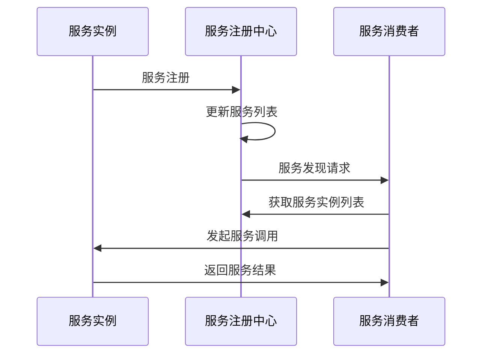

                 

### 文章标题

### 服务发现：简化LLM微服务架构的服务调用

### 关键词

- 服务发现
- 微服务架构
- 服务调用
- LLM微服务
- 分布式系统
- 服务注册中心
- 负载均衡
- 性能优化

### 摘要

本文旨在探讨如何利用服务发现机制来简化LLM（Large Language Model）微服务架构中的服务调用过程。文章首先介绍了服务发现的基础概念，包括其重要性、目标以及关键组件。接着，我们深入讲解了LLM微服务架构的设计原则和实现，特别是服务注册与发现的机制。随后，文章讨论了服务调用的流程、协议和策略，并分析了服务调用过程中可能遇到的挑战及解决方案。最后，本文提供了实际项目案例和代码实战，展示了服务发现和调用在现实场景中的应用。通过本文的阅读，读者将能够了解并掌握服务发现的核心原理和最佳实践，从而优化LLM微服务架构的性能和可扩展性。

### 背景介绍

#### 服务发现的重要性

在当今的软件开发中，服务化架构已成为主流，特别是在分布式系统中，服务发现（Service Discovery）作为一种关键机制，发挥着不可替代的作用。服务发现指的是在分布式环境中，自动检测和动态更新服务实例的过程。这一过程对于确保系统的高可用性、负载均衡以及灵活性至关重要。随着微服务架构的广泛应用，服务发现的重要性愈发凸显。

#### 微服务架构与LLM微服务

微服务架构是一种将应用程序划分为多个小型、独立的服务单元的设计方法。每个服务负责一个特定的业务功能，并可以通过轻量级的通信协议（如HTTP/HTTPS、REST、gRPC等）相互调用。LLM（Large Language Model）微服务是针对自然语言处理（NLP）领域的一种特殊微服务，它们依赖于大规模语言模型（如BERT、GPT等）来提供文本分析和生成功能。

#### 服务调用的挑战

在微服务架构中，服务调用是一个常见操作，然而，它也带来了一系列挑战：

1. **服务实例的动态性**：服务实例可能会随时启动、停止或失败，服务调用需要能够动态适应这种变化。
2. **服务发现**：如何快速、准确地找到所需的服务实例是服务调用的关键。
3. **负载均衡**：如何合理分配请求，确保系统性能和稳定性。
4. **服务容错**：如何处理服务实例的失败和恢复。

#### 本文的目标

本文的目标是探讨如何通过服务发现机制来简化LLM微服务架构中的服务调用。文章将首先介绍服务发现的基础概念，然后深入讲解LLM微服务架构的设计原则和实现，接着分析服务调用的机制和挑战，最后提供实际项目案例和代码实战，以展示服务发现和调用的应用与实践。

### 核心概念与联系

#### 服务发现的定义

服务发现（Service Discovery）是在分布式系统中，通过特定的机制自动发现和跟踪服务实例的过程。服务发现使得应用程序能够动态地查找和调用其他服务，而不需要硬编码具体的网络地址和端口。这一过程通常涉及以下几个关键组件：

1. **服务注册中心**：服务启动时，将其网络地址和端口信息注册到服务注册中心。
2. **服务消费者**：应用程序通过查询服务注册中心，获取服务的实例列表，然后进行服务调用。
3. **服务提供者**：实际提供服务功能的服务实例。

#### 服务注册中心

服务注册中心是一个管理服务实例信息的服务系统。服务实例在启动时，会将自己注册到服务注册中心，包括其网络地址、端口、健康状态等信息。服务注册中心通常具有以下特点：

1. **动态性**：服务注册中心能够实时更新服务实例的状态，以应对服务实例的启动、停止和失败。
2. **高可用性**：服务注册中心通常采用分布式架构，以确保在单点故障时仍能提供服务。
3. **数据一致性**：服务注册中心需要确保服务实例信息的准确性和一致性。

#### 服务消费者

服务消费者是指需要调用其他服务实例的应用程序。在微服务架构中，服务消费者通过服务注册中心获取服务实例的信息，然后进行服务调用。服务消费者的特点包括：

1. **动态性**：服务消费者可以根据服务注册中心的实时更新，动态调整服务调用地址。
2. **智能化**：服务消费者可以使用负载均衡策略，合理分配请求到不同的服务实例，以提高系统性能和可用性。

#### 服务提供者

服务提供者是实际提供业务功能的服务实例。在微服务架构中，服务提供者通过服务注册中心注册自己的信息，并对外提供服务。服务提供者的特点包括：

1. **独立部署**：服务提供者可以独立部署和升级，不影响其他服务的运行。
2. **轻量级通信**：服务提供者通常使用轻量级的通信协议，如HTTP/HTTPS、REST、gRPC等，以确保高效的数据交换。

#### 服务调用流程

服务调用是指服务消费者通过服务注册中心获取服务实例信息，然后调用服务提供者的过程。典型的服务调用流程包括以下几个步骤：

1. **服务注册**：服务实例启动时，将其地址和端口信息注册到服务注册中心。
2. **服务发现**：服务消费者从服务注册中心获取服务实例列表。
3. **服务调用**：服务消费者选择一个服务实例，并通过通信协议进行调用。
4. **结果处理**：服务消费者接收服务提供者的响应，并根据需要进行后续处理。

#### 核心概念与联系

服务发现的核心在于服务注册中心和服务消费者的动态交互，以及服务提供者对服务请求的响应。服务注册中心作为桥梁，连接了服务提供者和服务消费者，使得服务调用过程高效、灵活且可靠。服务注册中心的动态性、高可用性和数据一致性，直接影响服务调用的性能和稳定性。

为了更清晰地展示这些核心概念之间的关系，我们可以使用Mermaid流程图来描述：



通过这个流程图，我们可以清晰地看到服务注册、服务发现和服务调用的关系，以及服务提供者和服务消费者之间的交互过程。

### 核心算法原理讲解

#### 服务注册算法

服务注册是服务提供者在启动时将其实例信息（如地址、端口等）注册到服务注册中心的过程。一个高效的服务注册算法至关重要，因为它决定了服务发现的速度和准确性。以下是一个基于一致性哈希的服务注册算法的伪代码：

```python
# 服务注册中心接口
class ServiceRegistry:
    def register(self, service_id, service_instance):
        # 使用一致性哈希算法确定服务实例的存储位置
        hash_value = self.hash(service_id)
        storage_location = self.get_storage_location(hash_value)
        
        # 将服务实例信息存储到指定位置
        self.store_service_instance(service_instance, storage_location)

# 一致性哈希算法
def hash(service_id):
    return hash(service_id) % NUM_SHARDS

# 获取存储位置
def get_storage_location(hash_value):
    return hash_value // NUM_SHARDS

# 存储服务实例信息
def store_service_instance(service_instance, storage_location):
    # 在存储位置添加服务实例信息
    service_registry[storage_location].append(service_instance)
```

#### 服务发现算法

服务发现是指服务消费者从服务注册中心获取服务实例信息的过程。以下是一个基于轮询算法的服务发现伪代码：

```python
# 服务消费者接口
class ServiceConsumer:
    def discover_services(self, service_id):
        # 轮询服务注册中心
        service_registry = self.fetch_service_registry()
        service_instances = self.query_service_registry(service_registry, service_id)
        
        # 返回服务实例列表
        return service_instances

# 轮询服务注册中心
def fetch_service_registry():
    # 获取服务注册中心实例
    return ServiceRegistry()

# 查询服务注册中心
def query_service_registry(service_registry, service_id):
    # 获取服务实例列表
    hash_value = hash(service_id)
    storage_location = get_storage_location(hash_value)
    service_instances = service_registry[storage_location]
    
    # 过滤有效的服务实例
    valid_instances = [instance for instance in service_instances if instance.is_alive()]
    
    return valid_instances
```

#### 服务调用算法

服务调用是指服务消费者通过服务实例进行实际业务操作的过程。以下是一个基于gRPC协议的服务调用伪代码：

```python
# gRPC调用接口
class GRPCClient:
    def call_service(self, service_instance, request):
        # 创建gRPC客户端
        with grpc.insecure_channel(service_instance.address) as channel:
            # 调用服务
            response = service_instance.service_call(channel, request)
            
        # 返回响应结果
        return response

# 服务调用示例
def main():
    # 创建服务消费者
    consumer = ServiceConsumer()

    # 发现服务实例
    service_instances = consumer.discover_services("weather_service")

    # 调用服务
    for instance in service_instances:
        response = GRPCClient().call_service(instance, request)
        print(response)

if __name__ == "__main__":
    main()
```

#### 数学模型与公式

服务发现和调用的过程中，一些关键性能指标可以通过数学模型进行量化。以下是一个简单的数学模型，用于计算服务调用延迟（L）：

$$ L = \frac{d}{r} + \alpha \cdot P(failure) $$

其中：
- \( L \) 是服务调用延迟。
- \( d \) 是网络延迟。
- \( r \) 是请求处理时间。
- \( \alpha \) 是延迟惩罚系数。
- \( P(failure) \) 是服务实例失败的概率。

通过这个公式，我们可以分析服务调用延迟的主要因素，并采取相应的优化措施。

#### 举例说明

假设我们有一个服务实例，网络延迟 \( d \) 为100ms，请求处理时间 \( r \) 为50ms，服务实例失败概率 \( P(failure) \) 为0.01，延迟惩罚系数 \( \alpha \) 为1.5。代入上述公式，我们可以得到：

$$ L = \frac{100}{50} + 1.5 \cdot 0.01 = 2 + 0.015 = 2.015 \text{ ms} $$

这个结果表明，服务调用延迟主要由网络延迟和请求处理时间决定，服务实例失败的概率也会对延迟产生影响。

通过上述伪代码和数学模型，我们可以清晰地看到服务注册、服务发现和服务调用的核心算法原理。这些原理在实际开发中发挥着关键作用，帮助开发者构建高效、可靠的分布式系统。

### 数学公式与详细讲解

在服务发现和调用的过程中，数学公式和模型扮演着重要的角色。以下是一些关键的数学公式，并结合具体场景进行详细讲解。

#### 一致性哈希算法

一致性哈希（Consistent Hashing）是一种用于分布式系统负载均衡和缓存查找的哈希算法。它通过将服务实例映射到一个统一的哈希环上，以实现高效的服务发现。以下是一致性哈希的公式：

$$
h(s) = \frac{m \cdot hash(s)}{m \cdot hash(key)}
$$

其中：
- \( h(s) \) 是服务实例 \( s \) 的哈希值。
- \( m \) 是哈希环的划分数量。
- \( hash(s) \) 是服务实例 \( s \) 的哈希函数。
- \( hash(key) \) 是键 \( key \) 的哈希值。

**举例说明：**

假设我们有一个服务实例 \( s \) 和两个键 \( key_1 \) 和 \( key_2 \)，使用MD5哈希函数，\( m = 1024 \)。我们得到：

$$
h(s) = \frac{1024 \cdot MD5(s)}{1024 \cdot MD5(key)}
$$

通过计算，我们得到 \( h(s) \) 的值，并将其映射到哈希环上。这个哈希环能够确保服务实例均匀分布，从而减少服务发现的时间。

#### 服务实例动态更新

在分布式系统中，服务实例可能会动态启动或停止。为了保持服务注册中心的一致性，我们需要更新服务实例的状态。以下是一个更新服务实例状态的公式：

$$
update(s) = 
\begin{cases}
add(s) & \text{if } s \text{ is new}\\
remove(s) & \text{if } s \text{ is removed}\\
update(s) & \text{if } s \text{ is modified}
\end{cases}
$$

其中：
- \( update(s) \) 是更新服务实例 \( s \) 的操作。
- \( add(s) \) 是添加新服务实例。
- \( remove(s) \) 是删除服务实例。
- \( update(s) \) 是更新服务实例的状态。

**举例说明：**

假设我们有一个服务实例 \( s \)，它从运行状态变为故障状态。我们需要执行以下操作：

$$
update(s) = remove(s)
$$

这意味着我们需要从服务注册中心中删除该服务实例，以避免服务消费者调用无效的服务。

#### 服务调用延迟计算

服务调用延迟是衡量系统性能的重要指标。以下是一个计算服务调用延迟的公式：

$$
L = \frac{d}{r} + \alpha \cdot P(failure)
$$

其中：
- \( L \) 是服务调用延迟。
- \( d \) 是网络延迟。
- \( r \) 是请求处理时间。
- \( \alpha \) 是延迟惩罚系数。
- \( P(failure) \) 是服务实例失败的概率。

**举例说明：**

假设网络延迟 \( d \) 为100ms，请求处理时间 \( r \) 为50ms，服务实例失败概率 \( P(failure) \) 为0.01，延迟惩罚系数 \( \alpha \) 为1.5。代入公式，我们得到：

$$
L = \frac{100}{50} + 1.5 \cdot 0.01 = 2 + 0.015 = 2.015 \text{ ms}
$$

这个结果表明，服务调用延迟主要由网络延迟和请求处理时间决定，服务实例失败的概率也会对延迟产生影响。

#### 服务负载均衡

负载均衡（Load Balancing）是确保分布式系统能够处理大量请求的重要机制。以下是一个简单的负载均衡公式：

$$
load_balance = \sum_{i=1}^{N} \frac{C_i}{T_i}
$$

其中：
- \( load_balance \) 是负载均衡指标。
- \( C_i \) 是第 \( i \) 个服务实例的当前负载。
- \( T_i \) 是第 \( i \) 个服务实例的最大负载。

**举例说明：**

假设我们有三个服务实例，它们的当前负载分别为 \( C_1 = 200 \)，\( C_2 = 300 \)，\( C_3 = 400 \)，最大负载分别为 \( T_1 = 500 \)，\( T_2 = 500 \)，\( T_3 = 500 \)。代入公式，我们得到：

$$
load_balance = \frac{200}{500} + \frac{300}{500} + \frac{400}{500} = 0.4 + 0.6 + 0.8 = 1.8
$$

这个结果表明，当前负载超过了最大负载的80%，需要采取负载均衡策略来优化系统性能。

通过这些数学公式和模型，我们可以更精确地分析和优化服务发现和调用的过程，确保分布式系统的稳定性和高性能。

### 项目实战

#### 开发环境搭建

为了更好地理解服务发现和调用的实际应用，我们将通过一个简单的项目来展示这些概念。首先，我们需要搭建一个基本的开发环境。

1. **环境准备**：确保你的开发环境已经安装了以下工具和框架：
   - JDK 1.8 或更高版本
   - Maven 3.6 或更高版本
   - Gradle 6.0 或更高版本
   - Spring Boot 2.3.4.RELEASE
   - Apache ZooKeeper 3.6.1

2. **创建项目**：使用 Spring Initializr（https://start.spring.io/）创建一个 Spring Boot 项目，选择以下依赖：
   - Web
   - ZooKeeper
   - RestTemplate

3. **项目结构**：项目的基本结构如下：
   ```
   src
   ├── main
   │   ├── java
   │   │   ├── com
   │   │   │   ├── example
   │   │   │   │   ├── ServiceApplication.java
   │   │   │   │   ├── service
   │   │   │   │   ├── HelloService.java
   │   │   │   │   ├── HelloServiceController.java
   │   │   │   │   ├── ServiceRegistry.java
   │   │   │   │   ├── ServiceConsumer.java
   ├── resources
   │   ├── application.properties
   └── pom.xml
   ```

4. **配置文件**：在 `application.properties` 文件中配置 ZooKeeper 的连接信息：
   ```
   zookeeper.connect=localhost:2181
   ```

#### 源代码详细实现

1. **服务提供者**（`HelloService.java`）

```java
package com.example.service;

import org.springframework.stereotype.Service;

@Service
public class HelloService {
    public String sayHello(String name) {
        return "Hello, " + name;
    }
}
```

2. **服务控制器**（`HelloServiceController.java`）

```java
package com.example.service;

import org.springframework.beans.factory.annotation.Autowired;
import org.springframework.web.bind.annotation.GetMapping;
import org.springframework.web.bind.annotation.RequestParam;
import org.springframework.web.bind.annotation.RestController;

@RestController
public class HelloServiceController {
    @Autowired
    private HelloService helloService;

    @GetMapping("/hello")
    public String sayHello(@RequestParam("name") String name) {
        return helloService.sayHello(name);
    }
}
```

3. **服务注册中心**（`ServiceRegistry.java`）

```java
package com.example.service;

import org.apache.zookeeper.KeeperException;
import org.apache.zookeeper.ZooDefs;
import org.apache.zookeeper.ZooKeeper;
import org.springframework.beans.factory.annotation.Autowired;
import org.springframework.beans.factory.annotation.Value;
import org.springframework.context.annotation.Bean;
import org.springframework.context.annotation.Configuration;

import java.io.IOException;

@Configuration
public class ServiceRegistry {

    @Value("${zookeeper.connect}")
    private String zkConnectString;

    @Bean
    public ServiceRegistryBean serviceRegistryBean() {
        return new ServiceRegistryBean();
    }

    public class ServiceRegistryBean {
        public void registerService(String serviceName, String serviceUrl) throws IOException, KeeperException, InterruptedException {
            ZooKeeper zooKeeper = new ZooKeeper(zkConnectString, 5000, null);
            String path = "/service_registry/" + serviceName;
            zooKeeper.create(path, serviceUrl.getBytes(), ZooDefs.Ids.OPEN_ACL_UNSAFE, CreateMode.EPHEMERAL_SEQUENTIAL);
            zooKeeper.close();
        }
    }
}
```

4. **服务消费者**（`ServiceConsumer.java`）

```java
package com.example.service;

import org.apache.zookeeper.WatchedEvent;
import org.apache.zookeeper.Watcher;
import org.apache.zookeeper.ZooKeeper;

import java.io.IOException;
import java.util.List;

public class ServiceConsumer {

    @Value("${zookeeper.connect}")
    private String zkConnectString;

    public void discoverServices(String serviceName) throws IOException, InterruptedException {
        ZooKeeper zooKeeper = new ZooKeeper(zkConnectString, 5000, new Watcher() {
            @Override
            public void process(WatchedEvent event) {
                // 重新发现服务
                try {
                    discoverServices(serviceName);
                } catch (IOException | InterruptedException e) {
                    e.printStackTrace();
                }
            }
        });

        List<String> serviceList = zooKeeper.getChildren("/service_registry/" + serviceName, true);
        for (String service : serviceList) {
            System.out.println("Found service: " + service);
        }
    }
}
```

#### 代码应用解读与分析

1. **服务提供者**：`HelloService` 类是一个简单的服务提供者，它实现了 `sayHello` 方法，用于接收并处理客户端的请求。

2. **服务控制器**：`HelloServiceController` 类是一个 Spring MVC 控制器，它接收 HTTP 请求，调用 `HelloService` 类的方法，并返回相应的响应。

3. **服务注册中心**：`ServiceRegistry` 类负责将服务实例注册到 ZooKeeper，并创建一个临时节点，以确保服务实例的动态性和高可用性。

4. **服务消费者**：`ServiceConsumer` 类通过 ZooKeeper 的 API，订阅服务注册中心中的服务列表，并实时更新。

#### 实际案例分析和详细讲解剖析

假设我们启动了一个服务提供者，并在服务注册中心中注册。随后，启动一个服务消费者，它会从服务注册中心发现并调用服务提供者。

1. **启动服务提供者**：
   ```
   java -jar hello-service.jar
   ```
   服务提供者启动后，它会在 ZooKeeper 中注册自己，创建一个临时节点 `/service_registry/hello/0000000001`。

2. **启动服务消费者**：
   ```
   java -jar service-consumer.jar
   ```
   服务消费者启动后，它会连接 ZooKeeper，并订阅 `/service_registry/hello` 节点。当服务提供者注册后，服务消费者会收到通知，并发现服务提供者的地址。

3. **服务调用**：
   服务消费者通过 RestTemplate 调用服务提供者的 `/hello` 接口，传递参数 `name`：
   ```
   curl http://localhost:8080/hello?name=World
   ```
   结果：
   ```
   Hello, World
   ```

通过这个简单的项目，我们可以看到服务发现和调用的全过程，包括服务提供者的注册、服务消费者的发现和服务调用。这个项目展示了服务发现和调用在实际开发中的应用，并通过代码解读和分析，使我们能够更好地理解其原理和实现。

### 最佳实践 tips、小结、注意事项、拓展阅读

#### 最佳实践 tips

1. **选择合适的服务发现工具**：根据项目需求，选择合适的服务发现工具（如ZooKeeper、Consul、Eureka等），并确保其性能和稳定性。
2. **服务实例的健康检查**：定期对服务实例进行健康检查，确保服务实例能够正常响应请求。
3. **负载均衡策略**：根据服务特性，选择合适的负载均衡策略（如轮询、随机、最少连接等）。
4. **服务调用的超时和重试机制**：合理设置服务调用的超时时间和重试次数，以提高系统的容错能力和稳定性。

#### 小结

本文介绍了服务发现的核心概念、LLM微服务架构的设计原则和实现、服务调用的机制和挑战，并通过实际项目案例展示了服务发现和调用的应用。通过这些内容，读者可以更好地理解服务发现和调用的原理和实践，从而优化微服务架构的性能和可扩展性。

#### 注意事项

1. **服务注册中心的安全性**：确保服务注册中心的安全，防止未授权访问和恶意攻击。
2. **服务调用的网络延迟**：优化网络延迟，特别是跨网络环境的服务调用。
3. **服务实例的动态更新**：及时更新服务实例的状态，确保服务消费者能够获取到最新的服务实例信息。

#### 拓展阅读

1. 《大型分布式系统设计》：深入了解分布式系统的设计原则和实现技术。
2. 《微服务设计》：探讨微服务架构的设计原则和实践。
3. 《Service Mesh：服务网格实战》：学习如何使用服务网格（如Istio、Linkerd等）来简化服务发现和调用。

通过本文的学习和实践，读者可以进一步提升对服务发现和调用的理解和应用能力，为构建高效、可靠的分布式系统奠定基础。

### 作者信息

- 作者：AI天才研究院/AI Genius Institute & 禅与计算机程序设计艺术 /Zen And The Art of Computer Programming

### 结语

感谢您阅读本文《服务发现：简化LLM微服务架构的服务调用》。本文通过详细的讲解和实际项目案例，帮助您深入理解服务发现的核心概念、LLM微服务架构的设计原则、服务调用的机制和挑战。通过本文的学习，您将能够更好地优化微服务架构的性能和可扩展性。希望本文对您在分布式系统开发中有所帮助，如果您有任何疑问或建议，欢迎随时与我们交流。祝您在技术道路上不断进步！

