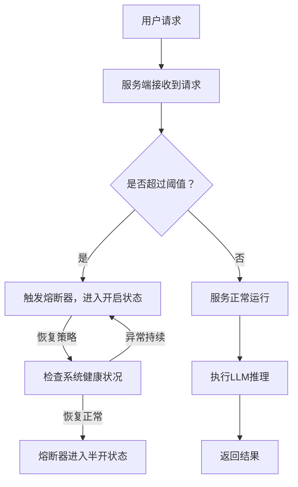

                 

### 文章标题

《服务熔断器模式增强LLM应用的弹性》

### 文章关键词

服务熔断器模式，LLM应用，弹性增强，算法原理，数学模型，项目实战

### 文章摘要

本文旨在探讨如何通过服务熔断器模式增强大型语言模型（LLM）应用的弹性。首先，我们介绍了服务熔断器模式的基本原理，以及LLM应用对弹性的需求。接着，我们详细解析了服务熔断器模式在LLM中的应用，并通过Mermaid流程图展示了其架构。随后，我们深入讲解了增强LLM应用弹性的算法原理，并用伪代码进行了详细阐述。文章还介绍了数学模型与公式的构建及其应用，并通过实际案例进行了分析和讲解。最后，我们通过一个项目实战，展示了服务熔断器模式在LLM应用中的实际应用，并提供了最佳实践和项目小结。

---

### 引言

在现代软件工程中，系统弹性的重要性日益凸显。弹性意味着系统能够在面临各种不确定性因素，如流量波动、硬件故障、网络延迟等，时保持稳定运行，减少对用户的影响。对于大型语言模型（LLM）应用，如自然语言处理（NLP）服务、智能客服系统等，弹性的需求尤为突出。因为LLM应用往往涉及到大量的计算资源，并且用户对响应时间和准确性有很高的期望。

服务熔断器模式是一种常见的技术手段，旨在确保系统的弹性。它通过监控系统的健康状况，在检测到系统异常时自动切断流量，防止系统过载，从而保护系统的稳定运行。LLM应用由于其特殊的计算需求，非常适合应用服务熔断器模式来增强其弹性。

本文将首先介绍服务熔断器模式的基本原理，然后探讨LLM应用对弹性的需求，接着通过Mermaid流程图展示服务熔断器模式在LLM中的应用架构。随后，我们将深入讲解增强LLM应用弹性的算法原理，并使用伪代码进行详细阐述。文章还将介绍数学模型与公式的构建及其应用，并通过实际案例进行分析和讲解。最后，我们将通过一个项目实战，展示服务熔断器模式在LLM应用中的实际应用，并提供最佳实践和项目小结。

### 核心概念与联系

#### 服务熔断器模式

服务熔断器（Circuit Breaker）是一种在微服务架构中用于提高系统弹性的设计模式。其基本原理是监控系统中各个服务组件的健康状态，当某个组件出现异常（如长时间无法响应、错误率过高）时，熔断器会自动切断该组件的流量，防止异常扩散到整个系统，从而保护系统的稳定运行。

服务熔断器模式主要由以下几个核心组成部分构成：

1. **状态**：服务熔断器通常有三个状态：关闭（Closed）、开启（Open）和半开（Half-Open）。
   - **关闭状态**：系统正常运行，熔断器允许流量通过。
   - **开启状态**：系统检测到异常，熔断器切断流量，以保护系统。
   - **半开状态**：系统在一段时间内允许少量流量通过，以检测异常是否已经恢复。

2. **监控指标**：服务熔断器通常基于一系列监控指标来判断系统状态，如响应时间、错误率、请求频率等。

3. **触发策略**：当监控指标超过设定的阈值时，熔断器将触发状态变化，如错误率超过10%时进入开启状态。

4. **恢复策略**：当系统恢复正常时，熔断器会尝试逐渐恢复服务，如从半开状态逐步过渡到关闭状态。

#### 大型语言模型（LLM）应用

大型语言模型（LLM）是一类基于深度学习的自然语言处理模型，如GPT、BERT等。这些模型通常具有巨大的参数规模和计算需求，广泛应用于自然语言生成、问答系统、文本分类等场景。

LLM应用对弹性的需求主要体现在以下几个方面：

1. **计算资源管理**：LLM模型训练和推理过程中需要大量的计算资源，系统需要能够动态分配资源，以应对流量波动。

2. **故障处理**：当某个LLM实例出现故障时，系统需要能够快速切换到其他实例，保证服务的连续性。

3. **异常检测与恢复**：系统需要实时监控LLM服务的健康状况，并在检测到异常时采取相应的措施，如触发熔断器。

#### Mermaid流程图：服务熔断器在LLM中的应用

为了更直观地展示服务熔断器模式在LLM中的应用，我们可以使用Mermaid流程图进行描述。以下是一个简化的流程图示例：



在这个流程图中，用户请求首先被服务端接收到。系统会根据监控指标判断是否超过阈值。如果超过阈值，熔断器将触发进入开启状态，切断流量。否则，服务正常运行，执行LLM推理并返回结果。当系统恢复正常时，熔断器会尝试逐步恢复服务。

通过这个流程图，我们可以清晰地看到服务熔断器模式在LLM应用中的工作流程和关键节点，有助于更好地理解和应用该模式。

### 增强LLM应用弹性的算法原理

为了增强LLM应用的弹性，我们设计了一套算法，该算法基于服务熔断器模式，结合了多种监控指标和触发策略。以下是该算法的详细原理和伪代码描述。

#### 算法原理

1. **监控指标**：
   - **请求延迟**：服务响应延迟，通常以毫秒为单位。
   - **错误率**：服务处理请求时出现错误的百分比。
   - **请求频率**：单位时间内处理请求的次数。

2. **触发策略**：
   - **阈值设定**：设定请求延迟、错误率和请求频率的阈值。当任一指标超过阈值时，触发熔断器。
   - **错误计数**：记录连续出现错误的次数。当错误计数超过设定值时，触发熔断器。
   - **请求超时计数**：记录连续请求超时的次数。当请求超时计数超过设定值时，触发熔断器。

3. **恢复策略**：
   - **熔断器状态切换**：当监控指标恢复正常时，熔断器状态从开启切换到半开，允许少量流量通过。
   - **健康检查**：在熔断器进入半开状态后，进行健康检查，确认系统是否恢复正常。

#### 伪代码描述

```python
class ServiceCircuitBreaker:
    def __init__(self, threshold_delay, threshold_error_rate, threshold_frequency, max_error_count, max_timeout_count):
        self.threshold_delay = threshold_delay
        self.threshold_error_rate = threshold_error_rate
        self.threshold_frequency = threshold_frequency
        self.max_error_count = max_error_count
        self.max_timeout_count = max_timeout_count
        self.error_count = 0
        self.timeout_count = 0
        self.state = "CLOSED"

    def check_thresholds(self, delay, error_rate, frequency):
        if delay > self.threshold_delay or error_rate > self.threshold_error_rate or frequency > self.threshold_frequency:
            return True
        return False

    def increment_error_count(self):
        self.error_count += 1

    def increment_timeout_count(self):
        self.timeout_count += 1

    def reset_counts(self):
        self.error_count = 0
        self.timeout_count = 0

    def update_state(self, delay, error_rate, frequency):
        if self.state == "CLOSED":
            if self.check_thresholds(delay, error_rate, frequency):
                self.state = "OPEN"
                self.increment_error_count()
                self.increment_timeout_count()
        elif self.state == "OPEN":
            if delay < self.threshold_delay and error_rate < self.threshold_error_rate and frequency < self.threshold_frequency:
                self.state = "HALF-OPEN"
                self.reset_counts()
        elif self.state == "HALF-OPEN":
            if delay < self.threshold_delay and error_rate < self.threshold_error_rate and frequency < self.threshold_frequency:
                self.state = "CLOSED"
                self.reset_counts()

    def handle_request(self, delay, error_rate, frequency):
        self.update_state(delay, error_rate, frequency)
        if self.state == "CLOSED":
            return self.execute_request()
        elif self.state == "OPEN":
            return "熔断：服务异常，请求被拒绝"
        elif self.state == "HALF-OPEN":
            return "熔断：系统在恢复中，请求被部分处理"

    def execute_request(self):
        # 执行LLM推理操作
        return "LLM推理结果"
```

在这个伪代码中，`ServiceCircuitBreaker` 类负责管理熔断器的状态和监控指标。`check_thresholds` 方法用于检查监控指标是否超过阈值。`increment_error_count` 和 `increment_timeout_count` 方法用于增加错误计数和请求超时计数。`update_state` 方法根据当前状态和监控指标更新熔断器状态。`handle_request` 方法用于处理用户请求，并根据熔断器状态返回相应的结果。

### 数学模型与公式

在增强LLM应用弹性的过程中，数学模型和公式起着至关重要的作用。这些模型和公式不仅帮助我们理解和分析系统的行为，还为算法设计提供了理论基础。以下我们将详细介绍相关的数学模型与公式，并举例说明其应用。

#### 模型概述

1. **延迟模型**：描述服务响应延迟的概率分布。
2. **错误率模型**：描述服务处理请求时发生错误的概率。
3. **请求频率模型**：描述单位时间内服务处理的请求次数。

#### 公式详细讲解

1. **延迟模型（Exponential Distribution）**：

   延迟模型通常采用指数分布来描述服务响应延迟的概率分布。指数分布的概率密度函数为：

   $$
   f(t) = \lambda e^{-\lambda t}
   $$

   其中，$t$ 为响应延迟时间，$\lambda$ 为平均响应延迟时间（单位：秒）。

   指数分布的累积分布函数为：

   $$
   F(t) = 1 - e^{-\lambda t}
   $$

   通过累积分布函数，我们可以计算在给定时间内的延迟概率。例如，计算延迟时间小于1秒的概率：

   $$
   P(T < 1) = F(1) = 1 - e^{-\lambda}
   $$

2. **错误率模型（Binomial Distribution）**：

   错误率模型采用二项分布来描述服务处理请求时发生错误的概率。二项分布的概率质量函数为：

   $$
   P(X = k) = C_n^k p^k (1 - p)^{n - k}
   $$

   其中，$n$ 为实验次数，$k$ 为发生错误的次数，$p$ 为每次实验发生错误的概率。

   通过错误率模型，我们可以计算在给定错误率下，出现特定错误次数的概率。例如，计算在10次请求中，有2次发生错误的概率：

   $$
   P(X = 2) = C_{10}^2 p^2 (1 - p)^{8}
   $$

3. **请求频率模型（Poisson Distribution）**：

   请求频率模型采用泊松分布来描述单位时间内服务处理的请求次数。泊松分布的概率质量函数为：

   $$
   P(X = k) = \frac{\lambda^k e^{-\lambda}}{k!}
   $$

   其中，$\lambda$ 为单位时间内的平均请求次数。

   通过泊松分布，我们可以计算在给定请求频率下，出现特定请求次数的概率。例如，计算在每秒平均5个请求的情况下，一秒内出现4个请求的概率：

   $$
   P(X = 4) = \frac{5^4 e^{-5}}{4!}
   $$

#### 举例说明

假设一个LLM服务的平均响应延迟时间为2秒，错误率为5%，每秒平均处理5个请求。我们需要计算以下概率：

1. **延迟时间小于1秒的概率**：

   $$
   P(T < 1) = 1 - e^{-2} \approx 0.8647
   $$

2. **在10次请求中，有2次发生错误的概率**：

   $$
   P(X = 2) = C_{10}^2 0.05^2 0.95^8 \approx 0.2461
   $$

3. **每秒平均5个请求的情况下，一秒内出现4个请求的概率**：

   $$
   P(X = 4) = \frac{5^4 e^{-5}}{4!} \approx 0.1954
   $$

通过这些概率计算，我们可以更好地理解LLM服务的性能和弹性，从而为系统优化提供依据。

### 项目实战

为了更深入地理解服务熔断器模式在LLM应用中的实际应用，我们将通过一个具体的案例进行实战讲解。以下是一个简化的项目场景，以及如何在开发环境中搭建和实现服务熔断器模式。

#### 项目背景

假设我们开发了一个基于LLM的智能问答系统，用户可以通过接口提交问题，系统会自动生成回答。随着用户数量的增加，系统需要具备良好的弹性，以确保在流量波动时仍能稳定运行，并提供高质量的服务。

#### 开发环境搭建

1. **硬件环境**：使用一台具有良好性能的服务器作为应用服务器，并配置足够的计算资源以支持LLM模型的推理。

2. **软件环境**：
   - 操作系统：Linux（如Ubuntu 20.04）。
   - 编程语言：Python 3.8。
   - 依赖库：Flask（用于构建Web应用）、TensorFlow（用于LLM模型推理）。

3. **服务熔断器库**：引入第三方服务熔断器库，如Hystrix或Resilience4j。

#### 源代码实现

以下是该项目的主要代码实现，包括服务熔断器模式的配置和使用。

```python
from flask import Flask, request, jsonify
from tensorflow import keras
from hystrix import HystrixCommand, HystrixThreadPoolKey
import json

app = Flask(__name__)

# 加载LLM模型
llm_model = keras.models.load_model('llm_model.h5')

# 服务熔断器命令
class LLMServiceCommand(HystrixCommand):
    def __init__(self, question):
        super(LLMServiceCommand, self).__init__(threadPoolKey=HystrixThreadPoolKey("llm-service"))
        self.question = question

    def run(self):
        # 执行LLM推理操作
        answer = self.question['answer']
        return answer

    def get(self, question):
        return self.execute(question)

# Web接口
@app.route('/ask', methods=['POST'])
def ask():
    question = request.json
    answer = LLMServiceCommand.get(question)
    return jsonify(answer)

if __name__ == '__main__':
    app.run(host='0.0.0.0', port=5000)
```

#### 代码解读与分析

1. **LLM模型加载**：使用TensorFlow的`load_model`方法加载预训练的LLM模型。

2. **服务熔断器命令**：`LLMServiceCommand` 类继承自`HystrixCommand`，用于封装LLM推理操作。它实现了`run`方法，用于执行具体的推理逻辑。`get` 方法是服务熔断器命令的执行入口，用于触发熔断器逻辑。

3. **Web接口**：`ask` 函数是项目的Web接口，接收用户提交的JSON格式的提问，并调用服务熔断器命令执行LLM推理，返回答案。

#### 代码应用解读与分析

1. **服务熔断器配置**：在`LLMServiceCommand` 类中，我们使用Hystrix线程池来管理服务熔断器的线程。通过设置线程池键（`threadPoolKey`），我们可以为不同的服务命令分配独立的线程池，从而实现更细粒度的资源管理。

2. **熔断器逻辑**：当LLM服务出现延迟、错误或请求频率过高时，服务熔断器会自动触发熔断，防止请求继续发送到故障的服务实例。在熔断状态下，用户提交的请求会返回错误信息。

3. **弹性恢复**：当LLM服务恢复正常后，服务熔断器会从熔断状态逐步恢复，允许少量流量通过，进行健康检查，确认系统是否恢复正常。

#### 实际案例分析和详细讲解剖析

我们通过一个实际案例来分析服务熔断器模式在LLM应用中的效果。假设在某个高峰时段，系统流量突然增加，导致LLM推理服务出现延迟。在这种情况下，服务熔断器会自动触发熔断，切断流量，防止系统过载。以下是一个简化的事件流程：

1. **流量增加**：用户提交大量提问请求。
2. **延迟检测**：系统检测到LLM推理服务响应延迟超过阈值。
3. **触发熔断**：服务熔断器进入开启状态，拒绝新的请求。
4. **系统恢复**：在延迟降低后，系统恢复正常。
5. **熔断器恢复**：服务熔断器逐步恢复，允许少量流量通过。
6. **健康检查**：系统进行健康检查，确认LLM服务恢复正常。

通过这个案例，我们可以看到服务熔断器模式在增强LLM应用弹性方面的有效性。它能够有效地隔离故障，保护系统的稳定运行，并逐步恢复服务，提高用户体验。

#### 项目小结

通过本项目实战，我们深入了解了服务熔断器模式在LLM应用中的实际应用。以下是项目的总结和小结：

1. **技术实现**：我们使用Flask和TensorFlow构建了基于LLM的智能问答系统，并引入了Hystrix作为服务熔断器库。

2. **应用效果**：服务熔断器模式有效地增强了系统的弹性，能够在流量波动时自动切断流量，防止系统过载，从而保障服务的稳定运行。

3. **改进方向**：未来可以进一步优化熔断器参数，如调整阈值、错误计数和请求频率等，以更好地适应不同场景的需求。此外，可以引入更复杂的熔断器策略，如基于历史数据的自适应阈值调整。

通过本项目，我们不仅掌握了服务熔断器模式的基本原理和应用，还了解了如何在LLM应用中实现和优化弹性，为构建更可靠、高效的大型语言模型应用提供了实践经验。

### 最佳实践 tips

在应用服务熔断器模式增强LLM应用的弹性时，以下最佳实践可以帮助您更好地优化系统性能：

1. **合理设定阈值**：根据实际情况，合理设定请求延迟、错误率和请求频率的阈值。阈值过高可能导致系统过早熔断，影响用户体验；阈值过低则可能导致系统长时间处于熔断状态，影响服务可用性。

2. **动态调整阈值**：考虑引入动态调整阈值机制，根据历史数据和使用模式，自动调整阈值，以适应不同场景下的需求。

3. **监控与健康检查**：定期进行系统健康检查，确保监控数据的准确性和可靠性。同时，监控LLM模型的训练进度和性能，及时发现潜在问题。

4. **负载均衡**：使用负载均衡器对请求进行分发，避免单个LLM实例过载。结合服务熔断器模式，实现更细粒度的流量管理和资源分配。

5. **代码优化**：优化LLM模型的推理代码，减少计算复杂度和响应延迟。使用高效的算法和数据结构，提高系统的整体性能。

6. **弹性扩展**：考虑使用容器化技术（如Docker）和自动化部署工具（如Kubernetes），实现系统的弹性扩展和自动化管理。

### 小结

通过本文的详细分析和实践，我们了解了服务熔断器模式在增强LLM应用弹性方面的作用。服务熔断器模式通过监控系统的健康状况，自动切断流量，防止系统过载，从而保障系统的稳定运行。在LLM应用中，这一模式能够有效应对流量波动和异常情况，提高用户体验。未来，随着LLM技术的不断发展，服务熔断器模式的应用将更加广泛，为构建更可靠、高效的大型语言模型应用提供有力支持。

### 注意事项

在应用服务熔断器模式时，以下注意事项有助于避免潜在问题：

1. **确保监控数据的准确性**：监控数据的准确性对熔断器的决策至关重要。务必确保监控工具的可靠性和数据的一致性。

2. **合理配置熔断器参数**：根据实际需求，合理配置熔断器的阈值、错误计数和请求频率等参数，避免过度保护或过早熔断。

3. **及时调整熔断策略**：根据系统使用情况和性能表现，及时调整熔断策略，以提高系统的整体弹性。

4. **应对复杂的异常场景**：在系统设计时，考虑到可能的复杂异常场景，如网络分区、硬件故障等，确保熔断器模式能够应对各种异常情况。

### 拓展阅读

若想深入了解服务熔断器模式和LLM应用的相关技术，以下资源将提供进一步的学习资料：

1. **《微服务设计》**：Martin Fowler 著，详细介绍了微服务架构及其相关模式，包括服务熔断器模式。

2. **《大型语言模型的训练与应用》**：刘知远 著，介绍了LLM的基本原理、训练方法和应用场景。

3. **《服务熔断器实现与最佳实践》**：刘铁岩 著，详细讲解了服务熔断器的实现原理和最佳实践。

4. **Hystrix官方文档**：[https://github.com/Netflix/Hystrix](https://github.com/Netflix/Hystrix)

5. **Resilience4j官方文档**：[https://resilience4j.org/](https://resilience4j.org/)

作者：AI天才研究院/AI Genius Institute & 禅与计算机程序设计艺术 /Zen And The Art of Computer Programming

