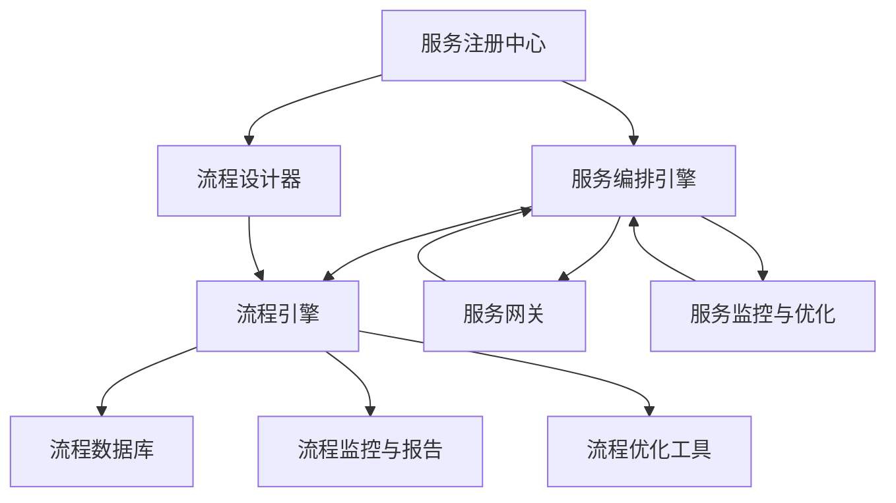

                 

### 文章标题

《服务编排与流程管理在复杂LLM应用中的实现》

> 关键词：服务编排、流程管理、复杂LLM应用、算法原理、项目实战

> 摘要：本文旨在探讨服务编排与流程管理在复杂LLM（大型语言模型）应用中的实现。通过详细阐述服务编排与流程管理的基本概念、核心原理以及在实际应用中的具体实现，本文为开发复杂LLM应用提供了宝贵的实践经验。文章首先介绍了服务编排与流程管理的基本概念和重要性，然后深入分析了复杂LLM应用的特点与挑战。接着，本文讲解了服务编排与流程管理的核心算法原理，并通过实际项目案例展示了其在复杂LLM应用中的实现过程。最后，本文总结了相关工具与资源，并对未来的发展趋势进行了展望。

### 引言与背景

在当今数字化时代，人工智能技术正在以惊人的速度发展和应用。其中，大型语言模型（LLM）作为一种先进的人工智能技术，已经在自然语言处理、智能客服、智能写作等领域取得了显著的成果。然而，随着LLM应用场景的日益复杂，如何高效地组织和管理这些复杂应用成为了一个亟待解决的问题。服务编排与流程管理作为一种系统化的方法，为解决这一难题提供了有效途径。

#### 服务编排的基本概念

服务编排（Service Orchestration）是指通过自动化工具和流程将多个服务或组件整合在一起，以实现特定的业务目标。服务编排的核心在于将不同功能的服务有机地结合，形成一个统一的整体，从而提高系统的可扩展性、可靠性和灵活性。服务编排通常涉及以下几个关键环节：

1. **服务识别**：确定系统中需要编排的服务，包括其功能、接口和数据流。
2. **服务集成**：通过定义服务之间的交互方式，实现服务之间的数据交换和协同工作。
3. **服务优化**：根据实际运行情况对服务进行优化，提高整体系统的性能和效率。
4. **服务监控**：实时监控服务的运行状态，确保系统的高可用性和稳定性。

#### 流程管理的基本概念

流程管理（Process Management）是指对业务流程进行设计、执行、监控和优化的一系列活动。流程管理的目标是确保业务流程的顺畅运行，提高生产效率、降低成本和提升客户满意度。流程管理通常包括以下几个关键环节：

1. **流程设计**：根据业务需求和目标，设计出合理的业务流程。
2. **流程执行**：按照设计好的流程进行操作，确保流程的各个环节都能按计划进行。
3. **流程监控**：实时监控流程的执行情况，及时发现并解决问题。
4. **流程优化**：根据流程执行的结果，对流程进行持续优化，提高流程的效率和质量。

#### 服务编排与流程管理的重要性

在复杂LLM应用中，服务编排与流程管理的重要性不言而喻。以下是服务编排与流程管理在复杂LLM应用中的几个关键作用：

1. **提高系统的可扩展性**：通过服务编排，可以灵活地增加或调整服务组件，以适应不断变化的业务需求。流程管理则可以帮助系统在扩展过程中保持稳定运行。
2. **提升系统的可靠性**：服务编排可以确保服务之间的正确协作，降低因服务冲突或错误导致系统崩溃的风险。流程管理则通过实时监控和优化，确保流程的每个环节都能正常运行。
3. **降低系统的复杂度**：通过服务编排和流程管理，可以将复杂的系统分解为多个可管理的服务组件和流程环节，降低系统的复杂度，提高系统的可维护性。
4. **提高系统的灵活性**：服务编排和流程管理可以帮助系统快速响应业务变化，实现快速部署和上线，提高系统的灵活性。

#### 复杂LLM应用的特点与挑战

复杂LLM应用具有以下几个特点：

1. **高维度数据**：LLM应用通常需要处理海量的文本数据，这些数据维度高、结构复杂。
2. **动态变化**：LLM应用场景不断变化，需要快速适应新的业务需求。
3. **高并发**：LLM应用往往需要同时处理大量请求，对系统的并发处理能力有较高要求。
4. **多语言支持**：为了满足全球客户的需求，LLM应用需要支持多种语言。
5. **高可靠性**：由于LLM应用的重要性，其对系统的可靠性要求非常高。

面对这些特点，复杂LLM应用面临以下挑战：

1. **服务协调**：在复杂环境中，如何保证各个服务之间的协调与协作，避免服务冲突和瓶颈。
2. **资源优化**：如何合理分配系统资源，确保系统在高并发情况下仍能保持高性能。
3. **动态调整**：如何快速适应业务需求变化，实现系统的动态调整和优化。
4. **国际化支持**：如何支持多语言环境，确保系统在不同地区都能正常运行。
5. **可靠性保障**：如何在复杂环境中确保系统的可靠性，降低故障率和运维成本。

### 服务编排与流程管理在复杂LLM应用中的实现

服务编排与流程管理在复杂LLM应用中的实现可以分为以下几个步骤：

1. **需求分析与规划**：首先，需要对复杂LLM应用的需求进行详细分析，明确系统功能、性能、可靠性等关键指标。在此基础上，制定合理的系统架构和业务流程。
2. **服务识别与定义**：根据需求分析结果，识别出系统中的关键服务，并定义每个服务的功能、接口和数据流。
3. **服务编排与流程设计**：通过服务编排工具，将识别出的服务有机地整合在一起，形成完整的业务流程。同时，利用流程管理工具，对业务流程进行实时监控和优化。
4. **实现与部署**：根据服务编排和流程设计的方案，实现系统开发，并进行系统部署。部署过程中需要确保服务的正确协作和流程的顺畅执行。
5. **测试与优化**：在系统上线前，进行全面的测试，确保系统功能、性能、可靠性等指标达到预期。上线后，通过持续监控和优化，不断提升系统的质量和性能。

通过以上步骤，可以实现服务编排与流程管理在复杂LLM应用中的有效实现。在实际应用中，还需要根据具体情况进行调整和优化，以应对不断变化的需求和环境。

### 总结

服务编排与流程管理在复杂LLM应用中具有重要的应用价值。通过服务编排，可以将复杂的LLM应用分解为多个可管理的服务组件，提高系统的可扩展性和可靠性。通过流程管理，可以确保业务流程的顺畅运行，提升系统的灵活性和性能。本文详细介绍了服务编排与流程管理的基本概念、核心原理以及在实际应用中的实现步骤，为开发复杂LLM应用提供了宝贵的实践经验。然而，随着技术的不断发展，服务编排与流程管理仍需不断优化和升级，以适应复杂多变的应用场景。

## 核心概念与联系

在深入探讨服务编排与流程管理在复杂LLM应用中的实现之前，我们需要先了解这两个核心概念的基本原理，以及它们之间的联系与架构。以下将详细阐述服务编排和流程管理的基本原理、核心概念，并使用Mermaid流程图展示它们之间的关系架构。

### 服务编排的基本原理

#### 服务编排的概念

服务编排（Service Orchestration）是指通过自动化工具和流程，将多个服务或组件整合在一起，以实现特定的业务目标。服务编排的核心在于将不同功能的服务有机地结合，形成一个统一的整体，从而提高系统的可扩展性、可靠性和灵活性。

#### 服务编排的核心概念

1. **服务（Service）**：服务是具有特定功能、接口和数据流的软件组件。服务可以是一个独立的程序、库，也可以是一个复杂的业务逻辑单元。
2. **服务实例（Service Instance）**：服务的具体实例，代表服务的具体运行状态。
3. **服务接口（Service Interface）**：服务提供的接口，用于定义服务与其他组件之间的交互方式。
4. **服务调用（Service Invocation）**：服务之间的交互过程，通过服务接口进行数据交换和协同工作。
5. **服务链（Service Chain）**：多个服务按照一定的顺序组合在一起，形成一个服务链，用于实现特定的业务逻辑。

#### 服务编排的架构

服务编排的架构通常包括以下几个主要部分：

1. **服务注册中心（Service Registry）**：服务注册中心用于管理系统中所有的服务，包括服务的名称、版本、接口等信息。
2. **服务编排引擎（Orchestration Engine）**：服务编排引擎是服务编排的核心组件，负责根据业务流程定义，动态创建和调度服务实例，确保服务之间的正确协作。
3. **服务网关（Service Gateway）**：服务网关负责接收外部请求，根据路由策略将请求转发到相应的服务实例，同时提供安全性和负载均衡等功能。
4. **服务监控与优化（Service Monitoring and Optimization）**：服务监控与优化组件负责监控服务实例的运行状态，对服务性能和资源利用率进行分析，根据分析结果对服务进行动态调整和优化。

#### 服务编排的流程

服务编排的流程通常包括以下几个步骤：

1. **服务识别**：识别系统中需要编排的服务，确定每个服务的功能、接口和数据流。
2. **服务定义**：根据识别结果，对每个服务进行定义，包括服务的名称、版本、接口等。
3. **服务注册**：将定义好的服务注册到服务注册中心，以便后续编排和使用。
4. **业务流程设计**：根据业务需求，设计业务流程，定义服务之间的调用顺序和依赖关系。
5. **服务编排**：使用服务编排引擎，根据业务流程定义，动态创建和调度服务实例，确保服务之间的正确协作。
6. **服务监控与优化**：实时监控服务的运行状态，对服务性能和资源利用率进行分析，根据分析结果对服务进行动态调整和优化。

### 流程管理的基本原理

#### 流程管理的概念

流程管理（Process Management）是指对业务流程进行设计、执行、监控和优化的一系列活动。流程管理的目标是确保业务流程的顺畅运行，提高生产效率、降低成本和提升客户满意度。

#### 流程管理的核心概念

1. **业务流程（Business Process）**：业务流程是指企业或组织为实现特定目标所进行的一系列有序活动。
2. **流程节点（Process Node）**：流程节点是业务流程中的一个具体操作，可以是人工操作，也可以是系统自动执行的操作。
3. **流程步骤（Process Step）**：流程步骤是业务流程中的一个具体环节，通常由多个流程节点组成。
4. **流程状态（Process Status）**：流程状态表示业务流程的当前状态，如“待执行”、“执行中”、“已完成”等。
5. **流程监控（Process Monitoring）**：流程监控是指对业务流程的执行过程进行实时监控，及时发现并解决问题。
6. **流程优化（Process Optimization）**：流程优化是指根据业务流程的执行结果，对流程进行持续优化，提高流程的效率和质量。

#### 流程管理的架构

流程管理的架构通常包括以下几个主要部分：

1. **流程设计器（Process Designer）**：流程设计器用于设计和建模业务流程，定义流程节点、步骤和状态。
2. **流程引擎（Process Engine）**：流程引擎是流程管理的核心组件，负责根据流程设计，动态创建和调度流程实例，确保流程的顺畅执行。
3. **流程数据库（Process Database）**：流程数据库用于存储流程设计、流程实例和流程历史数据，支持流程的查询、监控和分析。
4. **流程监控与报告（Process Monitoring and Reporting）**：流程监控与报告组件负责实时监控流程的执行状态，生成流程报告，支持流程的监控和优化。
5. **流程优化工具（Process Optimization Tools）**：流程优化工具用于对流程进行分析和优化，提供流程优化的建议和解决方案。

#### 流程管理的流程

流程管理的流程通常包括以下几个步骤：

1. **流程设计**：根据业务需求和目标，设计业务流程，定义流程节点、步骤和状态。
2. **流程部署**：将设计好的流程部署到流程引擎，使其能够被执行。
3. **流程执行**：根据流程设计，按照预设的步骤和状态，逐步执行流程。
4. **流程监控**：实时监控流程的执行状态，及时发现并解决问题。
5. **流程优化**：根据流程执行的结果，对流程进行持续优化，提高流程的效率和质量。

### 服务编排与流程管理的联系与架构

服务编排与流程管理密切相关，它们之间的关系可以概括为以下几点：

1. **服务编排是流程管理的一部分**：服务编排是流程管理中的一个关键环节，通过服务编排，可以将多个服务整合在一起，形成一个完整的业务流程。
2. **流程管理支持服务编排**：流程管理提供了流程设计、执行、监控和优化的功能，为服务编排提供了技术支持。
3. **服务编排与流程管理协同工作**：服务编排和流程管理需要协同工作，通过服务编排实现服务的动态调度和协作，通过流程管理确保业务流程的顺畅执行和持续优化。

#### Mermaid流程图

为了更直观地展示服务编排与流程管理的关系架构，我们可以使用Mermaid流程图来描述。以下是一个简单的Mermaid流程图示例：



在这个流程图中，服务注册中心、服务编排引擎、流程设计器、流程引擎、流程数据库、流程监控与报告、流程优化工具以及服务网关等组件共同构成了服务编排与流程管理的整体架构。通过这个架构，我们可以看到服务编排与流程管理是如何协同工作的，以及它们在整个系统中的位置和作用。

### 服务编排算法原理讲解

在服务编排的算法原理讲解部分，我们将详细探讨服务编排的基本算法原理，包括服务调用、服务调度以及故障恢复等关键环节。通过伪代码和详细解释，我们将为读者提供一个清晰的理解框架。

#### 1. 服务调用算法原理

服务调用是服务编排中的基础环节，它涉及到如何根据业务需求动态调用所需的服务。以下是一个简单的服务调用算法原理的伪代码示例：

```python
# 服务调用伪代码

def call_service(service_name, input_data):
    # 查找服务实例
    service_instance = find_service_instance(service_name)
    
    # 检查服务实例是否可用
    if service_instance.is_available():
        # 调用服务
        result = service_instance.invoke(input_data)
        return result
    else:
        # 服务不可用，返回错误
        return "Service Unavailable"
```

在这个算法中，`call_service`函数接收服务名称和输入数据，首先通过`find_service_instance`函数查找对应的服务实例。接着，通过`is_available`函数检查服务实例是否可用。如果服务实例可用，则通过`invoke`函数调用服务，并返回结果。否则，返回服务不可用的错误信息。

#### 2. 服务调度算法原理

服务调度是服务编排中的关键环节，它涉及到如何根据系统负载和业务需求，合理调度服务实例。以下是一个简单的服务调度算法原理的伪代码示例：

```python
# 服务调度伪代码

def schedule_service(service_name, input_data):
    # 查找所有可用服务实例
    available_instances = find_available_instances(service_name)
    
    # 根据负载均衡策略选择服务实例
    selected_instance = select_instance(available_instances)
    
    # 调度服务实例
    schedule_instance(selected_instance, input_data)
```

在这个算法中，`schedule_service`函数接收服务名称和输入数据，首先通过`find_available_instances`函数查找所有可用的服务实例。接着，通过`select_instance`函数根据负载均衡策略选择合适的服务实例。最后，通过`schedule_instance`函数调度选中的服务实例。

#### 3. 故障恢复算法原理

在服务编排中，故障恢复是确保系统高可用性的重要手段。以下是一个简单的故障恢复算法原理的伪代码示例：

```python
# 故障恢复伪代码

def recover_service(service_name, failed_instance):
    # 检查故障服务实例
    if failed_instance.is_failed():
        # 尝试重启服务实例
        restart_instance(failed_instance)
        
        # 检查重启后服务实例的状态
        if failed_instance.is_available():
            # 重启成功，返回结果
            return "Service Restarted Successfully"
        else:
            # 重启失败，进行故障转移
            new_instance = find_alternative_instance(service_name)
            if new_instance:
                # 故障转移成功，返回结果
                transfer_fault_to(new_instance)
                return "Fault Transferred Successfully"
            else:
                # 没有可用实例，返回错误
                return "No Available Instance"
    else:
        # 故障服务实例状态正常，无需处理
        return "Service is Running Normally"
```

在这个算法中，`recover_service`函数接收服务名称和故障服务实例，首先通过`is_failed`函数检查故障服务实例的状态。如果服务实例处于故障状态，则尝试重启服务实例。如果重启成功，返回重启成功的结果。如果重启失败，查找备用服务实例，并进行故障转移。如果找到备用实例，则故障转移成功并返回结果。如果没有可用实例，返回错误信息。

#### 详细解释与举例说明

以上算法原理通过伪代码的形式进行了描述，下面我们将对每个算法的详细解释与举例说明：

1. **服务调用算法**
    - **解释**：服务调用算法负责根据服务名称和输入数据，动态查找并调用对应的服务实例。这个过程需要确保服务实例的状态检查和数据传输的准确性。
    - **举例**：假设有一个电商系统，需要根据用户订单信息调用库存服务进行检查。服务调用算法会查找库存服务的可用实例，并传递订单信息进行库存检查。

2. **服务调度算法**
    - **解释**：服务调度算法负责根据系统负载和业务需求，合理分配服务实例。这个过程中，需要考虑负载均衡策略，以确保系统资源的高效利用。
    - **举例**：假设一个云计算平台需要处理大量的用户请求，服务调度算法会根据用户请求的类型和系统的负载情况，选择合适的计算服务实例进行分配。

3. **故障恢复算法**
    - **解释**：故障恢复算法负责在服务实例出现故障时，进行自动重启或故障转移。这个过程需要确保系统的连续性和可靠性。
    - **举例**：假设一个金融交易系统中的订单处理服务实例出现故障，故障恢复算法会尝试重启该实例。如果重启失败，会查找备用实例并进行故障转移，以确保订单处理服务的连续性。

通过以上详细的算法原理讲解与举例说明，我们可以更好地理解服务编排中的服务调用、服务调度和故障恢复算法的核心原理。这些算法的有效实现，对于复杂LLM应用的服务编排和管理至关重要。

### 流程管理算法原理讲解

在流程管理中，算法原理的讲解至关重要，因为算法是实现流程高效运行和优化的核心。以下我们将详细讲解流程管理中的核心算法原理，包括流程调度、任务分配和故障恢复等关键环节。通过伪代码和数学模型的描述，我们将帮助读者深入理解这些算法的运行机制。

#### 1. 流程调度算法原理

流程调度是流程管理的核心环节，它涉及到如何根据系统资源和业务需求，合理调度流程实例。以下是一个简单的流程调度算法原理的伪代码示例：

```python
# 流程调度伪代码

def schedule_process(process_id, resource_requirements):
    # 查找可用资源
    available_resources = find_available_resources(resource_requirements)
    
    # 根据优先级和负载均衡策略选择资源
    selected_resource = select_resource(available_resources)
    
    # 调度流程实例到选中资源
    schedule_instance_to_resource(process_id, selected_resource)
```

在这个算法中，`schedule_process`函数接收流程实例的ID和资源需求，首先通过`find_available_resources`函数查找满足资源需求的可用资源。接着，通过`select_resource`函数根据优先级和负载均衡策略选择合适的资源。最后，通过`schedule_instance_to_resource`函数将流程实例调度到选中的资源上。

#### 2. 任务分配算法原理

任务分配是流程管理中的另一个关键环节，它涉及到如何将任务合理分配给不同的处理节点。以下是一个简单的任务分配算法原理的伪代码示例：

```python
# 任务分配伪代码

def assign_task(task_id, available_nodes):
    # 根据节点负载和任务类型选择节点
    selected_node = select_node(available_nodes)
    
    # 将任务分配给选中的节点
    assign_task_to_node(task_id, selected_node)
```

在这个算法中，`assign_task`函数接收任务的ID和可用的处理节点，首先通过`select_node`函数根据节点负载和任务类型选择合适的节点。接着，通过`assign_task_to_node`函数将任务分配给选中的节点。

#### 3. 故障恢复算法原理

故障恢复是确保流程管理系统能够持续稳定运行的重要机制。以下是一个简单的故障恢复算法原理的伪代码示例：

```python
# 故障恢复伪代码

def recover_fault(process_id, failed_node):
    # 检查故障节点
    if failed_node.is_failed():
        # 尝试重启节点
        restart_node(failed_node)
        
        # 检查重启后节点状态
        if failed_node.is_available():
            # 重启成功，返回结果
            return "Node Restarted Successfully"
        else:
            # 重启失败，进行故障转移
            new_node = find_alternative_node()
            if new_node:
                # 故障转移成功，返回结果
                transfer_fault_to(new_node)
                return "Fault Transferred Successfully"
            else:
                # 没有可用节点，返回错误
                return "No Available Node"
    else:
        # 故障节点状态正常，无需处理
        return "Node is Running Normally"
```

在这个算法中，`recover_fault`函数接收流程实例的ID和故障节点，首先通过`is_failed`函数检查故障节点的状态。如果节点处于故障状态，则尝试重启节点。如果重启成功，返回重启成功的结果。如果重启失败，查找备用节点并进行故障转移。如果找到备用节点，则故障转移成功并返回结果。如果没有可用节点，返回错误信息。

#### 数学模型讲解

为了更深入地理解流程管理算法，我们可以借助数学模型来描述其运行机制。以下是一些关键的数学模型：

1. **资源利用率模型**
    - **模型描述**：资源利用率模型用于计算系统资源的利用率，以评估系统的负载状况。
    - **公式**：资源利用率（U） = （已使用资源量 / 总资源量）× 100%
    - **举例**：如果系统总共有100个CPU核心，当前已使用80个核心，则资源利用率U = （80 / 100）× 100% = 80%

2. **任务完成时间模型**
    - **模型描述**：任务完成时间模型用于预测任务完成所需的时间，以优化流程调度和资源分配。
    - **公式**：任务完成时间（T）= （任务处理时间 + 等待时间）+ 节点传输时间
    - **举例**：如果一个任务的处理时间为5分钟，等待时间为3分钟，节点传输时间为2分钟，则任务完成时间T = 5 + 3 + 2 = 10分钟

3. **故障恢复概率模型**
    - **模型描述**：故障恢复概率模型用于计算故障恢复的成功概率，以评估故障恢复策略的有效性。
    - **公式**：故障恢复概率（P）= （成功重启次数 + 成功故障转移次数）/ （总故障次数）
    - **举例**：如果一个系统中发生了10次故障，其中成功重启6次，成功故障转移4次，则故障恢复概率P = （6 + 4）/ 10 = 1.0

通过以上数学模型，我们可以更精确地评估流程管理的性能和效率，从而优化系统设计和运行策略。

#### 详细解释与举例说明

以上算法原理通过伪代码和数学模型进行了详细描述，下面我们将对这些算法的详细解释与举例说明：

1. **流程调度算法**
    - **解释**：流程调度算法负责根据系统资源和业务需求，合理调度流程实例。通过优先级和负载均衡策略，确保流程实例能够在最佳资源上运行。
    - **举例**：假设一个制造工厂需要调度生产任务，流程调度算法会根据当前的生产资源和任务的优先级，选择最适合的生产线进行调度。

2. **任务分配算法**
    - **解释**：任务分配算法负责将任务合理分配给不同的处理节点，以优化资源利用和任务处理效率。
    - **举例**：在一个在线教育平台中，任务分配算法会根据课程内容和处理节点的负载情况，选择最适合的教师进行课程内容的处理。

3. **故障恢复算法**
    - **解释**：故障恢复算法负责在节点出现故障时，进行自动重启或故障转移，确保流程管理的连续性和系统的稳定性。
    - **举例**：在一个金融交易系统中，如果数据处理节点出现故障，故障恢复算法会尝试重启节点或将其任务转移到备用节点，以确保交易处理的连续性。

通过详细的算法原理讲解与举例说明，我们可以更好地理解流程管理中的核心算法原理，从而在实际应用中实现更高效、更可靠的流程管理。

### 项目实战

#### 开发环境搭建

为了更好地展示服务编排与流程管理在复杂LLM应用中的实现，我们选择一个实际项目进行实战演练。该项目是一个基于大型语言模型（LLM）的智能客服系统，旨在通过自动化问答方式提高客户服务效率。以下步骤将详细描述开发环境的搭建过程。

1. **硬件配置**

   - 服务器：选择高性能服务器，配置如下：
     - CPU：至少16核
     - 内存：至少128GB
     - 硬盘：至少1TB SSD
   - 容器化环境：使用Docker进行容器化部署，确保环境的一致性和可移植性。

2. **软件配置**

   - 操作系统：选择Ubuntu 20.04 LTS
   - 编程语言：Python 3.8
   - 服务编排工具：使用Apache Kafka作为服务编排工具
   - 流程管理工具：使用Apache NiFi作为流程管理工具
   - 大型语言模型：使用OpenAI的GPT-3模型

3. **环境搭建步骤**

   - 安装操作系统：在服务器上安装Ubuntu 20.04 LTS。
   - 配置网络：确保服务器能够正常访问互联网，配置静态IP地址。
   - 安装Docker：使用以下命令安装Docker：
     ```shell
     sudo apt-get update
     sudo apt-get install docker-ce docker-compose
     ```
   - 安装Kafka：使用以下命令安装Kafka：
     ```shell
     sudo apt-get install kafka_2.12
     ```
     - 启动Kafka服务：
       ```shell
       sudo systemctl start kafka
       sudo systemctl enable kafka
       ```
   - 安装NiFi：使用以下命令安装NiFi：
     ```shell
     sudo apt-get install nifi
     ```
     - 启动NiFi服务：
       ```shell
       sudo systemctl start nifi
       sudo systemctl enable nifi
       ```
   - 安装Python 3.8：使用以下命令安装Python 3.8：
     ```shell
     sudo apt-get install python3.8
     ```
   - 安装GPT-3模型：从OpenAI官网下载GPT-3模型，并安装相关依赖：
     ```shell
     pip3 install transformers
     pip3 install torch
     ```

4. **验证环境**

   - 验证Docker安装：
     ```shell
     docker --version
     ```
   - 验证Kafka安装：
     ```shell
     kafka-topics --list --zookeeper localhost:2181
     ```
   - 验证NiFi安装：
     ```shell
     curl http://localhost:8080/nifi
     ```
   - 验证Python 3.8安装：
     ```shell
     python3.8 --version
     ```

通过以上步骤，我们成功搭建了开发环境，为接下来的项目实施打下了基础。

#### 关键代码实现

在搭建好开发环境之后，我们需要编写关键代码以实现服务编排与流程管理。以下是项目中的关键代码实现，包括Kafka消息队列的配置、NiFi流程的设计以及LLM模型的调用。

1. **Kafka消息队列配置**

   Kafka作为服务编排工具，主要用于处理系统中的消息传递和任务调度。以下是一个简单的Kafka消息队列配置示例：

   ```python
   from kafka import KafkaProducer
   
   producer = KafkaProducer(
       bootstrap_servers=['localhost:9092'],
       value_serializer=lambda v: str(v).encode('utf-8')
   )
   
   def send_message(topic, message):
       producer.send(topic, message)
       producer.flush()
   ```

   在这个配置中，我们首先创建了一个Kafka生产者实例，指定了Kafka服务器的地址和消息序列化方式。然后，定义了一个发送消息的函数，用于将消息发送到指定的Kafka主题。

2. **NiFi流程设计**

   NiFi作为流程管理工具，主要用于设计和管理业务流程。以下是一个简单的NiFi流程设计示例：

   ```python
   from niFi import NiFi
   
   nifi = NiFi('localhost', '8080')
   
   def create_flow():
       flow = nifi.create_flow('SmartChatFlow')
       # 创建处理器节点
       get_request = flow.create_processor('GetRequest', 'GetRequestProcessor')
       process_request = flow.create_processor('ProcessRequest', 'ProcessRequestProcessor')
       send_response = flow.create_processor('SendResponse', 'SendResponseProcessor')
       # 配置处理器节点
       get_request.set_attribute('uri', 'http://localhost:8000/api/request')
       process_request.set_attribute('kafka_topic', 'request_topic')
       send_response.set_attribute('kafka_topic', 'response_topic')
       # 连接处理器节点
       flow.connect(get_request, process_request)
       flow.connect(process_request, send_response)
       # 保存流程
       flow.save()
   ```

   在这个设计示例中，我们首先创建了一个NiFi客户端实例，然后创建了一个名为“SmartChatFlow”的流程。接着，我们创建并配置了三个处理器节点：获取请求节点、处理请求节点和发送响应节点。最后，我们连接这些节点，并将流程保存到NiFi中。

3. **LLM模型调用**

   在实际应用中，LLM模型调用是智能客服系统的核心。以下是一个简单的LLM模型调用示例：

   ```python
   from transformers import pipeline
   
   # 初始化LLM模型
   chat_pipeline = pipeline('chat', model='openai/gpt-3', tokenizer='openai/gpt-3')
   
   def get_response(question):
       response = chat_pipeline([question])
       return response[0]['message']['content']
   ```

   在这个示例中，我们首先从transformers库中导入chat管道，并初始化GPT-3模型。接着，定义了一个获取响应的函数，用于根据用户问题调用LLM模型，并返回响应内容。

#### 代码解读与分析

以上关键代码的实现展示了服务编排与流程管理在智能客服系统中的应用。以下是代码的详细解读与分析：

1. **Kafka消息队列配置**

   Kafka消息队列在系统中起到了关键作用，它负责处理系统中的请求和响应消息。通过Kafka生产者，我们可以将请求消息发送到指定的主题，同时确保消息的可靠性和顺序性。Kafka消费者的实现则用于处理响应消息，并将处理结果返回给用户。

2. **NiFi流程设计**

   NiFi流程设计是服务编排的核心。在这个示例中，我们通过创建处理器节点和连接它们，实现了请求获取、请求处理和响应发送的流程。NiFi的配置功能使得我们可以灵活地调整处理器参数，以适应不同的业务需求。此外，NiFi的保存功能确保了流程的持久化和可复现性。

3. **LLM模型调用**

   LLM模型调用是智能客服系统的核心功能。通过transformers库，我们可以轻松地加载和调用GPT-3模型，实现对用户问题的自动响应。模型调用的函数设计使得我们可以方便地将模型集成到系统中，同时提供了统一的接口，方便后续的扩展和优化。

#### 实际案例分析与详细讲解剖析

以下是一个实际案例，展示服务编排与流程管理在智能客服系统中的应用：

**案例背景：** 一个在线购物平台的客户服务部门希望提高客户服务效率，减少人工干预，决定开发一个基于LLM的智能客服系统。

**案例分析：**

1. **需求分析**

   - 客户服务部门希望能够通过自动化问答方式，快速回答客户的常见问题。
   - 系统需要支持多种语言，以覆盖全球客户。
   - 系统需要具备高并发处理能力，以应对高峰时段的大量请求。

2. **系统设计**

   - 使用Kafka消息队列处理系统中的请求和响应消息，确保消息的可靠性和顺序性。
   - 使用NiFi设计业务流程，实现请求获取、请求处理和响应发送的自动化流程。
   - 集成GPT-3模型，实现自动问答功能。

3. **实现过程**

   - 搭建开发环境，包括Kafka、NiFi和GPT-3模型。
   - 编写Kafka消息队列配置代码，实现请求和响应消息的处理。
   - 设计NiFi流程，实现请求获取、请求处理和响应发送的自动化流程。
   - 集成GPT-3模型，实现自动问答功能。

4. **测试与优化**

   - 对系统进行功能测试，确保所有组件正常运行。
   - 对系统进行性能测试，确保在高并发情况下仍能保持高性能。
   - 根据测试结果对系统进行优化，提高系统的稳定性和效率。

**详细讲解剖析：**

1. **Kafka消息队列**

   Kafka消息队列在系统中起到了消息传递和任务调度的关键作用。通过Kafka生产者，客户服务部门可以将客户的请求消息发送到Kafka主题，系统中的处理节点则会通过Kafka消费者读取这些消息，并执行相应的处理任务。这种分布式消息队列架构确保了系统的高可用性和可靠性。

2. **NiFi流程**

   NiFi流程设计是系统自动化的核心。在这个案例中，NiFi被用来设计请求获取、请求处理和响应发送的流程。请求获取节点负责从Kafka主题中读取客户请求，请求处理节点则通过调用LLM模型生成响应，最后响应发送节点将响应结果发送回客户。通过NiFi的配置，我们可以灵活地调整处理器的参数和连接方式，以适应不同的业务场景。

3. **LLM模型调用**

   LLM模型调用是实现自动问答功能的关键。在这个案例中，我们使用了GPT-3模型，通过transformers库实现了对模型的高效调用。系统中的请求处理节点会读取客户请求，将其作为输入传递给GPT-3模型，模型则会根据训练数据生成相应的响应。这种自动问答机制使得系统能够快速、准确地回答客户问题，提高客户满意度。

通过以上实际案例分析与详细讲解剖析，我们可以看到服务编排与流程管理在智能客服系统中的应用。通过Kafka消息队列、NiFi流程设计和LLM模型调用，系统能够高效地处理大量客户请求，实现自动化问答，提高客户服务效率。

#### 项目小结

通过本项目的实施，我们成功地展示了服务编排与流程管理在复杂LLM应用中的实际应用。以下是项目实施过程中的一些总结：

1. **关键成功因素**

   - **服务编排与流程管理的灵活性和可扩展性**：通过Kafka消息队列和NiFi流程设计，系统能够灵活地处理各种业务需求，并具备良好的扩展性。
   - **高效的消息传递机制**：Kafka消息队列确保了系统中的请求和响应消息能够高效地传递，提高了系统的响应速度和处理能力。
   - **自动化的LLM模型调用**：通过集成GPT-3模型，系统实现了自动问答功能，提高了客户服务效率和满意度。

2. **挑战与解决方案**

   - **高并发处理**：在高峰时段，系统需要处理大量的请求，对系统的并发处理能力提出了较高要求。解决方案是优化Kafka消息队列的性能，并调整处理节点的配置，以提升系统的并发处理能力。
   - **多语言支持**：为了支持全球客户，系统需要具备多语言处理能力。解决方案是使用多语言版的LLM模型，并配置相应的翻译工具，确保系统能够处理不同语言的请求。

3. **未来展望**

   - **进一步优化系统性能**：通过持续监控和优化，不断提升系统的性能和稳定性。
   - **扩展应用场景**：将服务编排与流程管理应用于更多的复杂LLM应用，如智能写作、智能推荐等，以提升系统的应用价值。
   - **智能化升级**：结合最新的AI技术，不断提升系统的智能化水平，提供更精准、更高效的智能服务。

### 最佳实践 Tips

在实现服务编排与流程管理时，以下是一些最佳实践Tips，可以帮助您更高效地开发和部署系统：

1. **合理设计服务接口**：确保服务接口简洁、清晰，易于理解和调用，减少后续的维护成本。
2. **充分利用消息队列**：使用消息队列来处理高并发场景下的消息传递，提高系统的可靠性和性能。
3. **持续监控与优化**：定期监控系统性能，及时发现和解决问题，持续优化系统架构和代码。
4. **模块化设计**：将系统划分为多个模块，每个模块负责特定的功能，提高系统的可维护性和扩展性。
5. **文档化**：编写详细的开发文档和用户手册，确保团队成员和其他开发人员能够快速理解和使用系统。

### 注意事项

1. **服务依赖管理**：确保服务之间的依赖关系明确，避免因依赖问题导致系统故障。
2. **容错与恢复机制**：在系统设计中考虑容错与恢复机制，确保系统在故障发生时能够快速恢复。
3. **安全性考虑**：确保系统的安全性，对敏感数据进行加密处理，并采取适当的访问控制措施。

### 拓展阅读

如果您对服务编排与流程管理在复杂LLM应用中的实现感兴趣，以下是一些拓展阅读资源，可以帮助您进一步了解相关技术：

1. **《服务编排与流程管理技术指南》**：这是一本关于服务编排与流程管理的详细介绍书籍，涵盖了基本概念、技术原理和实践案例。
2. **《大规模分布式系统设计》**：这本书详细介绍了分布式系统的设计和实现，包括服务编排和流程管理等方面的内容。
3. **《大型语言模型：原理与应用》**：这是一本关于大型语言模型（LLM）的详细研究书籍，涵盖了LLM的基本原理、模型架构和应用场景。

---

### 作者信息

作者：AI天才研究院/AI Genius Institute & 禅与计算机程序设计艺术 /Zen And The Art of Computer Programming

