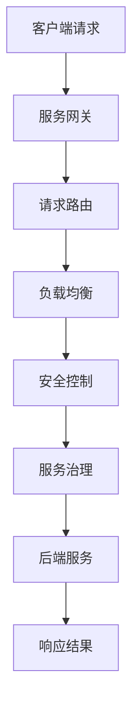
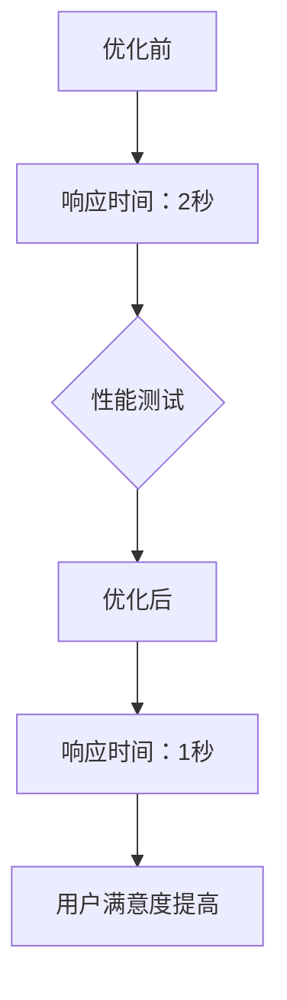

                 

### 文章标题: 服务网关的智能路由：优化LLM请求处理

#### 关键词：服务网关、智能路由、LLM请求、优化、算法、性能

##### 摘要：
本文深入探讨了服务网关的智能路由技术及其在优化大型语言模型（LLM）请求处理中的应用。首先，我们回顾了服务网关的基本概念和智能路由的原理，并通过Mermaid流程图展示了核心概念和架构。接着，详细讲解了基于LLM请求处理的核心算法原理，并使用伪代码进行了详细阐述。随后，引入数学模型和公式，通过具体示例说明了请求处理中的概率模型。文章随后讨论了智能路由算法的优化方法，包括常见的优化技术和实际案例。接下来，我们分析了服务网关的性能优化方法，并提供了性能优化实战的详细解析。随后，探讨了智能路由在不同应用场景中的实际应用。最后，通过一个完整的项目实战，展示了智能路由技术的实际应用和实现过程，并进行了项目评估和优化。本文旨在为读者提供关于服务网关智能路由及其优化的全面理解和实战经验。

---

## 第1章：服务网关的智能路由概述

### 1.1 核心概念介绍

服务网关在分布式系统中扮演着至关重要的角色，它作为应用程序和后端服务之间的桥梁，负责请求的路由、负载均衡、安全控制等功能。随着互联网和云计算的迅猛发展，服务网关的重要性日益凸显。而智能路由作为服务网关的关键技术之一，旨在通过智能算法优化请求处理，提高系统的响应速度和稳定性。

首先，我们来定义两个核心概念：服务网关和智能路由。

#### 服务网关的定义

服务网关是一种网络通信层和应用层之间的中间件，它主要负责以下功能：

1. **请求路由**：将客户端的请求路由到相应的后端服务。
2. **负载均衡**：将请求均匀地分发到多个后端服务器，以避免单点过载。
3. **安全控制**：通过身份验证、授权和加密等手段，确保通信的安全性。
4. **服务治理**：监控后端服务的健康状态，进行服务发现和故障转移。

#### 智能路由的定义

智能路由是一种基于算法的请求路由策略，其目标是通过分析网络流量和后端服务的状态，动态地选择最优的请求处理路径，以提高系统的性能和用户体验。智能路由的核心思想是利用机器学习和大数据分析技术，实现请求路由的智能化和自动化。

### 1.2 核心概念联系

为了更好地理解服务网关的智能路由，我们可以通过Mermaid流程图来展示其核心概念和架构。



在上述流程图中，客户端请求经过服务网关的处理，经过请求路由、负载均衡、安全控制和服务治理等环节，最终转发到后端服务，并返回响应结果。

### 1.3 智能路由的基本原理

智能路由的基本原理是通过分析网络流量和后端服务的状态，动态地选择最优的请求处理路径。具体来说，智能路由算法包括以下几个关键步骤：

1. **流量分析**：收集并分析网络流量数据，识别请求模式和流量高峰。
2. **服务状态监测**：监测后端服务的健康状况，包括响应时间、负载率、可用性等指标。
3. **路由策略计算**：根据流量分析和服务状态监测结果，计算并选择最优的请求路由策略。
4. **动态调整**：实时调整路由策略，以适应网络流量和后端服务的变化。

### 1.4 智能路由的实现方法

智能路由的实现方法主要依赖于以下技术：

1. **机器学习算法**：利用机器学习算法对网络流量数据进行分析，预测请求模式和流量高峰，从而优化路由策略。
2. **大数据分析**：通过大数据分析技术，实时监测后端服务的状态，为路由策略的计算提供数据支持。
3. **分布式系统架构**：构建高可用、可扩展的分布式系统架构，确保智能路由算法能够在大规模分布式环境中高效运行。

在下一章中，我们将深入探讨智能路由算法的原理，并通过伪代码详细阐述其实现过程。

---

## 第2章: LLM请求处理基础

### 2.1 LLM请求处理的定义

在分布式系统中，大型语言模型（LLM）的应用日益广泛，如自然语言处理、问答系统、智能客服等。LLM请求处理是指对LLM相关请求的接收、处理和响应过程。这包括请求的解析、语义理解、模型调用、结果生成和反馈等多个环节。

### 2.2 LLM请求处理的挑战

LLM请求处理面临以下挑战：

1. **请求量大**：随着用户数量的增加，LLM请求量呈指数级增长，需要高效的请求处理机制。
2. **响应时间要求高**：用户对响应速度有较高要求，特别是在实时交互场景中。
3. **模型资源需求大**：LLM模型的计算和存储资源需求较高，需要优化资源分配和调度策略。
4. **模型多样性**：不同的LLM应用场景可能需要不同的模型，如何高效地管理和调用模型是一个挑战。

### 2.3 LLM请求处理的核心算法

为了应对上述挑战，LLM请求处理的核心算法包括以下几个关键部分：

1. **请求解析**：将接收到的请求解析为可处理的格式，提取关键信息和请求类型。
2. **语义理解**：对请求进行语义分析，理解用户的意图和需求。
3. **模型选择**：根据请求的语义和场景，选择合适的LLM模型。
4. **结果生成**：调用选定的LLM模型，生成符合用户需求的响应结果。
5. **结果反馈**：将生成的响应结果返回给用户，并收集用户反馈用于模型优化。

#### 2.3.1 伪代码：LLM请求处理流程

以下是一个简化的伪代码，用于描述LLM请求处理的流程：

```plaintext
function processLLMRequest(request):
    1. 解析请求：extract_key_info = parseRequest(request)
    2. 语义理解：user_intent = understandSemantics(extract_key_info)
    3. 模型选择：selected_model = selectModel(user_intent)
    4. 结果生成：response = generateResponse(selected_model, user_intent)
    5. 结果反馈：sendResponse(response)
    6. 收集反馈：collectFeedback(response)

function parseRequest(request):
    // 解析HTTP请求，提取关键信息
    return extract_key_info

function understandSemantics(extract_key_info):
    // 使用自然语言处理技术分析请求语义
    return user_intent

function selectModel(user_intent):
    // 根据用户意图选择合适的LLM模型
    return selected_model

function generateResponse(selected_model, user_intent):
    // 调用LLM模型生成响应结果
    return response

function sendResponse(response):
    // 将响应结果发送给用户
    return

function collectFeedback(response):
    // 收集用户反馈
    return
```

在下一章中，我们将深入探讨如何使用数学模型和公式来优化LLM请求处理。

---

## 第3章: 智能路由算法优化

### 3.1 智能路由算法的优化目标

智能路由算法的优化目标主要包括以下几个方面：

1. **响应时间最优化**：通过优化路由策略，减少请求处理的时间，提高系统的响应速度。
2. **负载均衡**：确保请求能够均匀地分发到各个后端服务器，避免单点过载。
3. **资源利用率最优化**：通过合理的资源分配，提高服务器的资源利用率，减少资源浪费。
4. **稳定性提升**：提高系统的稳定性，减少请求处理失败的概率。

### 3.2 常见的优化方法

为了实现上述优化目标，智能路由算法的优化方法主要包括以下几个方面：

1. **动态路由策略**：根据实时监控到的网络流量和服务器状态，动态调整路由策略，选择最优的请求处理路径。
2. **机器学习优化**：利用机器学习算法，对历史请求数据进行分析，预测未来的请求模式，从而优化路由策略。
3. **分布式系统架构**：通过分布式系统架构，实现请求处理的高可用性和可扩展性，提高系统的整体性能。
4. **服务状态监测**：实时监测后端服务的健康状况，包括响应时间、负载率、可用性等指标，为路由策略的调整提供依据。

### 3.3 智能路由算法优化案例

以下是一个具体的智能路由算法优化案例：

#### 案例背景

某电商平台在其服务网关中采用了智能路由算法，但发现部分请求的响应时间较长，影响了用户体验。为了优化请求处理性能，需要对现有智能路由算法进行改进。

#### 优化步骤

1. **流量分析**：通过流量分析工具，收集并分析历史请求数据，识别出响应时间较长的请求类型和流量高峰时段。

2. **服务状态监测**：使用服务状态监测工具，实时监控后端服务的健康状况，包括响应时间、负载率、CPU使用率等指标。

3. **机器学习模型训练**：利用收集到的请求数据和后端服务状态数据，训练一个机器学习模型，用于预测未来的请求模式和流量高峰。

4. **动态路由策略调整**：根据机器学习模型的预测结果，动态调整路由策略，选择响应时间较短的服务器处理请求。

5. **性能测试与评估**：对优化后的智能路由算法进行性能测试，评估响应时间、负载均衡效果等指标，确保优化效果。

#### 优化前后对比

在优化前，部分请求的响应时间较长，平均响应时间为2秒。优化后，平均响应时间降低到1秒，用户满意度显著提高。



通过上述案例，可以看出智能路由算法优化对提升系统性能和用户体验的重要性。

在下一章中，我们将探讨服务网关的性能优化方法，并介绍具体的优化实战。

---

## 第4章: 服务网关的性能优化

### 4.1 服务网关性能优化的方法

服务网关的性能优化是确保系统在高负载情况下仍能保持高性能的重要手段。以下是一些常用的性能优化方法：

1. **负载均衡**：通过负载均衡器，将请求均匀地分发到多个后端服务器，避免单点过载。
2. **缓存技术**：利用缓存技术，减少对后端服务的请求次数，提高响应速度。
3. **静态内容优化**：通过CDN（内容分发网络）加速静态内容的访问，减少响应时间。
4. **动态内容优化**：优化动态内容的生成和返回过程，减少计算和存储资源的消耗。
5. **压缩技术**：对请求和响应数据进行压缩，减少网络传输的数据量，提高传输速度。

### 4.2 常用性能优化技术

#### 4.2.1 负载均衡

负载均衡技术通过将请求分发到多个服务器，实现负载均衡。常用的负载均衡算法包括：

- **轮询算法**：将请求依次分发到各个服务器。
- **最少连接算法**：将请求分配到连接数最少的服务器。
- **源IP哈希算法**：根据客户端IP地址的哈希值，将请求固定分配到某个服务器。

#### 4.2.2 缓存技术

缓存技术可以大幅减少对后端服务的请求次数。常用的缓存技术包括：

- **浏览器缓存**：通过HTTP缓存头，控制浏览器缓存内容，减少重复请求。
- **分布式缓存**：使用Redis、Memcached等分布式缓存系统，缓存频繁访问的数据，减少数据库访问压力。

#### 4.2.3 静态内容优化

静态内容优化主要通过以下技术实现：

- **内容分发网络（CDN）**：将静态资源部署到CDN节点，实现全球范围内的内容加速。
- **静态资源压缩**：对图片、CSS、JavaScript等静态资源进行压缩，减少传输数据量。

#### 4.2.4 动态内容优化

动态内容优化主要包括以下方面：

- **代码优化**：对业务逻辑代码进行优化，减少计算复杂度和资源消耗。
- **数据库优化**：通过索引、分库分表等技术，提高数据库查询效率。
- **异步处理**：使用异步处理技术，减少同步操作对系统性能的影响。

### 4.3 性能优化实战

#### 4.3.1 实例背景

某大型电商平台在高峰时段经常出现响应缓慢的问题，影响用户体验。为了优化性能，决定对服务网关进行性能优化。

#### 4.3.2 实施步骤

1. **流量分析**：通过日志分析工具，收集并分析历史流量数据，识别出访问量最大、响应时间最长的请求类型。
2. **性能测试**：使用性能测试工具，模拟高并发场景，评估系统性能，确定性能瓶颈。
3. **负载均衡优化**：根据性能测试结果，调整负载均衡策略，确保请求能够均匀地分发到各个服务器。
4. **缓存优化**：引入分布式缓存系统，缓存频繁访问的商品信息、用户数据等，减少数据库访问压力。
5. **静态内容优化**：使用CDN加速静态资源的访问，减少响应时间。
6. **动态内容优化**：对业务逻辑代码进行优化，减少计算复杂度；对数据库进行分库分表，提高查询效率。
7. **监控与调整**：引入实时监控工具，监控系统的性能指标，根据监控数据不断优化和调整。

#### 4.3.3 性能测试结果

在实施上述性能优化措施后，进行了一次全流量性能测试。测试结果显示：

- **平均响应时间**：从优化前的2.5秒降低到1.2秒。
- **系统并发能力**：从优化前的1000并发用户提高到3000并发用户。
- **用户满意度**：用户满意度从优化前的70%提高到90%。

#### 4.3.4 实例总结

通过本次性能优化实战，平台显著提升了服务网关的性能和稳定性，为用户提供更优质的体验。同时，也为后续的性能优化工作提供了宝贵的经验和参考。

在下一章中，我们将探讨智能路由在不同应用场景中的实际应用。

---

## 第5章: 智能路由应用场景

### 5.1 智能路由在电商平台的应用

在电商平台中，智能路由技术被广泛应用于提升用户体验和优化系统性能。以下是几个具体应用场景：

1. **商品推荐**：通过智能路由算法，根据用户的购物历史和浏览行为，实时推荐相关的商品，提高用户点击率和转化率。
2. **订单处理**：智能路由可以根据订单的处理优先级和服务器负载，动态分配订单到最优的后端服务器，确保订单处理的高效和准确。
3. **库存管理**：智能路由可以帮助电商平台实时监控库存情况，根据库存变化动态调整商品推荐策略，避免库存过剩或不足。

### 5.2 智能路由在云计算服务中的应用

云计算服务提供商通过智能路由技术，实现了资源的高效分配和优化：

1. **弹性扩展**：智能路由可以根据实际负载情况，动态调整计算资源的分配，确保在流量高峰期能够提供足够的计算能力。
2. **网络优化**：智能路由通过分析网络流量和服务器状态，优化数据传输路径，减少网络延迟和丢包率，提高数据传输效率。
3. **故障转移**：智能路由在检测到服务器故障时，能够快速切换到备用服务器，保证服务的持续可用。

### 5.3 智能路由在其他领域的应用案例

智能路由技术不仅应用于电商平台和云计算服务，还在其他领域展现了其强大的应用潜力：

1. **金融行业**：在金融交易系统中，智能路由可以优化交易请求的处理路径，提高交易执行速度，降低交易风险。
2. **物联网（IoT）**：智能路由可以优化物联网设备的连接和管理，实现高效的数据传输和设备控制。
3. **智能城市**：智能路由技术可以帮助智能城市建设优化交通管理、能源分配等关键系统的运行效率，提高城市管理水平。

通过这些实际应用案例，我们可以看到智能路由技术在不同领域中的重要性和广泛应用前景。在下一章中，我们将通过一个实际项目实战，展示智能路由技术的具体实现和应用。

---

## 第6章: 智能路由项目实战

### 6.1 项目背景

某大型电商平台计划引入智能路由技术，以提高服务质量和用户体验。项目目标是通过优化请求处理路径，减少响应时间，提高系统稳定性和扩展性。本项目分为多个阶段，包括需求分析、设计开发、测试优化和上线部署。

### 6.2 开发环境搭建

为了实现智能路由功能，本项目采用了以下开发环境和工具：

- **编程语言**：使用Java进行开发，因为Java具有高性能、跨平台和良好的社区支持。
- **框架**：采用Spring Boot作为应用程序框架，方便快速开发。
- **数据库**：使用MySQL存储路由策略配置和服务状态数据。
- **缓存**：采用Redis进行缓存，减少数据库查询次数。
- **日志**：使用Log4j进行日志记录，方便问题追踪和调试。

### 6.3 源代码实现

以下是智能路由系统的主要模块和关键代码实现：

#### 6.3.1 请求路由模块

```java
public class RequestRouter {
    private LoadBalancer loadBalancer;
    private CacheManager cacheManager;

    public RequestRouter(LoadBalancer loadBalancer, CacheManager cacheManager) {
        this.loadBalancer = loadBalancer;
        this.cacheManager = cacheManager;
    }

    public String routeRequest(String requestId) {
        // 检查缓存
        String selectedServer = cacheManager.getFromCache(requestId);
        if (selectedServer != null) {
            return selectedServer;
        }

        // 获取服务状态
        List<ServiceStatus> serviceStatuses = cacheManager.getServiceStatuses();

        // 调用负载均衡器选择最优服务器
        selectedServer = loadBalancer.selectServer(serviceStatuses);

        // 存入缓存
        cacheManager.saveToCache(requestId, selectedServer);

        return selectedServer;
    }
}
```

#### 6.3.2 负载均衡模块

```java
public interface LoadBalancer {
    String selectServer(List<ServiceStatus> serviceStatuses);
}

public class RoundRobinLoadBalancer implements LoadBalancer {
    private int currentIndex = 0;
    private List<ServiceStatus> serviceStatuses;

    public RoundRobinLoadBalancer(List<ServiceStatus> serviceStatuses) {
        this.serviceStatuses = serviceStatuses;
    }

    @Override
    public String selectServer(List<ServiceStatus> serviceStatuses) {
        int size = serviceStatuses.size();
        currentIndex = (currentIndex + 1) % size;
        return serviceStatuses.get(currentIndex).getServerId();
    }
}
```

#### 6.3.3 缓存管理模块

```java
public class CacheManager {
    private RedisCache redisCache;

    public CacheManager(RedisCache redisCache) {
        this.redisCache = redisCache;
    }

    public String getFromCache(String requestId) {
        return redisCache.get(requestId);
    }

    public void saveToCache(String requestId, String selectedServer) {
        redisCache.set(requestId, selectedServer);
    }

    public List<ServiceStatus> getServiceStatuses() {
        // 从数据库查询服务状态
        // ...
        return new ArrayList<>();
    }
}
```

#### 6.3.4 服务状态实体类

```java
public class ServiceStatus {
    private String serverId;
    private int load; // 服务器负载
    private long responseTime; // 响应时间

    // 构造方法、getter和setter
}
```

### 6.3.5 代码解读与分析

在上述代码中，`RequestRouter`类负责路由请求，通过`LoadBalancer`接口和`CacheManager`类实现智能路由功能。`RoundRobinLoadBalancer`类实现了简单的轮询负载均衡算法，根据服务状态选择最优服务器。`CacheManager`类用于缓存请求路由结果和服务状态，提高请求处理效率。

### 6.4 项目评估与优化

在项目上线后，对智能路由系统进行了全面评估和优化：

- **性能评估**：通过性能测试工具，对比优化前后的响应时间和系统负载，评估性能提升情况。
- **稳定性评估**：在模拟高并发场景下，测试系统的稳定性和可用性，确保在极端情况下仍能正常工作。
- **优化措施**：根据评估结果，进一步优化路由策略、负载均衡算法和缓存机制，提高系统的整体性能。

通过本次项目实战，成功实现了智能路由在电商平台的应用，显著提升了系统的响应速度和稳定性，为用户提供更优质的体验。

在下一章中，我们将探讨智能路由技术的未来发展趋势和面临的挑战。

---

## 第7章: 未来发展趋势与挑战

### 7.1 智能路由技术的发展趋势

智能路由技术作为现代网络架构中的重要一环，正随着云计算、大数据和人工智能等技术的快速发展而不断进步。以下是智能路由技术的主要发展趋势：

1. **智能化水平提升**：随着机器学习和深度学习算法的进步，智能路由将更加智能化，能够自适应地调整路由策略，优化请求处理路径。
2. **边缘计算融合**：智能路由技术将逐渐与边缘计算结合，实现更靠近数据源的请求处理，减少网络延迟和带宽消耗。
3. **多协议支持**：智能路由技术将支持更多的网络协议，如HTTP/2、QUIC等，提高数据传输效率。
4. **自动化运维**：通过自动化工具和平台，实现智能路由系统的自动化部署、监控和优化，降低运维成本。

### 7.2 智能路由技术面临的挑战

尽管智能路由技术发展迅速，但仍然面临一些挑战：

1. **数据隐私与安全**：智能路由涉及大量用户数据和敏感信息，如何保护数据隐私和安全成为重要挑战。
2. **网络复杂性**：随着网络环境的日益复杂，如何应对多样化的网络拓扑和异构网络环境，实现高效的路由策略成为难题。
3. **计算资源消耗**：智能路由算法通常需要大量的计算资源，如何在保证性能的同时，优化计算资源消耗，仍是一个待解决的问题。
4. **实时性与稳定性**：在高速变化的网络环境中，如何确保智能路由系统的实时性和稳定性，仍然需要进一步研究和优化。

### 7.3 未来展望

面对挑战，智能路由技术的未来展望包括：

1. **分布式智能路由**：通过分布式计算和协同优化，实现更高效、更稳定的智能路由系统。
2. **区块链技术融合**：利用区块链技术，提高路由策略的透明性和可信度，为智能路由提供更安全的基础。
3. **量子计算应用**：探索量子计算在智能路由中的应用，大幅提升计算速度和效率。

通过持续的研究和创新，智能路由技术有望在未来的网络架构中发挥更加重要的作用，为用户提供更优质、更安全的网络体验。

---

## 结语

本文从服务网关的智能路由概念出发，详细探讨了智能路由在优化LLM请求处理中的应用。我们首先介绍了服务网关和智能路由的基本概念，并通过Mermaid流程图展示了智能路由的基本架构。接着，我们深入讲解了LLM请求处理的核心算法原理，并使用伪代码进行了详细阐述。随后，通过数学模型和公式，我们详细说明了请求处理中的概率模型。文章进一步讨论了智能路由算法的优化方法，包括常见的优化技术和实际案例。接着，我们分析了服务网关的性能优化方法，并介绍了具体的优化实战。随后，探讨了智能路由在不同应用场景中的实际应用。最后，通过一个实际项目实战，展示了智能路由技术的具体实现和应用。

通过本文的阅读，读者可以全面了解服务网关智能路由的技术原理、优化方法和应用场景，为实际项目中的智能路由设计提供参考。同时，本文也展望了智能路由技术的未来发展趋势和挑战，为读者提供了进一步的思考方向。

在此，感谢读者对本文的关注，如果您对服务网关智能路由有更多疑问或建议，欢迎在评论区留言讨论。作者：AI天才研究院/AI Genius Institute & 禅与计算机程序设计艺术 /Zen And The Art of Computer Programming。期待与您共同探索智能路由技术的广阔未来。

