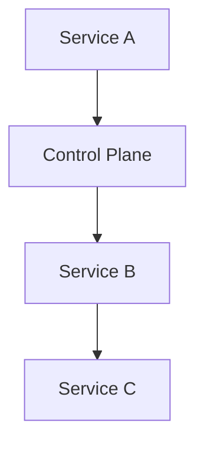
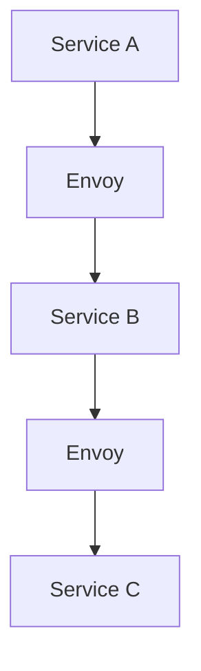
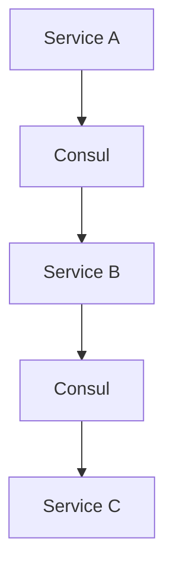
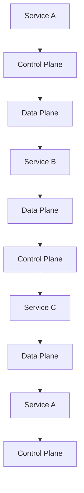

                 

### 第1章 引言

#### 1.1 服务网格与可观测性的关系

随着云计算和微服务架构的兴起，服务网格（Service Mesh）作为一种新型的服务架构模式，逐渐在分布式系统中扮演着越来越重要的角色。服务网格是一种用于连接和协调分布式服务之间的通信的基础设施层，其主要目标是抽象化服务间的通信，从而实现服务的动态发现、服务间的可靠通信和流量管理等功能。

可观测性（Observability）是衡量一个系统在不知道内部状态的情况下，通过外部观察来了解系统内部状态的能力。它包括三个关键维度：检查点（Checkpoints）、指标（Metrics）和日志（Logs）。在服务网格中，可观测性尤为重要，因为它能够帮助开发人员和服务管理员快速发现和解决问题，确保服务的稳定运行和性能优化。

服务网格与可观测性的关系主要体现在以下几个方面：

1. **服务网格提供了统一的监控视角**：服务网格通过抽象化服务间的通信，使得整个分布式系统的监控变得更加简单和统一。开发者可以更容易地收集和分析跨服务的性能数据，从而提高系统的可观测性。

2. **服务网格支持动态流量管理**：服务网格的流量管理功能允许开发者根据实际需求动态调整流量路由策略，同时，通过可观测性工具，开发者可以实时监控流量变化，确保流量管理策略的有效性和稳定性。

3. **服务网格增强了故障检测和故障恢复能力**：服务网格的分布式特性使得故障检测和故障恢复变得更加复杂。然而，通过可观测性工具，开发者可以实时监控服务的健康状况，及时发现和定位故障，从而提高系统的故障恢复能力。

#### 1.2 LLM应用监控的重要性

LLM（大型语言模型）是一种基于深度学习的自然语言处理技术，广泛应用于搜索引擎、智能客服、文本生成等领域。随着LLM应用规模的不断扩大和复杂度的增加，如何有效监控LLM应用的运行状态、性能和稳定性成为了一个关键问题。

LLM应用监控的重要性主要体现在以下几个方面：

1. **保障用户体验**：LLM应用通常面向广大用户，其性能和稳定性直接影响到用户的体验。通过有效的监控，可以及时发现和解决潜在问题，确保应用始终处于最佳状态。

2. **优化资源利用率**：LLM应用通常需要大量的计算资源和存储资源。通过监控，可以实时了解资源的利用情况，从而进行合理的资源分配和优化，提高资源利用率。

3. **提高故障恢复速度**：在LLM应用中，任何故障都会对用户体验造成严重影响。通过有效的监控和告警机制，可以快速发现故障并采取措施，从而缩短故障恢复时间，减少对用户的影响。

#### 1.3 本书目标与结构

本书的目标是深入探讨服务网格可观测性在LLM应用监控中的实现，帮助开发者和服务管理员更好地理解和应用这一技术。本书的主要内容包括：

1. **第1章 引言**：介绍服务网格和可观测性的基本概念，阐述它们在LLM应用监控中的重要性。

2. **第2章 服务网格基础**：详细讲解服务网格的核心组件、架构和主要功能，为后续章节打下基础。

3. **第3章 可观测性原理**：介绍可观测性的基本概念、服务网格中的可观测性实现以及相关指标和日志。

4. **第4章 LLM应用监控**：分析LLM应用监控的需求、策略和常用工具。

5. **第5章 实现与架构设计**：讲解服务网格可观测性的实现方法和架构设计，包括数据采集、处理和可视化。

6. **第6章 性能优化与挑战**：探讨服务网格可观测性的性能优化方法、挑战和解决方案。

7. **第7章 实际案例与项目实战**：通过实际案例展示服务网格可观测性在LLM应用监控中的具体应用和实践。

8. **第8章 总结与展望**：对全书内容进行总结，探讨未来的研究方向和趋势。

通过本书的学习，读者将能够：

- 理解服务网格和可观测性的基本概念和原理。
- 掌握服务网格可观测性的实现方法和架构设计。
- 学会使用常见可观测性工具进行数据采集、处理和可视化。
- 提高LLM应用监控的能力，确保其稳定运行和性能优化。

### 第2章 服务网格基础

#### 2.1 服务网格概述

服务网格（Service Mesh）是一种新型的服务架构模式，主要用于解决微服务架构中的服务间通信问题。它通过引入一个基础设施层，抽象化服务间的通信，从而实现服务发现、服务间可靠通信、流量管理、安全性等功能。服务网格的核心思想是将服务间的通信抽象为一种统一的、可管理的模式，从而简化分布式系统的开发和运维。

服务网格的基本概念包括：

1. **服务（Service）**：服务网格中的基本构建块，代表了一个可独立部署、独立运行的应用程序实例。服务可以通过服务名称或域名进行标识和定位。

2. **代理（Proxy）**：服务网格中的通信代理，负责转发服务间的请求。代理通常是基于-sidecar 模式部署在服务的旁边，每个服务实例都会有一个对应的代理实例。

3. **控制平面（Control Plane）**：服务网格的管理中心，负责配置管理、流量管理、服务发现等功能。控制平面通常会维护一个服务名称到IP地址的映射表，从而实现服务的动态发现。

4. **数据平面（Data Plane）**：服务网格的通信层，负责处理服务间的请求转发、负载均衡、故障转移等任务。数据平面由多个代理组成，每个代理负责转发来自其他代理的请求。

#### 2.2 服务网格的关键组件

服务网格的核心组件包括控制平面、数据平面和服务注册中心。这些组件共同作用，实现了服务网格的基本功能。

1. **控制平面（Control Plane）**：

控制平面负责管理服务网格的配置和服务发现。其主要功能包括：

- **服务发现**：维护服务名称到IP地址的映射表，从而实现服务的动态发现。
- **流量管理**：根据配置的流量路由策略，动态调整服务间的流量路由。
- **配置管理**：管理服务网格的配置信息，如服务名称、IP地址、端口等。
- **故障转移**：在服务实例故障时，自动切换到其他健康的服务实例。

常见的控制平面组件包括Istio、Linkerd、Consul等。以下是一个使用Istio作为控制平面的Mermaid流程图：



2. **数据平面（Data Plane）**：

数据平面负责处理服务间的请求转发和负载均衡。其主要功能包括：

- **请求转发**：将接收到的请求转发到目标服务。
- **负载均衡**：根据配置的策略，将请求均匀分配到多个服务实例。
- **故障转移**：在服务实例故障时，自动切换到其他健康的服务实例。

每个服务实例旁边都会部署一个代理实例，如Envoy、Traefik等。以下是一个使用Envoy作为数据平面的Mermaid流程图：



3. **服务注册中心（Service Registry）**：

服务注册中心负责存储和管理服务的元数据，如服务名称、IP地址、端口等。服务启动时，会将自身注册到服务注册中心，服务停止时，会从服务注册中心注销。

常见的服务注册中心包括Consul、Eureka、Zookeeper等。以下是一个使用Consul作为服务注册中心的Mermaid流程图：



#### 2.3 服务网格的优势与挑战

服务网格作为一种新型的服务架构模式，具有许多优势，同时也面临一些挑战。

1. **优势**：

- **简化服务间通信**：通过抽象化服务间的通信，服务网格简化了分布式系统的开发和运维，使得开发者可以专注于业务逻辑的实现，而无需关心服务间的通信细节。
- **提高系统的可观测性**：服务网格提供了统一的监控视角，使得开发者可以更容易地收集和分析跨服务的性能数据，从而提高系统的可观测性。
- **实现流量管理和故障转移**：服务网格的流量管理功能允许开发者根据实际需求动态调整流量路由策略，同时，通过可观测性工具，开发者可以实时监控流量变化，确保流量管理策略的有效性和稳定性。
- **增强安全性**：服务网格提供了细粒度的安全控制，如身份验证、授权和加密等，从而提高系统的安全性。

2. **挑战**：

- **性能开销**：服务网格引入了额外的通信开销，如代理转发、负载均衡等，可能会对系统性能产生一定影响。
- **部署和维护复杂性**：服务网格的部署和维护需要一定的专业知识，对于一些非专业的开发者来说，可能具有一定的复杂性。
- **与其他服务的兼容性**：服务网格需要与现有的服务架构和工具进行集成，这可能会带来一些兼容性问题。

综上所述，服务网格作为一种新型的服务架构模式，具有许多优势，但同时也面临一些挑战。开发者需要根据实际需求和场景，综合考虑其优缺点，选择合适的架构模式。

### 第3章 可观测性原理

#### 3.1 可观测性的基本概念

可观测性（Observability）是衡量一个系统在不知道内部状态的情况下，通过外部观察来了解系统内部状态的能力。它是一个比监控（Monitoring）更广泛的范畴，不仅包括对系统运行状态的实时监控，还包括对系统行为、性能、故障等方面的全面观察和分析。

可观测性主要由三个关键维度组成：检查点（Checkpoints）、指标（Metrics）和日志（Logs）。

1. **检查点（Checkpoints）**：

检查点是指系统中的关键位置，用于记录系统在特定时刻的状态信息。通过检查点，开发者可以了解系统在执行过程中的关键步骤和状态变化。例如，在分布式系统中，检查点可以用于记录服务的启动时间、处理请求的时间、故障发生的时间等。

2. **指标（Metrics）**：

指标是用于衡量系统性能和状态的数据，如延迟、吞吐量、错误率等。指标可以通过各种工具和库自动采集和记录，从而实现对系统性能的实时监控。指标通常是定量数据，可以通过简单的统计方法进行计算和分析。

3. **日志（Logs）**：

日志是记录系统运行过程中发生的事件和异常信息的文本文件。日志可以帮助开发者了解系统运行的具体细节，如请求的URL、参数、异常信息等。日志通常用于故障排除、性能分析和安全审计等场景。

#### 3.2 服务网格中的可观测性

在服务网格中，可观测性尤为重要，因为它能够帮助开发者和服务管理员快速发现和解决问题，确保服务的稳定运行和性能优化。服务网格中的可观测性主要体现在以下几个方面：

1. **服务发现和动态更新**：

服务网格通过控制平面和服务注册中心实现服务的动态发现和更新。通过可观测性工具，开发者可以实时监控服务的注册和注销过程，确保服务发现机制的有效性。

2. **流量监控和性能分析**：

服务网格的数据平面负责处理服务间的请求转发和负载均衡。通过可观测性工具，开发者可以实时监控流量变化、请求处理时间和错误率等指标，从而进行性能分析和优化。

3. **故障检测和故障恢复**：

服务网格通过控制平面和健康检查机制实现故障检测和故障恢复。通过可观测性工具，开发者可以实时监控服务的健康状态，及时发现和定位故障，并采取措施进行故障恢复。

4. **安全性监控和审计**：

服务网格提供了细粒度的安全控制，如身份验证、授权和加密等。通过可观测性工具，开发者可以实时监控安全策略的执行情况，确保系统的安全性。

#### 3.3 可观测性指标（Metrics）

在服务网格中，常见的可观测性指标包括：

1. **延迟（Latency）**：

延迟是指请求从发送到收到响应所花费的时间。延迟是衡量服务性能的重要指标，可以通过平均延迟、最大延迟、最小延迟等指标进行统计和分析。

2. **吞吐量（Throughput）**：

吞吐量是指单位时间内处理请求数量的多少。吞吐量是衡量系统性能的重要指标，可以通过每秒请求数（Requests per Second，RPS）等指标进行统计和分析。

3. **错误率（Error Rate）**：

错误率是指请求处理过程中发生错误的概率。错误率是衡量系统稳定性的重要指标，可以通过错误请求数占总请求数的比例等指标进行统计和分析。

4. **成功率（Success Rate）**：

成功率是指请求处理成功的概率。成功率是衡量系统稳定性的重要指标，可以通过成功请求数占总请求数的比例等指标进行统计和分析。

#### 3.4 可观测性日志（Logs）

在服务网格中，日志是记录服务运行过程中发生的事件和异常信息的重要手段。常见的日志类型包括：

1. **请求日志**：

请求日志记录请求的详细信息，如请求URL、请求方法、请求参数等。请求日志可以用于故障排除、性能分析和安全审计等场景。

2. **错误日志**：

错误日志记录请求处理过程中发生的异常信息，如异常类型、异常信息、异常位置等。错误日志可以用于故障排除和性能优化等场景。

3. **操作日志**：

操作日志记录服务运行过程中发生的操作信息，如服务启动、服务停止、配置更新等。操作日志可以用于监控服务运行状态和审计操作行为等场景。

#### 3.5 可观测性工具介绍

常见的可观测性工具有：

1. **Prometheus**：

Prometheus是一个开源的监控解决方案，主要用于收集和存储指标数据，并通过Grafana等可视化工具进行展示。Prometheus具有高可靠性、可扩展性和易于集成等特点。

2. **Grafana**：

Grafana是一个开源的数据监控和可视化平台，可以与Prometheus等指标收集工具集成，提供丰富的可视化图表和报警功能。

3. **ELK Stack**：

ELK Stack是指Elasticsearch、Logstash和Kibana的集合，主要用于日志收集、存储和可视化。ELK Stack具有高性能、可扩展性和易于使用等特点。

#### 3.6 可观测性的Mermaid流程图

以下是一个简单的Mermaid流程图，展示了服务网格中的可观测性流程：



在这个流程图中，服务A向服务B发送请求，数据平面（Data Plane）负责处理请求转发和负载均衡，控制平面（Control Plane）负责服务发现、流量管理和故障转移。通过可观测性工具，可以实时监控整个流程中的性能指标和日志信息。

### 第4章 LLM应用监控

#### 4.1 LLM应用概述

LLM（Large Language Model）是一种基于深度学习的自然语言处理技术，通过大规模的文本数据进行训练，从而实现对自然语言的生成、理解和推理。LLM应用在搜索引擎、智能客服、文本生成、机器翻译等领域具有广泛的应用。随着LLM模型规模的不断扩大，其应用场景也在不断拓展，如智能问答系统、对话系统、语音识别等。

LLM应用的主要特点包括：

1. **大规模模型**：LLM模型通常具有数十亿甚至数万亿个参数，其计算和存储需求非常高。

2. **分布式训练和部署**：为了提高计算效率和性能，LLM模型通常采用分布式训练和部署，通过多台服务器和GPU集群进行计算。

3. **实时性要求**：LLM应用往往需要快速响应用户的请求，特别是在实时对话和语音识别等场景中，对系统的实时性要求非常高。

4. **高错误率容忍**：由于自然语言的复杂性和不确定性，LLM模型在处理某些特定场景时可能产生错误。因此，LLM应用需要具备一定的错误率容忍能力。

#### 4.2 LLM应用监控的需求

LLM应用的监控需求主要包括以下几个方面：

1. **性能监控**：实时监控LLM应用的响应时间、吞吐量、资源利用率等性能指标，确保应用始终处于最佳状态。

2. **稳定性监控**：监控LLM应用的运行状态，及时发现和解决故障，确保应用的稳定运行。

3. **错误监控**：记录和监控LLM应用的错误日志，分析错误原因，优化模型和算法。

4. **安全性监控**：确保LLM应用的安全性，监控潜在的安全威胁和异常行为。

5. **成本监控**：监控LLM应用的资源使用情况，合理分配和优化资源，降低成本。

#### 4.3 监控策略与工具

为了满足LLM应用的监控需求，可以采用以下监控策略和工具：

1. **性能监控**：

- **Prometheus**：Prometheus是一种开源的监控解决方案，可以收集和存储LLM应用的性能指标，并通过Grafana等可视化工具进行展示。
- **Grafana**：Grafana是一种开源的数据监控和可视化平台，可以与Prometheus等工具集成，提供丰富的可视化图表和报警功能。

2. **稳定性监控**：

- **Kubernetes**：Kubernetes是一种开源的容器编排工具，可以监控LLM应用的运行状态，如Pod的状态、资源使用情况等。
- **Health Checks**：通过设置健康检查机制，监控LLM应用的运行状态，如HTTP健康检查、TCP健康检查等。

3. **错误监控**：

- **ELK Stack**：ELK Stack是一种开源的日志收集、存储和可视化工具，可以收集LLM应用的错误日志，并通过Kibana进行展示和分析。
- **Sentry**：Sentry是一种开源的错误监控工具，可以实时收集和监控LLM应用的错误信息，并提供错误报告和统计分析功能。

4. **安全性监控**：

- **AWS CloudWatch**：AWS CloudWatch是一种云监控服务，可以监控LLM应用的性能和安全性，如CPU使用率、内存使用率、安全日志等。
- **Splunk**：Splunk是一种开源的数据分析和可视化工具，可以监控LLM应用的安全性，如网络流量、安全事件等。

5. **成本监控**：

- **AWS Cost Explorer**：AWS Cost Explorer是一种成本监控工具，可以监控LLM应用的资源使用情况，并提供成本分析报告。
- **Google Cloud Cost Management**：Google Cloud Cost Management是一种成本监控工具，可以监控LLM应用的资源使用情况，并提供成本优化建议。

通过以上监控策略和工具，可以实现对LLM应用的全方面监控，确保应用的性能、稳定性和安全性。同时，还可以通过监控数据进行分析和优化，提高LLM应用的效率和质量。

### 第5章 实现与架构设计

#### 5.1 可观测性架构设计

为了实现服务网格可观测性在LLM应用监控中的有效应用，我们需要设计一个合理的架构，涵盖数据采集、处理和可视化等关键环节。以下是可观测性架构的详细设计：

1. **数据采集**：

数据采集是可观测性的核心环节，涉及到从服务网格和LLM应用中收集各种监控数据。具体步骤如下：

- **集成Prometheus**：在服务网格的数据平面（如Envoy代理）和LLM应用中集成Prometheus客户端，用于定期采集性能指标数据，如延迟、吞吐量、错误率等。
- **集成日志收集器**：在服务网格和LLM应用中集成日志收集器（如Filebeat），将日志数据发送到集中式日志存储（如ELK Stack）。
- **集成Health Checks**：在服务网格和LLM应用中配置健康检查，用于监控服务的运行状态。

2. **数据处理**：

数据处理是数据采集后的关键步骤，涉及到对采集到的数据进行预处理、存储和聚合。具体步骤如下：

- **Prometheus和Grafana集成**：将Prometheus配置为Grafana的数据源，使用Grafana Dashboard可视化Prometheus采集的监控数据。
- **日志预处理**：对ELK Stack中的日志数据进行预处理，如去除冗余字段、提取关键信息等，以便后续分析和查询。
- **日志存储和索引**：将预处理后的日志数据存储在Elasticsearch中，并使用Kibana进行日志可视化。

3. **数据可视化**：

数据可视化是可观测性的重要组成部分，可以帮助开发者和服务管理员直观地了解系统运行状态和性能。具体步骤如下：

- **Grafana Dashboard**：在Grafana中创建Dashboard，使用Prometheus数据源展示LLM应用的性能指标，如延迟、吞吐量、错误率等。
- **Kibana日志可视化**：在Kibana中创建日志分析仪表板，使用Elasticsearch存储的日志数据，展示LLM应用的日志信息，如错误日志、请求日志等。
- **Prometheus Alertmanager**：配置Prometheus Alertmanager，设置告警规则和告警渠道，当监控指标超过设定阈值时，发送告警通知。

#### 5.2 数据采集与处理

数据采集与处理是可观测性的核心环节，涉及到从服务网格和LLM应用中收集监控数据，并将其存储和可视化。以下是具体实现步骤：

1. **集成Prometheus和Grafana**：

- 在服务网格（如Istio）的数据平面（Envoy代理）和LLM应用中集成Prometheus客户端，使用Metrics API定期采集性能指标数据。
- 在Prometheus中配置目标，使其能够发现并采集服务网格和LLM应用的Prometheus客户端数据。
- 在Grafana中创建Dashboard，使用Prometheus数据源，可视化LLM应用的性能指标。

2. **集成日志收集器**：

- 在服务网格和LLM应用的部署环境中安装日志收集器（如Filebeat）。
- 配置Filebeat，使其能够从服务网格和LLM应用中收集日志数据，并将其发送到集中式日志存储（如ELK Stack）。
- 在ELK Stack中配置日志存储和索引策略，确保日志数据的有效存储和检索。

3. **数据处理和存储**：

- 在Prometheus中配置数据存储策略，如保留期、采样率等，确保监控数据的可靠性和可用性。
- 在Kibana中创建日志分析仪表板，使用Elasticsearch存储的日志数据，展示LLM应用的日志信息，如错误日志、请求日志等。

#### 5.3 可视化与分析

可视化与分析是可观测性的重要组成部分，可以帮助开发者和服务管理员直观地了解系统运行状态和性能。以下是具体实现步骤：

1. **Grafana Dashboard**：

- 在Grafana中创建Dashboard，使用Prometheus数据源，展示LLM应用的性能指标，如延迟、吞吐量、错误率等。
- 使用Grafana的丰富的图表类型，如折线图、柱状图、饼图等，直观地展示监控数据。
- 配置告警规则，当监控指标超过设定阈值时，发送告警通知。

2. **Kibana日志可视化**：

- 在Kibana中创建日志分析仪表板，使用Elasticsearch存储的日志数据，展示LLM应用的日志信息，如错误日志、请求日志等。
- 使用Kibana的过滤器和聚合功能，快速定位和分析日志数据。
- 创建自定义仪表板布局，以满足不同的监控和分析需求。

3. **Prometheus Alertmanager**：

- 配置Prometheus Alertmanager，设置告警规则和告警渠道，如电子邮件、短信、Slack等。
- 当监控指标超过设定阈值时，Alertmanager会自动发送告警通知，帮助开发者和服务管理员及时发现问题并采取相应措施。

通过以上数据采集、处理和可视化步骤，可以实现服务网格可观测性在LLM应用监控中的有效实现，帮助开发者和服务管理员全面了解系统运行状态和性能，确保LLM应用的稳定运行和性能优化。

### 第6章 性能优化与挑战

#### 6.1 性能优化方法

在实现服务网格可观测性的过程中，性能优化是一个不可忽视的重要环节。以下是一些常用的性能优化方法：

1. **减少数据采集频率**：

数据采集频率对系统性能有显著影响。通过适当减少数据采集频率，可以降低系统负担。例如，将Prometheus的数据采集间隔从默认的10秒调整为30秒或更长时间，可以有效减少系统资源消耗。

2. **数据压缩**：

采集和传输大量监控数据可能会增加网络负载和存储需求。使用数据压缩技术，如Gzip压缩，可以显著减少数据体积，提高传输效率。例如，在Filebeat配置中启用Gzip压缩，可以减少日志数据的传输和存储需求。

3. **缓存策略**：

在数据存储和查询环节，合理使用缓存策略可以显著提高系统性能。例如，在Prometheus中配置缓存，可以提高数据查询速度，减少对后端存储的依赖。此外，在Grafana和Kibana中，也可以配置缓存策略，提高可视化性能。

4. **分布式架构**：

对于大规模分布式系统，采用分布式架构可以显著提高性能。例如，将Prometheus和Grafana部署在多个节点上，可以实现负载均衡和故障恢复，提高系统的可用性和性能。

5. **数据库优化**：

监控数据的存储和查询对数据库性能有重要影响。通过优化数据库配置和查询策略，可以显著提高系统性能。例如，在Elasticsearch中，可以使用分片和索引优化技术，提高日志数据存储和查询速度。

6. **垂直和水平扩展**：

根据系统负载和需求，采用垂直（增加硬件资源）和水平（增加节点数量）扩展策略，可以灵活调整系统性能。例如，在Prometheus中，可以增加内存和存储资源，提高数据采集和存储能力；在Grafana和Kibana中，可以增加节点数量，实现负载均衡和故障恢复。

#### 6.2 挑战与解决方案

尽管性能优化方法可以有效提高系统性能，但在实际应用中，仍会面临一些挑战。以下是一些常见挑战及其解决方案：

1. **网络延迟**：

网络延迟可能会影响数据采集和传输，导致系统性能下降。解决方案包括：

- **优化网络拓扑**：合理设计网络拓扑，减少网络跳数，提高数据传输速度。
- **使用CDN**：通过使用内容分发网络（CDN），可以降低网络延迟，提高数据传输速度。

2. **存储瓶颈**：

存储瓶颈可能会影响数据存储和查询性能。解决方案包括：

- **分布式存储**：采用分布式存储方案，如Elasticsearch集群，可以提高存储性能和容错能力。
- **优化索引策略**：合理设计索引策略，减少索引体积，提高查询速度。

3. **资源限制**：

资源限制可能会影响系统性能，特别是在资源紧张的条件下。解决方案包括：

- **资源监控与调整**：实时监控系统资源使用情况，根据实际需求调整资源分配。
- **使用云服务**：利用云服务提供商的资源弹性，根据需求自动调整资源分配。

4. **数据安全与隐私**：

监控数据涉及到系统运行状态和用户隐私，数据安全与隐私保护是重要挑战。解决方案包括：

- **数据加密**：对监控数据进行加密处理，确保数据在传输和存储过程中的安全性。
- **访问控制**：配置严格的数据访问控制策略，限制对监控数据的访问权限。

通过以上挑战与解决方案，可以确保服务网格可观测性在LLM应用监控中的有效实现，提高系统的性能和稳定性，同时保障数据安全与隐私。

### 第7章 实际案例与项目实战

#### 7.1 案例介绍

在本章中，我们将通过一个实际案例来展示如何实现服务网格可观测性在LLM应用监控中的具体应用。该案例是一个基于TensorFlow的文本生成系统，通过大规模语料库训练，生成高质量的文本内容。该系统包括多个服务模块，如文本预处理、文本生成、文本后处理等，通过服务网格进行协调和通信。

#### 7.2 项目环境搭建

为了实现本案例，我们需要搭建以下环境：

1. **开发环境**：

- 操作系统：Ubuntu 18.04
- 编程语言：Python 3.8
- TensorFlow 2.4

2. **服务网格环境**：

- Istio 1.8
- Kubernetes 1.20

3. **监控环境**：

- Prometheus 2.28
- Grafana 8.4
- ELK Stack 7.12

在开发环境中，安装TensorFlow和所需依赖库，如numpy、pandas等。在服务网格环境中，部署Istio控制平面和数据平面，并配置Kubernetes集群。在监控环境中，部署Prometheus、Grafana和ELK Stack，并配置相应的数据采集和可视化工具。

#### 7.3 代码实现与解读

以下是该案例的主要代码实现和解读：

1. **文本预处理服务**：

文本预处理服务负责清洗和准备输入文本数据。代码实现如下：

```python
import tensorflow as tf

def preprocess_text(text):
    # 清洗文本，去除特殊字符、停用词等
    # ...
    # 分词和标记化
    # ...
    # 返回预处理后的文本数据
    return processed_text
```

解读：

- 该函数接收原始文本数据，并对其进行清洗、分词和标记化等预处理操作，返回预处理后的文本数据。

2. **文本生成服务**：

文本生成服务基于预训练的Transformer模型，生成高质量的文本内容。代码实现如下：

```python
import tensorflow as tf

def generate_text(model, input_text, max_length=50):
    # 使用Transformer模型生成文本
    # ...
    # 返回生成的文本内容
    return generated_text
```

解读：

- 该函数接收预训练的Transformer模型、输入文本和最大生成长度，使用模型生成文本内容，并返回生成的文本。

3. **文本后处理服务**：

文本后处理服务负责对生成的文本进行格式化和修正。代码实现如下：

```python
def postprocess_text(generated_text):
    # 对生成的文本进行格式化和修正
    # ...
    # 返回格式化后的文本
    return processed_text
```

解读：

- 该函数接收生成的文本，对其进行格式化和修正，如去除多余空格、标点符号等，并返回格式化后的文本。

#### 7.4 代码应用解读与分析

以下是代码应用解读与分析：

1. **服务网格配置**：

在Kubernetes集群中，部署文本预处理、文本生成和文本后处理服务，并使用Istio进行服务网格配置。具体配置如下：

```yaml
# 文本预处理服务配置
apiVersion: v1
kind: Service
metadata:
  name: text-preprocess
spec:
  selector:
    app: text-preprocess
  ports:
    - name: http
      port: 80
      targetPort: 8080
---
apiVersion: v1
kind: Deployment
metadata:
  name: text-preprocess
spec:
  replicas: 2
  selector:
    app: text-preprocess
  template:
    metadata:
      labels:
        app: text-preprocess
    spec:
      containers:
      - name: text-preprocess
        image: text-preprocess:latest
        ports:
        - containerPort: 8080
```

解读：

- 该配置文件定义了文本预处理服务的部署和服务，使用2个副本进行水平扩展，并通过Istio进行服务网格配置。

2. **数据采集与可视化**：

通过Prometheus和Grafana进行数据采集和可视化，具体配置如下：

```yaml
# Prometheus配置
scrape_configs:
  - job_name: 'text-services'
    static_configs:
      - targets: ['text-preprocess:9090']
```

解读：

- 该配置文件定义了Prometheus的采集任务，从文本预处理服务的9090端口采集监控数据。

```yaml
# Grafana Dashboard 配置
 dashboard:
   title: 'Text Generation System Metrics'
   rows:
     - height: 25
       panels:
         - type: graph
           title: 'Request Latency'
           x-axis: [[_field_, 'Time'], ['latency', 'ms']]
           y-axis: ['latency', 'ms']
           width: 12
           height: 12
           threshold: 5
           threshold-color: '#dc143c'
           threshold-value: 500
           timezone: 'browser'
           refresh: 10s
```

解读：

- 该配置文件定义了Grafana Dashboard的指标图表，展示文本生成服务的请求延迟，并设置告警阈值。

通过以上配置，可以实现对文本生成系统的全面监控和性能优化，确保系统的稳定运行和高效性能。

#### 7.5 实际案例分析与详细讲解剖析

以下是实际案例的分析与详细讲解：

1. **性能监控**：

通过Grafana Dashboard，可以实时监控文本生成服务的性能指标，如请求延迟、吞吐量、错误率等。例如，当请求延迟超过500ms时，会触发告警，提示系统性能问题。

2. **日志分析**：

通过Kibana，可以分析文本生成服务的日志信息，如错误日志、请求日志等。例如，当发生错误时，日志中会记录错误类型、错误位置等详细信息，有助于快速定位和解决问题。

3. **故障恢复**：

当服务发生故障时，通过服务网格的故障转移机制，可以将流量切换到其他健康的服务实例。同时，通过Prometheus和Grafana的告警功能，可以及时通知开发人员和服务管理员，确保故障得到快速处理。

#### 7.6 项目小结

通过本案例的实践，我们可以看到服务网格可观测性在LLM应用监控中的重要作用。通过集成Prometheus、Grafana和ELK Stack等工具，可以实现对文本生成系统的全面监控和性能优化。同时，通过合理的架构设计和配置，可以确保系统的高可用性和稳定性。在未来的工作中，我们还可以继续优化监控策略和性能，提高系统的整体性能和用户体验。

### 第8章 总结与展望

#### 8.1 主要收获

在本书的讨论过程中，我们深入探讨了服务网格可观测性在LLM应用监控中的实现。通过以下关键点，我们获得了重要的收获：

1. **服务网格与可观测性的关系**：理解了服务网格如何通过抽象化服务间通信，提高系统的可观测性。
2. **核心概念与联系**：了解了可观测性的三个维度：检查点、指标和日志，以及它们在服务网格中的应用。
3. **LLM应用监控需求**：分析了LLM应用监控的重要性，以及如何通过服务网格实现高效监控。
4. **实现与架构设计**：掌握了服务网格可观测性的实现方法和架构设计，包括数据采集、处理和可视化。
5. **性能优化与挑战**：了解了如何在监控系统中进行性能优化，以及应对常见挑战的策略。
6. **实际案例与项目实战**：通过实际案例展示了服务网格可观测性的具体应用和实践。

#### 8.2 未来研究方向和趋势

虽然我们已经取得了显著的进展，但服务网格可观测性在LLM应用监控中仍有许多潜在的研究方向和趋势：

1. **实时监控与预测**：未来的研究可以集中在实时监控和预测上，利用机器学习技术预测系统故障和性能瓶颈，从而提前采取预防措施。
2. **自动故障恢复**：开发自动化故障恢复机制，减少人工干预，提高系统的自愈能力。
3. **混合云与多云监控**：随着混合云和多云架构的普及，如何实现跨云服务网格的可观测性是一个重要研究方向。
4. **隐私保护与安全性**：在监控数据的安全性和隐私保护方面，需要进一步研究和优化，确保监控数据的安全传输和存储。
5. **分布式存储与计算**：随着数据规模的不断扩大，如何优化分布式存储和计算资源，提高监控系统的性能和可扩展性，是一个重要的课题。

#### 8.3 对读者的建议

为了更好地应用服务网格可观测性技术，以下是一些建议：

1. **实践与探索**：通过实际项目和实践，深入理解服务网格可观测性的原理和实现方法。
2. **持续学习**：关注最新的技术动态和研究进展，不断更新自己的知识体系。
3. **分享与交流**：参与技术社区和讨论，分享经验和见解，与他人交流学习。
4. **优化与创新**：在实现监控系统的过程中，不断优化和改进，尝试新的技术方案和工具。

通过以上建议，希望读者能够更好地应用服务网格可观测性技术，提高系统的监控能力和性能，为LLM应用的发展和创新贡献力量。

---

作者：AI天才研究院/AI Genius Institute & 禅与计算机程序设计艺术 /Zen And The Art of Computer Programming

