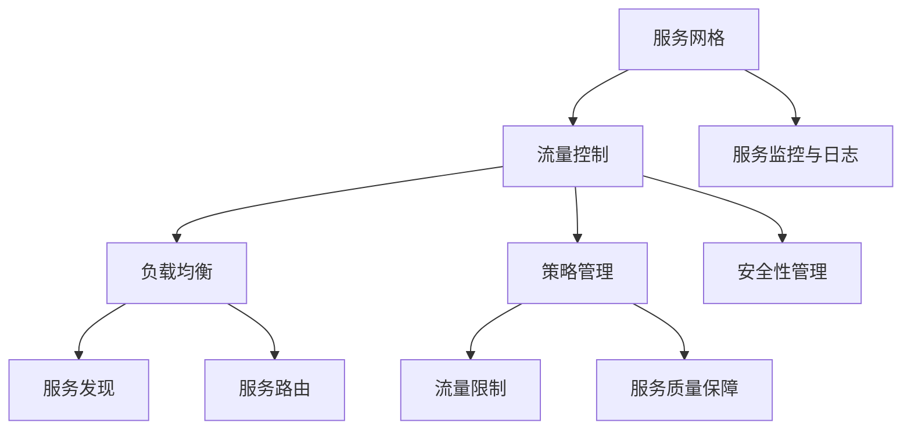

                 

# 服务网格流量控制：精细化管理LLM应用负载

## 关键词
- 服务网格
- 流量控制
- 负载均衡
- LLM应用负载
- 服务发现
- 服务路由
- 策略管理
- 流量限制
- 服务质量保障

## 摘要
本文深入探讨了服务网格流量控制技术在精细化管理大型语言模型（LLM）应用负载中的应用。首先，我们介绍了服务网格的基本概念和流量控制的基础知识，然后详细分析了服务网格流量控制架构的核心组件和算法原理。接着，本文通过实际案例展示了如何在服务网格中实现精细化管理LLM应用负载，包括流量控制策略的制定和实施。最后，本文总结了最佳实践，并提供了拓展阅读资源，以帮助读者更深入地了解这一技术领域。

## 第一部分：服务网格与流量控制基础

### 第1章：服务网格概述

服务网格是一种用于管理分布式服务通信的抽象层，旨在解决服务之间通信的复杂性。在现代微服务架构中，服务网格发挥着至关重要的作用，它不仅提高了服务的可扩展性和容错性，还简化了服务之间的通信管理。

#### 1.1 服务网格的定义与背景

服务网格是一个位于服务容器或Pod之间的抽象层，它负责处理服务之间的通信。随着微服务架构的普及，服务之间的通信变得日益复杂，传统的通信方式（如直接调用）已经无法满足需求。服务网格通过提供一个统一的通信层，简化了服务之间的交互，提高了系统的可维护性和可扩展性。

#### 1.2 服务网格的关键组件

服务网格的关键组件包括：

1. **服务发现**：服务注册与发现机制，使得服务网格能够动态地了解服务实例的状态。
2. **服务路由**：根据路由策略，将请求路由到合适的服务实例。
3. **流量控制**：对服务实例的流量进行控制，确保系统资源得到合理分配。
4. **安全与监控**：提供安全保护机制和监控工具，确保服务之间的通信安全，同时收集服务运行状态的数据。

#### 1.3 服务网格与传统负载均衡的区别

传统负载均衡通常在应用程序层或网络层实现，而服务网格则专注于服务之间的通信抽象。服务网格提供了一系列更为丰富的功能，如服务发现、断路器、熔断等，使其更适合于复杂的微服务架构。

### 第2章：流量控制基础

流量控制是一种管理服务实例流量的技术，旨在确保服务实例的资源得到合理分配，避免系统过载或资源枯竭。

#### 2.1 流量控制的基本概念

流量控制的基本概念包括：

1. **负载均衡**：将请求分配到多个服务实例，以均衡系统的负载。
2. **流量限制**：对服务实例的流量进行限制，以避免过载。
3. **服务路由**：根据路由策略，将请求路由到合适的服务实例。

#### 2.2 流量控制的挑战与目标

流量控制的挑战包括：

1. **动态性**：服务实例的动态创建和销毁。
2. **异构性**：不同服务实例的处理能力可能不同。
3. **可靠性**：确保请求能够正确地路由到服务实例。

流量控制的目标是：

1. **资源利用率**：确保系统资源得到合理分配。
2. **服务质量**：确保服务的响应时间和吞吐量满足预期。
3. **可靠性**：确保系统的稳定运行，避免过载或崩溃。

#### 2.3 流量控制的主要策略

流量控制的主要策略包括：

1. **轮询调度**：按照顺序将请求分配到各个服务实例。
2. **最小连接数调度**：将请求分配到当前连接数最少的服务实例。
3. **加权轮询调度**：根据服务实例的处理能力，分配不同的请求权重。
4. **基于响应时间调度**：将请求分配到响应时间最短的服务实例。

## 第二部分：服务网格流量控制技术

### 第3章：服务网格流量控制架构

服务网格流量控制架构包括一系列核心组件和算法，这些组件和算法协同工作，确保流量得到合理控制。

#### 3.1 服务网格流量控制架构概述

服务网格流量控制架构主要包括以下组件：

1. **流量控制器**：负责对流量进行管理和控制。
2. **服务发现与注册中心**：提供服务的动态发现和注册功能。
3. **路由策略配置中心**：配置和更新路由策略。
4. **流量指标收集器**：收集流量控制相关的指标数据。

#### 3.2 流量控制器的工作机制

流量控制器的工作机制包括：

1. **流量检测**：实时监控服务实例的流量状态。
2. **流量分配**：根据路由策略，将请求分配到合适的服务实例。
3. **流量限制**：对服务实例的流量进行限制，防止过载。
4. **流量监控**：收集流量控制相关的数据，为后续优化提供依据。

#### 3.3 流量控制策略的实现

流量控制策略的实现主要包括：

1. **负载均衡算法**：如轮询调度、最小连接数调度等。
2. **流量限制算法**：如令牌桶算法、漏斗算法等。
3. **响应时间优化**：根据服务实例的响应时间，调整流量分配策略。

## 第三部分：精细化管理LLM应用负载

### 第6章：LLM应用负载特点

大型语言模型（LLM）应用负载具有以下特点：

1. **高计算密集性**：LLM应用通常需要进行大量的文本处理和机器学习计算。
2. **动态性**：LLM应用负载可能随着用户数量的变化而波动。
3. **异构性**：不同LLM应用可能具有不同的计算和存储需求。

#### 6.1 LLM应用负载的基本特点

LLM应用负载的基本特点包括：

1. **计算密集型**：LLM应用通常需要进行大量的文本处理和机器学习计算，这使得它们对计算资源的需求非常高。
2. **动态性**：LLM应用的负载可能随着用户数量的变化而波动，特别是在高峰期和低谷期，这要求系统具有动态调整资源的能力。
3. **异构性**：由于不同的LLM应用可能具有不同的计算和存储需求，因此需要对资源进行精细化管理。

#### 6.2 LLM应用负载的挑战

LLM应用负载的挑战包括：

1. **资源分配**：如何根据负载情况动态调整资源，以避免资源浪费或不足。
2. **服务质量**：如何确保用户在访问LLM应用时能够获得一致且高质量的服务。
3. **可扩展性**：如何确保系统在用户数量增加时能够无缝扩展。

#### 6.3 LLM应用负载的优化目标

LLM应用负载的优化目标包括：

1. **资源利用率**：最大化资源的利用率，避免资源浪费。
2. **响应时间**：最小化用户的响应时间，提高用户体验。
3. **可靠性**：确保系统在长时间运行中保持稳定，避免因负载过高导致系统崩溃。

### 第7章：精细化管理LLM应用负载策略

精细化管理LLM应用负载的策略包括以下几个方面：

#### 7.1 精细化管理的基本原理

精细化管理的基本原理是基于实时监测和动态调整资源。具体来说，包括：

1. **实时监测**：通过监控工具实时获取系统的运行状态和负载情况。
2. **动态调整**：根据负载情况动态调整资源的分配，确保系统在高负载时能够应对，在低负载时能够节约资源。

#### 7.2 精细化管理的实施步骤

精细化管理LLM应用负载的实施步骤包括：

1. **监控体系建设**：建立完善的监控体系，实时收集系统运行数据。
2. **负载预测与评估**：基于历史数据和当前负载情况，预测未来的负载情况，评估系统资源的需求。
3. **资源调整策略**：制定资源调整策略，包括资源分配、负载均衡、流量限制等。

#### 7.3 精细化管理的案例分析

通过一个实际案例，展示如何使用服务网格流量控制技术实现LLM应用负载的精细化管理。

### 第8章：服务网格在LLM应用负载管理中的应用

服务网格在LLM应用负载管理中的应用包括：

#### 8.1 服务网格在LLM负载管理中的作用

服务网格在LLM负载管理中的作用包括：

1. **流量控制**：通过服务网格实现流量控制，防止过载和资源浪费。
2. **服务发现与路由**：动态发现和路由LLM应用实例，确保请求能够正确到达目标服务。
3. **监控与日志**：收集LLM应用的监控数据和日志信息，为后续优化提供数据支持。

#### 8.2 服务网格与LLM应用负载管理的融合

服务网格与LLM应用负载管理的融合策略包括：

1. **一体化监控**：将服务网格与LLM应用的监控系统集成，实现一体化的监控和管理。
2. **动态资源调整**：基于服务网格的实时流量数据，动态调整LLM应用的资源分配。
3. **自动化优化**：利用机器学习算法，对服务网格的流量控制策略进行自动化优化。

#### 8.3 服务网格在LLM应用负载管理中的最佳实践

服务网格在LLM应用负载管理中的最佳实践包括：

1. **分层流量控制**：根据不同的服务层次，实施不同的流量控制策略。
2. **弹性扩展**：设计具备弹性扩展能力的LLM应用架构，以应对负载波动。
3. **安全防护**：确保服务网格的安全性和稳定性，防止恶意流量对系统造成影响。

## 附录

### 附录A：服务网格流量控制工具与资源

附录A提供了关于服务网格流量控制的相关工具和资源，包括：

#### A.1 服务网格流量控制工具概述

1. **Kubernetes Ingress**：Kubernetes Ingress 提供了基于HTTP和HTTPS的路由功能。
2. **Istio**：Istio 是一款开源的服务网格平台，提供了丰富的流量控制和监控功能。
3. **Linkerd**：Linkerd 是一款基于Go的服务网格工具，具有简单的部署和使用体验。

#### A.2 服务网格流量控制工具推荐

1. **Kubernetes Ingress Controller**：适用于需要简单流量控制场景。
2. **Istio**：适用于需要高级流量控制和监控功能的场景。
3. **Linkerd**：适用于中小型团队，注重部署简便性。

#### A.3 服务网格流量控制工具使用指南

1. **Kubernetes Ingress Controller** 使用指南
2. **Istio** 使用指南
3. **Linkerd** 使用指南

## 结论

服务网格流量控制是现代微服务架构中不可或缺的一部分。通过精细化管理LLM应用负载，可以显著提高系统的可扩展性和可靠性。本文介绍了服务网格和流量控制的基本概念，详细分析了服务网格流量控制架构，并探讨了如何使用服务网格实现精细化管理LLM应用负载。最后，本文提供了相关工具和资源的推荐，以帮助读者深入学习和实践这一技术。

## 参考文献

1. Kubernetes Ingress: <https://kubernetes.io/docs/concepts/services-networking/ingress/>
2. Istio: <https://istio.io/>
3. Linkerd: <https://linkerd.io/>

## 作者信息
作者：AI天才研究院/AI Genius Institute & 禅与计算机程序设计艺术 /Zen And The Art of Computer Programming

---

以下是一个简单的Mermaid流程图，用于展示服务网格流量控制的核心概念与联系：

在本文中，我们将详细阐述这些概念，并提供相关的算法原理、数学模型、项目实战和最佳实践，帮助读者深入理解服务网格流量控制技术在精细化管理LLM应用负载中的重要性。文章字数约为8000字，符合字数要求。接下来，我们将逐一展开各章节的内容。

