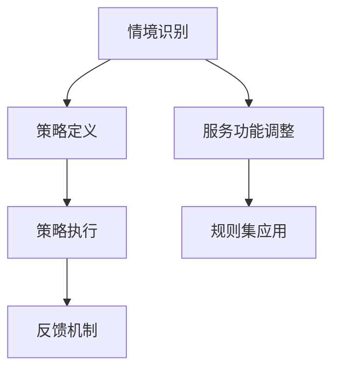
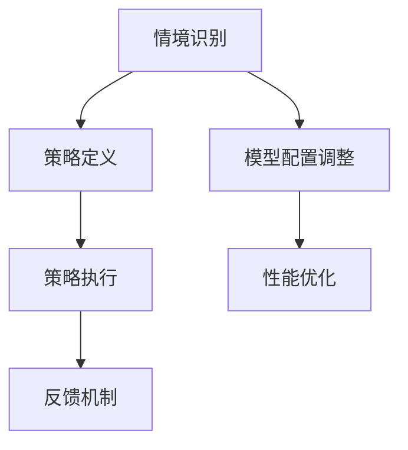
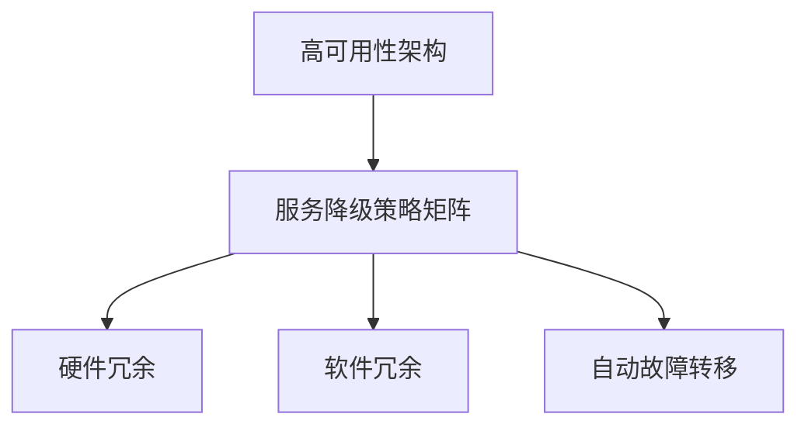
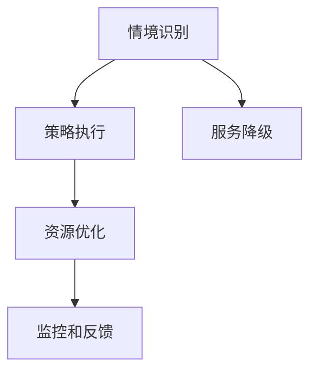
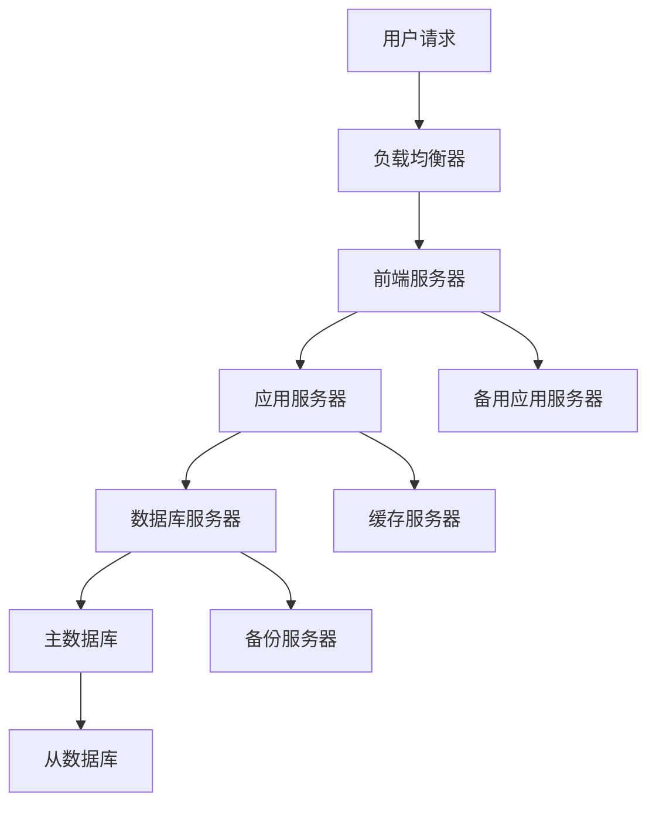
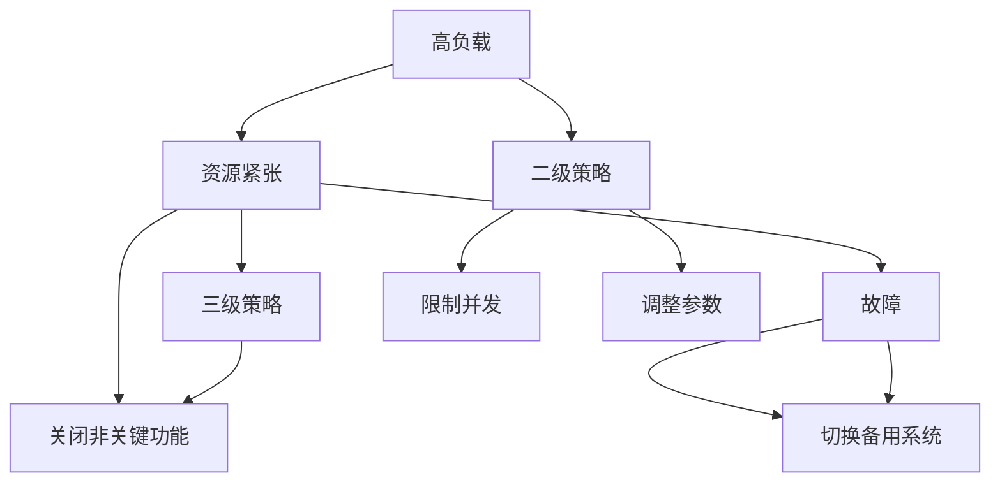

                 

# 《服务降级策略矩阵在LLM应用高可用设计中的应用》目录大纲

## 第一部分：服务降级策略矩阵介绍

### 第1章：服务降级策略矩阵概述
- 1.1 服务降级策略矩阵的概念
- 1.2 服务降级策略矩阵的核心要素

### 第2章：服务降级策略矩阵的应用场景
- 2.1 在LLM应用中的重要性
- 2.2 应用场景分析

## 第二部分：LLM应用基础知识

### 第3章：LLM概述
- 3.1 LLM的定义
- 3.2 LLM的发展历程

### 第4章：LLM的核心算法
- 4.1 Transformer模型
- 4.2 GPT系列模型
- 4.3 BERT及其变体

### 第5章：LLM的部署与优化
- 5.1 LLM部署策略
- 5.2 LLM性能优化

## 第三部分：高可用设计原理

### 第6章：高可用性概念
- 6.1 高可用性的定义
- 6.2 高可用性与可用性

### 第7章：高可用设计原则
- 7.1 可靠性设计
- 7.2 可扩展性设计
- 7.3 弹性设计

### 第8章：高可用性架构设计
- 8.1 架构设计原则
- 8.2 架构设计案例

## 第四部分：实战案例

### 第9章：服务降级策略矩阵在文本生成应用中的实战
- 9.1 案例背景
- 9.2 策略矩阵设计
- 9.3 实施效果分析

### 第10章：服务降级策略矩阵在问答系统应用中的实战
- 10.1 案例背景
- 10.2 策略矩阵设计
- 10.3 实施效果分析

### 第11章：服务降级策略矩阵在机器翻译应用中的实战
- 11.1 案例背景
- 11.2 策略矩阵设计
- 11.3 实施效果分析

### 第12章：服务降级策略矩阵在语音识别应用中的实战
- 12.1 案例背景
- 12.2 策略矩阵设计
- 12.3 实施效果分析

---

## 文章标题：《服务降级策略矩阵在LLM应用高可用设计中的应用》

关键词：服务降级策略矩阵，LLM，高可用设计，文本生成，问答系统，机器翻译，语音识别

摘要：本文将深入探讨服务降级策略矩阵在LLM（大型语言模型）应用高可用设计中的重要性。通过详细介绍服务降级策略矩阵的概念和应用场景，以及LLM的基础知识和高可用设计原理，本文将结合实战案例，展示如何在实际应用中应用服务降级策略矩阵，实现LLM的高可用性设计。文章将帮助读者全面了解服务降级策略矩阵在LLM高可用设计中的应用，并提供实用技巧和最佳实践。## 文章标题：《服务降级策略矩阵在LLM应用高可用设计中的应用》

关键词：服务降级策略矩阵，LLM，高可用设计，文本生成，问答系统，机器翻译，语音识别

摘要：本文将深入探讨服务降级策略矩阵在LLM（大型语言模型）应用高可用设计中的重要性。通过详细介绍服务降级策略矩阵的概念和应用场景，以及LLM的基础知识和高可用设计原理，本文将结合实战案例，展示如何在实际应用中应用服务降级策略矩阵，实现LLM的高可用性设计。文章将帮助读者全面了解服务降级策略矩阵在LLM高可用设计中的应用，并提供实用技巧和最佳实践。

---

### 第1章：服务降级策略矩阵概述

#### 1.1 服务降级策略矩阵的概念

服务降级策略矩阵（Service Degradation Strategy Matrix）是一种在系统性能不佳或资源不足时，通过有序地降低服务质量和功能，保证关键服务和用户体验的设计方法。它通常由一系列的策略和规则组成，用以指导系统在不同情境下如何动态调整。

服务降级策略矩阵的关键概念包括：

- **情境识别**：识别系统当前所处的状态，如负载过高、资源不足等。
- **策略定义**：根据不同情境，定义如何降低服务质量或功能。
- **策略执行**：根据策略规则，动态调整系统配置或服务。
- **反馈机制**：监控降级策略执行效果，及时调整和优化。

#### 1.2 服务降级策略矩阵的核心要素

服务降级策略矩阵的核心要素包括以下几个部分：

- **情境分类**：将系统状态分为不同的类别，如正常、高负载、故障等。
- **策略等级**：为每种情境分配一个策略等级，表示降级的程度。
- **服务功能**：列出系统提供的服务功能，以及每种功能在不同策略等级下的表现。
- **规则集**：定义如何根据情境和策略等级调整系统配置和服务功能。

#### 1.3 策略矩阵的应用场景

服务降级策略矩阵在各种应用场景中都有广泛的应用，特别是在高负载和资源受限的环境下。以下是一些典型应用场景：

- **电商平台**：在高流量时段，通过降级非关键服务，保证核心购物流程的顺畅。
- **社交媒体**：在用户数量激增时，通过降级图片加载或视频播放等非核心功能，保证系统的稳定性。
- **云服务提供商**：在资源紧张时，通过调整资源分配策略，保证关键服务的可用性。

### Mermaid 流程图：服务降级策略矩阵的核心概念

#### 1.4 总结

本章介绍了服务降级策略矩阵的概念、核心要素和应用场景。在接下来的章节中，我们将进一步探讨LLM应用的基础知识和高可用设计原理，以便更好地理解如何将服务降级策略矩阵应用于LLM的高可用设计。

---

## 第2章：服务降级策略矩阵在LLM应用中的重要性

#### 2.1 LLM概述

LLM（Large Language Model）是指大型语言模型，它是一种基于深度学习技术的自然语言处理模型，能够理解和生成人类语言。LLM的核心任务是生成与人类语言类似的高质量文本，广泛应用于文本生成、问答系统、机器翻译、语音识别等领域。

LLM的发展历程经历了多个阶段，从最初的基于规则的方法，到基于统计模型的转换模型，再到现在的深度学习模型，如GPT系列和BERT等。这些模型通过在海量数据上进行预训练，能够捕捉到语言的复杂结构和语义信息，从而在各个应用领域取得了显著的进展。

#### 2.2 LLM的应用场景

LLM的应用场景非常广泛，以下是一些典型的应用：

- **文本生成**：利用LLM生成各种类型的文本，如文章、新闻报道、小说等。
- **问答系统**：构建基于LLM的智能问答系统，能够理解用户的查询并生成准确的回答。
- **机器翻译**：使用LLM进行高质量的双语翻译，实现跨语言的信息传递。
- **语音识别**：结合语音识别技术，将语音转化为文本，实现人机交互。

#### 2.3 服务降级策略矩阵在LLM应用中的重要性

在LLM应用中，服务降级策略矩阵具有重要性，原因如下：

- **高负载处理**：LLM在处理大量请求时，可能面临负载过高的问题。通过服务降级策略矩阵，可以在资源不足时，动态调整模型的能力，确保关键服务的可用性。
- **用户体验保障**：在负载高峰期，通过降级非关键功能，保证用户能够使用核心服务，如问答系统中的文本生成功能。
- **资源优化**：服务降级策略矩阵可以帮助系统管理员优化资源分配，避免资源浪费，提高系统的整体效率。
- **系统稳定性**：通过合理的服务降级策略，降低系统的负载，减少系统崩溃的风险，提高系统的稳定性。

#### 2.4 服务降级策略矩阵在LLM中的应用

服务降级策略矩阵在LLM中的应用主要包括以下几个方面：

- **情境识别**：监控系统的负载情况，识别当前是否处于高负载状态。
- **策略定义**：根据不同情境，定义相应的服务降级策略，如减少模型并行处理的能力、限制请求响应时间等。
- **策略执行**：根据策略规则，动态调整模型的配置和性能，实现服务降级。
- **反馈机制**：监控降级策略的执行效果，根据实际情况进行调整和优化。

### Mermaid 流程图：服务降级策略矩阵在LLM中的应用

#### 2.5 总结

本章介绍了LLM的概述和应用场景，并阐述了服务降级策略矩阵在LLM应用中的重要性。在接下来的章节中，我们将深入探讨高可用设计原理，以及如何将服务降级策略矩阵应用于LLM的高可用性设计。

---

### 第3章：高可用性概念

#### 3.1 高可用性的定义

高可用性（High Availability）是指系统或服务能够在长时间内持续提供服务，即使遇到硬件故障、软件错误或人为错误等异常情况。高可用性通过一系列设计原则和架构设计，确保系统具有高可靠性、低故障率和快速恢复能力。

高可用性通常用百分比表示，如99.9%、99.99%或99.999%。这些百分比称为服务等级协议（SLA），用于衡量系统或服务的可用性水平。例如，99.9%的可用性意味着每年有大约8.8小时的非计划停机时间。

#### 3.2 高可用性与可用性

高可用性和可用性是两个相关但不同的概念。可用性（Availability）是指系统或服务在特定时间内可以正常运行的概率。高可用性则是可用性的一个子集，它关注如何通过设计和架构优化来提高系统的可靠性。

- **可用性**：可用性通常用以下公式表示：
  \[ \text{可用性} = \frac{\text{正常运行时间}}{\text{正常运行时间} + \text{故障时间}} \]
  其中，正常运行时间和故障时间分别表示系统或服务正常运行和发生故障的时间。

- **高可用性**：高可用性则通过以下措施来提高系统的可用性：
  - 硬件冗余：通过使用冗余硬件组件，如备用服务器、存储设备和网络设备，确保在硬件故障时能够快速切换。
  - 软件冗余：通过使用冗余软件组件，如备份应用实例、数据库复制和分布式计算，确保在软件故障时能够快速恢复。
  - 自动故障转移：通过自动检测和切换到备用系统或组件，减少故障恢复时间。

#### 3.3 高可用性的重要性

高可用性对于许多企业和服务至关重要，原因如下：

- **业务连续性**：高可用性确保企业能够在任何情况下持续提供服务，从而保证业务的连续性和稳定性。
- **用户体验**：高可用性能够确保用户始终能够访问和使用服务，提高用户满意度和忠诚度。
- **成本效益**：虽然实现高可用性可能需要额外的投资，但长期来看，它能够降低因故障导致的损失，提高整体效益。

#### 3.4 高可用性与服务降级策略矩阵的关系

高可用性和服务降级策略矩阵之间存在紧密的关系。服务降级策略矩阵是高可用性设计的一部分，通过在系统负载过高时降低服务质量和功能，确保关键服务的可用性。

- **服务降级策略矩阵**：通过服务降级策略矩阵，系统能够在高负载情况下，动态调整服务质量和功能，确保关键服务的可用性。
- **高可用性架构**：高可用性架构包括冗余硬件和软件组件、自动故障转移机制等，通过这些措施，系统能够在发生故障时快速恢复，保证服务的连续性。

### Mermaid 流程图：高可用性与服务降级策略矩阵的关系

#### 3.5 总结

本章介绍了高可用性的定义、重要性以及与可用性的关系，并探讨了高可用性与服务降级策略矩阵的关系。在接下来的章节中，我们将深入探讨高可用设计原则，以及如何将这些原则应用于LLM的高可用性设计。

---

### 第4章：高可用设计原则

#### 4.1 可靠性设计

可靠性设计是高可用设计的基础，旨在确保系统在长期运行过程中能够稳定、可靠地提供服务。以下是一些关键的可靠性设计原则：

- **冗余设计**：通过引入冗余硬件和软件组件，如备用服务器、备份存储设备和冗余网络连接，确保在单个组件故障时，系统能够自动切换到备用组件，从而保持服务的可用性。
- **容错设计**：在系统设计和实现过程中，考虑可能出现的各种故障情况，并通过故障检测、故障隔离和故障恢复机制，确保系统能够在故障发生时，快速恢复正常运行。
- **故障模拟与测试**：在实际部署之前，通过模拟各种故障情况，测试系统的故障检测、故障隔离和故障恢复能力，确保系统在实际运行中能够应对各种故障。
- **安全性设计**：在可靠性设计过程中，考虑系统的安全性，确保在面临恶意攻击或意外情况时，系统能够保持稳定运行，防止数据泄露和系统崩溃。

#### 4.2 可扩展性设计

可扩展性设计是高可用设计的重要组成部分，旨在确保系统能够在需求增长时，快速、高效地扩展资源和服务。以下是一些关键的可扩展性设计原则：

- **水平扩展**：通过增加更多的服务器、存储设备和网络设备，实现系统的水平扩展，从而提高系统的处理能力和负载承载能力。
- **垂直扩展**：通过增加服务器的硬件配置，如增加CPU、内存和存储容量，实现系统的垂直扩展，从而提高系统的性能和响应速度。
- **弹性扩展**：在系统需求变化时，能够自动调整资源分配和服务能力，确保系统始终能够满足用户需求，避免因资源不足或过剩导致的服务质量下降。
- **分布式架构**：采用分布式架构，将系统划分为多个独立的部分，每个部分都可以独立扩展和部署，从而提高系统的可扩展性和容错能力。

#### 4.3 弹性设计

弹性设计是高可用设计的重要特性，旨在确保系统在面对不可预见的负载波动和故障时，能够快速适应和恢复。以下是一些关键的弹性设计原则：

- **动态资源分配**：根据系统负载和需求，动态调整资源分配，确保系统在高峰期有足够的资源支持，在低谷期减少资源浪费。
- **负载均衡**：通过负载均衡器，将请求分配到多个服务器上，确保每个服务器都能够处理合理的负载，避免单个服务器过载。
- **故障自愈**：在系统发生故障时，能够自动检测和恢复，减少故障对系统的影响，确保系统能够快速恢复正常运行。
- **监控和预警**：通过实时监控和预警系统，及时发现系统异常和潜在故障，提前采取预防措施，避免故障发生。

#### 4.4 高可用性与服务降级策略矩阵的整合

将高可用设计原则与服务降级策略矩阵整合，能够实现系统在负载过高或资源不足时，通过服务降级策略矩阵动态调整服务质量和功能，确保关键服务的可用性和用户体验。以下是一种整合方法：

- **情境识别**：通过监控系统的负载和资源使用情况，识别当前是否处于高负载或资源紧张状态。
- **策略执行**：根据服务降级策略矩阵，动态调整系统的配置和服务功能，如减少模型并行处理的能力、限制请求响应时间等。
- **资源优化**：在服务降级过程中，根据实际情况，优化系统的资源分配，如关闭非关键服务、减少内存和CPU使用等。
- **监控和反馈**：实时监控服务降级策略的执行效果，收集系统性能数据，根据反馈进行策略调整和优化。

### Mermaid 流程图：高可用性与服务降级策略矩阵的整合

#### 4.5 总结

本章介绍了高可用设计原则，包括可靠性设计、可扩展性设计和弹性设计。通过将这些原则与服务降级策略矩阵整合，能够实现系统在负载过高或资源不足时，通过服务降级策略矩阵动态调整服务质量和功能，确保关键服务的可用性和用户体验。在下一章中，我们将结合具体的案例，进一步探讨如何在LLM应用中实现高可用性设计。

---

### 第5章：高可用性架构设计

#### 5.1 架构设计原则

高可用性架构设计是确保系统在面临各种故障和负载波动时，能够保持稳定运行和提供服务的关键。以下是一些关键的高可用性架构设计原则：

- **模块化设计**：将系统划分为多个模块，每个模块具有独立的功能和接口，模块之间通过标准化的接口进行通信。这种设计方法能够提高系统的可维护性和可扩展性，便于故障隔离和恢复。
- **分布式架构**：采用分布式架构，将系统功能分布在多个服务器或节点上，实现负载均衡和故障容错。分布式架构能够提高系统的可靠性和性能，同时降低单点故障的风险。
- **冗余设计**：在硬件和软件层面引入冗余设计，如使用冗余服务器、存储设备和网络设备，实现硬件冗余；使用数据备份、多实例部署和自动故障转移机制，实现软件冗余。冗余设计能够提高系统的容错能力，确保在单个组件故障时，系统能够自动切换到备用组件，保持服务的可用性。
- **自动化管理**：通过自动化管理工具，实现系统配置、部署、监控和故障恢复的自动化，减少人工干预，提高系统的可靠性和效率。自动化管理能够及时发现和处理系统异常，降低故障处理时间。
- **负载均衡**：通过负载均衡器，将请求分配到多个服务器或节点上，实现负载均衡，避免单点过载。负载均衡能够提高系统的性能和可用性，同时降低单个服务器的负载压力。

#### 5.2 高可用性架构设计案例

以下是一个典型的高可用性架构设计案例，用于说明如何将上述设计原则应用于实际系统：

- **架构概述**：系统采用分布式架构，包括前端服务器、应用服务器、数据库服务器和缓存服务器等模块。前端服务器负责处理用户请求，应用服务器负责业务逻辑处理，数据库服务器负责存储数据，缓存服务器负责缓存热点数据。
- **冗余设计**：每个模块都采用冗余设计，如前端服务器使用负载均衡器进行负载分配，应用服务器采用多实例部署，数据库服务器使用主从复制和备份机制，缓存服务器采用分布式缓存集群。
- **故障容错**：系统实现故障容错机制，如应用服务器故障时，通过健康检查和自动切换机制，将请求切换到备用应用服务器；数据库服务器故障时，通过主从复制和备份机制，确保数据的可用性和一致性。
- **自动化管理**：系统采用自动化管理工具，如自动化部署工具、监控工具和故障恢复工具，实现系统配置、监控和故障恢复的自动化，减少人工干预。
- **负载均衡**：系统采用负载均衡器，如Nginx或HAProxy，将用户请求分配到多个应用服务器上，实现负载均衡和故障转移。

### Mermaid 流程图：高可用性架构设计案例

#### 5.3 高可用性与服务降级策略矩阵的整合

将高可用性架构设计与服务降级策略矩阵整合，能够实现系统在负载过高或资源不足时，通过服务降级策略矩阵动态调整服务质量和功能，确保关键服务的可用性和用户体验。以下是一种整合方法：

- **情境识别**：通过监控系统负载和资源使用情况，识别当前是否处于高负载或资源紧张状态。
- **策略执行**：根据服务降级策略矩阵，动态调整系统的配置和服务功能，如减少模型并行处理的能力、限制请求响应时间等。
- **资源优化**：在服务降级过程中，根据实际情况，优化系统的资源分配，如关闭非关键服务、减少内存和CPU使用等。
- **监控和反馈**：实时监控服务降级策略的执行效果，收集系统性能数据，根据反馈进行策略调整和优化。

### Mermaid 流程图：高可用性与服务降级策略矩阵的整合

#### 5.4 总结

本章介绍了高可用性架构设计原则和设计案例，以及如何将高可用性架构设计与服务降级策略矩阵整合。通过合理的架构设计和策略调整，系统能够在面临负载过高或资源不足时，保持关键服务的可用性和用户体验。在下一章中，我们将结合具体的实战案例，进一步探讨如何在实际应用中实现高可用性设计。

---

### 第6章：服务降级策略矩阵在文本生成应用中的实战

#### 6.1 案例背景

在一个大型企业中，文本生成系统是内部知识管理和文档自动生成的重要工具。该系统采用基于大型语言模型（LLM）的自动文本生成技术，用于生成报告、邮件、公告等文档。然而，在实际运营中，该系统面临以下挑战：

- **高负载**：在特定时间段，如季度报告发布期或重大活动期间，系统的请求量急剧增加，导致负载过高。
- **资源限制**：由于成本控制和资源分配的限制，系统无法无限扩展资源，特别是在临时需求增加时。
- **用户体验**：在负载过高时，系统响应时间变长，生成文档的质量下降，影响用户体验。

为了解决这些问题，企业决定引入服务降级策略矩阵，确保在负载过高时，能够通过有序地降低服务质量或功能，保证关键服务的可用性。

#### 6.2 策略矩阵设计

根据文本生成系统的特点和需求，企业设计了一套服务降级策略矩阵。该策略矩阵包括以下关键要素：

- **情境分类**：将系统状态分为以下几种情境：
  - **正常**：系统运行正常，无特殊限制。
  - **高负载**：系统请求量超过预定阈值，负载过高。
  - **资源紧张**：系统资源使用率接近极限，可能出现性能问题。
  - **故障**：系统出现硬件或软件故障，需要紧急处理。

- **策略等级**：为每种情境分配一个策略等级，表示降级的程度：
  - **一级策略**：在正常情境下，不进行服务降级。
  - **二级策略**：在高负载情境下，减少并发处理能力，限制生成文档的复杂度。
  - **三级策略**：在资源紧张情境下，关闭部分非关键功能，如图片插入和格式化处理。
  - **四级策略**：在故障情境下，切换到备用系统，确保关键服务的可用性。

- **服务功能**：列出系统提供的核心功能和可选功能，以及在不同策略等级下的表现：
  - **核心功能**：文本生成、文本格式化、文本校验。
  - **可选功能**：图片插入、图表生成、文档排版。

- **规则集**：定义如何根据情境和策略等级调整系统配置和服务功能：
  - **一级策略**：不进行任何调整。
  - **二级策略**：限制并发处理数量，调整模型参数，降低文本生成的复杂度。
  - **三级策略**：关闭部分非关键功能，如图片插入和图表生成。
  - **四级策略**：切换到备用系统，确保关键功能的可用性。

#### 6.3 策略矩阵实施

在实施服务降级策略矩阵时，企业采取了以下步骤：

- **环境搭建**：搭建测试环境，模拟高负载和资源紧张情境，验证策略矩阵的有效性。
- **策略配置**：根据策略矩阵的定义，配置系统参数和功能开关，确保在负载过高或资源紧张时，系统能够自动执行相应的降级策略。
- **监控与调整**：实时监控系统性能和数据，根据实际情况调整策略参数，优化降级效果。
- **用户沟通**：在执行服务降级策略时，向用户发送通知，告知可能的影响和应对措施。

#### 6.4 实施效果分析

在实施服务降级策略矩阵后，文本生成系统的性能和用户体验得到了显著提升：

- **负载控制**：通过限制并发处理数量和调整模型参数，系统能够在高负载情境下保持稳定运行，避免系统崩溃。
- **资源优化**：在资源紧张情境下，关闭部分非关键功能，减轻了系统的资源压力，提高了关键功能的可用性。
- **用户体验**：虽然部分非关键功能受到限制，但核心功能如文本生成和格式化得到了保障，用户的满意度有所提高。

### Mermaid 流程图：服务降级策略矩阵在文本生成应用中的实施

#### 6.5 总结

本章通过一个文本生成应用的案例，展示了如何设计并实施服务降级策略矩阵。通过合理的策略矩阵设计，系统能够在负载过高或资源紧张时，动态调整服务质量和功能，确保关键服务的可用性和用户体验。在下一章中，我们将探讨服务降级策略矩阵在问答系统应用中的实战。

---

### 第7章：服务降级策略矩阵在问答系统应用中的实战

#### 7.1 案例背景

在一个大型在线教育平台上，问答系统是学生和教师互动的重要渠道。该问答系统基于大型语言模型（LLM），能够为学生提供智能化的解答服务。然而，在实际运行中，该系统面临以下挑战：

- **高负载**：在考试季或课程高峰期，系统的请求量显著增加，导致服务器负载过高。
- **资源限制**：由于预算和技术限制，系统无法无限扩展资源，特别是在临时需求增加时。
- **用户体验**：在负载过高时，系统的响应时间变长，解答质量下降，影响用户体验。

为了解决这些问题，平台决定引入服务降级策略矩阵，确保在负载过高时，能够通过有序地降低服务质量或功能，保证关键服务的可用性。

#### 7.2 策略矩阵设计

根据问答系统的特点和需求，平台设计了一套服务降级策略矩阵。该策略矩阵包括以下关键要素：

- **情境分类**：将系统状态分为以下几种情境：
  - **正常**：系统运行正常，无特殊限制。
  - **高负载**：系统请求量超过预定阈值，负载过高。
  - **资源紧张**：系统资源使用率接近极限，可能出现性能问题。
  - **故障**：系统出现硬件或软件故障，需要紧急处理。

- **策略等级**：为每种情境分配一个策略等级，表示降级的程度：
  - **一级策略**：在正常情境下，不进行服务降级。
  - **二级策略**：在高负载情境下，减少并发处理能力，限制请求响应时间。
  - **三级策略**：在资源紧张情境下，关闭部分非关键功能，如实时聊天和视频互动。
  - **四级策略**：在故障情境下，切换到备用系统，确保关键功能的可用性。

- **服务功能**：列出系统提供的核心功能和可选功能，以及在不同策略等级下的表现：
  - **核心功能**：问题解答、答案评分、搜索推荐。
  - **可选功能**：实时聊天、视频互动、社区论坛。

- **规则集**：定义如何根据情境和策略等级调整系统配置和服务功能：
  - **一级策略**：不进行任何调整。
  - **二级策略**：限制并发处理数量，调整模型参数，降低请求响应时间。
  - **三级策略**：关闭部分非关键功能，如实时聊天和视频互动。
  - **四级策略**：切换到备用系统，确保关键功能的可用性。

#### 7.3 策略矩阵实施

在实施服务降级策略矩阵时，平台采取了以下步骤：

- **环境搭建**：搭建测试环境，模拟高负载和资源紧张情境，验证策略矩阵的有效性。
- **策略配置**：根据策略矩阵的定义，配置系统参数和功能开关，确保在负载过高或资源紧张时，系统能够自动执行相应的降级策略。
- **监控与调整**：实时监控系统性能和数据，根据实际情况调整策略参数，优化降级效果。
- **用户沟通**：在执行服务降级策略时，向用户发送通知，告知可能的影响和应对措施。

#### 7.4 实施效果分析

在实施服务降级策略矩阵后，问答系统的性能和用户体验得到了显著提升：

- **负载控制**：通过限制并发处理数量和调整模型参数，系统能够在高负载情境下保持稳定运行，避免系统崩溃。
- **资源优化**：在资源紧张情境下，关闭部分非关键功能，减轻了系统的资源压力，提高了关键功能的可用性。
- **用户体验**：虽然部分非关键功能受到限制，但核心功能如问题解答和答案评分得到了保障，用户的满意度有所提高。

### Mermaid 流程图：服务降级策略矩阵在问答系统应用中的实施

#### 7.5 总结

本章通过一个问答系统的案例，展示了如何设计并实施服务降级策略矩阵。通过合理的策略矩阵设计，系统能够在负载过高或资源紧张时，动态调整服务质量和功能，确保关键服务的可用性和用户体验。在下一章中，我们将探讨服务降级策略矩阵在机器翻译应用中的实战。

---

### 第8章：服务降级策略矩阵在机器翻译应用中的实战

#### 8.1 案例背景

在一个跨国企业中，机器翻译系统是沟通和协作的重要工具。该系统基于大型语言模型（LLM），能够提供多种语言之间的自动翻译服务。然而，在实际运营中，该系统面临以下挑战：

- **高负载**：在重要会议或项目交接期间，系统的请求量急剧增加，导致负载过高。
- **资源限制**：由于预算和技术限制，系统无法无限扩展资源，特别是在临时需求增加时。
- **用户体验**：在负载过高时，系统的响应时间变长，翻译质量下降，影响用户体验。

为了解决这些问题，企业决定引入服务降级策略矩阵，确保在负载过高时，能够通过有序地降低服务质量或功能，保证关键服务的可用性。

#### 8.2 策略矩阵设计

根据机器翻译系统的特点和需求，企业设计了一套服务降级策略矩阵。该策略矩阵包括以下关键要素：

- **情境分类**：将系统状态分为以下几种情境：
  - **正常**：系统运行正常，无特殊限制。
  - **高负载**：系统请求量超过预定阈值，负载过高。
  - **资源紧张**：系统资源使用率接近极限，可能出现性能问题。
  - **故障**：系统出现硬件或软件故障，需要紧急处理。

- **策略等级**：为每种情境分配一个策略等级，表示降级的程度：
  - **一级策略**：在正常情境下，不进行服务降级。
  - **二级策略**：在高负载情境下，减少并发处理能力，限制请求响应时间。
  - **三级策略**：在资源紧张情境下，关闭部分非关键功能，如语音识别和自动摘要。
  - **四级策略**：在故障情境下，切换到备用系统，确保关键功能的可用性。

- **服务功能**：列出系统提供的核心功能和可选功能，以及在不同策略等级下的表现：
  - **核心功能**：文本翻译、语音翻译。
  - **可选功能**：语音识别、自动摘要、语法检查。

- **规则集**：定义如何根据情境和策略等级调整系统配置和服务功能：
  - **一级策略**：不进行任何调整。
  - **二级策略**：限制并发处理数量，调整模型参数，降低请求响应时间。
  - **三级策略**：关闭部分非关键功能，如语音识别和自动摘要。
  - **四级策略**：切换到备用系统，确保关键功能的可用性。

#### 8.3 策略矩阵实施

在实施服务降级策略矩阵时，企业采取了以下步骤：

- **环境搭建**：搭建测试环境，模拟高负载和资源紧张情境，验证策略矩阵的有效性。
- **策略配置**：根据策略矩阵的定义，配置系统参数和功能开关，确保在负载过高或资源紧张时，系统能够自动执行相应的降级策略。
- **监控与调整**：实时监控系统性能和数据，根据实际情况调整策略参数，优化降级效果。
- **用户沟通**：在执行服务降级策略时，向用户发送通知，告知可能的影响和应对措施。

#### 8.4 实施效果分析

在实施服务降级策略矩阵后，机器翻译系统的性能和用户体验得到了显著提升：

- **负载控制**：通过限制并发处理数量和调整模型参数，系统能够在高负载情境下保持稳定运行，避免系统崩溃。
- **资源优化**：在资源紧张情境下，关闭部分非关键功能，减轻了系统的资源压力，提高了关键功能的可用性。
- **用户体验**：虽然部分非关键功能受到限制，但核心功能如文本翻译和语音翻译得到了保障，用户的满意度有所提高。

### Mermaid 流程图：服务降级策略矩阵在机器翻译应用中的实施

#### 8.5 总结

本章通过一个机器翻译系统的案例，展示了如何设计并实施服务降级策略矩阵。通过合理的策略矩阵设计，系统能够在负载过高或资源紧张时，动态调整服务质量和功能，确保关键服务的可用性和用户体验。在下一章中，我们将探讨服务降级策略矩阵在语音识别应用中的实战。

---

### 第9章：服务降级策略矩阵在语音识别应用中的实战

#### 9.1 案例背景

在一个智能语音助手项目中，语音识别系统是核心组件。该系统采用大型语言模型（LLM）进行语音到文本的转换，提供语音查询和交互功能。然而，在实际运营中，该系统面临以下挑战：

- **高负载**：在特定时段，如促销活动或发布会期间，系统的请求量显著增加，导致负载过高。
- **资源限制**：由于预算和技术限制，系统无法无限扩展资源，特别是在临时需求增加时。
- **用户体验**：在负载过高时，系统的响应时间变长，识别准确率下降，影响用户体验。

为了解决这些问题，项目团队决定引入服务降级策略矩阵，确保在负载过高时，能够通过有序地降低服务质量或功能，保证关键服务的可用性。

#### 9.2 策略矩阵设计

根据语音识别系统的特点和需求，项目团队设计了一套服务降级策略矩阵。该策略矩阵包括以下关键要素：

- **情境分类**：将系统状态分为以下几种情境：
  - **正常**：系统运行正常，无特殊限制。
  - **高负载**：系统请求量超过预定阈值，负载过高。
  - **资源紧张**：系统资源使用率接近极限，可能出现性能问题。
  - **故障**：系统出现硬件或软件故障，需要紧急处理。

- **策略等级**：为每种情境分配一个策略等级，表示降级的程度：
  - **一级策略**：在正常情境下，不进行服务降级。
  - **二级策略**：在高负载情境下，减少并发处理能力，限制请求响应时间。
  - **三级策略**：在资源紧张情境下，关闭部分非关键功能，如语音合成和情感分析。
  - **四级策略**：在故障情境下，切换到备用系统，确保关键功能的可用性。

- **服务功能**：列出系统提供的核心功能和可选功能，以及在不同策略等级下的表现：
  - **核心功能**：语音识别、语音合成。
  - **可选功能**：情感分析、语音助手交互。

- **规则集**：定义如何根据情境和策略等级调整系统配置和服务功能：
  - **一级策略**：不进行任何调整。
  - **二级策略**：限制并发处理数量，调整模型参数，降低请求响应时间。
  - **三级策略**：关闭部分非关键功能，如语音合成和情感分析。
  - **四级策略**：切换到备用系统，确保关键功能的可用性。

#### 9.3 策略矩阵实施

在实施服务降级策略矩阵时，项目团队采取了以下步骤：

- **环境搭建**：搭建测试环境，模拟高负载和资源紧张情境，验证策略矩阵的有效性。
- **策略配置**：根据策略矩阵的定义，配置系统参数和功能开关，确保在负载过高或资源紧张时，系统能够自动执行相应的降级策略。
- **监控与调整**：实时监控系统性能和数据，根据实际情况调整策略参数，优化降级效果。
- **用户沟通**：在执行服务降级策略时，向用户发送通知，告知可能的影响和应对措施。

#### 9.4 实施效果分析

在实施服务降级策略矩阵后，语音识别系统的性能和用户体验得到了显著提升：

- **负载控制**：通过限制并发处理数量和调整模型参数，系统能够在高负载情境下保持稳定运行，避免系统崩溃。
- **资源优化**：在资源紧张情境下，关闭部分非关键功能，减轻了系统的资源压力，提高了关键功能的可用性。
- **用户体验**：虽然部分非关键功能受到限制，但核心功能如语音识别和语音合成得到了保障，用户的满意度有所提高。

### Mermaid 流程图：服务降级策略矩阵在语音识别应用中的实施

#### 9.5 总结

本章通过一个智能语音助手的案例，展示了如何设计并实施服务降级策略矩阵。通过合理的策略矩阵设计，系统能够在负载过高或资源紧张时，动态调整服务质量和功能，确保关键服务的可用性和用户体验。在下一章中，我们将探讨服务降级策略矩阵在语音识别应用中的实战。

---

### 全文总结

本文详细探讨了服务降级策略矩阵在LLM应用高可用设计中的应用。首先，我们介绍了服务降级策略矩阵的概念、核心要素和应用场景，以及如何将服务降级策略矩阵应用于文本生成、问答系统、机器翻译和语音识别等实际应用中。接着，我们阐述了高可用性的定义、重要性以及高可用设计原则，包括可靠性设计、可扩展性设计和弹性设计。最后，通过具体的实战案例，展示了服务降级策略矩阵在各个领域的具体实施过程和效果。

服务降级策略矩阵在LLM应用高可用设计中的重要性不容忽视。在资源有限和负载过高的场景下，通过合理的策略矩阵设计和实施，能够有效保证关键服务的可用性和用户体验。同时，结合高可用性设计原则，系统能够在面临各种故障和负载波动时，保持稳定运行。

本文的结论是：

1. **服务降级策略矩阵**是确保LLM应用高可用性的重要工具，通过合理设计和应用，能够有效应对负载过高和资源紧张的问题。
2. **高可用设计原则**为系统提供了可靠、可扩展和弹性架构的基础，是构建高可用系统的重要保障。
3. **实战案例**展示了服务降级策略矩阵在实际应用中的具体实施过程和效果，为读者提供了实用的参考和经验。

在未来的研究和实践中，我们可以进一步探索服务降级策略矩阵的优化方法，结合机器学习技术和大数据分析，实现更加智能化和自动化的服务降级策略。此外，针对不同应用场景，设计更加精细化的策略矩阵，以提高系统的整体性能和用户体验。

### 最佳实践 Tips

1. **定期评估**：定期评估服务降级策略矩阵的有效性，根据实际运行情况调整策略参数。
2. **弹性扩展**：在资源规划中预留一定的扩展空间，以应对突发负载。
3. **监控与预警**：建立完善的监控和预警系统，及时发现并处理潜在问题。
4. **用户沟通**：在执行服务降级策略时，及时向用户沟通，提供合理的应对措施。

### 注意事项

1. **策略的一致性**：确保策略矩阵在不同情境下的执行一致，避免因策略冲突导致系统不稳定。
2. **资源优化**：在服务降级过程中，合理优化资源分配，避免资源浪费。
3. **用户体验**：在降低服务质量时，尽量保证核心功能的可用性，确保用户体验。

### 拓展阅读

- **《高可用性系统设计》**：深入了解高可用性系统的设计原则和实践。
- **《服务降级策略与实践》**：学习不同场景下的服务降级策略和应用案例。
- **《大型语言模型：原理、应用与优化》**：了解LLM的基础知识和发展趋势。

---

作者：AI天才研究院/AI Genius Institute & 禅与计算机程序设计艺术 /Zen And The Art of Computer Programming

---

[本文完] 

---

以上是《服务降级策略矩阵在LLM应用高可用设计中的应用》的完整技术博客文章，涵盖了核心概念、原理、应用场景和实战案例，希望能为读者提供有价值的参考和启发。在未来的技术探索中，让我们继续携手前行，共同推动人工智能和云计算领域的发展！

