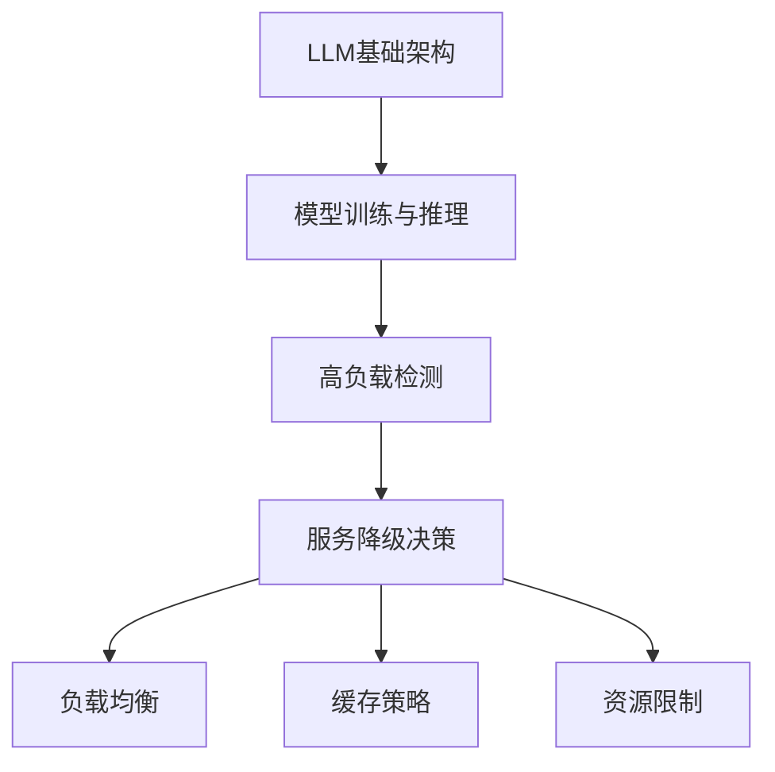

                 

### 文章标题：《服务降级：管理LLM应用在高负载下的行为》

### 关键词：
- 服务降级
- LLM应用
- 高负载
- 性能优化
- 负载均衡
- 缓存策略

### 摘要：
本文旨在探讨如何通过服务降级策略，管理大型语言模型（LLM）在高负载下的行为，确保系统的稳定性和用户体验。文章首先介绍了LLM应用的背景和高负载问题的挑战，然后详细阐述了服务降级的核心概念、策略和实施方法。通过实际案例，文章展示了如何在高负载环境下优化LLM应用的性能，并提供了一些最佳实践和未来展望。

### 引言

#### LLMA应用背景

近年来，随着深度学习和自然语言处理（NLP）技术的飞速发展，大型语言模型（LLM，Large Language Models）已经成为人工智能领域的热点。LLM具有强大的语义理解和生成能力，广泛应用于智能问答、文本生成、机器翻译、情感分析等领域。例如，GPT-3、BERT、T5等模型在多个NLP任务中取得了显著的性能提升，吸引了大量研究者和企业投入其中。

然而，LLM的应用并非没有挑战。一方面，LLM的训练和推理过程需要大量的计算资源和时间，尤其在面对高负载场景时，系统性能的优化成为关键问题。另一方面，随着用户数量的增加和需求的多样化，系统的稳定性和可扩展性也面临严峻考验。为了应对这些挑战，服务降级策略应运而生。

#### 高负载问题的挑战

高负载问题主要表现在以下几个方面：

1. **计算资源不足**：在高负载下，系统的计算资源（如CPU、GPU、内存等）可能无法满足需求，导致响应时间延长、任务延迟甚至系统崩溃。

2. **网络延迟**：用户分布在不同的地理位置，网络延迟可能导致用户感知到的系统性能下降。

3. **数据一致性**：在高并发场景下，数据一致性问题可能变得更加突出，影响系统的可靠性和用户体验。

4. **安全风险**：高负载环境下，系统可能更容易受到恶意攻击，如拒绝服务攻击（DDoS）等。

#### 本书的目标与结构

本文的目标是深入探讨如何通过服务降级策略，管理LLM应用在高负载下的行为。文章将从以下几个方面展开：

1. **LLM基础**：介绍LLM的基本概念、核心算法和数学模型。
2. **服务降级策略**：详细阐述服务降级的目标、核心策略和实际应用案例。
3. **性能优化**：讨论在高负载下优化LLM应用性能的方法和技术。
4. **案例研究**：通过实际案例，展示服务降级策略在LLM应用中的效果。
5. **挑战与展望**：分析当前面临的挑战和未来发展的趋势。

### 核心概念与联系

在本节中，我们将介绍服务降级的核心概念，并通过Mermaid流程图展示LLM基础架构与高负载服务策略之间的联系。

#### 服务降级的核心概念

1. **服务降级定义**：服务降级是指在高负载情况下，通过降低系统某些功能的性能或可用性，来保证关键功能的正常运行和用户体验。

2. **服务降级目标**：服务降级的主要目标是确保系统的稳定性，同时尽可能地减少用户感知到的性能下降。

3. **服务降级策略**：服务降级策略包括负载均衡、缓存策略、资源限制等。

#### Mermaid流程图

下面是一个Mermaid流程图，展示了LLM基础架构与高负载服务策略之间的联系。

在这个流程图中，LLM基础架构包括模型训练和推理两个主要环节。当系统检测到高负载时，会触发服务降级决策。服务降级决策会根据系统状态和用户需求，选择适当的策略，如负载均衡、缓存策略或资源限制，以降低系统负载，保证关键功能的正常运行。

### LLMA基础

#### 1.1 LLM基本概念

1. **语言模型的定义**：语言模型是一种用于预测文本序列的概率分布模型，其目的是通过对大量文本数据的学习，生成或理解人类语言。

2. **语言模型的工作原理**：语言模型通过分析文本数据中的统计规律，学习文本序列的概率分布。在生成文本时，模型会根据前文预测下一个单词或字符的概率，从而生成完整的文本序列。

#### 1.2 LLM核心算法

1. **递归神经网络（RNN）**：RNN是一种能够处理序列数据的神经网络，通过循环结构将当前状态与历史信息结合起来，进行文本序列预测。

2. **长短期记忆网络（LSTM）**：LSTM是RNN的一种变体，通过引入门控机制，有效地解决了RNN在处理长序列数据时出现的梯度消失问题。

3. **Transformer模型**：Transformer是一种基于自注意力机制的序列模型，通过全局 attent

