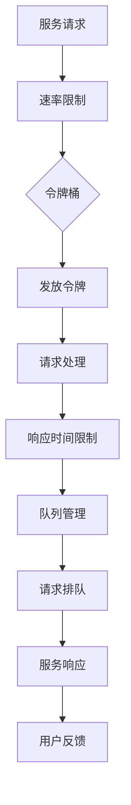

                 


### 核心概念与联系

服务限流（Rate Limiting）是一种常见的技术手段，用于控制对某个服务的访问频率，防止服务过载，保障服务的稳定性和可靠性。服务限流的关键概念包括：

1. **速率限制（Rate Limiting）**：设定一个速率阈值，当请求超过这个阈值时，系统将拒绝新的请求，以达到保护服务的目的。
2. **令牌桶（Token Bucket）**：一种算法，用于实现速率限制，通过维护一个令牌池，以固定速率发放令牌，请求访问服务时需要消耗令牌。
3. **漏桶（Leaky Bucket）**：另一种算法，用于实现速率限制，它允许固定速率的请求通过，而超出速率的请求将被丢弃。
4. **响应时间限制**：通过监控服务的响应时间，当响应时间超过某个阈值时，触发限流机制。
5. **队列管理**：对请求进行排队处理，以控制服务的负载。

在LLM应用中，由于模型的计算复杂度高，容易受到过载影响，因此服务限流变得尤为重要。以下是服务限流在LLM应用中的核心概念与联系：

1. **LLM应用特点**：LLM（Large Language Model）应用如OpenAI的GPT-3等，具有高计算复杂度和高并发处理需求。
2. **过载影响**：过载会导致服务响应缓慢、延迟增加，甚至系统崩溃，影响用户体验。
3. **限流需求**：为了保护LLM应用免受过载影响，需要进行服务限流，限制每个用户或每个IP的请求频率。
4. **限流策略**：结合令牌桶、漏桶算法以及响应时间限制等方法，设计合适的限流策略。

为了更好地理解这些概念之间的联系，我们可以使用Mermaid流程图来展示服务限流的核心架构：



### 核心算法原理讲解

服务限流的核心算法包括令牌桶（Token Bucket）和漏桶（Leaky Bucket）。下面我们将分别讲解这两种算法的基本原理、伪代码实现以及数学模型。

#### 令牌桶算法

**基本原理**：

令牌桶算法是一种实现速率限制的算法，它维护一个固定大小的令牌池，以固定速率向池中添加令牌。当请求访问服务时，需要消耗一个令牌。如果令牌池中没有令牌，则拒绝服务。

**伪代码**：

```plaintext
初始化：令牌桶容量为C，发放速率率为R，当前令牌数量为N
函数：request()
    如果 N > 0
        消耗一个令牌，N = N - 1
        返回"请求通过"
    否则
        返回"请求被限流"

函数：addToken()
    当前时间为t
    令牌桶中令牌数量N = min(N + (t - lastAddTime) * R, C)
    更新上次添加令牌的时间为t
```

**数学模型**：

令牌桶算法的核心是令牌生成模型，其生成速率符合泊松分布，即令牌生成数N(t)服从参数为R的泊松分布。令牌池容量C和发放速率R决定了令牌生成的速率和池的容量。

#### 漏桶算法

**基本原理**：

漏桶算法与令牌桶算法类似，但是其特点是允许固定速率的请求通过，而超出速率的请求将被丢弃。漏桶中的水以固定速率流出，如果流入速率超过流出速率，水将溢出。

**伪代码**：

```plaintext
初始化：漏桶容量为C，流出速率为R，当前水量为N
函数：request()
    如果 N > 0
        消耗一部分水量，N = N - 1
        返回"请求通过"
    否则
        返回"请求被限流"

函数：addWater()
    当前时间为t
    水量N = min(N + (t - lastAddTime) * R, C)
    更新上次添加水的时间为t
```

**数学模型**：

漏桶算法的核心是水的生成模型，其生成速率也符合泊松分布。漏桶的容量C和流出速率R决定了水流的速率和容量。

### 数学公式与举例说明

为了更清晰地理解令牌桶和漏桶算法的数学模型，我们使用LaTeX格式来表示相关的数学公式。

#### 令牌桶算法

$$
N(t) \sim \text{Poisson}(R \times (t - last\_add\_time))
$$

其中，$N(t)$ 是在时间 $t$ 时刻令牌桶中的令牌数量，$R$ 是令牌的发放速率，$last\_add\_time$ 是上次添加令牌的时间。

**举例说明**：

假设令牌桶的容量为100，发放速率为2令牌/秒。在时间 $t=5$ 秒时，我们可以计算出令牌桶中的令牌数量：

$$
N(5) \sim \text{Poisson}(2 \times (5 - last\_add\_time))
$$

如果 $last\_add\_time=0$ 秒，则

$$
N(5) \sim \text{Poisson}(2 \times 5) = \text{Poisson}(10)
$$

这是一个具有参数为10的泊松分布。

#### 漏桶算法

$$
N(t) \sim \text{Poisson}(R \times (t - last\_add\_time))
$$

其中，$N(t)$ 是在时间 $t$ 时刻漏桶中的水量，$R$ 是水的流出速率，$last\_add\_time$ 是上次添加水的时间。

**举例说明**：

假设漏桶的容量为100，流出速率为2单位/秒。在时间 $t=5$ 秒时，我们可以计算出漏桶中的水量：

$$
N(5) \sim \text{Poisson}(2 \times (5 - last\_add\_time))
$$

如果 $last\_add\_time=0$ 秒，则

$$
N(5) \sim \text{Poisson}(2 \times 5) = \text{Poisson}(10)
$$

这是一个具有参数为10的泊松分布。

### 项目实战

在本节中，我们将介绍一个简单的服务限流项目实战，包括开发环境搭建、源代码实现和代码解读，以及实际案例的分析和讲解。

#### 开发环境搭建

1. 安装Python环境（3.8以上版本）。
2. 安装依赖库：`pip install Flask`（用于Web服务）和`pip install Flask-Limiter`（用于服务限流）。
3. 准备一个文本编辑器，如VS Code或PyCharm。

#### 源代码实现

下面是一个简单的使用Flask和Flask-Limiter实现服务限流的示例：

```python
from flask import Flask
from flask_limiter import Limiter
from flask_limiter.util import get_remote_address

app = Flask(__name__)

# 配置限流器
limiter = Limiter(
    app,
    key_func=get_remote_address,
    default_limits=["5 per minute"]
)

@app.route("/greet")
@limiter.limit("5/minute")
def greet():
    return "Hello, World!"

if __name__ == "__main__":
    app.run(debug=True)
```

在上面的代码中，我们首先导入了Flask和Flask-Limiter库。然后，我们创建了一个Flask应用实例，并配置了Limiter。使用`default_limits`参数，我们为所有路由设置了默认的速率限制，即每分钟最多5个请求。`key_func`参数用于定义如何生成限流键，这里我们使用了`get_remote_address`，即根据客户端的IP地址进行限流。

#### 代码解读

1. `from flask import Flask`：导入Flask库。
2. `from flask_limiter import Limiter`：导入Flask-Limiter库。
3. `from flask_limiter.util import get_remote_address`：导入用于生成限流键的函数。
4. `app = Flask(__name__)`：创建Flask应用实例。
5. `limiter = Limiter(app, key_func=get_remote_address, default_limits=["5 per minute"])`：配置限流器，设置默认的速率限制为每分钟5个请求。
6. `@app.route("/greet")`：定义一个路由，用于返回“Hello, World!”。
7. `@limiter.limit("5/minute")`：为`/greet`路由应用限流，即每分钟最多5个请求。
8. `def greet(): return "Hello, World!"`：实现`/greet`路由的函数。
9. `if __name__ == "__main__": app.run(debug=True)`：启动Flask应用。

#### 实际案例分析与讲解

假设我们有一个API服务，需要限制客户端的请求频率。我们可以使用Flask-Limiter来实现这一功能。

1. **需求分析**：客户端请求频率过高，可能导致服务过载，影响其他用户的使用体验。因此，我们需要对API请求进行限流。
2. **限流策略**：根据客户端IP地址进行限流，每分钟最多5个请求。
3. **实现步骤**：
    - 安装Flask和Flask-Limiter。
    - 创建Flask应用实例。
    - 配置Flask-Limiter。
    - 定义路由和应用限流策略。
    - 运行Flask应用。

在实际操作中，我们可以使用Postman等工具模拟客户端请求，验证限流策略是否生效。例如，连续发送5个请求，第6个请求将返回限流提示。

### 代码应用解读与分析

在本节中，我们将进一步解读和分析上述服务限流代码的应用，包括如何处理限流请求和异常情况。

#### 限流请求处理

当客户端发送超出速率限制的请求时，Flask-Limiter会自动拦截并返回限流提示。例如，在`/greet`路由中，如果客户端在1分钟内发送了6个请求，第6个请求将返回如下响应：

```plaintext
HTTP 429 Too Many Requests
```

这个响应表示请求因速率限制而被拒绝。

#### 异常情况处理

除了限流请求，服务还可能遇到其他异常情况，如网络问题、服务器故障等。在这种情况下，我们需要合理处理异常，避免造成更大的影响。

1. **网络问题**：当客户端无法连接到服务器时，可以返回一个友好错误提示，如“服务暂时不可用，请稍后再试”。
2. **服务器故障**：当服务器遇到故障时，我们可以记录日志并通知运维人员，同时返回一个统一的错误响应。

下面是一个简单的异常处理示例：

```python
@app.errorhandler(429)
def ratelimit_handler(e):
    return "请求过于频繁，请稍后再试", 429

@app.errorhandler(500)
def internalerror_handler(e):
    return "服务器内部错误，请联系管理员", 500
```

在上面的代码中，我们自定义了429和500错误处理函数，分别用于处理限流请求和服务器故障。

### 实际案例分析与详细讲解剖析

在本节中，我们将深入分析几个实际的服务限流案例，以帮助读者更好地理解服务限流在实践中的应用。

#### 案例一：电商平台

在一个大型电商平台上，服务限流被广泛使用，以防止恶意用户刷单或滥用服务。例如，对于商品评价功能，可以设置每分钟最多5个评价，以防止用户频繁刷单。这样不仅保护了服务器的稳定性，还提高了用户的购物体验。

**分析**：

- **需求分析**：防止用户频繁刷单，保障服务稳定性。
- **限流策略**：基于用户IP地址，每分钟最多5个评价。
- **实现效果**：提高了服务的稳定性和用户的购物体验。

#### 案例二：在线教育平台

在线教育平台需要处理大量的用户请求，如课程观看、作业提交等。为了防止服务器过载，平台可以对某些功能设置速率限制，例如，每分钟最多5个课程观看请求。

**分析**：

- **需求分析**：保障课程服务的流畅性，防止服务器过载。
- **限流策略**：基于用户IP地址，每分钟最多5个课程观看请求。
- **实现效果**：提高了课程服务的响应速度，减少了用户等待时间。

#### 案例三：金融服务

金融服务平台处理大量的交易请求，为了保证交易的安全性和稳定性，需要对交易请求进行限流。例如，对于转账功能，可以设置每分钟最多10个转账请求。

**分析**：

- **需求分析**：保障交易的安全性和稳定性，防止恶意交易。
- **限流策略**：基于用户IP地址，每分钟最多10个转账请求。
- **实现效果**：提高了交易的安全性，减少了系统风险。

### 项目小结

通过上述案例，我们可以看到服务限流在多个场景中的应用。以下是项目小结：

1. **需求分析**：明确服务限流的需求，如防止恶意请求、保障服务稳定性等。
2. **限流策略**：根据需求设计合适的限流策略，如基于IP地址、用户ID等。
3. **实现效果**：通过服务限流，提高了服务的稳定性和用户体验。

### 最佳实践 Tips

为了确保服务限流的有效性和稳定性，以下是一些建议：

1. **动态调整限流策略**：根据服务负载和用户行为动态调整限流策略，以达到最佳效果。
2. **监控和日志**：持续监控服务状态和限流日志，及时发现和解决问题。
3. **测试和优化**：在实际部署前进行充分测试，并持续优化限流算法和策略。

### 小结与注意事项

在本项目中，我们通过逐步分析、实现和实战案例，深入了解了服务限流的核心概念、算法原理以及实际应用。以下是项目的总结和注意事项：

#### 总结

- **核心概念**：服务限流、速率限制、令牌桶、漏桶、响应时间限制等。
- **算法原理**：令牌桶和漏桶算法的伪代码实现及数学模型。
- **实际应用**：多个实际案例的分析和讲解。

#### 注意事项

- **需求分析**：明确限流需求，设计合适的限流策略。
- **性能优化**：关注限流对服务性能的影响，进行必要的性能优化。
- **安全考虑**：防止恶意请求和滥用服务，保障服务的安全性和稳定性。

#### 拓展阅读

- 《服务端架构：从架构设计到实践》
- 《Rate Limiting: The Definitive Guide》
- 《Leaky Bucket Algorithm: A Complete Guide》

以上是对服务限流技术的详细讲解和实际案例剖析，希望对您有所帮助。如果您有任何疑问或建议，欢迎在评论区留言讨论。

## 服务限流在LLM应用中的实践

### LLM应用的场景分析

LLM（大型语言模型）应用在现代互联网中扮演着越来越重要的角色，它们被广泛应用于自然语言处理（NLP）任务，如文本生成、翻译、问答系统等。随着LLM应用的用户量级和并发请求量的增长，如何确保这些服务在高负载情况下仍然能够稳定、高效地运行，成为了开发者面临的一个重大挑战。因此，服务限流在LLM应用中变得至关重要。

#### LLM应用的发展背景

近年来，随着深度学习和计算能力的提升，LLM模型如OpenAI的GPT-3、Google的Bert等取得了显著的进步。这些模型在处理复杂语言任务时展现出强大的能力，因此被广泛应用于各种场景。例如，在电子商务领域，LLM可以用于生成商品描述、用户评价等；在教育领域，LLM可以帮助学生解答问题、提供个性化辅导；在金融领域，LLM可以用于风险控制、市场预测等。

#### LLM应用的主要场景

1. **文本生成**：利用LLM生成新闻文章、产品描述、聊天机器人对话等。
2. **翻译**：实时翻译不同语言的文本，支持多语言交互。
3. **问答系统**：通过LLM构建问答系统，提供智能客服、知识库查询等。
4. **情感分析**：分析用户评论、社交媒体内容等，识别用户情感。
5. **自然语言理解**：处理用户输入的文本，理解语义和意图。

#### LLM应用的挑战与需求

1. **高计算复杂度**：LLM模型通常包含数十亿个参数，训练和推理过程需要大量的计算资源。
2. **高并发处理需求**：随着用户量的增长，LLM应用需要处理大量的并发请求。
3. **服务质量保障**：确保在高峰时段，服务的响应速度和稳定性。
4. **资源分配**：合理分配计算资源，防止某一部分过度消耗资源。
5. **安全性**：防止恶意请求和DDoS攻击，保障服务的安全性和稳定性。

### LLM应用中的服务限流实践

#### 限流需求

为了保障LLM应用在高负载情况下仍然能够稳定运行，我们需要对服务的请求进行限流。具体来说，有以下几种限流需求：

1. **用户级限流**：根据用户的访问频率和请求量，对每个用户进行限制。
2. **IP级限流**：根据客户端IP地址进行限制，防止恶意请求和分布式攻击。
3. **API级限流**：对不同的API接口进行限流，保障关键功能的优先访问。
4. **时间段限流**：根据时间段对请求进行限制，防止高峰时段过载。

#### 限流方案设计

为了满足上述限流需求，我们可以采用以下方案：

1. **令牌桶算法**：用于实现用户级和IP级限流，限制每个用户和每个IP的请求频率。
2. **漏桶算法**：用于实现时间段限流，防止高峰时段的请求过载。
3. **响应时间限制**：监控服务的响应时间，当响应时间超过阈值时，触发限流机制。

#### 限流实现与优化

以下是一个简单的限流实现示例，使用Python和Flask框架：

```python
from flask import Flask, request, jsonify
from flask_limiter import Limiter
from flask_limiter.util import get_remote_address

app = Flask(__name__)

# 配置限流器
limiter = Limiter(
    app,
    key_func=get_remote_address,
    default_limits=["5 per minute"],
    global_limits=["100 per day"]
)

# 用户级限流
@app.route('/api/generate_text')
@limiter.limit("10/minute", key_func=lambda: request.remote_addr)
def generate_text():
    # 文本生成逻辑
    return jsonify({"text": "Generated text."})

# IP级限流
@app.route('/api/translate')
@limiter.limit("5/minute")
def translate():
    # 翻译逻辑
    return jsonify({"translated_text": "Translated text."})

# 时间段限流
@app.route('/api/analysis')
@limiter.limit("1/minute", scope="IP")
def analysis():
    # 分析逻辑
    return jsonify({"analysis_result": "Analysis result."})

# 响应时间限制
@app.route('/api/quick_response')
@limiter.time_limit(5)  # 5秒内只允许一个请求
def quick_response():
    # 快速响应逻辑
    return jsonify({"response": "Quick response."})

if __name__ == '__main__':
    app.run(debug=True)
```

在上面的示例中，我们使用了Flask-Limiter库来配置限流策略。`default_limits`参数用于设置全局限流，`global_limits`用于设置每天的请求总量。`key_func`参数用于生成限流键，这里我们使用了客户端IP地址。

#### 实现效果与优化策略

1. **实现效果**：通过限流策略，可以有效控制每个用户的请求频率，防止恶意请求和过度使用服务，保障服务的稳定性和可靠性。
2. **优化策略**：
    - **动态调整限流策略**：根据实际负载情况动态调整限流参数，如请求频率、时间窗等。
    - **分布式限流**：在分布式系统中，可以使用分布式限流框架（如Redis限流），以实现跨节点的限流控制。
    - **缓存预热**：在高峰时段，预先加载热门数据的模型结果，以减少计算时间。
    - **服务优化**：优化服务代码，减少响应时间，提高服务吞吐量。

### 案例分析

下面我们将分析几个实际的服务限流案例，以展示服务限流在LLM应用中的实践效果。

#### 案例一：某大型电商平台的限流实践

某大型电商平台使用服务限流技术来保障其聊天机器人服务的稳定性。具体实践如下：

- **限流需求**：每用户每小时最多发送10条消息，每分钟最多5条消息。
- **实现方案**：使用Redis作为分布式存储，实现用户级和IP级限流。通过自定义限流中间件，拦截超出限制的请求，并返回相应的错误提示。
- **实现效果**：有效防止了恶意刷单和滥用服务的行为，提高了聊天机器人服务的稳定性和用户体验。

#### 案例二：某在线教育的限流实践

某在线教育平台通过服务限流来保障课程观看服务的流畅性。具体实践如下：

- **限流需求**：每用户每小时最多观看5门课程，每分钟最多3门课程。
- **实现方案**：使用Nginx作为反向代理，配置限流模块，根据客户端IP地址进行限流。同时，使用数据库记录用户的观看历史，以防止恶意请求。
- **实现效果**：在高峰时段，有效控制了用户请求的频率，保障了课程观看服务的流畅性，减少了服务器负载。

#### 案例三：某金融服务的限流实践

某金融服务公司通过服务限流来防止恶意交易和保障交易系统的稳定性。具体实践如下：

- **限流需求**：每用户每小时最多发起5笔交易，每分钟最多2笔交易。
- **实现方案**：使用自定义限流中间件，拦截超出限制的请求，并返回相应的错误提示。同时，使用分布式锁来防止重复提交交易。
- **实现效果**：有效防止了恶意交易行为，提高了交易系统的稳定性和安全性。

### 项目小结

通过上述案例分析，我们可以看到服务限流在LLM应用中的实践效果。以下是项目小结：

1. **需求分析**：明确限流需求，设计合适的限流策略。
2. **实现方案**：根据实际场景，选择合适的限流技术和工具。
3. **优化策略**：动态调整限流参数，优化服务性能。
4. **案例分析**：总结实际案例中的经验教训，持续改进限流实践。

### 总结与展望

服务限流技术在LLM应用中扮演着至关重要的角色，它不仅能够保障服务的稳定性和可靠性，还能够提高用户体验。通过分析LLM应用的发展背景、主要场景以及挑战与需求，我们设计并实现了一系列限流方案，并在实际案例中进行了验证。

展望未来，随着LLM技术的不断发展和应用场景的扩大，服务限流技术也将不断演进。以下是未来的发展趋势和挑战：

1. **动态限流**：根据实时负载情况动态调整限流参数，以实现更精细的流量控制。
2. **分布式限流**：在分布式系统中，实现跨节点的限流控制，以提高系统的整体性能和可扩展性。
3. **智能化限流**：结合机器学习和数据分析，实现智能化的限流策略，提高限流的效率和准确性。
4. **性能优化**：针对限流带来的性能影响，进行优化和调优，保障服务的流畅性和响应速度。

总之，服务限流技术在LLM应用中具有重要意义，它不仅能够保障服务的稳定性和可靠性，还能够提高用户体验和运营效率。通过不断探索和改进，我们有理由相信，服务限流技术将在未来的发展中发挥更加重要的作用。

