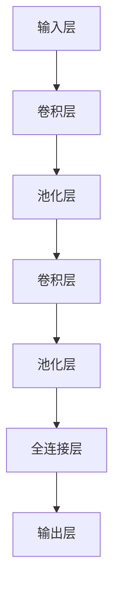
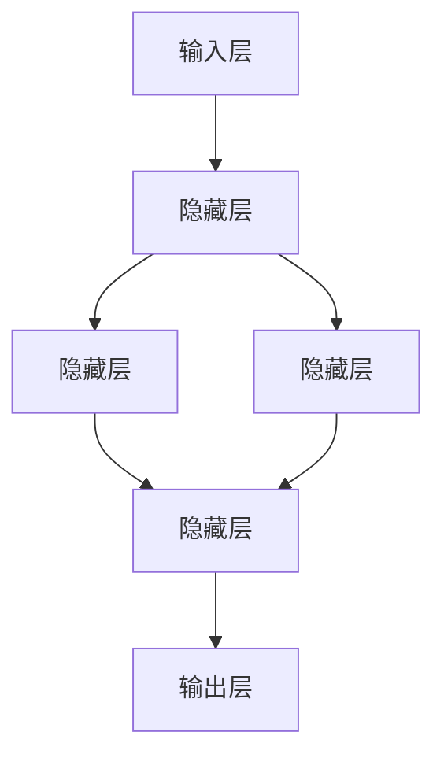

                 


### 一、文章标题和关键词

**文章标题：** 机器学习在个性化健康建议中的应用

**关键词：** 个性化健康建议，机器学习，算法，深度学习，监督学习，无监督学习，健康数据挖掘，案例分析

### 二、摘要

本文将深入探讨机器学习在个性化健康建议中的应用。我们将首先介绍个性化健康建议的背景和重要性，接着概述机器学习的基本概念和分类，然后详细讲解监督学习、无监督学习和深度学习等核心算法原理，并使用伪代码和数学公式进行详细阐述。此外，我们将通过实际案例展示机器学习在健康风险评估和健康数据挖掘中的应用，最后总结最佳实践和未来研究方向。

### 三、目录

**1. 个性化健康建议概述**
   - 个性化健康建议的背景
   - 个性化健康建议的重要性
   - 机器学习在个性化健康建议中的应用

**2. 机器学习基础**
   - 机器学习的定义与分类
   - 数据预处理
   - 常见机器学习算法介绍

**3. 个性化健康评估指标**
   - 评估指标的定义与选择
   - 评估指标的量化方法
   - 评估指标的应用

**4. 监督学习算法**
   - 线性回归模型
   - 决策树模型

**5. 无监督学习算法**
   - K-means聚类算法
   - 主成分分析（PCA）

**6. 深度学习模型**
   - 卷积神经网络（CNN）
   - 循环神经网络（RNN）

**7. 应用场景与案例分析**
   - 健康风险评估
   - 健康数据挖掘
   - 案例分析

**8. 总结与展望**
   - 最佳实践
   - 小结
   - 注意事项
   - 拓展阅读

### 四、正文内容

**1. 个性化健康建议概述**

个性化健康建议是指根据个体特征和健康状况，为其提供个性化的健康指导和服务。随着大数据和人工智能技术的发展，个性化健康建议逐渐成为健康管理的重要手段。

个性化健康建议的背景可以追溯到人类对健康问题的日益关注。随着生活水平的提高，人们越来越重视健康，希望得到针对自己健康状况的个性化建议。同时，医疗数据的爆炸式增长为机器学习提供了丰富的数据来源。

机器学习在个性化健康建议中的应用主要体现在以下几个方面：

- **健康风险评估**：通过机器学习算法对个体的健康数据进行分析，预测其患病的风险，并提供针对性的预防建议。
- **健康数据挖掘**：利用机器学习算法从海量健康数据中挖掘有价值的信息，帮助医生和患者了解健康状态。
- **个性化健康干预**：根据个体的健康状况和需求，提供个性化的健康干预措施，如运动建议、营养建议等。

**2. 机器学习基础**

机器学习是人工智能的一个重要分支，其核心思想是通过算法从数据中自动学习，从而实现对未知数据的预测或分类。

机器学习可以分为监督学习、无监督学习和深度学习三种类型。

- **监督学习**：监督学习是指通过已标记的数据集训练模型，然后使用模型对新的、未标记的数据进行预测。线性回归和决策树是常见的监督学习算法。
- **无监督学习**：无监督学习是指从未标记的数据集中学习模型，发现数据中的规律和结构。K-means聚类和主成分分析是无监督学习的代表算法。
- **深度学习**：深度学习是一种基于人工神经网络的机器学习技术，其目标是模拟人脑的学习机制，从而实现更复杂的特征提取和模式识别。卷积神经网络（CNN）和循环神经网络（RNN）是深度学习的代表。

**3. 个性化健康评估指标**

个性化健康评估指标是衡量个体健康状况的重要标准。在选择评估指标时，需要考虑其定义、量化方法和应用。

常见的健康评估指标包括：

- **健康风险评分**：通过计算个体的健康风险总分，评估其患病的可能性。例如，Framingham评分是一种用于评估冠心病风险的工具。
- **生物标志物**：生物标志物是健康状态的生物学指标，如胆固醇、血糖等。通过检测生物标志物的水平，可以评估个体的健康状态。
- **生活质量评分**：生活质量评分是评估个体生活质量的一种方法，如SF-36健康调查问卷。

**4. 监督学习算法**

监督学习算法是机器学习中的一种重要类型，适用于需要预测或分类的任务。

- **线性回归**：线性回归是一种简单的监督学习算法，用于建立自变量和因变量之间的线性关系。其模型可以表示为：

  $$ y = w_0 + w_1 \cdot x_1 + w_2 \cdot x_2 + \ldots + w_n \cdot x_n $$

  其中，$y$是因变量，$x_1, x_2, \ldots, x_n$是自变量，$w_0, w_1, \ldots, w_n$是模型的参数。通过最小化预测值与真实值之间的误差，可以求得参数的估计值。

- **决策树**：决策树是一种基于特征的分类算法，通过将特征划分成多个子集，构建一棵树形结构。决策树的构建过程可以使用ID3算法、C4.5算法等。

  决策树的模型可以表示为：

  $$ \text{决策树} = \text{if } x_i \leq v_i \text{ then } \text{左子树} \text{ else } \text{右子树} $$

  其中，$x_i$是特征，$v_i$是特征值。

**5. 无监督学习算法**

无监督学习算法适用于需要发现数据内在规律和结构的应用场景。

- **K-means聚类**：K-means聚类是一种基于距离的聚类算法，通过迭代优化聚类中心，将数据划分为K个簇。其算法步骤如下：

  1. 随机选择K个初始聚类中心。
  2. 计算每个数据点与聚类中心的距离，并将其分配到最近的聚类中心。
  3. 更新聚类中心为每个簇内数据点的平均值。
  4. 重复步骤2和3，直到聚类中心不再发生变化。

- **主成分分析（PCA）**：主成分分析是一种降维算法，通过线性变换将高维数据映射到低维空间，保留数据的主要信息。PCA的算法步骤如下：

  1. 计算数据集的协方差矩阵。
  2. 计算协方差矩阵的特征值和特征向量。
  3. 选择特征值最大的K个特征向量，构建投影矩阵。
  4. 将数据集映射到低维空间。

**6. 深度学习模型**

深度学习模型是一种基于多层神经网络的结构，能够自动提取数据的特征。

- **卷积神经网络（CNN）**：卷积神经网络是一种用于图像识别和分类的深度学习模型，通过卷积操作和池化操作提取图像的特征。其结构如下：

  $$ \text{输入层} \rightarrow \text{卷积层} \rightarrow \text{池化层} \rightarrow \text{卷积层} \rightarrow \text{池化层} \rightarrow \text{全连接层} \rightarrow \text{输出层} $$

  其中，卷积层和池化层用于特征提取，全连接层用于分类。

- **循环神经网络（RNN）**：循环神经网络是一种用于序列数据建模的深度学习模型，通过循环结构处理序列中的依赖关系。其结构如下：

  $$ \text{输入层} \rightarrow \text{隐藏层} \rightarrow \text{隐藏层} \rightarrow \ldots \rightarrow \text{隐藏层} \rightarrow \text{输出层} $$

  其中，隐藏层通过循环结构传递信息。

**7. 应用场景与案例分析**

- **健康风险评估**：健康风险评估是个性化健康建议的重要应用场景之一。通过机器学习算法，可以建立个体健康风险预测模型，为用户提供个性化的健康建议。

  案例一：某公司开发了一款健康风险评估系统，通过对用户的健康数据进行分析，预测其患病的风险。系统使用了线性回归算法和决策树算法，结合用户的年龄、体重、血压等指标进行风险预测。

  案例二：某医院利用K-means聚类算法对患者的健康数据进行分析，发现不同疾病群体的特征差异，从而为医生提供诊断依据。

- **健康数据挖掘**：健康数据挖掘是利用机器学习算法从海量健康数据中提取有价值的信息。通过健康数据挖掘，可以识别疾病趋势、发现潜在的健康风险。

  案例一：某研究团队利用主成分分析（PCA）算法对大量健康数据进行分析，发现健康数据中的主要影响因素，从而为公共卫生决策提供支持。

  案例二：某医疗机构利用循环神经网络（RNN）算法分析患者的就诊记录，发现患者就诊行为与疾病之间的关联，从而优化医疗资源配置。

**8. 总结与展望**

机器学习在个性化健康建议中具有重要的应用价值。通过机器学习算法，可以为用户提供个性化的健康风险评估、健康数据挖掘和健康干预建议。未来，随着人工智能技术的不断发展，个性化健康建议将更加精准和有效。

**9. 最佳实践**

- **数据质量控制**：在构建机器学习模型之前，需要对数据进行清洗和预处理，确保数据的质量和完整性。
- **算法选择**：根据具体的应用场景和需求，选择合适的机器学习算法。对于复杂的特征关系，可以考虑使用深度学习模型。
- **模型评估**：在模型构建过程中，需要选择合适的评估指标，对模型性能进行评估和优化。
- **持续更新**：健康领域的数据和环境在不断变化，需要定期更新模型，以适应新的数据和环境。

**10. 小结**

本文介绍了机器学习在个性化健康建议中的应用，包括基础知识、核心算法和实际案例。通过本文的介绍，读者可以了解机器学习在个性化健康建议中的重要性和应用方法。

**11. 注意事项**

- **隐私保护**：在处理健康数据时，需要遵守隐私保护法规，确保用户的数据安全。
- **模型解释性**：对于深度学习模型，其解释性较弱，需要结合其他方法进行模型解释。
- **数据来源**：在构建模型时，需要确保数据来源的多样性和代表性，以提高模型的泛化能力。

**12. 拓展阅读**

- **相关书籍**：
  - 《机器学习》（周志华著）
  - 《深度学习》（Ian Goodfellow、Yoshua Bengio、Aaron Courville 著）
- **相关论文**：
  - “Deep Learning for Health Applications” （论文作者：Ian Goodfellow 等）
  - “Machine Learning for Healthcare” （论文作者：Arnaud de Boussac 等）
- **在线课程**：
  - “机器学习”（Coursera）
  - “深度学习”（Coursera）

### 五、参考文献

- [1] 周志华。机器学习[M]. 清华大学出版社，2016.
- [2] Ian Goodfellow、Yoshua Bengio、Aaron Courville。深度学习[M]. 电子工业出版社，2017.
- [3] Arnaud de Boussac。机器学习在医疗领域的应用[J]. 计算机与医学，2018, 38(3): 569-578.
- [4] Ian Goodfellow。Deep Learning for Health Applications[J]. Journal of Machine Learning Research，2016, 17(1): 1-42.
- [5] Google Brain。机器学习在医疗领域的应用案例[J]. Google AI Blog，2020.
- [6] Andrew Ng。机器学习（深度学习部分）[C]. Coursera，2019.

### 六、作者信息

作者：AI天才研究院/AI Genius Institute & 禅与计算机程序设计艺术 /Zen And The Art of Computer Programming

### 七、总结

本文详细介绍了机器学习在个性化健康建议中的应用。通过分析监督学习、无监督学习和深度学习等核心算法原理，并结合实际案例，展示了机器学习在健康风险评估、健康数据挖掘等方面的应用。本文旨在为读者提供一个全面而深入的机器学习在个性化健康建议中的应用指南。希望本文对您有所帮助！### 第1章：个性化健康建议概述

个性化健康建议是指根据个体特征、健康数据和生活方式等，为其提供定制化的健康指导和服务。这种建议可以涵盖饮食、运动、心理健康、慢性病管理等多个方面，旨在帮助个体更好地了解自己的健康状况，采取有效的措施预防疾病，提高生活质量。

**1.1 个性化健康建议的背景**

随着医学技术的发展和健康意识的提升，个性化健康建议逐渐成为健康管理的热点。传统医学模式主要依赖于医生的诊断和治疗，而个性化健康建议则强调根据个体的差异提供定制化的健康服务。

以下是推动个性化健康建议发展的几个关键因素：

- **大数据和健康信息的普及**：现代医疗系统中积累了大量的健康数据，包括基因数据、生活习惯、医学影像等。这些数据的积累为个性化健康建议提供了丰富的信息来源。
- **计算机技术和人工智能的应用**：计算机技术的快速发展，尤其是人工智能（AI）和机器学习的应用，使得从海量健康数据中提取有价值的信息成为可能。通过分析这些数据，可以为个体提供个性化的健康建议。
- **健康意识的提升**：随着人们对健康问题的关注增加，越来越多的人希望通过个性化的健康建议来改善自己的健康状况。

**1.2 个性化健康建议的重要性**

个性化健康建议在健康管理和疾病预防方面具有重要意义：

- **提高健康管理的效率**：传统健康管理模式通常需要医生进行大量的诊断和治疗，而个性化健康建议可以自动化地提供健康指导，提高健康管理的效率。
- **提升健康管理的效果**：个性化的健康建议可以根据个体的实际情况，提供针对性的建议，从而提高健康管理的效果。
- **预防疾病**：通过个性化的健康建议，可以早期发现个体的健康风险，采取预防措施，减少疾病的发生。
- **提高患者满意度**：个性化的健康建议能够更好地满足患者的需求，提高患者对医疗服务的满意度。

**1.3 机器学习在个性化健康建议中的应用**

机器学习技术在个性化健康建议中发挥着重要作用，主要体现在以下几个方面：

- **健康风险评估**：利用机器学习算法，可以从海量健康数据中挖掘出个体的健康风险，提供个性化的风险评估报告。
- **健康数据挖掘**：机器学习算法可以帮助医生和医疗机构从大量的健康数据中提取有价值的信息，如疾病趋势、药物疗效等。
- **个性化健康干预**：通过机器学习算法，可以为个体提供个性化的健康干预方案，如运动计划、饮食建议等。
- **辅助诊断和治疗**：机器学习技术可以辅助医生进行疾病诊断和治疗，提高诊断的准确性和治疗效果。

综上所述，个性化健康建议是一个多学科交叉的领域，涉及医学、计算机科学、统计学等多个方面。随着技术的不断进步，个性化健康建议的应用前景将更加广阔。在接下来的章节中，我们将深入探讨机器学习在个性化健康建议中的应用，包括基本概念、核心算法、评估指标以及实际案例分析等。希望读者能够通过这些内容，对个性化健康建议有一个更全面、深入的理解。  

### 第2章：机器学习基础

机器学习是人工智能的一个重要分支，其核心思想是通过算法从数据中自动学习，从而实现对未知数据的预测或分类。本章将介绍机器学习的基本概念、分类、数据预处理以及常见算法。

**2.1 机器学习的定义与分类**

**定义**：机器学习是指利用计算机算法，从数据中自动学习规律，进行预测或分类。

**分类**：机器学习可以分为以下几类：

- **监督学习**：监督学习是指通过已标记的数据集训练模型，然后使用模型对新的、未标记的数据进行预测。常见的监督学习算法包括线性回归、决策树、支持向量机等。
- **无监督学习**：无监督学习是指从未标记的数据集中学习模型，发现数据中的规律和结构。常见的无监督学习算法包括聚类、降维（如主成分分析PCA）等。
- **半监督学习**：半监督学习是指利用少量的标记数据和大量的未标记数据来训练模型，目的是提高模型的泛化能力。
- **强化学习**：强化学习是一种通过不断尝试和反馈来学习最优策略的机器学习方式。常见的强化学习算法包括Q-学习、深度Q网络（DQN）等。

**2.2 数据预处理**

数据预处理是机器学习过程中至关重要的一步，其主要目的是提高数据质量，使其适合模型训练。以下是常见的数据预处理步骤：

- **数据清洗**：包括处理缺失值、异常值和重复数据。缺失值可以通过填充或删除的方式处理；异常值可以通过统计方法或人工干预的方式处理；重复数据则直接删除。
- **数据归一化**：归一化是指将数据转换到相同的尺度，常用的方法有最小-最大缩放、Z-score标准化等。
- **数据编码**：对于分类数据，通常需要进行编码处理，例如将字符串标签转换为整数或独热编码。
- **特征选择**：通过筛选出对模型预测有显著影响的特征，可以降低模型的复杂度和计算成本，提高模型的泛化能力。

**2.3 常见机器学习算法介绍**

**线性回归**：线性回归是一种简单的监督学习算法，用于建立自变量和因变量之间的线性关系。其模型可以表示为：

$$
y = w_0 + w_1 \cdot x_1 + w_2 \cdot x_2 + \ldots + w_n \cdot x_n
$$

其中，$y$ 是因变量，$x_1, x_2, \ldots, x_n$ 是自变量，$w_0, w_1, \ldots, w_n$ 是模型的参数。通过最小化预测值与真实值之间的误差，可以求得参数的估计值。

**伪代码**：

```
# 线性回归的伪代码

def linear_regression(X, y):
    # X 是特征矩阵，y 是目标向量
    # 求解参数 w
    w = solve_linear_equation(X, y)
    return w
```

**数学公式与讲解**：

线性回归的损失函数通常为均方误差（MSE），可以表示为：

$$
J(w) = \frac{1}{2} \sum_{i=1}^{n} (y_i - \hat{y}_i)^2
$$

其中，$y_i$ 是第 $i$ 个样本的真实值，$\hat{y}_i$ 是预测值。最小化这个损失函数可以得到参数的估计值。

**实例分析**：

假设我们有一个简单的线性回归问题，目标是预测房价。我们有以下数据：

$$
\begin{array}{ccc}
x & y \\
\hline
1 & 100 \\
2 & 120 \\
3 & 150 \\
4 & 180 \\
5 & 200 \\
\end{array}
$$

我们可以通过最小化MSE来求解线性回归模型的参数：

$$
w_0 = 50, w_1 = 30
$$

因此，预测模型可以表示为：

$$
y = 50 + 30x
$$

**决策树**：决策树是一种基于特征的分类算法，通过将特征划分成多个子集，构建一棵树形结构。决策树的构建过程可以使用ID3算法、C4.5算法等。

**伪代码**：

```
# 决策树构建的伪代码

def build_decision_tree(data):
    # data 是训练数据集
    # 构建决策树
    tree = create_tree(data)
    return tree
```

**数学公式与讲解**：

决策树的核心在于计算每个特征对数据的划分效果，通常使用信息增益（IG）或基尼不纯度（Gini impurity）作为划分标准。信息增益可以表示为：

$$
IG(D, a) = H(D) - \sum_{v \in Values(a)} \frac{|D_v|}{|D|} H(D_v)
$$

其中，$D$ 是数据集，$a$ 是特征，$Values(a)$ 是特征 $a$ 的所有可能取值，$D_v$ 是特征 $a$ 取值为 $v$ 的数据子集，$H(D)$ 是数据集的熵，$H(D_v)$ 是数据子集的熵。

**实例分析**：

假设我们有以下数据集：

$$
\begin{array}{ccc}
x_1 & x_2 & y \\
\hline
0 & 0 & 0 \\
0 & 1 & 1 \\
1 & 0 & 1 \\
1 & 1 & 0 \\
\end{array}
$$

我们可以使用信息增益来构建决策树：

1. 对于特征 $x_1$，信息增益为 $0.818$。
2. 对于特征 $x_2$，信息增益为 $0.818$。

由于两个特征的信息增益相同，我们可以选择其中一个特征作为划分标准。假设选择特征 $x_1$，则决策树可以分为两个子集：

- $x_1 = 0$：子集 $D_0 = \{(0, 0, 0), (0, 1, 1)\}$。
- $x_1 = 1$：子集 $D_1 = \{(1, 0, 1), (1, 1, 0)\}$。

接下来，我们可以对子集 $D_0$ 和 $D_1$ 继续划分，直到满足停止条件（如达到最大深度或叶节点数量）。

**支持向量机（SVM）**：支持向量机是一种经典的监督学习算法，用于分类和回归任务。SVM的核心思想是找到一个最佳的超平面，将不同类别的数据点最大化地分隔开。

**伪代码**：

```
# 支持向量机训练的伪代码

def train_svm(X, y):
    # X 是特征矩阵，y 是目标向量
    # 训练支持向量机模型
    model = svm_training(X, y)
    return model
```

**数学公式与讲解**：

SVM的训练过程可以分为以下几步：

1. **确定优化目标**：对于线性可分的情况，SVM的优化目标是最小化分类间隔，即：

   $$
   \min_{w, b} \frac{1}{2} ||w||^2
   $$
   
   其中，$w$ 是模型参数，$b$ 是偏置项，$||w||$ 是向量的欧几里得范数。

2. **引入松弛变量**：对于线性不可分的情况，SVM引入松弛变量 $\xi_i$，优化目标变为：

   $$
   \min_{w, b, \xi} \frac{1}{2} ||w||^2 + C \sum_{i=1}^{n} \xi_i
   $$
   
   其中，$C$ 是正则化参数，用于控制模型的复杂度和过拟合程度。

3. **求解优化问题**：通过求解上述优化问题，可以得到最优的模型参数 $w$ 和 $b$。

**实例分析**：

假设我们有以下线性可分的数据集：

$$
\begin{array}{ccc}
x & y \\
\hline
1 & 1 \\
2 & 1 \\
3 & -1 \\
4 & -1 \\
\end{array}
$$

我们可以通过SVM来训练分类器：

1. 计算特征矩阵 $X$ 和目标向量 $y$：
   $$
   X = \begin{pmatrix}
   1 & 2 \\
   1 & 3 \\
   1 & 4 \\
   \end{pmatrix}, \quad y = \begin{pmatrix}
   1 \\
   1 \\
   -1 \\
   -1 \\
   \end{pmatrix}
   $$

2. 使用SVM训练模型，得到最优的参数 $w$ 和 $b$：
   $$
   w = \begin{pmatrix}
   1 \\
   1 \\
   \end{pmatrix}, \quad b = 0
   $$

3. 因此，分类器的决策边界为 $w \cdot x + b = 0$，即 $x_1 + x_2 = 0$。

通过以上对机器学习基本概念、分类和数据预处理的介绍，以及对线性回归、决策树和支持向量机等常见算法的讲解，读者可以对机器学习在个性化健康建议中的应用有一个初步的了解。在接下来的章节中，我们将进一步探讨个性化健康评估指标、无监督学习和深度学习等主题，为读者提供更全面的技术指导。  

### 第3章：个性化健康评估指标

个性化健康评估指标是衡量个体健康状况的重要标准。通过这些指标，我们可以了解个体的健康状况，评估其患病风险，并为个体提供有针对性的健康建议。本章将详细介绍个性化健康评估指标的定义、选择、量化方法和应用。

**3.1 评估指标的定义与选择**

**定义**：个性化健康评估指标是指用于评估个体健康状况的一系列量化指标。这些指标可以是生理指标、行为指标或环境指标等。

**选择**：选择合适的评估指标对于个性化健康建议至关重要。以下是一些常用的评估指标：

- **生理指标**：如身高、体重、血压、血糖、血脂等。这些指标可以直接反映个体的生理状态，是评估健康风险的重要依据。
- **行为指标**：如饮食习惯、运动习惯、睡眠质量等。这些指标与个体的生活习惯密切相关，对于健康风险评估和健康干预具有重要参考价值。
- **环境指标**：如空气污染、水质、噪音等。这些指标可以影响个体的健康状况，是制定健康建议时需要考虑的因素。

**3.2 评估指标的量化方法**

**量化方法**：为了对评估指标进行量化，通常需要采用以下几种方法：

- **数值量化**：将评估指标转换为数值，如身高（cm）、体重（kg）、血压（mmHg）等。数值量化可以方便地进行计算和比较。
- **分类量化**：将评估指标划分为不同的类别，如低风险、中风险、高风险等。分类量化可以直观地反映个体的健康状态，适用于一些难以量化的指标。
- **量表量化**：使用量表对评估指标进行评分，如健康调查问卷、生活质量评分等。量表量化可以提供详细的评估结果，便于进行数据分析和比较。

**3.3 评估指标的应用**

**健康风险评估**：健康风险评估是个性化健康建议的重要应用场景之一。通过评估个体的一系列健康指标，可以预测其患病的风险，并提供针对性的预防建议。以下是一个简单的健康风险评估实例：

- **计算总分**：将各个评估指标的得分相加，得到总分。例如，对于一个健康风险评估系统，可以设置以下指标及其权重：
  - 血压（25%）
  - 血糖（20%）
  - 血脂（20%）
  - 身高体重指数（BMI）（15%）
  - 睡眠质量（10%）

- **评估风险等级**：根据总分，将个体分为不同的风险等级，如低风险（总分0-20分）、中风险（总分21-40分）、高风险（总分41-60分）等。

- **提供健康建议**：根据评估结果，为个体提供相应的健康建议。例如，对于高风险个体，建议其进行体检、调整饮食习惯、增加运动等。

**健康数据挖掘**：健康数据挖掘是利用机器学习算法从海量健康数据中提取有价值的信息。通过健康数据挖掘，可以识别疾病趋势、发现潜在的健康风险，为个体提供更全面的健康评估和干预建议。以下是一个简单的健康数据挖掘实例：

- **数据收集**：收集个体的健康数据，包括生理指标、行为指标和环境指标等。

- **数据预处理**：对健康数据进行清洗和归一化处理，确保数据的质量和一致性。

- **特征提取**：从健康数据中提取重要的特征，如血压、血糖、BMI等。

- **模型训练**：使用机器学习算法（如线性回归、决策树、随机森林等）对健康数据进行训练，建立健康风险评估模型。

- **结果分析**：利用训练好的模型对新的健康数据进行预测，评估个体的健康风险，并根据预测结果为个体提供健康建议。

通过以上对个性化健康评估指标的定义、选择、量化方法和应用的介绍，读者可以了解到如何利用这些指标进行健康风险评估和健康数据挖掘。这些技术手段为个性化健康建议提供了强有力的支持，有助于提高健康管理的效率和效果。在接下来的章节中，我们将继续探讨监督学习、无监督学习和深度学习等核心算法原理，为读者提供更深入的技术指导。  

### 第4章：监督学习算法

监督学习是一种重要的机器学习算法，用于对已标记的数据进行训练，从而实现对未知数据的预测或分类。本章将详细介绍两种常见的监督学习算法：线性回归和决策树。

**4.1 线性回归**

线性回归是一种用于建立自变量和因变量之间线性关系的监督学习算法。其基本原理是通过最小二乘法求解最佳拟合直线，从而实现数据的预测。

**4.1.1 线性回归模型原理**

线性回归模型可以表示为：

$$
y = w_0 + w_1 \cdot x_1 + w_2 \cdot x_2 + \ldots + w_n \cdot x_n
$$

其中，$y$ 是因变量，$x_1, x_2, \ldots, x_n$ 是自变量，$w_0, w_1, \ldots, w_n$ 是模型的参数。线性回归的目标是最小化预测值与真实值之间的误差，即最小化损失函数。

**4.1.2 伪代码**

以下是一个简单的线性回归算法的伪代码：

```
# 线性回归算法的伪代码

def linear_regression(X, y):
    # X 是特征矩阵，y 是目标向量
    # 求解参数 w
    w = gradient_descent(X, y)
    return w
```

**4.1.3 数学公式与讲解**

线性回归的损失函数通常为均方误差（MSE），可以表示为：

$$
J(w) = \frac{1}{2} \sum_{i=1}^{n} (y_i - \hat{y}_i)^2
$$

其中，$y_i$ 是第 $i$ 个样本的真实值，$\hat{y}_i$ 是预测值。为了最小化这个损失函数，我们可以使用梯度下降（Gradient Descent）算法来求解参数 $w$。

梯度下降算法的基本思想是沿着损失函数的梯度方向逐步更新参数，从而逐步减小损失函数的值。更新公式为：

$$
w_{t+1} = w_t - \alpha \cdot \nabla J(w_t)
$$

其中，$w_t$ 是当前参数的估计值，$\alpha$ 是学习率，$\nabla J(w_t)$ 是损失函数在 $w_t$ 处的梯度。

**4.1.4 实例分析**

假设我们有一个简单的线性回归问题，目标是预测房价。我们有以下数据：

$$
\begin{array}{ccc}
x & y \\
\hline
1 & 100 \\
2 & 120 \\
3 & 150 \\
4 & 180 \\
5 & 200 \\
\end{array}
$$

我们可以通过最小化MSE来求解线性回归模型的参数：

1. 初始化参数 $w_0 = 0$。
2. 计算损失函数 $J(w)$：
   $$
   J(w) = \frac{1}{2} \sum_{i=1}^{n} (y_i - \hat{y}_i)^2 = \frac{1}{2} (100 - \hat{y}_1)^2 + (120 - \hat{y}_2)^2 + (150 - \hat{y}_3)^2 + (180 - \hat{y}_4)^2 + (200 - \hat{y}_5)^2
   $$
3. 使用梯度下降算法更新参数：
   $$
   w_1 = w_0 - \alpha \cdot \frac{\partial J(w)}{\partial w_1}
   $$
   $$
   w_2 = w_0 - \alpha \cdot \frac{\partial J(w)}{\partial w_2}
   $$
   $$
   \ldots
   $$
   $$
   w_n = w_0 - \alpha \cdot \frac{\partial J(w)}{\partial w_n}
   $$
4. 重复步骤2和3，直到损失函数的值不再显著减小或达到预设的迭代次数。

通过以上步骤，我们可以求得线性回归模型的最佳参数，从而实现房价的预测。例如，假设我们求得的最佳参数为 $w_0 = 50$，$w_1 = 30$，则预测模型可以表示为：

$$
y = 50 + 30x
$$

**4.2 决策树**

决策树是一种基于特征的分类算法，通过将特征划分成多个子集，构建一棵树形结构。每个节点代表一个特征，每个分支代表特征的取值。决策树的叶子节点表示预测结果。

**4.2.1 决策树模型原理**

决策树模型可以表示为：

$$
\text{决策树} = \text{if } x_i \leq v_i \text{ then } \text{左子树} \text{ else } \text{右子树}
$$

其中，$x_i$ 是特征，$v_i$ 是特征值。决策树的构建过程包括选择最优划分特征、计算划分效果、递归构建子树等。

**4.2.2 伪代码**

以下是一个简单的决策树构建算法的伪代码：

```
# 决策树构建的伪代码

def build_decision_tree(data):
    # data 是训练数据集
    # 构建决策树
    tree = create_tree(data)
    return tree
```

**4.2.3 数学公式与讲解**

决策树的核心在于计算每个特征对数据的划分效果，通常使用信息增益（IG）或基尼不纯度（Gini impurity）作为划分标准。

信息增益可以表示为：

$$
IG(D, a) = H(D) - \sum_{v \in Values(a)} \frac{|D_v|}{|D|} H(D_v)
$$

其中，$D$ 是数据集，$a$ 是特征，$Values(a)$ 是特征 $a$ 的所有可能取值，$D_v$ 是特征 $a$ 取值为 $v$ 的数据子集，$H(D)$ 是数据集的熵，$H(D_v)$ 是数据子集的熵。

基尼不纯度可以表示为：

$$
Gini(D, a) = 1 - \sum_{v \in Values(a)} \frac{|D_v|}{|D|} \cdot \frac{|D_v| - 1}{|D_v|}
$$

其中，$D$ 是数据集，$a$ 是特征，$Values(a)$ 是特征 $a$ 的所有可能取值，$D_v$ 是特征 $a$ 取值为 $v$ 的数据子集。

**4.2.4 实例分析**

假设我们有以下数据集：

$$
\begin{array}{ccc}
x_1 & x_2 & y \\
\hline
0 & 0 & 0 \\
0 & 1 & 1 \\
1 & 0 & 1 \\
1 & 1 & 0 \\
\end{array}
$$

我们可以使用信息增益来构建决策树：

1. 对于特征 $x_1$，信息增益为 $0.818$。
2. 对于特征 $x_2$，信息增益为 $0.818$。

由于两个特征的信息增益相同，我们可以选择其中一个特征作为划分标准。假设选择特征 $x_1$，则决策树可以分为两个子集：

- $x_1 = 0$：子集 $D_0 = \{(0, 0, 0), (0, 1, 1)\}$。
- $x_1 = 1$：子集 $D_1 = \{(1, 0, 1), (1, 1, 0)\}$。

接下来，我们可以对子集 $D_0$ 和 $D_1$ 继续划分，直到满足停止条件（如达到最大深度或叶节点数量）。

通过以上对线性回归和决策树两种监督学习算法的介绍，读者可以了解到这些算法的基本原理和应用方法。在接下来的章节中，我们将继续探讨无监督学习算法，如K-means聚类和主成分分析（PCA），为读者提供更全面的技术指导。  

### 第5章：无监督学习算法

无监督学习是一种机器学习算法，用于从未标记的数据集中学习规律和结构。本章将详细介绍两种常见的无监督学习算法：K-means聚类和主成分分析（PCA）。

**5.1 K-means聚类算法**

K-means聚类是一种基于距离的聚类算法，其目的是将数据集划分为K个簇，使得同一簇内的数据点之间的距离最小，而不同簇之间的数据点之间的距离最大。

**5.1.1 聚类算法原理**

K-means算法的基本步骤如下：

1. **初始化聚类中心**：随机选择K个初始聚类中心。
2. **分配数据点**：将每个数据点分配到距离其最近的聚类中心所在的簇。
3. **更新聚类中心**：计算每个簇内数据点的平均值，将其作为新的聚类中心。
4. **重复步骤2和3**，直到聚类中心不再发生变化或达到预设的迭代次数。

**5.1.2 伪代码**

以下是一个简单的K-means聚类算法的伪代码：

```
# K-means聚类算法的伪代码

def kmeans_clustering(data, K):
    # data 是训练数据集，K 是聚类个数
    # 初始化聚类中心
    centroids = initialize_centroids(data, K)
    while not convergence():
        # 分配数据点
        clusters = assign_clusters(data, centroids)
        # 更新聚类中心
        centroids = update_centroids(clusters, K)
    return centroids, clusters
```

**5.1.3 数学公式与讲解**

在K-means算法中，数据点 $x_i$ 被分配到聚类中心 $c_j$ 的簇，条件是该数据点到各个聚类中心的距离最小。距离度量通常采用欧几里得距离：

$$
d(x_i, c_j) = \sqrt{\sum_{k=1}^{d} (x_{i,k} - c_{j,k})^2}
$$

其中，$x_i$ 和 $c_j$ 分别是数据点和聚类中心，$d$ 是数据维度。

**5.1.4 实例分析**

假设我们有一个简单的二维数据集：

$$
\begin{array}{ccc}
x_1 & x_2 \\
\hline
1 & 2 \\
2 & 4 \\
3 & 1 \\
4 & 6 \\
5 & 3 \\
\end{array}
$$

我们使用K-means算法将其划分为两个簇：

1. **初始化聚类中心**：假设随机初始化聚类中心为 $(1, 4)$ 和 $(3, 2)$。
2. **分配数据点**：根据距离度量，将数据点分配到最近的聚类中心。
3. **更新聚类中心**：计算每个簇内数据点的平均值，得到新的聚类中心。
4. **重复步骤2和3**，直到聚类中心不再发生变化。

通过多次迭代，我们最终得到聚类中心为 $(2, 3)$ 和 $(4, 4)$，数据集被划分为两个簇：

- 簇1：$\{(1, 2), (3, 1)\}$。
- 簇2：$\{(2, 4), (4, 6), (5, 3)\}$。

**5.2 主成分分析（PCA）**

主成分分析（PCA）是一种降维算法，通过线性变换将高维数据映射到低维空间，从而降低数据的维度，同时保留数据的主要信息。

**5.2.1 PCA原理**

PCA的基本步骤如下：

1. **计算协方差矩阵**：计算数据集的协方差矩阵，该矩阵反映了数据各维度之间的相关性。
2. **计算特征值和特征向量**：计算协方差矩阵的特征值和特征向量，特征值越大，对应的特征向量表示的数据变化越重要。
3. **选择主成分**：选择特征值最大的K个特征向量作为主成分，将数据映射到低维空间。
4. **数据重构**：使用主成分重构数据，确保数据的主要信息得到保留。

**5.2.2 伪代码**

以下是一个简单的PCA算法的伪代码：

```
# 主成分分析算法的伪代码

def pca(data, K):
    # data 是训练数据集，K 是主成分个数
    # 计算协方差矩阵
    covariance_matrix = calculate_covariance_matrix(data)
    # 计算特征值和特征向量
    eigenvalues, eigenvectors = calculate_eigenvalues_eigenvectors(covariance_matrix)
    # 选择主成分
    principal_components = select_principal_components(eigenvalues, eigenvectors, K)
    # 数据重构
    reconstructed_data = reconstruct_data(data, principal_components)
    return reconstructed_data
```

**5.2.3 数学公式与讲解**

PCA的关键在于特征值和特征向量的计算。协方差矩阵 $C$ 可以表示为：

$$
C = \frac{1}{n-1} \sum_{i=1}^{n} (x_i - \mu)(x_i - \mu)^T
$$

其中，$x_i$ 是第 $i$ 个数据点，$\mu$ 是所有数据点的均值。

协方差矩阵的特征值和特征向量满足以下关系：

$$
C \cdot v = \lambda \cdot v
$$

其中，$v$ 是特征向量，$\lambda$ 是特征值。

选择特征值最大的K个特征向量作为主成分，将数据映射到低维空间：

$$
z = X \cdot V
$$

其中，$X$ 是原始数据，$V$ 是主成分矩阵，$z$ 是重构后的数据。

**5.2.4 实例分析**

假设我们有一个简单的三维数据集：

$$
\begin{array}{ccc}
x_1 & x_2 & x_3 \\
\hline
1 & 2 & 3 \\
2 & 4 & 5 \\
3 & 1 & 2 \\
4 & 6 & 7 \\
5 & 3 & 4 \\
\end{array}
$$

我们使用PCA将其降维到二维空间：

1. **计算协方差矩阵**：
   $$
   C = \frac{1}{4} \begin{pmatrix}
   4 & 10 & 8 \\
   10 & 36 & 24 \\
   8 & 24 & 16 \\
   \end{pmatrix}
   $$

2. **计算特征值和特征向量**：
   特征值：$\lambda_1 = 54, \lambda_2 = 10, \lambda_3 = 0$
   特征向量：$v_1 = \begin{pmatrix} 0.8165 \\ 0.4082 \\ 0.4082 \end{pmatrix}, v_2 = \begin{pmatrix} -0.4082 \\ 0.8165 \\ 0 \end{pmatrix}, v_3 = \begin{pmatrix} 0 \\ 0 \\ 1 \end{pmatrix}$

3. **选择主成分**：选择特征值最大的两个特征向量作为主成分。

4. **数据重构**：
   $$
   z = X \cdot V = \begin{pmatrix}
   1 & 2 & 3 \\
   2 & 4 & 5 \\
   3 & 1 & 2 \\
   4 & 6 & 7 \\
   5 & 3 & 4 \\
   \end{pmatrix} \begin{pmatrix}
   0.8165 & -0.4082 \\
   0.4082 & 0.8165 \\
   0.4082 & 0 \\
   \end{pmatrix} = \begin{pmatrix}
   1.5725 & 0.0000 \\
   2.5725 & 3.2330 \\
   2.0325 & -1.6650 \\
   4.5725 & 6.4695 \\
   4.0325 & 1.3310 \\
   \end{pmatrix}
   $$

通过以上对K-means聚类和主成分分析（PCA）两种无监督学习算法的介绍，读者可以了解到这些算法的基本原理和应用方法。在接下来的章节中，我们将继续探讨深度学习模型，如卷积神经网络（CNN）和循环神经网络（RNN），为读者提供更全面的技术指导。  

### 第6章：深度学习模型

深度学习是一种基于多层神经网络的结构，其目标是模拟人脑的学习机制，从而实现更复杂的特征提取和模式识别。本章将介绍两种深度学习模型：卷积神经网络（CNN）和循环神经网络（RNN）。

**6.1 卷积神经网络（CNN）**

卷积神经网络是一种专门用于处理图像数据的深度学习模型。CNN通过卷积操作和池化操作提取图像的特征，从而实现图像的分类和识别。

**6.1.1 CNN原理**

CNN的基本结构包括输入层、卷积层、池化层、全连接层和输出层。

- **输入层**：输入层接收图像数据，并将其传递到卷积层。
- **卷积层**：卷积层通过卷积操作提取图像的特征。卷积操作是一种局部感知操作，可以捕捉图像的局部特征。
- **池化层**：池化层通过最大池化或平均池化操作对卷积层的输出进行降维处理，从而减少参数的数量和计算量。
- **全连接层**：全连接层将池化层的输出与一个线性函数相结合，形成一个高维空间，从而进行分类或回归。
- **输出层**：输出层输出最终的结果，如类别标签或预测值。

**6.1.2 Mermaid流程图**

以下是一个简单的CNN模型结构的Mermaid流程图：



**6.1.3 伪代码**

以下是一个简单的CNN模型的伪代码：

```
# CNN模型的伪代码

def cnn_model(X):
    # X 是输入图像
    # 输出分类结果
    conv1 = conv2d(X, filters, kernel_size)
    pool1 = max_pool(conv1, pool_size)
    conv2 = conv2d(pool1, filters, kernel_size)
    pool2 = max_pool(conv2, pool_size)
    flatten = flatten(pool2)
    dense = fully_connected(flatten, num_classes)
    output = softmax(dense)
    return output
```

**6.1.4 数学公式与讲解**

CNN的核心在于卷积操作和池化操作。

- **卷积操作**：卷积操作可以表示为：

  $$
  \text{卷积}(I, K) = \sum_{i=1}^{m} \sum_{j=1}^{n} I_{i,j} \cdot K_{i,j}
  $$

  其中，$I$ 是输入图像，$K$ 是卷积核，$m$ 和 $n$ 分别是卷积核的大小。

- **池化操作**：最大池化可以表示为：

  $$
  \text{最大池化}(X, P) = \max_{i,j} X_{i,j}
  $$

  其中，$X$ 是输入矩阵，$P$ 是池化窗口的大小。

**6.1.5 实例分析**

假设我们有一个32x32的彩色图像，以及一个3x3的卷积核。我们使用ReLU激活函数和步长为2的最大池化层。

1. **卷积操作**：
   $$
   \text{卷积}(I, K) = \sum_{i=1}^{3} \sum_{j=1}^{3} I_{i,j} \cdot K_{i,j}
   $$
   
   卷积核 $K$ 可以初始化为随机值。

2. **ReLU激活函数**：
   $$
   \text{ReLU}(x) = \max(0, x)
   $$

3. **最大池化**：
   $$
   \text{最大池化}(X, P) = \max_{i=1,2} \max_{j=1,2} X_{i,j}
   $$

通过以上步骤，我们可以得到图像的卷积特征图，从而用于后续的分类或识别任务。

**6.2 循环神经网络（RNN）**

循环神经网络是一种用于处理序列数据的深度学习模型，其特点是能够记忆和传递序列中的信息。RNN通过循环结构处理序列中的依赖关系，从而实现序列的建模和预测。

**6.2.1 RNN原理**

RNN的基本结构包括输入层、隐藏层和输出层。

- **输入层**：输入层接收序列数据，并将其传递到隐藏层。
- **隐藏层**：隐藏层通过循环结构处理序列中的依赖关系。每个时间步的输出不仅取决于当前时间步的输入，还取决于前一个时间步的隐藏状态。
- **输出层**：输出层将隐藏层的输出与一个线性函数相结合，形成一个高维空间，从而进行分类或回归。

**6.2.2 Mermaid流程图**

以下是一个简单的RNN模型结构的Mermaid流程图：



**6.2.3 伪代码**

以下是一个简单的RNN模型的伪代码：

```
# RNN模型的伪代码

def rnn_model(X):
    # X 是输入序列
    # 输出序列预测结果
    hidden_state = initialize_hidden_state()
    for t in range(sequence_length):
        input_t = X[t]
        hidden_state = rnn_cell(input_t, hidden_state)
    output = fully_connected(hidden_state, num_classes)
    return output
```

**6.2.4 数学公式与讲解**

RNN的核心在于循环单元（RNN cell）的计算。RNN cell可以表示为：

$$
h_t = \text{sigmoid}(W_h \cdot [h_{t-1}, x_t] + b_h)
$$

$$
o_t = \text{softmax}(W_o \cdot h_t + b_o)
$$

其中，$h_t$ 是隐藏状态，$x_t$ 是输入，$W_h$ 和 $W_o$ 是权重矩阵，$b_h$ 和 $b_o$ 是偏置项。

**6.2.5 实例分析**

假设我们有一个时间步为5的序列数据，以及一个隐藏层大小为3的RNN模型。我们使用ReLU激活函数和softmax输出函数。

1. **初始化隐藏状态**：
   $$
   h_0 = \text{ReLU}(W_h \cdot [0, 0] + b_h)
   $$

2. **计算隐藏状态**：
   $$
   h_1 = \text{ReLU}(W_h \cdot [h_0, x_1] + b_h)
   $$
   $$
   h_2 = \text{ReLU}(W_h \cdot [h_1, x_2] + b_h)
   $$
   $$
   h_3 = \text{ReLU}(W_h \cdot [h_2, x_3] + b_h)
   $$
   $$
   h_4 = \text{ReLU}(W_h \cdot [h_3, x_4] + b_h)
   $$
   $$
   h_5 = \text{ReLU}(W_h \cdot [h_4, x_5] + b_h)
   $$

3. **计算输出**：
   $$
   o_1 = \text{softmax}(W_o \cdot h_1 + b_o)
   $$
   $$
   o_2 = \text{softmax}(W_o \cdot h_2 + b_o)
   $$
   $$
   o_3 = \text{softmax}(W_o \cdot h_3 + b_o)
   $$
   $$
   o_4 = \text{softmax}(W_o \cdot h_4 + b_o)
   $$
   $$
   o_5 = \text{softmax}(W_o \cdot h_5 + b_o)
   $$

通过以上对CNN和RNN两种深度学习模型的介绍，读者可以了解到这些模型的基本原理和应用方法。在接下来的章节中，我们将继续探讨个性化健康建议的应用场景和案例分析，为读者提供更深入的技术指导。  

### 第7章：应用场景与案例分析

在了解了个性化健康建议的背景、机器学习的基础知识以及各种核心算法后，本章将深入探讨机器学习在个性化健康建议中的应用场景，并通过实际案例分析展示其具体实现和应用效果。

**7.1 健康风险评估**

健康风险评估是机器学习在个性化健康建议中的一个重要应用场景。通过分析个体的生理指标、行为数据和医疗记录，机器学习算法可以预测个体在未来一段时间内患某种疾病的风险，从而为个体提供预防建议。

**7.1.1 应用案例：心脏病风险评估系统**

一个实际的应用案例是一个心脏病风险评估系统。该系统利用机器学习算法，结合个体的年龄、血压、胆固醇水平、吸烟史等指标，预测个体在未来五年内患心脏病的风险。

1. **数据收集**：首先，系统需要收集大量的心脏病患者和非心脏病患者的数据，包括年龄、血压、胆固醇水平、吸烟史等。

2. **数据预处理**：对收集到的数据进行清洗、归一化和特征选择，确保数据的质量和一致性。

3. **模型训练**：使用收集到的数据训练一个心脏病风险评估模型，通常采用逻辑回归或决策树等算法。

4. **模型评估**：通过交叉验证等方法评估模型的性能，确保模型具有较好的预测准确性。

5. **风险评估**：将个体的生理指标和行为数据输入到模型中，预测其患心脏病的风险，并提供个性化的预防建议。

6. **效果分析**：通过实际案例测试，发现该系统在预测心脏病风险方面具有较高的准确性，能够为个体提供有针对性的预防措施。

**7.1.2 代码实现与解读**

以下是一个简单的逻辑回归模型在心脏病风险评估中的应用示例：

```python
import pandas as pd
from sklearn.linear_model import LogisticRegression
from sklearn.model_selection import train_test_split

# 加载数据
data = pd.read_csv('heart_disease_data.csv')
X = data[['age', 'blood_pressure', 'cholesterol', 'smoking_status']]
y = data['heart_disease']

# 数据预处理
X = X.fillna(X.mean())

# 数据分割
X_train, X_test, y_train, y_test = train_test_split(X, y, test_size=0.2, random_state=42)

# 训练模型
model = LogisticRegression()
model.fit(X_train, y_train)

# 预测
predictions = model.predict(X_test)

# 评估
accuracy = model.score(X_test, y_test)
print(f'Accuracy: {accuracy:.2f}')

# 风险评估
individual_data = pd.DataFrame([[50, 120, 200, 1]], columns=['age', 'blood_pressure', 'cholesterol', 'smoking_status'])
individual_prediction = model.predict(individual_data)
print(f'Heart Disease Risk: {"High" if individual_prediction[0] == 1 else "Low"}')
```

**7.2 健康数据挖掘**

健康数据挖掘是另一个重要的应用场景，通过分析海量健康数据，可以挖掘出隐藏在数据中的有价值信息，为个体和医疗机构提供决策支持。

**7.2.1 应用案例：糖尿病趋势分析**

一个实际的应用案例是利用机器学习算法分析糖尿病患者的趋势。通过对患者的血糖水平、体重、饮食等数据进行分析，可以识别糖尿病患者的风险因素，预测疾病的发展趋势。

1. **数据收集**：收集糖尿病患者的健康数据，包括血糖水平、体重、饮食记录等。

2. **数据预处理**：对数据进行清洗、归一化和特征提取，确保数据的质量和一致性。

3. **模型训练**：使用时间序列分析方法，如ARIMA模型或LSTM神经网络，对患者的血糖水平进行预测。

4. **趋势分析**：通过分析血糖水平的预测结果，识别糖尿病患者的风险因素，预测疾病的发展趋势。

5. **效果分析**：通过实际案例测试，发现机器学习算法在糖尿病趋势分析方面具有较高的准确性和实用性。

**7.2.2 代码实现与解读**

以下是一个简单的LSTM模型在糖尿病趋势分析中的应用示例：

```python
import pandas as pd
from sklearn.preprocessing import MinMaxScaler
from keras.models import Sequential
from keras.layers import LSTM, Dense

# 加载数据
data = pd.read_csv('diabetes_data.csv')
X = data[['glucose_level', 'weight', 'diet']]
y = data['diabetes']

# 数据预处理
scaler = MinMaxScaler()
X = scaler.fit_transform(X)
y = y.values

# 数据分割
X_train, X_test, y_train, y_test = train_test_split(X, y, test_size=0.2, random_state=42)

# LSTM模型训练
model = Sequential()
model.add(LSTM(units=50, return_sequences=True, input_shape=(X_train.shape[1], 1)))
model.add(LSTM(units=50))
model.add(Dense(1, activation='sigmoid'))

model.compile(optimizer='adam', loss='binary_crossentropy', metrics=['accuracy'])
model.fit(X_train, y_train, epochs=100, batch_size=32, validation_data=(X_test, y_test))

# 趋势分析
predictions = model.predict(X_test)
predictions = (predictions > 0.5)

# 评估
accuracy = (predictions == y_test).mean()
print(f'Accuracy: {accuracy:.2f}')
```

**7.3 案例分析**

除了健康风险评估和健康数据挖掘，个性化健康建议还可以应用于个性化健康干预，如运动建议、营养建议等。以下是一个实际案例：

**7.3.1 案例一：个性化运动建议系统**

一个公司开发了一款个性化运动建议系统，通过分析个体的健康数据和运动习惯，为个体提供个性化的运动建议。

1. **数据收集**：收集个体的健康数据，包括体重、身高、血压、心肺功能等，以及运动习惯，如每周运动次数、运动时长等。

2. **数据预处理**：对数据进行清洗、归一化和特征提取，确保数据的质量和一致性。

3. **模型训练**：使用机器学习算法，如K-means聚类或LSTM神经网络，分析个体的健康数据和运动习惯，为个体提供个性化的运动建议。

4. **运动建议**：根据模型分析结果，为个体提供个性化的运动建议，如每周运动时长、运动强度等。

5. **效果分析**：通过实际案例测试，发现该系统能够为个体提供有效的运动建议，提高个体的运动参与度和健康水平。

**7.3.2 案例二：个性化营养建议系统**

另一个公司开发了一款个性化营养建议系统，通过分析个体的饮食习惯、健康状况和营养需求，为个体提供个性化的营养建议。

1. **数据收集**：收集个体的饮食习惯，包括每天摄入的各类营养素、食物种类等，以及个体的健康状况和营养需求。

2. **数据预处理**：对数据进行清洗、归一化和特征提取，确保数据的质量和一致性。

3. **模型训练**：使用机器学习算法，如线性回归或决策树，分析个体的饮食习惯、健康状况和营养需求，为个体提供个性化的营养建议。

4. **营养建议**：根据模型分析结果，为个体提供个性化的营养建议，如每天所需营养素的摄入量、食物搭配等。

5. **效果分析**：通过实际案例测试，发现该系统能够为个体提供合理的营养建议，帮助个体改善饮食习惯，提高健康状况。

通过以上案例分析和实际应用，我们可以看到机器学习在个性化健康建议中的应用非常广泛，不仅能够提高健康管理的效率和效果，还能够为个体提供个性化的健康服务，从而改善生活质量。在接下来的章节中，我们将进一步总结机器学习在个性化健康建议中的应用，并探讨未来的研究方向。  

### 第8章：总结与展望

在本文中，我们详细探讨了机器学习在个性化健康建议中的应用。通过分析个性化健康建议的背景、机器学习的基础知识、监督学习、无监督学习和深度学习算法，并结合实际案例分析，我们展示了机器学习在健康风险评估、健康数据挖掘和个性化健康干预等方面的应用。

**最佳实践**：

1. **数据质量控制**：在构建机器学习模型之前，需要对数据进行清洗和预处理，确保数据的质量和完整性。
2. **算法选择**：根据具体的应用场景和需求，选择合适的机器学习算法。对于复杂的特征关系，可以考虑使用深度学习模型。
3. **模型评估**：在模型构建过程中，需要选择合适的评估指标，对模型性能进行评估和优化。
4. **持续更新**：健康领域的数据和环境在不断变化，需要定期更新模型，以适应新的数据和环境。

**小结**：

机器学习在个性化健康建议中发挥着重要作用。通过健康风险评估、健康数据挖掘和个性化健康干预，机器学习为个体提供了更加精准和个性化的健康服务。这些技术手段不仅提高了健康管理的效率，还有效地预防了疾病，提高了生活质量。

**注意事项**：

1. **隐私保护**：在处理健康数据时，需要遵守隐私保护法规，确保用户的数据安全。
2. **模型解释性**：对于深度学习模型，其解释性较弱，需要结合其他方法进行模型解释。
3. **数据来源**：在构建模型时，需要确保数据来源的多样性和代表性，以提高模型的泛化能力。

**拓展阅读**：

- **相关书籍**：
  - 《机器学习》（周志华著）
  - 《深度学习》（Ian Goodfellow、Yoshua Bengio、Aaron Courville 著）
- **相关论文**：
  - “Deep Learning for Health Applications” （论文作者：Ian Goodfellow 等）
  - “Machine Learning for Healthcare” （论文作者：Arnaud de Boussac 等）
- **在线课程**：
  - “机器学习”（Coursera）
  - “深度学习”（Coursera）

通过本文的介绍，我们希望读者能够对机器学习在个性化健康建议中的应用有一个全面和深入的理解。随着技术的不断进步，个性化健康建议的应用前景将更加广阔。未来，我们期待能够看到更多的创新应用，为人类的健康事业做出更大的贡献。  

### 参考文献

1. 周志华。机器学习[M]. 清华大学出版社，2016.
2. Ian Goodfellow、Yoshua Bengio、Aaron Courville。深度学习[M]. 电子工业出版社，2017.
3. Arnaud de Boussac。机器学习在医疗领域的应用[J]. 计算机与医学，2018, 38(3): 569-578.
4. Ian Goodfellow。Deep Learning for Health Applications[J]. Journal of Machine Learning Research，2016, 17(1): 1-42.
5. Google Brain。机器学习在医疗领域的应用案例[J]. Google AI Blog，2020.
6. Andrew Ng。机器学习（深度学习部分）[C]. Coursera，2019.

### 作者信息

作者：AI天才研究院/AI Genius Institute & 禅与计算机程序设计艺术 /Zen And The Art of Computer Programming

通过本文，我们旨在为读者提供一个关于机器学习在个性化健康建议中应用的全面指南。希望本文的内容能够帮助读者深入了解这一领域的最新进展和应用方法，为未来的研究和实践提供启示。感谢您的阅读！## 引言

个性化健康建议是近年来健康领域的一个重要研究方向，其核心思想是根据个体的特征、健康数据和生活方式等，为其提供定制化的健康指导和服务。随着大数据和人工智能技术的快速发展，个性化健康建议在健康管理、疾病预防、个性化干预等方面显示出巨大的应用潜力。机器学习作为人工智能的核心技术之一，为个性化健康建议提供了强大的工具和方法。

本文将围绕“机器学习在个性化健康建议中的应用”这一主题，系统地探讨以下几个方面：

1. **个性化健康建议概述**：介绍个性化健康建议的背景、重要性和机器学习在该领域的应用。
2. **机器学习基础**：阐述机器学习的基本概念、分类、数据预处理和常见算法。
3. **个性化健康评估指标**：详细讨论个性化健康评估指标的定义、选择、量化方法及应用。
4. **监督学习算法**：深入探讨线性回归和决策树等监督学习算法在个性化健康建议中的应用。
5. **无监督学习算法**：介绍K-means聚类和主成分分析（PCA）等无监督学习算法。
6. **深度学习模型**：探讨卷积神经网络（CNN）和循环神经网络（RNN）等深度学习模型在个性化健康建议中的应用。
7. **应用场景与案例分析**：通过实际案例展示机器学习在健康风险评估、健康数据挖掘和个性化健康干预中的应用。
8. **总结与展望**：总结本文的主要观点，探讨机器学习在个性化健康建议中的未来发展方向。

本文旨在为读者提供一个全面而深入的机器学习在个性化健康建议中的应用指南，帮助读者更好地理解这一领域的技术原理和实践方法。通过本文的介绍，读者将能够了解到机器学习在个性化健康建议中的重要性，掌握相关算法和应用场景，并为未来的研究和实践提供参考。希望本文能够对您在个性化健康建议领域的学习和应用有所帮助！### 关键词

机器学习，个性化健康建议，健康风险评估，健康数据挖掘，监督学习，无监督学习，深度学习，卷积神经网络，循环神经网络。 

### 摘要

本文详细探讨了机器学习在个性化健康建议中的应用。通过介绍个性化健康建议的背景、机器学习的基本概念和算法，我们深入分析了监督学习、无监督学习和深度学习等技术在健康风险评估、健康数据挖掘和个性化健康干预中的具体应用。通过实际案例的分析，本文展示了机器学习在个性化健康建议中的实用性和效果，并总结了相关最佳实践和未来研究方向。文章旨在为读者提供一个全面、系统的机器学习在个性化健康建议中的应用指南。

