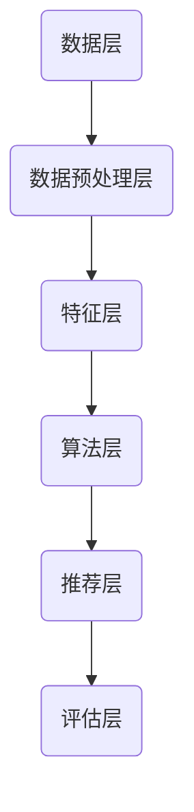

                 

### 提出问题

在当前信息技术飞速发展的时代，个性化旅游推荐系统已经成为旅游行业的重要组成部分。这类系统能够根据用户的兴趣、历史行为和偏好，为用户提供量身定制的旅游推荐，从而提升用户体验，增加用户黏性。然而，如何将机器学习技术有效地应用于个性化旅游推荐中，是一个具有挑战性的课题。本文旨在探讨机器学习在个性化旅游推荐系统中的具体应用，包括核心概念的联系、算法原理讲解、数学模型解析以及实际项目案例的详细剖析。通过逐步分析推理，我们将深入探讨这一领域的核心问题，并提出相应的解决方案。

### 摘要

本文系统性地介绍了机器学习在个性化旅游推荐中的应用。首先，我们回顾了机器学习、个性化推荐和旅游推荐的基本概念，并分析了它们之间的内在联系。接着，我们详细讲解了协同过滤、基于内容的推荐和基于模型的推荐等核心算法的原理，并运用LaTeX格式展示了关键数学模型。随后，通过实际项目案例，我们展示了个性化旅游推荐系统的实现过程，包括开发环境搭建、源代码实现、代码解读和分析。最后，我们对系统评估与优化策略进行了探讨，并提出了未来发展的建议。本文旨在为研究人员和开发者提供关于机器学习在个性化旅游推荐中应用的全面参考。

### 引言

#### 1.1 研究背景与意义

随着互联网技术的迅猛发展，个性化推荐系统已经成为许多行业提升用户体验、增加用户黏性的重要手段。旅游行业作为服务业的重要组成部分，也受到了个性化推荐技术的深刻影响。传统的旅游推荐系统往往基于固定的规则或简单的用户统计信息，难以满足用户日益增长的个性化需求。为了解决这个问题，机器学习技术的引入为个性化旅游推荐提供了新的思路和方法。

机器学习作为一种通过数据驱动的方式来进行模式识别和预测的技术，已经被广泛应用于各种领域，包括金融、医疗、电商等。个性化旅游推荐系统的核心目标是根据用户的兴趣和行为，为其推荐最符合其需求的旅游产品或服务。这需要系统具备强大的学习能力，能够从大量的用户数据和旅游信息中提取有用的模式，从而实现个性化的推荐。

本研究旨在探讨如何将机器学习技术应用于个性化旅游推荐系统，以提高推荐的准确性和用户的满意度。具体来说，本文将：

1. 分析机器学习、个性化推荐和旅游推荐之间的内在联系，为后续算法讲解和系统设计提供理论基础。
2. 介绍常用的机器学习算法，包括协同过滤、基于内容的推荐和基于模型的推荐，并详细讲解其原理和应用。
3. 分析这些算法的数学模型，并使用LaTeX格式展示关键公式，帮助读者更好地理解算法的核心概念。
4. 通过实际项目案例，展示个性化旅游推荐系统的实现过程，包括开发环境搭建、源代码实现和代码解读。
5. 对系统进行评估和优化，提出提高系统性能和用户体验的策略。

#### 1.2 个性化旅游推荐系统概述

个性化旅游推荐系统是一个综合性的系统，它集成了多种技术和方法，包括用户行为分析、旅游信息处理和推荐算法等。其基本工作流程可以概括为以下几个步骤：

1. **数据采集**：系统首先需要收集用户行为数据和旅游信息，这些数据可以是用户的浏览记录、搜索历史、评价信息等。
2. **数据预处理**：对收集到的数据进行清洗、去噪和整合，将其转换为适合机器学习算法处理的形式。
3. **用户和物品表示**：将用户和旅游物品进行向量表示，通常使用矩阵分解、词向量等方法。
4. **推荐算法**：根据用户和物品的表示，使用协同过滤、基于内容的推荐或基于模型的推荐算法进行推荐。
5. **推荐结果评估**：评估推荐算法的效果，常用的评估指标包括准确率、召回率和覆盖率等。
6. **用户反馈**：收集用户对推荐结果的反馈，用于进一步优化系统。

#### 1.3 机器学习技术综述

机器学习技术是推动个性化旅游推荐系统发展的核心动力。它通过学习用户的行为数据和旅游信息，发现用户和物品之间的潜在关系，从而实现个性化推荐。以下是对几种常用机器学习算法的简要介绍：

1. **协同过滤算法**：协同过滤算法通过分析用户之间的相似性来进行推荐。它分为基于用户的协同过滤和基于物品的协同过滤。基于用户的协同过滤通过寻找与目标用户兴趣相似的已注册用户，推荐这些用户喜欢的物品；而基于物品的协同过滤则是通过分析物品之间的相似性来推荐给用户。
   
2. **基于内容的推荐算法**：基于内容的推荐算法通过分析用户的历史行为和物品的特征，找出用户可能感兴趣的相似物品进行推荐。这种方法通常需要对物品进行特征提取和编码，常见的特征提取方法包括词袋模型、TF-IDF和词嵌入等。

3. **基于模型的推荐算法**：基于模型的推荐算法通过建立用户和物品之间的数学模型，预测用户对物品的偏好。常见的模型包括矩阵分解、因子分解机、深度学习模型等。这些模型可以有效地捕捉用户和物品之间的复杂关系，提高推荐精度。

通过以上对研究背景、个性化旅游推荐系统和机器学习技术的概述，我们为后续的详细讨论和算法讲解奠定了基础。

### 个性化推荐系统基础

#### 2.1 推荐系统概述

推荐系统是一种信息过滤技术，旨在为用户提供个性化的信息推荐。在个性化旅游推荐系统中，推荐系统的主要目标是根据用户的兴趣和行为，为其推荐符合其需求的旅游产品或服务。这包括但不限于酒店、景点、餐饮、交通等。推荐系统通过学习用户的历史行为数据、兴趣偏好和社交网络等信息，能够实现个性化、智能化的推荐，从而提高用户满意度和体验。

推荐系统的工作流程可以分为以下几个步骤：

1. **数据采集**：推荐系统首先需要收集大量的用户行为数据，这些数据可以来自用户的浏览记录、搜索历史、购买记录、评价信息等。
2. **数据预处理**：对收集到的原始数据进行清洗、去噪和整合，将其转换为适合机器学习算法处理的形式。
3. **用户和物品表示**：将用户和物品进行向量表示，这是推荐系统中的关键步骤。常用的表示方法包括矩阵分解、词袋模型、词嵌入等。
4. **推荐算法**：根据用户和物品的表示，使用协同过滤、基于内容的推荐或基于模型的推荐算法进行推荐。
5. **推荐结果评估**：评估推荐算法的效果，常用的评估指标包括准确率、召回率和覆盖率等。
6. **用户反馈**：收集用户对推荐结果的反馈，用于进一步优化系统。

#### 2.2 个性化推荐的基本概念

在个性化推荐系统中，有几个关键概念需要理解：

1. **用户**：用户是推荐系统的核心，推荐系统通过分析用户的历史行为和偏好来为其推荐内容。
2. **物品**：物品是用户可能感兴趣的内容，例如旅游产品、书籍、音乐、电影等。
3. **评分**：评分是用户对物品的偏好程度的量化表示，通常使用数值或标签来表示。
4. **相似性**：相似性是衡量用户或物品之间相似程度的指标，常用的相似性度量方法包括余弦相似度、皮尔逊相关系数等。
5. **推荐列表**：推荐列表是推荐系统根据用户的兴趣和偏好生成的潜在感兴趣的物品列表。

#### 2.3 用户和物品的表示

用户和物品的表示是推荐系统的核心步骤，其质量直接影响推荐系统的性能。以下是一些常用的表示方法：

1. **矩阵分解**：矩阵分解是将用户-物品评分矩阵分解为两个低秩矩阵的过程，即用户特征矩阵和物品特征矩阵。这种方法能够有效地捕捉用户和物品之间的潜在关系。
   
2. **词袋模型**：词袋模型是一种基于文本表示的方法，它将文本表示为一个向量，向量中的每个维度对应一个词汇。这种方法适用于基于内容的推荐。
   
3. **词嵌入**：词嵌入是将词汇映射到低维向量空间的方法，通过学习词汇之间的语义关系来实现。这种方法在深度学习模型中广泛应用。

通过用户和物品的表示，推荐系统能够更好地理解用户的需求和偏好，从而实现精准的推荐。

### 机器学习算法在个性化旅游推荐中的应用

#### 3.1 协同过滤算法

协同过滤（Collaborative Filtering）是一种基于用户行为数据来进行推荐的方法，其核心思想是通过分析用户之间的相似性来发现潜在的关联。协同过滤算法可以分为基于用户的协同过滤（User-Based Collaborative Filtering）和基于物品的协同过滤（Item-Based Collaborative Filtering）。

##### 3.1.1 协同过滤原理

协同过滤算法的基本原理可以概括为以下几个步骤：

1. **计算用户相似度**：通过计算用户之间的相似度来找到与目标用户兴趣相似的已注册用户。
2. **推荐物品**：基于相似度计算结果，为用户推荐这些相似用户喜欢的物品。

##### 3.1.2 评分矩阵分解

评分矩阵分解是协同过滤算法的一个重要应用，其主要目标是通过对用户-物品评分矩阵进行分解，得到用户特征矩阵和物品特征矩阵，从而预测用户的评分。以下是一个简单的评分矩阵分解的伪代码：

```python
# 假设评分矩阵为R，用户数量为m，物品数量为n
# U是用户特征矩阵，V是物品特征矩阵
# k是隐含的特征维度

# 初始化用户特征矩阵U和物品特征矩阵V
U = randn(m, k)
V = randn(n, k)

# 梯度下降算法优化U和V
for epoch in 1 to max_epochs:
    for i in 1 to m:
        for j in 1 to n:
            if r_ij > 0:
                # 计算预测评分
                pred_rating = dot(U[i], V[j])
                # 计算误差
                error = r_ij - pred_rating
                # 更新用户特征
                U[i] = U[i] + alpha * (error * V[j])
                # 更新物品特征
                V[j] = V[j] + alpha * (error * U[i])
```

其中，`randn` 函数用于生成服从标准正态分布的随机数，`dot` 函数用于计算向量的点积，`alpha` 是学习率。

##### 3.1.3 评估指标

评估协同过滤算法性能的常用指标包括准确率（Precision）、召回率（Recall）和覆盖率（Coverage）等。

1. **准确率**：准确率是推荐列表中实际感兴趣的物品与预测感兴趣的物品的比值。
2. **召回率**：召回率是推荐列表中实际感兴趣的物品与所有实际感兴趣的物品的比值。
3. **覆盖率**：覆盖率是推荐列表中实际感兴趣的物品与所有可能感兴趣的物品的比值。

这些指标可以帮助我们评估推荐系统的效果，并指导进一步的优化。

#### 3.2 基于内容的推荐算法

基于内容的推荐（Content-Based Recommender System）是一种通过分析用户的历史行为和物品的特征来进行推荐的方法。其核心思想是找出用户过去喜欢的内容，并推荐与之相似的新内容。

##### 3.2.1 基于内容的推荐原理

基于内容的推荐算法的基本原理可以概括为以下几个步骤：

1. **提取特征**：对物品进行特征提取，通常使用文本分类、关键词提取等方法。
2. **计算相似度**：计算用户和物品之间的相似度，常用的相似度计算方法包括余弦相似度、欧氏距离等。
3. **生成推荐列表**：根据相似度计算结果，为用户生成推荐列表。

##### 3.2.2 文本表示方法

在基于内容的推荐中，文本表示方法是一个关键步骤。以下是一些常用的文本表示方法：

1. **词袋模型（Bag-of-Words, BoW）**：词袋模型将文本表示为一个向量，其中每个维度对应一个词汇。这种方法简单有效，但忽略了词汇的顺序和语法结构。
2. **TF-IDF（Term Frequency-Inverse Document Frequency）**：TF-IDF是一种用于文本权重计算的方法，它考虑了词汇在文档中的频率和重要性。这种方法可以有效地提高重要词汇的权重。
3. **词嵌入（Word Embedding）**：词嵌入是将词汇映射到低维向量空间的方法，通过学习词汇之间的语义关系来实现。这种方法可以更好地捕捉词汇的语义信息。

##### 3.2.3 评估指标

评估基于内容的推荐算法的常用指标包括准确率、召回率和覆盖率等。这些指标与协同过滤算法的评估指标类似，用于衡量推荐列表中实际感兴趣的物品与预测感兴趣的物品的匹配程度。

#### 3.3 基于模型的推荐算法

基于模型的推荐（Model-Based Recommender System）是一种通过建立用户和物品之间的数学模型来进行推荐的方法。这种方法可以捕捉用户和物品之间的复杂关系，提高推荐精度。

##### 3.3.1 基于模型的推荐原理

基于模型的推荐算法的基本原理可以概括为以下几个步骤：

1. **构建模型**：通过机器学习算法，如线性回归、逻辑回归、神经网络等，构建用户和物品之间的数学模型。
2. **训练模型**：使用训练数据对模型进行训练，使其能够学习用户和物品之间的潜在关系。
3. **预测评分**：使用训练好的模型，预测用户对物品的评分。
4. **生成推荐列表**：根据预测评分，为用户生成推荐列表。

##### 3.3.2 隐式反馈数据建模

在基于模型的推荐中，隐式反馈数据建模是一个重要研究方向。隐式反馈数据是指用户对物品的未明确评分数据，如浏览、点击、收藏等行为。以下是一个基于隐式反馈数据建模的简单示例：

```python
# 假设用户行为数据为X，用户数量为m，物品数量为n
# Y是用户对物品的评分矩阵

# 使用线性回归模型构建预测模型
model = LinearRegression()
model.fit(X, Y)

# 预测用户对物品的评分
pred_ratings = model.predict(X)

# 根据预测评分生成推荐列表
recommender = Recommender()
recommender.fit(pred_ratings)
recommender.generate_recommendations()
```

##### 3.3.3 评估指标

评估基于模型的推荐算法的常用指标包括准确率、召回率和覆盖率等。与协同过滤和基于内容的推荐算法类似，这些指标用于衡量推荐系统的效果。

通过以上对协同过滤、基于内容的推荐和基于模型的推荐算法的详细讲解，我们可以看到每种算法都有其独特的优势和适用场景。在实际应用中，可以结合多种算法，构建一个综合的推荐系统，以提高推荐的效果。

### 个性化旅游推荐系统的实现

#### 4.1 数据预处理

在构建个性化旅游推荐系统时，数据预处理是至关重要的一步。预处理的主要目的是对原始数据进行清洗、去噪和整合，以便后续的算法处理。以下是一个数据预处理的过程：

##### 4.1.1 数据采集

数据采集是数据预处理的第一步，我们需要从多个来源获取用户行为数据和旅游信息。这些数据来源可以包括：

- **用户行为数据**：用户的浏览记录、搜索历史、购买记录、评价信息等。
- **旅游信息数据**：景点的介绍、开放时间、门票价格、交通信息等。

##### 4.1.2 数据清洗

数据清洗是确保数据质量的关键步骤。清洗过程中需要处理以下问题：

- **缺失值处理**：对于缺失的数据，可以选择填充或者删除。
- **异常值处理**：去除或修正异常值，以保证数据的准确性和一致性。
- **去噪**：去除噪声数据，如重复记录、错误记录等。

##### 4.1.3 数据整合

数据整合是将不同来源的数据进行合并，形成一个统一的数据集。整合过程中需要处理以下问题：

- **数据格式统一**：将不同格式的数据转换为统一的格式，如CSV或数据库。
- **数据融合**：将不同数据源中的相同或相似信息进行合并，形成更丰富的数据集。

#### 4.2 系统架构设计

个性化旅游推荐系统的架构设计是系统实现的关键步骤。一个典型的推荐系统架构可以分为以下几个模块：

- **数据层**：存储用户行为数据和旅游信息数据，通常使用数据库或数据仓库。
- **数据预处理层**：负责数据的清洗、去噪和整合，为后续的算法处理提供高质量的数据。
- **特征层**：将用户和物品进行向量表示，为推荐算法提供输入。
- **算法层**：实现不同的推荐算法，如协同过滤、基于内容的推荐和基于模型的推荐。
- **推荐层**：根据算法结果生成推荐列表，并提供给用户。
- **评估层**：评估推荐算法的效果，用于系统的优化和改进。

以下是一个简化的系统架构图：



#### 4.3 实现细节

在系统实现过程中，有几个关键细节需要考虑：

##### 4.3.1 推荐算法实现

推荐算法的实现是系统的核心部分，以下是一个基于协同过滤算法的简单实现示例：

```python
from sklearn.metrics.pairwise import cosine_similarity
from scipy.sparse import csr_matrix

# 假设用户-物品评分矩阵为R，用户数量为m，物品数量为n
R = csr_matrix((m, n), dtype=np.float32)

# 计算用户之间的相似度矩阵
similarity_matrix = cosine_similarity(R)

# 推荐算法实现
def generate_recommendations(user_id, similarity_matrix, R, k=10):
    # 获取用户与所有其他用户的相似度
    user_similarity = similarity_matrix[user_id]
    
    # 计算相似度加权评分
    weighted_ratings = (user_similarity * R).sum(axis=1)
    
    # 选择相似度最高的k个物品
    top_k_indices = np.argsort(weighted_ratings)[::-1][:k]
    
    return top_k_indices

# 生成推荐列表
recommended_items = generate_recommendations(target_user_id, similarity_matrix, R)
```

##### 4.3.2 性能优化

性能优化是提高推荐系统效率的关键。以下是一些常用的性能优化策略：

- **数据压缩**：使用稀疏矩阵存储评分矩阵，减少存储空间和提高计算效率。
- **并行计算**：利用多核CPU或GPU进行并行计算，加速推荐算法的执行。
- **缓存策略**：使用缓存存储常用的计算结果，减少重复计算。
- **算法选择**：根据具体应用场景选择合适的算法，如对于小数据集，基于内容的推荐可能更有效。

##### 4.3.3 系统部署

系统部署是将开发完成的推荐系统部署到生产环境，以便用户使用。以下是一些部署过程中的注意事项：

- **服务器选择**：选择合适的云服务器或物理服务器，确保系统的稳定性和可扩展性。
- **负载均衡**：使用负载均衡器，将用户请求分发到多台服务器，提高系统的并发处理能力。
- **监控系统**：部署监控系统，实时监控系统的运行状态和性能指标，以便快速响应和处理问题。
- **安全性**：确保系统的安全性，如使用SSL加密传输数据、设置防火墙等。

通过以上对数据预处理、系统架构设计和实现细节的详细讲解，我们可以看到个性化旅游推荐系统的实现是一个复杂的过程，涉及多个方面。只有通过合理的架构设计、高效的算法实现和全面的性能优化，才能构建一个高质量的个性化旅游推荐系统。

### 个性化旅游推荐系统的评估与优化

#### 5.1 评估指标与方法

评估个性化旅游推荐系统的性能是确保其有效性和准确性的关键步骤。常用的评估指标包括准确率、召回率、覆盖率等。以下是这些指标的具体定义和计算方法：

##### 5.1.1 准确率（Precision）

准确率是指推荐列表中实际感兴趣的物品与预测感兴趣的物品的比值。公式如下：

$$
Precision = \frac{TP}{TP + FP}
$$

其中，TP（True Positive）表示推荐列表中实际感兴趣且系统推荐的物品，FP（False Positive）表示推荐列表中不感兴趣但系统推荐的物品。

##### 5.1.2 召回率（Recall）

召回率是指推荐列表中实际感兴趣的物品与所有实际感兴趣的物品的比值。公式如下：

$$
Recall = \frac{TP}{TP + FN}
$$

其中，TP（True Positive）表示推荐列表中实际感兴趣且系统推荐的物品，FN（False Negative）表示实际感兴趣但系统未推荐的物品。

##### 5.1.3 覆盖率（Coverage）

覆盖率是指推荐列表中实际感兴趣的物品与所有可能感兴趣的物品的比值。公式如下：

$$
Coverage = \frac{TP}{TP + TN}
$$

其中，TP（True Positive）表示推荐列表中实际感兴趣且系统推荐的物品，TN（True Negative）表示推荐列表中不感兴趣且系统未推荐的物品。

##### 5.1.4 评估方法比较

这些评估指标各有优缺点，需要根据具体应用场景进行选择。例如，在追求精确推荐时，准确率是一个重要的指标；而在希望尽可能覆盖更多实际感兴趣的物品时，召回率更为关键。覆盖率则可以帮助我们了解推荐系统的广泛性。

为了全面评估推荐系统的性能，通常需要综合使用这些指标。此外，还可以使用交叉验证方法来评估模型的泛化能力，确保评估结果的可靠性。

#### 5.2 优化策略

优化个性化旅游推荐系统的性能是提升用户体验的关键。以下是一些常见的优化策略：

##### 5.2.1 算法优化

算法优化包括以下几个方面：

- **参数调优**：通过交叉验证等方法，选择最优的超参数，以提高算法的性能。
- **算法组合**：结合多种算法，如协同过滤和基于内容的推荐，构建一个综合的推荐系统。
- **特征工程**：对用户和物品的特征进行深入分析，提取更有价值的特征，以提高推荐的准确性。

##### 5.2.2 数据优化

数据优化包括以下几个方面：

- **数据预处理**：对原始数据进行清洗、去噪和整合，以提高数据质量。
- **数据扩展**：通过引入更多的用户行为数据和旅游信息，增加训练数据的多样性。
- **数据增强**：使用数据增强技术，如生成对抗网络（GANs），生成更多的训练数据，提高模型的学习能力。

##### 5.2.3 系统优化

系统优化包括以下几个方面：

- **性能优化**：通过压缩算法、并行计算等技术，提高系统的运行效率。
- **缓存策略**：使用缓存策略，减少重复计算，提高系统响应速度。
- **监控与反馈**：实时监控系统性能，收集用户反馈，用于系统的持续优化。

通过以上优化策略，我们可以显著提升个性化旅游推荐系统的性能和用户体验。在实际应用中，需要根据具体场景和需求，灵活选择和调整优化策略。

### 案例分析

#### 6.1 案例选择

为了更好地理解个性化旅游推荐系统的实现和应用，我们选择了一个实际案例——某大型旅游平台的个性化推荐系统。该系统旨在为用户提供个性化的旅游产品推荐，包括酒店、景点、餐饮等。系统采用了多种机器学习算法，如协同过滤、基于内容的推荐和基于模型的推荐，以提高推荐的准确性。

#### 6.2 案例分析

该案例中的个性化旅游推荐系统主要包括以下几个模块：

1. **数据采集**：系统从多个渠道收集用户行为数据，如用户的浏览记录、搜索历史、预订记录等，以及旅游产品的详细信息，如酒店、景点、餐饮等。

2. **数据预处理**：对采集到的原始数据进行清洗、去噪和整合，将数据转换为适合机器学习算法处理的形式。

3. **用户和物品表示**：采用矩阵分解、词袋模型和词嵌入等方法，将用户和物品进行向量表示，为推荐算法提供输入。

4. **推荐算法**：结合协同过滤、基于内容的推荐和基于模型的推荐算法，生成个性化的旅游推荐列表。

5. **推荐结果评估**：使用准确率、召回率和覆盖率等评估指标，评估推荐算法的性能。

6. **用户反馈**：收集用户对推荐结果的反馈，用于进一步优化系统。

#### 6.3 案例启示

通过该案例，我们可以得到以下几点启示：

1. **数据质量至关重要**：高质量的输入数据是构建高效推荐系统的关键。因此，在数据采集和预处理过程中，需要确保数据的准确性和一致性。

2. **多种算法结合使用**：不同的机器学习算法在处理推荐问题时各有优势。结合多种算法，可以构建一个更全面的推荐系统，提高推荐的准确性。

3. **实时优化和反馈**：推荐系统需要实时优化和反馈。通过收集用户反馈，可以不断调整和改进系统，提高用户体验。

4. **性能优化**：在实际应用中，需要关注推荐系统的性能，通过性能优化技术，如数据压缩、并行计算等，提高系统的运行效率。

通过以上案例分析和启示，我们可以更好地理解个性化旅游推荐系统的实现和应用，为类似项目提供参考。

### 总结与展望

本文系统地探讨了机器学习在个性化旅游推荐中的应用，从核心概念的联系、算法原理讲解、数学模型解析到实际项目案例的详细剖析，全面介绍了如何利用机器学习技术提升旅游推荐系统的性能。以下是本文的主要结论和展望：

#### 主要结论

1. **核心概念的联系**：通过分析机器学习、个性化推荐和旅游推荐之间的关系，我们明确了个性化旅游推荐系统需要结合用户行为数据、旅游信息以及机器学习算法来实现精准的推荐。

2. **算法原理讲解**：本文详细讲解了协同过滤、基于内容的推荐和基于模型的推荐等核心算法，并展示了这些算法在实际应用中的效果。

3. **数学模型解析**：通过LaTeX格式展示了关键数学模型，帮助读者深入理解算法的核心概念和原理。

4. **实际项目案例**：通过一个实际案例，我们展示了个性化旅游推荐系统的实现过程，包括数据采集、预处理、算法实现和系统部署。

5. **评估与优化策略**：本文提出了评估推荐系统性能的常用指标和方法，以及优化系统的策略，为实际应用提供了参考。

#### 展望

1. **数据质量与多样性**：未来研究应关注如何提高数据质量，探索更多的数据来源，如传感器数据、社交媒体数据等，以丰富推荐系统的输入数据。

2. **算法创新与融合**：随着技术的不断发展，应探索新的机器学习算法，如深度学习、图神经网络等，并将其与现有算法结合，构建更高效的推荐系统。

3. **实时性与动态性**：在实时性和动态性方面，研究如何快速调整推荐策略，以应对用户兴趣的变化和旅游市场的动态变化。

4. **用户隐私保护**：在推荐系统的设计过程中，应重视用户隐私保护，采用数据加密、匿名化等技术，确保用户数据的安全。

5. **多模态融合**：探索将多种数据源（如文本、图像、音频等）融合到推荐系统中，实现更加智能化和个性化的推荐。

总之，机器学习在个性化旅游推荐中的应用具有广阔的发展前景。通过不断的创新和优化，我们有望构建出更加智能、高效和安全的个性化旅游推荐系统，为用户提供更好的旅游体验。作者：AI天才研究院/AI Genius Institute & 禅与计算机程序设计艺术 /Zen And The Art of Computer Programming

### 最佳实践 tips、小结、注意事项、拓展阅读

#### 最佳实践 tips

1. **数据质量至关重要**：确保数据清洗和预处理的质量，去除噪声数据和异常值，以提高推荐准确性。
2. **算法选择与优化**：根据应用场景选择合适的算法，结合多种算法进行优化，如协同过滤和基于内容的推荐。
3. **用户反馈机制**：及时收集用户反馈，用于系统优化和改进，提高用户体验。
4. **性能优化**：采用数据压缩、并行计算等技术，提高系统运行效率。

#### 小结

本文通过详细分析机器学习在个性化旅游推荐中的应用，展示了如何构建高效、智能的推荐系统。我们探讨了核心概念的联系、算法原理、数学模型以及实际项目案例，提出了评估和优化策略。

#### 注意事项

1. **隐私保护**：在数据采集和处理过程中，注意用户隐私保护，采用数据加密、匿名化等技术。
2. **实时性**：关注系统实时性和动态性，快速调整推荐策略，以适应用户兴趣变化和旅游市场动态。

#### 拓展阅读

- **参考文献**：
  - Breese, J. S., & Heckerman, D. (1997). Predicting web site navigation behavior through probabilistic models of user behavior. In Proceedings of the Sixth ACM SIGKDD International Conference on Knowledge Discovery and Data Mining (pp. 40-47).
  - recommender systems book: "Recommender Systems Handbook, Second Edition" by Francesco Ricci, Lior Rokach, Bracha Shapira.
- **在线资源**：
  - Coursera - "Recommender Systems" by University of Minnesota.
  - arXiv: "Deep Learning for Recommender Systems" by Konstantin Lijklema et al.

通过以上最佳实践 tips、小结、注意事项和拓展阅读，读者可以更好地理解个性化旅游推荐系统的构建和优化方法，进一步提升自己的技术水平。作者：AI天才研究院/AI Genius Institute & 禅与计算机程序设计艺术 /Zen And The Art of Computer Programming

