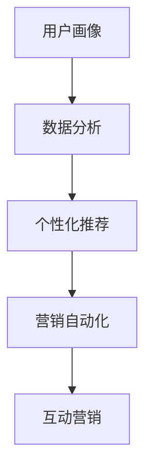
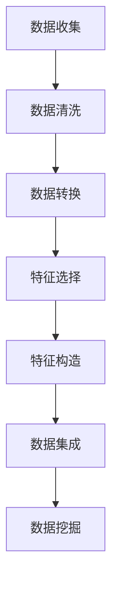

                 

### 文章标题

《机器学习在个性化营销中的精准应用》

### 文章关键词

机器学习、个性化营销、精准营销、用户画像、推荐系统、数据分析、算法应用

### 文章摘要

本文将深入探讨机器学习在个性化营销中的精准应用。首先，我们将简要介绍个性化营销的背景和重要性，然后探讨机器学习的基本概念和技术，接着详细分析机器学习在个性化营销中的具体应用，包括用户画像、营销自动化和个性化推荐系统。随后，我们将探讨数据处理和数据挖掘在个性化营销中的作用，并通过实际案例展示机器学习在个性化营销中的实际应用。最后，我们将展望个性化营销和机器学习技术的未来发展趋势，并提出一些最佳实践和注意事项。文章将以专业的技术语言，结合丰富的图表、伪代码和实际案例，为广大读者提供一次深入的学习和思考的机会。

----------------------------------------------------------------

## 第1章 介绍与背景

### 1.1 书籍介绍与目标

随着互联网的快速发展和大数据时代的到来，个性化营销已经成为企业获取竞争优势的重要手段。然而，如何实现精准的个性化营销，成为了企业面临的重大挑战。本书旨在通过深入探讨机器学习在个性化营销中的应用，帮助企业实现精准的营销策略。

本书的目标是：

1. **介绍个性化营销的基本概念和重要性**：帮助读者理解个性化营销的理论基础和发展历程。
2. **阐述机器学习的基本概念和技术**：介绍常见的机器学习算法、特征工程和数据预处理等核心概念。
3. **分析机器学习在个性化营销中的具体应用**：详细探讨用户画像、营销自动化和个性化推荐系统的实现方法和应用场景。
4. **探讨数据处理和数据挖掘在个性化营销中的作用**：介绍数据清洗、数据分析和数据可视化等技术，帮助读者更好地理解和应用这些技术。
5. **通过实际案例展示机器学习在个性化营销中的实际应用**：通过实际案例，让读者深入了解机器学习在个性化营销中的应用。
6. **展望个性化营销和机器学习技术的未来发展趋势**：分析个性化营销的未来趋势，探讨机器学习在个性化营销中的发展方向。

本书适合从事市场营销、数据分析、软件开发等领域的专业人士阅读，也适合对机器学习和个性化营销感兴趣的大学生和研究生作为参考书籍。

### 1.2 个性化营销概述

个性化营销，又称为一对一营销或定制化营销，是一种以客户为中心的营销策略。它的核心思想是根据客户的需求和行为，提供个性化的产品和服务，从而提高客户满意度和忠诚度。

个性化营销的发展可以追溯到20世纪90年代，随着互联网的兴起和数据技术的进步，个性化营销逐渐成为市场营销的主流。以下是个性化营销的发展历程：

1. **早期个性化营销**：20世纪90年代，互联网刚刚兴起，企业开始利用网站和电子邮件等渠道，根据用户的行为和偏好，提供个性化的产品推荐和服务。
2. **精准营销**：2000年后，随着大数据技术和分析工具的兴起，企业能够收集和分析大量的用户数据，从而实现更加精准的营销。精准营销强调通过数据分析和挖掘，找到最有价值的客户群体，提供个性化的营销策略。
3. **个性化营销**：近年来，随着人工智能和机器学习的快速发展，个性化营销进入了新的阶段。通过机器学习算法，企业可以更准确地分析用户行为，预测用户需求，提供更加个性化的产品和服务。

个性化营销的重要性体现在以下几个方面：

1. **提高客户满意度**：个性化营销能够满足客户的需求，提供个性化的产品和服务，从而提高客户的满意度和忠诚度。
2. **提高营销效果**：通过精准的个性化营销，企业可以更好地吸引潜在客户，提高转化率，降低营销成本。
3. **增强竞争力**：个性化营销可以帮助企业更好地满足客户需求，提高客户满意度，从而在竞争激烈的市场中脱颖而出。
4. **提高品牌价值**：个性化营销能够增强品牌与客户的互动，提高品牌知名度和美誉度。

### 1.3 机器学习概述

机器学习是人工智能的一个重要分支，它通过算法和统计模型，使计算机能够从数据中学习和预测。机器学习的基本流程包括数据收集、数据预处理、模型训练、模型评估和模型部署。

机器学习在个性化营销中的应用主要包括以下几个方面：

1. **用户画像**：通过机器学习算法，对用户的浏览行为、购买历史、社交行为等数据进行分析，构建用户的画像，帮助营销人员更好地了解用户，提供个性化的产品和服务。
2. **预测分析**：通过机器学习算法，对用户的行为数据进行分析，预测用户的未来行为，从而提前制定营销策略。
3. **推荐系统**：通过机器学习算法，根据用户的历史行为和偏好，推荐个性化的产品和服务，提高用户转化率和满意度。
4. **营销自动化**：通过机器学习算法，自动化地处理和响应用户请求，提高营销效率。

机器学习在个性化营销中的应用，不仅能够提高营销的精准度，还能够降低营销成本，提高企业的竞争力。随着机器学习技术的不断发展和成熟，其在个性化营销中的应用前景将更加广阔。接下来，我们将进一步探讨个性化营销的基本概念、机器学习技术基础以及在个性化营销中的具体应用。## 第2章 个性化营销的基本概念

个性化营销是一种以客户为中心的营销策略，其核心在于通过分析客户的行为数据、购买历史和其他相关信息，为客户提供个性化的产品和服务。在这一章中，我们将深入探讨个性化营销的基本概念、重要性以及其策略与方法。

### 2.1 营销理论的发展

营销理论的发展经历了多个阶段，从早期的产品导向到以客户为中心的营销策略，再到现代的个性化营销。以下是营销理论的发展历程：

1. **生产导向**：20世纪初，营销理论以生产为导向，企业主要关注如何提高生产效率和降低成本，以满足市场需求。
2. **销售导向**：20世纪中叶，营销理论转向销售导向，企业开始关注如何通过销售促进来增加销量，提高市场份额。
3. **市场导向**：20世纪70年代，营销理论发展到市场导向阶段，企业开始以市场需求为导向，通过市场研究和客户分析来制定营销策略。
4. **关系营销**：20世纪80年代，关系营销理论提出，企业与客户建立长期稳定的合作关系，通过满足客户需求来提高客户满意度和忠诚度。
5. **个性化营销**：近年来，随着大数据和人工智能技术的发展，个性化营销成为主流。个性化营销强调通过分析客户数据，为客户提供个性化的产品和服务，从而提高客户满意度和忠诚度。

### 2.2 个性化营销的重要性

个性化营销的重要性体现在以下几个方面：

1. **提高客户满意度**：个性化营销能够根据客户的需求和偏好，为客户提供个性化的产品和服务，从而提高客户满意度。
2. **提高客户忠诚度**：通过个性化营销，企业能够更好地满足客户的需求，增强客户对品牌的信任和忠诚度。
3. **提高营销效果**：个性化营销能够帮助企业更准确地定位目标客户，提高营销活动的针对性和效果，降低营销成本。
4. **增强竞争力**：个性化营销能够帮助企业更好地满足客户需求，提高客户满意度和忠诚度，从而在竞争激烈的市场中脱颖而出。

### 2.3 个性化营销的策略与方法

个性化营销的策略和方法包括以下几个方面：

1. **用户画像**：通过分析用户的行为数据、购买历史和其他相关信息，构建用户的画像。用户画像可以帮助企业了解用户的需求和偏好，从而提供个性化的产品和服务。
2. **数据分析**：利用大数据技术和分析工具，对用户数据进行深入分析，挖掘用户的行为模式、兴趣偏好等，为个性化营销提供依据。
3. **个性化推荐**：根据用户的画像和数据分析结果，向用户推荐个性化的产品和服务。个性化推荐可以通过算法实现，如协同过滤、基于内容的推荐等。
4. **营销自动化**：利用机器学习和自然语言处理等技术，实现营销自动化，如自动回复、自动推荐等，提高营销效率。
5. **互动营销**：通过社交媒体、电子邮件、短信等渠道，与客户进行互动，了解客户需求，提供个性化服务。

以下是个性化营销策略与方法之间的关系架构，使用Mermaid流程图表示：

### 用户画像

用户画像是对用户特征的综合描述，包括用户的年龄、性别、地理位置、兴趣爱好、购买行为等。用户画像可以帮助企业更好地了解用户，从而提供个性化的产品和服务。以下是用户画像的基本概念和组成部分：

1. **基本概念**：用户画像是指通过对用户数据的分析，构建出反映用户特征和需求的模型，从而实现对用户的全面了解。
2. **组成部分**：
   - **基本信息**：包括用户的年龄、性别、地理位置等基本信息。
   - **行为特征**：包括用户的浏览行为、购买行为、社交行为等。
   - **兴趣爱好**：包括用户感兴趣的话题、喜欢的品牌、购买的产品类型等。
   - **社会属性**：包括用户的职业、收入水平、教育程度等。

以下是用户画像的核心概念、算法原理、数学模型和举例说明：

#### 核心概念

- **用户特征**：用户画像的基础，包括用户的属性和行为。
- **数据源**：包括用户行为数据、社交媒体数据、购买数据等。
- **算法**：包括聚类分析、关联规则挖掘、机器学习算法等。
- **数据预处理**：包括数据清洗、数据集成、特征工程等。

#### 算法原理

1. **聚类分析**：通过对用户特征数据进行聚类，将具有相似特征的用户归为一类，从而构建用户画像。
2. **关联规则挖掘**：通过分析用户行为数据，找出用户行为之间的关联关系，从而构建用户画像。
3. **机器学习算法**：利用机器学习算法，对用户数据进行建模，从而预测用户的行为和需求。

#### 数学模型

- **聚类算法**：如K-means、DBSCAN等。
- **关联规则挖掘**：如Apriori算法、FP-growth算法等。
- **机器学习算法**：如逻辑回归、决策树、随机森林等。

#### 举例说明

假设某电商企业通过用户的浏览行为和购买数据，使用K-means聚类算法构建用户画像，具体步骤如下：

1. **数据收集**：收集用户的浏览记录和购买记录，包括商品种类、浏览时间、购买金额等。
2. **数据预处理**：对数据进行清洗，去除无效数据，如缺失值、异常值等，并对数据进行归一化处理。
3. **特征选择**：选择与用户行为相关的特征，如商品种类、浏览时间、购买金额等。
4. **聚类分析**：使用K-means算法，将用户分为若干个类，每个类表示一种用户画像。
5. **结果分析**：分析不同类别的用户特征和行为，为营销策略提供依据。

通过用户画像，企业可以更好地了解用户，制定个性化的营销策略，提高客户满意度和忠诚度。### 2.4 数据处理与数据挖掘

数据处理与数据挖掘是个性化营销中不可或缺的环节。通过对大量用户数据的处理和分析，企业可以挖掘出有价值的信息，为个性化营销提供依据。在这一节中，我们将深入探讨数据处理与数据挖掘的基本概念、技术和应用。

#### 数据处理

数据处理是指对原始数据进行清洗、转换和集成等操作，使其适合进行分析和挖掘的过程。数据处理是数据挖掘的基础，其质量直接影响数据挖掘的效果。以下是数据处理的基本步骤：

1. **数据收集**：从不同的数据源收集用户数据，如网站日志、社交媒体数据、购买记录等。
2. **数据清洗**：去除数据中的噪声、异常值和重复数据，保证数据的准确性和一致性。
3. **数据转换**：将数据转换成适合分析和挖掘的格式，如将文本数据转换为数字编码，对数据进行归一化或标准化处理。
4. **数据集成**：将来自不同数据源的数据进行合并，构建一个统一的数据集。

#### 数据挖掘

数据挖掘是指从大量数据中提取有价值的信息和知识的过程。数据挖掘技术包括关联规则挖掘、聚类分析、分类和预测等。以下是数据挖掘的基本概念和技术：

1. **关联规则挖掘**：通过分析数据之间的关联关系，找出数据中的隐含规律。如市场中的“啤酒与尿布”现象，即购买啤酒的顾客往往也会购买尿布。
2. **聚类分析**：将数据按照其特征进行分类，形成若干个聚类，每个聚类内的数据相似度较高，而不同聚类间的数据相似度较低。如将用户按照购买行为分为高价值用户、中价值用户和低价值用户。
3. **分类和预测**：根据历史数据，对新的数据进行分类或预测。如根据用户的浏览记录，预测用户可能感兴趣的商品。

#### 数据处理与数据挖掘在个性化营销中的应用

数据处理与数据挖掘在个性化营销中的应用非常广泛，主要包括以下几个方面：

1. **用户行为分析**：通过对用户浏览、购买和互动行为的数据分析，挖掘用户的行为模式和偏好，为个性化推荐和营销策略提供依据。
2. **用户画像构建**：通过聚类分析、关联规则挖掘等技术，构建用户的画像，帮助营销人员更好地了解用户，提供个性化的产品和服务。
3. **营销自动化**：通过分类和预测技术，实现营销自动化，如自动发送个性化优惠券、推荐商品等，提高营销效率。
4. **客户细分**：通过对用户数据的分析，将用户分为不同的细分市场，为每个细分市场制定个性化的营销策略。

以下是数据处理与数据挖掘在个性化营销中的应用流程：

1. **数据收集**：从不同的数据源收集用户数据，如网站日志、社交媒体数据、购买记录等。
2. **数据清洗**：去除数据中的噪声、异常值和重复数据，保证数据的准确性和一致性。
3. **数据转换**：将数据转换成适合分析和挖掘的格式，如将文本数据转换为数字编码，对数据进行归一化或标准化处理。
4. **数据挖掘**：利用关联规则挖掘、聚类分析、分类和预测等技术，挖掘用户行为模式和偏好。
5. **用户画像构建**：根据挖掘结果，构建用户的画像，帮助营销人员更好地了解用户。
6. **营销策略制定**：根据用户画像和数据分析结果，制定个性化的营销策略。
7. **营销执行与优化**：执行个性化营销策略，并根据用户反馈和数据分析结果，不断优化营销策略。

通过数据处理与数据挖掘，企业可以更好地了解用户需求，提供个性化的产品和服务，提高客户满意度和忠诚度，从而在竞争激烈的市场中脱颖而出。### 2.5 个性化营销案例

#### 2.5.1 案例分析概述

个性化营销案例的选择至关重要，因为它可以帮助读者更好地理解理论在实际中的应用。本节将介绍两个经典个性化营销案例，分别是亚马逊和Netflix。

#### 2.5.2 成功案例分享

1. **亚马逊（Amazon）**

亚马逊是全球最大的在线零售商之一，其个性化营销策略在全球范围内都备受关注。以下是亚马逊个性化营销的成功要素：

- **用户画像**：亚马逊通过用户的浏览历史、购买记录、评价等数据，构建了详细的用户画像。这些画像帮助亚马逊了解用户的偏好，从而提供个性化的产品推荐。
- **个性化推荐**：亚马逊利用协同过滤算法和基于内容的推荐系统，向用户推荐个性化的产品。协同过滤算法通过分析用户的购买行为和评分，找到与用户相似的用户，推荐他们喜欢的商品。基于内容的推荐系统则根据商品的属性和用户的历史行为，推荐相似的商品。
- **动态定价**：亚马逊还通过动态定价策略，根据用户的购买历史和行为，提供个性化的价格优惠。例如，对于经常购买某种商品的用户，亚马逊可能会提供更低的价格。

2. **Netflix（Netflix）**

Netflix是全球最大的在线视频流媒体服务提供商之一，其个性化推荐系统在行业内享有盛誉。以下是Netflix个性化推荐的成功要素：

- **用户画像**：Netflix通过用户的观影历史、评分、评论等数据，构建了详细的用户画像。这些画像帮助Netflix了解用户的兴趣和偏好，从而提供个性化的视频推荐。
- **协同过滤算法**：Netflix使用基于用户的协同过滤算法，根据用户的观影历史和评分，找到与用户相似的用户，推荐他们喜欢的电影和电视剧。基于物品的协同过滤算法则根据电影的属性和用户的观影历史，推荐相似的电影和电视剧。
- **实时推荐**：Netflix的推荐系统具有实时推荐的能力，即用户观看一个视频后，系统会立即更新推荐列表，提供更个性化的推荐。

#### 2.5.3 挑战与解决方案

个性化营销虽然在提高客户满意度和忠诚度方面具有显著优势，但在实际应用中也会面临一些挑战。以下是两个案例中的主要挑战及解决方案：

1. **数据隐私和安全**

- **挑战**：个性化营销需要收集大量的用户数据，如浏览历史、购买记录等，这可能导致数据隐私和安全问题。
- **解决方案**：亚马逊和Netflix都采用了严格的数据保护措施，确保用户数据的安全。例如，亚马逊采用了数据加密技术，保护用户的个人信息不被泄露。Netflix则通过数据匿名化处理，降低数据泄露的风险。

2. **算法偏见和公平性**

- **挑战**：个性化推荐算法可能会出现偏见，导致某些用户无法获得公平的推荐。
- **解决方案**：亚马逊和Netflix都在算法设计上努力避免偏见。例如，亚马逊在推荐系统开发过程中，注重平衡不同用户群体的推荐结果，确保不会因为用户的历史数据而歧视某些用户。Netflix则通过数据分析和模型优化，确保推荐系统的公平性。

通过以上案例，我们可以看到个性化营销在提升客户满意度和忠诚度方面的巨大潜力。然而，在实际应用中，企业还需要应对数据隐私、算法偏见等挑战，不断优化和改进个性化营销策略。### 第3章 机器学习技术基础

#### 3.1 机器学习的基本概念

机器学习是一种通过数据驱动的方法，使计算机系统能够从数据中学习规律和模式，并进行预测和决策的技术。其核心思想是通过训练模型，使模型能够在新的数据上做出准确的预测。

机器学习可以分为以下几类：

1. **监督学习**：在有标注的数据集上训练模型，使模型能够根据输入特征预测输出标签。常见的算法包括线性回归、逻辑回归、决策树、支持向量机等。
2. **非监督学习**：在无标注的数据集上训练模型，使模型能够发现数据中的结构和规律。常见的算法包括聚类、降维、关联规则挖掘等。
3. **强化学习**：通过与环境的交互，使模型能够不断优化其行为策略。常见的算法包括Q-learning、深度Q网络（DQN）等。

#### 3.2 常见的机器学习算法

1. **线性回归**

   线性回归是一种用于预测连续值的监督学习算法。其基本模型为：

   $$
   y = \beta_0 + \beta_1x_1 + \beta_2x_2 + ... + \beta_nx_n + \epsilon
   $$

   其中，$y$为输出值，$x_1, x_2, ..., x_n$为输入特征，$\beta_0, \beta_1, ..., \beta_n$为模型参数，$\epsilon$为误差项。

2. **逻辑回归**

   逻辑回归是一种用于预测概率的监督学习算法。其基本模型为：

   $$
   \log\left(\frac{p}{1-p}\right) = \beta_0 + \beta_1x_1 + \beta_2x_2 + ... + \beta_nx_n
   $$

   其中，$p$为事件发生的概率，$\beta_0, \beta_1, ..., \beta_n$为模型参数。

3. **决策树**

   决策树是一种基于树形结构进行决策的监督学习算法。其基本思想是通过一系列的测试来划分数据集，每个测试对应一个特征和阈值，根据测试结果将数据集划分为不同的子集。

4. **支持向量机**

   支持向量机是一种用于分类和回归的监督学习算法。其基本模型为：

   $$
   \text{分类问题：} w \cdot x + b = 0 \\
   \text{回归问题：} w \cdot x + b = y
   $$

   其中，$w$为模型参数，$x$为输入特征，$b$为偏置项。

#### 3.3 特征工程与数据预处理

特征工程是指通过选择和构造特征，提高模型性能的过程。数据预处理是指对原始数据进行清洗、转换和集成等操作，使其适合进行分析和挖掘的过程。

1. **特征选择**：通过选择与目标变量高度相关的特征，提高模型性能。常见的特征选择方法包括基于信息增益、基于主成分分析等。
2. **特征构造**：通过构造新的特征，提高模型性能。常见的特征构造方法包括基于交互、基于组合等。
3. **数据清洗**：去除数据中的噪声、异常值和重复数据，保证数据的准确性和一致性。
4. **数据转换**：将数据转换成适合分析和挖掘的格式，如将文本数据转换为数字编码，对数据进行归一化或标准化处理。
5. **数据集成**：将来自不同数据源的数据进行合并，构建一个统一的数据集。

以下是特征工程和数据预处理的一个简单流程：

#### 3.4 机器学习在个性化营销中的应用

机器学习在个性化营销中的应用主要包括以下几个方面：

1. **用户画像**：通过机器学习算法，对用户的浏览行为、购买历史、社交行为等数据进行分析，构建用户的画像，帮助营销人员更好地了解用户。
2. **个性化推荐**：通过机器学习算法，根据用户的历史行为和偏好，推荐个性化的产品和服务，提高用户转化率和满意度。
3. **营销自动化**：通过机器学习算法，自动化地处理和响应用户请求，提高营销效率。
4. **预测分析**：通过机器学习算法，对用户的行为数据进行分析，预测用户的未来行为，从而提前制定营销策略。

以下是机器学习在个性化营销中的应用流程：

1. **数据收集**：从不同的数据源收集用户数据，如网站日志、社交媒体数据、购买记录等。
2. **数据预处理**：对数据进行清洗、转换和集成等操作，使其适合进行分析和挖掘。
3. **特征工程**：选择和构造与目标变量高度相关的特征。
4. **模型训练**：利用训练数据，训练机器学习模型。
5. **模型评估**：利用验证数据，评估模型性能。
6. **模型部署**：将训练好的模型部署到生产环境中，进行实际应用。

通过机器学习技术，企业可以更好地了解用户需求，提供个性化的产品和服务，提高客户满意度和忠诚度，从而在竞争激烈的市场中脱颖而出。### 第4章 个性化营销中的机器学习应用

#### 4.1 用户画像与行为分析

用户画像与行为分析是个性化营销的关键环节，通过机器学习技术，企业可以深入了解用户的行为模式和偏好，从而提供个性化的产品和服务。

**用户画像**

用户画像是指通过对用户的浏览历史、购买记录、社交行为等多维度数据进行分析，构建出反映用户特征和需求的模型。以下是构建用户画像的基本步骤：

1. **数据收集**：从不同的数据源收集用户数据，如网站日志、购买记录、社交媒体数据等。
2. **数据预处理**：对数据进行清洗、转换和集成，使其适合分析和建模。
3. **特征工程**：选择和构造与用户行为相关的特征，如浏览时间、购买频次、购买金额等。
4. **模型训练**：利用监督学习算法，如K-means、决策树等，对用户数据进行聚类或分类，构建用户画像。
5. **用户画像评估**：通过交叉验证等方法，评估用户画像模型的性能。

**行为分析**

行为分析是指通过对用户的浏览行为、购买行为等进行分析，挖掘用户的行为模式和偏好。以下是行为分析的基本步骤：

1. **数据收集**：收集用户的浏览历史、购买记录等数据。
2. **行为特征提取**：从原始数据中提取与用户行为相关的特征，如浏览时间、浏览页面、购买商品种类等。
3. **行为模式识别**：利用聚类分析、关联规则挖掘等方法，识别用户的行为模式。
4. **偏好分析**：根据用户的行为特征和模式，分析用户的偏好，如喜欢的商品类别、购买习惯等。

通过用户画像与行为分析，企业可以更好地了解用户需求，制定个性化的营销策略，提高客户满意度和忠诚度。

**案例分析：阿里巴巴的用户画像与行为分析**

阿里巴巴集团旗下的淘宝、天猫等电商平台，通过机器学习技术对用户进行画像和行为分析，取得了显著成效。以下是阿里巴巴在用户画像与行为分析方面的具体做法：

1. **数据收集**：阿里巴巴通过多种渠道收集用户数据，包括用户在电商平台上的浏览记录、购买记录、评价等。
2. **数据预处理**：对收集到的用户数据进行清洗、转换和集成，构建统一的数据集。
3. **特征工程**：根据用户行为数据，提取与用户行为相关的特征，如浏览时间、购买频次、购买金额等。
4. **模型训练**：利用K-means、决策树等机器学习算法，对用户数据进行聚类或分类，构建用户画像。
5. **行为分析**：通过对用户的行为特征和模式进行分析，识别用户的偏好，如喜欢的商品类别、购买习惯等。
6. **个性化推荐**：根据用户画像和行为分析结果，为用户推荐个性化的商品和服务，提高用户转化率和满意度。

通过用户画像与行为分析，阿里巴巴不仅提高了用户满意度，还降低了营销成本，取得了良好的商业效果。

#### 4.2 营销自动化与预测

营销自动化与预测是机器学习在个性化营销中的另一个重要应用。通过自动化处理和预测用户行为，企业可以更高效地制定和执行营销策略。

**营销自动化**

营销自动化是指利用机器学习和自然语言处理等技术，自动化地处理和响应用户请求，提高营销效率。以下是营销自动化的基本步骤：

1. **数据收集**：收集用户的浏览历史、购买记录、互动行为等数据。
2. **数据处理**：对数据进行清洗、转换和集成，使其适合分析和建模。
3. **模型训练**：利用监督学习算法，如决策树、支持向量机等，对用户数据进行分类或回归，构建自动化模型。
4. **模型部署**：将训练好的模型部署到生产环境中，实现自动化处理和响应。
5. **自动化执行**：根据自动化模型，自动化地处理和响应用户请求，如发送个性化优惠券、推荐商品等。

**预测分析**

预测分析是指通过机器学习算法，对用户行为数据进行预测，为营销策略提供依据。以下是预测分析的基本步骤：

1. **数据收集**：收集用户的浏览历史、购买记录、互动行为等数据。
2. **数据处理**：对数据进行清洗、转换和集成，使其适合分析和建模。
3. **特征工程**：提取与用户行为相关的特征，如浏览时间、购买频次、购买金额等。
4. **模型训练**：利用监督学习算法，如线性回归、逻辑回归等，对用户数据进行预测建模。
5. **模型评估**：通过交叉验证等方法，评估预测模型的性能。
6. **预测应用**：将训练好的模型应用于实际业务场景，如预测用户购买意向、预测用户流失率等。

通过营销自动化与预测分析，企业可以更精准地预测用户行为，优化营销策略，提高营销效果。

**案例分析：谷歌的营销自动化与预测分析**

谷歌是全球最大的搜索引擎和广告平台之一，其营销自动化与预测分析技术在全球范围内都备受关注。以下是谷歌在营销自动化与预测分析方面的具体做法：

1. **数据收集**：谷歌通过多种渠道收集用户数据，包括搜索记录、广告点击行为等。
2. **数据处理**：对收集到的用户数据进行清洗、转换和集成，构建统一的数据集。
3. **模型训练**：利用机器学习算法，如决策树、线性回归等，对用户数据进行预测建模。
4. **模型部署**：将训练好的模型部署到生产环境中，实现自动化处理和响应。
5. **自动化执行**：根据自动化模型，自动化地处理和响应用户请求，如发送个性化广告、推荐相关搜索结果等。
6. **预测应用**：通过预测分析模型，预测用户购买意向、用户流失率等，为营销策略提供依据。

通过营销自动化与预测分析，谷歌不仅提高了营销效率，还大大提升了广告投放的精准度和效果，取得了良好的商业回报。

#### 4.3 个性化推荐系统

个性化推荐系统是机器学习在个性化营销中的典型应用。通过分析用户的历史行为和偏好，个性化推荐系统可以为用户提供个性化的产品和服务，提高用户满意度和忠诚度。

**个性化推荐系统的基本架构**

个性化推荐系统通常由以下几个核心模块组成：

1. **数据收集与处理**：收集用户的行为数据，如浏览记录、购买记录、评价等，并对数据进行清洗、转换和集成。
2. **用户画像与偏好分析**：根据用户行为数据，构建用户画像，分析用户的偏好和兴趣。
3. **推荐算法**：根据用户画像和偏好，选择合适的推荐算法，如基于内容的推荐、协同过滤、深度学习等。
4. **推荐结果生成**：根据推荐算法，生成个性化的推荐结果，并将其呈现给用户。
5. **用户反馈与优化**：收集用户的反馈信息，优化推荐系统，提高推荐效果。

**个性化推荐系统的关键算法**

1. **基于内容的推荐**：基于内容的推荐系统通过分析商品的属性和用户的历史行为，为用户推荐具有相似属性的商品。其基本模型为：

   $$
   \text{相似度} = \frac{\text{用户i对商品a的评分} \times \text{商品b的属性}}{\sqrt{\sum_{j} (\text{用户i对商品j的评分})^2 \times \sum_{k} (\text{商品k的属性})^2}}
   $$

2. **协同过滤推荐**：协同过滤推荐系统通过分析用户之间的相似度，为用户推荐其他相似用户喜欢的商品。协同过滤分为基于用户的协同过滤和基于物品的协同过滤。

   - **基于用户的协同过滤**：根据用户之间的相似度，找到与目标用户最相似的若干个用户，推荐这些用户喜欢的商品。
   - **基于物品的协同过滤**：根据商品之间的相似度，找到与目标商品最相似的一组商品，推荐给用户。

3. **深度学习推荐**：深度学习推荐系统通过神经网络模型，自动学习用户行为和商品属性的复杂关系，实现高效准确的推荐。常见的深度学习模型包括卷积神经网络（CNN）、循环神经网络（RNN）、Transformer等。

**个性化推荐系统的应用实例**

1. **亚马逊（Amazon）**：亚马逊的个性化推荐系统通过分析用户的浏览记录、购买记录和评价等数据，为用户推荐个性化的商品。亚马逊的推荐系统采用了基于内容的推荐、协同过滤和深度学习等多种算法，实现了高效准确的个性化推荐。

2. **网易云音乐**：网易云音乐通过用户的听歌记录、社交互动等数据，为用户推荐个性化的音乐。网易云音乐的推荐系统采用了基于用户的协同过滤、基于内容的推荐和深度学习等多种算法，提高了推荐效果。

通过个性化推荐系统，企业可以更好地满足用户需求，提高用户满意度和忠诚度，从而在竞争激烈的市场中脱颖而出。

#### 4.4 总结

个性化营销中的机器学习应用包括用户画像与行为分析、营销自动化与预测、个性化推荐系统等。通过机器学习技术，企业可以更深入地了解用户需求，提供个性化的产品和服务，提高客户满意度和忠诚度。同时，机器学习技术也在不断发展和完善，未来个性化营销的精准度和效果有望进一步提升。### 第5章 数据处理与数据挖掘

#### 5.1 数据清洗与集成

数据清洗与集成是数据处理过程中至关重要的一环。清洗数据是指去除数据中的噪声、异常值和重复数据，使其适合进行分析和挖掘。数据集成则是将来自不同数据源的数据进行合并，构建一个统一的数据集。以下是数据清洗与集成的基本步骤：

1. **数据收集**：从不同的数据源收集用户数据，如网站日志、社交媒体数据、购买记录等。
2. **数据预处理**：对数据进行清洗，包括去除噪声、异常值和重复数据。例如，去除无效的空白记录、纠正数据中的错误等。
3. **数据转换**：将数据转换成统一的格式，如将文本数据转换为数字编码，对数据进行归一化或标准化处理。
4. **数据集成**：将来自不同数据源的数据进行合并，构建一个统一的数据集。例如，将用户的浏览数据、购买数据和社会媒体数据整合在一起。

**案例分析：电商平台的用户数据清洗与集成**

以某电商平台为例，其用户数据包括浏览记录、购买记录、评价等。以下是用户数据清洗与集成的过程：

1. **数据收集**：从网站日志、数据库中收集用户数据，包括浏览记录、购买记录和评价。
2. **数据预处理**：对数据进行清洗，去除无效的空白记录、纠正数据中的错误等。例如，去除包含空白的购买记录、纠正购买日期的错误等。
3. **数据转换**：将文本数据转换为数字编码，如将用户的评价转换为情感得分，将购买记录中的商品名称转换为商品ID。
4. **数据集成**：将用户的浏览数据、购买数据和社会媒体数据整合在一起，构建一个统一的数据集，为后续的数据分析和挖掘提供支持。

#### 5.2 数据分析技术

数据分析技术是数据挖掘的核心，通过分析数据，可以揭示数据中的隐含规律和趋势。以下是数据分析技术的几个关键步骤：

1. **数据探索**：通过可视化、统计描述等方法，对数据进行初步探索，了解数据的基本特征和分布。
2. **数据预处理**：对数据进行清洗、转换和集成，使其适合进一步分析。
3. **特征选择**：选择与目标变量高度相关的特征，提高分析模型的性能。例如，使用信息增益、卡方检验等方法进行特征选择。
4. **模型选择**：选择合适的分析模型，如聚类分析、关联规则挖掘、回归分析等。
5. **模型训练与评估**：利用训练数据，训练分析模型，并对模型进行评估，选择最佳模型。

**案例分析：电商平台的数据分析**

以某电商平台的用户数据为例，其目标是分析用户的购买行为，挖掘用户的偏好和购买模式。以下是数据分析的过程：

1. **数据探索**：通过可视化工具，分析用户的购买行为，如购买频次、购买金额的分布等。
2. **数据预处理**：对用户数据进行清洗、转换和集成，如将文本数据转换为数字编码、去除重复数据等。
3. **特征选择**：选择与用户购买行为相关的特征，如浏览时间、购买频率、评价等，使用信息增益等方法进行特征选择。
4. **模型选择**：选择聚类分析模型，如K-means，分析用户的购买模式，将用户分为不同的群体。
5. **模型训练与评估**：利用训练数据，训练聚类分析模型，并对模型进行评估，选择最佳模型。

通过数据分析，电商平台可以了解用户的购买行为，为个性化营销提供依据。

#### 5.3 数据可视化与报告

数据可视化与报告是将数据分析结果以图表、报告等形式呈现，使企业决策者更容易理解和应用。以下是数据可视化与报告的基本步骤：

1. **数据分析**：对数据进行分析，提取关键信息，如用户的偏好、购买模式等。
2. **数据可视化**：使用图表、图形等形式，将数据分析结果可视化。常见的可视化工具包括Excel、Tableau、Matplotlib等。
3. **报告撰写**：撰写数据分析报告，将数据可视化结果和关键信息整理成文档，为企业决策者提供参考。

**案例分析：电商平台的数据可视化与报告**

以某电商平台的用户数据为例，其目标是分析用户的购买行为，为营销策略提供依据。以下是数据可视化与报告的过程：

1. **数据分析**：分析用户的购买行为，如购买频次、购买金额的分布等。
2. **数据可视化**：使用Excel和Tableau等工具，创建柱状图、折线图、饼图等，展示用户的购买行为分布。
3. **报告撰写**：撰写数据分析报告，将数据可视化结果和关键信息整理成文档，如“用户购买行为分析报告”。

通过数据可视化与报告，电商平台可以更清晰地了解用户的购买行为，为制定营销策略提供依据。### 第6章 个性化营销案例分析

#### 6.1 案例分析概述

在个性化营销的领域，许多企业已经通过成功的案例展示了机器学习的强大力量。本章节将深入分析两家领先企业的案例：阿里巴巴和Netflix。通过这些案例，我们将探讨个性化营销策略的制定、实施和效果评估，并总结其中的关键成功因素。

#### 6.2 成功案例分享

**案例1：阿里巴巴的个性化营销**

阿里巴巴是中国最大的电子商务公司，旗下包括淘宝、天猫等知名电商平台。以下是阿里巴巴在个性化营销方面的成功实践：

1. **用户画像构建**：阿里巴巴通过分析用户的浏览历史、购买记录、搜索关键词等数据，构建了详细的用户画像。这些画像帮助阿里巴巴了解用户的偏好和需求，从而提供个性化的产品推荐。
2. **个性化推荐系统**：阿里巴巴使用协同过滤和深度学习算法，为用户推荐个性化的商品。协同过滤算法根据用户的购买行为和评分，找到与用户相似的用户，推荐他们喜欢的商品。深度学习算法则通过分析用户的兴趣和行为，为用户推荐更个性化的商品。
3. **实时营销活动**：阿里巴巴利用机器学习算法，自动调整营销活动的推荐策略。例如，根据用户的购买行为和偏好，实时调整优惠券的发放策略，以提高用户转化率。
4. **效果评估**：阿里巴巴通过A/B测试和用户反馈，不断优化个性化营销策略。例如，通过比较不同推荐策略下的用户转化率和满意度，评估推荐系统的效果，并据此进行调整。

**案例2：Netflix的个性化推荐系统**

Netflix是全球最大的在线视频流媒体服务提供商，其个性化的推荐系统在全球范围内享有盛誉。以下是Netflix在个性化推荐方面的成功实践：

1. **用户行为分析**：Netflix通过分析用户的观影历史、评分、评论等数据，构建了详细的用户画像。这些画像帮助Netflix了解用户的兴趣和偏好，从而提供个性化的视频推荐。
2. **协同过滤算法**：Netflix使用基于用户的协同过滤算法和基于物品的协同过滤算法，为用户推荐个性化的视频。基于用户的协同过滤算法根据用户的评分历史，找到与用户相似的用户，推荐他们喜欢的视频。基于物品的协同过滤算法则根据视频的标签和用户的观影历史，推荐相似的视频。
3. **深度学习推荐**：Netflix还使用深度学习算法，如神经网络和卷积神经网络，自动学习用户的兴趣和行为，提高推荐效果。
4. **效果评估**：Netflix通过用户反馈和行为数据，不断优化推荐系统。例如，通过分析用户点击视频的情况，评估推荐系统的效果，并根据用户反馈进行调整。

#### 6.3 挑战与解决方案

尽管个性化营销在提升客户满意度和转化率方面具有显著优势，但在实际应用中也面临一些挑战。以下是两个案例中的主要挑战及解决方案：

**挑战1：数据隐私和安全**

- **案例1**：阿里巴巴在收集和处理用户数据时，面临数据隐私和安全的问题。解决方案：阿里巴巴采取了严格的数据保护措施，如数据加密、匿名化处理等，确保用户数据的安全。
- **案例2**：Netflix在收集用户观影数据时，也需要确保用户隐私。解决方案：Netflix通过数据匿名化处理和隐私保护算法，降低数据泄露的风险。

**挑战2：算法偏见和公平性**

- **案例1**：阿里巴巴在构建个性化推荐系统时，可能会出现算法偏见，导致某些用户无法获得公平的推荐。解决方案：阿里巴巴在算法设计过程中，注重平衡不同用户群体的推荐结果，确保不会因为用户的历史数据而歧视某些用户。
- **案例2**：Netflix在推荐视频时，也面临算法偏见的问题。解决方案：Netflix通过数据分析和模型优化，确保推荐系统的公平性，并根据用户反馈进行调整。

#### 6.4 案例总结

通过分析阿里巴巴和Netflix的成功案例，我们可以得出以下结论：

1. **用户画像和个性化推荐**：构建详细的用户画像和实施个性化的推荐系统是提升客户满意度和转化率的关键。
2. **实时营销活动**：实时调整营销活动的推荐策略，可以提高营销效果。
3. **数据隐私和安全**：在处理用户数据时，需要采取严格的数据保护措施，确保用户隐私和安全。
4. **算法偏见和公平性**：在算法设计过程中，需要注重公平性和避免偏见，确保推荐系统的公正性。
5. **效果评估与优化**：通过持续的效果评估和用户反馈，不断优化个性化营销策略。

这些成功因素和解决方案为其他企业在实施个性化营销时提供了宝贵的经验和参考。### 第7章 未来展望与趋势

#### 7.1 个性化营销的发展趋势

个性化营销作为一种以客户为中心的营销策略，正随着大数据、人工智能和机器学习技术的发展而不断演进。以下是未来个性化营销可能的发展趋势：

1. **更精细的用户画像**：随着数据收集和分析技术的进步，个性化营销将能够构建更加精细的用户画像。这将使企业能够更准确地了解用户的需求和偏好，提供更加个性化的产品和服务。
2. **深度学习与个性化推荐**：深度学习技术的发展将进一步提升个性化推荐系统的准确性。通过深度学习模型，如卷积神经网络（CNN）和循环神经网络（RNN），系统能够自动学习用户行为和商品属性的复杂关系，实现更精准的个性化推荐。
3. **多渠道整合**：未来的个性化营销将更加注重多渠道整合。企业将不仅通过线上渠道，如网站和应用程序，进行个性化营销，还将通过线下渠道，如门店和实体体验，提供个性化的服务和体验。
4. **实时营销与动态调整**：实时数据分析技术将使个性化营销更加灵活和高效。企业能够根据用户行为和市场的实时反馈，动态调整营销策略，实现更加精准的营销。
5. **自动化与智能化**：随着人工智能技术的发展，个性化营销将越来越自动化和智能化。智能算法将自动处理和分析大量数据，提供个性化的产品推荐、营销策略和用户体验。

#### 7.2 机器学习在个性化营销中的未来应用

机器学习在个性化营销中的应用前景广阔，以下是未来可能的应用方向：

1. **个性化广告投放**：通过机器学习算法，企业能够更精准地定位目标用户，实现个性化的广告投放。这将提高广告的效果和转化率，降低广告成本。
2. **个性化客服**：利用机器学习技术，企业可以构建智能客服系统，通过自然语言处理和对话系统，提供个性化的客户服务。这不仅可以提高客户满意度，还可以降低人力成本。
3. **个性化定价策略**：机器学习算法可以分析用户行为和市场数据，为产品制定个性化的定价策略。例如，根据用户的购买历史和偏好，动态调整产品的价格，实现最大化收益。
4. **个性化内容营销**：通过机器学习，企业可以自动生成个性化内容，如文章、视频和广告等。这些内容将更加符合用户的需求和偏好，提高内容的吸引力和转化率。
5. **个性化客户关系管理**：机器学习可以帮助企业更好地管理和维护客户关系。通过分析客户行为数据，企业可以预测客户的需求和风险，提供个性化的客户关怀和营销活动。

#### 7.3 未来挑战与机遇

个性化营销和机器学习技术的未来发展也将面临一系列挑战和机遇：

1. **数据隐私和安全**：随着数据隐私法规的加强，企业在收集和使用用户数据时需要更加谨慎。未来，企业需要采取更加严格的数据保护措施，确保用户数据的安全和隐私。
2. **算法偏见与公平性**：机器学习算法可能会产生偏见，导致某些用户群体受到不公平对待。企业需要注重算法的公平性和透明性，确保个性化推荐和营销策略的公正性。
3. **技术复杂性**：个性化营销和机器学习技术的应用涉及大量的数据分析和算法实现，企业需要具备相应的技术能力和人才储备。
4. **用户体验**：个性化营销需要关注用户体验，避免过度个性化导致用户感到不适或被忽视。企业需要在提供个性化服务的同时，确保用户感到舒适和满意。
5. **持续学习与优化**：个性化营销和机器学习技术是一个持续学习与优化的过程。企业需要不断收集用户反馈和市场数据，优化算法和策略，以实现持续改进。

总之，个性化营销和机器学习技术在未来将面临诸多挑战，但同时也充满机遇。通过不断创新和优化，企业将能够更好地满足用户需求，提升营销效果，实现可持续发展。### 总结与最佳实践

#### 总结

本文全面探讨了机器学习在个性化营销中的精准应用。首先，我们介绍了个性化营销的背景和重要性，接着阐述了机器学习的基本概念和技术。随后，通过详细分析用户画像与行为分析、营销自动化与预测、个性化推荐系统等，展示了机器学习在个性化营销中的具体应用。此外，我们还探讨了数据处理与数据挖掘在个性化营销中的作用，并通过实际案例展示了机器学习在个性化营销中的成功实践。

#### 最佳实践

1. **用户画像构建**：构建详细的用户画像，深入了解用户的需求和偏好，为个性化营销提供依据。
2. **数据预处理**：确保数据的质量，进行数据清洗、转换和集成，为后续分析提供可靠的数据基础。
3. **个性化推荐**：利用协同过滤和深度学习等算法，为用户推荐个性化的产品和服务，提高用户满意度和转化率。
4. **实时营销与动态调整**：利用实时数据分析技术，动态调整营销策略，实现更加精准的营销。
5. **算法优化与评估**：持续优化推荐算法，通过A/B测试和用户反馈，评估和改进个性化营销策略。

#### 小结

个性化营销是提升企业竞争力的重要手段。通过机器学习技术，企业可以更准确地了解用户需求，提供个性化的产品和服务，提高客户满意度和忠诚度。同时，我们也需要关注数据隐私、算法偏见等挑战，确保个性化营销的公平性和安全性。

#### 注意事项

1. 在实施个性化营销时，要确保用户数据的安全和隐私，遵守相关法律法规。
2. 考虑用户感受，避免过度个性化导致用户不适。
3. 持续优化算法和策略，以适应不断变化的市场环境。

#### 拓展阅读

- 《个性化推荐系统实践》
- 《机器学习实战》
- 《数据挖掘：概念与技术》
- 《机器学习与深度学习》

作者：AI天才研究院/AI Genius Institute & 禅与计算机程序设计艺术 /Zen And The Art of Computer Programming

---

通过本文，我们希望读者能够深入理解机器学习在个性化营销中的应用，掌握最佳实践，并在实际业务中有效运用，实现营销的精准化和智能化。

