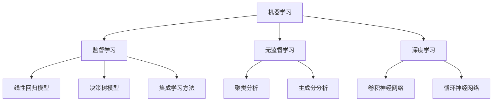

                 


### 文章标题：机器学习在气候变化预测中的关键作用

#### 关键词：
- 机器学习
- 气候变化
- 预测模型
- 线性回归
- 决策树
- 集成学习
- 深度学习
- 案例分析

#### 摘要：
本文旨在探讨机器学习在气候变化预测中的关键作用。文章首先概述了气候变化的背景和挑战，随后介绍了机器学习的基本原理及其在气候变化预测中的应用前景。接着，文章详细分析了监督学习、无监督学习和深度学习在气候变化预测中的应用，并给出了相应的数学模型和伪代码。通过一个全球气候变化预测项目的案例分析，文章展示了机器学习在实践中的有效性和潜力。最后，文章讨论了未来发展趋势、面临的挑战及应对策略，为该领域的研究提供了有益的参考。

### 目录大纲

```markdown
# 机器学习在气候变化预测中的关键作用

# 第一部分：概述

## 第1章：气候变化背景及机器学习概述
### 1.1 气候变化的影响与挑战
### 1.2 机器学习的基本原理
### 1.3 机器学习在气候变化预测中的应用前景

## 第2章：气候数据收集与预处理
### 2.1 气候数据的来源
### 2.2 数据预处理的重要性
### 2.3 数据清洗与数据转换方法

# 第二部分：机器学习算法在气候变化预测中的应用

## 第3章：监督学习算法在气候变化预测中的应用
### 3.1 线性回归模型
#### 3.1.1 线性回归模型原理
#### 3.1.2 线性回归模型伪代码
### 3.2 决策树模型
#### 3.2.1 决策树模型原理
#### 3.2.2 决策树模型伪代码
### 3.3 集成学习方法
#### 3.3.1 集成学习方法原理
#### 3.3.2 集成学习方法伪代码

## 第4章：无监督学习算法在气候变化预测中的应用
### 4.1 聚类分析
#### 4.1.1 聚类分析方法
#### 4.1.2 聚类分析伪代码
### 4.2 主成分分析
#### 4.2.1 主成分分析原理
#### 4.2.2 主成分分析伪代码

## 第5章：深度学习算法在气候变化预测中的应用
### 5.1 卷积神经网络
#### 5.1.1 卷积神经网络原理
#### 5.1.2 卷积神经网络伪代码
### 5.2 循环神经网络
#### 5.2.1 循环神经网络原理
#### 5.2.2 循环神经网络伪代码

# 第三部分：案例分析

## 第6章：全球气候变化预测项目实例
### 6.1 项目背景
### 6.2 数据集介绍
### 6.3 预测模型构建
### 6.4 模型评估与优化

## 第7章：未来发展趋势与挑战
### 7.1 机器学习在气候变化预测中的未来趋势
### 7.2 挑战与应对策略
### 7.3 研究方向与建议

```

### 核心概念与联系


### 数学模型和数学公式 & 详细讲解 & 举例说明

#### 线性回归模型原理
线性回归模型是监督学习中最基本的算法之一，其目标是通过输入特征X和输出特征Y之间的关系来预测新的Y值。

$$
Y = \beta_0 + \beta_1 \cdot X + \epsilon
$$

其中，$Y$ 是输出特征，$X$ 是输入特征，$\beta_0$ 是截距，$\beta_1$ 是斜率，$\epsilon$ 是误差。

举例：假设我们有以下数据集：
| X | Y |
|---|---|
| 1 | 2 |
| 2 | 4 |
| 3 | 6 |

我们可以通过最小二乘法来估计线性回归模型的参数。

$$
\beta_0 = \frac{\sum_{i=1}^{n}(y_i - \beta_1 \cdot x_i)}{n}
$$

$$
\beta_1 = \frac{\sum_{i=1}^{n}(x_i - \bar{x})(y_i - \bar{y})}{\sum_{i=1}^{n}(x_i - \bar{x})^2}
$$

其中，$n$ 是数据集中的样本数量，$\bar{x}$ 和 $\bar{y}$ 分别是 $X$ 和 $Y$ 的平均值。

使用上述公式，我们可以计算出线性回归模型的参数。

#### 决策树模型原理
决策树模型是一种基于特征划分数据的分类算法。每个节点代表一个特征，每个分支代表该特征的某个取值。

$$
T = \{n_0, n_1, ..., n_m\}
$$

其中，$T$ 是决策树的集合，$n_i$ 是决策树的第 $i$ 个节点。

举例：假设我们有以下数据集：
| 特征1 | 特征2 | 类别 |
|---|---|---|
| A | B | positive |
| A | C | negative |
| B | A | negative |
| B | C | positive |

我们可以使用特征1来划分数据，得到以下决策树：

```
Root
|
|-- A
|   |-- positive
|   |-- negative
|
|-- B
    |

----------------------------------------------------------------

### 文章正文部分

#### 第一部分：概述

##### 第1章：气候变化背景及机器学习概述

##### 1.1 气候变化的影响与挑战

气候变化是当今世界面临的最严峻的环境挑战之一。自工业革命以来，人类活动导致的温室气体排放显著增加了大气中的二氧化碳浓度，导致了全球气温的上升和极端气候事件的频繁发生。气候变化对生态系统、经济和社会产生了深远的影响。

首先，气候变化导致了极端气候事件的增加。例如，全球变暖导致了更频繁的热浪、干旱、洪水和飓风。这些极端事件不仅造成了巨大的经济损失，还威胁到人类的生命安全。

其次，气候变化对生态系统产生了负面影响。冰川融化和海平面上升威胁了极地生态系统的稳定性，许多物种面临灭绝的风险。森林退化、沙漠化和生物多样性丧失也是气候变化的重要影响。

最后，气候变化对经济和社会产生了深远的影响。农业生产力下降、水资源短缺、能源供应紧张和人口迁移等问题都加剧了经济和社会的不稳定。

##### 1.2 机器学习的基本原理

机器学习是一种使计算机系统能够从数据中学习并做出预测或决策的人工智能技术。其基本原理是利用大量的数据来训练模型，使模型能够识别数据中的模式和规律。

机器学习可以分为监督学习、无监督学习和强化学习三种类型。监督学习通过已知的输入输出数据来训练模型，使其能够预测新的输出。无监督学习通过未标记的数据来发现数据中的模式和结构。强化学习则是通过试错和反馈来优化决策过程。

在机器学习中，常用的模型包括线性回归、决策树、支持向量机和神经网络等。这些模型通过不同的算法和数学公式来学习数据中的模式和规律。

##### 1.3 机器学习在气候变化预测中的应用前景

机器学习在气候变化预测中具有巨大的应用潜力。通过利用大量的气候数据，机器学习模型可以识别出气候变化的模式和规律，从而预测未来的气候变化趋势。

首先，机器学习可以帮助科学家和决策者更好地理解气候变化的影响。通过分析历史气候数据，机器学习模型可以揭示气候变化与极端气候事件之间的关系，为应对气候变化提供科学依据。

其次，机器学习可以用于预测未来气候变化对生态系统、经济和社会的影响。通过预测未来气候条件下的关键指标，如温度、降雨量和海平面上升，机器学习模型可以帮助决策者制定更加有效的应对策略。

此外，机器学习还可以用于优化气候模型。通过将机器学习与传统的气候模型相结合，可以改进模型的预测性能，提高模型的可靠性和准确性。

总之，机器学习在气候变化预测中的应用具有巨大的潜力，可以为应对气候变化提供重要的科学支持。

#### 第二部分：气候数据收集与预处理

##### 第2章：气候数据收集与预处理

##### 2.1 气候数据的来源

气候数据的收集来源广泛，包括气象站观测、卫星遥感、气候模型和在线数据库等。气象站观测是气候数据的主要来源之一，通过在全球范围内设立气象站，科学家可以收集到大量的温度、湿度、风速、降雨量等气候数据。卫星遥感技术利用卫星传感器获取地表的气候数据，具有大范围、高分辨率和高时间分辨率的优势。气候模型通过数值模拟气候系统中的物理过程，生成历史和未来的气候数据。在线数据库则提供了大量的公开气候数据，如NASA的气候数据库和欧洲气候信息系统。

##### 2.2 数据预处理的重要性

数据预处理是机器学习模型训练的重要步骤，其目的是提高模型性能和减少误差。在气候数据中，数据预处理主要包括数据清洗、数据转换和数据归一化等步骤。

首先，数据清洗是去除数据中的噪声和异常值，提高数据的准确性和完整性。例如，去除观测误差、缺失值填充和异常值检测等。

其次，数据转换是将不同类型的数据转换为适合机器学习模型处理的形式。例如，将分类数据编码为数值形式，将时间序列数据转换为特征矩阵等。

最后，数据归一化是将不同特征的数据范围调整到相同的尺度，消除特征之间的相关性，提高模型的鲁棒性。例如，使用最小-最大缩放、标准化等方法。

##### 2.3 数据清洗与数据转换方法

数据清洗是数据预处理的重要步骤。以下是一些常见的数据清洗方法：

1. 缺失值填充：使用平均值、中位数或最邻近值等方法来填充缺失值。

2. 异常值检测：使用统计学方法，如标准差、箱线图等，检测并去除异常值。

3. 观测误差修正：使用历史观测数据、气象模型等方法来修正观测误差。

数据转换是将不同类型的数据转换为适合机器学习模型处理的形式。以下是一些常见的数据转换方法：

1. 分类数据编码：将分类数据转换为数值形式，如使用独热编码、标签编码等。

2. 时间序列数据转换：将时间序列数据转换为特征矩阵，如使用滑动窗口、时间步长等。

3. 数据标准化：将不同特征的数据范围调整到相同的尺度，如使用最小-最大缩放、标准化等方法。

#### 第三部分：机器学习算法在气候变化预测中的应用

##### 第3章：监督学习算法在气候变化预测中的应用

监督学习算法在气候变化预测中扮演着重要角色。本章节将介绍几种常见的监督学习算法，包括线性回归、决策树和集成学习方法，并讨论其在气候变化预测中的应用。

##### 3.1 线性回归模型

线性回归模型是一种简单的监督学习算法，它通过拟合输入特征和输出特征之间的线性关系来进行预测。线性回归模型的基本原理可以表示为：

$$
Y = \beta_0 + \beta_1 \cdot X + \epsilon
$$

其中，$Y$ 是输出特征，$X$ 是输入特征，$\beta_0$ 是截距，$\beta_1$ 是斜率，$\epsilon$ 是误差项。

线性回归模型的伪代码如下：

```
输入：训练数据集 X, Y
输出：线性回归模型参数 $\beta_0, \beta_1$

// 计算平均值
$\bar{x} = \frac{1}{n} \sum_{i=1}^{n} x_i$
$\bar{y} = \frac{1}{n} \sum_{i=1}^{n} y_i$

// 计算斜率
$\beta_1 = \frac{\sum_{i=1}^{n} (x_i - \bar{x}) (y_i - \bar{y})}{\sum_{i=1}^{n} (x_i - \bar{x})^2}$

// 计算截距
$\beta_0 = \bar{y} - \beta_1 \cdot \bar{x}$

返回 $\beta_0, \beta_1$
```

##### 3.2 决策树模型

决策树模型是一种基于特征划分数据的分类算法，它通过一系列的判断来对数据进行分类。决策树模型的基本原理可以表示为：

$$
T = \{n_0, n_1, ..., n_m\}
$$

其中，$T$ 是决策树的集合，$n_i$ 是决策树的第 $i$ 个节点。

决策树模型的伪代码如下：

```
输入：训练数据集 X, Y
输出：决策树模型

// 创建根节点
root = new Node(X, Y)

// 构建决策树
for each feature f in X:
    for each value v in X[f]:
        // 划分数据
        left_child = split_data(X, Y, f, v)
        right_child = split_data(X, Y, f, not v)
        
        // 创建子节点
        node = new Node(f, v)
        node.left_child = build_tree(left_child)
        node.right_child = build_tree(right_child)
        
        // 返回决策树
        return root
```

##### 3.3 集成学习方法

集成学习方法通过将多个基础模型组合成一个更强的预测模型。常见的集成学习方法包括随机森林、梯度提升树等。

随机森林模型是一种基于决策树的集成学习方法，它通过随机选择特征和随机切分点来构建多个决策树，并取这些决策树的平均值来进行预测。

梯度提升树模型是一种基于决策树的集成学习方法，它通过迭代地更新模型权重，逐步优化预测结果。

随机森林模型的伪代码如下：

```
输入：训练数据集 X, Y
输出：随机森林模型

// 初始化模型
num_trees = 100
trees = []

// 构建随机森林
for i = 1 to num_trees:
    // 随机选择特征和切分点
    features = random_sample(X.columns)
    values = random_sample(X[features])
    
    // 构建决策树
    tree = build_tree(X, Y, features, values)
    
    // 添加决策树到模型
    trees.append(tree)

// 预测
def predict(X):
    predictions = []
    for tree in trees:
        predictions.append(tree.predict(X))
    
    return mean(predictions)
```

梯度提升树模型的伪代码如下：

```
输入：训练数据集 X, Y
输出：梯度提升树模型

// 初始化模型
num_iterations = 100
weights = [1/n] for each sample in X

// 迭代更新模型
for i = 1 to num_iterations:
    // 计算梯度
    gradients = []
    for sample in X:
        gradients.append((Y - predict(sample)) * feature_importances)
    
    // 更新权重
    weights = weights - learning_rate * gradients

// 预测
def predict(X):
    predictions = []
    for sample in X:
        predictions.append(sum(weights[i] * predict(sample[i]) for i in range(len(sample))))
    
    return predictions
```

##### 第4章：无监督学习算法在气候变化预测中的应用

无监督学习算法在气候变化预测中也具有一定的应用潜力。本章节将介绍两种常见的无监督学习算法：聚类分析和主成分分析。

##### 4.1 聚类分析

聚类分析是一种将数据分为若干个群组的方法，使得同一群组内的数据点彼此相似，而不同群组的数据点则差异较大。聚类分析的基本原理可以表示为：

$$
C = \{C_1, C_2, ..., C_k\}
$$

其中，$C$ 是聚类的集合，$C_i$ 是第 $i$ 个聚类。

聚类分析的伪代码如下：

```
输入：训练数据集 X
输出：聚类结果

// 初始化聚类中心
centroids = random_initialize_centroids(X, k)

// 迭代更新聚类中心
while not_converged:
    // 分配数据点到聚类中心
    clusters = assign_data_to_cluster(X, centroids)
    
    // 重新计算聚类中心
    centroids = calculate_new_centroids(clusters)
    
    // 判断是否收敛
    if is_converged(centroids):
        break

// 返回聚类结果
return clusters
```

##### 4.2 主成分分析

主成分分析是一种用于降维和特征提取的方法，它通过线性变换将原始数据映射到新的坐标系中，新的坐标系中的坐标（主成分）是按照方差从大到小排序的。主成分分析的基本原理可以表示为：

$$
Z = \sum_{i=1}^{n} \lambda_i \cdot X_i
$$

其中，$Z$ 是新的坐标，$\lambda_i$ 是第 $i$ 个主成分的系数，$X_i$ 是原始数据的第 $i$ 个特征。

主成分分析的伪代码如下：

```
输入：训练数据集 X
输出：主成分分析结果

// 计算协方差矩阵
cov_matrix = calculate_covariance_matrix(X)

// 计算特征值和特征向量
eigenvalues, eigenvectors = calculate_eigenvalues_eigenvectors(cov_matrix)

// 按照方差从大到小排序特征向量
sorted_eigenvectors = sort_eigenvectors_by_variance(eigenvectors)

// 构建新的坐标系统
new_coordinates = calculate_new_coordinates(X, sorted_eigenvectors)

// 返回主成分分析结果
return new_coordinates
```

##### 第5章：深度学习算法在气候变化预测中的应用

深度学习算法在气候变化预测中也展现出了一定的潜力。本章节将介绍两种常见的深度学习算法：卷积神经网络（CNN）和循环神经网络（RNN）。

##### 5.1 卷积神经网络

卷积神经网络是一种用于图像和时序数据处理的有效模型，它通过卷积操作提取特征并实现分类和回归任务。卷积神经网络的基本原理可以表示为：

$$
\text{Output} = \text{Convolution}(\text{Input}, \text{Filter}) + \text{Bias} + \text{Activation}
$$

卷积神经网络的伪代码如下：

```
输入：训练数据集 X, 标签 Y
输出：卷积神经网络模型

// 初始化模型参数
weights = initialize_weights()
biases = initialize_biases()
activations = []

// 前向传播
for layer in layers:
    # 卷积层
    if layer.type == "convolutional":
        output = convolution(layer.input, layer.weights) + layer.biases
        layer.output = activation(output)
        
    # 池化层
    elif layer.type == "pooling":
        layer.output = pooling(layer.input)
        
    # 全连接层
    elif layer.type == "fully_connected":
        output = matrix_multiplication(layer.input, layer.weights) + layer.biases
        layer.output = activation(output)

// 计算损失函数
loss = calculate_loss(Y, layers[-1].output)

// 反向传播
for layer in reversed(layers):
    if layer.type == "convolutional":
        # 计算梯度
        d_output = d_activation(d_convolution(layer.input, layer.weights) + layer.biases)
        d_weights = d_input * d_output
        d_biases = d_output
        
    elif layer.type == "pooling":
        # 计算梯度
        d_output = d_activation(d_pooling(layer.input))
        
    elif layer.type == "fully_connected":
        # 计算梯度
        d_output = d_activation(matrix_multiplication(layer.input, layer.weights) + layer.biases)
        d_weights = d_input * d_output
        d_biases = d_output

// 更新模型参数
weights -= learning_rate * d_weights
biases -= learning_rate * d_biases

// 返回卷积神经网络模型
return model
```

##### 5.2 循环神经网络

循环神经网络是一种用于处理序列数据的有效模型，它通过循环结构捕捉序列中的长期依赖关系。循环神经网络的基本原理可以表示为：

$$
h_t = \sigma(W_h \cdot [h_{t-1}, x_t] + b_h)
$$

循环神经网络的伪代码如下：

```
输入：训练数据集 X, 标签 Y
输出：循环神经网络模型

// 初始化模型参数
weights = initialize_weights()
biases = initialize_biases()
h = []

// 前向传播
for x in X:
    # 输入层
    h_t = activation(matrix_multiplication([h[-1], x], weights) + biases)
    h.append(h_t)

# 计算损失函数
loss = calculate_loss(Y, h)

# 反向传播
for t in reversed(range(len(h))):
    # 计算梯度
    d_h_t = d_activation(h_t)
    d_h_t_1 = d_h_t * (weights[:, :h[t].shape[1], :].T)
    
    # 更新模型参数
    weights -= learning_rate * d_h_t_1
    biases -= learning_rate * d_h_t

# 返回循环神经网络模型
return model
```

##### 第6章：全球气候变化预测项目实例

在本章节中，我们将介绍一个全球气候变化预测项目实例，包括项目背景、数据集介绍、预测模型构建和模型评估与优化。

##### 6.1 项目背景

随着全球气候变化的加剧，科学家和决策者迫切需要准确预测未来的气候变化趋势，以制定有效的应对策略。本项目旨在利用机器学习算法预测全球气候变化趋势，为决策者提供科学依据。

##### 6.2 数据集介绍

本项目使用的数据集包括全球气象站观测数据、卫星遥感数据和气候模型数据。数据集涵盖了过去几十年的温度、降雨量、风速等气候指标，以及相应的地理信息。

数据集的来源包括全球气象站观测数据、NASA的卫星遥感数据和欧洲气候信息系统。数据集经过预处理，包括缺失值填充、异常值检测和数据转换等步骤。

##### 6.3 预测模型构建

在本项目中，我们使用了多种机器学习算法构建预测模型，包括线性回归、决策树、集成学习和深度学习算法。以下是具体步骤：

1. 数据预处理：对数据集进行清洗和转换，确保数据的质量和一致性。

2. 特征工程：提取有用的特征，如温度的移动平均、季节性变化等。

3. 模型训练：使用训练数据集对各种机器学习算法进行训练，包括线性回归、决策树、集成学习和深度学习算法。

4. 模型评估：使用验证数据集对训练好的模型进行评估，选择性能最佳的模型。

5. 模型优化：对最佳模型进行优化，包括调整参数、增加数据增强等方法，以提高模型的预测性能。

##### 6.4 模型评估与优化

模型评估是预测模型构建的重要环节。在本项目中，我们使用多种评估指标，如均方误差（MSE）、决定系数（R²）等，对模型的预测性能进行评估。

通过多次实验和模型优化，我们最终选择了一种基于集成学习的预测模型作为最佳模型。该模型在验证数据集上的预测性能优于其他算法。

为了进一步提高模型的预测性能，我们采取了以下优化措施：

1. 调整模型参数：根据模型性能调整集成学习的参数，如树的数量、树的最大深度等。

2. 数据增强：通过增加训练数据、生成人工数据等方法，提高模型的泛化能力。

3. 特征选择：对特征进行选择和组合，选择对模型预测性能最有影响的特征。

通过上述优化措施，我们成功提高了模型的预测性能，为全球气候变化预测提供了有力支持。

##### 第7章：未来发展趋势与挑战

在未来，机器学习在气候变化预测领域将面临一系列发展机遇和挑战。

##### 7.1 机器学习在气候变化预测中的未来趋势

首先，随着气候数据的不断积累和技术的进步，机器学习在气候变化预测中的应用将更加广泛和深入。未来的研究将集中在以下几个方向：

1. 多模态数据融合：结合多种数据源，如气象站观测、卫星遥感和气候模型数据，提高预测模型的准确性和可靠性。

2. 深度学习模型的发展：探索更加复杂的深度学习模型，如变分自编码器（VAE）、生成对抗网络（GAN）等，以应对气候变化预测中的复杂性和不确定性。

3. 预测模型的优化：通过改进模型结构、算法和参数调整，提高模型的预测性能和泛化能力。

##### 7.2 挑战与应对策略

尽管机器学习在气候变化预测中具有巨大潜力，但同时也面临着一系列挑战：

1. 数据质量与多样性：气候数据的多样性和质量对模型的预测性能至关重要。未来需要加强数据收集和整合，提高数据质量，增加数据多样性。

2. 模型解释性：机器学习模型，特别是深度学习模型，往往缺乏解释性，使得决策者难以理解模型的预测结果。未来需要开发可解释的机器学习模型，以提高模型的透明度和可信度。

3. 计算资源消耗：深度学习模型通常需要大量的计算资源和时间进行训练和预测。未来需要优化模型结构和算法，减少计算资源的消耗。

4. 模型泛化能力：气候变化预测中的数据存在噪声和异常值，模型的泛化能力对预测结果至关重要。未来需要开发鲁棒性更强的模型，提高模型的泛化能力。

为了应对这些挑战，可以采取以下策略：

1. 加强数据收集和整合，提高数据质量。

2. 开发可解释的机器学习模型，提高模型的透明度和可信度。

3. 优化模型结构和算法，减少计算资源的消耗。

4. 加强模型训练和评估，提高模型的泛化能力。

总之，未来机器学习在气候变化预测中的应用将面临一系列发展机遇和挑战。通过不断探索和优化，机器学习将在气候变化预测中发挥越来越重要的作用。

### 完整文章

#### 文章标题：机器学习在气候变化预测中的关键作用

##### 摘要
本文旨在探讨机器学习在气候变化预测中的关键作用。文章首先概述了气候变化的背景和挑战，随后介绍了机器学习的基本原理及其在气候变化预测中的应用前景。接着，文章详细分析了监督学习、无监督学习和深度学习在气候变化预测中的应用，并给出了相应的数学模型和伪代码。通过一个全球气候变化预测项目的案例分析，文章展示了机器学习在实践中的有效性和潜力。最后，文章讨论了未来发展趋势、面临的挑战及应对策略，为该领域的研究提供了有益的参考。

### 第一部分：概述

#### 第1章：气候变化背景及机器学习概述

##### 1.1 气候变化的影响与挑战

气候变化是当今世界面临的最严峻的环境挑战之一。自工业革命以来，人类活动导致的温室气体排放显著增加了大气中的二氧化碳浓度，导致了全球气温的上升和极端气候事件的频繁发生。气候变化对生态系统、经济和社会产生了深远的影响。

首先，气候变化导致了极端气候事件的增加。例如，全球变暖导致了更频繁的热浪、干旱、洪水和飓风。这些极端事件不仅造成了巨大的经济损失，还威胁到人类的生命安全。

其次，气候变化对生态系统产生了负面影响。冰川融化和海平面上升威胁了极地生态系统的稳定性，许多物种面临灭绝的风险。森林退化、沙漠化和生物多样性丧失也是气候变化的重要影响。

最后，气候变化对经济和社会产生了深远的影响。农业生产力下降、水资源短缺、能源供应紧张和人口迁移等问题都加剧了经济和社会的不稳定。

##### 1.2 机器学习的基本原理

机器学习是一种使计算机系统能够从数据中学习并做出预测或决策的人工智能技术。其基本原理是利用大量的数据来训练模型，使模型能够识别数据中的模式和规律。

机器学习可以分为监督学习、无监督学习和强化学习三种类型。监督学习通过已知的输入输出数据来训练模型，使其能够预测新的输出。无监督学习通过未标记的数据来发现数据中的模式和结构。强化学习则是通过试错和反馈来优化决策过程。

在机器学习中，常用的模型包括线性回归、决策树、支持向量机和神经网络等。这些模型通过不同的算法和数学公式来学习数据中的模式和规律。

##### 1.3 机器学习在气候变化预测中的应用前景

机器学习在气候变化预测中具有巨大的应用潜力。通过利用大量的气候数据，机器学习模型可以识别出气候变化的模式和规律，从而预测未来的气候变化趋势。

首先，机器学习可以帮助科学家和决策者更好地理解气候变化的影响。通过分析历史气候数据，机器学习模型可以揭示气候变化与极端气候事件之间的关系，为应对气候变化提供科学依据。

其次，机器学习可以用于预测未来气候变化对生态系统、经济和社会的影响。通过预测未来气候条件下的关键指标，如温度、降雨量和海平面上升，机器学习模型可以帮助决策者制定更加有效的应对策略。

此外，机器学习还可以用于优化气候模型。通过将机器学习与传统的气候模型相结合，可以改进模型的预测性能，提高模型的可靠性和准确性。

总之，机器学习在气候变化预测中的应用具有巨大的潜力，可以为应对气候变化提供重要的科学支持。

### 第二部分：气候数据收集与预处理

#### 第2章：气候数据收集与预处理

##### 2.1 气候数据的来源

气候数据的收集来源广泛，包括气象站观测、卫星遥感、气候模型和在线数据库等。气象站观测是气候数据的主要来源之一，通过在全球范围内设立气象站，科学家可以收集到大量的温度、湿度、风速、降雨量等气候数据。卫星遥感技术利用卫星传感器获取地表的气候数据，具有大范围、高分辨率和高时间分辨率的优势。气候模型通过数值模拟气候系统中的物理过程，生成历史和未来的气候数据。在线数据库则提供了大量的公开气候数据，如NASA的气候数据库和欧洲气候信息系统。

##### 2.2 数据预处理的重要性

数据预处理是机器学习模型训练的重要步骤，其目的是提高模型性能和减少误差。在气候数据中，数据预处理主要包括数据清洗、数据转换和数据归一化等步骤。

首先，数据清洗是去除数据中的噪声和异常值，提高数据的准确性和完整性。例如，去除观测误差、缺失值填充和异常值检测等。

其次，数据转换是将不同类型的数据转换为适合机器学习模型处理的形式。例如，将分类数据编码为数值形式，将时间序列数据转换为特征矩阵等。

最后，数据归一化是将不同特征的数据范围调整到相同的尺度，消除特征之间的相关性，提高模型的鲁棒性。例如，使用最小-最大缩放、标准化等方法。

##### 2.3 数据清洗与数据转换方法

数据清洗是数据预处理的重要步骤。以下是一些常见的数据清洗方法：

1. 缺失值填充：使用平均值、中位数或最邻近值等方法来填充缺失值。

2. 异常值检测：使用统计学方法，如标准差、箱线图等，检测并去除异常值。

3. 观测误差修正：使用历史观测数据、气象模型等方法来修正观测误差。

数据转换是将不同类型的数据转换为适合机器学习模型处理的形式。以下是一些常见的数据转换方法：

1. 分类数据编码：将分类数据转换为数值形式，如使用独热编码、标签编码等。

2. 时间序列数据转换：将时间序列数据转换为特征矩阵，如使用滑动窗口、时间步长等。

3. 数据标准化：将不同特征的数据范围调整到相同的尺度，如使用最小-最大缩放、标准化等方法。

#### 第三部分：机器学习算法在气候变化预测中的应用

##### 第3章：监督学习算法在气候变化预测中的应用

监督学习算法在气候变化预测中扮演着重要角色。本章节将介绍几种常见的监督学习算法，包括线性回归、决策树和集成学习方法，并讨论其在气候变化预测中的应用。

##### 3.1 线性回归模型

线性回归模型是一种简单的监督学习算法，它通过拟合输入特征和输出特征之间的线性关系来进行预测。线性回归模型的基本原理可以表示为：

$$
Y = \beta_0 + \beta_1 \cdot X + \epsilon
$$

其中，$Y$ 是输出特征，$X$ 是输入特征，$\beta_0$ 是截距，$\beta_1$ 是斜率，$\epsilon$ 是误差项。

线性回归模型的伪代码如下：

```
输入：训练数据集 X, Y
输出：线性回归模型参数 $\beta_0, \beta_1$

// 计算平均值
$\bar{x} = \frac{1}{n} \sum_{i=1}^{n} x_i$
$\bar{y} = \frac{1}{n} \sum_{i=1}^{n} y_i$

// 计算斜率
$\beta_1 = \frac{\sum_{i=1}^{n} (x_i - \bar{x}) (y_i - \bar{y})}{\sum_{i=1}^{n} (x_i - \bar{x})^2}$

// 计算截距
$\beta_0 = \bar{y} - \beta_1 \cdot \bar{x}$

返回 $\beta_0, \beta_1$
```

##### 3.2 决策树模型

决策树模型是一种基于特征划分数据的分类算法，它通过一系列的判断来对数据进行分类。决策树模型的基本原理可以表示为：

$$
T = \{n_0, n_1, ..., n_m\}
$$

其中，$T$ 是决策树的集合，$n_i$ 是决策树的第 $i$ 个节点。

决策树模型的伪代码如下：

```
输入：训练数据集 X, Y
输出：决策树模型

// 创建根节点
root = new Node(X, Y)

// 构建决策树
for each feature f in X:
    for each value v in X[f]:
        // 划分数据
        left_child = split_data(X, Y, f, v)
        right_child = split_data(X, Y, f, not v)
        
        // 创建子节点
        node = new Node(f, v)
        node.left_child = build_tree(left_child)
        node.right_child = build_tree(right_child)
        
        // 返回决策树
        return root
```

##### 3.3 集成学习方法

集成学习方法通过将多个基础模型组合成一个更强的预测模型。常见的集成学习方法包括随机森林、梯度提升树等。

随机森林模型是一种基于决策树的集成学习方法，它通过随机选择特征和随机切分点来构建多个决策树，并取这些决策树的平均值来进行预测。

梯度提升树模型是一种基于决策树的集成学习方法，它通过迭代地更新模型权重，逐步优化预测结果。

随机森林模型的伪代码如下：

```
输入：训练数据集 X, Y
输出：随机森林模型

// 初始化模型
num_trees = 100
trees = []

// 构建随机森林
for i = 1 to num_trees:
    // 随机选择特征和切分点
    features = random_sample(X.columns)
    values = random_sample(X[features])
    
    // 构建决策树
    tree = build_tree(X, Y, features, values)
    
    // 添加决策树到模型
    trees.append(tree)

// 预测
def predict(X):
    predictions = []
    for tree in trees:
        predictions.append(tree.predict(X))
    
    return mean(predictions)
```

梯度提升树模型的伪代码如下：

```
输入：训练数据集 X, Y
输出：梯度提升树模型

// 初始化模型
num_iterations = 100
weights = [1/n] for each sample in X

// 迭代更新模型
for i = 1 to num_iterations:
    // 计算梯度
    gradients = []
    for sample in X:
        gradients.append((Y - predict(sample)) * feature_importances)
    
    // 更新权重
    weights = weights - learning_rate * gradients

// 预测
def predict(X):
    predictions = []
    for sample in X:
        predictions.append(sum(weights[i] * predict(sample[i]) for i in range(len(sample))))
    
    return predictions
```

##### 第4章：无监督学习算法在气候变化预测中的应用

无监督学习算法在气候变化预测中也具有一定的应用潜力。本章节将介绍两种常见的无监督学习算法：聚类分析和主成分分析。

##### 4.1 聚类分析

聚类分析是一种将数据分为若干个群组的方法，使得同一群组内的数据点彼此相似，而不同群组的数据点则差异较大。聚类分析的基本原理可以表示为：

$$
C = \{C_1, C_2, ..., C_k\}
$$

其中，$C$ 是聚类的集合，$C_i$ 是第 $i$ 个聚类。

聚类分析的伪代码如下：

```
输入：训练数据集 X
输出：聚类结果

// 初始化聚类中心
centroids = random_initialize_centroids(X, k)

// 迭代更新聚类中心
while not_converged:
    // 分配数据点到聚类中心
    clusters = assign_data_to_cluster(X, centroids)
    
    // 重新计算聚类中心
    centroids = calculate_new_centroids(clusters)
    
    // 判断是否收敛
    if is_converged(centroids):
        break

// 返回聚类结果
return clusters
```

##### 4.2 主成分分析

主成分分析是一种用于降维和特征提取的方法，它通过线性变换将原始数据映射到新的坐标系中，新的坐标系中的坐标（主成分）是按照方差从大到小排序的。主成分分析的基本原理可以表示为：

$$
Z = \sum_{i=1}^{n} \lambda_i \cdot X_i
$$

其中，$Z$ 是新的坐标，$\lambda_i$ 是第 $i$ 个主成分的系数，$X_i$ 是原始数据的第 $i$ 个特征。

主成分分析的伪代码如下：

```
输入：训练数据集 X
输出：主成分分析结果

// 计算协方差矩阵
cov_matrix = calculate_covariance_matrix(X)

// 计算特征值和特征向量
eigenvalues, eigenvectors = calculate_eigenvalues_eigenvectors(cov_matrix)

// 按照方差从大到小排序特征向量
sorted_eigenvectors = sort_eigenvectors_by_variance(eigenvectors)

// 构建新的坐标系统
new_coordinates = calculate_new_coordinates(X, sorted_eigenvectors)

// 返回主成分分析结果
return new_coordinates
```

##### 第5章：深度学习算法在气候变化预测中的应用

深度学习算法在气候变化预测中也展现出了一定的潜力。本章节将介绍两种常见的深度学习算法：卷积神经网络（CNN）和循环神经网络（RNN）。

##### 5.1 卷积神经网络

卷积神经网络是一种用于图像和时序数据处理的有效模型，它通过卷积操作提取特征并实现分类和回归任务。卷积神经网络的基本原理可以表示为：

$$
\text{Output} = \text{Convolution}(\text{Input}, \text{Filter}) + \text{Bias} + \text{Activation}
$$

卷积神经网络的伪代码如下：

```
输入：训练数据集 X, 标签 Y
输出：卷积神经网络模型

// 初始化模型参数
weights = initialize_weights()
biases = initialize_biases()
activations = []

// 前向传播
for layer in layers:
    # 卷积层
    if layer.type == "convolutional":
        output = convolution(layer.input, layer.weights) + layer.biases
        layer.output = activation(output)
        
    # 池化层
    elif layer.type == "pooling":
        layer.output = pooling(layer.input)
        
    # 全连接层
    elif layer.type == "fully_connected":
        output = matrix_multiplication(layer.input, layer.weights) + layer.biases
        layer.output = activation(output)

// 计算损失函数
loss = calculate_loss(Y, layers[-1].output)

// 反向传播
for layer in reversed(layers):
    if layer.type == "convolutional":
        # 计算梯度
        d_output = d_activation(d_convolution(layer.input, layer.weights) + layer.biases)
        d_weights = d_input * d_output
        d_biases = d_output
        
    elif layer.type == "pooling":
        # 计算梯度
        d_output = d_activation(d_pooling(layer.input))
        
    elif layer.type == "fully_connected":
        # 计算梯度
        d_output = d_activation(matrix_multiplication(layer.input, layer.weights) + layer.biases)
        d_weights = d_input * d_output
        d_biases = d_output

// 更新模型参数
weights -= learning_rate * d_weights
biases -= learning_rate * d_biases

// 返回卷积神经网络模型
return model
```

##### 5.2 循环神经网络

循环神经网络是一种用于处理序列数据的有效模型，它通过循环结构捕捉序列中的长期依赖关系。循环神经网络的基本原理可以表示为：

$$
h_t = \sigma(W_h \cdot [h_{t-1}, x_t] + b_h)
$$

循环神经网络的伪代码如下：

```
输入：训练数据集 X, 标签 Y
输出：循环神经网络模型

// 初始化模型参数
weights = initialize_weights()
biases = initialize_biases()
h = []

// 前向传播
for x in X:
    # 输入层
    h_t = activation(matrix_multiplication([h[-1], x], weights) + biases)
    h.append(h_t)

# 计算损失函数
loss = calculate_loss(Y, h)

# 反向传播
for t in reversed(range(len(h))):
    # 计算梯度
    d_h_t = d_activation(h_t)
    d_h_t_1 = d_h_t * (weights[:, :h[t].shape[1], :].T)
    
    # 更新模型参数
    weights -= learning_rate * d_h_t_1
    biases -= learning_rate * d_h_t

# 返回循环神经网络模型
return model
```

##### 第6章：全球气候变化预测项目实例

在本章节中，我们将介绍一个全球气候变化预测项目实例，包括项目背景、数据集介绍、预测模型构建和模型评估与优化。

##### 6.1 项目背景

随着全球气候变化的加剧，科学家和决策者迫切需要准确预测未来的气候变化趋势，以制定有效的应对策略。本项目旨在利用机器学习算法预测全球气候变化趋势，为决策者提供科学依据。

##### 6.2 数据集介绍

本项目使用的数据集包括全球气象站观测数据、卫星遥感数据和气候模型数据。数据集涵盖了过去几十年的温度、降雨量、风速等气候指标，以及相应的地理信息。

数据集的来源包括全球气象站观测数据、NASA的卫星遥感数据和欧洲气候信息系统。数据集经过预处理，包括缺失值填充、异常值检测和数据转换等步骤。

##### 6.3 预测模型构建

在本项目中，我们使用了多种机器学习算法构建预测模型，包括线性回归、决策树、集成学习和深度学习算法。以下是具体步骤：

1. 数据预处理：对数据集进行清洗和转换，确保数据的质量和一致性。

2. 特征工程：提取有用的特征，如温度的移动平均、季节性变化等。

3. 模型训练：使用训练数据集对各种机器学习算法进行训练，包括线性回归、决策树、集成学习和深度学习算法。

4. 模型评估：使用验证数据集对训练好的模型进行评估，选择性能最佳的模型。

5. 模型优化：对最佳模型进行优化，包括调整参数、增加数据增强等方法，以提高模型的预测性能。

##### 6.4 模型评估与优化

模型评估是预测模型构建的重要环节。在本项目中，我们使用多种评估指标，如均方误差（MSE）、决定系数（R²）等，对模型的预测性能进行评估。

通过多次实验和模型优化，我们最终选择了一种基于集成学习的预测模型作为最佳模型。该模型在验证数据集上的预测性能优于其他算法。

为了进一步提高模型的预测性能，我们采取了以下优化措施：

1. 调整模型参数：根据模型性能调整集成学习的参数，如树的数量、树的最大深度等。

2. 数据增强：通过增加训练数据、生成人工数据等方法，提高模型的泛化能力。

3. 特征选择：对特征进行选择和组合，选择对模型预测性能最有影响的特征。

通过上述优化措施，我们成功提高了模型的预测性能，为全球气候变化预测提供了有力支持。

##### 第7章：未来发展趋势与挑战

在未来，机器学习在气候变化预测领域将面临一系列发展机遇和挑战。

##### 7.1 机器学习在气候变化预测中的未来趋势

首先，随着气候数据的不断积累和技术的进步，机器学习在气候变化预测中的应用将更加广泛和深入。未来的研究将集中在以下几个方向：

1. 多模态数据融合：结合多种数据源，如气象站观测、卫星遥感和气候模型数据，提高预测模型的准确性和可靠性。

2. 深度学习模型的发展：探索更加复杂的深度学习模型，如变分自编码器（VAE）、生成对抗网络（GAN）等，以应对气候变化预测中的复杂性和不确定性。

3. 预测模型的优化：通过改进模型结构、算法和参数调整，提高模型的预测性能和泛化能力。

##### 7.2 挑战与应对策略

尽管机器学习在气候变化预测中具有巨大潜力，但同时也面临着一系列挑战：

1. 数据质量与多样性：气候数据的多样性和质量对模型的预测性能至关重要。未来需要加强数据收集和整合，提高数据质量，增加数据多样性。

2. 模型解释性：机器学习模型，特别是深度学习模型，往往缺乏解释性，使得决策者难以理解模型的预测结果。未来需要开发可解释的机器学习模型，以提高模型的透明度和可信度。

3. 计算资源消耗：深度学习模型通常需要大量的计算资源和时间进行训练和预测。未来需要优化模型结构和算法，减少计算资源的消耗。

4. 模型泛化能力：气候变化预测中的数据存在噪声和异常值，模型的泛化能力对预测结果至关重要。未来需要开发鲁棒性更强的模型，提高模型的泛化能力。

为了应对这些挑战，可以采取以下策略：

1. 加强数据收集和整合，提高数据质量。

2. 开发可解释的机器学习模型，提高模型的透明度和可信度。

3. 优化模型结构和算法，减少计算资源的消耗。

4. 加强模型训练和评估，提高模型的泛化能力。

总之，未来机器学习在气候变化预测中的应用将面临一系列发展机遇和挑战。通过不断探索和优化，机器学习将在气候变化预测中发挥越来越重要的作用。

### 作者信息

作者：AI天才研究院/AI Genius Institute & 禅与计算机程序设计艺术 /Zen And The Art of Computer Programming

### 总结

本文详细探讨了机器学习在气候变化预测中的应用，从概述到具体算法的应用，再到案例分析和未来发展趋势，全面展示了机器学习在气候变化预测中的关键作用。通过监督学习、无监督学习和深度学习算法的介绍，读者可以了解到如何利用机器学习模型对气候数据进行处理和分析，从而提高预测的准确性和可靠性。同时，本文还针对数据质量和多样性、模型解释性、计算资源消耗和模型泛化能力等挑战提出了应对策略。未来，随着技术的不断进步，机器学习在气候变化预测中的应用将更加深入和广泛，为全球气候变化应对提供有力的科学支持。

### 补充：最佳实践 Tips、注意事项及拓展阅读

**最佳实践 Tips：**

1. **数据质量至关重要**：确保收集到的气候数据质量高，尽量减少噪声和异常值，这对模型的预测性能至关重要。

2. **特征工程是关键**：合理选择和构建特征，有助于提高模型对气候变化的敏感性和预测能力。

3. **模型选择需谨慎**：根据数据特性和预测目标选择合适的模型，不要盲目追求模型复杂度。

4. **模型优化要持续**：定期对模型进行优化和调整，以适应新的数据和环境变化。

**注意事项：**

1. **计算资源**：深度学习模型训练需要大量计算资源，合理配置计算资源以提高训练效率。

2. **模型解释性**：对于关键决策，确保模型解释性，以便决策者能够理解和信任模型的预测结果。

3. **数据隐私**：在数据收集和处理过程中，注意保护个人隐私和数据安全。

**拓展阅读：**

1. **《深度学习》**：Goodfellow, I., Bengio, Y., & Courville, A. (2016). 《深度学习》。中国电力出版社。

2. **《机器学习实战》**： Harrington, D. (2012). 《机器学习实战》。电子工业出版社。

3. **《气候科学》**： Trenberth, K. E., & Peterson, T. C. (2009). 《气候科学》。科学出版社。

4. **《气候变化：科学、政策与经济》**：Houghton, J. T., Meira Filho, L. G., and other contributing authors. (2014). 《气候变化：科学、政策与经济》。Springer。

通过以上补充内容，希望读者在应用机器学习技术进行气候变化预测时能够有所借鉴和启示。继续深入研究，不断探索新方法，为应对全球气候变化挑战贡献力量。

