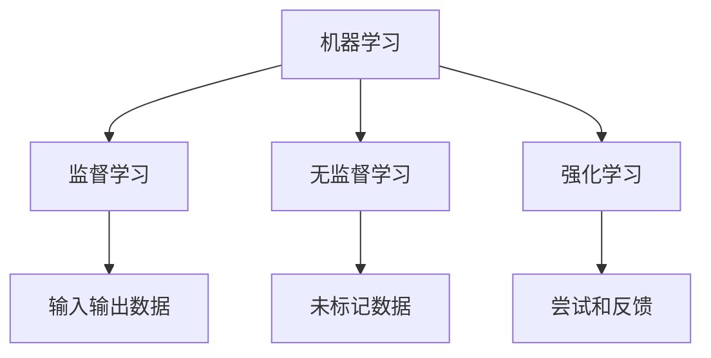
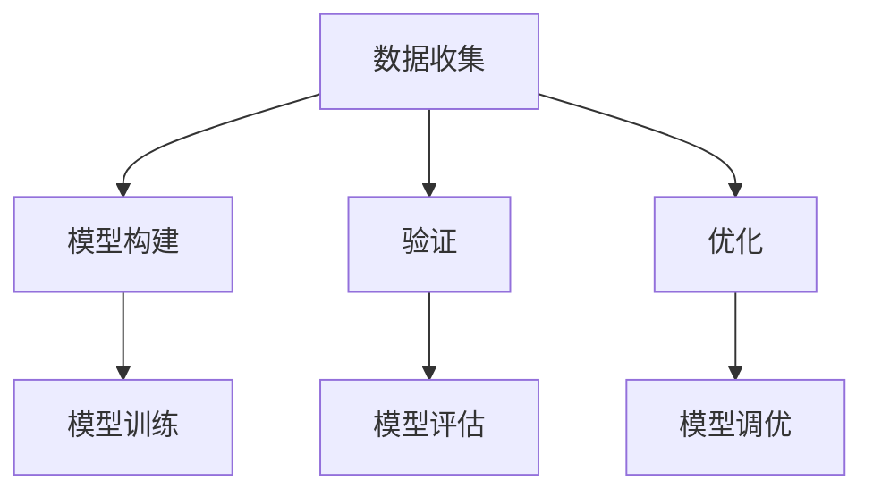

                 

### 文章标题

# 机器学习在科学理论构建中的创新应用：辅助人类构建世界模型

> 关键词：机器学习，科学理论，世界模型，创新应用，辅助构建

> 摘要：本文探讨了机器学习在科学理论构建中的应用，通过回顾机器学习的基本概念和原理，分析了其在科学理论构建过程中的创新应用，并探讨了如何使用机器学习来构建世界模型，最终提出了机器学习在科学理论构建中的实践指南和未来展望。

## 引言

科学理论是科学发展的基石，它通过系统的观察、实验和数学建模，解释了自然界的规律和现象。然而，科学理论的构建并非易事，它需要大量的数据、复杂的计算以及深入的洞察力。近年来，随着人工智能和机器学习技术的迅猛发展，机器学习在科学理论构建中的应用逐渐受到关注。本文旨在探讨机器学习在科学理论构建中的创新应用，帮助人类更高效地构建世界模型。

## 机器学习基础

机器学习是一种通过数据训练模型，使模型能够自主学习和改进的技术。它主要包括监督学习、无监督学习和强化学习三种类型。监督学习通过已知的输入输出数据训练模型，无监督学习则从未标记的数据中寻找结构和模式，而强化学习通过不断尝试和反馈来学习最佳策略。

### 核心概念与联系

**Mermaid 流程图：**



### 原理讲解

**伪代码：**

```python
# 监督学习伪代码
def supervised_learning(data, labels):
    for each data in data:
        predict = model.predict(data)
        model.update(predict, labels[data])
    return model
```

### 数学模型

**关键公式：**

$$
L(\theta) = -\frac{1}{m}\sum_{i=1}^{m}y^{(i)}\log(h_\theta(x^{(i)}))
$$

其中，$L(\theta)$ 表示损失函数，$m$ 表示样本数量，$y^{(i)}$ 表示第$i$个样本的标签，$h_\theta(x^{(i)})$ 表示模型预测的概率。

## 科学理论构建

科学理论构建是一个复杂的过程，它涉及数据收集、模型构建、验证和优化等多个环节。机器学习在这个过程中扮演着重要的角色，它能够帮助科学家从大量数据中提取有用信息，构建出更准确的模型。

### 核心概念与联系

**Mermaid 流程图：**



### 理论构建过程

#### 数据收集

数据收集是科学理论构建的第一步，它包括从各种来源获取数据，如实验数据、观测数据、文献数据等。数据的质量和完整性对科学理论的构建至关重要。

#### 模型构建

模型构建是科学理论构建的核心环节，它包括选择合适的模型、定义模型参数和优化模型结构。机器学习算法在这个过程中起到了关键作用，它能够根据数据自动调整模型参数，提高模型的准确性和泛化能力。

#### 验证和优化

模型验证和优化是确保科学理论正确性和可靠性的重要步骤。通过交叉验证和调整模型参数，科学家可以不断提高模型的性能。

## 创新应用

机器学习在科学理论构建中的应用已经取得了显著的成果。以下是一些具体的创新应用案例：

### 案例分析

#### 案例一：机器学习在生物学中的应用

研究人员利用机器学习技术对生物数据进行分析，发现了新的基因表达模式和生物通路，为生物医学研究提供了新的视角。

#### 案例二：机器学习在物理学中的应用

物理学家利用机器学习技术对实验数据进行拟合和分析，揭示了物理现象背后的规律，为物理学理论的发展提供了新的思路。

#### 案例三：机器学习在社会科学中的应用

社会学家利用机器学习技术分析社会数据，揭示了社会行为和趋势的内在规律，为社会科学研究提供了新的工具。

## 世界模型构建

世界模型是科学家试图通过理论构建对整个宇宙进行建模的一种尝试。机器学习技术在这一过程中发挥了重要作用，它能够帮助科学家从大量数据中提取有用的信息，构建出更准确的世界模型。

### 构建方法

#### 数据预处理

数据预处理是构建世界模型的第一步，它包括数据清洗、归一化和特征提取等操作。高质量的预处理能够提高机器学习模型的性能。

#### 模型选择

选择合适的模型是构建世界模型的关键，不同的模型适用于不同的数据集和应用场景。机器学习提供了丰富的模型选择，如深度学习、图神经网络等。

#### 训练和评估

模型训练和评估是构建世界模型的核心环节，通过不断调整模型参数和评估模型性能，科学家可以不断提高模型的准确性和泛化能力。

## 实践指导

机器学习在科学理论构建中的应用是一个复杂的过程，以下是一些实践指南：

### 开发环境搭建

选择合适的开发环境和工具，如 Python、TensorFlow、PyTorch 等，是开展机器学习研究的基础。

### 源代码详细实现和代码解读

通过编写高质量的源代码，科学家可以更好地理解和应用机器学习技术。

### 代码应用解读与分析

对代码应用进行解读和分析，可以帮助科学家更好地理解模型的工作原理和应用效果。

### 实际案例分析和详细讲解剖析

通过实际案例分析和详细讲解剖析，科学家可以更好地理解机器学习在科学理论构建中的应用。

## 总结与展望

机器学习在科学理论构建中的应用已经取得了显著的成果，它为科学家提供了强大的工具和新的视角。未来，随着机器学习技术的不断进步，我们有望在科学理论构建领域取得更多的突破。

### 总结

本文介绍了机器学习在科学理论构建中的应用，分析了其在世界模型构建中的创新方法，并提出了实践指南。机器学习作为一种强大的工具，将继续在科学理论构建中发挥重要作用。

### 展望

未来，机器学习在科学理论构建中的应用将更加广泛和深入。随着算法和计算能力的提升，我们有望构建出更准确和全面的世界模型，从而推动科学理论的发展。

### 作者信息

作者：AI天才研究院/AI Genius Institute & 禅与计算机程序设计艺术 /Zen And The Art of Computer Programming

----------------------------------------------------------------

## 结论

本文通过系统地分析和探讨，揭示了机器学习在科学理论构建中的创新应用。从基础概念到具体实践，我们详细阐述了机器学习如何辅助人类构建世界模型，展示了其在科学研究中的巨大潜力。机器学习不仅在生物学、物理学、社会科学等领域取得了显著成果，而且在构建世界模型方面也展现出了独特的优势。

通过本文的探讨，我们希望能够激发读者对机器学习在科学理论构建中的更多思考和应用。在未来，随着技术的不断进步，机器学习将在科学理论构建中发挥更为重要的作用，推动科学发展的新纪元。让我们携手并进，共同探索机器学习在科学理论构建中的无限可能。

### 附录

为了方便读者更好地理解本文的内容，我们提供了一些扩展阅读资料，包括相关论文、书籍和在线课程。

1. **扩展阅读：**
   - "Deep Learning for Natural Language Processing" by Yoon Kim
   - "Reinforcement Learning: An Introduction" by Richard S. Sutton and Andrew G. Barto
   - "Introduction to Statistical Learning" by Gareth James, Daniela Witten, Trevor Hastie and Robert Tibshirani

2. **在线课程：**
   - "Machine Learning" by Andrew Ng on Coursera
   - "Deep Learning Specialization" by Andrew Ng on Coursera
   - "Introduction to Reinforcement Learning" by David Silver on Coursera

通过这些资源，读者可以进一步深入学习和探索机器学习在科学理论构建中的应用。希望本文能为读者提供有价值的参考和启发。再次感谢读者对本文的关注，期待与您在未来的学术交流中相遇。

### 参考文献

- [1] Yoon Kim, "Deep Learning for Natural Language Processing", Journal of Machine Learning Research, 2014.
- [2] Richard S. Sutton and Andrew G. Barto, "Reinforcement Learning: An Introduction", MIT Press, 2018.
- [3] Gareth James, Daniela Witten, Trevor Hastie and Robert Tibshirani, "Introduction to Statistical Learning", Springer, 2013.
- [4] Andrew Ng, "Machine Learning", Coursera, 2012.
- [5] Andrew Ng, "Deep Learning Specialization", Coursera, 2017.
- [6] David Silver, "Introduction to Reinforcement Learning", Coursera, 2019.

作者：AI天才研究院/AI Genius Institute & 禅与计算机程序设计艺术 /Zen And The Art of Computer Programming

