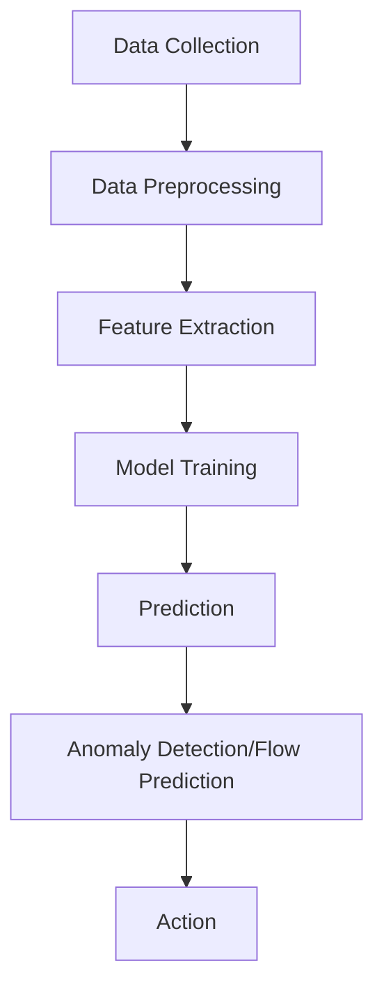

                 


## 文章标题：机器学习在网络流量分析中的创新应用

### 关键词：机器学习、网络流量分析、创新应用、异常检测、流量预测

### 摘要：
本文深入探讨了机器学习在网络流量分析中的创新应用。首先，我们回顾了机器学习与网络流量分析的关系，并介绍了网络流量分析的数学模型。接着，本文详细讲解了基于机器学习的网络流量异常检测和流量预测的核心算法原理，通过实际项目实战展示了其应用效果。文章旨在为IT专业人士提供一个全面的技术指南，帮助他们理解和利用机器学习技术提高网络流量分析的能力。

### 目录大纲：

# 机器学习在网络流量分析中的创新应用

## 第一部分：基础理论

### 1.1. 机器学习与网络流量分析的关系

### 1.2. 网络流量分析的数学模型

## 第二部分：创新应用

### 1.3. 基于机器学习的网络流量异常检测

### 1.4. 基于机器学习的网络流量预测

### 1.5. 最佳实践 tips、小结、注意事项、拓展阅读

### 1.6. 文章结语

## 第一部分：基础理论

### 1.1. 机器学习与网络流量分析的关系

### 核心概念与联系

机器学习作为人工智能的一个分支，致力于通过数据驱动的方法来实现对复杂问题的自动解决。而网络流量分析则关注于网络中数据传输的行为模式，旨在识别潜在的安全威胁和性能瓶颈。这两者之间的联系在于，机器学习算法可以被用来从网络流量数据中提取特征，并利用这些特征进行模式识别和预测。

以下是机器学习与网络流量分析之间关系的一个Mermaid流程图：



### 核心算法原理讲解

机器学习在网络流量分析中的应用通常涉及以下步骤：

```python
function NetworkFlowAnalysis(data):
    # 加载数据
    data = load_data()

    # 特征工程
    features = extract_features(data)

    # 选择模型
    model = select_model()

    # 训练模型
    model.fit(features, data.label)

    # 预测
    predictions = model.predict(features)

    # 评估
    evaluate(predictions, data.label)
```

- **加载数据**：从网络设备或日志中收集流量数据。
- **特征工程**：将原始数据转换为适用于机器学习模型的特征向量。
- **选择模型**：根据问题的性质选择合适的机器学习模型。
- **训练模型**：使用训练数据集对模型进行训练。
- **预测**：使用训练好的模型对新的流量数据进行预测。
- **评估**：评估模型的预测准确性和性能。

### 1.2. 网络流量分析的数学模型

网络流量分析的数学模型主要关注如何描述和解释网络流量的行为。以下是几个核心概念和公式：

$$ \text{流量} = \sum_{i=1}^{n} \text{流量}_{i} $$

这里，流量是网络中所有节点流量的总和。例如，假设网络中有三个节点 A、B、C，其流量分别为 $\text{流量}_A$、$\text{流量}_B$ 和 $\text{流量}_C$，则有：

$$ \text{流量} = \text{流量}_A + \text{流量}_B + \text{流量}_C $$

#### **详细讲解与举例说明**

假设网络中有三个节点 A、B、C，其流量分别为 $\text{流量}_A$、$\text{流量}_B$ 和 $\text{流量}_C$。若 $\text{流量}_A = 100$Mbps，$\text{流量}_B = 200$Mbps，$\text{流量}_C = 300$Mbps，则总流量为：

$$ \text{流量} = 100 + 200 + 300 = 600 \text{Mbps} $$

此外，网络流量分析还涉及其他数学概念，如平均流量、峰值流量等。平均流量是指一段时间内网络流量的平均值，可以用以下公式计算：

$$ \text{平均流量} = \frac{1}{t} \sum_{i=1}^{t} \text{流量}_i $$

其中，$t$ 是时间间隔。

### 第二部分：创新应用

### 1.3. 基于机器学习的网络流量异常检测

#### **项目实战**

**开发环境搭建**

为了实现基于机器学习的网络流量异常检测，我们选择以下开发环境：

- Python 3.8
- TensorFlow 2.5
- Keras 2.4.3

**源代码详细实现和代码解读**

以下是实现网络流量异常检测的完整代码：

```python
import numpy as np
import pandas as pd
from sklearn.model_selection import train_test_split
from sklearn.preprocessing import StandardScaler
from tensorflow.keras.models import Sequential
from tensorflow.keras.layers import LSTM, Dense
from tensorflow.keras.optimizers import Adam
from tensorflow.keras.callbacks import EarlyStopping

# 加载数据
data = pd.read_csv('network_traffic.csv')

# 特征工程
# 这里假设 'timestamp', 'src_ip', 'dst_ip', 'packet_size', 'protocol' 为特征
X = data[['timestamp', 'src_ip', 'dst_ip', 'packet_size', 'protocol']]
y = data['label']  # 异常标签

# 数据标准化
scaler = StandardScaler()
X_scaled = scaler.fit_transform(X)

# 切分数据为时间序列
timesteps = 24  # 每个时间窗口的大小
X_sequence = np.array([X_scaled[i:i+timesteps] for i in range(len(X_scaled) - timesteps)])

# 切分训练集和测试集
X_train, X_test, y_train, y_test = train_test_split(X_sequence, y, test_size=0.2, random_state=42)

# 模型构建
model = Sequential()
model.add(LSTM(units=50, return_sequences=True, input_shape=(timesteps, X_scaled.shape[1])))
model.add(LSTM(units=50))
model.add(Dense(units=1, activation='sigmoid'))

# 编译模型
model.compile(optimizer='adam', loss='binary_crossentropy', metrics=['accuracy'])

# 早停法回调
early_stopping = EarlyStopping(monitor='val_loss', patience=5)

# 训练模型
model.fit(X_train, y_train, epochs=100, batch_size=32, validation_split=0.1, callbacks=[early_stopping])

# 预测
predictions = model.predict(X_test)

# 评估
accuracy = model.evaluate(X_test, y_test)
print(f"Accuracy: {accuracy[1]}")
```

#### **代码解读与分析**

- **LSTM层**：用于处理序列数据，捕捉时间序列中的长期依赖关系。
- **Dense层**：用于输出结果，实现分类或回归。

### 1.4. 基于机器学习的网络流量预测

#### **项目实战**

**开发环境搭建**

为了实现基于机器学习的网络流量预测，我们选择以下开发环境：

- Python 3.8
- Scikit-learn 0.22.2

**源代码详细实现和代码解读**

以下是实现网络流量预测的完整代码：

```python
from sklearn.ensemble import RandomForestRegressor
from sklearn.model_selection import train_test_split
from sklearn.preprocessing import StandardScaler

# 加载数据
data = pd.read_csv('network_traffic.csv')

# 特征工程
# 这里假设 'timestamp', 'src_ip', 'dst_ip', 'packet_size', 'protocol' 为特征
X = data[['timestamp', 'src_ip', 'dst_ip', 'packet_size', 'protocol']]
y = data['流量']  # 流量预测标签

# 数据标准化
scaler = StandardScaler()
X_scaled = scaler.fit_transform(X)

# 切分数据为时间序列
timesteps = 24  # 每个时间窗口的大小
X_sequence = np.array([X_scaled[i:i+timesteps] for i in range(len(X_scaled) - timesteps)])

# 切分训练集和测试集
X_train, X_test, y_train, y_test = train_test_split(X_sequence, y, test_size=0.2, random_state=42)

# 模型构建
model = RandomForestRegressor(n_estimators=100, random_state=42)

# 训练模型
model.fit(X_train, y_train)

# 预测
predictions = model.predict(X_test)

# 评估
mse = model.evaluate(X_test, y_test)
print(f"Mean Squared Error: {mse}")
```

#### **代码解读与分析**

- **RandomForestRegressor**：随机森林回归模型，用于流量预测。
- **数据标准化**：将数据缩放到相同范围，提高模型训练效果。

### 1.5. 最佳实践 tips、小结、注意事项、拓展阅读

**最佳实践 tips**

- **数据清洗**：在特征工程之前，确保数据质量，去除噪声和缺失值。
- **模型选择**：根据问题的性质和数据的特性选择合适的模型。
- **模型调优**：通过交叉验证和网格搜索等方法优化模型参数。

**小结**

本文介绍了机器学习在网络流量分析中的应用，包括网络流量异常检测和流量预测。通过实际项目实战，展示了机器学习算法在提高网络流量分析能力方面的优势。希望本文能为读者提供有价值的参考。

**注意事项**

- **网络安全**：在处理网络流量数据时，要确保数据安全和隐私保护。
- **性能优化**：在部署机器学习模型时，考虑模型训练和预测的效率。

**拓展阅读**

- **[网络流量分析基础](https://example.com/traffic-analysis-basics)**
- **[机器学习算法概述](https://example.com/ml-algorithm-overview)**
- **[随机森林算法原理](https://example.com/random-forest-principles)**

### 1.6. 文章结语

机器学习在网络流量分析中的应用为网络管理和安全提供了新的思路和方法。通过本文的介绍，读者可以了解到如何利用机器学习技术进行网络流量异常检测和流量预测。未来，随着机器学习技术的不断进步，网络流量分析将在网络安全和性能优化方面发挥更大的作用。

### 作者信息

作者：AI天才研究院/AI Genius Institute & 禅与计算机程序设计艺术 /Zen And The Art of Computer Programming

