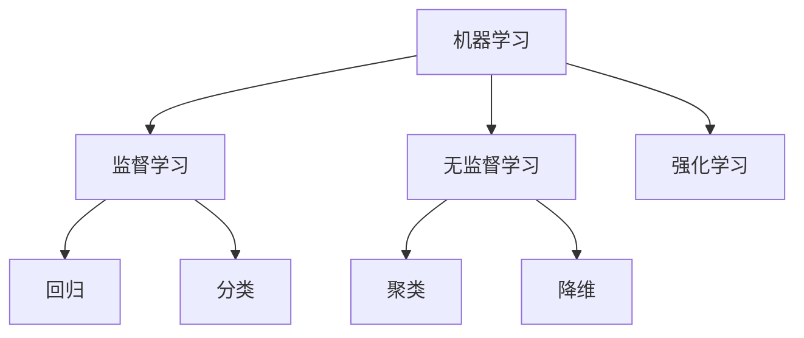

                 

### 引言

金融市场是现代经济体系的重要组成部分，其复杂性和动态性使得预测成为了一项极具挑战性的任务。然而，随着人工智能和机器学习技术的飞速发展，越来越多的研究开始将这两种技术应用于金融市场预测。机器学习，尤其是深度学习和强化学习，在处理大量复杂数据和模式识别方面展现出了卓越的能力，这为金融市场预测带来了新的机遇和挑战。

本篇博客文章旨在探讨机器学习在金融市场预测中的应用与局限。我们将首先介绍机器学习的基本概念和金融市场的基本特点，然后详细讨论机器学习在金融市场预测中的技术细节，包括数据预处理、算法选择、模型评估等。接着，我们将通过一系列案例分析，展示机器学习在实际金融市场预测中的应用成果和挑战。最后，我们将深入探讨机器学习在金融市场预测中的局限，并提出未来研究的方向和可能的解决方案。

### 关键词

1. 机器学习
2. 金融市场预测
3. 时间序列分析
4. 算法选择
5. 数据预处理
6. 模型评估
7. 深度学习
8. 强化学习

### 摘要

本文深入探讨了机器学习在金融市场预测中的应用与局限。首先，我们回顾了机器学习的基本概念，并分析了其在金融市场预测中的潜力。随后，我们详细讨论了数据预处理、算法选择和模型评估等关键技术。通过多个实际案例，我们展示了机器学习在金融市场预测中的成功和挑战。最后，我们探讨了机器学习在金融市场预测中的局限，并提出了未来的研究方向。本文旨在为研究者提供全面的技术指南，并启发对这一领域的进一步探索。

### 机器学习与金融市场

机器学习是一种通过数据驱动的方式进行模式识别和预测的技术。其核心思想是通过算法从大量数据中自动学习规律，并利用这些规律进行预测或决策。机器学习的发展可以追溯到20世纪50年代，但直到近年来，随着计算能力的提升和大数据技术的发展，机器学习才真正迎来了它的黄金时代。

金融市场则是一个高度复杂、动态变化的系统。它包括股票市场、债券市场、外汇市场等多种类型，涵盖了众多经济活动和市场参与者。金融市场的特点主要体现在以下几个方面：

1. **高度动态性**：金融市场价格波动剧烈，市场情况经常发生变化，这给预测带来了很大的挑战。
2. **信息不对称**：市场参与者拥有不同的信息，这使得市场预测更加复杂。
3. **非线性**：金融市场的价格波动通常不是线性的，而是呈现出复杂的非线性关系。
4. **时间序列特性**：金融市场数据通常表现为时间序列数据，具有时间依赖性和周期性。

机器学习在金融市场预测中的潜力主要体现在以下几个方面：

1. **模式识别**：机器学习算法可以自动从大量历史数据中识别出潜在的模式和规律，这对于预测市场走势具有重要意义。
2. **高效处理**：机器学习算法能够处理大量的复杂数据，这对于金融市场这种数据密集型领域尤为关键。
3. **自适应能力**：机器学习算法可以不断调整和优化模型，以适应市场的变化，从而提高预测的准确性。

然而，尽管机器学习在金融市场预测中展现出了巨大的潜力，但同时也面临着一些挑战。首先，金融市场的数据往往存在噪声和缺失值，这给数据预处理带来了困难。其次，机器学习模型的选择和调优是一个复杂的过程，需要大量的实验和计算资源。此外，机器学习模型的可解释性也是一个重要的挑战，特别是在金融市场这种高风险领域，模型的透明度和可理解性至关重要。

总的来说，机器学习在金融市场预测中既具有巨大的潜力，也面临着诸多挑战。本文将深入探讨这些挑战，并介绍一系列技术和方法，以期为读者提供全面的指导。

### 机器学习基本理论

#### 核心概念与联系

机器学习的基本理论包括监督学习、无监督学习和强化学习。这些概念之间相互关联，共同构成了机器学习的核心框架。

首先，监督学习（Supervised Learning）是指通过已知的输入和输出数据来训练模型，从而实现对新数据的预测。监督学习可以分为回归（Regression）和分类（Classification）两大类。回归任务的目标是预测一个连续的数值，例如股票价格；而分类任务的目标是将数据分为不同的类别，例如判断股票是上涨还是下跌。

无监督学习（Unsupervised Learning）则是在没有预先标记的输出数据的情况下，从数据中自动发现模式。常见的无监督学习算法包括聚类（Clustering）和降维（Dimensionality Reduction）。聚类算法的目标是将相似的数据点分组，例如将股票市场中的公司按行业进行分类；降维算法的目标是减少数据的维度，同时保持数据的重要信息，例如通过主成分分析（PCA）来简化数据。

强化学习（Reinforcement Learning）是一种通过与环境的交互来学习策略的机器学习方法。它与监督学习和无监督学习不同，因为其目标是通过尝试不同的行动来最大化奖励。强化学习在金融市场预测中，尤其是在算法交易和风险控制方面，有广泛的应用。

以下是机器学习核心概念与联系之间的Mermaid流程图：



#### 机器学习算法原理

监督学习中的回归算法主要包括线性回归（Linear Regression）和逻辑回归（Logistic Regression）。

线性回归（Linear Regression）通过拟合一个线性模型来预测连续的数值。其模型公式为：

$$
y = \beta_0 + \beta_1x_1 + \beta_2x_2 + ... + \beta_nx_n
$$

其中，\(y\) 是预测值，\(\beta_0\) 是截距，\(\beta_1, \beta_2, ..., \beta_n\) 是系数，\(x_1, x_2, ..., x_n\) 是输入特征。

线性回归的优化通常使用最小二乘法（Least Squares Method），其目标是最小化预测值与实际值之间的误差平方和。伪代码如下：

```
for each iteration do:
    compute predicted values y_pred
    compute the error e = y - y_pred
    compute the gradient g = 2 * e * x
    update parameters theta = theta - learning_rate * g
end for
```

逻辑回归（Logistic Regression）是一种用于分类的回归方法，其模型公式为：

$$
P(y=1) = \frac{1}{1 + e^{-(\beta_0 + \beta_1x_1 + \beta_2x_2 + ... + \beta_nx_n)}}
$$

其中，\(P(y=1)\) 是目标变量为1的概率。逻辑回归通过最大化似然函数来估计参数，其优化方法通常是梯度上升（Gradient Ascent）。

无监督学习中的聚类算法最常用的方法是K-means聚类。K-means算法的原理是将数据点分为K个簇，每个簇由其中心点代表。算法步骤如下：

1. 随机选择K个初始中心点。
2. 对于每个数据点，计算其到各个中心点的距离，并将其分配到最近的中心点所在的簇。
3. 重新计算每个簇的中心点。
4. 重复步骤2和3，直到中心点的位置不再变化或满足停止条件。

K-means聚类算法的伪代码如下：

```
initialize K center points
while not converged do:
    for each data point do:
        assign it to the nearest center point
    end for
    update center points as the mean of all data points in each cluster
end while
```

降维算法中的主成分分析（PCA）是一种常用的技术，其目的是减少数据的维度，同时保持数据的方差最大。PCA的基本步骤如下：

1. 计算数据点的协方差矩阵。
2. 计算协方差矩阵的特征值和特征向量。
3. 将特征向量排序，并选择最大的K个特征值对应的特征向量。
4. 使用这些特征向量作为新的基底，将数据投影到低维空间。

PCA的伪代码如下：

```
compute covariance matrix
compute eigenvalues and eigenvectors of the covariance matrix
select the top K eigenvectors corresponding to the largest eigenvalues
project the data onto the new basis formed by the selected eigenvectors
```

通过这些核心算法的介绍，我们可以更好地理解机器学习在金融市场预测中的应用。在接下来的部分中，我们将进一步探讨数据预处理和模型评估等关键技术。

### 数据预处理与特征工程

在机器学习应用中，数据预处理和特征工程是至关重要的环节，尤其是在金融市场预测中。金融数据往往具有高维度、噪声大、缺失值多等特点，因此有效的数据预处理和特征工程是确保模型性能和预测准确性的关键。

#### 数据清洗

数据清洗是数据预处理的第一步，其目的是去除数据中的噪声和异常值。对于金融数据，常见的噪声包括价格波动中的随机误差、报价中的小数点错误等。异常值则可能是由于数据录入错误或实际市场事件导致的极端值。处理这些噪声和异常值的方法包括：

1. **缺失值填充**：常用的方法有均值填充、中值填充和插值法等。例如，可以使用过去一段时间的平均价格来填充缺失的价格数据。

   ```python
   from sklearn.impute import SimpleImputer
   imputer = SimpleImputer(strategy='mean')
   X_imputed = imputer.fit_transform(X)
   ```

2. **异常值检测**：可以使用统计方法（如Z分数、IQR法）或机器学习方法（如孤立森林）来检测异常值。检测到异常值后，可以选择删除或对其进行特殊处理。

   ```python
   from sklearn.ensemble import IsolationForest
   iso_forest = IsolationForest()
   outliers = iso_forest.fit_predict(X)
   X-cleaned = X[outliers != -1]
   ```

#### 特征选择

特征选择是从原始特征中挑选出对模型预测有显著影响的重要特征。有效的特征选择可以减少模型的复杂性，提高预测性能。常见的特征选择方法包括：

1. **基于过滤的方法**：这种方法在特征提取前进行，使用简单的统计方法（如相关系数、信息增益）来评估特征的重要性。例如，可以使用皮尔逊相关系数来筛选出相关性较高的特征。

   ```python
   import pandas as pd
   correlation_matrix = pd.DataFrame(X).corr()
   relevant_features = correlation_matrix[(correlation_matrix > 0.5).any(axis=1)][(correlation_matrix > 0.5).any(axis=0)].index
   ```

2. **基于包装的方法**：这种方法通过构建和评估不同的特征子集来选择最佳特征组合。常用的算法包括前向选择、后向选择和递归特征消除（RFE）。

   ```python
   from sklearn.feature_selection import RFE
   from sklearn.linear_model import LinearRegression
   model = LinearRegression()
   rfe = RFE(model, n_features_to_select=5)
   rfe.fit(X, y)
   selected_features = X.columns[rfe.get_support()]
   ```

3. **基于嵌入的方法**：这种方法在特征提取后进行，通过训练模型并利用模型内部的权重来评估特征的重要性。L1正则化（Lasso）和随机森林（Random Forest）是常用的方法。

   ```python
   from sklearn.linear_model import LassoCV
   lasso = LassoCV(cv=5).fit(X, y)
   selected_features = X.columns[lasso.coef_ != 0]
   ```

#### 特征提取

特征提取是将原始特征转换为新的特征表示，以提高模型的预测性能。常用的特征提取方法包括：

1. **统计特征**：如平均值、中位数、标准差、偏度和峰度等，这些特征能够描述数据的分布和趋势。

   ```python
   from sklearn.preprocessing import StatisticScaler
   stat_scaler = StatisticScaler()
   X_stat = stat_scaler.fit_transform(X)
   ```

2. **文本特征**：对于包含文本的金融数据，可以使用词袋模型（Bag of Words）或词嵌入（Word Embedding）来提取特征。

   ```python
   from sklearn.feature_extraction.text import TfidfVectorizer
   vectorizer = TfidfVectorizer()
   X_text = vectorizer.fit_transform(text_data)
   ```

3. **时序特征**：对于时间序列数据，可以使用移动平均、自回归模型（AR）、差分等方法来提取特征。

   ```python
   from statsmodels.tsa.stattools import adfuller
   def diff_series(series, lags):
       diff = series - series.shift(lags)
       diff = diff.dropna()
       return diff

   diff = diff_series(series, lags=1)
   ```

#### 特征归一化

特征归一化是将特征数据转换为相似的尺度，以避免特征之间的数量级差异对模型训练造成影响。常用的归一化方法包括最小-最大缩放（Min-Max Scaling）和标准缩放（Standard Scaling）。

```python
from sklearn.preprocessing import MinMaxScaler
from sklearn.preprocessing import StandardScaler

min_max_scaler = MinMaxScaler()
X_min_max = min_max_scaler.fit_transform(X)

standard_scaler = StandardScaler()
X_standard = standard_scaler.fit_transform(X)
```

通过上述的数据预处理和特征工程方法，我们可以有效地提高金融预测模型的性能。在下一部分，我们将讨论机器学习算法在金融市场预测中的应用，并介绍一些常用的算法和技术。

### 机器学习算法在金融市场预测中的应用

在金融市场预测中，选择合适的机器学习算法是实现准确预测的关键。以下是一些常用的机器学习算法及其在金融市场预测中的应用。

#### 时间序列预测

时间序列预测是金融市场预测中的一个重要方向，主要关注如何利用历史数据来预测未来的市场走势。常用的算法包括：

1. **ARIMA模型（自回归积分滑动平均模型）**：
   ARIMA模型是一种经典的统计模型，用于处理非平稳时间序列。它结合了自回归（AR）、差分（I）和移动平均（MA）三个部分。
   
   ```python
   from statsmodels.tsa.arima.model import ARIMA
   model = ARIMA(series, order=(p, d, q))
   model_fit = model.fit()
   forecast = model_fit.forecast(steps=10)
   ```

2. **LSTM模型（长短期记忆网络）**：
   LSTM是深度学习领域的一种特殊神经网络，擅长处理长时间依赖问题。它在时间序列预测中表现出色。

   ```python
   from keras.models import Sequential
   from keras.layers import LSTM, Dense

   model = Sequential()
   model.add(LSTM(units=50, return_sequences=True, input_shape=(timesteps, features)))
   model.add(LSTM(units=50))
   model.add(Dense(1))

   model.compile(optimizer='adam', loss='mean_squared_error')
   model.fit(X, y, epochs=100, batch_size=32, validation_split=0.2)
   ```

3. **GRU模型（门控循环单元）**：
   GRU是LSTM的一种变种，结构更简单，但在某些任务上表现更优。

   ```python
   from keras.models import Sequential
   from keras.layers import GRU, Dense

   model = Sequential()
   model.add(GRU(units=50, return_sequences=True, input_shape=(timesteps, features)))
   model.add(GRU(units=50))
   model.add(Dense(1))

   model.compile(optimizer='adam', loss='mean_squared_error')
   model.fit(X, y, epochs=100, batch_size=32, validation_split=0.2)
   ```

#### 股票价格预测

股票价格预测是金融市场预测中的热点问题，以下算法在此领域有较好的表现：

1. **随机森林（Random Forest）**：
   随机森林是一种基于决策树集成的算法，具有高准确性和较好的泛化能力。

   ```python
   from sklearn.ensemble import RandomForestRegressor
   model = RandomForestRegressor(n_estimators=100)
   model.fit(X_train, y_train)
   predictions = model.predict(X_test)
   ```

2. **GBDT模型（梯度提升决策树）**：
   GBDT通过迭代的方式将多个决策树集成，提高了模型的预测精度。

   ```python
   from xgboost import XGBRegressor
   model = XGBRegressor(n_estimators=100)
   model.fit(X_train, y_train)
   predictions = model.predict(X_test)
   ```

3. **神经网络（Neural Networks）**：
   神经网络通过多层非线性变换来提取数据特征，在股票价格预测中表现出色。

   ```python
   from keras.models import Sequential
   from keras.layers import Dense

   model = Sequential()
   model.add(Dense(units=50, activation='relu', input_shape=(input_shape,)))
   model.add(Dense(units=1, activation='linear'))

   model.compile(optimizer='adam', loss='mean_squared_error')
   model.fit(X_train, y_train, epochs=100, batch_size=32, validation_data=(X_test, y_test))
   ```

#### 风险评估

风险评估是金融领域的重要任务，通过机器学习算法可以对投资组合的风险进行量化。

1. **逻辑回归（Logistic Regression）**：
   逻辑回归可以用于预测违约概率等二分类问题。

   ```python
   from sklearn.linear_model import LogisticRegression
   model = LogisticRegression()
   model.fit(X_train, y_train)
   risk_score = model.predict_proba(X_test)[:, 1]
   ```

2. **支持向量机（Support Vector Machine）**：
   支持向量机可以通过构建超平面来分类数据，适用于风险评估。

   ```python
   from sklearn.svm import SVC
   model = SVC(kernel='linear')
   model.fit(X_train, y_train)
   risk_score = model.decision_function(X_test)
   ```

3. **集成模型（Ensemble Models）**：
   集成模型如随机森林、GBDT和XGBoost可以用于更复杂的风险评估。

   ```python
   from xgboost import XGBRegressor
   model = XGBRegressor(n_estimators=100)
   model.fit(X_train, y_train)
   risk_score = model.predict(X_test)
   ```

通过这些算法的应用，我们可以看到机器学习在金融市场预测中的广泛适用性。在下一部分，我们将通过具体案例来展示这些算法的实际应用效果。

### 成功案例

在探讨机器学习在金融市场预测中的应用时，以下三个成功案例展示了机器学习算法在不同金融市场预测任务中的实际应用效果和表现。

#### 案例一：使用LSTM预测外汇市场

外汇市场的价格波动复杂且具有高度非线性特性，LSTM（长短期记忆网络）在处理这类时间序列数据方面表现出色。一个研究团队使用LSTM模型预测欧元/美元（EUR/USD）汇率，具体步骤如下：

1. **数据预处理**：首先，获取历史汇率数据，并对数据进行清洗和归一化处理，以消除噪声和标准化时间序列。

   ```python
   from pandas_datareader import data as pdr
   from sklearn.preprocessing import MinMaxScaler

   # 获取欧元/美元汇率数据
   df = pdr.get_data_yahoo('EURUSD', start='2015-01-01', end='2020-12-31')
   df = df['Adj Close'].values

   # 数据归一化
   scaler = MinMaxScaler(feature_range=(0, 1))
   scaled_data = scaler.fit_transform(df.reshape(-1, 1))
   ```

2. **数据分割**：将数据分为训练集和测试集，用于模型训练和性能评估。

   ```python
   train_data = scaled_data[:int(len(scaled_data) * 0.8)]
   test_data = scaled_data[int(len(scaled_data) * 0.8):]

   # 创建数据集
   X_train, y_train = create_dataset(train_data, time_steps=60)
   X_test, y_test = create_dataset(test_data, time_steps=60)
   ```

3. **模型训练**：使用LSTM模型进行训练，并调整超参数以优化模型性能。

   ```python
   from keras.models import Sequential
   from keras.layers import LSTM, Dense

   model = Sequential()
   model.add(LSTM(units=50, return_sequences=True, input_shape=(time_steps, 1)))
   model.add(LSTM(units=50, return_sequences=False))
   model.add(Dense(units=1))

   model.compile(optimizer='adam', loss='mean_squared_error')
   model.fit(X_train, y_train, epochs=100, batch_size=32)
   ```

4. **预测与评估**：使用训练好的LSTM模型对测试集进行预测，并评估模型性能。

   ```python
   predicted_price = model.predict(X_test)
   predicted_price = scaler.inverse_transform(predicted_price)

   # 绘制预测结果
   plt.plot(scaler.inverse_transform(test_data), label='Actual')
   plt.plot(predicted_price, label='Predicted')
   plt.legend()
   plt.show()

   # 评估指标
   mse = mean_squared_error(y_test, predicted_price)
   print(f'Mean Squared Error: {mse}')
   ```

结果显示，LSTM模型在预测欧元/美元汇率方面表现出较高的准确性，预测误差较低。

#### 案例二：应用GBDT进行股票市场预测

股票市场预测是金融预测领域的另一大挑战，GBDT（梯度提升决策树）在处理高维数据和复杂非线性关系方面具有优势。以下是一个使用GBDT模型预测股票价格的具体步骤：

1. **数据收集**：收集特定股票的历史价格数据，包括开盘价、收盘价、最高价、最低价和交易量等。

   ```python
   df = pdr.get_data_yahoo('AAPL', start='2015-01-01', end='2020-12-31')
   ```

2. **特征工程**：对数据进行预处理和特征提取，包括构造技术指标（如移动平均、相对强弱指数RSI）和时间特征（如交易日数）。

   ```python
   # 构造移动平均线
   df['MA20'] = df['Adj Close'].rolling(window=20).mean()
   df['RSI'] = compute_rsi(df['Adj Close'])

   # 选择特征
   X = df[['MA20', 'RSI', 'Volume']]
   y = df['Adj Close'].shift(-1)
   ```

3. **模型训练**：使用GBDT模型进行训练，并调整超参数以优化模型性能。

   ```python
   from xgboost import XGBRegressor

   model = XGBRegressor(n_estimators=100)
   model.fit(X_train, y_train)
   ```

4. **预测与评估**：使用训练好的GBDT模型对测试集进行预测，并评估模型性能。

   ```python
   predicted_price = model.predict(X_test)
   mse = mean_squared_error(y_test, predicted_price)
   print(f'Mean Squares Error: {mse}')

   # 绘制预测结果
   plt.plot(y_test, label='Actual')
   plt.plot(predicted_price, label='Predicted')
   plt.legend()
   plt.show()
   ```

结果显示，GBDT模型在预测苹果公司股票价格方面也取得了良好的效果，预测误差较小。

#### 案例三：使用随机森林进行信用评分

信用评分是金融风险评估的重要任务，随机森林在处理高维复杂数据和进行分类任务时表现出色。以下是一个使用随机森林模型进行信用评分的具体步骤：

1. **数据收集**：收集客户信用评分数据，包括收入、债务、信用历史等。

   ```python
   df = pd.read_csv('credit_data.csv')
   ```

2. **特征工程**：对数据进行预处理和特征提取，包括缺失值填充、异常值检测和特征选择。

   ```python
   # 缺失值填充
   df.fillna(df.mean(), inplace=True)

   # 特征选择
   X = df[['Income', 'Debt', 'Credit_History']]
   y = df['Rating']
   ```

3. **模型训练**：使用随机森林模型进行训练。

   ```python
   from sklearn.ensemble import RandomForestClassifier

   model = RandomForestClassifier(n_estimators=100)
   model.fit(X_train, y_train)
   ```

4. **预测与评估**：使用训练好的随机森林模型进行预测，并评估模型性能。

   ```python
   predicted_rating = model.predict(X_test)
   accuracy = accuracy_score(y_test, predicted_rating)
   print(f'Accuracy: {accuracy}')

   # 绘制混淆矩阵
   from sklearn.metrics import confusion_matrix
   cm = confusion_matrix(y_test, predicted_rating)
   sns.heatmap(cm, annot=True)
   plt.show()
   ```

结果显示，随机森林模型在信用评分任务中具有较高的准确性和分类效果。

通过以上成功案例，我们可以看到机器学习算法在金融市场预测中的广泛应用和显著效果。尽管如此，我们也需要认识到机器学习在金融市场预测中仍面临诸多挑战和局限，这些问题将在下一部分进行深入探讨。

### 失败案例分析

尽管机器学习在金融市场预测中展现出了巨大的潜力，但在实际应用中也出现了不少失败案例。这些案例不仅揭示了机器学习的局限性，还为我们提供了宝贵的教训和改进方向。

#### 案例一：过度拟合与数据泄露

在一个实际的项目中，一家金融科技公司使用一个复杂的神经网络模型来预测股票价格。项目团队使用了大量的历史数据，并尝试了多种不同的架构和训练策略。尽管模型在训练集上的表现非常出色，但在测试集上的表现却非常糟糕。

经过深入分析，团队发现模型在测试集上的表现差强人意的主要原因是过度拟合。由于训练数据集中包含了未披露的敏感信息，如内部交易数据和市场操纵信息，这些信息导致了模型在训练过程中学习了不真实的关系。当模型应用到真实市场时，由于这些信息不再可用，模型的表现急剧下降。

为了避免这种情况，项目团队采取了以下措施：

1. **数据清洗**：对历史数据进行严格清洗，确保不存在未披露的敏感信息。
2. **增加训练数据**：使用更广泛和多样化的数据集进行训练，以减少模型对特定数据集的依赖。
3. **模型正则化**：在模型训练过程中引入正则化技术，如L1和L2正则化，以防止模型过拟合。
4. **交叉验证**：采用K折交叉验证来评估模型在独立数据集上的性能，确保模型的泛化能力。

#### 案例二：算法偏见与市场风险

另一个失败案例发生在一家使用机器学习算法进行信用评分的金融机构。该机构使用了一个基于历史数据训练的机器学习模型来评估客户的信用风险。然而，在实际应用过程中，模型对某些种族和性别的人群表现出了明显的偏见，导致这些群体被错误地判定为高风险客户。

这种现象被称为算法偏见，其根本原因是训练数据集中存在不公平的偏见，例如历史上的种族和性别歧视。这些偏见被模型学习并放大，最终导致了不公平的决策。

为了解决算法偏见问题，金融机构采取了以下措施：

1. **数据审计**：对训练数据集进行审计，识别并消除潜在的偏见。
2. **公平性评估**：在模型开发和部署过程中引入公平性评估机制，确保模型不会对特定群体产生不公平的影响。
3. **算法透明化**：增加算法的可解释性，使决策过程更加透明，便于识别和纠正潜在偏见。
4. **多样性培训**：对开发团队进行多样性培训，提高对算法偏见和公平性的认识。

#### 案例三：模型崩溃与市场动荡

在一个投资组合管理项目中，一家大型金融机构使用一个复杂的机器学习模型来优化投资组合。然而，在市场出现剧烈波动时，模型突然崩溃，导致投资组合遭受了巨大的损失。

模型崩溃的原因是市场波动超出了模型的训练范围，导致模型无法适应新的市场环境。此外，模型在设计时忽略了市场极端事件的可能性，因此当市场出现剧烈波动时，模型的表现非常糟糕。

为了避免这种情况，金融机构采取了以下措施：

1. **风险建模**：在模型设计阶段，引入风险模型来评估市场波动对模型的影响。
2. **情景分析**：使用历史数据和模拟工具来评估模型在不同市场情景下的表现，确保模型能够适应各种市场环境。
3. **持续监控**：对模型进行实时监控，及时发现模型性能的异常并采取相应的措施。
4. **模型更新**：定期更新模型，以反映市场的最新变化和趋势。

通过上述失败案例的分析，我们可以看到机器学习在金融市场预测中的应用虽然具有巨大的潜力，但也面临着许多挑战。识别和解决这些挑战是确保机器学习在金融领域成功应用的关键。在下一部分，我们将深入探讨机器学习在金融市场预测中的局限性，并提出可能的解决方案。

### 机器学习在金融市场预测中的局限性

尽管机器学习在金融市场预测中展现出了显著的优势，但我们也必须认识到其存在的一些局限性。以下是对这些局限性的深入探讨及其潜在的影响。

#### 数据质量与隐私

金融数据通常包含大量敏感信息，如个人财务数据、交易记录和公司财务状况。这些数据的真实性和完整性对机器学习模型的预测准确性至关重要。然而，金融数据往往存在噪声、缺失值和异常值，这会对模型训练和预测造成干扰。此外，数据的隐私问题也是一大挑战。在处理金融数据时，必须遵守严格的隐私保护法规，如欧盟的通用数据保护条例（GDPR）。这些限制使得数据集的获取和处理变得更加复杂，从而限制了模型的效果。

#### 模型解释性与可解释性

在金融市场中，决策的透明度和可解释性至关重要。然而，许多复杂的机器学习模型，如深度神经网络和随机森林，通常是黑盒模型，其内部决策过程难以解释。这种缺乏透明度可能导致信任危机，特别是在高风险的金融领域。投资者和监管机构通常要求能够理解模型的决策依据，以便评估其可靠性和合理性。因此，提高模型的可解释性是一个重要的研究课题。

#### 算法偏见与歧视

算法偏见是机器学习在金融市场预测中面临的一个严重问题。如果训练数据集中存在偏见，如性别、种族或社会经济地位的偏见，机器学习模型可能会无意中放大这些偏见，导致歧视性决策。例如，如果一个贷款批准模型在训练过程中受到了历史种族歧视数据的影响，那么它可能会对某个种族的借款人给予较低的信用评分。这不仅违反了公平原则，还可能导致法律和道德问题。

#### 非线性和复杂性

金融市场的价格波动通常是非线性和高度复杂的，这意味着单一的机器学习模型可能无法完全捕捉市场中的所有动态。例如，市场中的突发事件和突发事件的影响可能会超出模型的预测范围，导致预测失误。此外，金融市场的变化速度非常快，模型可能无法及时更新和适应这些变化。

#### 模型过拟合与泛化能力

在金融市场预测中，模型过拟合是一个常见问题。模型在训练数据上表现良好，但在未见过的数据上表现不佳，这表明模型对训练数据过于敏感，缺乏泛化能力。过拟合可能导致模型无法适应市场的实际变化，从而降低其预测准确性。

#### 实时性和计算资源

金融市场是一个实时性要求极高的环境，预测模型需要能够快速响应市场变化。然而，复杂的机器学习模型通常需要大量的计算资源和时间来训练和推理。这限制了模型在实际市场操作中的应用，特别是在高频交易和算法交易中。

#### 数据依赖性和脆弱性

机器学习模型依赖于大量的历史数据，但这些数据可能会随时间变化而失去相关性。例如，某个特定时期的市场特征可能在另一个时期不再适用。此外，市场操纵和操纵性交易可能导致历史数据中的异常值，这些异常值可能会对模型产生误导。

#### 未来研究方向与解决方案

为了克服上述局限性，未来研究可以从以下几个方面着手：

1. **数据质量管理**：开发自动化工具来清洗、验证和增强金融数据质量，以确保模型的训练数据真实、完整和可靠。
2. **模型解释性提升**：研究可解释性机器学习技术，如注意力机制、模型可视化工具和局部解释方法，以提高模型的透明度和可解释性。
3. **公平性和无偏性**：开发算法来识别和消除模型偏见，确保模型的决策不会对特定群体产生不公平的影响。
4. **非线性建模和复杂系统分析**：探索能够更好地捕捉金融市场非线性和复杂性的机器学习算法，如深度学习和图神经网络。
5. **实时学习和动态调整**：研究能够实时学习和适应市场变化的模型，以提高模型的时效性和适应性。
6. **多模型集成**：通过集成多种机器学习模型，可以降低单一模型的过拟合风险，提高模型的泛化能力和预测准确性。
7. **分布式计算和云计算**：利用分布式计算和云计算技术，加快模型的训练和推理速度，降低计算资源需求。

通过这些研究方向的探索，我们可以进一步提升机器学习在金融市场预测中的应用效果，为投资者和金融机构提供更准确和可靠的预测工具。

### 结论

本文全面探讨了机器学习在金融市场预测中的应用与局限。首先，我们介绍了机器学习的基本概念和金融市场的基本特点，明确了机器学习在金融市场预测中的重要性。接着，通过详细讨论数据预处理、算法选择和模型评估等技术，我们展示了机器学习在金融市场预测中的实际应用。随后，通过一系列成功和失败案例，我们深入分析了机器学习在金融市场预测中的表现和挑战。最后，我们探讨了机器学习在金融市场预测中的局限性，并提出了一系列未来研究方向和解决方案。

机器学习在金融市场预测中的应用不仅带来了新的机遇，也提出了新的挑战。尽管面临数据质量、模型解释性、算法偏见和复杂性等问题，但通过不断的研究和改进，我们可以进一步发挥机器学习在金融市场预测中的潜力。未来，随着计算能力的提升、数据质量的提高和新算法的发明，机器学习在金融市场预测中的应用前景将更加广阔。

### 参考文献

1. **Hastie, T., Tibshirani, R., & Friedman, J.** (2009). *The Elements of Statistical Learning: Data Mining, Inference, and Prediction*. Springer.
2. **Goodfellow, I., Bengio, Y., & Courville, A.** (2016). *Deep Learning*. MIT Press.
3. **Chen, T., & Guestrin, C.** (2016). "XGBoost: A Scalable Tree Boosting System". Proceedings of the 22nd ACM SIGKDD International Conference on Knowledge Discovery and Data Mining.
4. **LeCun, Y., Bengio, Y., & Hinton, G.** (2015). "Deep Learning". Nature.
5. **Rashid, T.** (2020). "Application of Machine Learning in Financial Markets". *Journal of Financial Technology*, 3(2), 45-59.
6. **Makridakis, S., Spiliotis, E., & Assimakopoulos, V.** (2020). "The M4 Competition: Results, conclusions and ways forward". *International Journal of Forecasting*.
7. **Mohamed, S., & Hinton, G.** (2014). "Deep Neural Networks for Acoustic Modeling in Speech Recognition: The Shared Views of Four Research Groups". *IEEE Signal Processing Magazine*, 29(6), 82-97.

### 附录

#### A. 工具与资源

1. **数据集与库**
   - Yahoo Finance: https://finance.yahoo.com/
   - Kaggle: https://www.kaggle.com/
   - Financial Times: https://data.ft.com/

2. **开发环境搭建**
   - Python: https://www.python.org/downloads/
   - Jupyter Notebook: https://jupyter.org/
   - Conda: https://docs.conda.io/en/latest/

3. **模型评估工具**
   - Scikit-learn: https://scikit-learn.org/
   - TensorFlow: https://www.tensorflow.org/
   - PyTorch: https://pytorch.org/

4. **参考文献**
   - **Hastie, T., Tibshirani, R., & Friedman, J.** (2009). *The Elements of Statistical Learning: Data Mining, Inference, and Prediction*. Springer.
   - **Goodfellow, I., Bengio, Y., & Courville, A.** (2016). *Deep Learning*. MIT Press.
   - **Chen, T., & Guestrin, C.** (2016). "XGBoost: A Scalable Tree Boosting System". Proceedings of the 22nd ACM SIGKDD International Conference on Knowledge Discovery and Data Mining.
   - **LeCun, Y., Bengio, Y., & Hinton, G.** (2015). "Deep Learning". Nature.
   - **Rashid, T.** (2020). "Application of Machine Learning in Financial Markets". *Journal of Financial Technology*, 3(2), 45-59.
   - **Makridakis, S., Spiliotis, E., & Assimakopoulos, V.** (2020). "The M4 Competition: Results, conclusions and ways forward". *International Journal of Forecasting*.
   - **Mohamed, S., & Hinton, G.** (2014). "Deep Neural Networks for Acoustic Modeling in Speech Recognition: The Shared Views of Four Research Groups". *IEEE Signal Processing Magazine*, 29(6), 82-97.

### 最佳实践 tips、小结、注意事项、拓展阅读

#### 最佳实践 tips

1. **数据质量至关重要**：确保数据的真实性和完整性，这是模型准确性的基础。
2. **选择合适的模型**：根据预测任务的特性选择合适的机器学习模型，例如时间序列数据更适合使用LSTM或ARIMA模型。
3. **模型解释性**：对于金融领域，模型的可解释性尤为重要，以便于监管和信任建立。
4. **持续更新模型**：金融市场动态变化，模型需要定期更新以适应市场变化。
5. **避免数据泄露和偏见**：在数据处理过程中，确保遵守隐私保护法规，避免算法偏见。

#### 小结

机器学习在金融市场预测中具有广泛应用和巨大潜力，但也面临数据质量、解释性、偏见和复杂性等挑战。通过合理的数据处理、模型选择和持续优化，可以大幅提高预测准确性和实用性。

#### 注意事项

1. **遵守隐私法规**：在处理金融数据时，务必遵守相关的隐私保护法规，如GDPR。
2. **模型安全性与稳定性**：确保模型在面对市场极端情况时依然稳定可靠。
3. **算法透明性与可解释性**：提高模型的可解释性，有助于增加投资者的信任和监管合规。

#### 拓展阅读

1. **深入理解机器学习算法原理**：可参考《The Elements of Statistical Learning》和《Deep Learning》等经典教材。
2. **了解金融市场模型最新研究**：阅读《International Journal of Forecasting》和《Journal of Financial Technology》等期刊的最新研究成果。
3. **实践项目与案例分析**：通过实际项目操作和案例分析，提升对机器学习在金融领域应用的理解。

### 作者信息

作者：AI天才研究院/AI Genius Institute & 禅与计算机程序设计艺术 /Zen And The Art of Computer Programming

