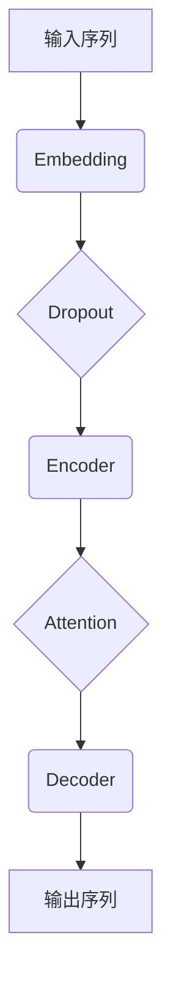

                 


### 文章标题

《构建LLM应用的产品待办列表：优先级管理》

### 文章关键词

语言模型（LLM）、产品待办列表、优先级管理、机器学习、应用实践

### 文章摘要

本文旨在深入探讨如何构建一个有效的语言模型（LLM）应用产品待办列表，并强调优先级管理的重要性。通过逐步分析LLM的基础、产品待办列表的构建方法、优先级管理的原理和实践应用，本文为开发团队提供了一套系统化的指导，旨在优化项目管理和提高开发效率。

## 1. 引言

### 1.1 背景介绍

#### 语言模型（LLM）的发展与应用现状

语言模型（Language Model，简称LLM）是自然语言处理（Natural Language Processing，简称NLP）领域的关键技术之一。随着深度学习和计算资源的进步，LLM得到了迅速的发展。LLM能够通过分析大量的文本数据，学习语言的规律和模式，从而生成自然流畅的语言输出。这种技术广泛应用于机器翻译、文本生成、智能助手、问答系统等多个领域。

#### 优先级管理在产品开发中的重要性

在产品开发过程中，优先级管理是一个至关重要的环节。它关系到资源的合理分配、项目的进度控制和最终产品的质量。对于构建LLM应用而言，优先级管理尤为重要，因为LLM的开发涉及大量的算法优化、模型训练和功能实现，这些任务需要根据其重要性和紧急性进行合理的排序和分配。

### 1.2 书籍结构概述

本文将采用以下结构来阐述构建LLM应用的产品待办列表及其优先级管理：

- **第1章：引言**：介绍LLM和优先级管理的背景及其在产品开发中的重要性。
- **第2章：语言模型基础**：探讨LLM的基本概念、原理和架构。
- **第3章：产品待办列表构建**：详细讲解产品待办列表的构建流程和工具。
- **第4章：优先级管理原理**：分析优先级管理的基本原则和评估模型。
- **第5章：实践应用案例分析**：通过实际案例展示优先级管理的应用效果。
- **第6章：开发环境与工具**：介绍LLM应用的开发环境和工具。
- **第7章：优化与扩展**：探讨如何优化LLM应用和未来的发展方向。

### 1.3 学习目标与预期效果

通过本文的阅读，读者将：

- **了解LLM的基本概念和架构**。
- **掌握产品待办列表的构建方法**。
- **理解优先级管理的基本原理**。
- **具备应用优先级管理实践的能力**。
- **能够优化和扩展LLM应用**。

## 2. 语言模型基础

### 2.1 语言模型基本概念

#### 语言模型的定义与作用

语言模型是一种能够对自然语言进行建模的统计模型，它通过学习大量文本数据来预测下一个单词或序列的概率。在NLP中，语言模型主要用于以下几个方面：

- **文本生成**：根据给定的起始文本生成后续的文本内容。
- **机器翻译**：将一种语言的文本翻译成另一种语言。
- **问答系统**：根据用户的问题生成相应的答案。
- **文本分类**：将文本分类到预定义的类别中。

#### 语言模型的分类

根据建模方式和学习策略，语言模型可以分为以下几类：

- **n-gram模型**：基于相邻单词序列的统计模型，如二元文法、三元文法。
- **神经网络模型**：基于神经网络的模型，如循环神经网络（RNN）、长短期记忆网络（LSTM）。
- **注意力机制模型**：结合注意力机制的模型，如Transformer模型。

### 2.2 语言模型原理

#### 语言模型的数学基础

语言模型的训练过程可以看作是一个概率分布的学习过程。具体来说，给定一个单词序列，语言模型需要学习这个序列的概率分布。数学上，这可以通过以下概率公式表示：

$$ P(W_1, W_2, ..., W_n) = P(W_1) \cdot P(W_2|W_1) \cdot P(W_3|W_1, W_2) \cdot ... \cdot P(W_n|W_1, W_2, ..., W_{n-1}) $$

其中，$W_i$表示序列中的第$i$个单词。

#### 语言模型的核心算法

语言模型的核心算法可以分为以下几种：

- **n-gram模型**：基于马尔可夫假设，仅考虑前$n-1$个单词对当前单词的影响。
- **循环神经网络（RNN）**：通过循环结构记住历史信息，能够处理较长序列。
- **长短期记忆网络（LSTM）**：对RNN的改进，能够更好地记住长期依赖信息。
- **Transformer模型**：基于注意力机制的模型，能够处理长距离依赖问题，是目前最先进的语言模型之一。

### 2.3 语言模型架构

为了更好地理解语言模型的工作流程，我们可以使用Mermaid流程图来展示其基本架构。以下是一个简化的语言模型架构：



在这个架构中，输入序列首先经过Embedding层，将文本转换为向量表示。然后，这些向量进入编码器（Encoder），编码器通过多个层级的变换来捕捉序列的特征。注意力机制（Attention）用于关注序列中重要的部分，最终解码器（Decoder）生成输出序列。

### 2.4 语言模型评估与优化

#### 评估指标与方法

语言模型的性能评估通常通过以下指标进行：

- **交叉熵（Cross-Entropy）**：衡量预测分布与真实分布之间的差异。
- **准确率（Accuracy）**：衡量预测正确的比例。
- **BLEU（Bilingual Evaluation Understudy）**：用于评估机器翻译模型的性能。

#### 优化策略与技巧

为了提高语言模型的性能，可以采用以下策略：

- **数据增强**：通过数据扩充、伪文本生成等方法增加训练数据。
- **超参数调优**：调整学习率、批量大小等超参数以优化模型性能。
- **预训练与微调**：使用大规模预训练模型，然后在特定任务上进行微调。
- **模型集成**：结合多个模型的预测结果以减少误差。

## 3. 产品待办列表构建

### 3.1 产品待办列表概述

#### 产品待办列表的定义与作用

产品待办列表（Product Backlog）是产品开发过程中用于记录所有待完成功能的清单。它是一个动态的、不断更新的列表，反映了产品开发团队的目标和优先级。产品待办列表的主要作用包括：

- **需求管理**：记录和管理产品开发过程中的所有需求。
- **优先级排序**：明确各项功能的重要性和紧急性，指导开发工作。
- **团队协作**：为团队成员提供清晰的指导，促进协同工作。

#### 产品待办列表的组成部分

一个完整的产品待办列表通常包括以下几个部分：

- **用户故事**：描述用户的需求和功能。
- **任务**：将用户故事分解为具体的工作任务。
- **迭代计划**：根据优先级和资源分配制定迭代计划。
- **优先级标签**：对任务进行优先级排序的标记。
- **完成标准**：定义任务完成的具体标准。

### 3.2 产品待办列表构建流程

#### 需求收集与分析

构建产品待办列表的第一步是进行需求收集和分析。这一步骤包括以下几个关键环节：

- **用户访谈**：与潜在用户和利益相关者进行面对面访谈，了解他们的需求和期望。
- **问卷调查**：通过在线问卷或纸质问卷收集大量用户的反馈。
- **市场研究**：分析竞争对手的产品和市场趋势，寻找机会点。
- **需求文档**：将收集到的需求整理成文档，明确需求的细节和优先级。

#### 功能规划与优先级划分

在需求收集完成后，需要对功能进行规划和优先级划分。这一步骤包括以下几个步骤：

- **功能筛选**：根据需求的重要性和可行性，筛选出最关键的功能。
- **优先级排序**：使用优先级评估方法（如MoSCoW方法）对功能进行排序。
- **功能分解**：将高优先级的功能分解为具体的任务。
- **迭代计划**：根据优先级和资源分配，制定迭代计划。

### 3.3 待办列表工具与方法

#### 常见待办列表工具介绍

在构建产品待办列表时，可以使用多种工具来帮助管理和追踪任务。以下是一些常见的待办列表工具：

- **JIRA**：一款功能强大的项目管理工具，适用于各种规模和类型的团队。
- **Trello**：一个直观的卡片式项目管理工具，易于操作和使用。
- **Asana**：一款全面的项目管理工具，提供灵活的任务分配和进度跟踪功能。
- **Notion**：一个集文档、数据库和笔记于一体的工具，适合知识型团队使用。

#### 待办列表构建方法与实践

在构建产品待办列表时，可以采用以下方法：

- **用户故事地图**：通过绘制用户故事地图，将用户需求转化为可视化的待办列表。
- **迭代规划会议**：定期召开迭代规划会议，与团队成员一起讨论和确定待办列表的优先级。
- **敏捷开发**：采用敏捷开发方法，灵活调整待办列表，以适应快速变化的市场需求。
- **看板管理**：使用看板（Kanban）方法，可视化地展示任务的状态和进度，促进团队协作。

### 3.4 产品待办列表的动态调整

产品待办列表是一个动态的、不断更新的列表，需要根据项目进展和市场反馈进行及时调整。以下是一些常见的调整方法：

- **优先级调整**：根据新的需求和优先级，重新排序待办列表中的任务。
- **任务分解**：将大型任务分解为更小、更易管理的子任务。
- **任务合并**：将相关的任务合并为一个，以减少重复工作和提高效率。
- **需求变更管理**：建立需求变更管理流程，确保变更的影响得到充分评估和控制。

## 4. 优先级管理原理

### 4.1 优先级管理概念

#### 优先级的定义与作用

在项目管理中，优先级（Priority）是指对任务或活动进行排序的重要性指标。它反映了任务在时间顺序和资源分配上的优先级。优先级管理的作用包括：

- **资源优化**：确保有限资源（如人力、时间、预算）得到最有效的利用。
- **进度控制**：通过优先级排序，确保关键任务得到及时完成，防止项目延期。
- **风险规避**：优先处理高优先级任务，减少项目风险。

#### 优先级管理的基本原则

优先级管理应遵循以下基本原则：

- **基于价值排序**：优先处理对项目或业务价值最大的任务。
- **考虑风险因素**：高优先级任务通常涉及较高的风险，需要优先处理。
- **灵活调整**：根据项目进展和市场变化，灵活调整优先级。
- **透明沟通**：确保团队成员明确任务优先级，促进协作和沟通。

### 4.2 优先级评估模型

#### 常见评估模型介绍

在优先级评估中，可以采用以下几种常见的评估模型：

- **MoSCoW方法**：将任务分为“必须要有（M）”、“应该要有（S）”、“可以有（C）”、“不会要（W）”四个优先级。
- **关键路径法**：通过分析任务之间的依赖关系，确定项目的关键路径，关键路径上的任务具有最高优先级。
- **成本效益分析法**：计算每个任务的预期成本和预期收益，优先处理成本效益比最高的任务。

#### 评估模型的构建与应用

构建优先级评估模型的过程包括以下几个步骤：

1. **确定评估因素**：根据项目特点和需求，确定影响任务优先级的因素，如业务价值、风险、时间紧迫性等。
2. **设定权重**：为每个评估因素设定权重，以反映其在任务优先级评估中的重要性。
3. **制定评估标准**：为每个任务制定具体的评估标准，以便进行量化评估。
4. **应用评估模型**：使用评估模型对任务进行优先级排序，并根据实际情况进行灵活调整。

### 4.3 优先级调整策略

#### 调整策略的制定

优先级调整策略的制定应考虑以下几个方面：

- **项目进展**：根据项目进展情况，重新评估任务的优先级。
- **资源变化**：根据资源分配情况，调整任务优先级，确保资源得到合理利用。
- **风险变化**：根据风险变化情况，调整高风险任务的优先级，确保项目风险得到有效控制。
- **客户需求**：根据客户需求和反馈，及时调整任务的优先级，以更好地满足客户需求。

#### 调整策略的实施与监控

调整策略的实施与监控包括以下几个方面：

- **定期评估**：定期评估任务的优先级，根据实际情况进行调整。
- **透明沟通**：确保团队成员了解任务优先级的调整原因和调整过程，促进协作。
- **反馈机制**：建立反馈机制，收集团队成员和利益相关者的意见和建议，以改进优先级管理。
- **监控效果**：通过监控任务完成情况和项目进度，评估优先级调整策略的效果，并根据反馈进行持续优化。

## 5. 实践应用案例分析

### 5.1 案例介绍

#### 案例背景与目标

本次案例来自于一家领先的科技公司，该公司致力于开发一款基于语言模型的智能客服系统。该系统的目标是提供24/7的在线客户支持，能够自动解答用户的问题，提高客户满意度，并降低人力成本。

#### 案例中的语言模型应用

在该案例中，语言模型的应用主要体现在以下几个方面：

- **自动问答**：用户提出的问题通过语言模型进行解析，模型生成相应的答案。
- **情感分析**：分析用户提问的情感倾向，为客服人员提供参考，提高服务质量。
- **知识图谱**：构建知识图谱，将用户问题和答案进行关联，实现知识的积累和共享。

### 5.2 案例分析

#### 产品待办列表构建过程

在案例中，产品开发团队首先进行了需求收集和分析，确定了智能客服系统的主要功能点，包括：

- **基础问答功能**：实现自动回答常见问题。
- **情感分析**：识别用户的情感倾向。
- **个性化推荐**：根据用户提问历史，推荐相关问题。
- **多语言支持**：支持多种语言的问答。

基于这些功能点，团队构建了产品待办列表，并根据MoSCoW方法对任务进行了优先级排序：

- **必须要有（M）**：基础问答功能和多语言支持。
- **应该要有（S）**：情感分析和个性化推荐。
- **可以有（C）**：数据可视化和分析工具。
- **不会要（W）**：实时语音交互。

#### 优先级管理实践

在项目开发过程中，团队根据产品待办列表的优先级，制定了迭代计划，并严格按照计划进行开发。以下是一些关键步骤：

- **迭代1**：实现基础问答功能和多语言支持，确保系统能够稳定运行。
- **迭代2**：引入情感分析，提高问答系统的智能化程度。
- **迭代3**：实现个性化推荐功能，提高用户体验。
- **迭代4**：构建数据可视化和分析工具，为管理层提供决策支持。

在整个项目过程中，团队始终密切关注任务进度和项目风险，并根据实际情况灵活调整优先级。例如，在迭代1的开发过程中，由于多语言支持的实现比预期困难，团队决定将情感分析功能推迟到下一个迭代。

### 5.3 案例评估与优化

#### 项目成果评估

在项目完成后，团队对智能客服系统的性能和效果进行了评估，主要评估指标包括：

- **问答准确率**：系统自动回答问题的准确率。
- **用户满意度**：用户对系统回答的满意度。
- **客服成本降低**：系统上线后，客户服务成本的实际降低幅度。

根据评估结果，智能客服系统在问答准确率和用户满意度方面表现良好，实现了预期的效果。此外，通过数据可视化和分析工具，管理层能够更清晰地了解客服工作的情况，为决策提供了有力的支持。

#### 项目优化与改进

在项目评估的基础上，团队对智能客服系统进行了优化和改进：

- **优化语言模型**：通过增加训练数据和调整超参数，进一步提高问答准确率。
- **引入多模态交互**：结合文本和语音交互，提高用户体验。
- **完善知识图谱**：不断更新和扩展知识库，提高系统的智能化水平。

通过这些优化措施，智能客服系统的性能和用户体验得到了进一步提升，为公司带来了更大的价值。

## 6. 开发环境与工具

### 6.1 开发环境搭建

#### 硬件与软件需求

为了构建高效的LLM应用，需要配置合适的开发环境。以下是一些基本的硬件和软件需求：

- **硬件**：
  - CPU：Intel i7或以上
  - GPU：NVIDIA GTX 1080或以上
  - 内存：至少16GB

- **软件**：
  - 操作系统：Linux（推荐Ubuntu）
  - 编译器：GCC、Python解释器
  - 依赖库：CUDA、cuDNN、TensorFlow或PyTorch

#### 开发环境配置步骤

1. 安装操作系统（Linux）：
   - 下载并安装Ubuntu操作系统。
   - 配置网络和基本设置。

2. 安装依赖库：
   - 通过命令行安装CUDA和cuDNN。
   - 安装Python和pip。

3. 安装TensorFlow或PyTorch：
   - 通过pip命令安装TensorFlow或PyTorch。

4. 安装其他工具：
   - 安装Jupyter Notebook或PyCharm等IDE。

### 6.2 开发工具介绍

#### 语言模型开发工具

以下是一些常用的语言模型开发工具：

- **TensorFlow**：谷歌开发的开源机器学习框架，支持多种语言模型的训练和部署。
- **PyTorch**：基于Python的机器学习库，提供灵活的动态计算图，适合研究和新模型的开发。
- **Hugging Face**：一个用于NLP的开源库，提供了丰富的预训练模型和工具。

#### 待办列表管理工具

以下是一些常用的待办列表管理工具：

- **JIRA**：功能强大的项目管理工具，支持敏捷开发流程和任务跟踪。
- **Trello**：直观的卡片式项目管理工具，易于使用和协作。
- **Asana**：全面的任务和项目管理系统，提供灵活的任务分配和进度跟踪功能。

### 6.3 开发流程与规范

#### 开发流程概述

构建LLM应用的开发流程通常包括以下几个阶段：

1. **需求分析**：收集和分析用户需求，确定项目目标。
2. **设计**：设计语言模型的结构和算法，制定开发计划。
3. **编码**：根据设计文档，编写代码并实现语言模型。
4. **测试**：对语言模型进行测试，确保其性能和稳定性。
5. **部署**：将语言模型部署到生产环境，进行实际应用。

#### 开发规范与最佳实践

为了确保开发流程的顺利进行，可以遵循以下规范和最佳实践：

- **代码规范**：遵循Python编码规范，确保代码的可读性和可维护性。
- **版本控制**：使用Git进行版本控制，记录代码的变更历史。
- **文档规范**：编写详细的文档，包括设计文档、用户手册和API文档。
- **单元测试**：编写单元测试，确保代码的正确性和稳定性。
- **代码审查**：定期进行代码审查，确保代码质量。

## 7. 优化与扩展

### 7.1 优化策略

#### 模型优化方法

为了提高语言模型的性能，可以采用以下优化方法：

- **数据增强**：通过数据扩充、伪文本生成等方法增加训练数据，提高模型的泛化能力。
- **超参数调优**：使用网格搜索、贝叶斯优化等方法，调整学习率、批量大小等超参数，找到最优配置。
- **模型压缩**：采用模型剪枝、量化等方法，减少模型参数和计算量，提高推理速度。
- **多任务学习**：通过多任务学习，共享特征表示，提高模型的效率和性能。

#### 待办列表优化策略

在构建LLM应用的过程中，可以采用以下策略优化待办列表：

- **动态调整**：根据项目进展和资源变化，动态调整任务的优先级和分配。
- **敏捷开发**：采用敏捷开发方法，灵活应对需求变化，快速迭代和交付。
- **风险管理**：对高优先级任务进行风险评估，制定应对策略，确保项目顺利推进。
- **团队协作**：建立高效的团队协作机制，确保任务顺利完成。

### 7.2 扩展方向

#### 语言模型应用拓展

随着语言模型技术的不断进步，未来的应用场景将更加广泛。以下是一些潜在的扩展方向：

- **多模态交互**：结合文本、语音、图像等多模态数据，实现更智能的交互体验。
- **智能客服**：在金融、医疗、教育等行业，提供定制化的智能客服解决方案。
- **内容生成**：自动生成新闻文章、博客、代码等，提高内容生产效率。
- **自然语言推理**：进行逻辑推理、情感分析等高级任务，为智能决策提供支持。

#### 优先级管理技术的进步与应用前景

未来，优先级管理技术将在以下几个方面取得进展：

- **智能化**：结合人工智能技术，实现自动化的优先级评估和调整。
- **个性化**：根据用户行为和项目特点，提供个性化的优先级管理策略。
- **协作性**：支持多方协作，确保任务优先级的一致性和协同性。
- **可视化**：提供直观的优先级管理工具，提高团队对项目进展的可见性。

通过这些技术进步，优先级管理将更加高效、智能和人性化，为产品开发提供更强大的支持。

## 附录

### A.1 开发环境配置教程

本附录提供详细的开发环境配置教程，包括操作系统的安装、依赖库的安装以及开发工具的配置。具体步骤如下：

1. **安装操作系统**：
   - 下载Ubuntu操作系统。
   - 使用USB启动盘安装操作系统。

2. **安装依赖库**：
   - 安装CUDA：在终端执行以下命令：
     ```
     sudo apt-get install cuda
     ```
   - 安装cuDNN：从官方网站下载并安装。

3. **安装Python和pip**：
   - 安装Python：
     ```
     sudo apt-get install python3
     ```
   - 安装pip：
     ```
     sudo apt-get install python3-pip
     ```

4. **安装TensorFlow或PyTorch**：
   - 安装TensorFlow：
     ```
     pip3 install tensorflow
     ```
   - 安装PyTorch：
     ```
     pip3 install torch torchvision torchaudio
     ```

5. **安装其他工具**：
   - 安装Jupyter Notebook：
     ```
     pip3 install notebook
     ```

通过以上步骤，您将成功搭建起一个用于语言模型开发的基本环境。接下来，可以开始编写代码，构建您的LLM应用。

### A.2 代码示例

以下是一个简单的代码示例，展示了如何使用PyTorch构建一个基本的语言模型。该示例包括数据准备、模型定义、训练和评估过程。

```python
import torch
import torch.nn as nn
import torch.optim as optim

# 数据准备
train_data = ...  # 加载数据集
test_data = ...   # 加载测试数据集

# 模型定义
class LSTMModel(nn.Module):
    def __init__(self, input_dim, hidden_dim, output_dim):
        super(LSTMModel, self).__init__()
        self.hidden_dim = hidden_dim
        self.lstm = nn.LSTM(input_dim, hidden_dim)
        self.fc = nn.Linear(hidden_dim, output_dim)

    def forward(self, x):
        lstm_out, _ = self.lstm(x)
        out = self.fc(lstm_out[-1, :, :])
        return out

# 模型实例化
model = LSTMModel(input_dim=100, hidden_dim=200, output_dim=50)
optimizer = optim.Adam(model.parameters(), lr=0.001)
criterion = nn.CrossEntropyLoss()

# 训练模型
for epoch in range(10):
    for i, (inputs, targets) in enumerate(train_data):
        optimizer.zero_grad()
        outputs = model(inputs)
        loss = criterion(outputs, targets)
        loss.backward()
        optimizer.step()
    print(f'Epoch [{epoch + 1}/{10}], Loss: {loss.item()}')

# 评估模型
with torch.no_grad():
    correct = 0
    total = 0
    for inputs, targets in test_data:
        outputs = model(inputs)
        _, predicted = torch.max(outputs.data, 1)
        total += targets.size(0)
        correct += (predicted == targets).sum().item()
    print(f'Accuracy: {100 * correct / total}%')
```

通过这个示例，您可以了解如何使用PyTorch构建一个基本的LSTM语言模型，并进行训练和评估。在开发LLM应用时，可以根据具体需求调整模型结构和训练过程。

### A.3 注意事项与拓展阅读

在构建LLM应用的过程中，需要注意以下几点：

- **数据质量**：确保训练数据的质量，避免噪声和异常值。
- **模型参数调优**：合理设置学习率、批量大小等超参数，提高模型性能。
- **计算资源管理**：合理分配计算资源，确保模型训练的效率和稳定性。
- **安全性**：确保数据安全和模型的安全性，防止恶意攻击和数据泄露。

拓展阅读：

- 《深度学习》（Goodfellow, I., Bengio, Y., & Courville, A.）：详细介绍深度学习的基础知识和最新进展。
- 《自然语言处理综论》（Jurafsky, D. & Martin, J. H.）：全面介绍自然语言处理的基本概念和技术。
- 《机器学习实战》（King, G. & Pearl, J.）：提供实际应用中的机器学习案例和实践经验。

通过阅读这些资料，您可以更深入地了解LLM应用的技术原理和实践方法。作者：AI天才研究院/AI Genius Institute & 禅与计算机程序设计艺术 /Zen And The Art of Computer Programming。

## 8. 总结与展望

本文通过逐步分析推理，探讨了构建LLM应用的产品待办列表及其优先级管理。从语言模型的基础、产品待办列表的构建方法，到优先级管理的原理和实践应用，本文为读者提供了一套完整的指导方案。

### 8.1 关键点总结

- **语言模型基础**：了解LLM的基本概念、原理和架构，掌握核心算法和评估指标。
- **产品待办列表构建**：掌握需求收集与分析、功能规划与优先级划分的方法。
- **优先级管理原理**：理解优先级管理的基本原则、评估模型和调整策略。
- **实践应用案例分析**：通过实际案例展示优先级管理的应用效果和优化方法。
- **开发环境与工具**：了解开发环境的搭建、常用开发工具和最佳实践。

### 8.2 展望未来

随着人工智能技术的不断发展，LLM应用将在更多领域得到广泛应用。未来，我们期待：

- **多模态交互**：结合文本、语音、图像等多模态数据，实现更智能的交互体验。
- **个性化优先级管理**：根据用户行为和项目特点，提供个性化的优先级管理策略。
- **智能化优化**：结合人工智能技术，实现自动化的优先级评估和调整。

通过不断探索和创新，我们相信LLM应用将带来更多的可能性和价值。

### 8.3 致谢

最后，感谢所有参与本文讨论和反馈的读者，以及AI天才研究院和《禅与计算机程序设计艺术》团队的辛勤付出。期待与您在未来的技术探索中再次相遇。

**作者：AI天才研究院/AI Genius Institute & 禅与计算机程序设计艺术 /Zen And The Art of Computer Programming**。

