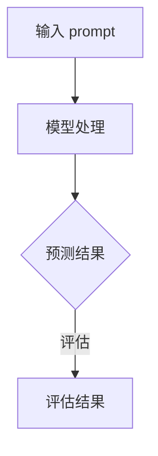

                 

### 文章标题

《构建prompt效果的预测性评测系统》

### 核心概念与联系

在自然语言处理（NLP）领域中，`prompt`是一种用于引导模型理解问题和生成答案的文本输入。`prompt`效果，即模型在接收到不同`prompt`时表现出的预测能力，是评估NLP系统性能的关键指标之一。构建一个预测性评测系统，旨在通过一系列标准化测试，评估模型在不同`prompt`下的适应性和准确性。

#### 什么是`prompt`

在NLP中，`prompt`是指提供给模型的一段引导性的文本，它可以包含问题、命令或其他形式的信息。`prompt`的作用是帮助模型更好地理解上下文，从而生成更准确的预测。例如，在一个聊天机器人中，用户的输入可以被视为`prompt`，而模型需要根据`prompt`生成合适的回答。

#### `prompt`效果在预测性评测系统中的作用

预测性评测系统的核心目标是对模型的性能进行评估，以确保其在不同场景下的可靠性和适应性。`prompt`效果在这里扮演了至关重要的角色：

1. **多样性测试**：通过提供多种不同的`prompt`，评测系统可以测试模型在不同语境下的性能，从而评估其泛化能力。
2. **准确性评估**：`prompt`效果的好坏直接关系到模型的预测准确性。一个优秀的评测系统应能够准确衡量模型在不同`prompt`下的表现。
3. **适应性检验**：模型在不同`prompt`下的表现反映了其适应变化的能力。预测性评测系统可以帮助我们了解模型在实际应用中的表现。

#### Mermaid 流程图

为了更好地理解`prompt`效果在预测性评测系统中的流程，我们可以使用Mermaid绘制一个简单的流程图：



在这个流程图中，`A`代表输入的`prompt`，`B`表示模型对`prompt`进行处理，`C`是模型的预测结果，而`D`则是评估结果的输出。通过这个流程，我们可以清晰地看到`prompt`效果在整个系统中的重要性。

### 核心算法原理讲解

预测性评测系统的核心在于其使用的算法，这些算法通常基于机器学习，特别是深度学习。下面，我们将通过一个简单的伪代码，详细讲解如何构建一个基于神经网络的预测模型。

#### 基本框架

```python
# 初始化模型参数
model = NeuralNetwork()

# 训练模型
for epoch in range(num_epochs):
    for prompt, target in dataset:
        # 前向传播
        output = model.forward(prompt)
        
        # 计算损失
        loss = loss_function(output, target)
        
        # 反向传播
        model.backward(loss)
        
        # 更新模型参数
        model.update_parameters()
```

#### 详细解释

1. **模型初始化**：
   首先，我们需要初始化模型参数。这通常涉及到创建一个神经网络结构，并随机初始化其权重和偏置。

2. **数据集准备**：
   预测模型的训练需要大量的数据集。每个数据点由一个`prompt`和一个对应的真实标签组成。

3. **前向传播**：
   在每个训练周期中，模型会接收到一个`prompt`，并通过其内部结构进行计算，生成预测输出。这个过程称为前向传播。

4. **损失计算**：
   预测输出与真实标签之间的差异通过损失函数进行量化。常用的损失函数包括均方误差（MSE）和交叉熵损失。

5. **反向传播**：
   接下来，模型会使用计算得到的损失梯度来更新其参数。这个过程称为反向传播，它是深度学习中的关键步骤。

6. **参数更新**：
   最后，模型的参数会根据学习率进行调整，以最小化损失函数。

#### 伪代码示例

以下是一个更详细的伪代码示例，用于说明如何构建和训练一个简单的神经网络：

```python
# 导入必要的库
import tensorflow as tf
import numpy as np

# 定义神经网络结构
model = tf.keras.Sequential([
    tf.keras.layers.Dense(units=64, activation='relu', input_shape=(input_size,)),
    tf.keras.layers.Dense(units=1)
])

# 定义损失函数和优化器
loss_function = tf.keras.losses.MeanSquaredError()
optimizer = tf.keras.optimizers.Adam(learning_rate=0.001)

# 训练模型
for epoch in range(num_epochs):
    for prompt, target in dataset:
        with tf.GradientTape() as tape:
            # 前向传播
            output = model(prompt)
            
            # 计算损失
            loss = loss_function(target, output)
        
        # 计算梯度
        gradients = tape.gradient(loss, model.trainable_variables)
        
        # 更新参数
        optimizer.apply_gradients(zip(gradients, model.trainable_variables))
        
        # 输出训练进度
        print(f"Epoch {epoch}, Loss: {loss.numpy()}")
```

在这个示例中，我们使用TensorFlow库构建了一个简单的神经网络，并使用均方误差作为损失函数，Adam优化器来进行参数更新。通过这个示例，我们可以看到构建和训练一个基本预测模型的基本步骤和流程。

### 数学模型和数学公式

在构建预测性评测系统时，理解数学模型是至关重要的。以下是几个关键的数学概念和公式，包括损失函数、优化算法等。

#### 损失函数

在预测性评测系统中，损失函数用于衡量模型预测值与真实值之间的差距。最常用的损失函数之一是均方误差（MSE）：

$$L(y, \hat{y}) = (y - \hat{y})^2$$

其中，$y$ 表示真实标签，$\hat{y}$ 表示预测标签。MSE 的作用是将预测误差平方，从而强调较大误差的影响。

#### 优化算法

优化算法用于更新模型参数，以最小化损失函数。最常用的优化算法之一是梯度下降（Gradient Descent）：

$$\theta = \theta - \alpha \cdot \nabla_\theta L(\theta)$$

其中，$\theta$ 表示模型参数，$\alpha$ 是学习率，$\nabla_\theta L(\theta)$ 表示损失函数关于参数 $\theta$ 的梯度。梯度下降的目的是通过计算梯度来更新参数，从而逐步减小损失函数的值。

#### 梯度下降算法

梯度下降算法的更新公式可以进一步扩展为：

$$\theta_j = \theta_j - \alpha \cdot \frac{\partial L}{\partial \theta_j}$$

其中，$j$ 表示参数的下标。这个公式说明，每个参数的更新量都与其对应的梯度成正比。

#### 示例

假设我们有一个预测房价的模型，其预测函数为：

$$f(x) = w_1x_1 + w_2x_2$$

其中，$x_1$ 和 $x_2$ 是房屋的特征，$w_1$ 和 $w_2$ 是模型参数。已知一组训练数据，包括房屋的特征和真实房价。我们可以通过最小化损失函数来学习模型的参数。

损失函数为：

$$L(w_1, w_2) = \sum (y_i - (w_1x_{1i} + w_2x_{2i}))^2$$

使用梯度下降算法，我们可以更新参数：

$$w_1 = w_1 - \alpha \cdot \nabla_{w_1} L(w_1, w_2)$$
$$w_2 = w_2 - \alpha \cdot \nabla_{w_2} L(w_1, w_2)$$

具体来说，梯度下降的计算过程如下：

1. **计算损失函数**：
   对于每个数据点，计算预测值和真实值之间的差距，并求和。

2. **计算梯度**：
   对损失函数关于每个参数求导，得到每个参数的梯度。

3. **更新参数**：
   根据梯度和学习率，更新每个参数的值。

通过反复迭代这个过程，模型参数会逐步优化，直到达到预设的收敛条件。

### 项目实战

#### 开发环境搭建

为了构建预测性评测系统，我们需要搭建一个合适的环境。以下是环境搭建的步骤：

1. **安装Python**：

   在大多数Linux发行版中，可以使用以下命令安装Python：

   ```shell
   sudo apt-get install python3
   ```

2. **安装TensorFlow**：

   TensorFlow是构建深度学习模型的重要库。可以使用以下命令安装：

   ```shell
   pip3 install tensorflow
   ```

3. **安装其他库**：

   除了TensorFlow，我们可能还需要其他库，如NumPy、Pandas和Matplotlib。可以使用以下命令安装：

   ```shell
   pip3 install numpy pandas matplotlib
   ```

#### 源代码实现

下面是一个简单的Python代码示例，用于构建和训练一个基于神经网络的预测模型。

```python
import tensorflow as tf
import numpy as np

# 准备数据集
X = np.array([[1, 2], [2, 3], [3, 4]])
y = np.array([2, 3, 4])

# 定义模型
model = tf.keras.Sequential([
    tf.keras.layers.Dense(units=1, input_shape=(2,))
])

# 编译模型
model.compile(optimizer='sgd', loss='mean_squared_error')

# 训练模型
model.fit(X, y, epochs=1000)

# 进行预测
predictions = model.predict(X)
print(predictions)
```

在这个示例中，我们首先导入所需的库，然后准备一个简单的一维数据集。接着，我们定义一个简单的神经网络模型，并使用均方误差作为损失函数。最后，我们使用随机梯度下降（SGD）优化器来训练模型，并输出预测结果。

#### 代码解读与分析

1. **数据准备**：

   数据集`X`包含了三个样本，每个样本由两个特征组成。`y`是真实标签，对应于`X`中每个样本的预测值。

2. **模型定义**：

   我们使用`tf.keras.Sequential`来定义一个简单的神经网络模型。这个模型只有一个全连接层，输出一个预测值。

3. **模型编译**：

   在模型编译阶段，我们指定了优化器（SGD）和损失函数（MSE）。这将为模型训练提供必要的配置。

4. **模型训练**：

   我们使用`model.fit`来训练模型。这里，我们指定了训练的轮数（epochs），模型将在每一轮中调整其参数，以最小化损失函数。

5. **预测**：

   通过`model.predict`，我们可以使用训练好的模型进行预测。这个方法将输入数据映射到预测输出。

#### 实际案例分析

假设我们有一个更大的数据集，包含多个特征和标签。我们可以使用同样的方法来构建和训练模型。以下是一个扩展的示例：

```python
# 加载更大规模的数据集
X = np.load('data.npy')
y = np.load('labels.npy')

# 定义更复杂的模型
model = tf.keras.Sequential([
    tf.keras.layers.Dense(units=64, activation='relu', input_shape=(X.shape[1],)),
    tf.keras.layers.Dense(units=32, activation='relu'),
    tf.keras.layers.Dense(units=1)
])

# 编译模型
model.compile(optimizer='adam', loss='mean_squared_error')

# 训练模型
model.fit(X, y, epochs=1000, batch_size=32)

# 进行预测
predictions = model.predict(X)
print(predictions)
```

在这个扩展的示例中，我们使用了一个包含更多层的神经网络，并设置了批次大小（batch_size）。这可以进一步提高模型的性能和预测准确性。

### 最佳实践

#### 1. 数据预处理

在构建预测性评测系统时，数据预处理是至关重要的。确保数据干净、无噪声，并对缺失值进行适当的处理。

#### 2. 模型选择

根据具体应用场景选择合适的模型。对于简单的预测任务，线性回归可能就足够了；对于更复杂的任务，深度学习模型如神经网络可能更为适用。

#### 3. 超参数调优

通过调整学习率、批次大小、隐藏层大小等超参数，可以显著提高模型的性能。

#### 4. 过拟合与正则化

避免过拟合，通过正则化技术如L1、L2正则化来降低模型的复杂度。

#### 5. 模型验证

使用交叉验证等技术，确保模型在不同数据集上的表现一致，避免模型过拟合。

#### 小结

构建一个高效的预测性评测系统需要从多个方面进行考虑，包括数据预处理、模型选择、超参数调优等。通过本文的介绍，我们了解了`prompt`效果的重要性，并掌握了构建预测性评测系统的基本方法和实践技巧。希望本文能对您的实际应用提供有价值的参考。

### 注意事项

1. **数据质量**：保证输入数据的准确性和一致性，对于模型性能至关重要。
2. **计算资源**：构建和训练预测性评测系统可能需要大量计算资源，应根据实际情况选择合适的硬件和软件环境。
3. **模型解释性**：虽然深度学习模型在预测性能上表现优异，但其内部机制往往难以解释。因此，在应用深度学习模型时，需要考虑其解释性。

### 拓展阅读

- 《深度学习》（Goodfellow, Bengio, Courville）：详细介绍深度学习理论、算法和应用。
- 《Python机器学习》（Crisp）：涵盖机器学习的基础知识，包括数据预处理、模型训练和评估等。
- 《自然语言处理综论》（Jurafsky, Martin）：系统介绍自然语言处理的基础理论和实践方法。

### 作者信息

作者：AI天才研究院/AI Genius Institute & 禅与计算机程序设计艺术 /Zen And The Art of Computer Programming

