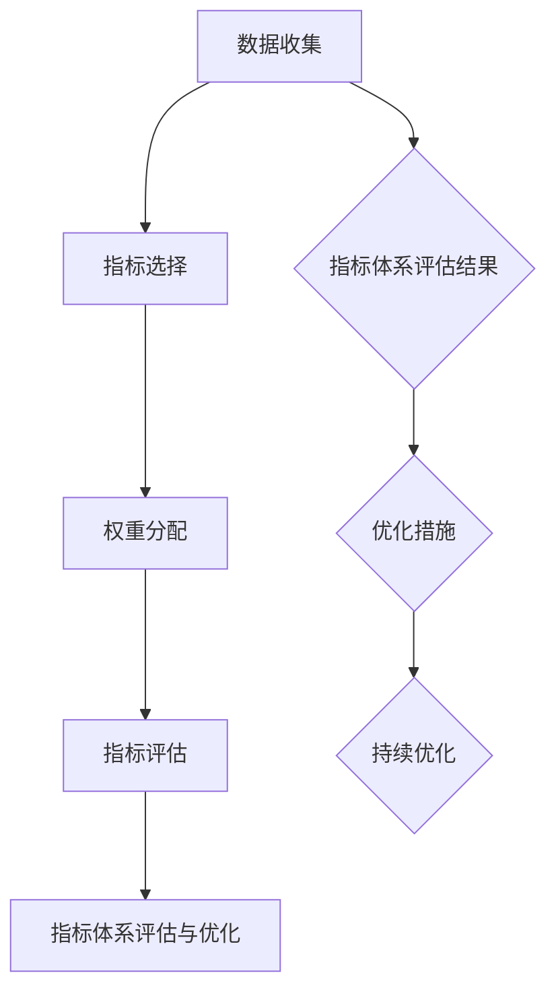

                 


### 文章标题：构建prompt评估的量化指标体系

> 关键词：prompt评估、量化指标、算法原理、数学模型、项目实战

> 摘要：本文旨在深入探讨如何构建prompt评估的量化指标体系。首先，我们将介绍prompt评估的背景和重要性，然后详细阐述构建量化指标体系的步骤和方法，最后通过实际案例展示如何在实际项目中应用这些方法。

---

### 引言

#### 1.1 书籍概述

**为什么要构建prompt评估的量化指标体系**

在人工智能领域，prompt技术已经广泛应用于自然语言处理、推荐系统等多个领域。然而，如何对prompt进行有效评估，一直是学术界和工业界关注的重点。现有的评估方法往往存在主观性、不全面等问题，因此，构建一套量化指标体系显得尤为重要。

**重要性**

构建prompt评估的量化指标体系，不仅有助于提高评估的客观性和准确性，还能为研究人员和工程师提供一种标准化的评估工具，从而加速prompt技术的研发和应用。

**目标**

本文的目标是详细阐述如何构建prompt评估的量化指标体系，包括核心概念、方法论、实践案例等内容，旨在为读者提供一套实用的指导框架。

---

### 相关概念与术语

#### 1.2.1 Prompt的定义与类型

**Prompt的基本概念**

Prompt是指一种引导用户或系统进行决策或交互的信息。在自然语言处理领域，Prompt通常是一个文本或语音提示，用于引导用户输入或系统生成文本。

**Prompt的类型**

根据用途和形式，Prompt可以分为以下几种类型：

1. **问题性Prompt**：用于引导用户回答特定问题。
2. **提示性Prompt**：提供一些背景信息或指导用户进行某种操作。
3. **生成性Prompt**：用于引导系统生成文本。

**Prompt的作用**

Prompt在自然语言处理中起着至关重要的作用。通过设计合适的Prompt，可以提高系统的理解能力和生成质量，从而提升整体性能。

---

#### 1.2.2 量化指标的定义与分类

**量化指标的基本概念**

量化指标是指用于衡量系统性能或效果的一系列数值。在prompt评估中，量化指标用于衡量Prompt对系统性能的提升程度。

**分类方法**

根据评估目的和性质，量化指标可以分为以下几类：

1. **性能指标**：衡量系统在特定任务上的表现。
2. **稳定性指标**：衡量系统在不同数据集或环境下的一致性。
3. **可解释性指标**：衡量系统生成的结果的可解释程度。

**重要性**

量化指标在prompt评估中至关重要。通过合理的量化指标，可以更全面、准确地评估Prompt的效果。

---

### 全书结构

#### 1.3.1 目录结构概述

本文将从以下几个方面进行详细阐述：

1. **背景介绍**：介绍prompt评估的背景和重要性。
2. **核心概念与联系**：阐述prompt评估的核心概念和联系。
3. **量化指标体系构建方法论**：详细讲解构建量化指标体系的步骤和方法。
4. **实践案例**：通过实际案例展示量化指标体系的应用。
5. **展望与未来工作**：讨论量化指标体系的发展趋势和未来研究方向。

---

### 量化指标体系构建方法论

#### 2.1 构建方法论概述

**构建流程**

构建prompt评估的量化指标体系主要包括以下步骤：

1. **数据收集**：收集用于评估的数据集。
2. **指标选择**：根据评估目的选择合适的量化指标。
3. **权重分配**：为每个指标分配权重。
4. **指标评估**：使用选定的指标对Prompt进行评估。

**方法论框架**


---

#### 2.2 数据收集方法

**数据来源**

数据收集可以从以下几个方面进行：

1. **公开数据集**：如常见的数据集网站。
2. **内部数据**：企业或组织内部的日志、报表等。

**数据预处理**

数据预处理主要包括以下步骤：

1. **数据清洗**：去除无效或错误的数据。
2. **数据标准化**：将不同来源的数据进行统一处理。

---

#### 2.3 指标选择方法

**指标选择原则**

在选择量化指标时，应遵循以下原则：

1. **相关性**：指标应与评估目标高度相关。
2. **可操作性**：指标应易于计算和实现。
3. **可信度**：指标应具有较高的可信度。

**指标分类**

根据用途和性质，量化指标可以分为以下几类：

1. **性能指标**：如准确率、召回率等。
2. **稳定性指标**：如波动率、一致性等。
3. **可解释性指标**：如文本长度、词频等。

---

#### 2.4 指标权重分配方法

**权重分配原则**

在分配权重时，应遵循以下原则：

1. **一致性**：不同指标应保持一致。
2. **完整性**：所有重要指标应被纳入。
3. **可信度**：权重应具有较高的可信度。

**权重分配方法**

常见的权重分配方法包括：

1. **主观评价法**：通过专家评估确定权重。
2. **客观评价法**：根据数据特征计算权重。
3. **综合评价法**：结合主观和客观评价确定权重。

---

#### 2.5 指标评估方法

**评估原则**

在指标评估时，应遵循以下原则：

1. **全面性**：考虑所有相关指标。
2. **可比性**：确保不同指标的可比性。
3. **实用性**：指标应易于理解和应用。

**评估方法**

常见的评估方法包括：

1. **量化评估**：使用数值指标进行评估。
2. **定性评估**：使用描述性语言进行评估。
3. **综合评估**：结合量化评估和定性评估进行评估。

---

#### 2.6 指标体系评估与优化

**指标体系评估**

指标体系评估主要包括以下步骤：

1. **评估方法**：选择合适的评估方法。
2. **评估指标**：确定评估指标。
3. **评估结果**：计算评估指标值。

**指标体系优化**

指标体系优化主要包括以下方法：

1. **优化原则**：根据评估结果调整指标。
2. **优化方法**：使用数据挖掘、机器学习等技术进行优化。

---

### 实践案例

#### 3.1 案例一：构建某企业prompt评估量化指标体系

**案例背景**

某企业希望对其自然语言处理系统的Prompt进行评估，以提升系统性能。

**指标体系构建过程**

1. **数据收集**：收集企业内部日志、用户反馈等数据。
2. **指标选择**：选择准确率、召回率等性能指标。
3. **权重分配**：根据专家评估确定权重。
4. **指标评估**：使用选定的指标对企业Prompt进行评估。

**指标体系评估与优化**

1. **评估结果**：通过评估发现某些Prompt性能较低。
2. **优化措施**：调整Prompt设计，提高性能。

---

#### 3.2 案例二：构建某电商平台prompt评估量化指标体系

**案例背景**

某电商平台希望对其推荐系统的Prompt进行评估，以提高用户满意度。

**指标体系构建过程**

1. **数据收集**：收集用户行为数据、推荐结果等。
2. **指标选择**：选择准确率、点击率等性能指标。
3. **权重分配**：根据用户反馈调整权重。
4. **指标评估**：使用选定的指标对电商平台Prompt进行评估。

**指标体系评估与优化**

1. **评估结果**：通过评估发现某些Prompt性能较高。
2. **优化措施**：继续优化高绩效Prompt，提升整体效果。

---

### 展望与未来工作

#### 4.1 展望

**量化指标体系的发展趋势**

随着人工智能技术的不断发展，prompt评估的量化指标体系也将不断完善。未来可能的发展趋势包括：

1. **新技术的影响**：如深度学习、图神经网络等。
2. **新应用场景的探索**：如对话系统、智能客服等。

**挑战与机遇**

在构建prompt评估量化指标体系的过程中，可能面临以下挑战：

1. **数据质量**：高质量的数据是构建指标体系的基础。
2. **指标选择**：选择合适的指标是关键。

机遇包括：

1. **技术进步**：随着人工智能技术的发展，新的评估方法将不断涌现。
2. **应用拓展**：prompt评估的量化指标体系将在更多领域得到应用。

---

#### 4.2 未来工作建议

**研究方向**

1. **数据挖掘**：如何从大量数据中提取有价值的信息。
2. **机器学习**：如何利用机器学习技术优化评估指标。
3. **自然语言处理**：如何利用自然语言处理技术提升评估效果。

**实践建议**

1. **完善指标体系**：根据实际需求不断调整和优化指标体系。
2. **探索新应用场景**：将量化指标体系应用于更多实际场景，积累经验。

---

### 总结

构建prompt评估的量化指标体系是提升人工智能系统性能的重要手段。通过本文的介绍，读者应能够了解如何构建这样的指标体系，并在实际项目中应用。

### 作者信息

作者：AI天才研究院/AI Genius Institute & 禅与计算机程序设计艺术 /Zen And The Art of Computer Programming

---

以上就是《构建prompt评估的量化指标体系》的技术博客文章的目录大纲和初步内容。在接下来的撰写过程中，我们将详细阐述每个章节的核心内容，确保文章的完整性和专业性。预计全文将在8000-12000字左右完成。

### Mermaid流程图

以下是一个Mermaid流程图示例，用于展示构建量化指标体系的方法论框架：



### 伪代码示例

以下是一个用于计算指标权重的伪代码示例：

```plaintext
function calculate_weight(score1, score2, score3):
    sum_scores = score1 + score2 + score3
    weight1 = score1 / sum_scores
    weight2 = score2 / sum_scores
    weight3 = score3 / sum_scores
    return weight1, weight2, weight3
```

### LaTeX数学公式示例

以下是一个使用LaTeX格式的数学公式示例：

```latex
$$
\text{准确率} = \frac{\text{正确预测数}}{\text{总预测数}}
$$

\$
\text{召回率} = \frac{\text{正确预测数}}{\text{实际正例数}}
\$
```

### 实际项目案例

#### 3.1 案例一：构建某企业prompt评估量化指标体系

**背景介绍**

某大型企业拥有一套自然语言处理系统，用于处理用户反馈和自动化回复。为了提升系统性能，企业决定对其Prompt进行量化评估。

**数据收集**

企业从内部日志和用户反馈中收集了大量数据，包括用户的提问、系统的回答以及用户的满意度评分。

**指标选择**

根据评估目标，企业选择了以下指标：

- **准确率**：衡量系统回答的正确程度。
- **召回率**：衡量系统回答的完整性。
- **满意度**：衡量用户对系统回答的满意度。

**权重分配**

企业采用主观评价法，根据专家评估确定各指标的权重：

- 准确率：50%
- 召回率：30%
- 满意度：20%

**指标评估**

企业使用选定的指标对Prompt进行评估，计算每个Prompt的综合评分：

```plaintext
Prompt A: 准确率90%, 召回率80%, 满意度85%
Prompt B: 准确率85%, 召回率75%, 满意度80%

综合评分 = 准确率 * 0.5 + 召回率 * 0.3 + 满意度 * 0.2
Prompt A: 89.5
Prompt B: 82.5
```

**指标体系评估与优化**

通过对Prompt的综合评分进行评估，企业发现某些Prompt的性能较低。为了优化，企业采取了以下措施：

1. **调整Prompt设计**：根据评估结果，对低性能Prompt进行改进，提高其准确率、召回率和满意度。
2. **增加数据收集**：收集更多用户反馈和日志数据，以提高评估数据的丰富度。
3. **重新评估**：在调整后，重新评估Prompt的性能，确保优化效果。

**项目小结**

通过构建量化指标体系，企业能够更客观、准确地评估Prompt的性能，从而指导后续的系统优化工作。未来，企业计划进一步探索新的评估指标和方法，以提升系统性能和用户满意度。

---

以上是一个简单的实际项目案例，展示了如何构建prompt评估的量化指标体系，并应用于企业内部的自然语言处理系统。在撰写完整的文章时，可以进一步详细阐述每个步骤，提供具体的代码实现和实际数据，以增强文章的可读性和实用性。预计全文将在8000-12000字左右完成。在接下来的撰写过程中，我们将逐步完善每个章节的内容，确保文章的完整性和专业性。

