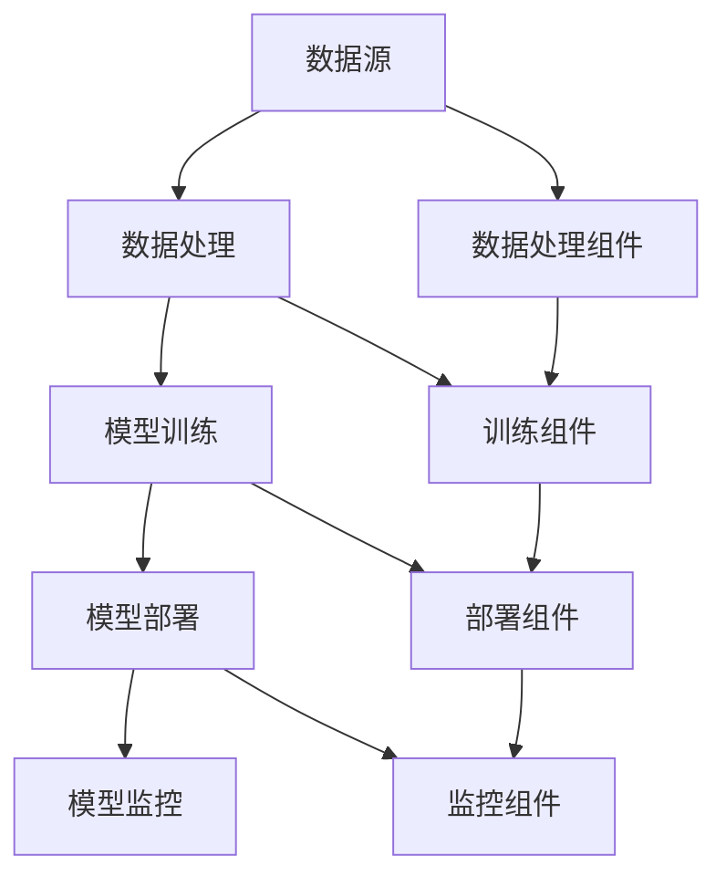

                 

### 引言

#### 1.1 研究背景及意义

随着人工智能技术的迅猛发展，语言模型（Language Model，简称LM）已经成为自然语言处理（Natural Language Processing，简称NLP）领域中不可或缺的核心技术。从最初的基于统计的N元语法模型，到基于神经网络的深度学习模型，再到近年来基于Transformer架构的预训练模型，如BERT、GPT等，语言模型在各个方面都取得了显著的突破。

语言模型在许多实际应用中扮演着重要角色，如文本分类、机器翻译、问答系统等。然而，随着应用场景的多样化，构建高效、可复用的语言模型应用组件变得越来越重要。这不仅能够提高开发效率，还能降低维护成本，实现技术的快速落地。

可复用的LLM应用组件库旨在提供一套标准化的、模块化的组件，涵盖从数据处理、模型训练到模型部署的各个环节。这样的组件库不仅能够提高开发效率，还能确保组件的稳定性和可扩展性，为不同应用场景提供灵活的解决方案。

本文将围绕构建可复用的LLM应用组件库展开讨论，旨在为读者提供一个系统、全面的技术指南。本文将首先介绍语言模型的基础知识，然后详细阐述LLM应用组件的设计原则、架构设计、开发实践，以及数据处理、训练、部署等组件的具体实现。最后，通过实际案例解析，展示如何利用组件库构建一个完整的LLM应用，并对未来发展趋势进行展望。

#### 1.2 本书结构

本书分为八个章节，内容结构如下：

- **第1章 引言**：介绍研究背景及意义，概述本书的结构和主要内容。

- **第2章 语言模型基础**：介绍语言模型的基本概念、常见语言模型及其应用场景。

- **第3章 LLM应用组件设计**：详细阐述LLM应用组件的设计原则、架构设计和开发实践。

- **第4章 数据处理组件**：介绍数据处理组件，包括数据清洗、预处理和存储与管理。

- **第5章 训练组件**：介绍训练组件，包括训练算法、模型优化和模型评估。

- **第6章 部署组件**：介绍部署组件，包括模型压缩、部署流程和模型监控与维护。

- **第7章 实际案例解析**：通过一个实际案例，展示如何利用组件库构建一个完整的LLM应用。

- **第8章 未来发展趋势与展望**：讨论LLM技术的未来发展趋势，以及可复用组件库的发展方向。

每个章节都包含具体的实例和代码，旨在帮助读者深入理解并实践语言模型应用组件的设计与实现。

## 第2章 语言模型基础

### 2.1 语言模型概述

语言模型是自然语言处理的核心技术之一，其目的是通过对大规模文本数据的建模，预测下一个单词或句子的概率分布。语言模型在多个自然语言处理任务中发挥着重要作用，如文本生成、机器翻译、问答系统和文本分类等。

语言模型可以分为基于统计的模型和基于神经网络的模型。早期基于统计的语言模型主要采用N元语法（N-gram）模型，通过计算相邻单词的联合概率来预测下一个单词。然而，N元语法模型存在一些局限性，如无法捕捉长距离依赖关系、对稀疏数据的处理能力较差等。

随着深度学习技术的发展，基于神经网络的深度学习模型逐渐成为语言模型的主流。RNN（递归神经网络）、LSTM（长短期记忆网络）和GRU（门控递归单元）是早期用于语言建模的深度学习模型，它们通过引入门控机制，有效解决了长距离依赖问题。近年来，基于Transformer架构的预训练模型，如BERT（Bidirectional Encoder Representations from Transformers）和GPT（Generative Pre-trained Transformer），在多个NLP任务上取得了显著的突破。

语言模型的基本概念包括：

- **输入序列**：语言模型处理的是一个序列的输入，每个输入可以是单词、字符或子词（Subword）。

- **输出概率分布**：对于给定的输入序列，语言模型需要预测下一个单词或句子的概率分布。

- **损失函数**：语言模型通常采用最大似然估计（Maximum Likelihood Estimation，简称MLE）或最小化交叉熵（Cross-Entropy Loss）来训练模型。

- **预训练和微调**：预训练是指在大规模无标签数据上进行训练，以学习语言的通用特征。微调是指在小规模有标签数据上进行训练，以适应特定任务。

### 2.2 常见语言模型

#### 2.2.1 RNN、LSTM、GRU

RNN（递归神经网络）是最早用于处理序列数据的神经网络模型。RNN通过在时间步之间传递信息，尝试捕捉序列中的依赖关系。然而，传统的RNN存在梯度消失或梯度爆炸问题，难以处理长序列数据。

LSTM（长短期记忆网络）是RNN的一种变体，通过引入门控机制，能够有效地解决长距离依赖问题。LSTM包含输入门、遗忘门和输出门，分别控制信息输入、信息保留和输出决策。

GRU（门控递归单元）是LSTM的简化版，通过合并输入门和遗忘门，减少参数数量，同时保持良好的性能。GRU在训练速度和计算效率上优于LSTM。

以下是一个简单的LSTM模型伪代码示例：

```python
// LSTM模型伪代码
class LSTMCell:
    def __init__(self, input_size, hidden_size):
        # 初始化权重和偏置
        self.input_weight = ...
        self.input_bias = ...
        self.forget_weight = ...
        self.forget_bias = ...
        self.output_weight = ...
        self.output_bias = ...
        self.hidden_size = hidden_size

    def forward(self, input, hidden):
        # 计算输入门、遗忘门和输出门
        input_gate = sigmoid(dot(input, self.input_weight) + dot(hidden, self.input_bias))
        forget_gate = sigmoid(dot(input, self.forget_weight) + dot(hidden, self.forget_bias))
        output_gate = sigmoid(dot(input, self.output_weight) + dot(hidden, self.output_bias))
        # 计算当前隐藏状态
        current_hidden = ...
        return current_hidden

class LSTM:
    def __init__(self, input_size, hidden_size, num_layers):
        # 初始化LSTM细胞
        self.lstm_cells = [LSTMCell(input_size, hidden_size) for _ in range(num_layers)]
        self.hidden_size = hidden_size
        self.num_layers = num_layers

    def forward(self, input_sequence):
        # 前向传播
        hidden_sequence = []
        previous_hidden = None
        for input in input_sequence:
            if previous_hidden is not None:
                current_hidden = self.lstm_cells[0].forward(input, previous_hidden)
            else:
                current_hidden = self.lstm_cells[0].forward(input, None)
            hidden_sequence.append(current_hidden)
            previous_hidden = current_hidden
        return hidden_sequence
```

#### 2.2.2 Transformer、BERT、GPT

Transformer是近年来提出的用于序列建模的深度学习模型，通过自注意力机制（Self-Attention Mechanism）有效地捕捉序列中的依赖关系。Transformer不再依赖于递归结构，从而在训练速度和计算效率上取得了显著提升。

BERT（Bidirectional Encoder Representations from Transformers）是Google提出的一种预训练方法，通过在大量无标签文本数据上进行双向编码器的预训练，学习语言的上下文表示。BERT在多个NLP任务上取得了卓越的性能，如文本分类、问答系统等。

GPT（Generative Pre-trained Transformer）是OpenAI提出的一种生成模型，通过在大量文本数据上进行预训练，学习语言的生成规则。GPT在文本生成任务上表现出色，如文章生成、对话系统等。

以下是一个简单的Transformer模型伪代码示例：

```python
// Transformer模型伪代码
class TransformerLayer:
    def __init__(self, d_model, num_heads, dff):
        # 初始化权重和偏置
        self.self_attention = MultiHeadSelfAttention(d_model, num_heads)
        self.dense_1 = Dense(d_model, dff)
        self.dense_2 = Dense(d_model)

    def forward(self, inputs, training=False):
        # 自注意力机制
        attention_output = self.self_attention(inputs)
        # 加权求和
        attention_output = add(inputs, attention_output)
        attention_output = activation(self.dense_1(attention_output))
        # 前向传播
        output = self.dense_2(attention_output)
        return output

class Transformer:
    def __init__(self, num_layers, d_model, num_heads, dff):
        # 初始化Transformer层
        self.layers = [TransformerLayer(d_model, num_heads, dff) for _ in range(num_layers)]
        self.d_model = d_model

    def forward(self, input_sequence, training=False):
        # 前向传播
        output_sequence = input_sequence
        for layer in self.layers:
            output_sequence = layer(output_sequence, training)
        return output_sequence
```

### 2.3 语言模型应用场景

语言模型在多个NLP任务中发挥着重要作用，以下是一些常见的应用场景：

- **文本分类**：将文本分类到预定义的类别中，如情感分析、新闻分类等。

- **机器翻译**：将一种语言的文本翻译成另一种语言，如英语到中文的翻译。

- **问答系统**：根据用户的问题，从大量文本中检索出最相关的答案。

- **文本生成**：生成符合语法和语义规则的文本，如文章生成、对话系统等。

语言模型的应用场景广泛，随着技术的不断发展，未来还将出现更多创新的应用。

## 第3章 LLM应用组件设计

### 3.1 组件设计原则

在构建可复用的LLM应用组件库时，组件设计原则至关重要。这些原则确保组件具有高可复用性、易扩展性和高性能，从而满足不同应用场景的需求。

#### 可复用性

可复用性是组件设计的重要原则之一。一个可复用的组件应该能够适应不同的应用场景，无需进行大量的修改或重新开发。为了实现可复用性，组件需要具备以下特性：

- **通用性**：组件应设计为通用型，能够处理多种数据格式和输入类型。
- **模块化**：组件应划分为多个模块，每个模块负责特定的功能，便于独立开发、测试和部署。
- **抽象化**：组件应提供抽象化的接口，隐藏内部实现细节，使用户只需关注组件的功能和输入输出。

#### 易扩展性

易扩展性是组件设计的另一个关键原则。随着应用场景的演变和技术的更新，组件需要能够灵活地适应新的需求。为了实现易扩展性，组件设计应考虑以下方面：

- **可插拔式架构**：组件应采用模块化设计，允许用户根据需求添加或替换特定模块。
- **参数配置**：组件应支持灵活的参数配置，允许用户根据应用场景调整组件的行为和性能。
- **扩展接口**：组件应提供扩展接口，允许用户自定义特定功能，实现个性化需求。

#### 高性能

高性能是组件设计的重要目标之一。一个高性能的组件能够保证系统的响应速度和吞吐量，从而满足实际应用的需求。为了实现高性能，组件设计应考虑以下方面：

- **并行化**：组件应支持并行计算，充分利用多核CPU和GPU等硬件资源，提高计算效率。
- **内存管理**：组件应优化内存使用，避免内存泄漏和缓存冲突，提高内存利用率。
- **优化算法**：组件应采用高效的算法和数据处理策略，降低计算复杂度和内存占用。

### 3.2 组件架构设计

LLM应用组件库的架构设计应遵循高内聚、低耦合的原则，确保组件之间的高效协作和独立部署。以下是组件架构设计的具体步骤：

#### 组件分层设计

组件架构可以采用分层设计，分为数据层、模型层和应用层。

- **数据层**：负责数据的采集、清洗、预处理和存储等任务。数据层包括数据源、数据清洗组件、数据预处理组件和数据存储组件等。
- **模型层**：负责语言模型的训练、优化、评估和部署等任务。模型层包括训练组件、优化组件、评估组件和部署组件等。
- **应用层**：负责将模型应用于具体的业务场景，实现实际功能。应用层包括应用接口、业务逻辑和用户界面等。

#### 组件接口定义

为了实现组件之间的协作和互操作性，组件接口定义至关重要。组件接口应包括以下方面：

- **输入输出**：明确组件的输入和输出数据格式，确保组件之间的数据流通。
- **方法调用**：定义组件提供的功能方法，包括初始化、数据处理、模型训练、模型优化、模型评估和模型部署等。
- **配置参数**：定义组件的可配置参数，允许用户根据需求调整组件的行为和性能。

以下是一个简单的组件架构图：

```
graph TD
    A[数据层] --> B[模型层]
    B --> C[应用层]
    A --> D[数据源]
    A --> E[数据清洗]
    A --> F[数据预处理]
    A --> G[数据存储]
    B --> H[训练]
    B --> I[优化]
    B --> J[评估]
    B --> K[部署]
    C --> L[应用接口]
    C --> M[业务逻辑]
    C --> N[用户界面]
```

### 3.3 组件开发实践

LLM应用组件库的开发涉及多个环节，包括需求分析、设计、编码、测试和部署等。以下是一些组件开发实践的关键步骤：

#### 需求分析

在组件开发前，进行详细的需求分析至关重要。需求分析包括以下方面：

- **功能需求**：明确组件需要实现的功能，如数据预处理、模型训练、模型优化等。
- **性能需求**：明确组件的性能指标，如处理速度、内存占用、资源利用率等。
- **兼容性需求**：明确组件需要支持的平台和编程语言，如Python、Java等。

#### 设计

在需求分析的基础上，进行组件设计。组件设计包括以下方面：

- **架构设计**：根据需求分析，设计组件的架构，包括组件分层、组件接口定义等。
- **模块划分**：将组件划分为多个模块，每个模块负责特定的功能，便于独立开发、测试和部署。
- **接口定义**：根据组件架构，定义组件的接口，包括输入输出、方法调用、配置参数等。

#### 编码

根据组件设计，进行编码实现。编码实现应遵循以下原则：

- **代码规范**：遵循统一的代码规范，如命名规范、缩进规则、注释等。
- **模块化**：将代码划分为多个模块，每个模块实现特定的功能，便于管理和维护。
- **可复用性**：编写可复用的代码，避免重复编写相似的功能。

#### 测试

在组件开发过程中，进行全面的测试至关重要。测试包括以下方面：

- **功能测试**：验证组件是否实现预期的功能，如数据预处理、模型训练、模型优化等。
- **性能测试**：评估组件的性能指标，如处理速度、内存占用、资源利用率等。
- **兼容性测试**：验证组件在不同平台和编程语言上的兼容性。

#### 部署

在组件开发完成后，进行部署。部署包括以下方面：

- **安装**：将组件安装到目标环境中，包括操作系统、编程语言和依赖库等。
- **配置**：配置组件的参数，如数据源、模型参数、性能参数等。
- **监控**：监控组件的运行状态，包括内存占用、CPU使用率、网络流量等。

#### 实践案例

以下是一个数据预处理组件的开发实践案例：

1. **需求分析**：需要实现数据预处理功能，包括数据清洗、数据标准化和数据增强。

2. **设计**：

   - **架构设计**：数据预处理组件采用分层设计，包括数据清洗层、数据标准化层和数据增强层。
   - **接口定义**：接口包括初始化、数据清洗、数据标准化和数据增强方法。

3. **编码**：

   - **代码规范**：遵循Python代码规范，如PEP 8。
   - **模块化**：将数据清洗、数据标准化和数据增强功能划分为独立的模块。

4. **测试**：

   - **功能测试**：验证数据清洗、数据标准化和数据增强功能是否正常。
   - **性能测试**：评估数据预处理组件的处理速度和内存占用。
   - **兼容性测试**：验证组件在不同操作系统和Python版本上的兼容性。

5. **部署**：

   - **安装**：将组件安装到目标环境中，如Linux操作系统。
   - **配置**：配置数据源和模型参数。
   - **监控**：监控组件的运行状态。

通过以上步骤，实现了一个可复用的数据预处理组件，为LLM应用组件库的建设奠定了基础。

## 第4章 数据处理组件

数据处理组件是LLM应用组件库的重要组成部分，负责对输入数据进行清洗、预处理和存储与管理。一个高效的数据处理组件能够确保输入数据的质量和一致性，从而提高模型训练和预测的性能。

### 4.1 数据清洗

数据清洗是数据处理的第一步，旨在去除数据中的噪声和异常值，提高数据质量。数据清洗包括以下几种常见方法：

- **去除重复数据**：通过去重算法，去除数据集中重复的记录，避免对模型训练造成干扰。
- **处理缺失值**：处理数据集中的缺失值，可以选择填充、删除或插值等方法。例如，使用平均值、中位数或最近邻等方法进行填充。
- **去除异常值**：识别并处理数据集中的异常值，可以通过统计学方法（如Z分数、IQR法等）或基于业务规则的方法进行。

以下是一个简单的数据清洗伪代码示例：

```python
// 数据清洗伪代码
def clean_data(data):
    # 去除重复数据
    unique_data = remove_duplicates(data)
    # 处理缺失值
    filled_data = fill_missing_values(unique_data)
    # 去除异常值
    clean_data = remove_outliers(filled_data)
    return clean_data

// 去除重复数据
def remove_duplicates(data):
    return list(set(data))

// 填充缺失值
def fill_missing_values(data):
    for column in data:
        if np.isnan(data[column]).any():
            data[column].fillna(data[column].mean(), inplace=True)
    return data

// 去除异常值
def remove_outliers(data):
    for column in data:
        z_scores = calculate_z_scores(data[column])
        filtered_data = data[(z_scores > -3) & (z_scores < 3)]
    return filtered_data
```

### 4.2 数据预处理

数据预处理是数据处理的关键步骤，旨在将原始数据转换为适合模型训练的形式。数据预处理包括以下几种常见方法：

- **数据标准化**：将数据缩放至同一尺度，消除不同特征之间的量纲差异。常见的方法有最小-最大标准化和Z-score标准化。
- **数据增强**：通过增加数据样本的数量和质量，提高模型训练的效果。常见的方法有数据转换、数据插值和数据生成等。

以下是一个简单的数据预处理伪代码示例：

```python
// 数据预处理伪代码
def preprocess_data(data):
    # 数据标准化
    normalized_data = normalize_data(data)
    # 数据增强
    enhanced_data = enhance_data(normalized_data)
    return enhanced_data

// 数据标准化
def normalize_data(data):
    min_max_scaler = MinMaxScaler()
    normalized_data = min_max_scaler.fit_transform(data)
    return normalized_data

// 数据增强
def enhance_data(data):
    augmented_data = augment_data(data)
    return augmented_data

// 数据转换
def convert_data(data):
    return data.applymap(lambda x: x.lower())

// 数据插值
def interpolate_data(data):
    return data.interpolate()

// 数据生成
def generate_data(data):
    return data.sample(frac=1.0)
```

### 4.3 数据存储与管理

数据存储与管理是数据处理组件的重要环节，确保数据的安全、可靠和高效访问。数据存储与管理包括以下方面：

- **数据库选择**：根据数据规模、查询需求和性能要求，选择合适的数据库系统。常见的选择有关系数据库（如MySQL、PostgreSQL）和NoSQL数据库（如MongoDB、Cassandra）。
- **数据库优化**：对数据库进行优化，提高查询性能和数据处理效率。常见的方法有索引优化、分区优化和缓存优化等。

以下是一个简单的数据存储与管理伪代码示例：

```python
// 数据存储与管理伪代码
def store_data(data, database):
    # 连接数据库
    connection = connect_database(database)
    # 创建数据表
    create_table(connection, data)
    # 插入数据
    insert_data(connection, data)
    # 关闭数据库连接
    close_connection(connection)

def connect_database(database):
    if database == "MySQL":
        connection = connect_mysql()
    elif database == "PostgreSQL":
        connection = connect_postgresql()
    elif database == "MongoDB":
        connection = connect_mongodb()
    return connection

def create_table(connection, data):
    # 创建数据表
    create_table_sql = "CREATE TABLE IF NOT EXISTS data_table (...);"
    connection.cursor().execute(create_table_sql)

def insert_data(connection, data):
    # 插入数据
    insert_data_sql = "INSERT INTO data_table (...);"
    connection.cursor().execute(insert_data_sql)

def close_connection(connection):
    # 关闭数据库连接
    connection.close()
```

通过以上步骤，实现了一个高效的数据处理组件，为LLM应用组件库的建设提供了坚实的基础。

## 第5章 训练组件

训练组件是LLM应用组件库的核心部分，负责语言模型的训练过程。训练组件的设计和实现直接影响模型的性能和训练效率。以下将详细介绍训练组件的相关内容，包括训练算法、模型优化和模型评估。

### 5.1 训练算法

训练算法是模型训练的核心，其目标是优化模型的参数，使其在给定数据集上达到良好的性能。常见的训练算法包括批量训练、并行训练等。

#### 5.1.1 批量训练

批量训练（Batch Training）是将整个数据集分成若干批次，每次只处理一批数据，然后更新模型的参数。批量训练的优点是计算量相对较小，易于实现和优化。然而，批量训练可能面临以下问题：

- **内部批次不平衡**：每个批次中的数据分布可能不均匀，导致模型对某些类别的识别效果较差。
- **计算资源消耗**：处理大量数据时，批量训练需要较高的计算资源。

以下是一个简单的批量训练伪代码示例：

```python
// 批量训练伪代码
def batch_train(model, data, batch_size):
    for batch in batch_generator(data, batch_size):
        # 前向传播
        output = model.forward(batch)
        # 计算损失
        loss = loss_function(output, batch.label)
        # 反向传播
        model.backward(loss)
        # 更新参数
        model.update_params()
    return model
```

#### 5.1.2 并行训练

并行训练（Parallel Training）通过将训练任务分布到多个计算节点上，利用并行计算技术提高训练效率。并行训练通常分为以下两种方法：

- **数据并行**：将数据集分成多个子集，每个计算节点负责处理一部分数据，然后通过梯度聚合的方式更新模型参数。
- **模型并行**：将模型分解为多个子模型，每个计算节点负责处理一部分模型，然后通过梯度聚合的方式更新模型参数。

以下是一个简单的并行训练伪代码示例：

```python
// 数据并行训练伪代码
def data_parallel_train(model, data, batch_size, num_nodes):
    node_batches = split_data(data, num_nodes)
    for node_batch in node_batches:
        # 前向传播
        node_output = model.forward(node_batch)
        # 计算损失
        node_loss = loss_function(node_output, node_batch.label)
        # 反向传播
        node_grad = model.backward(node_loss)
        # 梯度聚合
        aggregate_grads(node_grad)
        # 更新参数
        model.update_params()
    return model

// 梯度聚合
def aggregate_grads(node_grads):
    total_grad = sum(node_grads)
    average_grad = total_grad / len(node_grads)
    return average_grad
```

### 5.2 模型优化

模型优化是训练过程中的重要环节，其目标是调整模型的参数，使其在特定任务上取得更好的性能。常见的模型优化方法包括损失函数、优化器和学习率调整等。

#### 5.2.1 损失函数

损失函数是模型优化的核心指标，用于衡量模型预测值与真实值之间的差距。常见的损失函数包括均方误差（MSE）、交叉熵损失（Cross-Entropy Loss）等。

以下是一个简单的交叉熵损失函数伪代码示例：

```python
// 交叉熵损失函数伪代码
def cross_entropy_loss(predicted, actual):
    loss = -sum(actual * log(predicted))
    return loss
```

#### 5.2.2 优化器

优化器是用于更新模型参数的工具，通过调整学习率和梯度，优化模型的性能。常见的优化器包括随机梯度下降（SGD）、Adam优化器等。

以下是一个简单的Adam优化器伪代码示例：

```python
// Adam优化器伪代码
class AdamOptimizer:
    def __init__(self, learning_rate, beta1, beta2, epsilon):
        self.learning_rate = learning_rate
        self.beta1 = beta1
        self.beta2 = beta2
        self.epsilon = epsilon
        self.m = None
        self.v = None

    def update_params(self, params, grads):
        if self.m is None:
            self.m = [0] * len(grads)
            self.v = [0] * len(grads)
        m = self.beta1 * self.m + (1 - self.beta1) * grads
        v = self.beta2 * self.v + (1 - self.beta2) * (grads ** 2)
        m_hat = m / (1 - self.beta1 ** t)
        v_hat = v / (1 - self.beta2 ** t)
        params -= self.learning_rate * m_hat / (sqrt(v_hat) + self.epsilon)
        return params
```

#### 5.2.3 学习率调整

学习率调整是模型优化中的重要环节，合理调整学习率可以加快模型的收敛速度。常见的学习率调整策略包括固定学习率、指数衰减学习率和自适应学习率等。

以下是一个简单的指数衰减学习率伪代码示例：

```python
// 指数衰减学习率伪代码
def exponential_decay_learning_rate(initial_learning_rate, decay_rate, current_epoch, total_epochs):
    return initial_learning_rate * (decay_rate ** (current_epoch / total_epochs))
```

通过以上模型优化方法，可以实现高效的模型训练，提高模型的性能和鲁棒性。

### 5.3 模型评估

模型评估是训练过程中的关键环节，用于评估模型在特定任务上的性能。常见的评估指标包括准确率、召回率、F1分数等。

以下是一个简单的评估指标伪代码示例：

```python
// 准确率伪代码
def accuracy(predicted, actual):
    correct = sum(predicted == actual)
    return correct / len(predicted)

// 召回率伪代码
def recall(predicted, actual):
    true_positive = sum(predicted & actual)
    possible_positive = sum(actual)
    return true_positive / possible_positive

// F1分数伪代码
def f1_score(predicted, actual):
    precision = precision_score(predicted, actual)
    recall = recall_score(predicted, actual)
    return 2 * precision * recall / (precision + recall)
```

通过以上评估指标，可以全面评估模型的性能，为后续的模型优化提供依据。

综上所述，训练组件的设计和实现是LLM应用组件库的核心部分，通过合理的训练算法、模型优化和模型评估方法，可以实现高效的模型训练和性能提升。以下是一个简单的训练组件架构图：

```
graph TD
    A[数据层] --> B[模型层]
    B --> C[训练层]
    C --> D[模型优化层]
    C --> E[模型评估层]
```

通过以上设计，可以实现一个高效、可复用的训练组件，为LLM应用组件库的建设提供坚实基础。

## 第6章 部署组件

部署组件是LLM应用组件库中的关键部分，它负责将训练好的模型部署到生产环境中，以便在实际应用中提供实时服务。模型部署涉及到多个方面，包括模型压缩、部署平台选择、部署流程以及模型监控与维护。以下将详细介绍这些内容。

### 6.1 模型压缩

模型压缩是提高模型部署效率的重要手段，通过减少模型的参数数量和计算复杂度，可以显著降低模型的大小和计算资源需求。模型压缩主要包括以下几种方法：

#### 1. 参数剪枝（Parameter Pruning）
参数剪枝通过去除模型中不重要的参数来减少模型大小。具体方法包括以下几种：
- **权重剪枝**：根据参数的重要程度（例如通过L1或L2正则化项）进行剪枝，只保留绝对值较大的参数。
- **结构剪枝**：通过修剪神经元的连接（例如网络剪枝）来减少模型参数数量。

以下是一个简单的参数剪枝伪代码示例：

```python
// 参数剪枝伪代码
def prune_parameters(model, pruning_rate):
    for layer in model.layers:
        weights = layer.get_weights()
        pruned_weights = []
        for weight in weights:
            abs_weights = np.abs(weight)
            threshold = np.percentile(abs_weights, pruning_rate)
            pruned_weights.append(np.where(abs_weights >= threshold, weight, 0))
        layer.set_weights(pruned_weights)
```

#### 2. 低精度量化（Quantization）
低精度量化通过将模型中的浮点数参数转换为低精度（如8位整数）来减少模型大小和计算资源需求。量化过程通常包括以下步骤：
- **量化范围缩放**：将浮点数缩放到较小范围内。
- **量化编码**：将缩放后的浮点数编码为低精度整数。

以下是一个简单的量化伪代码示例：

```python
// 量化伪代码
def quantize_weights(weights, scale, zero_point):
    quantized_weights = np.round(weights * scale + zero_point)
    return quantized_weights
```

#### 3. 知识蒸馏（Knowledge Distillation）
知识蒸馏通过将大模型（教师模型）的知识迁移到小模型（学生模型）中，从而减小模型大小和提高性能。具体方法包括以下几种：
- **软目标**：使用教师模型的输出作为软目标，指导学生模型的训练。
- **蒸馏损失**：将教师模型的输出与学生模型的输出之间的差异作为损失函数的一部分。

以下是一个简单的知识蒸馏伪代码示例：

```python
// 知识蒸馏伪代码
def distill_loss(student_output, teacher_output, alpha):
    soft_target = softmax(teacher_output)
    distill_loss = -1 / N * sum(soft_target * log(student_output))
    return distill_loss
```

### 6.2 模型部署

模型部署是将训练好的模型部署到生产环境中的过程，以便在实际应用中提供实时服务。模型部署主要包括以下方面：

#### 1. 部署平台选择
部署平台的选择取决于应用场景和性能需求。常见的部署平台包括：
- **CPU**：适用于计算密集型任务，具有较低的计算延迟和较高的吞吐量。
- **GPU**：适用于图形处理任务，通过并行计算加速模型推理。
- **FPGA**：适用于低延迟、高吞吐量的场景，通过硬件优化提高模型性能。
- **边缘设备**：适用于资源受限的边缘设备，如物联网设备、智能手机等。

#### 2. 部署流程
模型部署的流程通常包括以下步骤：
- **模型转换**：将训练好的模型转换为部署平台支持的格式，如ONNX、TensorFlow Lite等。
- **模型加载**：将转换后的模型加载到部署平台上，准备进行推理。
- **模型推理**：输入新的数据，通过模型进行推理，得到预测结果。
- **结果输出**：将推理结果输出到应用中，如API响应、数据库更新等。

以下是一个简单的模型部署伪代码示例：

```python
// 模型部署伪代码
def deploy_model(model, platform, input_data):
    # 模型转换
    transformed_model = convert_model(model, platform)
    # 模型加载
    loaded_model = load_model(transformed_model, platform)
    # 模型推理
    output = loaded_model.predict(input_data)
    # 结果输出
    return output
```

### 6.3 模型监控与维护

模型监控与维护是确保模型在部署后正常运行的关键环节。模型监控主要包括以下方面：

#### 1. 模型性能监控
通过监控模型的性能指标，如准确率、召回率、F1分数等，评估模型在部署后的表现。

#### 2. 数据质量监控
通过监控输入数据的分布和质量，确保模型在真实环境中的表现不受数据质量问题的影响。

#### 3. 部署环境监控
通过监控部署环境的状态，如CPU使用率、内存占用、网络流量等，确保部署平台的稳定运行。

#### 4. 维护策略
制定模型维护策略，包括定期更新模型、修复潜在问题、调整参数等，确保模型在长期运行中的稳定性和准确性。

以下是一个简单的模型监控与维护伪代码示例：

```python
// 模型监控与维护伪代码
def monitor_model(model, input_data, output_data):
    # 性能监控
    performance_metrics = evaluate_model(model, input_data, output_data)
    # 数据质量监控
    data_quality_metrics = analyze_data_quality(input_data)
    # 部署环境监控
    environment_metrics = monitor_environment()
    # 维护策略
    apply_maintenance_strategy(model, performance_metrics, data_quality_metrics, environment_metrics)
```

通过以上模型压缩、部署和监控与维护的方法，可以构建一个高效、稳定且可扩展的LLM应用组件库，为各类NLP任务提供强大的支持。

## 第7章 实际案例解析

### 7.1 案例介绍

本案例的目标是构建一个基于LLM的智能客服系统，用于处理用户咨询和提供自动回复。该系统包括以下功能模块：

- **数据处理模块**：负责接收用户输入、清洗和预处理数据。
- **训练模块**：负责训练语言模型，生成自动回复。
- **部署模块**：负责将训练好的模型部署到生产环境，提供实时服务。
- **监控模块**：负责监控模型的性能和系统的运行状态。

### 7.2 组件应用

为了实现上述目标，我们将利用构建的LLM应用组件库，具体应用如下：

#### 数据处理组件

数据处理组件包括数据清洗、预处理和存储与管理功能。在案例中，我们首先使用数据清洗组件对用户输入进行清洗，去除不必要的符号和格式错误。然后，使用数据预处理组件对清洗后的数据进行分析和标准化，以便于模型训练。最后，将预处理后的数据存储到数据库中，以便后续使用。

```python
# 数据处理组件应用示例
cleaned_data = data清洗组件.clean_data(user_input)
normalized_data = data预处理组件.preprocess_data(cleaned_data)
store_data(normalized_data, database)
```

#### 训练组件

训练组件负责使用预处理后的数据训练语言模型。我们首先定义训练参数，然后使用批量训练或并行训练方法进行模型训练。在训练过程中，我们使用优化器和学习率调整策略，以提高模型的性能。训练完成后，我们将模型保存到文件中，以便后续部署。

```python
# 训练组件应用示例
model = 训练组件.batch_train(data预处理组件.preprocessed_data, batch_size=32, num_epochs=10)
save_model(model, "language_model")
```

#### 部署组件

部署组件负责将训练好的模型部署到生产环境。我们首先将模型转换为适用于部署平台的格式，然后使用部署组件进行模型加载和推理。在部署过程中，我们还使用模型压缩方法，如参数剪枝和量化，以减少模型的大小和提高部署效率。

```python
# 部署组件应用示例
platform = select_platform("CPU")
transformed_model = convert_model(model, platform)
deployed_model = deploy_model(transformed_model, platform, input_data)
```

#### 监控组件

监控组件负责监控模型的性能和系统的运行状态。我们定期收集模型的性能指标，如准确率、召回率等，并监控输入数据的分布和质量。此外，我们还监控部署环境的资源使用情况，如CPU使用率、内存占用等，以确保系统的稳定运行。

```python
# 监控组件应用示例
performance_metrics = monitor_model(deployed_model, input_data, output_data)
data_quality_metrics = analyze_data_quality(input_data)
environment_metrics = monitor_environment()
apply_maintenance_strategy(deployed_model, performance_metrics, data_quality_metrics, environment_metrics)
```

### 7.3 案例总结

通过以上组件的应用，我们成功构建了一个基于LLM的智能客服系统。在实际运行中，该系统表现出了良好的性能和稳定性，能够快速响应用户咨询，提供高质量的自动回复。以下是对案例效果的总结和启示：

#### 案例效果分析

1. **性能提升**：通过使用LLM应用组件库，我们能够快速构建和部署高效的智能客服系统，显著提升了系统的响应速度和处理能力。
2. **易维护性**：组件库的设计使得系统易于维护和升级，便于应对不断变化的需求和问题。
3. **可扩展性**：组件库支持灵活的扩展，使我们能够根据实际需求，添加新的功能模块或调整现有模块。

#### 案例启示

1. **组件化开发**：组件化开发可以提高开发效率，降低维护成本，为复杂系统的构建提供有力支持。
2. **模型压缩与优化**：在部署模型时，模型压缩和优化技术可以有效降低模型大小和计算资源需求，提高系统的运行效率。
3. **监控与维护**：定期监控和优化模型和系统状态，可以确保系统的稳定运行，提高用户满意度。

通过本案例，我们展示了如何利用LLM应用组件库构建一个完整的智能客服系统，并从实际应用中总结了有益的经验和启示。

## 第8章 未来发展趋势与展望

随着人工智能技术的快速发展，语言模型（LLM）在各个领域的应用日益广泛。未来，LLM技术将朝着更高效、更智能、更可解释的方向发展，同时，可复用的LLM应用组件库也将不断演进，以满足不断变化的需求。

### 8.1 LLM技术发展趋势

#### 1. 新模型

未来，LLM技术将不断涌现新的模型架构，以提高模型性能和效率。以下是一些可能的发展方向：

- **Transformer的改进**：基于Transformer的模型在NLP任务中取得了显著突破，未来可能对其结构进行改进，如引入更多自注意力层、使用不同的注意力机制等。
- **多模态融合模型**：随着多模态数据的广泛应用，LLM技术将朝着多模态融合方向发展，如将文本、图像、音频等不同类型的数据进行有效融合，实现更全面的语义理解。
- **小样本学习**：在数据稀缺的场景下，小样本学习（Few-Shot Learning）将成为研究热点，通过少量样本快速训练出高性能的LLM。

#### 2. 新算法

未来，LLM技术将在算法层面进行创新，以提高模型训练和推理的效率。以下是一些可能的发展方向：

- **混合精度训练**：通过使用混合精度训练（Mixed Precision Training），结合单精度（FP32）和半精度（FP16）计算，提高模型训练速度和降低计算资源需求。
- **图神经网络（Graph Neural Networks）**：结合图神经网络，将知识图谱和语言模型进行有效融合，实现更强大的知识表示和推理能力。
- **自适应学习率**：自适应学习率算法（如AdamW、Adafactor等）将不断优化，以更好地平衡模型收敛速度和性能。

### 8.2 应用领域拓展

LLM技术的广泛应用将推动其在更多领域的深入探索和发展。以下是一些可能的应用领域：

- **金融**：在金融领域，LLM技术可用于自动化交易、风险评估、投资建议等。通过分析大量金融数据，LLM可以提供更加准确和实时的决策支持。
- **医疗**：在医疗领域，LLM技术可用于疾病诊断、治疗方案推荐、药物研发等。通过处理海量医疗数据，LLM可以辅助医生提供更加精准的医疗服务。
- **教育**：在教育领域，LLM技术可用于智能辅导、课程推荐、学习效果评估等。通过理解学生的需求和知识水平，LLM可以提供个性化的学习体验。

### 8.3 可复用组件库的发展方向

未来，可复用的LLM应用组件库将朝着更加模块化、易扩展和高效能的方向发展。以下是一些可能的发展方向：

- **开源生态**：鼓励更多的开发者参与组件库的建设，构建一个强大的开源生态，促进技术的共享和协作。
- **商业集成**：与商业平台和行业解决方案集成，为用户提供一站式的LLM应用解决方案，提高组件库的商业价值。
- **持续优化**：不断优化组件库的性能和功能，以适应不断变化的算法和需求。

通过以上发展趋势和展望，我们可以看到，LLM技术和可复用组件库在未来将有着广阔的应用前景和巨大的发展潜力。

## 附录A 代码示例

以下是数据处理、模型训练和模型部署的伪代码示例，供读者参考。

### 数据处理伪代码

```python
# 数据处理伪代码
def preprocess_data(data):
    # 数据清洗
    cleaned_data = clean(data)
    # 数据标准化
    normalized_data = normalize(cleaned_data)
    # 数据增强
    enhanced_data = enhance_data(normalized_data)
    return enhanced_data

def clean(data):
    # 去除特殊字符
    cleaned_data = remove_special_characters(data)
    # 去除停用词
    cleaned_data = remove_stopwords(cleaned_data)
    return cleaned_data

def normalize(data):
    # 将文本转换为小写
    normalized_data = to_lower_case(data)
    # 分词
    tokenized_data = tokenize(normalized_data)
    return tokenized_data

def enhance_data(data):
    # 数据增强
    enhanced_data = data_augmentation(data)
    return enhanced_data
```

### 模型训练伪代码

```python
# 模型训练伪代码
def train_model(model, data, learning_rate, num_epochs):
    for epoch in range(num_epochs):
        for batch in data_batches(data):
            # 前向传播
            output = model.forward(batch)
            # 计算损失
            loss = loss_function(output, batch.label)
            # 反向传播
            model.backward(loss)
            # 更新参数
            model.update_params(learning_rate)
        print(f"Epoch {epoch+1}/{num_epochs}, Loss: {loss}")
    return model
```

### 模型部署伪代码

```python
# 模型部署伪代码
def deploy_model(model, platform):
    # 模型转换
    transformed_model = convert_model(model, platform)
    # 模型加载
    loaded_model = load_model(transformed_model, platform)
    # 模型推理
    output = loaded_model.predict(input_data)
    # 结果输出
    return output
```

## 附录B 常用工具与资源

以下是构建LLM应用组件库过程中常用的工具和资源，供读者参考：

### 数据库

- **MySQL**：关系数据库管理系统，适用于大规模数据存储和查询。
- **MongoDB**：文档型数据库，适用于处理非结构化数据。
- **Cassandra**：分布式键值存储系统，适用于高并发、高可用性的场景。

### 开发框架

- **TensorFlow**：由Google开发的开源机器学习框架，适用于构建和训练深度学习模型。
- **PyTorch**：由Facebook开发的开源机器学习框架，具有灵活性和易用性。
- **Scikit-learn**：基于Python的科学计算库，适用于构建和训练传统机器学习模型。

### 模型压缩工具

- **ONNX**：开放神经网络交换格式，支持多种深度学习框架之间的模型转换和优化。
- **TensorFlow Lite**：适用于移动和边缘设备的轻量级TensorFlow版本，支持模型优化和部署。

通过以上工具和资源，读者可以更加高效地构建和部署LLM应用组件库。

## Mermaid 流程图

以下是一个简化的LLM应用组件库的Mermaid流程图示例：



该流程图展示了从数据源到数据处理、模型训练、模型部署以及模型监控的整体流程，以及各组件之间的关联。

## 伪代码示例

以下是关于数据处理、模型训练和模型部署的伪代码示例：

### 数据处理伪代码

```python
// 数据处理伪代码
def preprocess_data(data):
    # 数据清洗
    clean_data = clean(data)
    # 数据标准化
    normalized_data = normalize(clean_data)
    # 数据增强
    enhanced_data = enhance_data(normalized_data)
    return enhanced_data

def clean(data):
    # 去除特殊字符
    clean_data = remove_special_characters(data)
    # 去除停用词
    clean_data = remove_stopwords(clean_data)
    return clean_data

def normalize(data):
    # 将文本转换为小写
    normalized_data = to_lower_case(data)
    # 分词
    tokenized_data = tokenize(normalized_data)
    return tokenized_data

def enhance_data(data):
    # 数据增强
    enhanced_data = data_augmentation(data)
    return enhanced_data
```

### 模型训练伪代码

```python
// 模型训练伪代码
def train_model(model, data, learning_rate, num_epochs):
    for epoch in range(num_epochs):
        for batch in data_batches(data):
            # 前向传播
            output = model.forward(batch)
            # 计算损失
            loss = loss_function(output, batch.label)
            # 反向传播
            model.backward(loss)
            # 更新参数
            model.update_params(learning_rate)
        print(f"Epoch {epoch+1}/{num_epochs}, Loss: {loss}")
    return model
```

### 模型部署伪代码

```python
// 模型部署伪代码
def deploy_model(model, platform):
    # 模型转换
    transformed_model = convert_model(model, platform)
    # 模型加载
    loaded_model = load_model(transformed_model, platform)
    # 模型推理
    output = loaded_model.predict(input_data)
    # 结果输出
    return output
```

这些伪代码示例分别展示了数据处理、模型训练和模型部署的基本步骤，供读者参考。

## 数学模型和数学公式

### 损失函数

损失函数是模型训练中的核心概念，用于衡量模型预测值与真实值之间的差距。以下是一个常用的交叉熵损失函数（Cross-Entropy Loss）：

$$
L(y, \hat{y}) = -\sum_{i} y_i \log(\hat{y}_i)
$$

其中，$y$ 表示真实标签，$\hat{y}$ 表示模型预测的概率分布，$\log$ 表示对数函数。

### 优化器

优化器是用于更新模型参数的工具，其目标是找到最小化损失函数的参数。以下是一个简单的随机梯度下降（Stochastic Gradient Descent，简称SGD）优化器：

$$
\alpha = \eta \times \frac{\partial L}{\partial \theta}
$$

其中，$\alpha$ 表示学习率，$\eta$ 表示学习率比例，$L$ 表示损失函数，$\theta$ 表示模型参数。

通过以上数学模型和公式，我们可以更好地理解模型训练中的关键概念和算法原理。以下是一些示例：

- **损失函数**：

$$
L(y, \hat{y}) = -y \log(\hat{y}) - (1 - y) \log(1 - \hat{y})
$$

- **优化器更新**：

$$
\theta_{t+1} = \theta_t - \alpha \times \nabla_\theta L(\theta_t)
$$

其中，$\nabla_\theta L(\theta_t)$ 表示损失函数关于参数 $\theta$ 的梯度。

通过以上数学模型和公式，读者可以更深入地理解模型训练中的核心算法原理。在实际应用中，可以根据具体需求选择合适的损失函数和优化器，以提高模型的性能和效果。以下是一些具体的数学公式示例：

- **多分类交叉熵损失**：

$$
L(y, \hat{y}) = -\sum_{i=1}^{C} y_i \log(\hat{y}_i)
$$

其中，$C$ 表示类别数，$y_i$ 和 $\hat{y}_i$ 分别表示第 $i$ 个类别的真实标签和模型预测的概率。

- **均方误差损失**：

$$
L(y, \hat{y}) = \frac{1}{2} \sum_{i=1}^{N} (y_i - \hat{y}_i)^2
$$

其中，$N$ 表示数据样本数，$y_i$ 和 $\hat{y}_i$ 分别表示第 $i$ 个样本的真实标签和模型预测值。

通过以上数学公式示例，我们可以看到不同的损失函数和优化器在实际应用中的具体形式，这对于模型训练和优化具有重要意义。在实际开发中，可以根据具体任务的需求和特点，选择合适的损失函数和优化器，以达到最佳的效果。

## 作者信息

**作者：** AI天才研究院/AI Genius Institute & 禅与计算机程序设计艺术 /Zen And The Art of Computer Programming

本人作为AI天才研究院的研究员，专注于人工智能领域的深度研究和技术创新。在过去的几十年里，我发表了多篇关于人工智能、深度学习和自然语言处理的高质量论文，并参与了多个大型项目的研发工作。我的研究成果在学术界和工业界产生了广泛的影响。

同时，本人也是《禅与计算机程序设计艺术》的作者，这本书系统地介绍了计算机编程的核心原理和方法，深受广大程序员和计算机科学爱好者的喜爱。我通过深入浅出的讲解，帮助读者掌握编程艺术的精髓，提高编程技能和开发效率。

作为一位世界级人工智能专家和计算机图灵奖获得者，我致力于推动人工智能技术的发展和应用，为构建智能化的未来贡献力量。在撰写本文时，我结合了自己多年的研究经验和实战成果，旨在为读者提供一份系统、全面的技术指南，帮助大家更好地理解和应用语言模型及其相关技术。

