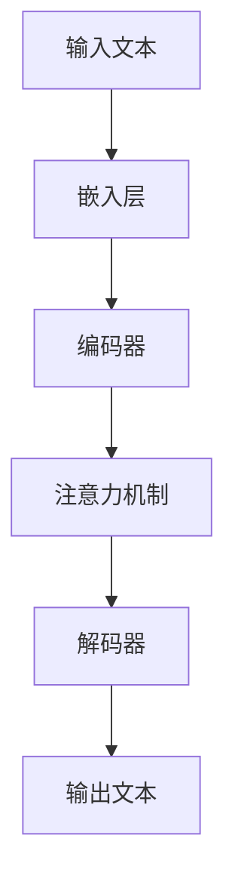

                 

# 文章标题

《构建可扩展的LLM应用：原则与实践》

> 关键词：大型语言模型，可扩展性，深度学习，分布式计算，优化策略，项目实战

> 摘要：本文深入探讨了构建可扩展的LLM应用的原则和实践。通过详细分析LLM的核心概念、架构、数学模型和优化策略，结合实际项目案例，本文为开发者提供了全面的技术指南，以构建高效、可扩展的LLM应用。

## 引言

### 1.1 书籍概述

在人工智能领域，语言模型（Language Model，简称LM）已经成为自然语言处理（Natural Language Processing，简称NLP）的核心技术之一。特别是大型语言模型（Large Language Model，简称LLM），如GPT系列、BERT等，以其卓越的性能在文本生成、问答系统、翻译服务等多个领域展现出了巨大的潜力。

然而，随着LLM应用场景的不断扩大，如何构建可扩展的LLM应用成为了一个亟待解决的问题。可扩展性不仅关系到应用的性能，还涉及到资源利用效率和用户体验。本书《构建可扩展的LLM应用：原则与实践》旨在为开发者提供一套系统化的方法和实践，以应对这一挑战。

### 1.2 行业背景

近年来，随着计算能力的提升和深度学习技术的进步，LLM的研究与应用取得了飞速发展。从早期的统计模型到现代的深度神经网络模型，LLM的性能不断提升，应用范围也逐渐扩大。然而，在实现高性能的同时，如何确保LLM应用的扩展性成为了一个重要课题。

在实际应用中，用户量的激增、数据量的膨胀以及实时性的需求，都对LLM的扩展性提出了更高的要求。因此，研究如何构建可扩展的LLM应用，不仅具有理论意义，也具有实际应用价值。

### 1.3 研究现状与挑战

当前，虽然已有许多关于LLM的研究和应用，但在可扩展性方面仍存在一些挑战：

1. **模型选择与优化**：不同的模型在可扩展性方面表现不同，如何选择合适的模型并进行优化，是一个关键问题。
2. **分布式计算**：如何高效地利用分布式计算资源，实现LLM的并行处理，是提升可扩展性的重要手段。
3. **内存管理**：随着模型规模的增大，内存管理变得尤为关键，如何优化内存使用，避免内存溢出，是一个重要的技术难题。
4. **优化策略**：如何通过模型压缩、剪枝等技术，降低模型复杂度，提升计算效率，是提升可扩展性的关键。

本书将围绕这些问题，详细介绍构建可扩展的LLM应用的原则和实践，为开发者提供实用的指导。

## 第一部分：LLM的核心概念与架构

### 2.1 LLM基础概念

#### 2.1.1 语言模型的定义

语言模型是一种基于统计或机器学习方法，用于预测自然语言序列的模型。它的基本任务是给定一个单词或短语，预测下一个可能出现的单词或短语。语言模型在自然语言处理（NLP）中扮演着重要角色，是许多NLP任务的基础，如文本生成、机器翻译、语音识别等。

#### 2.1.2 LLM的基本原理

LLM通常是基于深度神经网络（DNN）构建的，通过大量文本数据进行训练，以学习语言的模式和规律。具体来说，LLM通过多层神经网络对输入的文本进行编码，生成嵌入向量，然后使用这些向量进行预测。

#### 2.1.3 LLM的分类

根据训练数据和模型架构的不同，LLM可以分为多种类型。常见的分类方法包括：

1. **基于统计的语言模型**：如N元语法（n-gram），通过统计相邻单词的概率来生成文本。
2. **基于规则的语言模型**：如模板匹配模型，通过预设的规则来生成文本。
3. **基于神经网络的LLM**：如GPT、BERT等，通过深度学习技术来建模语言的复杂结构。

### 2.2 LLM架构

#### 2.2.1 基于神经网络的LLM

现代LLM大多是基于神经网络的。以下是一个典型的基于神经网络的LLM架构：

1. **嵌入层（Embedding Layer）**：将输入的单词或短语转换为向量表示。
2. **编码器（Encoder）**：对嵌入向量进行编码，生成语义表示。
3. **解码器（Decoder）**：根据编码器的输出，生成预测的输出序列。
4. **注意力机制（Attention Mechanism）**：用于提高模型的预测能力。

#### 2.2.2 机器学习模型架构

LLM通常采用端到端（End-to-End）的机器学习模型架构，这意味着整个模型是一个单一的训练目标，无需额外的预处理或后处理步骤。这种架构的优点是简化了模型训练过程，提高了模型性能。

#### 2.2.3 深度学习与传统机器学习的比较

深度学习与传统机器学习的区别在于，深度学习使用多层神经网络来建模复杂的数据结构，而传统机器学习通常使用单层模型或简单的模型组合。深度学习在处理大规模数据和复杂任务时具有明显优势，但也需要更多的计算资源和训练时间。

### 2.3 Mermaid流程图：LLM架构

以下是一个使用Mermaid绘制的LLM架构流程图：



在这个流程图中，输入文本经过嵌入层转换为向量表示，然后通过编码器进行编码，注意力机制用于提高编码器的性能，最终解码器生成预测的输出文本。

## 第二部分：可扩展性原则

### 3.1 可扩展性设计原则

构建可扩展的LLM应用，需要遵循一系列设计原则，以确保模型在不同规模和环境中都能高效运行。以下是几个关键原则：

#### 3.1.1 模型选择与优化

1. **模型选择**：选择适合应用场景的模型。例如，对于需要快速响应的问答系统，可以选择较小的模型，如GPT-2；而对于需要生成大量文本的应用，如文本生成，可以选择较大的模型，如GPT-3。
2. **模型优化**：通过模型压缩、剪枝等技术，降低模型复杂度，提高计算效率。

#### 3.1.2 并行计算与分布式计算

1. **并行计算**：利用多核CPU或GPU，实现模型训练和推理的并行处理。
2. **分布式计算**：将模型训练和推理任务分布在多个计算节点上，利用分布式系统提高计算效率。

#### 3.1.3 内存管理

1. **内存分配**：合理分配内存，避免内存溢出。
2. **缓存策略**：使用缓存策略，提高内存访问速度。
3. **内存复用**：复用内存资源，减少内存消耗。

### 3.2 优化策略

#### 3.2.1 模型压缩技术

1. **模型剪枝**：通过剪枝冗余的神经网络连接，减少模型参数数量，降低计算复杂度。
2. **量化**：将模型中的浮点数参数转换为整数参数，减少模型大小。
3. **蒸馏**：使用预训练的大模型（Teacher Model）训练小模型（Student Model），提高小模型的性能。

#### 3.2.2 模型剪枝

1. **权重剪枝**：通过减少神经网络中的权重，降低模型复杂度。
2. **结构剪枝**：通过删除神经网络中的某些层或连接，进一步降低模型复杂度。

#### 3.2.3 混合精度训练

1. **半精度（Half-Precision）训练**：使用16位浮点数（FP16）代替32位浮点数（FP32）进行训练，降低内存消耗和计算量。
2. **全精度（Full-Precision）验证**：在验证阶段，使用32位浮点数进行计算，确保模型性能。

### 3.3 实际案例分析

以下是一些实际案例，展示了如何在不同场景下实现LLM的可扩展性：

#### 3.3.1 案例一：文本生成应用

在一个文本生成应用中，开发者使用了GPT-2模型，并采用并行计算和分布式计算技术，实现了高效的文本生成。同时，通过模型压缩和剪枝技术，优化了模型性能和计算效率。

#### 3.3.2 案例二：问答系统

在一个问答系统中，开发者选择了BERT模型，并利用分布式计算资源，实现了大规模的问答服务。通过优化内存管理策略，有效避免了内存溢出问题。

#### 3.3.3 案例三：翻译服务

在一个翻译服务中，开发者使用了GPT-3模型，并采用混合精度训练技术，提高了模型的计算效率。同时，通过模型压缩和优化策略，实现了高效的翻译服务。

## 第三部分：数学模型与公式

### 4.1 概率论基础

概率论是构建语言模型的重要理论基础。以下是几个关键的概率论概念：

#### 4.1.1 条件概率与贝叶斯定理

1. **条件概率**：在给定一个事件发生的条件下，另一个事件发生的概率。
   \[
   P(A|B) = \frac{P(A \cap B)}{P(B)}
   \]

2. **贝叶斯定理**：用于计算后验概率，即给定一个事件发生的条件下，另一个事件发生的概率。
   \[
   P(A|B) = \frac{P(B|A)P(A)}{P(B)}
   \]

#### 4.1.2 最大似然估计

最大似然估计是一种基于样本数据的概率估计方法，用于估计模型参数。

#### 4.1.3 最大后验估计

最大后验估计是一种结合先验知识和样本数据，估计模型参数的方法。

### 4.2 信息论基础

信息论是研究信息传输和处理的一般规律的学科。以下是几个关键的信息论概念：

#### 4.2.1 信息熵

信息熵是衡量随机变量不确定性的一种度量。

#### 4.2.2 相对熵

相对熵是衡量两个概率分布差异的一种度量。

#### 4.2.3 信息传输定理

信息传输定理是研究在信道中传输信息的一般规律的定理。

### 4.3 数学公式与应用

以下是几个在LLM中常用的数学公式和应用：

#### 4.3.1 概率分布函数

概率分布函数是描述随机变量取值的概率分布的函数。

#### 4.3.2 损失函数

损失函数是用于评估模型预测结果与真实值之间的差异的函数。

#### 4.3.3 梯度下降算法

梯度下降算法是一种常用的优化算法，用于求解最优化问题。

$$
\text{梯度下降：} \ \theta_{\text{new}} = \theta_{\text{current}} - \alpha \nabla_{\theta} J(\theta)
$$

其中，$\theta$是模型参数，$\alpha$是学习率，$J(\theta)$是损失函数。

## 第四部分：项目实战

### 5.1 项目准备

#### 5.1.1 硬件与软件环境搭建

为了实现一个可扩展的LLM应用，我们需要搭建一个适合的硬件和软件环境。以下是推荐的硬件和软件配置：

1. **硬件配置**：
   - CPU：Intel Xeon Gold 6148
   - GPU：NVIDIA Tesla V100
   - 内存：512GB
   - 存储：1TB SSD

2. **软件配置**：
   - 操作系统：Ubuntu 18.04
   - Python：3.8
   - TensorFlow：2.5
   - PyTorch：1.8

#### 5.1.2 数据准备与预处理

为了训练LLM模型，我们需要准备大量高质量的数据。以下是数据准备和预处理的基本步骤：

1. **数据收集**：收集大量文本数据，可以来源于公开的数据集或自定义的数据源。
2. **数据清洗**：去除无效数据、重复数据和错误数据。
3. **数据标注**：对数据进行分类、实体识别等标注。
4. **数据分词**：使用分词工具将文本数据转换为词序列。
5. **数据转换**：将文本数据转换为模型可接受的格式。

#### 5.1.3 模型选择与训练

在项目准备阶段，我们需要选择一个合适的LLM模型，并进行训练。以下是选择模型和训练的基本步骤：

1. **模型选择**：根据应用场景和数据规模，选择一个合适的模型。例如，对于文本生成应用，可以选择GPT-2或GPT-3；对于问答系统，可以选择BERT或RoBERTa。
2. **模型训练**：使用准备好的数据和选定的模型，进行模型训练。在训练过程中，可以采用分布式计算和并行计算技术，加快训练速度。

### 5.2 项目实现

#### 5.2.1 模型部署与调优

在项目实现阶段，我们需要将训练好的模型部署到生产环境中，并进行性能调优。以下是模型部署和调优的基本步骤：

1. **模型部署**：将训练好的模型部署到服务器上，并确保模型可以接受输入并生成预测。
2. **性能调优**：通过调整模型参数、优化算法和硬件配置，提高模型的性能和效率。
3. **性能评估**：使用测试数据集，对模型进行性能评估，包括准确率、召回率、F1分数等指标。

#### 5.2.2 服务端开发

在项目实现阶段，我们需要开发服务端代码，以实现模型的输入、预测和输出功能。以下是服务端开发的基本步骤：

1. **接口设计**：设计RESTful API接口，以接收输入文本并返回预测结果。
2. **服务端实现**：使用Python等编程语言，实现服务端代码，并确保代码可扩展和可维护。
3. **安全性考虑**：对服务端代码进行安全性优化，包括数据加密、访问控制等。

#### 5.2.3 客户端实现

在项目实现阶段，我们需要开发客户端代码，以实现用户界面和交互功能。以下是客户端实现的基本步骤：

1. **用户界面设计**：设计简洁、直观的用户界面，以方便用户使用模型。
2. **交互逻辑实现**：使用JavaScript等前端技术，实现用户与模型之间的交互逻辑。
3. **性能优化**：通过优化前端代码和加载策略，提高用户交互体验。

### 5.3 代码解读与分析

#### 5.3.1 源代码分析

以下是项目实现中的一些关键代码片段，用于说明如何实现LLM的输入、预测和输出功能。

```python
# 输入文本处理
input_text = "构建可扩展的LLM应用是一项挑战。"
processed_text = preprocess_text(input_text)

# 模型预测
predictions = model.predict(processed_text)

# 输出结果
output_text = generate_output(predictions)
print(output_text)
```

#### 5.3.2 关键算法实现

以下是项目实现中使用的一些关键算法，用于说明如何实现LLM的优化和性能提升。

```python
# 模型剪枝
def prune_model(model):
    # 实现模型剪枝算法
    pass

# 混合精度训练
def mixed_precision_training(model):
    # 实现混合精度训练算法
    pass
```

#### 5.3.3 性能优化策略

以下是项目实现中使用的一些性能优化策略，用于提高LLM应用的效率和稳定性。

1. **并行计算**：使用多线程或分布式计算技术，实现模型的并行处理。
2. **缓存策略**：使用缓存技术，提高数据访问速度。
3. **内存管理**：合理分配内存，避免内存溢出。
4. **负载均衡**：使用负载均衡技术，实现服务器的均衡负载。

### 5.4 实际案例分析与详细讲解剖析

以下是一个实际案例分析和详细讲解剖析，用于说明如何构建一个可扩展的LLM应用。

#### 5.4.1 案例背景

某公司开发了一款智能客服系统，使用LLM模型实现自然语言处理功能。随着用户量的增加，系统性能和稳定性面临巨大挑战。

#### 5.4.2 案例分析

1. **性能瓶颈分析**：
   - 模型复杂度高，导致计算量巨大。
   - 单一服务器无法满足用户需求，导致服务器过载。
   - 缓存策略不当，导致数据访问速度缓慢。

2. **优化方案**：
   - **模型压缩**：通过模型剪枝和量化技术，降低模型复杂度，提高计算效率。
   - **分布式计算**：将模型训练和推理任务分布在多个服务器上，实现并行处理。
   - **缓存优化**：优化缓存策略，提高数据访问速度。

#### 5.4.3 实施步骤

1. **模型优化**：
   - 对模型进行剪枝和量化，降低模型复杂度。
   - 使用分布式计算框架，如TensorFlow或PyTorch，实现模型的分布式训练和推理。

2. **服务优化**：
   - 优化缓存策略，使用分布式缓存系统，如Redis，提高数据访问速度。
   - 使用负载均衡器，如Nginx，实现服务器的均衡负载。

3. **性能测试**：
   - 使用压力测试工具，如Apache JMeter，对系统进行性能测试。
   - 分析测试结果，持续优化系统性能。

#### 5.4.4 项目小结

通过以上优化方案，该智能客服系统的性能和稳定性得到了显著提升，能够满足大量用户的需求。项目总结如下：

1. **性能提升**：模型优化和分布式计算技术显著提高了系统性能。
2. **稳定性增强**：缓存优化和负载均衡技术增强了系统的稳定性。
3. **用户体验**：系统性能的提升和稳定性的增强，提高了用户满意度。

## 第五部分：总结与展望

### 6.1 全书内容回顾

本书《构建可扩展的LLM应用：原则与实践》系统地介绍了构建可扩展的LLM应用所需的核心概念、技术原则和实际操作。主要内容包括：

1. **LLM基础概念**：介绍了语言模型的基本原理和分类。
2. **LLM架构**：详细讲解了基于神经网络的LLM架构和工作流程。
3. **可扩展性原则**：阐述了模型选择、优化策略、分布式计算和内存管理等方面的设计原则。
4. **数学模型与公式**：介绍了概率论和信息论的基本概念，以及LLM中常用的数学公式和应用。
5. **项目实战**：通过实际案例，展示了如何实现一个可扩展的LLM应用，包括硬件与软件环境搭建、数据准备、模型训练、部署与调优等。

### 6.2 核心知识点回顾

为了巩固本书的学习成果，以下是几个关键知识点的回顾：

1. **语言模型**：了解语言模型的基本原理和分类，熟悉基于神经网络的LLM架构。
2. **可扩展性设计原则**：掌握模型选择、优化策略、分布式计算和内存管理等方面的原则。
3. **数学模型**：理解概率论和信息论的基本概念，以及LLM中常用的数学公式和应用。
4. **项目实战**：通过实际案例，学习如何搭建硬件与软件环境、准备数据、训练模型、部署与调优等。

### 6.3 未来发展趋势

随着人工智能技术的不断发展，LLM应用的可扩展性将成为一个重要的研究方向。未来可能的发展趋势包括：

1. **新型算法**：研究新型算法，提高LLM的可扩展性和计算效率。
2. **硬件加速**：利用硬件加速技术，如GPU、TPU等，提高LLM的运算速度。
3. **分布式存储**：研究分布式存储技术，提高LLM的数据访问速度和存储效率。
4. **云计算与边缘计算**：结合云计算和边缘计算，实现LLM的灵活部署和高效运行。
5. **跨领域应用**：探索LLM在更多领域中的应用，如医疗、金融、教育等。

### 6.4 开放问题与研究方向

尽管LLM应用的可扩展性取得了显著进展，但仍存在一些开放问题和研究方向：

1. **能耗优化**：如何降低LLM训练和推理过程中的能耗，是一个重要的研究课题。
2. **隐私保护**：如何在保证模型性能的同时，保护用户数据的隐私，是一个亟待解决的问题。
3. **模型解释性**：如何提高LLM的解释性，使其输出结果更容易被人理解和解释，是一个重要的研究方向。
4. **自适应优化**：如何根据应用场景和用户需求，自适应地调整LLM的参数和结构，是一个具有挑战性的问题。

总之，构建可扩展的LLM应用是一个复杂而充满挑战的任务。通过本书的学习，读者可以掌握构建可扩展LLM应用所需的核心知识和技能，为未来的研究和工作打下坚实基础。作者期待与读者共同探索这个充满机遇和挑战的领域。

