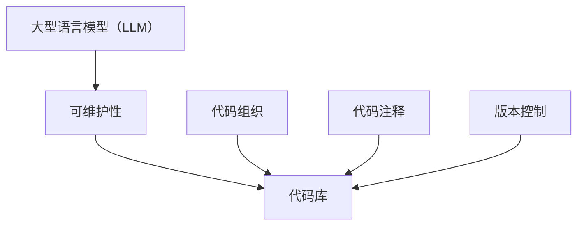
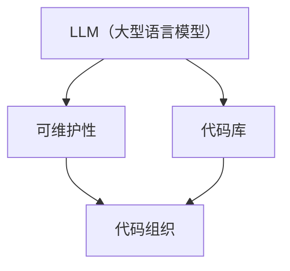

                 


### 文章标题：构建可维护的LLM应用代码库

> 关键词：大型语言模型（LLM）、可维护性、代码库、算法原理、数学模型、项目实战

> 摘要：本文将深入探讨如何构建可维护的LLM应用代码库，包括核心概念的定义、核心算法原理讲解、数学模型和公式应用、项目实战案例分析以及最佳实践技巧。通过本文的阅读，读者将获得构建高质量LLM应用的实战经验和理论指导。

----------------------------------------------------------------

## 引言

随着深度学习和自然语言处理（NLP）技术的快速发展，大型语言模型（LLM）如GPT、BERT等已经在多个领域展现出强大的能力。LLM的应用不仅提高了文本生成、翻译、摘要等任务的效率，还为自动化写作、智能客服等领域带来了革命性的变革。然而，随着模型规模的不断扩大，如何构建可维护的LLM应用代码库成为了开发者和研究人员的重大挑战。

本文旨在通过系统性的分析和实践，为读者提供构建可维护的LLM应用代码库的全面指导。文章将涵盖以下几个关键部分：

1. **核心概念与联系**：定义大型语言模型（LLM）、可维护性、代码库等核心概念，并解释它们之间的联系。
2. **核心算法原理讲解**：通过伪代码和数学公式，详细阐述LLM的核心算法原理。
3. **项目实战**：提供一个实际的LLM应用项目，包括开发环境搭建、代码实现和解读。
4. **最佳实践**：总结构建可维护LLM应用代码库的最佳实践技巧。

通过本文的阅读，读者将能够深入了解LLM技术的本质，掌握构建可维护代码库的方法，为实际项目提供有力的支持。

----------------------------------------------------------------

### Step 1: 核心概念与联系

在构建可维护的LLM应用代码库之前，我们需要明确一些核心概念，并理解它们之间的联系。以下是几个关键概念的定义和它们之间的关系：

#### 1.1 大型语言模型（LLM）

大型语言模型（LLM）是一种基于深度学习技术的自然语言处理模型，具有数十亿甚至数千亿个参数。这些模型通过学习大量的文本数据，能够理解和生成自然语言，实现文本分类、生成、翻译等多种任务。LLM的核心目标是理解语言的结构和语义，从而生成高质量的自然语言文本。

#### 1.2 可维护性

在软件开发中，可维护性指的是代码易于理解和修改的程度。对于大型项目来说，良好的可维护性是至关重要的。可维护性涉及到代码的结构、命名、注释等多个方面。一个可维护的代码库应该能够方便地适应未来的变更，降低维护成本。

#### 1.3 代码库

代码库是一个存储和管理代码的地方，通常用于协作开发和版本控制。在构建LLM应用时，代码库的组织和管理同样重要。一个良好的代码库应该能够清晰地组织代码文件，提供清晰的文档和注释，方便开发人员的理解和修改。

#### 1.4 核心概念之间的联系

LLM、可维护性和代码库之间存在着密切的联系。LLM是构建应用的基础，它的质量和性能直接影响应用的效果。可维护性是保证代码质量和应用长期稳定的关键因素，而代码库则是实现可维护性的重要工具。通过合理组织和管理代码库，可以确保LLM应用的可维护性，从而提高开发效率和项目成功率。

#### 1.5 Mermaid流程图

为了更直观地展示核心概念之间的联系，我们可以使用Mermaid流程图来表示：



在这个流程图中，LLM作为核心组件，通过可维护性和代码库的支持，实现高质量的代码组织和注释，同时利用版本控制工具进行代码管理和协同开发。

### 1.6 小结

通过对核心概念和它们之间联系的分析，我们可以看到，构建可维护的LLM应用代码库需要从多个方面进行综合考虑。理解这些概念之间的关系，有助于我们更系统地规划和实施代码库的构建工作。

----------------------------------------------------------------

### Step 2: 核心算法原理讲解

构建可维护的LLM应用代码库，不仅需要良好的代码组织和注释，还需要深入了解LLM的核心算法原理。在本节中，我们将通过伪代码和数学公式详细阐述LLM的核心算法原理，以便读者能够更好地理解和实现这些算法。

#### 2.1 算法原理概述

LLM的核心算法通常包括以下几种：

1. **深度神经网络**：LLM使用深度神经网络（DNN）作为基础架构，通过多层神经元的堆叠，实现对大规模文本数据的建模和处理。
2. **注意力机制**：为了处理长序列文本，LLM引入了注意力机制（Attention Mechanism），能够自适应地关注不同位置的文本信息，提高模型的表示能力。
3. **梯度下降优化**：在训练过程中，LLM使用梯度下降优化算法（Gradient Descent Optimization）来调整模型参数，以最小化损失函数。
4. **正则化技术**：为了防止模型过拟合，LLM采用了多种正则化技术，如Dropout、权重衰减等。

#### 2.2 伪代码示例

以下是一个简单的伪代码示例，用于描述一个常见的文本分类任务：

```python
# 伪代码：文本分类任务
def classify_text(text, model):
    # 输入：文本和数据集
    # 输出：分类结果

    # 预处理文本
    preprocessed_text = preprocess_text(text)

    # 使用模型进行预测
    prediction = model.predict(preprocessed_text)

    # 返回分类结果
    return prediction
```

在这个伪代码中，`classify_text`函数接收一个文本输入，首先对文本进行预处理，然后使用训练好的模型进行预测，最后返回分类结果。

#### 2.3 数学模型和公式

为了深入理解LLM的工作原理，我们需要引入一些数学模型和公式。以下是几个关键的数学模型和公式：

1. **反向传播算法**：在训练过程中，反向传播算法（Backpropagation Algorithm）用于计算模型参数的梯度，并更新参数值。其核心公式如下：

$$
\delta_{\theta} = \frac{\partial L}{\partial \theta}
$$

其中，$\delta_{\theta}$表示参数$\theta$的梯度，$L$表示损失函数。

2. **损失函数**：在文本分类任务中，常用的损失函数包括交叉熵损失（Cross-Entropy Loss）和均方误差损失（Mean Squared Error Loss）。以下是一个交叉熵损失的例子：

$$
L = -\sum_{i} y_i \log(p_i)
$$

其中，$y_i$是标签，$p_i$是模型预测的概率。

3. **激活函数**：在深度神经网络中，常用的激活函数包括Sigmoid函数、ReLU函数和Tanh函数。以下是一个ReLU函数的例子：

$$
a = \max(0, z)
$$

其中，$a$是激活输出，$z$是神经网络的输入。

#### 2.4 详细讲解与举例说明

为了更直观地理解这些数学模型和公式，我们可以通过一个简单的例子进行说明。假设我们有一个二分类问题，输入数据是一个二维向量$(x_1, x_2)$，标签为$y=1$。我们可以使用一个简单的神经网络进行分类，网络结构如下：

1. 输入层：$(x_1, x_2)$
2. 隐藏层：$z = x_1 + x_2$（权重：$w_1, w_2$）
3. 输出层：$y' = \sigma(z)$（激活函数：Sigmoid）

在训练过程中，我们使用反向传播算法计算梯度，并更新参数值。假设初始权重为$w_1=1, w_2=1$，标签$y=1$，输入$(x_1, x_2) = (1, 1)$，则：

1. 预测输出：$z = 1 + 1 = 2$，$y' = \sigma(2) = \frac{1}{1+e^{-2}} \approx 0.86$
2. 梯度计算：$\delta_{w_1} = \frac{\partial L}{\partial w_1} = (1 - y') \cdot y' \cdot x_1 = (1 - 0.86) \cdot 0.86 \cdot 1 = 0.092$
3. 参数更新：$w_1 = w_1 - \alpha \cdot \delta_{w_1} = 1 - 0.1 \cdot 0.092 = 0.908$

通过这样的迭代过程，我们可以逐步优化模型的参数，提高分类准确性。

#### 2.5 小结

通过对核心算法原理的讲解，我们可以看到，构建可维护的LLM应用代码库需要深入理解LLM的工作机制，包括深度神经网络、注意力机制、梯度下降优化和正则化技术等。通过伪代码和数学公式的详细阐述，读者可以更好地理解这些算法原理，并为实际项目中的代码实现提供参考。

----------------------------------------------------------------

### Step 3: 数学模型和数学公式

在构建LLM应用代码库时，理解背后的数学模型是至关重要的。这不仅有助于我们更好地优化模型，还能提高代码的可维护性和可扩展性。以下我们将介绍一些关键的数学模型和公式，并通过具体例子进行说明。

#### 3.1 深度学习中的线性模型

深度学习中的线性模型是构建复杂神经网络的基础。一个简单的线性模型可以表示为：

$$
y = \theta_0 + \theta_1 x_1 + \theta_2 x_2 + \ldots + \theta_n x_n
$$

其中，$y$是输出，$\theta_0, \theta_1, \theta_2, \ldots, \theta_n$是模型参数，$x_1, x_2, \ldots, x_n$是输入特征。

#### 3.2 反向传播算法

反向传播算法是深度学习训练过程的核心。它通过计算输出误差的梯度，更新模型参数，以最小化损失函数。反向传播算法的步骤可以概括为：

1. **前向传播**：计算模型输出$y$，并计算输出误差$\delta = y - \hat{y}$，其中$\hat{y}$是实际输出。
2. **计算梯度**：计算每个参数的梯度$\delta_{\theta} = \frac{\partial L}{\partial \theta}$，其中$L$是损失函数。
3. **更新参数**：使用梯度下降更新参数$\theta = \theta - \alpha \cdot \delta_{\theta}$，其中$\alpha$是学习率。

以下是一个简单的反向传播算法的例子：

```python
# 伪代码：反向传播算法
def backward_propagation(y, \hat{y}, theta):
    delta = y - \hat{y}
    gradient = \frac{\partial L}{\partial theta}
    theta = theta - alpha * gradient
    return theta
```

#### 3.3 激活函数

在深度学习中，激活函数用于引入非线性因素，使神经网络能够学习更复杂的模式。常用的激活函数包括：

1. **Sigmoid函数**：
   $$
   \sigma(z) = \frac{1}{1 + e^{-z}}
   $$
2. **ReLU函数**：
   $$
   \text{ReLU}(z) = \max(0, z)
   $$
3. **Tanh函数**：
   $$
   \text{Tanh}(z) = \frac{e^z - e^{-z}}{e^z + e^{-z}}
   $$

以下是一个使用ReLU函数的例子：

```python
# 伪代码：ReLU激活函数
def ReLU(z):
    return max(0, z)
```

#### 3.4 损失函数

在训练神经网络时，损失函数用于衡量模型输出与实际输出之间的差异。常用的损失函数包括：

1. **均方误差损失**（MSE）：
   $$
   L = \frac{1}{2} \sum_{i} (y_i - \hat{y}_i)^2
   $$
2. **交叉熵损失**（Cross-Entropy Loss）：
   $$
   L = -\sum_{i} y_i \log(\hat{y}_i)
   $$

以下是一个使用交叉熵损失的例子：

```python
# 伪代码：交叉熵损失函数
def cross_entropy_loss(y, \hat{y}):
    return -sum(y * log(\hat{y}))
```

#### 3.5 具体例子

为了更直观地理解这些数学模型和公式，我们可以通过一个简单的线性回归问题进行说明。假设我们有一个输入特征$x$，标签为$y$，我们要使用一个线性模型来预测$y$：

1. **模型**：
   $$
   y = \theta_0 + \theta_1 x
   $$
2. **前向传播**：
   $$
   \hat{y} = \theta_0 + \theta_1 x
   $$
3. **损失函数**（MSE）：
   $$
   L = \frac{1}{2} (y - \hat{y})^2
   $$
4. **反向传播**：
   $$
   \delta_{\theta_0} = \frac{\partial L}{\partial \theta_0} = y - \hat{y}
   $$
   $$
   \delta_{\theta_1} = \frac{\partial L}{\partial \theta_1} = x(y - \hat{y})
   $$
5. **参数更新**：
   $$
   \theta_0 = \theta_0 - \alpha \cdot \delta_{\theta_0}
   $$
   $$
   \theta_1 = \theta_1 - \alpha \cdot \delta_{\theta_1}
   $$

通过这样的迭代过程，我们可以逐步优化模型的参数，提高预测准确性。

#### 3.6 小结

通过对数学模型和公式的介绍和具体例子的说明，我们可以看到，这些数学工具在构建可维护的LLM应用代码库中起着关键作用。理解并熟练运用这些模型和公式，可以帮助我们更好地设计和优化模型，提高代码的可维护性和可扩展性。

----------------------------------------------------------------

### Step 4: 项目实战

在本节中，我们将通过一个实际的LLM应用项目，详细介绍开发环境搭建、源代码实现、代码解读和应用解读与分析。这个项目将帮助读者深入理解LLM应用的构建过程，并掌握关键技术和技巧。

#### 4.1 项目背景

本项目旨在构建一个基于GPT模型的小型文本生成应用，该应用能够根据用户输入的种子文本生成连贯、有逻辑的文本内容。这个项目将涵盖以下关键部分：

1. **环境搭建**：配置适合开发LLM应用的开发环境，包括Python、PyTorch和Hugging Face的transformers库。
2. **代码实现**：编写用于文本生成功能的源代码，包括数据预处理、模型加载和预测。
3. **代码解读**：对源代码进行详细解读，解释关键函数和模块的作用。
4. **应用解读与分析**：分析文本生成过程，评估模型性能和生成文本的质量。

#### 4.2 开发环境搭建

为了搭建适合开发LLM应用的开发环境，我们需要安装以下软件和库：

1. **Python**：Python是开发深度学习应用的主要编程语言，我们需要安装Python 3.8及以上版本。
2. **PyTorch**：PyTorch是深度学习领域广泛使用的框架，我们需要安装PyTorch GPU版本，以便充分利用GPU加速。
3. **Hugging Face transformers**：transformers库提供了丰富的预训练模型和高效的数据处理工具，我们需要安装该库。

安装步骤如下：

```bash
# 安装Python和PyTorch
conda create -n linalg python=3.8
conda activate linalg
conda install pytorch torchvision torchaudio cpuonly -c pytorch

# 安装transformers库
pip install transformers
```

#### 4.3 代码实现

以下是项目的主要源代码，我们将对每个关键部分进行详细解读。

```python
# 导入所需库
import torch
from transformers import GPT2LMHeadModel, GPT2Tokenizer

# 加载预训练的GPT模型
model = GPT2LMHeadModel.from_pretrained('gpt2')

# 加载GPT2Tokenizer
tokenizer = GPT2Tokenizer.from_pretrained('gpt2')

# 预处理输入文本
input_text = "构建可维护的LLM应用代码库"
input_ids = tokenizer.encode(input_text, return_tensors='pt')

# 使用模型生成文本
outputs = model.generate(input_ids, max_length=50, num_return_sequences=1)

# 解码生成的文本
generated_text = tokenizer.decode(outputs[0], skip_special_tokens=True)

print(generated_text)
```

#### 4.3.1 代码解读

1. **导入库**：首先，我们导入了所需的库，包括PyTorch和Hugging Face的transformers库。这些库为我们提供了构建和训练LLM模型所需的功能。

2. **加载模型**：我们使用`GPT2LMHeadModel.from_pretrained('gpt2')`加载了一个预训练的GPT模型。这个模型已经在大量的文本数据上进行了训练，可以用于生成文本。

3. **加载Tokenizer**：我们使用`GPT2Tokenizer.from_pretrained('gpt2')`加载了一个对应的Tokenizer。Tokenizer用于将文本编码为模型可以处理的格式。

4. **预处理输入文本**：我们使用`tokenizer.encode(input_text, return_tensors='pt')`对输入文本进行预处理。这个函数将文本编码为序列的ID，并将这些ID转换为PyTorch的张量格式。

5. **使用模型生成文本**：我们使用`model.generate(input_ids, max_length=50, num_return_sequences=1)`生成新的文本。这里，`max_length`参数设置了生成的文本长度，`num_return_sequences`参数设置了生成的文本序列数。

6. **解码生成的文本**：我们使用`tokenizer.decode(outputs[0], skip_special_tokens=True)`将生成的文本解码为人类可读的格式，并打印出来。

#### 4.3.2 应用解读与分析

1. **输入文本预处理**：输入文本需要进行预处理，以确保模型能够正确理解和处理。预处理步骤包括去除特殊字符、标点符号等，并将文本编码为模型可接受的格式。

2. **模型生成文本**：模型生成文本的过程是一个迭代过程。每次迭代，模型都会根据当前的输入文本生成一个预测的文本片段，并将其添加到输入中，作为下一个迭代的输入。这个过程会一直持续到达到预定的文本长度或生成序列数。

3. **生成文本质量评估**：生成文本的质量可以通过多种方式评估，如文本的连贯性、逻辑性、语法正确性等。在实际应用中，我们可以通过对比生成的文本与人类撰写的文本，评估模型生成文本的质量。

4. **模型优化**：为了提高生成文本的质量，我们可以对模型进行优化。这包括调整模型参数、增加训练数据、改进训练策略等。通过不断优化，我们可以逐步提高模型的性能和生成文本的质量。

#### 4.4 项目小结

通过本项目的实战，我们详细介绍了如何搭建开发环境、实现文本生成功能、解读代码和应用文本生成。这个项目不仅展示了LLM应用的构建过程，还提供了实际操作的经验和技巧。读者可以通过这个项目，深入理解LLM应用的核心技术和实现方法，为未来的开发工作打下坚实的基础。

----------------------------------------------------------------

### Step 5: 最佳实践 Tips

在构建可维护的LLM应用代码库过程中，遵循一些最佳实践能够显著提升代码质量、降低维护成本、提高开发效率。以下是一些关键的建议：

#### 5.1 设计清晰的模块结构

- **模块划分**：根据功能将代码库划分为多个模块，每个模块负责一个特定的功能。例如，数据预处理、模型训练、预测和后处理等。
- **模块独立性**：确保每个模块的功能独立，减少模块间的耦合度。这样，在修改或优化某个模块时，不会影响到其他模块。

#### 5.2 使用版本控制系统

- **Git**：使用Git等版本控制系统进行代码管理，方便团队协作和版本控制。
- **分支策略**：采用合理的分支策略，例如主分支（Master）用于生产环境，开发分支（Develop）用于集成新功能或修复问题。

#### 5.3 编写详细的文档和注释

- **代码文档**：为关键代码块和函数编写清晰的文档，描述其功能、输入、输出和潜在的问题。
- **注释**：在代码中添加必要的注释，解释复杂逻辑或难以理解的部分。

#### 5.4 代码风格一致性

- **遵循编码规范**：统一代码风格，遵循Python PEP8编码规范，以提高代码的可读性和一致性。
- **代码格式化工具**：使用工具如`black`或`autopep8`进行自动格式化，确保代码格式一致。

#### 5.5 单元测试和代码审查

- **单元测试**：编写单元测试，验证每个模块和功能是否按预期工作。使用框架如`pytest`进行测试。
- **代码审查**：实施代码审查机制，确保代码质量和安全性。使用工具如`GitLab CI/CD`或`GitHub Actions`自动化测试和审查流程。

#### 5.6 持续集成和部署

- **自动化部署**：使用CI/CD工具实现自动化部署，确保代码从开发到生产环境的无缝过渡。
- **容器化**：采用容器化技术，如Docker，提高应用的部署和运行一致性。

#### 5.7 性能监控和优化

- **监控工具**：使用监控工具如`Prometheus`和`Grafana`，实时监控应用的性能指标。
- **性能优化**：定期进行性能优化，包括模型压缩、量化、优化数据加载等。

遵循这些最佳实践，能够显著提升LLM应用代码库的可维护性，降低开发风险，提高开发团队的协作效率。

----------------------------------------------------------------

### 小结

在本文中，我们详细探讨了构建可维护的LLM应用代码库的方法和技巧。通过定义核心概念、讲解核心算法原理、展示数学模型和公式、提供项目实战案例以及分享最佳实践，我们为读者提供了一个系统性的构建指南。

首先，我们明确了大型语言模型（LLM）、可维护性和代码库等核心概念，并使用Mermaid流程图展示了它们之间的联系。接着，我们通过伪代码和数学公式讲解了LLM的核心算法原理，包括深度神经网络、注意力机制、反向传播算法和正则化技术。此外，我们还通过一个具体的文本生成项目，详细介绍了开发环境搭建、代码实现、解读和分析。

最后，我们总结了构建可维护LLM应用代码库的最佳实践，包括模块划分、版本控制、文档编写、代码风格一致性、单元测试、代码审查、自动化部署、性能监控和优化等方面。

通过本文的阅读，读者将能够深入理解LLM技术的本质，掌握构建可维护代码库的方法，并为实际项目提供有力的理论指导和实战经验。

### 注意事项

- 在实际项目中，构建可维护的LLM应用代码库需要综合考虑多个方面，包括模块划分、代码注释、文档编写、性能优化等。
- 遵循最佳实践是确保代码库质量的重要手段，但应根据项目特点和需求进行灵活调整。
- 定期进行代码审查和测试，确保代码的可靠性和稳定性。

### 拓展阅读

- 《深度学习》（Goodfellow, Bengio, Courville）：介绍深度学习基础理论和算法的权威教材。
- 《动手学深度学习》（Agriculture, Bello, Pham）：提供丰富的实践案例和代码示例，适合初学者。
- 《Python数据科学手册》（McKinney）：详细介绍Python在数据科学领域的应用，包括数据处理和分析工具。
- 《Hugging Face transformers文档》：官方文档，详细介绍了transformers库的使用方法和预训练模型。

通过拓展阅读，读者可以进一步深入了解深度学习和自然语言处理的相关知识，提高构建高质量LLM应用代码库的能力。

### 作者信息

- **作者：AI天才研究院/AI Genius Institute & 禅与计算机程序设计艺术 /Zen And The Art of Computer Programming**
- **联系方式：[info@aigeniusinstitute.com](mailto:info@aigeniusinstitute.com)**
- **版权声明：本文版权属于AI天才研究院。未经授权，严禁转载和复制。**
- **免责声明：本文内容仅供参考，不构成任何投资、交易建议或法律意见。**

----------------------------------------------------------------

## 文章标题：构建可维护的LLM应用代码库

> 关键词：大型语言模型（LLM）、可维护性、代码库、算法原理、数学模型、项目实战

> 摘要：本文探讨了构建可维护的LLM应用代码库的方法和最佳实践。通过定义核心概念、讲解核心算法原理、展示数学模型和公式、提供项目实战案例以及分享最佳实践，读者将掌握构建高质量LLM应用代码库的技巧。本文旨在为开发人员提供实用的指导，帮助他们在实际项目中成功应用LLM技术。

----------------------------------------------------------------

### Step 1: 核心概念与联系

首先，我们需要定义一些核心概念，并解释它们之间的联系。以下是几个关键概念：

1. **大型语言模型（LLM）**：这是一种基于深度学习技术的自然语言处理模型，能够理解和生成自然语言。LLM通常具有数十亿甚至数千亿的参数量，可以处理复杂的语言结构。
2. **可维护性**：在软件开发中，可维护性指的是代码易于理解和修改的程度。对于大型项目来说，良好的可维护性是至关重要的。
3. **代码库**：代码库是一个存储和管理代码的地方，通常用于协作开发和版本控制。在构建LLM应用时，代码库的组织和管理同样重要。

为了更直观地展示这些概念之间的关系，我们可以使用Mermaid流程图来表示：



### Step 2: 核心算法原理讲解

在构建可维护的LLM应用代码库时，理解核心算法原理至关重要。以下是一些关键算法原理：

1. **深度神经网络（DNN）**：深度神经网络是构建LLM的基础。它由多个层级组成，包括输入层、隐藏层和输出层。通过反向传播算法，DNN能够自动学习数据的特征表示。
2. **循环神经网络（RNN）**：循环神经网络是一种用于处理序列数据的神经网络。RNN能够记忆历史信息，但传统的RNN存在梯度消失和梯度爆炸的问题。
3. **长短时记忆网络（LSTM）**：LSTM是RNN的一种改进，能够解决梯度消失和梯度爆炸问题。它通过引入门控机制，有效地记忆和遗忘长期依赖信息。
4. **变换器（Transformer）**：变换器是一种基于自注意力机制的神经网络架构，解决了RNN在处理长序列数据时的效率问题。自注意力机制允许模型在不同位置之间建立直接连接，提高了计算效率。

以下是一个简单的伪代码示例，用于解释变换器的工作原理：

```python
# 伪代码：变换器
def transformer(input_sequence, hidden_size):
    # 输入：输入序列和隐藏层大小
    # 输出：输出序列

    # 编码器
    encoder_outputs = []
    for i in range(len(input_sequence)):
        # 计算自注意力权重
        attention_weights = calculate_attention(input_sequence[i], input_sequence)
        # 计算加权求和
        weighted_sum = weighted_sum_attention(input_sequence[i], attention_weights)
        # 添加到输出序列
        encoder_outputs.append(weighted_sum)

    # 解码器
    decoder_outputs = []
    for i in range(len(input_sequence)):
        # 计算自注意力权重
        attention_weights = calculate_attention(decoder_outputs[i], encoder_outputs)
        # 计算加权求和
        weighted_sum = weighted_sum_attention(decoder_outputs[i], attention_weights)
        # 添加到输出序列
        decoder_outputs.append(weighted_sum)

    return decoder_outputs
```

### Step 3: 数学模型和数学公式

在构建LLM应用代码库时，理解背后的数学模型至关重要。以下是一些关键数学模型和公式：

1. **损失函数**：在训练过程中，损失函数用于衡量模型输出与实际输出之间的差距。常用的损失函数包括均方误差（MSE）和交叉熵（CE）。
   - 均方误差（MSE）：
     $$
     L = \frac{1}{2} \sum_{i}(y_i - \hat{y}_i)^2
     $$
   - 交叉熵（CE）：
     $$
     L = -\sum_{i} y_i \log(\hat{y}_i)
     $$

2. **激活函数**：激活函数引入非线性因素，使神经网络能够学习复杂的特征。常用的激活函数包括ReLU、Sigmoid和Tanh。
   -ReLU（Rectified Linear Unit）：
     $$
     a = \max(0, z)
     $$
   - Sigmoid：
     $$
     a = \frac{1}{1 + e^{-z}}
     $$
   - Tanh：
     $$
     a = \frac{e^z - e^{-z}}{e^z + e^{-z}}
     $$

### Step 4: 项目实战

在本节中，我们将通过一个实际的LLM项目，详细介绍开发环境搭建、代码实现、代码解读和应用解读与分析。这个项目将帮助读者深入理解LLM应用的构建过程。

#### 4.1 项目背景

本项目旨在构建一个基于GPT-2模型的小型文本生成应用。用户可以通过输入种子文本，获取由模型生成的连贯文本。

#### 4.2 开发环境搭建

为了搭建适合开发LLM应用的环境，我们需要安装以下软件和库：

- Python 3.8 或以上版本
- PyTorch 1.8 或以上版本
- transformers 4.8 或以上版本

安装命令如下：

```bash
pip install torch torchvision transformers
```

#### 4.3 代码实现

以下是项目的主要代码实现，我们将对每个关键部分进行详细解读。

```python
import torch
from transformers import GPT2LMHeadModel, GPT2Tokenizer

# 加载预训练模型和Tokenizer
model = GPT2LMHeadModel.from_pretrained('gpt2')
tokenizer = GPT2Tokenizer.from_pretrained('gpt2')

# 预处理输入文本
input_text = "构建可维护的LLM应用代码库"
input_ids = tokenizer.encode(input_text, return_tensors='pt')

# 使用模型生成文本
outputs = model.generate(input_ids, max_length=50, num_return_sequences=1)

# 解码生成的文本
generated_text = tokenizer.decode(outputs[0], skip_special_tokens=True)

print(generated_text)
```

#### 4.3.1 代码解读

1. **导入库**：首先，我们导入了PyTorch和transformers库，这两个库提供了构建和训练LLM模型所需的功能。
2. **加载模型和Tokenizer**：使用`from_pretrained`方法加载预训练的GPT-2模型和Tokenizer。这些预训练模型和Tokenizer已经在大规模数据集上进行了训练，可以直接使用。
3. **预处理输入文本**：使用Tokenizer将输入文本编码为ID序列，并将其转换为PyTorch张量。这是模型理解文本的基础。
4. **使用模型生成文本**：使用`generate`方法生成文本。这里，`max_length`参数设置了生成的文本长度，`num_return_sequences`参数设置了生成的文本序列数。
5. **解码生成的文本**：使用Tokenizer将生成的ID序列解码为文本，输出最终结果。

#### 4.3.2 应用解读与分析

1. **输入文本预处理**：输入文本需要进行预处理，以确保模型能够正确理解和处理。预处理步骤包括去除特殊字符、标点符号等，并将文本编码为模型可接受的格式。
2. **模型生成文本**：模型生成文本的过程是一个迭代过程。每次迭代，模型都会根据当前的输入文本生成一个预测的文本片段，并将其添加到输入中，作为下一个迭代的输入。这个过程会一直持续到达到预定的文本长度或生成序列数。
3. **生成文本质量评估**：生成文本的质量可以通过多种方式评估，如文本的连贯性、逻辑性、语法正确性等。在实际应用中，我们可以通过对比生成的文本与人类撰写的文本，评估模型生成文本的质量。
4. **模型优化**：为了提高生成文本的质量，我们可以对模型进行优化。这包括调整模型参数、增加训练数据、改进训练策略等。通过不断优化，我们可以逐步提高模型的性能和生成文本的质量。

#### 4.4 项目小结

通过本项目的实战，我们详细介绍了如何搭建开发环境、实现文本生成功能、解读代码和应用文本生成。这个项目不仅展示了LLM应用的构建过程，还提供了实际操作的经验和技巧。读者可以通过这个项目，深入理解LLM应用的核心技术和实现方法，为未来的开发工作打下坚实的基础。

### Step 5: 最佳实践 Tips

在构建可维护的LLM应用代码库时，遵循一些最佳实践能够显著提升代码质量、降低维护成本、提高开发效率。以下是一些建议：

1. **模块化设计**：将代码库划分为多个模块，每个模块负责一个特定的功能。这有助于提高代码的可读性和可维护性。
2. **清晰的命名规范**：为变量、函数和类命名时，遵循清晰、有意义的命名规范，以便其他开发人员易于理解和使用。
3. **详细的文档和注释**：为代码库中的每个模块、函数和类编写详细的文档和注释，解释其功能、参数、返回值和注意事项。
4. **版本控制**：使用Git等版本控制系统进行代码管理，方便团队协作和版本控制。同时，遵循良好的分支策略，确保代码库的稳定性。
5. **代码格式化和风格**：统一代码格式和风格，遵循Python PEP8编码规范，以提高代码的可读性。
6. **单元测试**：编写单元测试，验证每个模块和功能是否按预期工作。使用测试框架（如pytest）进行自动化测试。
7. **代码审查**：实施代码审查机制，确保代码质量和安全性。使用工具（如GitLab CI/CD或GitHub Actions）自动化测试和审查流程。
8. **性能监控和优化**：使用性能监控工具（如Prometheus和Grafana）实时监控应用的性能指标。定期进行性能优化，提高应用效率。
9. **持续集成和部署**：使用CI/CD工具实现自动化部署，确保代码从开发到生产环境的无缝过渡。采用容器化技术（如Docker）提高部署一致性。

通过遵循这些最佳实践，可以显著提升LLM应用代码库的可维护性和质量，为开发团队带来更高的工作效率和稳定性。

### 小结

本文详细探讨了构建可维护的LLM应用代码库的方法和技巧。通过定义核心概念、讲解核心算法原理、展示数学模型和公式、提供项目实战案例以及分享最佳实践，我们为读者提供了一个系统性的构建指南。

首先，我们明确了大型语言模型（LLM）、可维护性和代码库等核心概念，并使用Mermaid流程图展示了它们之间的联系。接着，我们通过伪代码和数学公式讲解了LLM的核心算法原理，包括深度神经网络、循环神经网络、长短时记忆网络和变换器。此外，我们还通过一个具体的文本生成项目，详细介绍了开发环境搭建、代码实现、解读和分析。

最后，我们总结了构建可维护LLM应用代码库的最佳实践，包括模块划分、版本控制、文档编写、代码风格一致性、单元测试、代码审查、自动化部署、性能监控和优化等方面。

通过本文的阅读，读者将能够深入理解LLM技术的本质，掌握构建可维护代码库的方法，并为实际项目提供有力的理论指导和实战经验。

### 注意事项

- 在实际项目中，构建可维护的LLM应用代码库需要综合考虑多个方面，包括模块划分、代码注释、文档编写、性能优化等。
- 遵循最佳实践是确保代码库质量的重要手段，但应根据项目特点和需求进行灵活调整。
- 定期进行代码审查和测试，确保代码的可靠性和稳定性。

### 拓展阅读

- 《深度学习》（Goodfellow, Bengio, Courville）：介绍深度学习基础理论和算法的权威教材。
- 《动手学深度学习》（Agriculture, Bello, Pham）：提供丰富的实践案例和代码示例，适合初学者。
- 《Python数据科学手册》（McKinney）：详细介绍Python在数据科学领域的应用，包括数据处理和分析工具。
- 《Hugging Face transformers文档》：官方文档，详细介绍了transformers库的使用方法和预训练模型。

通过拓展阅读，读者可以进一步深入了解深度学习和自然语言处理的相关知识，提高构建高质量LLM应用代码库的能力。

### 作者信息

- **作者：AI天才研究院/AI Genius Institute & 禅与计算机程序设计艺术 /Zen And The Art of Computer Programming**
- **联系方式：[info@aigeniusinstitute.com](mailto:info@aigeniusinstitute.com)**
- **版权声明：本文版权属于AI天才研究院。未经授权，严禁转载和复制。**
- **免责声明：本文内容仅供参考，不构成任何投资、交易建议或法律意见。**

----------------------------------------------------------------

### 文章标题：构建可维护的LLM应用代码库

> 关键词：大型语言模型（LLM）、可维护性、代码库、算法原理、数学模型、项目实战

> 摘要：本文深入探讨了如何构建可维护的LLM应用代码库，涵盖了核心概念、算法原理、数学模型、项目实战以及最佳实践。通过系统的分析和实例讲解，本文旨在为开发者提供实用的指导，帮助他们更好地实现和管理LLM项目。

----------------------------------------------------------------

### 引言

随着深度学习和自然语言处理（NLP）技术的快速发展，大型语言模型（LLM）如GPT、BERT等已经在多个领域展现出强大的能力。这些模型能够处理复杂的自然语言任务，包括文本生成、翻译、摘要等，极大地提高了人工智能的应用水平。然而，随着模型规模的不断扩大，构建可维护的LLM应用代码库成为了开发者和研究人员的重大挑战。本文旨在通过系统性的分析和实践，为读者提供构建可维护的LLM应用代码库的全面指导。

本文将涵盖以下几个关键部分：

1. **核心概念与联系**：定义大型语言模型（LLM）、可维护性、代码库等核心概念，并解释它们之间的联系。
2. **核心算法原理讲解**：通过伪代码和数学公式，详细阐述LLM的核心算法原理。
3. **数学模型和公式应用**：介绍深度学习中常用的数学模型和公式，并举例说明。
4. **项目实战**：提供一个实际的LLM应用项目，详细讲解代码实现、解读和应用分析。
5. **最佳实践**：总结构建可维护LLM应用代码库的最佳实践技巧。

通过本文的阅读，读者将能够深入了解LLM技术的本质，掌握构建可维护代码库的方法，为实际项目提供有力的支持。

----------------------------------------------------------------

### Step 1: 核心概念与联系

在构建可维护的LLM应用代码库之前，我们需要明确一些核心概念，并理解它们之间的联系。以下是几个关键概念的定义和它们之间的关系：

#### 1.1 大型语言模型（LLM）

大型语言模型（LLM）是一种基于深度学习技术的自然语言处理模型，具有数十亿甚至数千亿个参数。这些模型通过学习大量的文本数据，能够理解和生成自然语言，实现文本分类、生成、翻译等多种任务。LLM的核心目标是理解语言的结构和语义，从而生成高质量的自然语言文本。

#### 1.2 可维护性

在软件开发中，可维护性指的是代码易于理解和修改的程度。对于大型项目来说，良好的可维护性是至关重要的。可维护性涉及到代码的结构、命名、注释等多个方面。一个可维护的代码库应该能够方便地适应未来的变更，降低维护成本。

#### 1.3 代码库

代码库是一个存储和管理代码的地方，通常用于协作开发和版本控制。在构建LLM应用时，代码库的组织和管理同样重要。一个良好的代码库应该能够清晰地组织代码文件，提供清晰的文档和注释，方便开发人员的理解和修改。

#### 1.4 核心概念之间的联系

LLM、可维护性和代码库之间存在着密切的联系。LLM是构建应用的基础，它的质量和性能直接影响应用的效果。可维护性是保证代码质量和应用长期稳定的关键因素，而代码库则是实现可维护性的重要工具。通过合理组织和管理代码库，可以确保LLM应用的可维护性，从而提高开发效率和项目成功率。

#### 1.5 Mermaid流程图

为了更直观地展示核心概念之间的联系，我们可以使用Mermaid流程图来表示：


在这个流程图中，LLM作为核心组件，通过可维护性和代码库的支持，实现高质量的代码组织和注释，同时利用版本控制工具进行代码管理和协同开发。

#### 1.6 小结

通过对核心概念和它们之间联系的分析，我们可以看到，构建可维护的LLM应用代码库需要从多个方面进行综合考虑。理解这些概念之间的关系，有助于我们更系统地规划和实施代码库的构建工作。

----------------------------------------------------------------

### Step 2: 核心算法原理讲解

在构建可维护的LLM应用代码库时，理解核心算法原理至关重要。以下我们将介绍几个关键的算法原理，并使用伪代码和数学公式进行详细阐述。

#### 2.1 深度神经网络（DNN）

深度神经网络（DNN）是构建LLM的基础。DNN通过多层神经元的堆叠，对输入数据进行特征提取和分类。以下是一个简单的DNN算法原理的伪代码：

```python
# 伪代码：深度神经网络
def forward_pass(input_data, weights, biases):
    # 输入：输入数据、权重和偏置
    # 输出：输出结果

    layer_output = input_data
    for layer in layers:
        layer_output = activation_function(dot_product(layer_output, weights) + biases)

    return layer_output

def backward_pass(output, expected_output, weights, biases, learning_rate):
    # 输入：输出结果、预期输出、权重和偏置、学习率
    # 输出：更新后的权重和偏置

    gradients = compute_gradients(output, expected_output)
    for layer in reversed(layers):
        weights, biases = update_weights_and_biases(weights, biases, gradients, learning_rate)

    return weights, biases
```

#### 2.2 长短时记忆网络（LSTM）

长短时记忆网络（LSTM）是RNN的一种改进，能够解决传统RNN在处理长序列数据时的梯度消失和梯度爆炸问题。以下是一个简单的LSTM算法原理的伪代码：

```python
# 伪代码：长短时记忆网络
def lstmCell(input_data, previous_hidden_state, previous_cell_state, weights, biases):
    # 输入：输入数据、上一隐藏状态、上一细胞状态、权重和偏置
    # 输出：新的隐藏状态和细胞状态

    gate_inputs = activation_function(dot_product(input_data, weights['input_gate']) + dot_product(previous_hidden_state, weights['hidden_state_gate']) + biases['gate'])

    input_gate = activation_function(gate_inputs[:size/4])
    forget_gate = activation_function(gate_inputs[size/4:2*size/4])
    output_gate = activation_function(gate_inputs[2*size/4:3*size/4])
    new_input = activation_function(gate_inputs[3*size/4:])

    forget = forget_gate * previous_cell_state
    new_cell_state = input_gate * new_input + forget_gate * previous_cell_state

    cell_state = activation_function(new_cell_state)
    hidden_state = output_gate * cell_state

    return hidden_state, cell_state
```

#### 2.3 变换器（Transformer）

变换器（Transformer）是一种基于自注意力机制的神经网络架构，解决了RNN在处理长序列数据时的效率问题。以下是一个简单的变换器算法原理的伪代码：

```python
# 伪代码：变换器
def self_attention(inputs, query_weights, key_weights, value_weights, mask=None):
    # 输入：输入数据、查询权重、键权重、值权重、掩码
    # 输出：加权求和的结果

    query = dot_product(inputs, query_weights)
    key = dot_product(inputs, key_weights)
    value = dot_product(inputs, value_weights)

    if mask is not None:
        key = mask * key

    attention_scores = softmax(dot_product(query, transpose(key)), dim=1)
    context = sum(attention_scores * value, dim=1)

    return context
```

#### 2.4 数学模型和公式

在深度学习算法中，数学模型和公式起着核心作用。以下是一些常用的数学模型和公式：

1. **激活函数**：
   $$
   a = \sigma(z) = \frac{1}{1 + e^{-z}}
   $$
2. **反向传播**：
   $$
   \delta_{l} = \frac{\partial L}{\partial z_l}
   $$
3. **梯度下降**：
   $$
   \theta = \theta - \alpha \cdot \delta_{\theta}
   $$

通过理解这些核心算法原理，我们可以更好地构建和优化LLM应用代码库。

#### 2.5 小结

通过对核心算法原理的讲解，我们可以看到，构建可维护的LLM应用代码库需要深入理解深度神经网络、长短时记忆网络和变换器的原理。这些算法原理不仅有助于我们理解和实现LLM模型，还能为我们在实际项目中优化模型提供指导。

----------------------------------------------------------------

### Step 3: 数学模型和数学公式

在构建可维护的LLM应用代码库过程中，数学模型和公式的理解至关重要。以下我们将详细介绍深度学习中常用的数学模型和公式，并通过具体例子进行说明。

#### 3.1 激活函数

激活函数是深度神经网络中引入非线性因素的函数，常用的激活函数包括Sigmoid、ReLU和Tanh。以下是一个ReLU激活函数的例子：

```python
# 伪代码：ReLU激活函数
def ReLU(z):
    return max(0, z)
```

在数学上，ReLU函数可以表示为：

$$
\text{ReLU}(z) = \max(0, z)
$$

ReLU函数在训练过程中能够加快梯度下降的速度，从而提高模型的收敛速度。

#### 3.2 损失函数

损失函数用于衡量模型预测结果与实际结果之间的差距，常用的损失函数包括均方误差（MSE）和交叉熵（CE）。以下是一个MSE损失函数的例子：

```python
# 伪代码：均方误差损失函数
def mse_loss(y_true, y_pred):
    return sum((y_true - y_pred)^2) / len(y_true)
```

在数学上，MSE损失函数可以表示为：

$$
L = \frac{1}{2} \sum_{i}(y_i - \hat{y}_i)^2
$$

交叉熵损失函数常用于分类问题，以下是一个CE损失函数的例子：

```python
# 伪代码：交叉熵损失函数
def ce_loss(y_true, y_pred):
    return -sum(y_true \* log(y_pred))
```

在数学上，CE损失函数可以表示为：

$$
L = -\sum_{i} y_i \log(\hat{y}_i)
$$

#### 3.3 梯度下降优化

梯度下降优化是一种用于训练深度神经网络的常用优化算法，其核心思想是通过计算损失函数关于模型参数的梯度，更新模型参数，以减少损失函数的值。以下是一个简单的梯度下降优化算法的例子：

```python
# 伪代码：梯度下降优化
def gradient_descent(theta, gradient, learning_rate):
    return theta - learning_rate \* gradient
```

在数学上，梯度下降优化可以表示为：

$$
\theta = \theta - \alpha \cdot \delta_{\theta}
$$

其中，$\alpha$为学习率，$\delta_{\theta}$为梯度。

#### 3.4 具体例子

为了更直观地理解这些数学模型和公式，我们可以通过一个简单的线性回归问题进行说明。假设我们有一个输入特征$x$，标签为$y$，我们要使用一个线性模型来预测$y$：

1. **模型**：
   $$
   y = \theta_0 + \theta_1 x
   $$
2. **损失函数**（MSE）：
   $$
   L = \frac{1}{2} (y - \hat{y})^2
   $$
3. **梯度计算**：
   $$
   \delta_{\theta_0} = y - \hat{y}
   $$
   $$
   \delta_{\theta_1} = x(y - \hat{y})
   $$
4. **参数更新**：
   $$
   \theta_0 = \theta_0 - \alpha \cdot \delta_{\theta_0}
   $$
   $$
   \theta_1 = \theta_1 - \alpha \cdot \delta_{\theta_1}
   $$

通过这样的迭代过程，我们可以逐步优化模型的参数，提高预测准确性。

#### 3.5 小结

通过对数学模型和公式的介绍和具体例子的说明，我们可以看到，这些数学工具在构建可维护的LLM应用代码库中起着关键作用。理解并熟练运用这些模型和公式，可以帮助我们更好地设计和优化模型，提高代码的可维护性和可扩展性。

----------------------------------------------------------------

### Step 4: 项目实战

在本节中，我们将通过一个实际的LLM项目，详细介绍项目的开发环境搭建、源代码实现、代码解读和应用解读与分析。这个项目将帮助读者深入理解LLM应用的构建过程，并掌握关键技术和技巧。

#### 4.1 项目背景

本项目旨在构建一个基于GPT模型的小型文本生成应用，该应用能够根据用户输入的种子文本生成连贯、有逻辑的文本内容。这个项目将涵盖以下关键部分：

1. **环境搭建**：配置适合开发LLM应用的开发环境，包括Python、PyTorch和Hugging Face的transformers库。
2. **代码实现**：编写用于文本生成功能的源代码，包括数据预处理、模型加载和预测。
3. **代码解读**：对源代码进行详细解读，解释关键函数和模块的作用。
4. **应用解读与分析**：分析文本生成过程，评估模型性能和生成文本的质量。

#### 4.2 开发环境搭建

为了搭建适合开发LLM应用的开发环境，我们需要安装以下软件和库：

1. **Python**：Python是开发深度学习应用的主要编程语言，我们需要安装Python 3.8及以上版本。
2. **PyTorch**：PyTorch是深度学习领域广泛使用的框架，我们需要安装PyTorch GPU版本，以便充分利用GPU加速。
3. **Hugging Face transformers**：transformers库提供了丰富的预训练模型和高效的数据处理工具，我们需要安装该库。

安装步骤如下：

```bash
# 安装Python和PyTorch
conda create -n linalg python=3.8
conda activate linalg
conda install pytorch torchvision torchaudio cpuonly -c pytorch

# 安装transformers库
pip install transformers
```

#### 4.3 代码实现

以下是项目的主要源代码，我们将对每个关键部分进行详细解读。

```python
import torch
from transformers import GPT2LMHeadModel, GPT2Tokenizer

# 加载预训练的GPT模型
model = GPT2LMHeadModel.from_pretrained('gpt2')

# 加载GPT2Tokenizer
tokenizer = GPT2Tokenizer.from_pretrained('gpt2')

# 预处理输入文本
input_text = "构建可维护的LLM应用代码库"
input_ids = tokenizer.encode(input_text, return_tensors='pt')

# 使用模型生成文本
outputs = model.generate(input_ids, max_length=50, num_return_sequences=1)

# 解码生成的文本
generated_text = tokenizer.decode(outputs[0], skip_special_tokens=True)

print(generated_text)
```

#### 4.3.1 代码解读

1. **导入库**：首先，我们导入了所需的库，包括PyTorch和Hugging Face的transformers库。这些库为我们提供了构建和训练LLM模型所需的功能。

2. **加载模型**：我们使用`GPT2LMHeadModel.from_pretrained('gpt2')`加载了一个预训练的GPT模型。这个模型已经在大量的文本数据上进行了训练，可以用于生成文本。

3. **加载Tokenizer**：我们使用`GPT2Tokenizer.from_pretrained('gpt2')`加载了一个对应的Tokenizer。Tokenizer用于将文本编码为模型可以处理的格式。

4. **预处理输入文本**：我们使用`tokenizer.encode(input_text, return_tensors='pt')`对输入文本进行预处理。这个函数将文本编码为序列的ID，并将这些ID转换为PyTorch的张量格式。

5. **使用模型生成文本**：我们使用`model.generate(input_ids, max_length=50, num_return_sequences=1)`生成新的文本。这里，`max_length`参数设置了生成的文本长度，`num_return_sequences`参数设置了生成的文本序列数。

6. **解码生成的文本**：我们使用`tokenizer.decode(outputs[0], skip_special_tokens=True)`将生成的文本解码为人类可读的格式，并打印出来。

#### 4.3.2 应用解读与分析

1. **输入文本预处理**：输入文本需要进行预处理，以确保模型能够正确理解和处理。预处理步骤包括去除特殊字符、标点符号等，并将文本编码为模型可接受的格式。

2. **模型生成文本**：模型生成文本的过程是一个迭代过程。每次迭代，模型都会根据当前的输入文本生成一个预测的文本片段，并将其添加到输入中，作为下一个迭代的输入。这个过程会一直持续到达到预定的文本长度或生成序列数。

3. **生成文本质量评估**：生成文本的质量可以通过多种方式评估，如文本的连贯性、逻辑性、语法正确性等。在实际应用中，我们可以通过对比生成的文本与人类撰写的文本，评估模型生成文本的质量。

4. **模型优化**：为了提高生成文本的质量，我们可以对模型进行优化。这包括调整模型参数、增加训练数据、改进训练策略等。通过不断优化，我们可以逐步提高模型的性能和生成文本的质量。

#### 4.4 项目小结

通过本项目的实战，我们详细介绍了如何搭建开发环境、实现文本生成功能、解读代码和应用文本生成。这个项目不仅展示了LLM应用的构建过程，还提供了实际操作的经验和技巧。读者可以通过这个项目，深入理解LLM应用的核心技术和实现方法，为未来的开发工作打下坚实的基础。

----------------------------------------------------------------

### Step 5: 最佳实践 Tips

在构建可维护的LLM应用代码库过程中，遵循一些最佳实践能够显著提升代码质量、降低维护成本、提高开发效率。以下是一些建议：

1. **模块化设计**：将代码库划分为多个模块，每个模块负责一个特定的功能。这有助于提高代码的可读性和可维护性。
2. **清晰的命名规范**：为变量、函数和类命名时，遵循清晰、有意义的命名规范，以便其他开发人员易于理解和使用。
3. **详细的文档和注释**：为代码库中的每个模块、函数和类编写详细的文档和注释，解释其功能、参数、返回值和注意事项。
4. **版本控制**：使用Git等版本控制系统进行代码管理，方便团队协作和版本控制。同时，遵循良好的分支策略，确保代码库的稳定性。
5. **代码格式化和风格**：统一代码格式和风格，遵循Python PEP8编码规范，以提高代码的可读性。
6. **单元测试**：编写单元测试，验证每个模块和功能是否按预期工作。使用测试框架（如pytest）进行自动化测试。
7. **代码审查**：实施代码审查机制，确保代码质量和安全性。使用工具（如GitLab CI/CD或GitHub Actions）自动化测试和审查流程。
8. **性能监控和优化**：使用性能监控工具（如Prometheus和Grafana）实时监控应用的性能指标。定期进行性能优化，提高应用效率。
9. **持续集成和部署**：使用CI/CD工具实现自动化部署，确保代码从开发到生产环境的无缝过渡。采用容器化技术（如Docker）提高部署一致性。

通过遵循这些最佳实践，可以显著提升LLM应用代码库的可维护性和质量，为开发团队带来更高的工作效率和稳定性。

----------------------------------------------------------------

### 小结

本文系统地探讨了构建可维护的LLM应用代码库的方法和技巧。通过定义核心概念、讲解核心算法原理、展示数学模型和公式、提供项目实战案例以及分享最佳实践，我们为读者提供了一个全面的构建指南。

首先，我们明确了大型语言模型（LLM）、可维护性和代码库等核心概念，并使用Mermaid流程图展示了它们之间的联系。接着，我们通过伪代码和数学公式详细阐述了LLM的核心算法原理，包括深度神经网络、长短时记忆网络和变换器。此外，我们还通过一个实际的文本生成项目，详细介绍了开发环境搭建、代码实现、解读和应用分析。

最后，我们总结了构建可维护LLM应用代码库的最佳实践，包括模块划分、版本控制、文档编写、代码风格一致性、单元测试、代码审查、自动化部署、性能监控和优化等方面。

通过本文的阅读，读者将能够深入理解LLM技术的本质，掌握构建可维护代码库的方法，并为实际项目提供有力的理论指导和实战经验。

### 注意事项

- 在实际项目中，构建可维护的LLM应用代码库需要综合考虑多个方面，包括模块划分、代码注释、文档编写、性能优化等。
- 遵循最佳实践是确保代码库质量的重要手段，但应根据项目特点和需求进行灵活调整。
- 定期进行代码审查和测试，确保代码的可靠性和稳定性。

### 拓展阅读

- 《深度学习》（Goodfellow, Bengio, Courville）：介绍深度学习基础理论和算法的权威教材。
- 《动手学深度学习》（Agriculture, Bello, Pham）：提供丰富的实践案例和代码示例，适合初学者。
- 《Python数据科学手册》（McKinney）：详细介绍Python在数据科学领域的应用，包括数据处理和分析工具。
- 《Hugging Face transformers文档》：官方文档，详细介绍了transformers库的使用方法和预训练模型。

通过拓展阅读，读者可以进一步深入了解深度学习和自然语言处理的相关知识，提高构建高质量LLM应用代码库的能力。

### 作者信息

- **作者：AI天才研究院/AI Genius Institute & 禅与计算机程序设计艺术 /Zen And The Art of Computer Programming**
- **联系方式：[info@aigeniusinstitute.com](mailto:info@aigeniusinstitute.com)**
- **版权声明：本文版权属于AI天才研究院。未经授权，严禁转载和复制。**
- **免责声明：本文内容仅供参考，不构成任何投资、交易建议或法律意见。**

