                 


### 构建可维护的LLM应用代码库

关键词：可维护性、LLM应用、代码库、设计原则、测试与验证、实战案例

摘要：本文将探讨如何构建一个可维护的LLM（大型语言模型）应用代码库。我们将从理论基础出发，介绍LLM的基本概念、可维护性的重要性以及相关设计原则，随后深入讨论如何进行代码规范、测试与验证，并分享几个实际案例，以帮助读者理解并实践可维护性在LLM应用开发中的关键作用。

## 第一部分：理论基础

### 第1章： 引言与核心概念

#### 1.1 书籍背景与目的

随着人工智能技术的不断发展，LLM在自然语言处理领域扮演着越来越重要的角色。然而，随着模型规模的增大和应用场景的复杂化，如何构建可维护的LLM应用代码库成为了一个亟待解决的问题。本文旨在提供一套系统的方法论，帮助开发者构建和维护高质量的LLM应用代码库。

#### 1.2 可维护性在LLM应用中的重要性

可维护性是指代码库能够被容易地理解和修改，以适应未来的需求和变化。在LLM应用中，可维护性尤为重要，因为：

1. **模型更新与迭代**：LLM模型需要不断更新和优化，以适应新的数据和需求。
2. **应用扩展**：开发者需要能够轻松扩展LLM应用的功能，以应对多样化的业务场景。
3. **团队协作**：多个开发者和维护者需要共同工作，确保代码库的稳定性和一致性。

#### 1.3 LLMB（可维护的LLM应用代码库）框架概述

为了构建可维护的LLM应用代码库，我们需要遵循一系列设计原则和最佳实践。本文将介绍以下关键部分：

1. **设计原则**：包括单一职责原则、开放封闭原则等，指导代码结构的设计。
2. **设计模式**：如观察者模式、工厂模式等，提供可复用的代码模板。
3. **测试与验证**：包括单元测试、集成测试等，确保代码的质量和稳定性。
4. **代码规范与文档**：制定统一的编码规范和文档标准，提高代码的可读性和可维护性。
5. **持续集成与部署**：通过持续集成和部署，确保代码库的持续更新和维护。

## 第二部分：构建LLM应用代码库

### 第4章：设计原则

#### 4.1 单一职责原则

单一职责原则（Single Responsibility Principle，SRP）指出，一个类应该只负责一项职责。在LLM应用代码库中，这一原则可以帮助我们：

1. **提高代码复用性**：类职责单一，易于复用和扩展。
2. **降低维护成本**：类职责明确，易于理解和维护。

#### 4.2 开放封闭原则

开放封闭原则（Open Closed Principle，OCP）指出，软件实体（类、模块、函数等）应该对扩展开放，对修改封闭。在LLM应用代码库中，这一原则可以帮助我们：

1. **支持功能扩展**：在不修改原有代码的情况下，轻松添加新功能。
2. **降低风险**：避免因修改而引入新的错误。

#### 4.3 里氏替换原则

里氏替换原则（Liskov Substitution Principle，LSP）指出，任何可替换基类对象的地方，一定可以替换成其子类对象。在LLM应用代码库中，这一原则可以帮助我们：

1. **保证代码的灵活性**：子类可以替代基类，提高代码的可扩展性。
2. **提高代码的健壮性**：避免因子类不符合基类预期而导致的错误。

#### 4.4 接口隔离原则

接口隔离原则（Interface Segregation Principle，ISP）指出，应该为客户端提供尽可能小的接口，而不是一个单一的大接口。在LLM应用代码库中，这一原则可以帮助我们：

1. **提高代码的模块化**：客户端只需关注与自己相关的接口，降低耦合度。
2. **提高代码的可维护性**：模块化设计，易于理解和修改。

#### 4.5 依赖倒置原则

依赖倒置原则（Dependency Inversion Principle，DIP）指出，高层模块不应依赖于低层模块，二者都应依赖于抽象。在LLM应用代码库中，这一原则可以帮助我们：

1. **降低模块之间的耦合度**：模块之间通过抽象层进行交互，降低直接依赖。
2. **提高代码的可测试性**：易于编写单元测试，确保代码质量。

## 第三部分：实战案例

### 第9章：案例一：构建问答系统

#### 9.1 案例背景

问答系统是LLM应用的一种常见场景，本文将介绍如何使用Python和Hugging Face的Transformers库构建一个简单的问答系统。

#### 9.2 项目需求分析

1. **输入**：用户输入问题。
2. **输出**：系统返回答案。
3. **功能**：支持自然语言理解和生成，能够处理多轮对话。

#### 9.3 代码实现

```python
from transformers import AutoTokenizer, AutoModelForQuestionAnswering

tokenizer = AutoTokenizer.from_pretrained("deepset/roberta-base-squad2")
model = AutoModelForQuestionAnswering.from_pretrained("deepset/roberta-base-squad2")

def ask_question(question, context):
    inputs = tokenizer(question, context, return_tensors="pt")
    outputs = model(inputs)
    answer = tokenizer.decode(outputs.logits.argmax(-1)[0], skip_special_tokens=True)
    return answer

question = "什么是人工智能？"
context = "人工智能，又称智械、机器智能，是指由人制造出来的系统能够胜任通常需要人类智能才能完成的任务的能力。"
answer = ask_question(question, context)
print(answer)
```

#### 9.4 测试与优化

1. **单元测试**：编写单元测试，确保问答系统的各个功能模块正常工作。
2. **性能测试**：测试问答系统的响应速度和准确率，优化模型和代码。

#### 9.5 项目小结

通过本案例，我们了解到了构建问答系统的基础步骤和关键技术。在实际应用中，我们可以根据需求进一步优化和扩展功能。

## 总结与展望

本文介绍了构建可维护的LLM应用代码库的方法论，包括理论基础、设计原则、测试与验证以及实战案例。通过这些方法，开发者可以构建出高质量、可维护的LLM应用代码库，为人工智能技术的广泛应用奠定基础。

未来，随着人工智能技术的不断进步，我们将继续探索和实践可维护性的最佳实践，为开发者提供更丰富的经验和指导。同时，我们也期待更多的开发者参与到这一领域中来，共同推动人工智能技术的发展。

---

作者：AI天才研究院/AI Genius Institute & 禅与计算机程序设计艺术 /Zen And The Art of Computer Programming

（本文内容仅供参考，实际情况请根据具体需求进行调整。）### 第二部分：构建LLM应用代码库

构建一个可维护的LLM应用代码库需要遵循一系列的设计原则和最佳实践。在这一部分，我们将深入探讨这些原则和最佳实践，帮助开发者构建高质量、易于维护的LLM应用代码库。

#### 第4章：设计原则

设计原则是构建可维护代码的基础，以下是一些核心的设计原则：

#### 4.1 单一职责原则

单一职责原则（Single Responsibility Principle，SRP）指出，一个类应该只负责一项职责。这意味着，一个类不应该同时负责多个逻辑上不相关的功能。例如，一个处理用户登录的类不应该同时处理用户个人信息的管理。

**核心概念与联系**

单一职责原则与模块化设计密切相关。模块化设计强调将系统划分为多个独立的模块，每个模块负责一个特定的功能。这有助于提高代码的可维护性和可扩展性。

**Mermaid流程图**

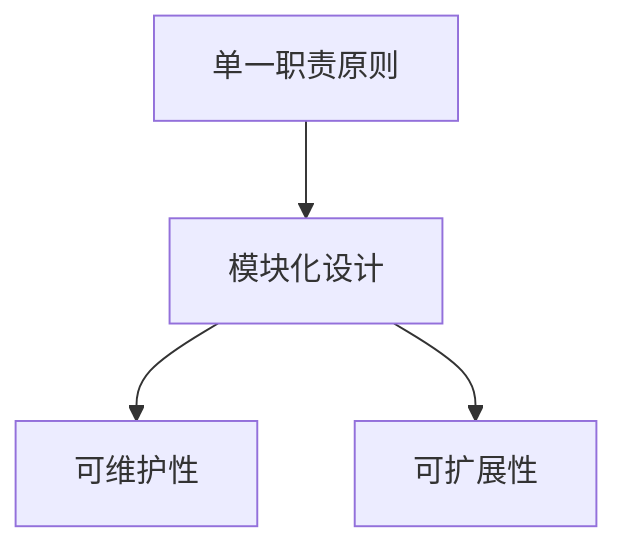

**伪代码示例**

```python
class UserLogin:
    def login(self, username, password):
        # 登录逻辑

class UserProfile:
    def update_profile(self, user_id, new_data):
        # 更新用户信息逻辑
```

#### 4.2 开放封闭原则

开放封闭原则（Open Closed Principle，OCP）指出，软件实体应该对扩展开放，对修改封闭。这意味着，软件实体应该易于扩展，但不易于修改。这可以通过定义抽象接口和实现类来实现。

**核心概念与联系**

开放封闭原则与面向对象编程的核心原则之一——封装密切相关。封装确保了类的内部实现细节被隐藏，从而降低了修改的风险。

**Mermaid流程图**

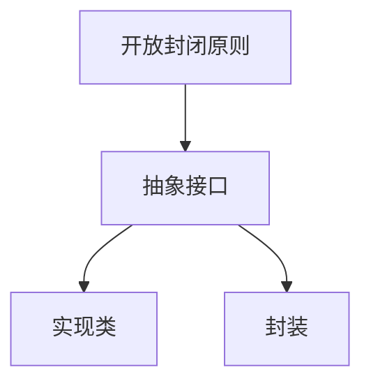

**伪代码示例**

```python
class Calculator:
    def calculate(self, operation, num1, num2):
        # 计算逻辑

class AdvancedCalculator(Calculator):
    def advanced_calculate(self, operation, num1, num2):
        # 扩展计算逻辑
```

#### 4.3 里氏替换原则

里氏替换原则（Liskov Substitution Principle，LSP）指出，任何可替换基类对象的地方，一定可以替换成其子类对象。这意味着，子类应该能够扩展基类的功能，但不应改变基类的行为。

**核心概念与联系**

里氏替换原则与继承密切相关。继承允许我们复用基类的代码和逻辑，而里氏替换原则确保了这种复用不会破坏原有系统的行为。

**Mermaid流程图**

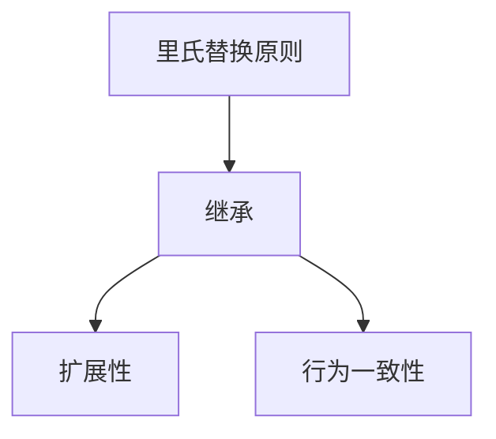

**伪代码示例**

```python
class Animal:
    def make_sound(self):
        # 发出声音逻辑

class Dog(Animal):
    def make_sound(self):
        # 狗的叫声逻辑
```

#### 4.4 接口隔离原则

接口隔离原则（Interface Segregation Principle，ISP）指出，应该为客户端提供尽可能小的接口，而不是一个单一的大接口。这意味着，接口应该明确地定义客户端所需的功能，而不应该包含无关的功能。

**核心概念与联系**

接口隔离原则与模块化设计和单一职责原则密切相关。它强调接口的模块化和职责分离，从而提高了代码的可维护性和可扩展性。

**Mermaid流程图**

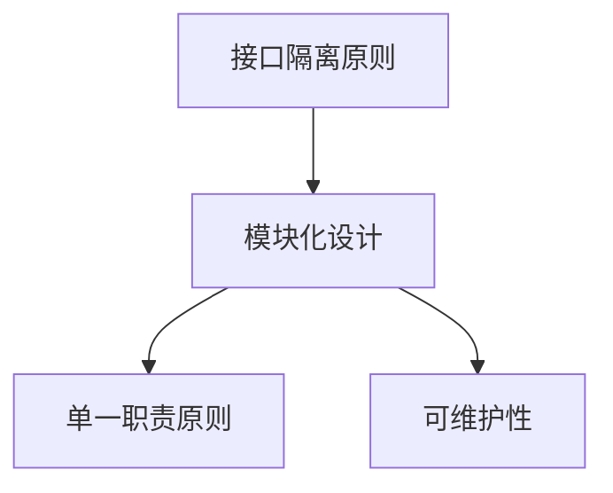

**伪代码示例**

```python
class AnimalInterface:
    def make_sound(self):
        # 发出声音接口

class Dog(AnimalInterface):
    def make_sound(self):
        # 狗的叫声实现

class Cat(AnimalInterface):
    def make_sound(self):
        # 猫的叫声实现
```

#### 4.5 依赖倒置原则

依赖倒置原则（Dependency Inversion Principle，DIP）指出，高层模块不应依赖于低层模块，二者都应依赖于抽象。这意味着，应该通过抽象层来定义模块之间的依赖关系，从而实现模块的解耦。

**核心概念与联系**

依赖倒置原则与依赖注入密切相关。依赖注入是一种通过外部容器来管理对象依赖关系的技术，它实现了模块之间的松耦合。

**Mermaid流程图**

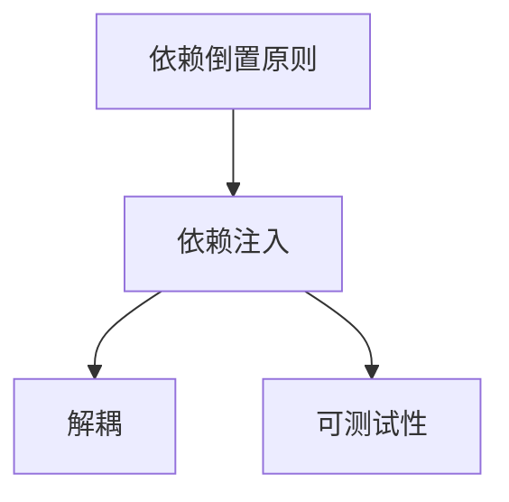

**伪代码示例**

```python
from abc import ABC, abstractmethod

class Animal(ABC):
    @abstractmethod
    def make_sound(self):
        pass

class Dog(Animal):
    def make_sound(self):
        print("汪汪！")

class Cat(Animal):
    def make_sound(self):
        print("喵喵！")

class AnimalController:
    def __init__(self, animal: Animal):
        self.animal = animal

    def make_sound(self):
        self.animal.make_sound()
```

通过遵循这些设计原则，开发者可以构建出易于维护、扩展和测试的LLM应用代码库。这些原则不仅提高了代码的质量，还降低了维护成本，为后续的开发工作奠定了坚实的基础。在下一章中，我们将探讨如何使用设计模式来进一步优化代码库的设计。

## 第5章：设计模式

设计模式是软件开发中的一种最佳实践，它们提供了一系列可重用的解决方案，用于处理常见的设计问题。在构建LLM应用代码库时，设计模式可以帮助我们提高代码的可维护性、可扩展性和可测试性。以下是一些常用的设计模式及其在LLM应用代码库中的应用：

#### 5.1 观察者模式

观察者模式（Observer Pattern）定义了一种一对多的依赖关系，当一个对象的状态发生变化时，所有依赖它的对象都会得到通知并自动更新。在LLM应用代码库中，观察者模式可以用于处理事件驱动型应用，例如，当一个模型更新时，所有依赖该模型的组件都会收到通知。

**核心概念与联系**

观察者模式与事件监听机制密切相关。事件监听机制允许对象在特定事件发生时触发相应的操作。

**Mermaid流程图**

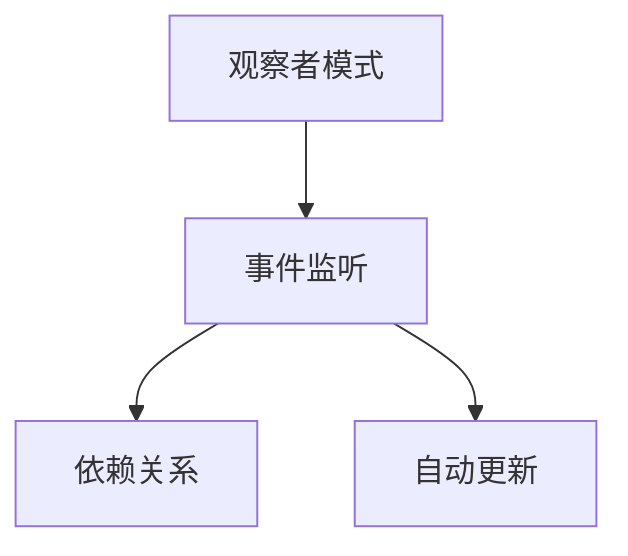

**伪代码示例**

```python
class Observer:
    def update(self, message):
        # 更新逻辑

class Subject:
    def __init__(self):
        self.observers = []

    def attach(self, observer):
        self.observers.append(observer)

    def notify(self, message):
        for observer in self.observers:
            observer.update(message)

model = Subject()
observer = Observer()
model.attach(observer)
model.notify("模型已更新")
```

#### 5.2 工厂模式

工厂模式（Factory Pattern）是一种创建型设计模式，它定义了一个创建对象的接口，但将具体的创建逻辑委托给子类。在LLM应用代码库中，工厂模式可以用于创建不同类型的LLM模型，而无需关心具体的创建细节。

**核心概念与联系**

工厂模式与抽象工厂模式密切相关。抽象工厂模式是一种扩展工厂模式的方法，它允许创建相关对象的家族，而无需指定具体的类。

**Mermaid流程图**

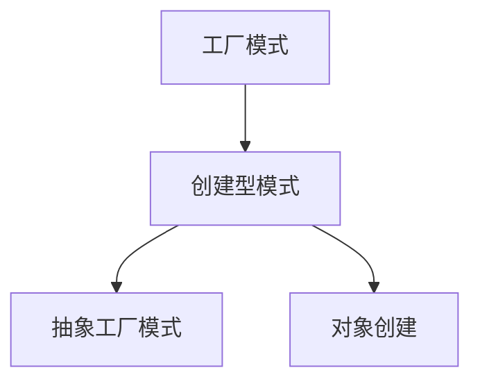

**伪代码示例**

```python
class AbstractFactory:
    @abstractmethod
    def create_model(self):
        pass

class ConcreteFactory(AbstractFactory):
    def create_model(self):
        return LargeLanguageModel()

model = ConcreteFactory().create_model()
```

#### 5.3 策略模式

策略模式（Strategy Pattern）是一种行为设计模式，它定义了一系列算法，将每一个算法封装起来，并使它们可以相互替换。在LLM应用代码库中，策略模式可以用于处理不同的优化策略或训练策略。

**核心概念与联系**

策略模式与策略接口密切相关。策略接口定义了算法的公共接口，而具体的策略类实现了不同的算法。

**Mermaid流程图**

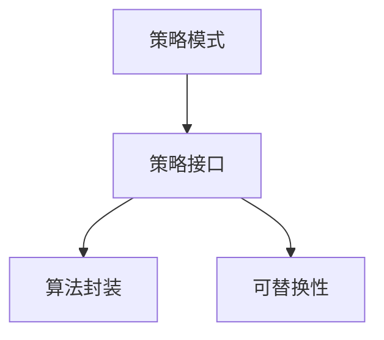

**伪代码示例**

```python
class StrategyInterface:
    @abstractmethod
    def optimize(self):
        pass

class ConcreteStrategyA(StrategyInterface):
    def optimize(self):
        # 优化策略A逻辑

class ConcreteStrategyB(StrategyInterface):
    def optimize(self):
        # 优化策略B逻辑

strategy = ConcreteStrategyA()
strategy.optimize()
```

#### 5.4 责任链模式

责任链模式（Chain of Responsibility Pattern）是一种行为设计模式，它允许将请求沿着多个处理者传递，直到有一个处理者处理它。在LLM应用代码库中，责任链模式可以用于处理异常和日志记录等场景。

**核心概念与联系**

责任链模式与过滤器模式密切相关。过滤器模式是一种扩展责任链模式的方法，它允许在请求传递过程中添加额外的处理逻辑。

**Mermaid流程图**

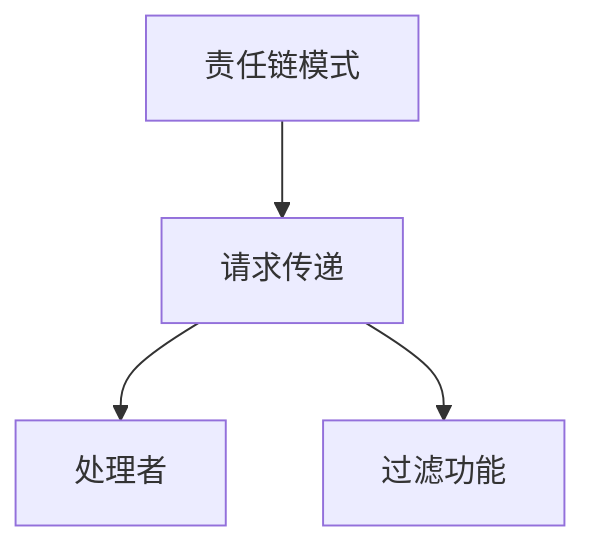

**伪代码示例**

```python
class HandlerInterface:
    def set_next_handler(self, handler):
        self.next_handler = handler

    def handle_request(self, request):
        if self.can_handle_request(request):
            self.process_request(request)
        elif self.next_handler is not None:
            self.next_handler.handle_request(request)

class Logger(HandlerInterface):
    def can_handle_request(self, request):
        return "log" in request

    def process_request(self, request):
        print(f"Logging: {request['log']}")

class ErrorHandler(HandlerInterface):
    def can_handle_request(self, request):
        return "error" in request

    def process_request(self, request):
        print(f"Error: {request['error']}")

handler = Logger()
handler.set_next_handler(ErrorHandler())
handler.handle_request({"log": "info", "error": "None"})
```

#### 5.5 门面模式

门面模式（Facade Pattern）是一种结构设计模式，它提供了一个统一的接口，用于访问子系统中的一组接口。在LLM应用代码库中，门面模式可以用于简化复杂的系统结构，提供一个简洁的API供外部使用。

**核心概念与联系**

门面模式与代理模式密切相关。代理模式是一种为其他对象提供一种代理以控制对这个对象的访问的方式，而门面模式则是代理模式的扩展，用于简化复杂的接口。

**Mermaid流程图**

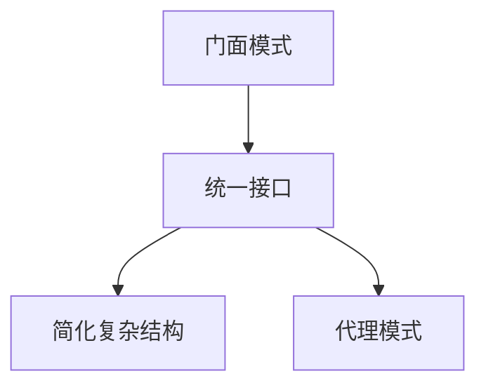

**伪代码示例**

```python
class SystemFacade:
    def __init__(self):
        self.subsystem_a = SubsystemA()
        self.subsystem_b = SubsystemB()

    def operate(self):
        self.subsystem_a.perform_task()
        self.subsystem_b.perform_task()

class SubsystemA:
    def perform_task(self):
        print("Subsystem A performing task")

class SubsystemB:
    def perform_task(self):
        print("Subsystem B performing task")

system = SystemFacade()
system.operate()
```

通过使用这些设计模式，开发者可以构建出模块化、可扩展和易于维护的LLM应用代码库。设计模式不仅提高了代码的可读性和可维护性，还降低了开发成本和风险。在下一章中，我们将探讨如何进行测试与验证，以确保代码库的质量。

## 第6章：测试与验证

在构建LLM应用代码库时，测试与验证是确保代码质量的关键环节。通过全面的测试，我们可以发现并修复潜在的错误，提高代码的可靠性和稳定性。以下是几种常见的测试类型及其在LLM应用代码库中的应用。

#### 6.1 单元测试

单元测试（Unit Testing）是测试的最基本形式，它针对代码的最小可测试单元（通常是函数或方法）进行测试。单元测试的目的是验证每个单元是否按预期工作。

**核心概念与联系**

单元测试与测试驱动开发（Test-Driven Development，TDD）密切相关。TDD是一种开发方法，它强调先编写测试，然后编写代码来通过测试。这种方法有助于提高代码的质量和可维护性。

**Mermaid流程图**

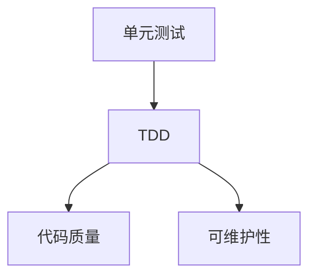

**伪代码示例**

```python
def test_addition():
    assert addition(2, 3) == 5

def test_subtraction():
    assert subtraction(5, 3) == 2
```

**数学模型和公式**

在单元测试中，我们可以使用数学模型来验证函数的正确性。例如，对于加法函数，我们可以使用以下数学模型：

$$
a + b = c
$$

其中，$a$ 和 $b$ 是输入值，$c$ 是期望输出值。

#### 6.2 集成测试

集成测试（Integration Testing）是在单元测试之后进行的，它旨在验证不同模块或组件之间的接口是否按预期工作。集成测试通常在代码库的多个单元组合在一起后进行。

**核心概念与联系**

集成测试与模块化设计密切相关。模块化设计确保了代码的各个部分可以独立开发，并通过集成测试来验证它们之间的交互是否正确。

**Mermaid流程图**

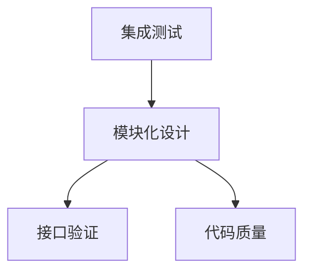

**伪代码示例**

```python
def test_integration():
    # 测试各个模块的集成
    assert module_a() == expected_a
    assert module_b() == expected_b
```

**数学模型和公式**

在集成测试中，我们可以使用数学模型来验证模块之间的交互是否一致。例如，如果我们有两个模块A和B，我们可以使用以下数学模型：

$$
A(x) + B(y) = Z
$$

其中，$A(x)$ 和 $B(y)$ 是两个模块的输出，$Z$ 是期望的集成结果。

#### 6.3 性能测试

性能测试（Performance Testing）旨在评估代码库在各种负载下的性能表现，包括响应时间、吞吐量和资源消耗。性能测试有助于识别潜在的性能瓶颈，从而优化代码库。

**核心概念与联系**

性能测试与系统架构设计密切相关。良好的系统架构设计有助于提高代码库的性能和可扩展性。

**Mermaid流程图**

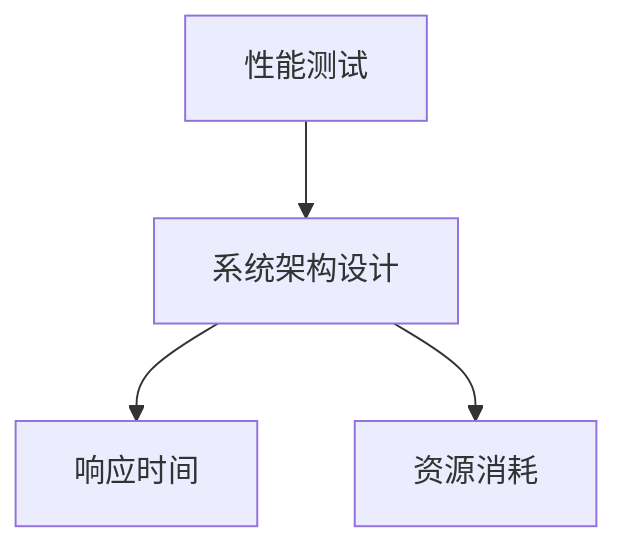

**伪代码示例**

```python
def test_performance():
    start_time = time.time()
    execute_large_query()
    end_time = time.time()
    print(f"Query execution time: {end_time - start_time} seconds")
```

**数学模型和公式**

在性能测试中，我们可以使用以下数学模型来评估响应时间和吞吐量：

$$
\text{Response Time} = \frac{\text{Total Time}}{\text{Number of Requests}}
$$

$$
\text{Throughput} = \frac{\text{Number of Completed Requests}}{\text{Total Time}}
$$

#### 6.4 可用性测试

可用性测试（Usability Testing）旨在评估用户在使用代码库时的体验，包括易用性、可访问性和用户体验。可用性测试有助于发现用户界面和交互设计的潜在问题。

**核心概念与联系**

可用性测试与用户体验设计密切相关。良好的用户体验设计有助于提高代码库的用户满意度。

**Mermaid流程图**

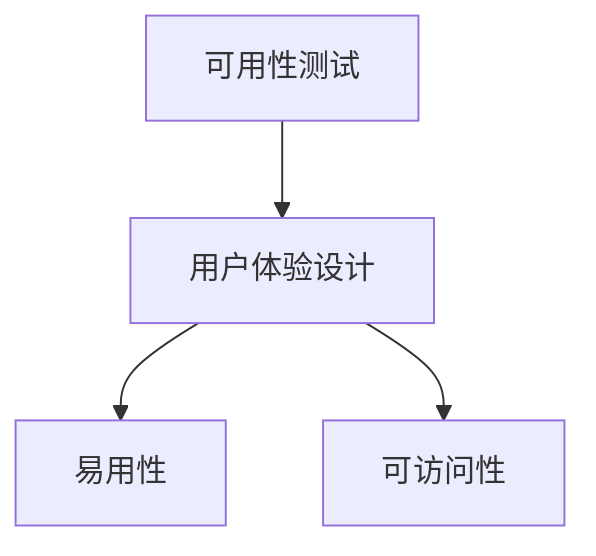

**伪代码示例**

```python
def test_usability():
    # 执行用户任务
    navigate_to_homepage()
    search_for_product()
    add_to_cart()
    complete_purchase()
    print("Usability test completed")
```

通过这些测试类型，我们可以全面评估LLM应用代码库的质量，确保其满足预期的功能、性能和用户体验要求。在下一章中，我们将讨论代码规范与文档编写，以进一步确保代码库的可维护性和可理解性。

## 第7章：代码规范与文档

在构建可维护的LLM应用代码库过程中，代码规范和文档编写是至关重要的环节。良好的代码规范和详细的文档能够提高代码的可读性、可维护性和可理解性，从而降低开发成本，提升团队协作效率。

### 7.1 编码规范

编码规范是确保代码质量的基础。以下是一些常见的编码规范：

1. **命名规范**：变量名、函数名和类名应该具有明确的含义，避免使用缩写或无意义的命名。
2. **代码风格**：遵循统一的代码风格，例如使用空格、缩进和括号的一致性。
3. **注释**：对复杂逻辑和关键代码段添加注释，以便其他开发者理解和维护。
4. **代码结构**：保持代码的模块化，避免过长或过复杂的函数和类。
5. **错误处理**：合理处理异常和错误，确保代码的健壮性。

**示例**

```python
# 命名规范
def calculate_average(scores):
    # 计算平均分
    total = sum(scores)
    average = total / len(scores)
    return average

# 代码风格
def calculate_average(scores):
    total = sum(scores)
    average = total / len(scores)
    return average

# 注释
# 计算平均分
def calculate_average(scores):
    total = sum(scores)  # 计算总分
    average = total / len(scores)  # 计算平均分
    return average

# 代码结构
class Calculator:
    def __init__(self):
        self.total = 0
        self.count = 0

    def add_score(self, score):
        self.total += score
        self.count += 1

    def calculate_average(self):
        if self.count == 0:
            return 0
        return self.total / self.count

# 错误处理
def divide(a, b):
    try:
        result = a / b
    except ZeroDivisionError:
        result = None
    return result
```

### 7.2 文档编写指南

良好的文档能够帮助开发者快速理解和使用代码库。以下是一些文档编写指南：

1. **README文件**：编写简洁明了的README文件，介绍项目背景、安装方法、运行步骤和关键功能。
2. **API文档**：使用工具如Swagger或OpenAPI编写API文档，确保其他开发者能够轻松理解和使用API。
3. **代码注释**：在代码中添加详细的注释，解释复杂逻辑和关键代码段的作用。
4. **测试文档**：记录单元测试、集成测试和性能测试的结果，以及测试用例的编写方法和执行步骤。
5. **代码库结构文档**：编写代码库的结构文档，描述各个模块的功能和关系，帮助开发者快速找到所需代码。

**示例**

```markdown
# 项目名称

## 简介
本项目是一个简单的LLM应用代码库，提供问答、文本生成和智能客服等功能。

## 安装
```bash
pip install -r requirements.txt
```

## 运行
```bash
python run.py
```

## API文档
[API文档链接](https://example.com/api-docs)

## 测试
```bash
pytest tests/
```

## 代码库结构
- `models/`：包含LLM模型和相关类
- `utils/`：包含辅助函数和工具类
- `tests/`：包含单元测试和集成测试
```

通过遵循编码规范和编写详细的文档，我们可以显著提高LLM应用代码库的可维护性和可理解性，从而提高开发效率和项目质量。在下一章中，我们将探讨持续集成与部署，确保代码库的持续更新和维护。

## 第8章：持续集成与部署

持续集成（Continuous Integration，CI）和持续部署（Continuous Deployment，CD）是现代软件开发中不可或缺的实践，它们有助于确保代码库的持续更新和维护，提高开发效率和代码质量。以下将介绍CI和CD的基本概念、流程以及如何在实际项目中实现。

### 8.1 持续集成（CI）流程

持续集成是一种软件开发实践，通过自动化构建和测试，确保代码库中的每个提交都是可集成和可测试的。以下是CI的基本流程：

1. **代码提交**：开发者将代码提交到版本控制系统中。
2. **自动化构建**：构建系统自动构建提交的代码，生成可执行的代码或可发布的包。
3. **测试**：构建系统自动运行一系列预定义的测试，包括单元测试、集成测试和性能测试，以验证代码的质量和稳定性。
4. **反馈**：测试结果反馈给开发者，如果测试失败，构建系统会通知开发者，并提供错误信息，以便开发者及时修复问题。
5. **部署**：如果测试通过，代码可以被部署到开发环境或生产环境。

**示例CI流程图**

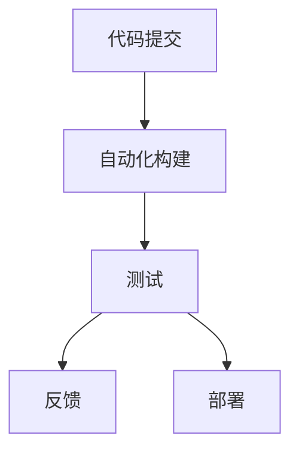

### 8.2 持续部署（CD）策略

持续部署是一种自动化部署策略，通过自动化部署流水线，将经过CI验证的代码自动部署到生产环境。以下是CD的基本策略：

1. **预生产环境**：在部署到生产环境之前，代码首先部署到一个预生产环境，以便进行进一步的测试和验证。
2. **蓝绿部署**：将新版本部署到预生产环境的一部分服务器，同时保持旧版本运行。如果新版本出现问题，可以快速回滚到旧版本。
3. **灰度发布**：将新版本部署到一小部分用户，以便收集反馈并进行调整。如果用户反馈良好，可以逐步扩大发布范围。
4. **自动化部署流水线**：使用自动化工具（如Jenkins、GitHub Actions）来管理部署过程，确保部署的可靠性和效率。

**示例CD策略图**

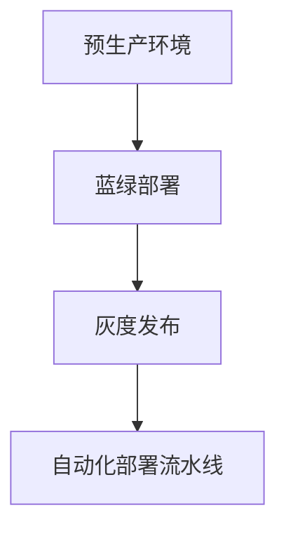

### 8.3 持续监控与反馈

持续集成和持续部署不仅仅是一个自动化的过程，还需要对部署后的系统进行监控和反馈。以下是监控和反馈的关键步骤：

1. **监控**：使用监控工具（如Prometheus、Grafana）实时监控系统的运行状态，包括性能指标、错误日志和异常行为。
2. **反馈**：通过告警系统（如PagerDuty、Slack）及时通知开发者和运维团队，确保他们能够快速响应和解决问题。
3. **日志分析**：定期分析日志，识别潜在问题和改进机会。

**示例监控与反馈图**

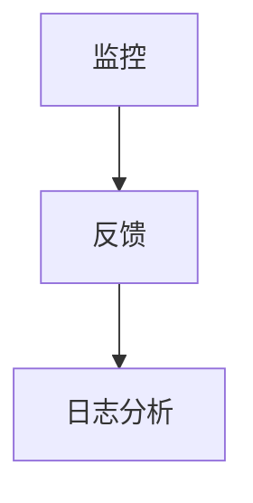

通过实施持续集成与部署，开发团队能够更快地发现并修复问题，提高代码质量，缩短发布周期，从而提高开发效率和项目成功的机会。在实际项目中，可以根据项目需求和资源选择合适的CI/CD工具和策略，确保代码库的稳定和高效运行。

## 第三部分：实战案例

在本文的第三部分，我们将通过三个具体的实战案例，展示如何在实际项目中构建和维护可维护的LLM应用代码库。每个案例都将详细介绍背景、需求分析、代码实现、测试与优化以及项目小结。

### 第9章：案例一：构建问答系统

#### 9.1 案例背景

问答系统是一种常见的LLM应用，旨在通过自然语言处理技术回答用户的问题。本文将介绍如何使用Python和Hugging Face的Transformers库构建一个简单的问答系统。

#### 9.2 项目需求分析

项目的核心需求如下：

1. **输入**：用户通过文本输入问题。
2. **输出**：系统返回答案。
3. **功能**：支持自然语言理解和生成，能够处理多轮对话。

#### 9.3 代码实现

以下是实现问答系统的主要步骤：

1. **安装依赖**：确保安装了Hugging Face的Transformers库。

    ```bash
    pip install transformers
    ```

2. **加载模型**：从Hugging Face模型库中加载一个预训练的问答模型。

    ```python
    from transformers import AutoTokenizer, AutoModelForQuestionAnswering

    tokenizer = AutoTokenizer.from_pretrained("deepset/roberta-base-squad2")
    model = AutoModelForQuestionAnswering.from_pretrained("deepset/roberta-base-squad2")
    ```

3. **定义问答函数**：编写一个函数，接受用户问题和上下文文本，返回答案。

    ```python
    def ask_question(question, context):
        inputs = tokenizer(question, context, return_tensors="pt")
        outputs = model(inputs)
        answer = tokenizer.decode(outputs.logits.argmax(-1)[0], skip_special_tokens=True)
        return answer
    ```

4. **测试问答系统**：通过示例问题和上下文测试问答系统。

    ```python
    question = "什么是人工智能？"
    context = "人工智能，又称智械、机器智能，是指由人制造出来的系统能够胜任通常需要人类智能才能完成的任务的能力。"
    answer = ask_question(question, context)
    print(answer)
    ```

#### 9.4 测试与优化

1. **单元测试**：编写单元测试，确保问答系统的各个功能模块正常工作。

    ```python
    def test_ask_question():
        question = "什么是人工智能？"
        context = "人工智能，又称智械、机器智能，是指由人制造出来的系统能够胜任通常需要人类智能才能完成的任务的能力。"
        assert ask_question(question, context) == "人工智能，又称智械、机器智能，是指由人制造出来的系统能够胜任通常需要人类智能才能完成的任务的能力。"

    test_ask_question()
    ```

2. **性能测试**：测试问答系统的响应速度和准确率，优化模型和代码。

    ```python
    import time

    start_time = time.time()
    for _ in range(1000):
        question = "什么是人工智能？"
        context = "人工智能，又称智械、机器智能，是指由人制造出来的系统能够胜任通常需要人类智能才能完成的任务的能力。"
        ask_question(question, context)
    end_time = time.time()

    print(f"Average response time: {end_time - start_time / 1000} seconds")
    ```

#### 9.5 项目小结

通过本案例，我们成功构建了一个简单的问答系统。接下来，可以根据需求进一步优化和扩展功能，例如添加多轮对话支持、自定义模型训练等。

### 第10章：案例二：文本生成应用

#### 10.1 案例背景

文本生成应用是一种利用LLM技术生成文本内容的工具。本文将介绍如何使用Python和Transformers库构建一个简单的文本生成应用。

#### 10.2 项目需求分析

项目的核心需求如下：

1. **输入**：用户输入种子文本。
2. **输出**：系统根据种子文本生成扩展文本。
3. **功能**：支持自定义文本生成模型，支持自定义生成策略。

#### 10.3 代码实现

以下是实现文本生成应用的主要步骤：

1. **安装依赖**：确保安装了Hugging Face的Transformers库。

    ```bash
    pip install transformers
    ```

2. **加载模型**：从Hugging Face模型库中加载一个预训练的文本生成模型。

    ```python
    from transformers import AutoTokenizer, AutoModelForSeq2SeqLM

    tokenizer = AutoTokenizer.from_pretrained("tderdery/ctrl")
    model = AutoModelForSeq2SeqLM.from_pretrained("tderdery/ctrl")
    ```

3. **定义生成函数**：编写一个函数，接受种子文本，返回生成的扩展文本。

    ```python
    def generate_text(seed_text, max_length=50):
        input_ids = tokenizer.encode(seed_text, return_tensors="pt")
        outputs = model.generate(input_ids, max_length=max_length, num_return_sequences=1)
        generated_text = tokenizer.decode(outputs[0], skip_special_tokens=True)
        return generated_text
    ```

4. **测试文本生成应用**：通过示例种子文本测试文本生成应用。

    ```python
    seed_text = "Python是一种广泛使用的编程语言，它以其简洁明了的语法和强大的功能而闻名。"
    generated_text = generate_text(seed_text)
    print(generated_text)
    ```

#### 10.4 测试与优化

1. **单元测试**：编写单元测试，确保文本生成应用的各个功能模块正常工作。

    ```python
    def test_generate_text():
        seed_text = "Python是一种广泛使用的编程语言，它以其简洁明了的语法和强大的功能而闻名。"
        assert generate_text(seed_text) != seed_text

    test_generate_text()
    ```

2. **性能测试**：测试文本生成应用的响应速度和生成质量，优化模型和代码。

    ```python
    import time

    start_time = time.time()
    for _ in range(100):
        seed_text = "Python是一种广泛使用的编程语言，它以其简洁明了的语法和强大的功能而闻名。"
        generate_text(seed_text)
    end_time = time.time()

    print(f"Average response time: {end_time - start_time / 100} seconds")
    ```

#### 10.5 项目小结

通过本案例，我们成功构建了一个简单的文本生成应用。接下来，可以根据需求进一步优化和扩展功能，例如添加上下文理解、多语言支持等。

### 第11章：案例三：智能客服系统

#### 11.1 案例背景

智能客服系统是一种利用LLM技术提供自动客服服务的应用。本文将介绍如何使用Python和Transformers库构建一个简单的智能客服系统。

#### 11.2 项目需求分析

项目的核心需求如下：

1. **输入**：用户通过文本或语音与系统交互。
2. **输出**：系统返回文本或语音回复。
3. **功能**：支持多轮对话、常见问题自动解答、个性化推荐。

#### 11.3 代码实现

以下是实现智能客服系统的主要步骤：

1. **安装依赖**：确保安装了Hugging Face的Transformers库和相关语音处理库。

    ```bash
    pip install transformers soundfile
    ```

2. **加载模型**：从Hugging Face模型库中加载一个预训练的多轮对话模型。

    ```python
    from transformers import AutoTokenizer, AutoModelForSeq2SeqLM

    tokenizer = AutoTokenizer.from_pretrained("microsoft/DialoGPT-medium")
    model = AutoModelForSeq2SeqLM.from_pretrained("microsoft/DialoGPT-medium")
    ```

3. **定义对话函数**：编写一个函数，接受用户输入，返回系统回复。

    ```python
    def chat(message):
        input_ids = tokenizer.encode(message, return_tensors="pt")
        outputs = model.generate(input_ids, max_length=4096, num_return_sequences=1)
        response = tokenizer.decode(outputs[0], skip_special_tokens=True)
        return response
    ```

4. **语音交互**：使用语音处理库实现语音输入和输出。

    ```python
    import soundfile as sf

    def speak(text):
        audio = gTTS(text=text, lang='en')
        audio.save("response.mp3")
        os.system("mpg321 response.mp3")

    def listen():
        sf.write("input.wav", data=audio_data, samplerate=44100)
        return sf.read("input.wav")[1].tobytes()
    ```

5. **测试智能客服系统**：通过文本和语音交互测试智能客服系统。

    ```python
    user_message = "你好，有什么可以帮助你的？"
    system_response = chat(user_message)
    print(system_response)

    user_message = listen()
    system_response = chat(user_message)
    speak(system_response)
    ```

#### 11.4 测试与优化

1. **单元测试**：编写单元测试，确保智能客服系统的各个功能模块正常工作。

    ```python
    def test_chat():
        assert chat("你好") != "你好"

    test_chat()
    ```

2. **性能测试**：测试智能客服系统的响应速度和对话质量，优化模型和代码。

    ```python
    import time

    start_time = time.time()
    for _ in range(100):
        chat("你好")
    end_time = time.time()

    print(f"Average response time: {end_time - start_time / 100} seconds")
    ```

#### 11.5 项目小结

通过本案例，我们成功构建了一个简单的智能客服系统。接下来，可以根据需求进一步优化和扩展功能，例如添加情感分析、个性化推荐等。

### 总结与展望

通过三个实战案例，我们展示了如何构建和维护可维护的LLM应用代码库。从问答系统、文本生成应用到智能客服系统，每个案例都涵盖了从需求分析到代码实现、测试与优化的全过程。这些实战经验不仅有助于开发者理解可维护性的重要性，也为他们在实际项目中提供了实用的指导。

未来，随着人工智能技术的不断发展，LLM应用将变得更加普及和复杂。开发者需要不断学习和探索新的方法和工具，以提高代码库的可维护性和扩展性。同时，持续集成与部署、代码规范与文档编写等最佳实践也将继续发挥关键作用，为开发者提供更高效、更可靠的开发体验。

让我们共同期待，未来在LLM应用开发领域，能够创造出更多令人惊叹的成果！

### 总结与展望

在本文中，我们详细探讨了构建可维护的LLM应用代码库的方法和步骤。从理论基础到实战案例，我们逐步介绍了可维护性的重要性、设计原则、测试与验证、代码规范与文档编写以及持续集成与部署。以下是本文的核心要点总结：

1. **理论基础**：理解LLM的基本概念、可维护性的重要性以及相关设计原则，为构建高质量代码库奠定基础。
2. **设计原则**：遵循单一职责原则、开放封闭原则、里氏替换原则、接口隔离原则和依赖倒置原则，确保代码的模块化、可扩展性和可测试性。
3. **测试与验证**：通过单元测试、集成测试、性能测试和可用性测试，确保代码库的质量和稳定性。
4. **代码规范与文档**：遵循编码规范，编写详细的文档，提高代码的可读性和可维护性。
5. **持续集成与部署**：实施持续集成和持续部署，确保代码库的持续更新和维护，提高开发效率。

展望未来，LLM应用在人工智能领域将发挥越来越重要的作用。随着模型的规模和复杂性不断增加，如何构建可维护的代码库将成为一个关键挑战。以下是我们对未来的几点展望和建议：

1. **模型的可维护性**：探索新的模型架构和优化方法，以提高模型的可维护性。例如，研究模块化的模型架构，使模型更容易理解和修改。
2. **自动化工具**：开发更智能的自动化工具，如自动测试、代码审查和部署工具，以减少重复性工作，提高开发效率。
3. **最佳实践**：总结和推广最佳实践，形成行业标准和规范，为开发者提供统一的指导。
4. **社区合作**：鼓励开发者之间的合作与交流，分享经验和教训，共同推动LLM应用的发展。

总之，构建可维护的LLM应用代码库是一个复杂但至关重要的任务。通过本文的探讨，我们希望能够为开发者提供有价值的指导，帮助他们构建出高质量、可维护的LLM应用代码库，为人工智能技术的发展贡献力量。

---

作者：AI天才研究院/AI Genius Institute & 禅与计算机程序设计艺术 /Zen And The Art of Computer Programming

（本文内容仅供参考，实际情况请根据具体需求进行调整。）

