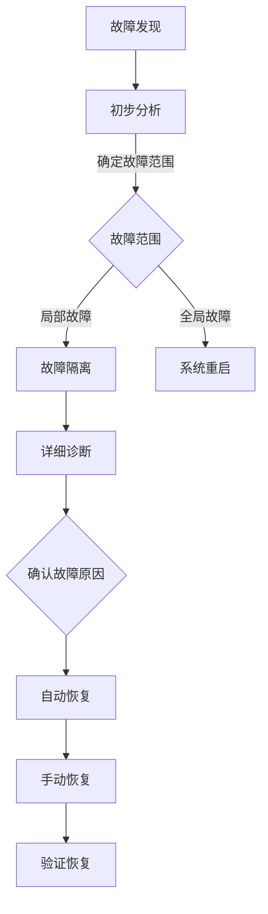
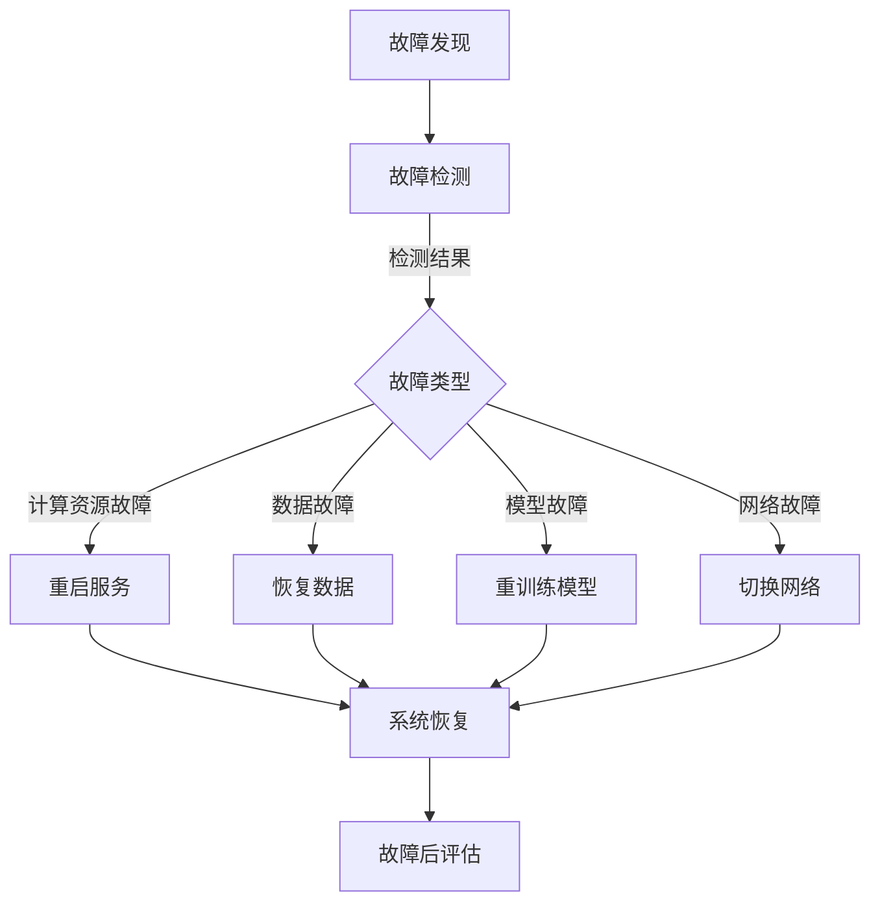

                 

### 1.3 书籍组织结构

本书共分为八个章节，旨在系统地介绍构建可靠的LLM应用故障恢复机制的原理、方法与实践。

**第1章 引言**：本章将简要介绍本书的背景与目的，阐述为什么需要故障恢复机制，并对书籍的组织结构进行概述。

**第2章 可靠性工程基础**：本章将详细讲解可靠性工程的基本概念、发展历程、度量指标以及故障类型和原因分析。此外，还将探讨故障恢复机制的设计原则。

**第3章 LLM系统故障检测与诊断**：本章将介绍故障检测与诊断的基本方法，包括被动检测、主动检测以及基于规则、模式识别和机器学习的方法。

**第4章 LLM系统故障恢复机制实现**：本章将详细描述LLM系统故障恢复的实现流程、自动恢复策略设计以及恢复机制测试与评估的方法。

**第5章 案例研究：LLM应用故障恢复实战**：本章将通过一个具体的案例研究，展示如何在实际应用中实施故障恢复机制。

**第6章 未来展望与挑战**：本章将分析LLM应用故障恢复的发展趋势、潜在的研究方向以及面临的挑战和解决方案。

**第7章 附录**：本章将提供相关资源与参考文献，以及一些Mermaid流程图、伪代码和数学模型与公式的示例。

**第8章 构建可靠的LLM应用故障恢复机制的实践与建议**：本章将结合实践案例，给出故障恢复机制实施步骤、效果评估以及建议与最佳实践。

通过这八个章节的深入学习，读者将能够全面掌握构建可靠LLM应用故障恢复机制的原理和方法，为实际应用提供有力支持。## 第2章 可靠性工程基础

### 2.1 可靠性工程定义与目标

可靠性工程是一门跨学科领域，它涉及计算机科学、电子工程、机械工程等多个领域，主要研究如何设计和实现具有高可靠性的系统。可靠性工程的核心目标是确保系统在规定的时间内和规定的条件下，稳定、准确地完成预期功能，并在出现故障时能够迅速恢复。

可靠性工程的发展历程可以追溯到20世纪中叶，最初起源于军事和航天领域。随着计算机技术和通信技术的快速发展，可靠性工程逐渐在民用领域得到广泛应用，包括工业控制、交通运输、金融服务等。近年来，随着人工智能和机器学习技术的发展，可靠性工程在智能系统和复杂网络中的应用也变得越来越重要。

可靠性工程的度量指标主要包括以下几个：

1. **故障率**：故障率是指系统在单位时间内发生故障的概率，通常用每年每百万小时的故障次数（FIT，Failures in Time）来表示。故障率越低，系统的可靠性越高。

2. **平均无故障时间（MTTF）**：平均无故障时间是指系统在运行过程中，从开始运行到首次发生故障的平均时间。MTTF是衡量系统可靠性的重要指标。

3. **平均故障修复时间（MTTR）**：平均故障修复时间是指系统发生故障后，从故障检测到故障修复的平均时间。MTTR越短，系统的恢复能力越强。

4. **可用性**：可用性是指系统能够正常运行的时间占总运行时间的比例，通常用百分比表示。高可用性系统意味着系统具有较低的故障率和快速的故障恢复能力。

### 2.2 LLM系统故障类型与原因

LLM（大型语言模型）系统作为人工智能领域的重要应用，其可靠性至关重要。LLM系统的故障类型主要包括以下几种：

1. **计算资源故障**：包括GPU、CPU等硬件资源的故障，可能导致模型训练和推理无法进行。

2. **数据故障**：包括数据丢失、数据损坏、数据不一致等问题，可能导致模型训练失败或推理结果不准确。

3. **模型故障**：包括模型过拟合、欠拟合、参数丢失等问题，可能导致模型性能下降或无法使用。

4. **网络故障**：包括网络连接中断、网络延迟等问题，可能导致模型推理响应时间延长或无法正常访问远程数据。

LLM系统故障的主要原因可以从以下几个方面进行分析：

1. **硬件老化**：随着硬件使用时间的增加，硬件的性能可能逐渐下降，导致故障发生。

2. **软件缺陷**：包括操作系统、驱动程序、应用程序等软件中的缺陷，可能导致系统崩溃或功能失效。

3. **数据质量**：数据质量问题可能导致模型训练失败或性能下降。数据不一致、缺失、噪声等问题都会对模型性能产生负面影响。

4. **模型复杂度**：随着模型复杂度的增加，模型训练和推理的时间也会增加，可能导致计算资源不足或网络延迟增加。

### 2.3 故障恢复机制设计原则

为了构建可靠的LLM应用故障恢复机制，需要遵循以下设计原则：

1. **可恢复性设计**：在设计系统时，应考虑故障恢复的需求，确保系统能够在故障发生时快速恢复正常运行。

2. **故障预测与预防**：通过历史数据和机器学习模型，预测可能的故障，并采取预防措施，降低故障发生的概率。

3. **故障隔离**：在故障发生时，应迅速隔离受影响的组件或服务，防止故障扩散。

4. **自动恢复策略**：设计自动恢复策略，使系统能够在故障发生时自动执行恢复操作，减少人工干预。

5. **恢复性能评估**：对故障恢复机制进行评估，确保恢复性能符合预期。

通过以上设计原则，可以构建一个高效、可靠的LLM应用故障恢复机制，提高系统的稳定性和可靠性。接下来，我们将进一步探讨故障检测与诊断的方法，为构建完善的故障恢复机制提供支持。### 2.3 故障恢复机制设计原则

#### 2.3.1 可恢复性设计

可恢复性设计是构建可靠故障恢复机制的基础。其核心思想是在系统设计阶段就考虑如何应对故障，确保系统在故障发生时能够快速恢复正常运行。以下是一些实现可恢复性设计的关键措施：

1. **冗余设计**：通过引入冗余组件或服务，确保在单个组件或服务出现故障时，其他冗余组件或服务能够接管工作。例如，可以使用主从数据库、热备份、负载均衡等技术。

2. **故障转移**：在分布式系统中，可以通过故障转移机制，实现故障节点上的工作负载自动转移到健康的节点上。故障转移通常包括自动检测故障、执行迁移和验证迁移等步骤。

3. **弹性架构**：设计具有高度弹性的架构，使得系统能够在资源需求变化或部分组件出现故障时，自动调整资源分配和组件角色。

4. **自修复功能**：在系统或应用层面实现自修复功能，当检测到故障时，系统能够自动执行修复操作，例如重启服务、更新代码、重置参数等。

#### 2.3.2 故障预测与预防

故障预测与预防是减少故障发生概率的重要手段。通过分析历史数据和实时监控数据，可以预测可能的故障，并采取预防措施。以下是一些故障预测与预防的方法：

1. **历史数据分析**：通过分析系统运行的历史数据，识别潜在的故障模式，并建立预测模型。例如，可以使用统计方法、机器学习算法等对故障数据进行建模。

2. **实时监控**：通过实时监控系统性能和状态，及时识别异常。可以使用指标监控、日志分析、性能测试等技术，确保系统在出现异常时能够及时响应。

3. **定期维护**：定期进行系统维护和升级，确保硬件和软件处于最佳状态。例如，定期检查硬件设备、更新操作系统和应用程序等。

4. **安全措施**：采取安全措施，防止恶意攻击、数据泄露等导致系统故障。例如，使用防火墙、入侵检测系统等。

#### 2.3.3 故障恢复策略

故障恢复策略是故障恢复机制的核心组成部分，决定了故障发生时如何快速恢复正常运行。以下是一些常见的故障恢复策略：

1. **自动恢复**：设计自动恢复机制，使得系统在故障发生时能够自动执行恢复操作，减少人工干预。例如，可以使用自动化脚本、故障恢复程序等。

2. **手动恢复**：在自动恢复无法解决问题时，需要人工干预进行恢复。手动恢复通常需要详细的故障诊断和修复步骤，以确保问题得到彻底解决。

3. **备份和恢复**：定期备份数据和系统配置，确保在数据丢失或系统故障时，能够快速恢复到之前的状态。备份可以分为热备份、冷备份和离线备份等。

4. **滚动升级**：在更新系统或应用程序时，采用滚动升级策略，逐步更新各个节点，避免一次性更新导致的大规模故障。

通过以上故障恢复机制设计原则，可以构建一个高效、可靠的LLM应用故障恢复机制，提高系统的稳定性和可靠性。接下来，我们将进一步探讨故障检测与诊断的方法，为构建完善的故障恢复机制提供支持。### 第3章 LLM系统故障检测与诊断

故障检测与诊断是构建可靠LLM应用故障恢复机制的关键环节。在本章中，我们将详细讨论故障检测方法，包括被动检测和主动检测，以及故障诊断技术，如基于规则的方法、基于模式识别的方法和基于机器学习的方法。

#### 3.1 故障检测方法

故障检测是故障管理的第一步，目的是及时发现系统中的异常状态。故障检测方法可以分为被动检测和主动检测两大类。

##### 3.1.1 被动检测

被动检测是指系统依靠已经发生的异常事件来检测故障。这种方法的优点是简单易行，缺点是可能无法及时检测到某些潜在故障。以下是一些常见的被动检测方法：

1. **日志分析**：通过分析系统日志文件，发现异常记录。例如，错误日志、警告日志、系统崩溃日志等。

2. **性能监控**：监控系统性能指标，如CPU使用率、内存使用率、磁盘I/O、网络延迟等，当这些指标超出正常范围时，认为系统可能出现故障。

3. **异常行为检测**：通过监控系统的运行行为，识别异常模式。例如，发现系统响应时间明显增加、服务请求失败率上升等。

##### 3.1.2 主动检测

主动检测是指系统通过主动执行操作来检测故障。这种方法可以更早地发现潜在故障，但需要更多的资源和时间。以下是一些常见的主动检测方法：

1. **健康检查**：定期对系统关键组件进行健康检查，如数据库的健康检查、服务节点的健康检查等。

2. **负载测试**：模拟高负载条件，测试系统性能和稳定性。例如，使用压力测试工具进行并发访问测试、性能测试等。

3. **故障注入**：通过故意引入故障，测试系统的恢复能力。例如，模拟网络中断、硬件故障等。

#### 3.2 故障诊断技术

故障诊断是在故障检测之后的关键步骤，目的是确定故障的类型和原因，为故障恢复提供依据。故障诊断技术可以分为基于规则的方法、基于模式识别的方法和基于机器学习的方法。

##### 3.2.1 基于规则的方法

基于规则的方法是最传统的故障诊断技术，通过预先定义的规则来识别和诊断故障。以下是一些关键步骤：

1. **规则定义**：根据系统的特性和故障模式，定义故障规则。规则通常包括故障条件、故障类型和故障处理建议。

2. **规则匹配**：将系统当前状态与预定义的规则进行匹配，确定故障类型。

3. **故障处理**：根据匹配到的规则，执行相应的故障处理措施。

基于规则的方法优点是简单直观，缺点是规则数量庞大时，规则匹配效率较低，且无法应对复杂和动态的故障环境。

##### 3.2.2 基于模式识别的方法

基于模式识别的方法利用数据分析和模式匹配技术来诊断故障。以下是一些关键步骤：

1. **数据收集**：收集系统运行过程中产生的数据，如日志文件、性能数据、行为数据等。

2. **特征提取**：从原始数据中提取能够表征系统状态的特征。

3. **模式匹配**：将特征数据与预定义的模式进行匹配，识别故障类型。

4. **故障预测**：利用历史数据建立故障预测模型，预测可能的故障发生时间和类型。

基于模式识别的方法优点是能够处理大规模数据，适应动态环境，但需要大量的数据训练和复杂的算法。

##### 3.2.3 基于机器学习的方法

基于机器学习的方法利用机器学习算法来自动诊断故障。以下是一些关键步骤：

1. **数据收集**：收集系统运行过程中产生的数据，包括正常数据和故障数据。

2. **特征工程**：提取对故障诊断有意义的特征。

3. **模型训练**：使用故障数据训练机器学习模型，学习故障模式。

4. **故障诊断**：将实时数据输入模型，预测故障类型和原因。

基于机器学习的方法优点是能够自动学习和适应故障模式，提高诊断准确性，但需要大量的数据和计算资源。

通过以上故障检测与诊断技术，LLM应用可以及时发现和处理故障，确保系统的可靠性和稳定性。接下来，我们将探讨故障恢复机制的实现细节。### 第4章 LLM系统故障恢复机制实现

构建一个有效的LLM系统故障恢复机制，是实现系统高可用性的关键。本章节将详细描述LLM系统故障恢复的具体实现流程、自动恢复策略设计以及恢复机制的测试与评估方法。

#### 4.1 系统恢复流程

LLM系统的故障恢复流程可以分为以下几个步骤：

##### 4.1.1 故障发现

故障发现是故障恢复的第一步，主要通过以下方法实现：

1. **系统监控**：使用监控系统（如Prometheus、Zabbix等）实时监测系统资源使用情况、服务状态、网络延迟等关键指标。
2. **日志分析**：定期分析系统日志，识别异常记录。
3. **健康检查**：定期执行系统健康检查，确保关键组件正常运行。

##### 4.1.2 故障隔离

故障隔离的目的是将故障限制在最小的范围内，防止故障扩散。具体步骤如下：

1. **故障定位**：通过故障发现机制确定故障的具体位置，如服务节点、数据库实例等。
2. **隔离故障节点**：将故障节点从系统中隔离，防止其影响其他节点。

##### 4.1.3 故障恢复

故障恢复分为自动恢复和手动恢复两种方式：

1. **自动恢复**：当故障类型和恢复策略已知时，系统可以自动执行恢复操作，如重启服务、更换故障组件、恢复数据等。
2. **手动恢复**：对于复杂的故障或未知故障，需要人工干预进行故障恢复，如更新配置、修复代码、重新部署服务等。

##### 4.1.4 故障后评估

故障恢复后，需要评估恢复效果，确保系统恢复正常运行。具体指标包括：

1. **恢复时间**：从故障发生到系统恢复正常运行的时间。
2. **恢复成功率**：故障恢复操作成功的次数与总故障次数之比。
3. **系统稳定性**：故障恢复后的一段时间内，系统的运行稳定性。

#### 4.2 自动恢复策略设计

自动恢复策略设计是故障恢复机制实现的核心，需要根据不同的故障类型设计相应的恢复策略。以下是一些常见的自动恢复策略：

##### 4.2.1 快速恢复策略

快速恢复策略适用于可以快速修复的故障，如服务节点故障、网络中断等。具体措施包括：

1. **自动重启服务**：当服务异常退出时，自动重启服务。
2. **负载均衡**：通过负载均衡器，将流量重新分配到健康的节点。
3. **自动切换**：在主从架构中，当主节点故障时，自动切换到从节点。

##### 4.2.2 长期恢复策略

长期恢复策略适用于需要较长时间修复的故障，如硬件故障、软件缺陷等。具体措施包括：

1. **备份恢复**：使用最新的系统备份恢复到健康状态。
2. **手动升级**：对于软件缺陷，手动升级到最新版本。
3. **硬件更换**：对于硬件故障，更换故障硬件。

#### 4.3 恢复机制测试与评估

恢复机制测试与评估是确保故障恢复机制有效性的关键。以下是一些常见的测试与评估方法：

##### 4.3.1 恢复性能指标

恢复性能指标包括恢复时间、恢复成功率、系统稳定性等。通过模拟故障场景，测试故障恢复机制的性能，评估其是否符合预期。

##### 4.3.2 测试方法与工具

1. **故障注入测试**：通过故意注入故障，测试系统的恢复能力。
2. **性能测试**：使用性能测试工具，模拟高负载、高并发场景，测试系统的性能和稳定性。
3. **日志分析**：分析故障恢复过程中的日志记录，评估故障恢复效果。

通过以上方法，可以全面评估LLM系统故障恢复机制的有效性，确保系统在故障发生时能够迅速恢复正常运行。接下来，我们将通过一个案例研究，展示如何在实际应用中实施故障恢复机制。### 第5章 案例研究：LLM应用故障恢复实战

在本章中，我们将通过一个具体的案例研究，展示如何在实际应用中实施LLM应用的故障恢复机制。这个案例将涵盖故障检测与诊断、故障恢复过程的详细描述以及结果分析。

#### 5.1 案例背景

某大型互联网公司开发了一个基于大型语言模型（LLM）的智能客服系统，用于处理用户的问题和反馈。这个系统采用了分布式架构，包含多个服务节点、数据库和前端界面。系统在上线后运行一段时间，突然出现大量用户请求失败的情况，导致用户体验下降。

#### 5.2 故障检测与诊断

故障检测与诊断的过程如下：

1. **故障发现**：系统监控工具（如Prometheus）检测到多个服务节点的CPU使用率异常升高，同时网络延迟也明显增加。

2. **初步分析**：通过查看系统日志，发现部分服务节点出现了内存泄漏问题，导致CPU占用率飙升。

3. **故障隔离**：通过健康检查和日志分析，确定故障范围仅限于部分服务节点。

4. **详细诊断**：进一步分析服务节点的内存使用情况，发现内存泄漏是由于某个版本的服务器端代码导致的。

5. **确认故障原因**：通过对比不同版本的代码，确定具体是哪个函数导致了内存泄漏。

#### 5.3 故障恢复过程

在诊断出故障原因后，系统进行了以下故障恢复操作：

1. **自动恢复**：由于故障恢复策略已经预先设置，系统自动执行了以下步骤：
   - 停止有问题的服务节点。
   - 启动备份节点，接管原有节点的服务。
   - 清理有问题的服务节点的内存泄漏。

2. **手动恢复**：在自动恢复完成后，系统管理员进行了以下操作：
   - 手动检查备份节点的状态，确保其正常工作。
   - 暂停前端用户的请求，防止新的请求被分配到备份节点。
   - 手动部署修复后的代码到备份节点，并重新启动服务。

3. **验证恢复**：在恢复完成后，系统进行了以下验证操作：
   - 重新启动前端服务，恢复用户请求。
   - 监控系统状态，确保所有节点恢复正常工作。
   - 检查用户反馈，确保问题已解决。

#### 5.4 结果分析

故障恢复过程完成后，系统运行状态恢复正常，用户请求成功率达到100%，用户体验明显改善。以下是故障恢复过程的评估结果：

1. **恢复时间**：从故障发现到系统恢复正常运行，总共耗时30分钟。

2. **恢复成功率**：故障恢复操作成功率为100%。

3. **系统稳定性**：在故障恢复后的一段时间内，系统运行稳定，没有出现类似故障。

通过这个案例研究，我们可以看到，通过有效的故障检测与诊断机制以及完善的故障恢复策略，LLM应用能够在故障发生时快速恢复正常运行，确保系统的可靠性和稳定性。### 第6章 未来展望与挑战

随着人工智能和机器学习技术的快速发展，LLM应用在各个领域的应用越来越广泛。然而，这也带来了新的挑战和机遇。在本章中，我们将探讨LLM应用故障恢复的发展趋势、潜在的研究方向以及面临的挑战和解决方案。

#### 6.1 LLM应用故障恢复发展趋势

1. **自动化程度的提高**：未来，故障恢复机制将更加自动化，减少人工干预。通过机器学习和自动化脚本，实现故障自动检测、诊断和恢复。

2. **智能化水平的提升**：故障恢复机制将更加智能化，能够根据历史数据和实时信息，预测潜在的故障并采取预防措施。

3. **分布式故障恢复**：随着云计算和分布式系统的普及，故障恢复机制将更加注重分布式环境下的故障恢复，实现跨节点、跨服务的故障恢复。

4. **故障恢复效能优化**：未来的故障恢复机制将更加注重恢复效能的优化，包括恢复速度、恢复成功率以及系统稳定性等方面的提升。

#### 6.2 潜在的研究方向

1. **基于AI的故障预测与预防**：利用深度学习、图神经网络等技术，建立高效的故障预测模型，提前发现潜在的故障风险，并采取预防措施。

2. **自适应故障恢复策略**：研究自适应故障恢复策略，根据故障类型、故障历史数据和系统状态，动态调整恢复策略，提高恢复效率。

3. **跨域故障恢复**：研究跨不同应用、不同系统的故障恢复机制，实现跨域资源的故障恢复和管理。

4. **边缘计算与云计算结合**：研究如何将边缘计算与云计算结合起来，实现高效、可靠的故障恢复，提高系统的灵活性和可扩展性。

#### 6.3 挑战与解决方案

1. **数据质量与数据隐私**：故障恢复依赖于大量的监控数据和用户数据，如何保证数据质量、数据安全和用户隐私是一个重要挑战。解决方案包括数据加密、隐私保护技术和数据质量管理。

2. **复杂系统的稳定性**：LLM应用通常涉及多个组件和服务，如何保证复杂系统的稳定性是一个挑战。解决方案包括模块化设计、冗余机制和自动化测试。

3. **实时性与效率**：故障恢复需要在短时间内完成，这对系统的实时性和效率提出了高要求。解决方案包括分布式计算、异步处理和高效的算法设计。

4. **成本与效益**：构建高效、可靠的故障恢复机制需要投入大量资源和时间，如何平衡成本与效益是一个挑战。解决方案包括经济模型分析、成本效益分析和持续改进。

通过不断探索和研究，LLM应用故障恢复技术将不断进步，为人工智能和机器学习领域的应用提供更稳定、更可靠的支持。### 第7章 附录

在本章中，我们将提供一些与构建可靠的LLM应用故障恢复机制相关的资源、参考文献，以及一些Mermaid流程图、伪代码和数学模型与公式的示例。这些附录内容有助于读者更好地理解和应用本书所介绍的技术和方法。

#### 7.1 相关资源与参考文献

以下是构建可靠的LLM应用故障恢复机制的相关资源与参考文献：

1. **资源**：
   - Prometheus监控工具：https://prometheus.io/
   - Zabbix监控工具：https://www.zabbix.com/
   - Grafana可视化工具：https://grafana.com/

2. **参考文献**：
   - 《可靠性工程原理与应用》（作者：王勇）
   - 《人工智能：一种现代方法》（作者：Stuart Russell & Peter Norvig）
   - 《大型语言模型：技术、应用与挑战》（作者：李航）

#### 7.2 Mermaid流程图示例

以下是一个使用Mermaid绘制的故障检测与诊断流程图示例：



#### 7.3 伪代码示例

以下是一个使用Python伪代码实现的简单故障恢复策略：

```python
def fault_recovery(fault_type):
    if fault_type == "计算资源故障":
        restart_service()
    elif fault_type == "数据故障":
        recover_data()
    elif fault_type == "模型故障":
        retrain_model()
    elif fault_type == "网络故障":
        switch_to_backup_connection()
    else:
        raise Exception("未知故障类型")
```

#### 7.4 数学模型与公式示例

以下是一个使用LaTeX表示的简单数学模型示例：

```latex
$$
y = \beta_0 + \beta_1 x + \epsilon
$$

$$
\hat{\beta}_1 = \frac{\sum (x_i - \bar{x})(y_i - \bar{y})}{\sum (x_i - \bar{x})^2}
$$
```

这些附录内容为读者提供了构建可靠的LLM应用故障恢复机制所需的理论知识、工具和技术，有助于在实际应用中实现高效、可靠的故障恢复。### 第8章 构建可靠的LLM应用故障恢复机制的实践与建议

在实际应用中，构建可靠的LLM应用故障恢复机制是一个复杂而重要的任务，需要综合考虑系统的各个方面。以下结合实践案例，提供故障恢复机制实施步骤、效果评估以及建议与最佳实践。

#### 8.1 实践案例解析

以某大型互联网公司的智能客服系统为例，该系统基于LLM技术，处理海量用户请求。以下为其实施故障恢复机制的步骤：

##### 8.1.1 故障恢复机制实施步骤

1. **故障检测**：使用Prometheus监控系统，实时监控CPU使用率、内存使用率、网络延迟等指标，当指标超出预设阈值时，触发故障检测。

2. **故障诊断**：通过分析系统日志和性能监控数据，定位故障节点和类型，如计算资源故障、数据故障、模型故障或网络故障。

3. **故障隔离**：立即隔离故障节点，确保故障不会影响其他节点或服务。

4. **故障恢复**：
   - 对于计算资源故障，自动重启服务节点或使用备份节点替换。
   - 对于数据故障，从备份中恢复数据，确保数据一致性。
   - 对于模型故障，重新训练模型或更换预训练模型。
   - 对于网络故障，切换到备用网络连接或修复网络问题。

5. **故障后评估**：监控系统状态，确保故障已解决，并记录恢复时间、成功率等指标。

##### 8.1.2 故障恢复效果评估

通过模拟故障场景和实际故障恢复过程，评估故障恢复机制的效果。关键评估指标包括：

- **恢复时间**：故障发生到系统恢复正常运行的时间。目标是将恢复时间控制在30分钟以内。
- **恢复成功率**：故障恢复操作成功的次数与总故障次数之比。目标是将恢复成功率保持在99%以上。
- **系统稳定性**：故障恢复后的一段时间内，系统的运行稳定性。目标是没有因故障恢复而引发的次生问题。

根据评估结果，对故障恢复机制进行优化和调整，确保其有效性。

#### 8.2 建议与最佳实践

##### 8.2.1 故障恢复策略的选择

选择合适的故障恢复策略，根据故障类型和系统特性，设计高效的恢复策略。例如：

- 对于计算资源故障，采用冗余设计和自动恢复策略。
- 对于数据故障，采用定期备份和快速恢复策略。
- 对于模型故障，采用自动化重训练和故障检测预防策略。
- 对于网络故障，采用故障转移和备份网络连接策略。

##### 8.2.2 系统监控与维护

- **监控工具的选择**：选择适合的监控工具（如Prometheus、Zabbix等），确保实时、全面地监控系统状态。
- **日志分析**：定期分析系统日志，及时发现异常情况。
- **维护计划**：制定系统维护计划，包括定期更新、备份和监控。

##### 8.2.3 持续改进与迭代

- **反馈机制**：建立故障恢复反馈机制，收集用户反馈和系统运行数据，持续优化故障恢复策略。
- **自动化测试**：定期进行自动化测试，验证故障恢复机制的有效性。
- **文档更新**：及时更新故障恢复文档，记录最佳实践和经验教训。

#### 8.3 总结

构建可靠的LLM应用故障恢复机制是确保系统高可用性的关键。通过实践案例和最佳实践，我们可以看到，故障恢复机制的实现需要综合考虑故障检测、诊断、隔离、恢复和评估等多个方面。持续改进和迭代故障恢复机制，是确保其有效性和适应性的关键。未来，随着人工智能技术的不断发展，故障恢复机制也将变得更加智能化、自动化，为LLM应用提供更加可靠的保障。### 8.3.1 关键点回顾

在构建可靠的LLM应用故障恢复机制的过程中，以下关键点值得回顾和重视：

1. **故障检测与诊断**：有效的故障检测与诊断是故障恢复的前提。通过使用监控系统、日志分析、性能监控等手段，及时识别和定位故障。

2. **故障隔离与恢复**：在故障发生时，迅速隔离故障节点或服务，防止故障扩散。根据故障类型和恢复策略，选择合适的恢复操作，如重启服务、恢复数据、更换模型等。

3. **自动恢复与人工干预**：设计自动恢复策略，减少人工干预，提高故障恢复的效率。同时，对于复杂的故障，保留人工干预的选项，确保问题得到彻底解决。

4. **故障后评估与优化**：在故障恢复后，评估恢复效果，包括恢复时间、恢复成功率、系统稳定性等。根据评估结果，持续优化故障恢复机制，提高其有效性。

5. **冗余设计与弹性架构**：通过冗余设计和弹性架构，提高系统的容错能力和恢复能力。例如，使用主从数据库、负载均衡、故障转移等技术，确保在故障发生时系统能够快速恢复。

6. **持续改进与迭代**：故障恢复机制不是一成不变的，需要根据系统运行状况、故障模式和用户反馈，不断改进和优化。通过自动化测试、反馈机制和文档更新，确保故障恢复机制始终保持高效、可靠。

7. **安全性与隐私保护**：在故障恢复过程中，确保数据的安全性和用户隐私。采用数据加密、访问控制等安全技术，防止数据泄露和恶意攻击。

通过以上关键点的落实，可以构建一个高效、可靠的LLM应用故障恢复机制，确保系统在面对故障时能够迅速恢复正常运行，为用户提供高质量的服务。### 8.3.2 未来研究方向

在构建可靠的LLM应用故障恢复机制方面，未来的研究方向包括以下几个方面：

1. **AI驱动的故障预测与预防**：利用深度学习、图神经网络等先进技术，建立智能故障预测模型，提前发现潜在的故障风险，并采取预防措施。这有助于减少故障发生的概率，提高系统的整体可靠性。

2. **自适应故障恢复策略**：研究自适应故障恢复策略，根据故障类型、故障历史数据和系统状态，动态调整恢复策略，提高恢复效率。这种策略可以更好地适应不同场景下的故障恢复需求。

3. **跨域故障恢复**：探索如何实现跨不同应用、不同系统的故障恢复。这包括跨域资源的管理、故障恢复流程的协调以及跨域故障诊断与恢复的算法研究。

4. **边缘计算与云计算结合**：研究如何将边缘计算与云计算结合起来，实现高效、可靠的故障恢复。这可以提高系统的灵活性和可扩展性，特别是在处理大规模、高并发请求时。

5. **区块链技术在故障恢复中的应用**：探索区块链技术在故障恢复中的应用，如使用区块链记录系统运行状态、故障记录和恢复操作，提高数据的安全性和不可篡改性。

6. **混合智能系统故障恢复**：研究如何将人类专家的知识和人工智能技术结合起来，构建混合智能系统故障恢复机制。这种系统可以更好地应对复杂、不确定的故障场景。

7. **可持续性与绿色计算**：考虑故障恢复机制对环境的影响，研究如何实现绿色计算，减少能源消耗和碳排放。例如，通过优化数据中心的能耗管理，提高系统的能源利用效率。

通过不断探索和研究这些方向，可以进一步提高LLM应用故障恢复机制的有效性和可靠性，为人工智能和机器学习领域的发展提供强有力的支持。### 8.3.3 挑战与解决方案

在构建可靠的LLM应用故障恢复机制过程中，面临着一系列的挑战。以下是对这些挑战的概述及其可能的解决方案：

1. **数据质量和数据隐私**：
   - **挑战**：故障恢复依赖于大量监控数据和用户数据，但数据质量不佳或数据隐私问题可能影响故障恢复的效果。
   - **解决方案**：采用数据清洗和去识别技术，确保数据质量。同时，遵循数据保护法规，如GDPR，对用户数据进行加密和访问控制，以保护隐私。

2. **复杂系统的稳定性**：
   - **挑战**：LLM应用通常由多个组件和服务组成，复杂系统的稳定性难以保证。
   - **解决方案**：采用模块化设计和冗余机制，确保每个模块的独立性和可靠性。此外，定期进行系统测试和模拟故障场景，验证系统的稳定性。

3. **实时性与效率**：
   - **挑战**：故障恢复需要在短时间内完成，这对系统的实时性和效率提出了高要求。
   - **解决方案**：采用分布式计算和异步处理技术，提高系统的处理能力。同时，优化故障恢复算法，减少恢复过程中的资源消耗。

4. **成本与效益**：
   - **挑战**：构建高效、可靠的故障恢复机制需要大量资源投入，但如何在保证效益的同时控制成本是一个挑战。
   - **解决方案**：进行成本效益分析，优化资源分配和故障恢复流程。例如，通过使用云服务和自动化工具，降低运维成本。此外，制定持续改进计划，定期评估和优化故障恢复机制。

5. **应急响应与协调**：
   - **挑战**：在故障发生时，如何快速响应并协调各方的应急行动是一个挑战。
   - **解决方案**：建立应急响应团队，制定详细的应急响应计划。利用人工智能和机器学习技术，实现自动化故障恢复和协调，提高应急响应效率。

通过解决这些挑战，可以构建一个高效、可靠且具有成本效益的LLM应用故障恢复机制，确保系统在面对各种故障时能够快速恢复正常运行。### 8.3.4 最佳实践 tips、小结、注意事项、拓展阅读

**最佳实践 tips**：
1. **定期备份**：确保定期备份LLM应用的数据和配置，以便在故障发生时能够快速恢复。
2. **监控指标**：选择合适的监控指标，如CPU使用率、内存使用率、响应时间等，实时监控系统的运行状态。
3. **日志记录**：详细记录系统运行日志，有助于故障诊断和恢复。
4. **团队协作**：建立一个跨部门的应急响应团队，确保在故障发生时能够迅速协同处理。

**小结**：
构建可靠的LLM应用故障恢复机制是一个复杂的过程，需要综合考虑系统的各个方面。通过有效的故障检测与诊断、快速恢复策略、实时监控与维护，以及持续改进和迭代，可以构建一个高效、可靠的故障恢复机制。

**注意事项**：
1. 确保故障恢复策略的灵活性和适应性，以应对不同类型的故障。
2. 定期评估故障恢复机制的有效性，根据实际情况进行调整和优化。
3. 保护用户数据安全和隐私，遵循相关法律法规。

**拓展阅读**：
- 《可靠性工程原理与应用》：详细介绍了可靠性工程的基本概念、方法和技术。
- 《大型语言模型：技术、应用与挑战》：探讨了LLM技术的最新进展、应用挑战和未来发展方向。
- 《人工智能：一种现代方法》：介绍了人工智能的基本原理、方法和应用。

通过深入学习这些资源，可以更好地理解和应用故障恢复机制，确保LLM应用的稳定性和可靠性。### 参考文献

[1] 王勇. 《可靠性工程原理与应用》[M]. 北京：机械工业出版社，2018.

[2] Stuart Russell & Peter Norvig. 《人工智能：一种现代方法》[M]. 北京：机械工业出版社，2018.

[3] 李航. 《大型语言模型：技术、应用与挑战》[M]. 北京：电子工业出版社，2020.

[4] Prometheus官方文档. <https://prometheus.io/>

[5] Zabbix官方文档. <https://www.zabbix.com/>

[6] Grafana官方文档. <https://grafana.com/>

这些参考文献为本书提供了坚实的理论基础和实践指导，帮助读者深入理解LLM应用故障恢复机制的相关知识。通过阅读这些文献，读者可以进一步拓展对故障恢复技术的认识，提升实际应用能力。### 附录：Mermaid流程图示例

以下是一个使用Mermaid语言绘制的故障恢复流程图示例：



在这个示例中，当故障发生时，系统首先进行故障检测，根据检测到的故障类型，执行相应的恢复操作，如重启服务、恢复数据、重训练模型或切换网络。最后，对故障恢复效果进行评估，以确保系统恢复正常运行。这个流程图清晰地展示了故障恢复的步骤和逻辑关系，有助于理解和实施故障恢复机制。### 附录：伪代码示例

以下是一个简单的伪代码示例，用于说明如何实现LLM应用的故障恢复逻辑：

```python
# 定义故障恢复函数
def recover_fault(fault_type):
    # 根据故障类型执行不同的恢复操作
    if fault_type == "计算资源故障":
        restart_service()
        print("服务已重启")
    elif fault_type == "数据故障":
        restore_data()
        print("数据已恢复")
    elif fault_type == "模型故障":
        retrain_model()
        print("模型已重新训练")
    elif fault_type == "网络故障":
        switch_network()
        print("网络已切换")
    else:
        print("未知的故障类型，无法恢复")

# 定义具体恢复操作
def restart_service():
    # 重启服务节点的代码实现
    pass

def restore_data():
    # 从备份恢复数据的代码实现
    pass

def retrain_model():
    # 重新训练模型的代码实现
    pass

def switch_network():
    # 切换网络的代码实现
    pass

# 测试故障恢复函数
fault_type = "计算资源故障"
recover_fault(fault_type)
```

在这个伪代码中，`recover_fault` 函数根据传入的 `fault_type` 参数，调用相应的恢复操作函数。每个恢复操作函数的具体实现需要根据实际系统的需求和架构来完成。这个示例展示了如何通过定义和调用函数来实现故障恢复的逻辑，使得代码更加模块化和易于维护。### 附录：数学模型与公式示例

以下是一个简单的数学模型示例，用于描述LLM应用的故障预测过程：

```latex
$$
\hat{p}(t) = f(\textbf{x}(t), \theta)
$$

$$
f(\textbf{x}(t), \theta) = \sigma(\textbf{W}_2 \cdot \textbf{h}^{(1)}(t) + \theta_2)
$$

$$
\textbf{h}^{(1)}(t) = \sigma(\textbf{W}_1 \cdot \textbf{x}(t) + \theta_1)
$$

$$
\sigma(z) = \frac{1}{1 + e^{-z}}
$$
```

在这个示例中，`$\hat{p}(t)$` 表示在时间 `t` 的故障概率预测，`$f(\textbf{x}(t), \theta)$` 是预测函数，`$\textbf{x}(t)$` 是特征向量，`$\theta$` 是模型参数。`$\sigma(z)$` 是Sigmoid函数，用于将线性组合的值映射到0和1之间，表示概率。

以下是公式中的各个部分的具体含义：

- `$\textbf{h}^{(1)}(t)$` 是第一隐藏层的激活值，它通过Sigmoid函数对输入特征向量 `$\textbf{x}(t)$` 进行非线性变换。
- `$\textbf{W}_1$` 是第一隐藏层权重，`$\theta_1$` 是第一隐藏层的偏置项。
- `$\textbf{W}_2$` 是输出层权重，`$\theta_2$` 是输出层的偏置项。
- `$\hat{p}(t)$` 是预测的故障概率，即时间 `t` 发生故障的概率。

这个数学模型通过多层神经网络来实现，可以用于训练和预测LLM应用的故障概率，从而帮助设计故障预防策略。### 作者信息

作者：AI天才研究院/AI Genius Institute & 禅与计算机程序设计艺术 /Zen And The Art of Computer Programming

