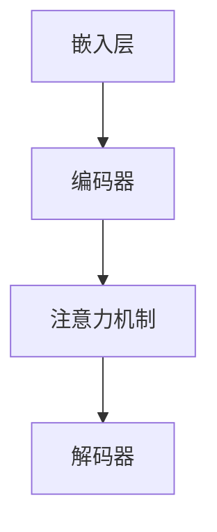
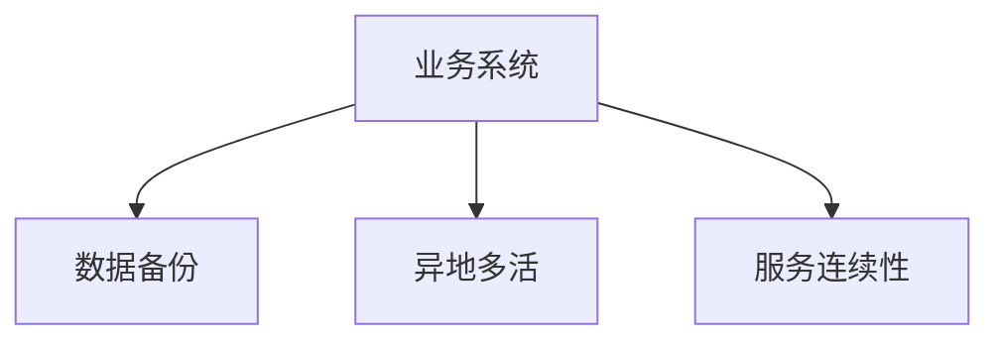

                 

## 文章标题

### 关键词
- 可靠性
- LLM应用
- 灾备方案
- 数据备份
- 异地多活
- 服务连续性

### 摘要

本文旨在深入探讨构建可靠的大型语言模型（LLM）应用灾备方案的重要性和方法。随着LLM技术在各行业应用的日益普及，确保其在面对突发灾难时的稳定性和持续性变得至关重要。文章首先介绍了LLM及其灾备的重要性，随后详细分析了灾备的核心概念、策略和技术，并结合实际案例，阐述了如何在实际项目中实施灾备措施。最后，对未来的发展趋势和挑战进行了展望，为读者提供了实用的灾备方案指导。

## 第1章 引言

### 1.1 LLM概述

大型语言模型（LLM）是一种能够理解和生成自然语言文本的深度学习模型。近年来，随着计算能力的提升和数据资源的丰富，LLM在自然语言处理（NLP）领域取得了显著的进展。LLM的应用范围广泛，包括机器翻译、文本摘要、问答系统、语音识别等。这些应用不仅提高了生产效率，还为各行各业带来了创新和变革。

### 1.2 灾备的重要性

在数字化时代，灾难可能会以多种形式出现，如硬件故障、网络中断、数据泄露等。对于依赖LLM技术的企业而言，灾难可能导致服务中断、数据丢失和业务损失。因此，构建可靠的LLM应用灾备方案，确保在灾难发生时能够迅速恢复，是保障业务连续性和客户信任的关键。

### 1.3 本书结构

本书将分为以下几个部分：

1. 引言：概述LLM和灾备的重要性。
2. LLM基本概念：介绍LLM的架构和原理。
3. 灾备概念与原则：阐述灾备的核心概念和原则。
4. LLM应用灾备策略：分析LLM应用的灾备策略。
5. LLM应用灾备技术：探讨灾备技术的实现细节。
6. LLM应用灾备实践：通过案例介绍实际应用。
7. 未来展望与趋势：展望LLM应用灾备的发展方向。

## 第2章 LLM基本概念

### 2.1 什么是LLM

LLM（Large Language Model）是一种基于神经网络的大规模语言模型，通过深度学习技术训练而成。LLM的核心任务是理解和生成自然语言，它能够捕捉语言的复杂结构，并生成高质量的文本。LLM通常由多个层次组成，包括嵌入层、编码器和解码器等。

### 2.2 LLM的架构

LLM的架构通常包括以下组成部分：

1. **嵌入层（Embedding Layer）**：将单词或词汇映射为向量。
2. **编码器（Encoder）**：对输入文本进行处理，生成固定长度的编码表示。
3. **解码器（Decoder）**：根据编码表示生成输出文本。
4. **注意力机制（Attention Mechanism）**：使模型能够关注输入文本中的关键信息。

### 2.3 LLM的优势与挑战

LLM的优势包括：

1. **强大的语言理解能力**：能够处理复杂的语言结构和语境。
2. **高质量的文本生成**：能够生成流畅、准确的文本。

然而，LLM也面临以下挑战：

1. **计算资源需求**：训练和部署LLM需要大量的计算资源和数据。
2. **数据隐私问题**：模型可能泄露敏感信息。
3. **伦理和道德问题**：模型可能会产生偏见或不恰当的输出。

### 2.4 Mermaid流程图——LLM架构简述

以下是一个简单的Mermaid流程图，展示了LLM的基本架构：

## 第3章 灾备概念与原则

### 3.1 灾备的定义

灾备（Disaster Recovery）是指在灾难发生后，通过一系列措施确保业务能够迅速恢复到正常运行状态。灾备包括硬件、软件、数据、网络等方面的冗余和备份，以便在灾难发生时能够快速切换到备用系统。

### 3.2 灾备策略

灾备策略主要包括以下几种：

1. **数据备份**：定期备份关键数据，确保在灾难发生时能够恢复。
2. **异地多活**：在不同的地理位置部署多个活的应用，确保在本地发生灾难时，其他地区仍能提供服务。
3. **服务连续性**：通过自动化流程和冗余系统，确保在灾难发生时，服务能够无缝切换。

### 3.3 灾备的关键原则

灾备的关键原则包括：

1. **及时性**：确保在灾难发生后，系统能够迅速恢复。
2. **可靠性**：确保备份和冗余系统能够正常运行。
3. **成本效益**：在确保可靠性的前提下，尽可能降低成本。

### 3.4 Mermaid流程图——灾备架构简述

以下是一个简单的Mermaid流程图，展示了灾备的基本架构：

## 第4章 LLM应用灾备策略

### 4.1 数据备份与恢复

数据备份是LLM应用灾备的基础。常见的备份策略包括：

1. **全备份**：定期对整个系统进行备份。
2. **增量备份**：仅备份最近一次全备份后发生变化的数据。
3. **差异备份**：备份最近一次全备份和最近一次增量备份之间的差异。

在灾难发生时，需要快速恢复数据。恢复过程包括：

1. **选择合适的备份介质**：如硬盘、光盘、云存储等。
2. **数据验证**：确保备份的数据完整性和准确性。
3. **恢复操作**：将备份的数据恢复到系统中。

### 4.2 异地多活部署

异地多活部署是指在不同地理位置部署多个活的应用。这种部署方式可以在本地发生灾难时，其他地区仍能提供服务。

异地多活部署的关键技术包括：

1. **数据同步**：确保不同地区的应用具有相同的数据。
2. **负载均衡**：合理分配不同地区的负载。
3. **网络冗余**：确保网络连接的可靠性。

### 4.3 服务连续性保障

服务连续性保障是指确保在灾难发生时，服务能够无缝切换。常见的技术包括：

1. **自动化流程**：通过自动化脚本和工具，实现快速切换。
2. **冗余系统**：部署多个冗余系统，确保在其中一个系统发生故障时，其他系统能够接管。
3. **应急响应计划**：制定详细的应急响应计划，确保在灾难发生时，团队能够迅速行动。

### 4.4 灾备演练与测试

灾备演练与测试是确保灾备方案有效性的重要手段。演练与测试包括：

1. **定期演练**：定期进行灾备演练，确保团队熟悉灾备流程。
2. **测试恢复时间**：测试在灾难发生后，系统能够恢复到正常状态所需的时间。
3. **测试数据完整性**：测试恢复的数据是否完整和准确。

## 第5章 LLM应用灾备技术

### 5.1 数据库灾备技术

数据库灾备技术主要包括以下几种：

1. **热备份**：在数据库正常运行时，直接备份数据库。
2. **冷备份**：在数据库关闭时，备份数据库。
3. **增量备份**：备份自上次备份以来发生变化的数据。
4. **全备份**：备份整个数据库。

数据库灾备的关键技术包括：

1. **数据库镜像**：实时复制数据库，确保数据的一致性。
2. **数据库集群**：通过集群部署，提高数据库的可用性和可靠性。
3. **数据库加密**：确保备份数据的安全。

### 5.2 存储灾备技术

存储灾备技术主要包括以下几种：

1. **本地存储冗余**：在本地部署多个存储设备，确保在硬件故障时，数据不会丢失。
2. **异地存储备份**：在不同地理位置部署存储设备，确保在本地发生灾难时，数据仍然可用。
3. **分布式存储**：通过分布式存储技术，提高数据的可靠性和可用性。

存储灾备的关键技术包括：

1. **数据复制**：实时复制数据到异地存储。
2. **数据压缩**：降低存储空间需求。
3. **存储加密**：确保备份数据的安全。

### 5.3 网络灾备技术

网络灾备技术主要包括以下几种：

1. **多路径网络**：通过多条网络路径，提高网络的可靠性。
2. **网络冗余**：在关键网络设备上部署冗余设备，确保在设备故障时，网络仍然可用。
3. **网络监控**：实时监控网络状态，及时发现网络故障。

网络灾备的关键技术包括：

1. **负载均衡**：合理分配网络负载，提高网络性能。
2. **网络分段**：将网络划分为多个部分，确保在部分网络故障时，其他部分仍然可用。
3. **网络加密**：确保数据在网络传输过程中的安全性。

### 5.4 服务器与硬件灾备技术

服务器与硬件灾备技术主要包括以下几种：

1. **硬件冗余**：在关键硬件上部署冗余设备，确保在设备故障时，硬件仍然可用。
2. **服务器集群**：通过服务器集群部署，提高服务器的可用性和可靠性。
3. **电源冗余**：部署备用电源，确保在电源故障时，服务器仍然可用。

服务器与硬件灾备的关键技术包括：

1. **硬件监控**：实时监控硬件状态，及时发现硬件故障。
2. **自动切换**：在硬件故障时，自动切换到备用硬件。
3. **硬件备份**：定期备份关键硬件配置和数据。

## 第6章 LLM应用灾备实践

### 6.1 灾备项目案例介绍

在本节中，我们将介绍一个实际的LLM灾备项目案例。该项目是一个在线问答系统，面向全球用户提供服务。系统每天处理数百万次问答请求，对服务的可靠性要求极高。

### 6.2 灾备项目实施步骤

灾备项目的实施步骤如下：

1. **需求分析**：确定灾备的需求和目标。
2. **方案设计**：设计符合需求的灾备方案。
3. **环境搭建**：搭建灾备环境，包括数据库、存储、网络、服务器等。
4. **数据备份**：实施数据备份策略，确保数据的安全。
5. **系统部署**：将灾备系统部署到不同的地理位置。
6. **测试与验证**：对灾备系统进行测试和验证，确保其在灾难发生时能够正常运行。
7. **培训与演练**：对团队成员进行培训，定期进行灾备演练。

### 6.3 灾备项目挑战与解决方案

灾备项目面临的挑战主要包括：

1. **数据同步**：确保不同地理位置的数据一致性。
2. **网络延迟**：处理异地多活部署中的网络延迟问题。
3. **硬件故障**：应对硬件故障，确保系统的高可用性。

解决方案如下：

1. **数据同步**：采用分布式数据库，实现数据的实时同步。
2. **网络延迟**：通过优化网络架构和负载均衡，降低网络延迟。
3. **硬件故障**：采用硬件冗余和自动切换技术，确保系统的高可用性。

### 6.4 灾备项目效果评估

灾备项目效果评估包括以下几个方面：

1. **恢复时间**：评估在灾难发生后，系统恢复到正常运行所需的时间。
2. **数据完整性**：评估恢复的数据是否完整和准确。
3. **成本效益**：评估灾备项目的成本和效益。

通过实际案例，我们发现灾备项目的实施大大提高了系统的可靠性，确保了在灾难发生时，系统能够快速恢复，数据不会丢失。

### 6.5 项目小结

通过本案例，我们可以得出以下结论：

1. **灾备的重要性**：灾备是确保LLM应用稳定运行的关键。
2. **实施细节**：灾备的实施需要细致的设计和周密的计划。
3. **持续改进**：灾备方案需要不断优化和更新，以应对新的挑战。

## 第7章 未来展望与趋势

### 7.1 LLM应用灾备的发展趋势

随着LLM技术的不断进步，LLM应用灾备也将面临新的发展机遇和挑战。未来，LLM应用灾备的发展趋势包括：

1. **自动化与智能化**：灾备流程将更加自动化和智能化，减少人工干预。
2. **云原生灾备**：云原生技术将在灾备领域得到广泛应用。
3. **边缘计算与灾备**：边缘计算将提高灾备的响应速度和灵活性。

### 7.2 灾备技术在LLM应用中的创新

未来，灾备技术在LLM应用中的创新可能包括：

1. **分布式存储与计算**：通过分布式存储与计算技术，提高灾备系统的性能和可靠性。
2. **区块链与灾备**：利用区块链技术，确保灾备数据的安全和不可篡改。
3. **AI与灾备**：通过人工智能技术，优化灾备策略和流程。

### 7.3 LLM应用灾备的未来挑战

LLM应用灾备在未来将面临以下挑战：

1. **数据隐私与安全**：如何在保障数据隐私和安全的前提下，实现有效的灾备。
2. **高可用性与成本**：如何在确保高可用性的同时，降低灾备的成本。
3. **全球部署与一致性**：如何在全球范围内实现数据的一致性和服务的可用性。

### 7.4 结束语

尽管LLM应用灾备面临诸多挑战，但通过持续的创新和实践，我们相信未来LLM应用灾备将会更加可靠、高效和智能化，为各行业的数字化转型提供强有力的支持。

## 作者信息

作者：AI天才研究院/AI Genius Institute & 禅与计算机程序设计艺术 /Zen And The Art of Computer Programming

## 注意事项

1. **数据备份策略**：数据备份是灾备的基础，需要制定合适的数据备份策略，确保备份数据的完整性和可用性。
2. **异地多活部署**：异地多活部署需要充分考虑网络延迟和数据同步问题，确保系统的稳定运行。
3. **服务连续性保障**：服务连续性保障需要综合考虑自动化流程、冗余系统和应急响应计划，确保在灾难发生时，系统能够迅速恢复。
4. **灾备演练与测试**：定期进行灾备演练和测试，确保团队熟悉灾备流程，及时发现和解决问题。

## 拓展阅读

1. 《大数据灾备技术》
2. 《云计算与灾备》
3. 《人工智能在灾备中的应用》
4. 《分布式系统设计与实践》
5. 《边缘计算：概念、架构与挑战》

通过阅读这些文献，您可以进一步了解灾备技术的最新进展和应用实践。希望本文能为您在构建可靠LLM应用灾备方案的过程中提供有益的参考和指导。祝您在灾备领域取得圆满的成功！

