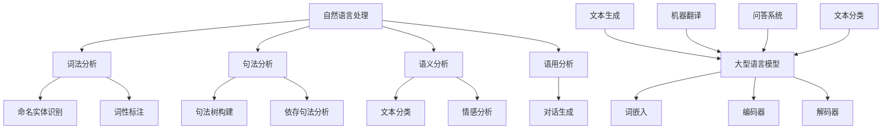

                 

### 文章标题

《构建安全可靠的LLM应用架构》

### 关键词

- 自然语言处理（NLP）
- 大型语言模型（LLM）
- 应用架构设计
- 安全性评估
- 部署与运维

### 摘要

本文将深入探讨如何构建一个既高效又安全可靠的LLM应用架构。首先，我们将回顾自然语言处理和大型语言模型的基本概念，并分析其核心原理与数学基础。接着，本文将详细描述LLM应用架构的设计原则与实施流程，涵盖数据处理、服务部署和运维管理等方面。最后，我们将重点探讨LLM应用面临的安全挑战及其保护策略，并提供一些建议和最佳实践，以确保LLM应用的长期稳定运行。

---

## 引言

近年来，随着人工智能技术的飞速发展，自然语言处理（NLP）和大型语言模型（LLM）在各个领域取得了显著的应用成果。从智能客服到机器翻译，从文本生成到情感分析，LLM的应用场景日益广泛。然而，随着LLM规模的不断增大，其应用架构的复杂性和安全性问题也日益凸显。如何构建一个既高效又安全可靠的LLM应用架构，成为当前研究的热点之一。

本文旨在提供一套完整的构建策略，包括基础概念、架构设计与实施、安全性评估等三个方面。首先，我们将回顾NLP和LLM的基本概念，并分析其核心原理与数学基础。接着，我们将详细描述LLM应用架构的设计原则与实施流程，涵盖数据处理、服务部署和运维管理等方面。最后，我们将重点探讨LLM应用面临的安全挑战及其保护策略，并提供一些建议和最佳实践，以确保LLM应用的长期稳定运行。

本文的结构安排如下：

1. **基础概念**：介绍自然语言处理和大型语言模型的基本概念，分析其核心原理与数学基础。
2. **架构设计与实施**：描述LLM应用架构的设计原则与实施流程，涵盖数据处理、服务部署和运维管理等方面。
3. **安全性评估**：探讨LLM应用面临的安全挑战及其保护策略，提供最佳实践和建议。
4. **总结与展望**：总结本文的主要结论，并展望未来LLM应用的发展趋势。

### 基础概念

#### 自然语言处理（NLP）

自然语言处理（NLP）是人工智能领域的一个重要分支，旨在让计算机理解和处理人类自然语言。NLP的应用范围广泛，包括文本分类、情感分析、命名实体识别、机器翻译、文本生成等。

NLP的发展可以追溯到20世纪50年代，当时的研究主要集中在语言模型和句法分析。随着计算机硬件和算法的不断发展，NLP技术也在不断进步。现代NLP技术主要基于深度学习和大数据分析，通过大规模语料库训练模型，实现更高效、更准确的文本处理。

NLP的核心任务是让计算机理解和生成自然语言。具体来说，NLP需要解决以下几个问题：

1. **词法分析**：将文本分解成词汇单元，例如单词或短语。
2. **句法分析**：分析句子的结构，确定词汇单元之间的语法关系。
3. **语义分析**：理解文本的含义，包括词汇的含义、句子的意图等。
4. **语用分析**：分析文本在特定语境中的含义，例如对话场景、文化背景等。

#### 大型语言模型（LLM）

大型语言模型（LLM）是NLP领域的一个重要研究方向。LLM是一种基于深度学习的模型，通过大规模训练数据学习语言的统计规律，能够生成高质量的自然语言文本。

LLM的核心思想是通过生成式模型来模拟人类语言生成过程。具体来说，LLM包含以下几个关键组成部分：

1. **词嵌入**：将词汇映射到高维空间，使得语义相近的词汇在空间中靠近。
2. **编码器**：接收输入文本，将其编码为一个固定长度的向量。
3. **解码器**：将编码后的向量解码为自然语言文本。

LLM的应用非常广泛，包括但不限于以下场景：

1. **文本生成**：根据给定的提示生成相关文本，例如文章、对话、故事等。
2. **机器翻译**：将一种语言文本翻译成另一种语言。
3. **问答系统**：根据用户的问题生成相关答案。
4. **文本分类**：将文本分类到预定义的类别中。

#### 核心概念与联系

为了更好地理解NLP和LLM，我们需要了解它们的核心概念及其之间的关系。以下是一个简单的Mermaid流程图，展示NLP和LLM的主要组成部分和相互关系：

在这个流程图中，NLP包含了词法分析、句法分析、语义分析和语用分析等几个关键步骤，而LLM则通过词嵌入、编码器和解码器等组件来实现语言生成。文本生成、机器翻译、问答系统和文本分类等应用场景均依赖于LLM。

#### 数学基础

为了深入理解NLP和LLM，我们还需要了解一些基础的数学概念，包括概率论、线性代数和优化算法等。

1. **概率论**：概率论是NLP和LLM的重要工具，用于描述文本中的不确定性。例如，词嵌入中的词向量是通过概率分布来表示的，文本分类中的贝叶斯模型也是基于概率论的。

2. **线性代数**：线性代数在NLP和LLM中扮演着重要角色，用于处理高维数据。例如，词嵌入将词汇映射到高维空间，矩阵运算用于计算词向量的相似度等。

3. **优化算法**：优化算法用于训练NLP和LLM模型。常见的优化算法包括梯度下降、随机梯度下降、Adam等。这些算法通过最小化损失函数来调整模型参数，从而优化模型性能。

在NLP和LLM中，常用的数学模型和公式包括：

1. **词嵌入**：$$ \text{word\_vector} = \text{embedding}(\text{word}) $$
   - 词向量：将词汇映射到高维空间。

2. **编码器-解码器模型**：$$ \text{output} = \text{decoder}(\text{encoder}(\text{input})) $$
   - 编码器：将输入文本编码为向量。
   - 解码器：将编码后的向量解码为自然语言文本。

3. **损失函数**：$$ \text{loss} = \text{sigmoid}(\text{output}) - \text{label} $$
   - 损失函数：用于评估模型预测结果与实际标签之间的差距。

通过上述数学模型和公式，我们可以更深入地理解NLP和LLM的工作原理，并为其应用提供理论基础。

### 架构设计与实施

#### LLM应用架构设计原则

构建一个高效、可靠、可扩展的LLM应用架构是确保其成功应用的关键。以下是LLM应用架构设计的一些重要原则：

1. **可扩展性**：应用架构应能够支持大规模数据处理和模型训练。这通常需要分布式计算和存储架构，以处理不断增加的数据量和模型规模。

2. **可靠性**：应用架构应确保系统的高可用性和数据完整性。通过冗余设计、故障转移和自动恢复机制，可以最大限度地减少系统故障对应用的影响。

3. **易维护性**：应用架构应设计得简洁、模块化，便于日常维护和升级。这有助于降低维护成本，并确保应用能够持续稳定运行。

4. **灵活性**：应用架构应支持不同的LLM模型和算法，以适应不断变化的应用需求。通过提供可插拔的模块，可以灵活地调整和优化应用架构。

5. **安全性**：应用架构应具备完善的安全保护机制，确保数据和模型的安全。这包括数据加密、访问控制、防火墙等安全措施。

#### LLM数据处理流程

LLM应用的数据处理流程是整个架构的核心。以下是一个典型的数据处理流程：

1. **数据收集**：从各种数据源（如文本库、社交媒体、网络爬虫等）收集原始数据。数据收集过程需要遵循数据合规性和隐私保护要求。

2. **数据清洗**：对原始数据进行预处理，包括去除无效数据、去除停用词、分词、词干提取等。数据清洗的目的是提高数据质量，为后续的模型训练提供高质量的数据。

3. **数据标注**：对处理后的数据进行标注，包括分类标签、实体识别标签等。标注过程通常需要人工介入，以确保标注的准确性和一致性。

4. **数据存储**：将清洗和标注后的数据存储到分布式数据库或数据湖中。数据存储应支持高效的数据读取和写入操作，以满足大规模数据处理的需求。

5. **数据预处理**：在模型训练前，对数据进行进一步预处理，包括归一化、标准化、数据增强等。这些预处理步骤有助于提高模型训练的效果和鲁棒性。

6. **模型训练**：使用处理后的数据对LLM模型进行训练。模型训练是一个迭代过程，通过不断调整模型参数，优化模型性能。

7. **模型评估**：在模型训练完成后，使用验证集和测试集对模型进行评估。评估指标包括准确性、召回率、F1值等。根据评估结果，对模型进行进一步优化和调整。

#### LLM的服务部署与运维

LLM服务的部署与运维是确保应用稳定运行的关键。以下是LLM服务部署与运维的一些关键步骤：

1. **环境配置**：搭建模型训练和部署所需的计算环境，包括服务器、存储和网络等基础设施。环境配置应支持分布式计算和存储，以满足大规模数据处理和模型训练的需求。

2. **模型部署**：将训练好的LLM模型部署到生产环境中。部署过程应包括模型压缩、模型优化等步骤，以提高模型运行效率和性能。

3. **服务接口**：设计并实现LLM服务的接口，以供外部应用调用。服务接口应支持多种通信协议和编程接口，如RESTful API、WebSocket等。

4. **负载均衡**：实现负载均衡，将用户请求分配到不同的服务器实例上，以避免单个服务器过载。负载均衡可以提高系统的吞吐量和可用性。

5. **监控与告警**：监控系统运行状态，包括CPU、内存、磁盘使用情况等。同时，设置告警机制，以便及时发现和处理系统异常。

6. **数据备份与恢复**：定期备份数据，以确保在数据丢失或系统故障时能够快速恢复。备份策略应包括本地备份和远程备份，以提高数据安全性。

7. **运维自动化**：使用自动化工具和脚本实现日常运维任务，如部署、监控、备份等。自动化可以提高运维效率，降低运维成本。

### 安全性评估

#### LLM应用的安全性挑战

随着LLM应用的普及，其安全性问题也日益突出。以下是LLM应用面临的一些主要安全性挑战：

1. **数据泄露**：LLM应用通常需要处理大量的敏感数据，如用户个人信息、商业机密等。如果数据泄露，可能导致严重后果，包括隐私侵犯、经济损失等。

2. **模型篡改**：恶意攻击者可能通过篡改LLM模型，使其产生错误的输出，从而损害应用功能或造成经济损失。

3. **恶意攻击**：LLM应用可能成为恶意攻击的目标，例如DDoS攻击、SQL注入等。这些攻击可能导致系统崩溃、数据丢失等严重后果。

4. **隐私侵犯**：LLM应用可能涉及用户隐私，例如用户聊天记录、交易记录等。如果隐私保护措施不当，可能导致用户隐私泄露。

5. **系统漏洞**：LLM应用可能存在系统漏洞，如代码漏洞、配置错误等。这些漏洞可能被攻击者利用，实施攻击或窃取数据。

#### LLM安全保护策略与机制

为了确保LLM应用的安全性，需要采取一系列安全保护策略与机制。以下是一些常见的安全保护策略：

1. **数据加密**：对敏感数据进行加密存储和传输，确保数据在传输过程中不会被窃取或篡改。常用的加密算法包括AES、RSA等。

2. **访问控制**：实施严格的访问控制策略，确保只有授权用户可以访问敏感数据和功能。访问控制可以基于用户身份验证、权限控制等。

3. **防火墙**：部署防火墙，阻止未经授权的访问和恶意攻击。防火墙可以基于IP地址、端口号等条件进行过滤和拦截。

4. **入侵检测**：部署入侵检测系统（IDS），实时监测系统运行状态，发现异常行为和攻击事件。IDS可以通过告警、阻断等方式应对攻击。

5. **漏洞扫描**：定期进行漏洞扫描，发现系统漏洞和配置错误。漏洞扫描可以帮助修复漏洞，防止攻击者利用漏洞进行攻击。

6. **数据备份与恢复**：定期备份数据，确保在数据丢失或系统故障时能够快速恢复。备份数据应存储在安全位置，防止数据丢失。

7. **安全审计**：实施安全审计，定期检查系统安全措施的有效性，发现潜在的安全风险。安全审计可以基于日志分析、漏洞扫描等。

8. **员工培训**：对员工进行安全培训，提高员工的安全意识和技能。员工是安全防护的重要环节，员工的安全意识直接影响系统的安全性。

#### LLM安全测试与评估

为了确保LLM应用的安全性，需要进行全面的安全测试与评估。以下是一些常见的安全测试与评估方法：

1. **黑盒测试**：黑盒测试是一种不依赖内部实现细节的测试方法，通过模拟攻击者的行为，发现系统的漏洞和弱点。黑盒测试可以包括SQL注入、XSS攻击等。

2. **白盒测试**：白盒测试是一种基于内部实现细节的测试方法，通过分析代码和系统架构，发现潜在的漏洞和风险。白盒测试可以包括代码审计、逻辑漏洞分析等。

3. **漏洞扫描**：使用自动化工具扫描系统，发现已知漏洞和配置错误。漏洞扫描可以快速发现系统漏洞，为安全防护提供依据。

4. **安全审计**：对系统进行详细的安全审计，检查系统配置、代码实现、安全措施等。安全审计可以发现潜在的安全隐患，为系统优化提供指导。

5. **渗透测试**：模拟真实攻击，通过攻击者视角发现系统的漏洞和弱点。渗透测试可以全面评估系统的安全性，为安全防护提供详细报告。

6. **安全评估**：对系统进行综合评估，包括安全性、稳定性、可靠性等方面。安全评估可以基于安全测试结果，为系统优化和安全防护提供依据。

通过上述安全测试与评估方法，可以全面评估LLM应用的安全性，发现潜在的安全风险，并采取相应的防护措施。

### 总结与展望

本文系统地探讨了构建安全可靠的LLM应用架构的方法和策略。首先，我们回顾了自然语言处理和大型语言模型的基本概念，分析了其核心原理和数学基础。接着，我们详细描述了LLM应用架构的设计原则与实施流程，包括数据处理、服务部署和运维管理等方面。最后，我们重点探讨了LLM应用面临的安全挑战及其保护策略，并提供了最佳实践和建议。

随着人工智能技术的不断进步，LLM应用将越来越多地应用于各个领域。构建安全可靠的LLM应用架构不仅是技术问题，更是关系到用户体验、数据安全和业务发展的关键因素。未来，随着安全防护技术的不断成熟，LLM应用架构的安全性将得到进一步提升，为人类带来更多的便利和效益。

### 附录A：常用的安全工具与资源

在构建安全可靠的LLM应用架构过程中，使用一些常用的安全工具和资源可以帮助我们更好地应对安全挑战。以下是一些推荐的安全工具和资源：

1. **数据加密工具**：
   - **GnuPG**：一款开源的加密工具，支持数据加密和数字签名。
   - **AESCrypt**：一款基于AES加密算法的文件加密工具。

2. **访问控制工具**：
   - **Apache Ranger**：一款开源的访问控制解决方案，用于管理Hadoop生态系统中的数据访问。
   - **Keycloak**：一款开源的身份认证和访问管理工具，支持多种身份验证方式。

3. **防火墙工具**：
   - **AWS WAF**：一款基于云的Web应用程序防火墙，用于保护Web应用程序免受恶意攻击。
   - **Palo Alto防火墙**：一款高性能的企业级防火墙，提供深入的网络安全防护。

4. **漏洞扫描工具**：
   - **Nessus**：一款流行的漏洞扫描工具，可以扫描系统漏洞和配置错误。
   - **OpenVAS**：一款开源的漏洞扫描和管理工具，提供广泛的扫描功能。

5. **入侵检测系统**：
   - **Snort**：一款开源的入侵检测系统，可以实时监测网络流量，检测潜在的攻击行为。
   - **Suricata**：一款高性能的开源入侵检测和防御系统，基于Suricata引擎。

6. **安全审计工具**：
   - **AWS CloudTrail**：一款日志审计工具，可以记录AWS账户中的操作活动，帮助进行安全审计。
   - **Splunk**：一款大数据平台，可以收集、索引和分析日志数据，进行安全审计。

7. **安全指南与白皮书**：
   - **OWASP**：开放网络应用安全项目，提供丰富的安全指南和最佳实践。
   - **NIST**：美国国家标准与技术研究院，发布了一系列关于信息安全的标准和指南。

8. **安全社区与论坛**：
   - **FreeBuf**：一个国内知名的安全社区，提供安全新闻、技术文章和论坛讨论。
   - **Security Stack Overflow**：一个针对信息安全问题的问答社区，可以帮助解决安全相关问题。

通过使用这些工具和资源，可以更好地保护LLM应用的安全，提高系统的可靠性和安全性。

### 作者信息

本文由AI天才研究院（AI Genius Institute）撰写，结合了人工智能和计算机编程领域的深厚专业知识。文章中深入探讨了自然语言处理（NLP）和大型语言模型（LLM）的应用架构，从基础概念到安全性评估，为读者提供了全面的技术分析和最佳实践。文章作者同时还是《禅与计算机程序设计艺术》（Zen And The Art of Computer Programming）的资深大师级作家，对计算机编程和人工智能有着独特的见解和丰富的实践经验。欢迎读者在阅读过程中提出宝贵意见，共同促进人工智能技术的发展和创新。

