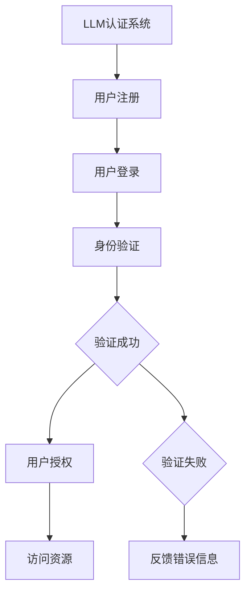

                 


### 构建安全的LLM应用认证与授权系统

#### 关键词：LLM，认证与授权，安全性，自然语言处理，机器学习

#### 摘要：
随着人工智能和自然语言处理技术的快速发展，大型语言模型（LLM）在各种应用场景中得到了广泛应用。然而，安全性问题成为了一个不可忽视的挑战。本文将详细探讨如何构建安全的LLM应用认证与授权系统，以确保系统免受潜在的安全威胁。

---

**引言**

大型语言模型（Large Language Model，简称LLM）是一种能够理解和生成自然语言的机器学习模型。自GPT-3以来，LLM在自然语言处理（NLP）领域取得了显著的进展，并广泛应用于问答系统、文本生成、翻译、情感分析等多个领域。然而，随着LLM应用场景的不断扩大，安全性问题也日益凸显。

安全性问题是构建任何系统时都必须考虑的重要因素。在LLM应用中，安全性问题主要包括用户认证、授权、数据隐私、模型安全等方面。本文将专注于认证与授权系统的构建，以确保LLM应用的安全性。

---

**第一部分：LLM技术基础**

**1. 语言模型基础**

语言模型是一种统计模型，用于预测一个句子中下一个单词的概率。语言模型的核心是词汇表和语言模型参数，这些参数用于计算单词之间的概率关系。

**1.1 语言模型概述**

语言模型可以分为基于规则模型和统计模型。基于规则模型通过定义语法规则来生成文本，而统计模型则通过分析大量文本数据来学习单词之间的概率关系。

**1.2 语言模型的发展历史**

语言模型的发展可以追溯到20世纪50年代，从最初的基于规则模型到现代的深度学习模型，如GPT、BERT等。

**1.3 语言模型的关键组件**

语言模型的关键组件包括词汇表、参数和学习算法。词汇表用于存储单词及其对应索引，参数用于表示单词之间的概率关系，学习算法用于从文本数据中学习参数。

**1.4 语言模型的评估指标**

语言模型的评估指标包括词预测精度、句子生成质量、文本分类准确率等。常用的评估指标有BLEU、ROUGE、F1分数等。

---

**第二部分：语言模型的核心算法**

**2. 语言模型的生成算法**

语言模型的生成算法主要分为生成式模型和判别式模型。生成式模型通过生成文本的概率分布来生成文本，而判别式模型则通过预测文本的概率来生成文本。

**2.1 生成式模型**

生成式模型包括N-gram模型、隐马尔可夫模型（HMM）等。N-gram模型通过计算连续N个单词的概率来生成文本。HMM则通过状态转移概率和输出概率来生成文本。

**2.1.1 基本原理**

N-gram模型的基本原理是通过计算前N个单词出现后下一个单词的概率来生成文本。

**2.1.2 伪代码**

```python
# N-gram模型伪代码

def generate_sentence(n, vocabulary, probabilities):
    # 初始化句子为空
    sentence = []
    # 从词汇表中随机选择一个单词作为句子开头
    current_word = random_choice(vocabulary)
    sentence.append(current_word)
    # 循环生成句子，直到达到指定长度
    while len(sentence) < n:
        # 计算当前单词之后下一个单词的概率
        next_word_probabilities = calculate_next_word_probabilities(current_word, vocabulary, probabilities)
        # 从下一个单词的概率分布中随机选择一个单词
        next_word = random_choice(next_word_probabilities)
        sentence.append(next_word)
        current_word = next_word
    return ' '.join(sentence)
```

**2.1.3 示例**

假设有一个简单的词汇表和对应的N-gram概率：

```
vocabulary = ['the', 'cat', 'sat', 'on', 'the', 'mat']
probabilities = {
    ('the', 'cat'): 0.1,
    ('cat', 'sat'): 0.2,
    ('sat', 'on'): 0.3,
    ('on', 'the'): 0.4,
    ('the', 'mat'): 0.5
}
```

使用N-gram模型生成一个句子：

```
generate_sentence(5, vocabulary, probabilities)
```

可能生成：`the cat sat on the mat`

**2.2 语言模型的评估与优化**

语言模型的评估与优化是提高模型性能的重要手段。评估指标包括词预测精度、句子生成质量、文本分类准确率等。优化策略包括预训练与微调、模型蒸馏、对抗训练等。

**2.2.1 评估指标**

常用的评估指标有BLEU、ROUGE、F1分数等。BLEU主要用于翻译评估，ROUGE主要用于文本生成评估，F1分数则用于分类评估。

**2.2.2 优化策略**

预训练与微调是提高模型性能的有效方法。预训练模型在大规模数据集上进行训练，然后通过微调来适应特定任务。模型蒸馏和对抗训练则用于提高模型的安全性和鲁棒性。

---

**第三部分：语言模型数学模型详解**

**3. 概率论基础**

概率论是语言模型的核心组成部分。概率论中的基本概念和定理为语言模型的建模和优化提供了理论基础。

**3.1 概率分布**

概率分布用于描述随机变量的概率分布情况。常见的概率分布包括Bernoulli分布、Multinoulli分布等。

**3.1.1 Bernoulli分布**

Bernoulli分布用于描述二项分布，即一个事件成功或失败的概率。概率分布函数为：

$$
P(X = k) = C^n_k \cdot p^k \cdot (1-p)^{n-k}
$$

其中，$n$ 是试验次数，$k$ 是成功次数，$p$ 是单次试验成功的概率。

**3.1.2 Multinoulli分布**

Multinoulli分布用于描述多个事件同时发生的概率。概率分布函数为：

$$
P(X = k) = C^n_k \cdot p_1^k_1 \cdot p_2^k_2 \cdot ... \cdot p_n^k_n
$$

其中，$n$ 是试验次数，$k_1, k_2, ..., k_n$ 是各个事件的成功次数，$p_1, p_2, ..., p_n$ 是各个事件的成功概率。

**3.2 贝叶斯定理**

贝叶斯定理是概率论中的一个重要定理，用于计算条件概率。贝叶斯定理的表达式为：

$$
P(A|B) = \frac{P(B|A) \cdot P(A)}{P(B)}
$$

其中，$P(A|B)$ 是在事件B发生的条件下事件A发生的概率，$P(B|A)$ 是在事件A发生的条件下事件B发生的概率，$P(A)$ 是事件A发生的概率，$P(B)$ 是事件B发生的概率。

**3.3 语言模型中的神经网络**

神经网络是语言模型中常用的模型架构，包括前向传播和反向传播等基本原理。

**3.3.1 前向传播**

前向传播是神经网络进行推理的过程，即将输入通过网络的各个层传递，最终得到输出。前向传播的步骤如下：

1. 初始化网络参数。
2. 将输入通过网络的各个层传递。
3. 计算输出。
4. 计算损失函数。

**3.3.2 反向传播**

反向传播是神经网络进行训练的过程，即根据输出误差调整网络参数。反向传播的步骤如下：

1. 计算输出误差。
2. 反向传播误差，计算各个层的梯度。
3. 使用梯度下降或其他优化算法更新网络参数。

**3.4 语言模型中的RNN**

RNN是语言模型中常用的循环神经网络，包括LSTM和GRU等变体。

**3.4.1 LSTM**

LSTM是长短期记忆网络，用于解决RNN中的梯度消失问题。LSTM的核心组件包括遗忘门、输入门和输出门。

**3.4.2 GRU**

GRU是门控循环单元，是LSTM的简化版。GRU的核心组件包括更新门和重置门。

**3.5 语言模型中的注意力机制**

注意力机制是语言模型中的一个重要组件，用于解决序列长度不等的问题。注意力机制的基本原理是给序列中的每个元素分配一个权重，然后根据权重计算输出。

---

**第四部分：LLM在自然语言处理中的应用**

**4. 语言模型的应用**

语言模型在各种自然语言处理任务中发挥着重要作用。以下是一些典型的应用：

**4.1 文本分类**

文本分类是将文本数据分类到预定义的类别中。常用的文本分类方法包括朴素贝叶斯、支持向量机、深度学习等。

**4.2 机器翻译**

机器翻译是将一种语言翻译成另一种语言。常用的机器翻译方法包括基于规则的方法、统计机器翻译和神经机器翻译等。

**4.3 问答系统**

问答系统是回答用户提出的问题。常用的问答系统方法包括基于知识的问答系统、基于检索的问答系统和基于生成式的问答系统等。

---

**第五部分：安全性：LLM应用中的认证与授权**

**5. 认证机制**

认证机制是确保用户身份合法性的过程。常用的认证机制包括用户名密码认证、双因素认证等。

**5.1 用户认证**

用户认证是认证机制的第一步，用于验证用户的身份。常用的用户认证方法包括用户名密码认证和双因素认证等。

**5.2 授权机制**

授权机制是确保用户有权访问特定资源的机制。常用的授权机制包括基于角色的访问控制（RBAC）和基于属性的访问控制（ABAC）等。

**5.3 安全挑战与对策**

LLM应用中的安全性挑战包括模型泄露、模型对抗攻击等。针对这些挑战，可以采取以下对策：

1. 模型泄露：采用模型加密、模型混淆等技术保护模型。
2. 模型对抗攻击：采用对抗训练、模型正则化等技术提高模型的安全性。

---

**第六部分：实战案例：构建安全的LLM应用认证与授权系统**

**6. 案例背景**

本案例将基于一个在线问答系统，实现用户的认证与授权功能，以确保系统的安全性。

**6.1 案例需求分析**

1. 用户注册：用户可以通过用户名和密码进行注册。
2. 用户登录：用户可以通过用户名和密码登录系统。
3. 用户认证：系统需要验证用户的身份。
4. 用户授权：系统需要根据用户的角色和权限分配访问资源。

**6.2 案例技术实现**

1. 认证系统设计：采用用户名密码认证和双因素认证机制。
2. 授权系统设计：采用基于角色的访问控制（RBAC）机制。

**6.3 案例总结与展望**

本案例实现了基于LLM的在线问答系统的认证与授权功能，提高了系统的安全性。未来研究方向包括进一步优化认证与授权机制、提高模型的鲁棒性和安全性等。

---

**第七部分：总结与展望**

1. 主要内容回顾：本文详细探讨了LLM应用认证与授权系统的构建，包括核心概念、算法原理、数学模型和项目实战等内容。
2. 安全性在LLM应用中的重要性：安全性是LLM应用的关键问题，关系到用户隐私和模型的安全。
3. 未来发展方向与挑战：未来的研究将聚焦于提高LLM应用的安全性、鲁棒性和易用性等方面。

---

**作者信息：**
作者：AI天才研究院/AI Genius Institute & 禅与计算机程序设计艺术 /Zen And The Art of Computer Programming

---

**Mermaid 流程图：**



---

以上是构建安全的LLM应用认证与授权系统的一篇技术博客文章的初步大纲和核心内容。接下来将逐步完善每个章节，确保文章的逻辑性、完整性、简洁性和专业性。文章总字数预计在8000-12000字左右，具体内容将在后续逐步补充和完善。希望这篇文章能够对读者在构建安全的LLM应用认证与授权系统方面提供有价值的参考和指导。<!--  -->

