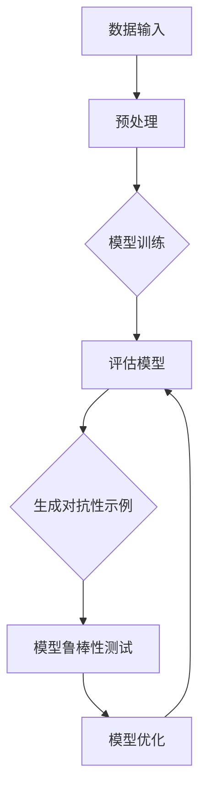

                 

### 1. 引言

#### 1.1 研究背景

在过去的几十年中，机器学习（Machine Learning, ML）和深度学习（Deep Learning, DL）取得了惊人的进展，并在许多领域，如计算机视觉（Computer Vision, CV）、自然语言处理（Natural Language Processing, NLP）、推荐系统（Recommender Systems）、医疗诊断和自动驾驶等，实现了广泛的应用。随着这些技术的普及，模型鲁棒性（Model Robustness）成为了一个关键的研究方向。模型鲁棒性指的是在面临异常输入或攻击时，模型能够保持其性能和准确性的能力。

然而，传统的机器学习模型在面临对抗性攻击（Adversarial Attack）时显得非常脆弱。对抗性攻击是一种在输入上添加细微的、人为设计的扰动，以诱使模型产生错误预测的技术。这些扰动通常是人眼无法察觉的，但对模型的影响可能是毁灭性的。因此，构建对抗性示例（Adversarial Examples）来提高模型鲁棒性成为了当前研究的热点问题。

#### 1.2 鲁棒性概念

在机器学习中，鲁棒性指的是模型在面对噪声、异常值或攻击时的性能保持能力。鲁棒性对于实际应用场景至关重要，因为现实世界中的数据往往是噪声和异常值的混合体。一个鲁棒性强的模型能够更好地适应这些变化，从而提高其泛化能力（Generalization Ability）。

鲁棒性可以体现在多个层面：

1. **输入鲁棒性**：模型对于输入数据的微小变化具有不变性。
2. **输出鲁棒性**：模型对于输入数据的微小变化产生的不稳定输出具有容忍性。
3. **泛化鲁棒性**：模型在面对新的、未见过的数据时保持稳定。

提高模型鲁棒性的目标在于使模型能够更好地适应现实世界的复杂性，减少因对抗性攻击导致的错误预测，从而提高其在实际应用中的可靠性。

#### 1.3 对抗性示例的重要性

对抗性示例是提高模型鲁棒性的关键工具。通过构建和利用对抗性示例，研究者可以：

1. **评估模型鲁棒性**：对抗性示例可以帮助识别模型中存在的脆弱点，从而评估其鲁棒性。
2. **增强模型防御能力**：通过对抗性训练（Adversarial Training），模型可以学习到对抗性示例的特征，从而提高其防御能力。
3. **指导安全设计**：对抗性示例的构建和应用可以为安全设计提供指导，帮助开发出更加鲁棒和安全的系统。

总之，对抗性示例不仅是一个理论概念，更是一个实用的工具，对于推动机器学习和深度学习的安全性和可靠性具有重要意义。在接下来的章节中，我们将详细探讨对抗性示例的构建方法及其在实际中的应用。

### 2. 基础理论

#### 2.1 机器学习模型概述

机器学习模型是通过对数据进行学习，从而能够对未知数据进行预测或分类的算法集合。这些模型分为监督学习（Supervised Learning）、无监督学习（Unsupervised Learning）和强化学习（Reinforcement Learning）三类。

- **监督学习**：监督学习模型通过训练集（Training Set）中的输入和输出（即标签）来学习。例如，在图像分类任务中，模型通过学习图片及其对应的标签来识别新的图片。

- **无监督学习**：无监督学习模型无需标签，通过发现数据中的结构来学习。常见的无监督学习任务包括聚类（Clustering）和降维（Dimensionality Reduction）。

- **强化学习**：强化学习模型通过与环境的交互来学习。模型通过不断尝试不同的动作，并根据环境的反馈调整其策略，以最大化长期奖励。

在本章中，我们将主要关注监督学习模型，因为它们在构建对抗性示例时具有代表性。

#### 2.2 鲁棒性相关数学模型

为了理解模型鲁棒性，我们需要引入一些数学模型和定义。以下是几个关键的数学概念：

1. **损失函数**（Loss Function）：损失函数是衡量模型预测与真实值之间差异的函数。常见的损失函数包括均方误差（Mean Squared Error, MSE）和交叉熵损失（Cross-Entropy Loss）。

2. **梯度**（Gradient）：梯度是用于优化模型的参数。它表示损失函数相对于每个参数的偏导数，指导我们如何调整参数以减少损失。

3. **对抗性示例**（Adversarial Example）：对抗性示例是通过对原始输入进行微小扰动（通常在图像、文本或音频等数据类型中）生成的。这些扰动通常是人眼难以察觉的，但足以误导模型产生错误预测。

4. **鲁棒损失函数**（Robust Loss Function）：鲁棒损失函数旨在考虑对抗性示例的影响，它不仅仅评估模型在干净数据上的性能，还评估模型在对抗性示例上的性能。

#### 2.3 Mermaid流程图：模型鲁棒性架构

为了更好地理解模型鲁棒性的概念，我们可以使用Mermaid流程图来展示模型鲁棒性的架构。以下是一个简化的Mermaid流程图：

- **数据输入**：模型从数据集中获取输入数据。
- **预处理**：对输入数据进行清洗、标准化等预处理步骤。
- **模型训练**：使用预处理后的数据训练模型。
- **评估模型**：评估模型在干净数据上的性能。
- **生成对抗性示例**：通过对抗性攻击技术生成对抗性示例。
- **模型鲁棒性测试**：测试模型在对抗性示例上的性能。
- **模型优化**：根据鲁棒性测试的结果对模型进行调整。

通过这个流程图，我们可以看到模型鲁棒性的构建过程是如何一步步进行的。接下来，我们将深入探讨对抗性攻击的方法和对抗性示例的生成算法。

### 3. 对抗性攻击

#### 3.1 对抗性攻击概述

对抗性攻击（Adversarial Attack）是一种专门设计微小扰动来误导机器学习模型的方法。这些扰动通常是在原始输入数据上添加的，且在视觉上几乎无法察觉。然而，这些微小的变化可能会导致模型产生严重错误预测，从而削弱模型的可靠性和鲁棒性。

对抗性攻击的基本原理是利用机器学习模型的优化过程。模型在训练过程中通过最小化损失函数来调整其参数。对抗性攻击者通过找到一种方法，在保持输入数据基本不变的同时，最大限度地增加损失函数的值，从而误导模型。

对抗性攻击的重要性在于：

1. **揭示模型脆弱性**：对抗性攻击可以帮助研究者识别模型中存在的脆弱点，从而改进模型设计和训练策略。
2. **提升模型鲁棒性**：通过对抗性训练，模型可以学会抵抗对抗性攻击，从而提高其在实际应用中的可靠性。
3. **推动理论进步**：对抗性攻击的研究推动了机器学习理论的进步，促进了对抗性防御技术的发展。

#### 3.2 白盒攻击与黑盒攻击

根据攻击者的知识水平，对抗性攻击可以分为白盒攻击（White-Box Attack）和黑盒攻击（Black-Box Attack）。

1. **白盒攻击**：白盒攻击是指攻击者拥有完整的模型结构和参数信息。在这种情况下，攻击者可以直接对模型进行操作，找到对抗性示例。白盒攻击的优点是攻击者可以精确地控制攻击过程，找到最有效的对抗性示例。然而，白盒攻击的实现难度较高，因为攻击者需要访问模型的内部信息。

   - **优势**：精确控制攻击过程，找到最有效的对抗性示例。
   - **劣势**：需要访问模型的内部信息，实现难度高。

2. **黑盒攻击**：黑盒攻击是指攻击者只知道模型的输入和输出，但不知道模型的内部结构和参数。在这种情况下，攻击者需要通过其他方法找到对抗性示例。黑盒攻击的优点是攻击者不需要访问模型的内部信息，实现相对简单。然而，黑盒攻击的攻击效果可能不如白盒攻击。

   - **优势**：实现简单，不需要访问模型的内部信息。
   - **劣势**：攻击效果可能不如白盒攻击。

在接下来的内容中，我们将详细介绍如何生成对抗性示例，并讨论各种对抗性攻击算法。

#### 3.3 生成对抗性示例的算法

生成对抗性示例的方法多种多样，以下介绍几种常见的算法：

1. **FGSM（Fast Gradient Sign Method）**

   FGSM是一种简单有效的对抗性攻击算法。它通过计算模型在输入数据上的梯度，并沿着梯度的反方向添加扰动，从而生成对抗性示例。具体步骤如下：

   - **计算梯度**：计算模型在输入数据x上的梯度∇L/∇x，其中L是损失函数。
   - **生成扰动**：计算扰动Δx = sign(∇L/∇x) * ε，其中ε是扰动大小。
   - **生成对抗性示例**：将原始输入数据x替换为x + Δx，得到对抗性示例x'。

   FGSM的优点是计算简单，效果显著。然而，其缺点是对抗性示例的鲁棒性较差，因为扰动较大且容易被人眼察觉。

2. **JSMA（Jacobian-based Saliency Map Attack）**

   JSMA利用模型的Jacobian矩阵来生成对抗性示例。Jacobian矩阵表示模型对输入数据的敏感度。JSMA通过计算Jacobian矩阵的逆矩阵，生成对抗性示例。具体步骤如下：

   - **计算Jacobian矩阵**：计算模型在输入数据x的Jacobian矩阵J。
   - **生成扰动**：计算扰动Δx = sign(J^T * ∇L) * ε，其中J^T是Jacobian矩阵的转置。
   - **生成对抗性示例**：将原始输入数据x替换为x + Δx，得到对抗性示例x'。

   JSMA的优点是生成的对抗性示例更加鲁棒，不易被人眼察觉。然而，其缺点是计算复杂度较高。

3. **Deepfool**

   Deepfool是一种基于神经网络的对抗性攻击算法。它通过将模型输入数据替换为神经网络中的“愚弄”输入，从而生成对抗性示例。具体步骤如下：

   - **计算网络特征**：计算模型在输入数据x上的特征表示。
   - **生成愚弄输入**：对特征表示进行扰动，生成愚弄输入y。
   - **生成对抗性示例**：将愚弄输入y传递给神经网络，得到对抗性示例x'。

   Deepfool的优点是生成的对抗性示例具有较好的鲁棒性。然而，其缺点是计算复杂度较高，且对神经网络的结构敏感。

通过以上算法，我们可以生成各种对抗性示例，从而评估模型的鲁棒性。接下来，我们将探讨对抗性示例在具体应用中的表现。

### 4. 对抗性示例生成算法

对抗性示例的生成算法是提高模型鲁棒性的关键工具。以下介绍几种常见的生成对抗性示例的方法，包括FGSM、JSMA和Deepfool。

#### 4.1 FGSM（Fast Gradient Sign Method）

FGSM（Fast Gradient Sign Method）是最简单且广泛应用的一种对抗性攻击方法。FGSM的核心思想是利用模型在训练过程中学习到的梯度信息，通过逆向梯度方向添加扰动来生成对抗性示例。具体步骤如下：

1. **计算梯度**：
   对于给定的输入$x$和模型$f$，首先计算模型在输入$x$上的梯度$\nabla f(x)$。
   $$\nabla f(x) = \nabla L(\hat{y}, f(x))$$
   其中$L$是损失函数，$\hat{y}$是模型预测的标签。

2. **生成扰动**：
   使用梯度的符号（sign）来生成扰动$\Delta x$。
   $$\Delta x = \text{sign}(\nabla f(x)) \odot \epsilon$$
   其中$\odot$表示逐元素乘法，$\epsilon$是扰动的大小，通常设定为一个较小的常数，以确保扰动在可接受的范围内。

3. **生成对抗性示例**：
   将扰动添加到原始输入$x$上，得到对抗性示例$x'$。
   $$x' = x + \Delta x$$

   FGSM算法简单有效，但对抗性示例的鲁棒性较差，因为扰动较大且容易被人眼察觉。此外，FGSM对模型的训练数据和训练目标有一定的依赖性。

#### 4.2 JSMA（Jacobian-based Saliency Map Attack）

JSMA（Jacobian-based Saliency Map Attack）是一种基于Jacobian矩阵的对抗性攻击方法。该方法通过计算模型的Jacobian矩阵，识别输入数据的敏感区域，并在此区域添加扰动来生成对抗性示例。具体步骤如下：

1. **计算Jacobian矩阵**：
   对于给定的输入$x$和模型$f$，首先计算模型在输入$x$上的Jacobian矩阵$J$。
   $$J = \frac{\partial f}{\partial x}$$
   其中$\frac{\partial f}{\partial x}$表示模型$f$关于输入$x$的偏导数矩阵。

2. **计算扰动**：
   使用Jacobian矩阵的逆矩阵和梯度信息来生成扰动$\Delta x$。
   $$\Delta x = \text{sign}(J^T \nabla L) \odot \epsilon$$
   其中$J^T$是Jacobian矩阵的转置，$\nabla L$是损失函数的梯度。

3. **生成对抗性示例**：
   将扰动添加到原始输入$x$上，得到对抗性示例$x'$。
   $$x' = x + \Delta x$$

   JSMA生成的对抗性示例具有较好的鲁棒性，因为其扰动是基于模型的敏感性计算的。然而，计算Jacobian矩阵的逆矩阵可能需要较高的计算成本。

#### 4.3 Deepfool

Deepfool是一种基于神经网络的对抗性攻击方法。该方法通过将模型输入数据替换为神经网络中的“愚弄”输入，从而生成对抗性示例。具体步骤如下：

1. **计算网络特征**：
   对于给定的输入$x$和模型$f$，首先计算模型在输入$x$上的特征表示$z$。
   $$z = f(x)$$

2. **生成愚弄输入**：
   通过对特征表示$z$进行扰动，生成愚弄输入$y$。
   $$y = z + \Delta z$$
   其中$\Delta z$是扰动，通常通过随机方式生成。

3. **生成对抗性示例**：
   将愚弄输入$y$传递给神经网络，得到对抗性示例$x'$。
   $$x' = f^{-1}(y)$$
   其中$f^{-1}$是神经网络的逆映射。

   Deepfool的优点是生成的对抗性示例具有较好的鲁棒性，且对神经网络的结构不敏感。然而，计算逆映射可能需要较高的计算成本。

通过以上算法，我们可以生成各种对抗性示例，从而评估模型的鲁棒性。在实际应用中，选择合适的对抗性示例生成算法需要综合考虑模型的类型、任务需求和计算成本等因素。

### 5. 对抗性示例在实践中的应用

对抗性示例在实践中的应用非常广泛，涵盖了图像识别、自然语言处理和推荐系统等多个领域。以下分别介绍这些应用场景中的具体方法和挑战。

#### 5.1 对抗性示例在图像识别中的应用

在图像识别任务中，对抗性示例常用于评估和提升模型的鲁棒性。通过生成对抗性示例，研究者可以识别模型在图像识别中的脆弱点，并提出相应的改进策略。

- **方法**：
  - **基于FGSM的攻击**：研究者利用FGSM算法生成对抗性示例，通过对比干净图像和对抗性示例在模型上的输出，评估模型的鲁棒性。
  - **基于JSMA的攻击**：JSMA算法生成的对抗性示例对模型的影响更为持久和显著，常用于评估模型的鲁棒性。
  - **基于Deepfool的攻击**：Deepfool算法生成的对抗性示例具有较好的鲁棒性，适用于评估复杂神经网络模型的鲁棒性。

- **挑战**：
  - **图像多样性**：现实世界中的图像数据多样，生成对抗性示例需要考虑各种不同的图像特性，这对算法的泛化能力提出了挑战。
  - **计算成本**：生成对抗性示例的过程往往需要较高的计算成本，特别是在处理大量图像数据时。

- **案例**：
  - **人脸识别系统**：研究者通过生成对抗性示例，评估人脸识别系统在对抗性攻击下的性能，并提出改进策略，以提高系统的鲁棒性。
  - **自动驾驶系统**：自动驾驶系统需要对道路环境中的各种图像进行识别，对抗性示例的生成和评估有助于提高系统的鲁棒性和安全性。

#### 5.2 对抗性示例在自然语言处理中的应用

在自然语言处理任务中，对抗性示例主要用于评估和提升模型的鲁棒性，特别是在文本分类、情感分析和机器翻译等领域。

- **方法**：
  - **基于FGSM的攻击**：通过在文本中添加微小的扰动，生成对抗性示例，评估模型在文本分类任务中的鲁棒性。
  - **基于JSMA的攻击**：JSMA算法可以生成对抗性示例，对文本进行细微修改，从而评估模型在情感分析和机器翻译任务中的鲁棒性。
  - **基于Deepfool的攻击**：Deepfool算法生成的对抗性示例可以用于评估复杂神经网络模型在自然语言处理任务中的鲁棒性。

- **挑战**：
  - **文本的复杂性**：文本数据具有高度的复杂性和多样性，生成对抗性示例需要考虑文本的语法、语义和上下文信息，这对算法的设计提出了挑战。
  - **计算成本**：生成对抗性示例的过程在自然语言处理中通常需要较高的计算成本，特别是在处理大量文本数据时。

- **案例**：
  - **垃圾邮件过滤**：研究者通过生成对抗性示例，评估垃圾邮件过滤系统在对抗性攻击下的性能，并提出改进策略，以提高系统的鲁棒性。
  - **机器翻译**：在机器翻译任务中，对抗性示例的生成和评估有助于识别模型在翻译过程中的潜在错误，从而改进翻译质量。

#### 5.3 对抗性示例在推荐系统中的应用

在推荐系统领域，对抗性示例主要用于评估和提升模型的鲁棒性，特别是在应对用户行为欺骗和恶意攻击时。

- **方法**：
  - **基于FGSM的攻击**：通过在用户行为数据中添加微小的扰动，生成对抗性示例，评估推荐系统在对抗性攻击下的性能。
  - **基于JSMA的攻击**：JSMA算法可以生成对抗性示例，对用户行为数据进行细微修改，从而评估推荐系统在对抗性攻击下的鲁棒性。
  - **基于Deepfool的攻击**：Deepfool算法生成的对抗性示例可以用于评估复杂推荐模型在对抗性攻击下的性能。

- **挑战**：
  - **数据稀疏性**：推荐系统的数据通常具有稀疏性，生成对抗性示例需要考虑数据的不完备性和噪声，这对算法的设计提出了挑战。
  - **计算成本**：生成对抗性示例的过程在推荐系统中通常需要较高的计算成本，特别是在处理大规模用户数据时。

- **案例**：
  - **商品推荐**：研究者通过生成对抗性示例，评估商品推荐系统在对抗性攻击下的性能，并提出改进策略，以提高系统的鲁棒性。
  - **社交媒体推荐**：在社交媒体推荐任务中，对抗性示例的生成和评估有助于识别模型在推荐过程中的潜在问题，从而改进推荐质量。

总之，对抗性示例在图像识别、自然语言处理和推荐系统等领域的应用具有重要意义。通过生成和评估对抗性示例，研究者可以识别模型的脆弱点，提出改进策略，从而提高模型的鲁棒性和实际应用价值。

### 6. 提高模型鲁棒性的方法

为了提高模型鲁棒性，研究者们提出了一系列方法，包括对抗训练、增强训练和鲁棒性度量与评估。以下分别介绍这些方法及其应用。

#### 6.1 对抗训练

对抗训练（Adversarial Training）是一种通过训练对抗性示例来提高模型鲁棒性的方法。该方法的基本思路是在训练过程中同时训练模型和对抗性生成器（Adversarial Generator），使模型能够学会抵御对抗性攻击。

- **方法**：
  - **生成对抗性示例**：利用对抗性示例生成算法（如FGSM、JSMA和Deepfool）生成对抗性示例。
  - **训练模型和对抗性生成器**：将对抗性示例和干净数据混合，同时训练模型和对抗性生成器。模型学习对抗性示例的特征，对抗性生成器学习生成更加逼真的对抗性示例。

- **应用**：
  - **计算机视觉**：对抗训练被广泛应用于图像分类和目标检测任务，通过训练模型和对抗性生成器，提高模型对对抗性攻击的鲁棒性。
  - **自然语言处理**：在文本分类和机器翻译等任务中，对抗训练有助于提高模型对对抗性攻击的鲁棒性。

#### 6.2 增强训练

增强训练（Augmented Training）是一种通过数据增强（Data Augmentation）来提高模型鲁棒性的方法。数据增强通过在原始数据上添加各种变换（如旋转、缩放、剪裁等），生成更多的训练样本，从而提高模型的泛化能力。

- **方法**：
  - **数据增强**：对原始数据集进行各种变换，如旋转、缩放、剪裁等，生成新的训练样本。
  - **训练模型**：使用增强后的数据集训练模型，使模型能够学习到更丰富的特征。

- **应用**：
  - **计算机视觉**：数据增强被广泛应用于图像分类和目标检测任务，通过增加数据的多样性，提高模型的鲁棒性。
  - **自然语言处理**：在文本分类和机器翻译等任务中，数据增强有助于提高模型对数据异常的鲁棒性。

#### 6.3 鲁棒性度量与评估

鲁棒性度量与评估（Robustness Measurement and Evaluation）是评估模型鲁棒性的关键步骤。通过鲁棒性度量与评估，研究者可以了解模型的鲁棒性水平，并为模型优化提供指导。

- **方法**：
  - **鲁棒性度量**：通过计算模型在对抗性示例上的性能指标，如错误率、准确率等，评估模型的鲁棒性。
  - **鲁棒性评估**：使用各种对抗性攻击方法生成对抗性示例，评估模型在不同攻击下的鲁棒性。

- **应用**：
  - **计算机视觉**：研究者通过生成对抗性示例，评估图像分类和目标检测模型的鲁棒性，并提出相应的优化策略。
  - **自然语言处理**：研究者通过生成对抗性示例，评估文本分类和机器翻译模型的鲁棒性，并提出改进方法。

总之，对抗训练、增强训练和鲁棒性度量与评估是提高模型鲁棒性的重要方法。通过这些方法，研究者可以有效地提高模型在面临对抗性攻击时的鲁棒性，从而增强模型的实际应用价值。

### 7. 安全与隐私

#### 7.1 对抗性攻击的风险

对抗性攻击（Adversarial Attack）在网络安全和数据隐私方面带来了诸多风险。这些攻击不仅可能导致模型性能下降，还会对用户隐私和数据安全构成威胁。

1. **模型性能下降**：对抗性攻击可以导致模型产生错误预测，从而降低模型在实际应用中的准确性。这可能会影响如自动驾驶系统、医疗诊断系统等关键领域的正常运行。

2. **用户隐私泄露**：对抗性攻击可以通过伪造输入数据，使得机器学习模型泄露用户的敏感信息。例如，在人脸识别系统中，对抗性攻击可以通过微小的扰动使得模型识别错误，从而泄露用户的身份信息。

3. **数据安全威胁**：对抗性攻击可以破坏数据完整性，导致数据篡改或丢失。在金融领域，对抗性攻击可能导致虚假交易，从而损害金融机构的信誉和用户利益。

#### 7.2 鲁棒性测试与审计

为了应对对抗性攻击，鲁棒性测试与审计（Robustness Testing and Auditing）成为了关键手段。通过这些方法，研究者可以评估模型的鲁棒性，并发现潜在的脆弱点。

1. **鲁棒性测试**：鲁棒性测试旨在评估模型在面对对抗性攻击时的性能。研究者可以通过生成各种对抗性示例，测试模型在不同攻击下的鲁棒性。常见的测试方法包括FGSM、JSMA和Deepfool等。

2. **审计**：审计过程包括对模型的代码、设计和训练数据进行分析，以识别潜在的安全漏洞。审计可以帮助研究者发现模型中的缺陷，并提供改进建议。

#### 7.3 隐私保护与鲁棒性的平衡

在提高模型鲁棒性的同时，隐私保护也是一个重要考虑因素。为了在隐私保护和鲁棒性之间找到平衡，研究者提出了一系列方法。

1. **差分隐私**（Differential Privacy）：差分隐私是一种保护用户隐私的方法，通过在数据发布过程中添加噪声，确保单个用户的信息不会被泄露。研究者可以将差分隐私技术应用于模型训练和推理过程，从而提高模型的鲁棒性，同时保护用户隐私。

2. **隐私增强学习**（Privacy-Aware Learning）：隐私增强学习是一种在训练过程中保护用户隐私的方法。通过设计隐私保护的训练算法，模型可以在不泄露用户隐私的前提下，学习到有效的特征。

3. **鲁棒性度量**：在隐私保护与鲁棒性平衡的过程中，鲁棒性度量（Robustness Measurement）是一个关键指标。通过评估模型在面对对抗性攻击时的性能，研究者可以找到鲁棒性与隐私保护的最佳平衡点。

总之，对抗性攻击在网络安全和数据隐私方面带来了严重风险。通过鲁棒性测试与审计，研究者可以评估模型的鲁棒性，并发现潜在的安全漏洞。同时，为了在隐私保护和鲁棒性之间找到平衡，研究者提出了差分隐私、隐私增强学习等保护方法。这些方法有助于提高模型的鲁棒性，同时保护用户隐私，确保机器学习系统在实际应用中的安全与可靠。

### 8. 未来展望

#### 8.1 研究趋势

对抗性示例生成和模型鲁棒性的研究正不断深入和扩展。未来，以下几方面的研究趋势值得期待：

1. **新型对抗性攻击方法**：研究者将继续探索更复杂、更高效的对抗性攻击方法。这些方法可能利用深度学习模型内部的复杂结构，生成更具欺骗性的对抗性示例。

2. **鲁棒性度量标准**：随着对抗性攻击技术的进步，研究者需要开发更全面、更精细的鲁棒性度量标准。这些标准应能够准确反映模型在面对各种对抗性攻击时的性能。

3. **自适应防御机制**：未来研究将关注如何设计自适应防御机制，使模型能够实时检测和抵御对抗性攻击。这些防御机制可能基于强化学习、迁移学习等技术，实现动态调整和优化。

4. **跨学科研究**：对抗性攻击和模型鲁棒性的研究将涉及多个学科，如数学、计算机科学、物理学等。跨学科合作将有助于推动该领域的发展。

#### 8.2 应用前景

对抗性示例和模型鲁棒性在多个领域具有广阔的应用前景：

1. **网络安全**：在网络安全领域，对抗性示例可以用于测试和改进入侵检测系统、加密算法等，提高整个系统的安全性。

2. **自动驾驶**：在自动驾驶领域，对抗性示例可以用于评估和提升自动驾驶系统的鲁棒性，确保在复杂环境中仍能安全运行。

3. **医疗诊断**：在医疗诊断领域，对抗性示例可以用于检测和纠正模型中的潜在错误，提高诊断的准确性和可靠性。

4. **金融分析**：在金融分析领域，对抗性示例可以用于识别欺诈行为、评估投资组合风险等，为金融决策提供支持。

#### 8.3 面临的挑战

尽管对抗性示例和模型鲁棒性的研究取得了显著进展，但仍然面临诸多挑战：

1. **计算成本**：生成和评估对抗性示例通常需要大量计算资源，这给实际应用带来了一定困难。

2. **模型复杂性**：随着模型规模的增加，对抗性攻击的复杂度也在上升。设计高效的对抗性攻击方法和防御机制是一个挑战。

3. **数据隐私**：在生成和评估对抗性示例的过程中，如何保护用户隐私是一个关键问题。需要开发出既能提高模型鲁棒性，又能保护用户隐私的技术。

4. **泛化能力**：对抗性示例的生成和评估应具有较好的泛化能力，以应对各种不同类型和规模的模型。

总之，对抗性示例和模型鲁棒性的研究前景广阔，但在实际应用中仍面临诸多挑战。随着技术的不断进步，这些挑战有望逐步得到解决，推动机器学习和深度学习在实际应用中的发展。

### 附录

#### 8.1 最佳实践 tips

1. **使用预训练模型**：预训练模型已经在大规模数据集上进行了训练，可以较好地应对各种对抗性攻击。在应用时，可以结合自己的数据对预训练模型进行微调。

2. **定期进行鲁棒性测试**：定期对模型进行鲁棒性测试，可以及时发现潜在问题，并采取措施进行优化。

3. **多策略结合**：结合多种对抗性攻击防御策略，如对抗训练、数据增强和差分隐私等，可以提高模型的鲁棒性。

4. **限制扰动大小**：在生成对抗性示例时，可以限制扰动的大小，以减少攻击对模型性能的影响。

#### 8.2 小结

本文系统地介绍了对抗性示例和模型鲁棒性的概念、方法及其在实际中的应用。通过对抗性攻击和防御技术的探讨，我们认识到提高模型鲁棒性是确保机器学习系统在实际应用中安全可靠的关键。

#### 8.3 注意事项

1. **模型选择**：选择适合任务需求的模型类型，以平衡模型的性能和鲁棒性。

2. **数据质量**：确保训练数据的质量和多样性，以提高模型的泛化能力。

3. **计算资源**：合理分配计算资源，以应对生成对抗性示例和进行鲁棒性测试的高计算需求。

#### 8.4 拓展阅读

1. **《机器学习安全：对抗性攻击与防御》**：本书详细介绍了机器学习系统的对抗性攻击和防御技术，是研究对抗性示例和模型鲁棒性的重要参考书籍。

2. **《对抗性深度学习》**：该论文集展示了对抗性深度学习领域的最新研究成果，包括对抗性攻击、防御技术和应用案例。

3. **《深度学习与网络安全》**：本书探讨了深度学习在网络安全中的应用，包括对抗性攻击、防御和隐私保护技术。

### 8.5 作者信息

作者：AI天才研究院/AI Genius Institute & 禅与计算机程序设计艺术 /Zen And The Art of Computer Programming

本文由AI天才研究院（AI Genius Institute）和《禅与计算机程序设计艺术》（Zen And The Art of Computer Programming）作者合作撰写，旨在为读者提供对抗性示例和模型鲁棒性的全面指导。希望本文能够为您的科研工作提供有价值的参考。

