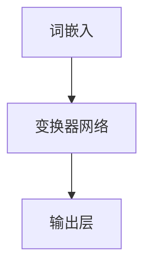
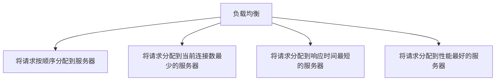

                 

 <sop>
首先，我们需要明确文章的结构，确保每个部分都包含必要的内容。

### 1.1 LLM定义与特点

在这个部分，我们将详细介绍LLM（大型语言模型）的定义、特点以及它在自然语言处理（NLP）中的作用。我们将首先解释LLM是如何构建的，以及它的核心组成部分是什么。

#### LLM的定义

LLM是一种基于深度学习技术的自然语言处理模型，它通过对大量文本数据的学习，能够理解和生成自然语言文本。这些模型通常包含数十亿个参数，使得它们能够捕捉到复杂的语言规律。

#### LLM的特点

1. **大规模**：LLM通常具有数十亿个参数，这使得它们能够处理大量的数据，并且能够捕捉到复杂的语言规律。
2. **自主学习**：LLM可以通过无监督学习的方式，从大规模文本数据中自动学习语言特征。
3. **生成性强**：LLM能够生成高质量的自然语言文本，这些文本在语法、语义上都非常自然。

#### LLM在NLP中的作用

LLM在NLP中有广泛的应用，包括文本生成、翻译、问答系统等。它们能够提高文本处理任务的效率和质量，使得机器能够更好地理解和生成自然语言。

### 1.2 LLM的历史与发展

接下来，我们将回顾LLM的历史和发展。从最初的神经网络模型，到GPT和BERT等现代大型语言模型，LLM的发展历程充满了技术创新和突破。

#### 初始阶段

在20世纪80年代，神经网络模型如感知机和BP神经网络开始应用于自然语言处理领域。然而，由于计算能力和数据量的限制，这些模型的性能并不理想。

#### GPT的诞生

2018年，OpenAI发布了GPT-1，这是第一个真正意义上的大型语言模型。GPT-1的出现标志着NLP领域的重大突破，它展示了大型神经网络模型在语言理解与生成方面的潜力。

#### BERT的崛起

同年，Google发布了BERT，这是一种基于Transformer架构的大型语言模型。BERT在多个NLP任务中取得了显著的成果，进一步推动了大型语言模型的发展。

#### GPT-3的问世

2020年，OpenAI发布了GPT-3，这是目前最大的语言模型，拥有超过1750亿个参数。GPT-3的发布再次引起了NLP领域的轰动，它展示了大型语言模型在文本生成、翻译等任务中的强大能力。

### 1.3 LLM的核心架构

最后，我们将详细介绍LLM的核心架构，包括词嵌入、变换器网络和输出层。通过理解这些组件的工作原理，我们将更好地理解LLM是如何工作的。

#### 词嵌入

词嵌入是将自然语言文本转换为向量表示的过程。通过词嵌入，模型可以处理文本数据，并利用向量之间的相似性来理解文本的含义。

#### 变换器网络

变换器网络是LLM的核心组件，它通过多层变换器层对词向量进行编码和解码。这些变换器层能够捕捉到文本中的复杂结构和语义信息。

#### 输出层

输出层是将解码后的词向量映射回自然语言文本的过程。通过输出层，模型能够生成高质量的自然语言文本。

#### Mermaid流程图

以下是一个简单的Mermaid流程图，展示了LLM的核心架构：

通过这个流程图，我们可以直观地看到LLM的工作流程。

### 结论

在本文中，我们介绍了LLM的基础概念、历史与发展以及核心架构。通过这些内容，读者可以更好地理解LLM的工作原理和应用场景。在接下来的章节中，我们将进一步探讨LLM的应用实践和最佳实践，帮助读者将LLM应用到实际项目中。

---

接下来，我们将按照同样的方式，逐步完成其他章节的内容。在接下来的章节中，我们将深入探讨LLM的数学基础、弹性与可伸缩基础设施设计、实际应用案例以及安全与隐私保护等主题。通过这些内容的讲解，我们将帮助读者全面掌握构建弹性可伸缩的LLM应用基础设施的技巧和方法。

---

# 第2章：LLM核心算法

## 2.1 词嵌入技术

词嵌入是将自然语言文本转换为向量表示的过程。通过词嵌入，模型可以处理文本数据，并利用向量之间的相似性来理解文本的含义。在LLM中，词嵌入是一个至关重要的环节，它直接影响模型对语言的理解和生成能力。

### 2.1.1 词嵌入的基本概念

词嵌入的基本概念包括词向量和词嵌入空间。词向量是表示一个词语的向量，它通常是一个高维空间中的点。词嵌入空间则是所有词向量构成的空间，在这个空间中，词向量之间的距离和角度可以用来表示词语之间的关系。

### 2.1.2 常见的词嵌入算法

1. **Word2Vec**：Word2Vec是最早的词嵌入算法之一，它通过负采样和随机梯度下降（SGD）训练词向量。Word2Vec算法的核心思想是将每个词语映射为一个固定长度的向量，通过训练使得相似的词语在向量空间中靠近。

2. **GloVe**：GloVe（Global Vectors for Word Representation）是一种基于全局矩阵因式的词嵌入算法。GloVe通过优化全局矩阵的因子分解来训练词向量，这种方法使得词向量能够更好地捕捉到词语的语义关系。

3. **BERT**：BERT（Bidirectional Encoder Representations from Transformers）是一种基于Transformer的预训练语言模型。BERT通过双向编码器学习词向量的表示，使得词向量能够同时捕捉到词语的前后文信息。

### 2.1.3 词嵌入的优缺点

**优点**：
- **提高文本处理效率**：通过词嵌入，模型可以直接处理向量数据，从而提高文本处理效率。
- **增强语义理解**：词嵌入能够捕捉到词语的语义关系，使得模型在自然语言处理任务中具有更强的语义理解能力。

**缺点**：
- **高维空间存储**：词嵌入通常是一个高维空间，这导致存储和计算成本较高。
- **词向量分布不均匀**：词嵌入存在一些问题，如稀疏性、非线性和不公平性，这些问题可能会影响模型的表现。

## 2.2 变换器模型

变换器模型（Transformer）是一种基于自注意力机制的深度神经网络模型，它在自然语言处理领域取得了显著的成果。变换器模型的核心思想是通过自注意力机制来捕捉文本中的长距离依赖关系。

### 2.2.1 变换器模型的基本概念

1. **自注意力机制**：自注意力机制是一种计算文本序列中每个词对于整个序列的注意力权重的方法。通过自注意力机制，模型可以自适应地关注到文本序列中的重要信息。

2. **多头注意力**：多头注意力是一种扩展自注意力机制的技巧，它通过多个独立的注意力头来学习不同类型的依赖关系。这种方法可以提高模型的表示能力和泛化能力。

3. **前馈神经网络**：前馈神经网络是变换器模型中的另一个关键组件，它用于对自注意力层的输出进行进一步加工。

### 2.2.2 变换器模型的工作原理

1. **输入层**：变换器模型的输入是词嵌入和位置编码。词嵌入表示每个词的向量表示，位置编码则用于表示词在序列中的位置信息。

2. **自注意力层**：在自注意力层，模型会对输入序列中的每个词计算注意力权重，并将这些权重应用于词嵌入。通过这种方式，模型可以自适应地关注到文本序列中的重要信息。

3. **多头注意力层**：多头注意力层是对自注意力层的扩展。它通过多个独立的注意力头来学习不同类型的依赖关系，从而提高模型的表示能力。

4. **前馈神经网络**：前馈神经网络是对多头注意力层的输出进行进一步加工的过程。它通过两个全连接层对输入进行变换，从而增强模型的非线性表达能力。

5. **输出层**：输出层是将变换器模型的输出映射到目标任务的结果。例如，在文本分类任务中，输出层是一个分类器；在序列生成任务中，输出层是一个生成器。

### 2.2.3 变换器模型的优缺点

**优点**：
- **捕捉长距离依赖**：变换器模型通过自注意力机制可以自适应地关注到文本序列中的重要信息，从而捕捉到长距离依赖关系。
- **计算效率高**：与传统的循环神经网络（RNN）相比，变换器模型在计算上更加高效，因为它避免了重复计算和梯度消失的问题。

**缺点**：
- **存储和计算成本高**：由于变换器模型具有多个注意力头和多层结构，这导致存储和计算成本较高。
- **对长文本处理能力有限**：尽管变换器模型能够捕捉到长距离依赖，但对于非常长的文本，模型的表现可能会受到影响。

## 2.3 语言生成算法

语言生成算法是LLM的重要应用之一，它能够生成高质量的自然语言文本。在语言生成算法中，常用的方法包括基于规则的方法和基于统计的方法。

### 2.3.1 基于规则的方法

基于规则的方法通过定义一组规则来生成文本。这种方法通常用于生成简单的文本，例如生成商品描述或新闻摘要。基于规则的方法的优点是生成速度较快，且容易理解。然而，它的缺点是生成文本的多样性和灵活性较低，且难以处理复杂的语言现象。

### 2.3.2 基于统计的方法

基于统计的方法通过学习大量文本数据中的统计规律来生成文本。这种方法通常使用机器学习算法，例如生成式模型和判别式模型。基于统计的方法的优点是生成文本的多样性和灵活性较高，且能够处理复杂的语言现象。然而，它的缺点是生成速度较慢，且可能生成不合理的文本。

### 2.3.3 语言生成算法的实现

在LLM中，常用的语言生成算法包括生成式模型和判别式模型。

1. **生成式模型**：生成式模型通过学习文本数据的生成过程来生成文本。例如，GPT-2和GPT-3就是基于生成式模型的。生成式模型的核心组件是变分自编码器（VAE）和生成对抗网络（GAN）。

2. **判别式模型**：判别式模型通过学习文本数据的分布来生成文本。例如，BERT和RoBERTa就是基于判别式模型的。判别式模型的核心组件是多层感知机（MLP）和注意力机制。

### 2.3.4 语言生成算法的优缺点

**优点**：
- **生成文本多样性和灵活性高**：基于统计的方法能够生成具有多样性和灵活性的文本。
- **处理复杂语言现象能力强**：基于统计的方法能够处理复杂的语言现象，例如语法结构、语义关系等。

**缺点**：
- **生成速度较慢**：基于统计的方法通常需要大量的计算资源和时间来生成文本。
- **可能生成不合理的文本**：由于模型对语言数据的理解有限，它可能生成不符合逻辑或不合理的文本。

## 结论

在本文中，我们介绍了LLM的核心算法，包括词嵌入技术、变换器模型和语言生成算法。这些算法是构建LLM应用基础设施的核心，它们共同实现了LLM在自然语言处理任务中的强大能力。通过理解这些算法的原理和实现方法，我们可以更好地构建和应用LLM，为各种自然语言处理任务提供解决方案。

在接下来的章节中，我们将继续探讨LLM的弹性与可伸缩基础设施设计，以及如何在实际应用中构建弹性可伸缩的LLM应用基础设施。这些内容将为读者提供更深入的技术见解和实际操作经验。

---

# 第3章：LLM数学基础

## 3.1 神经网络数学基础

神经网络（Neural Networks）是构建LLM的核心组件之一，其数学基础主要包括线性代数、微积分和概率论。理解这些数学概念对于深入掌握神经网络的工作原理至关重要。

### 3.1.1 线性代数

1. **向量与矩阵**：向量是表示一维数据的数组，矩阵是表示二维数据的数组。向量与矩阵的运算包括加法、减法、数乘、矩阵乘法和矩阵求逆等。

2. **矩阵求导**：在神经网络中，矩阵求导是计算梯度的重要步骤。例如，对于矩阵 $A$，其导数可以通过求矩阵的逆矩阵或利用链式法则来计算。

3. **向量空间与线性变换**：向量空间是包含向量的集合，线性变换是将一个向量空间映射到另一个向量空间的函数。在神经网络中，线性变换通过矩阵乘法和加法来实现。

### 3.1.2 微积分

1. **函数与极限**：函数是表示输入与输出之间关系的数学对象。极限是函数在某一点附近的行为，它用于定义导数和积分等概念。

2. **导数与梯度**：导数是函数在某一点的局部变化率。梯度是函数在多个变量上的偏导数组成的向量，它用于描述函数在多变量空间中的变化方向。

3. **偏导数与全微分**：偏导数是函数在某个特定变量上的导数，全微分是函数在多个变量上的偏导数之和。在神经网络中，偏导数用于计算梯度，从而进行反向传播。

### 3.1.3 概率论

1. **概率分布与随机变量**：概率分布描述了随机变量的可能取值及其概率。常见的概率分布包括正态分布、伯努利分布和泊松分布等。

2. **条件概率与贝叶斯定理**：条件概率是在已知某一事件发生的情况下，另一事件发生的概率。贝叶斯定理是用于计算条件概率的重要公式，它在神经网络中的应用包括概率推理和模型选择。

3. **随机过程与马尔可夫链**：随机过程是描述随机变量序列的数学模型。马尔可夫链是一种特殊的随机过程，它在神经网络中用于模拟序列数据。

### 3.1.4 神经网络中的数学应用

1. **激活函数**：激活函数是神经网络中的一个关键组件，它用于引入非线性变换。常见的激活函数包括Sigmoid、ReLU和Tanh等。

2. **损失函数**：损失函数是用于评估神经网络预测结果与真实结果之间差异的函数。常见的损失函数包括均方误差（MSE）和对数似然损失等。

3. **反向传播**：反向传播是神经网络训练的核心算法，它通过计算损失函数关于模型参数的梯度来更新参数。反向传播利用了链式法则和链式微积分原理。

## 3.2 反向传播算法

反向传播算法（Backpropagation Algorithm）是一种用于训练神经网络的算法，它通过计算损失函数关于模型参数的梯度来更新参数。反向传播算法的核心思想是利用链式法则，将梯度从输出层反向传播到输入层。

### 3.2.1 反向传播算法的基本步骤

1. **前向传播**：计算输入和模型参数的加权和，并使用激活函数进行非线性变换，得到输出。

2. **计算损失函数**：计算输出与真实标签之间的差异，得到损失值。

3. **计算梯度**：利用链式法则，计算损失函数关于模型参数的梯度。

4. **更新参数**：根据梯度更新模型参数，以减少损失值。

### 3.2.2 反向传播算法的数学原理

反向传播算法的关键在于计算损失函数关于模型参数的梯度。以下是计算梯度的一般步骤：

1. **计算前向传播的中间变量**：对于每个神经元，计算输入和权重之间的加权和，并应用激活函数。

2. **计算输出层的误差**：计算输出与真实标签之间的差异，得到损失值。

3. **计算隐藏层的误差**：利用链式法则，从输出层的误差反向传播到隐藏层。对于每个隐藏层神经元，计算其误差。

4. **计算权重和偏置的梯度**：利用误差和中间变量，计算每个权重和偏置的梯度。

5. **更新权重和偏置**：根据梯度更新每个权重和偏置。

### 3.2.3 反向传播算法的优化

反向传播算法的优化目标是减少损失值。以下是一些常用的优化技术：

1. **学习率调整**：通过调整学习率，可以控制模型参数更新的幅度。常用的学习率调整方法包括线性递减和学习率衰减。

2. **动量**：通过引入动量，可以加速梯度下降的过程，并减少振荡。动量是一种累积效果，它可以在前一个梯度的方向上继续更新参数。

3. **批量归一化**：批量归一化是一种用于加速训练和减少梯度消失/爆炸的技术。它通过标准化每个批量中的激活值，使得每个神经元的输入更加稳定。

4. **随机梯度下降（SGD）**：随机梯度下降是一种常用的优化算法，它通过随机选择批量样本来计算梯度，并更新模型参数。

## 3.3 自然语言处理中的概率论与统计方法

概率论与统计方法在自然语言处理（NLP）中扮演着重要角色，它们用于建模文本数据、评估模型性能和优化模型参数。

### 3.3.1 概率论在NLP中的应用

1. **语言模型**：语言模型是一种用于预测下一个单词的概率分布的模型。常见的语言模型包括N元语言模型和神经网络语言模型。

2. **词向量表示**：词向量表示是一种将词语转换为向量表示的方法。通过概率论，我们可以计算词向量之间的相似性，从而进行词语的语义分析。

3. **隐马尔可夫模型（HMM）**：隐马尔可夫模型是一种用于序列数据建模的方法，它用于识别文本序列中的模式。

### 3.3.2 统计方法在NLP中的应用

1. **朴素贝叶斯分类器**：朴素贝叶斯分类器是一种基于贝叶斯定理和特征独立性的分类器，它用于文本分类和文本分类任务。

2. **支持向量机（SVM）**：支持向量机是一种用于文本分类和回归任务的线性分类器，它通过最大化分类边界上的间隔来优化模型。

3. **聚类分析**：聚类分析是一种用于无监督学习的统计方法，它用于对文本数据进行分组和分类。

### 3.3.3 概率论与统计方法的结合

概率论与统计方法的结合可以用于构建更加复杂的NLP模型。例如，我们可以使用贝叶斯网络来建模文本数据的因果关系，使用隐马尔可夫模型来建模序列数据的转移概率，以及使用深度学习模型来融合多种特征信息。

## 结论

在本文中，我们介绍了LLM数学基础中的线性代数、微积分和概率论，以及反向传播算法和自然语言处理中的概率论与统计方法。理解这些数学概念对于构建和应用LLM至关重要。通过掌握这些数学原理，我们可以更深入地理解神经网络的工作机制，并优化模型性能。

在接下来的章节中，我们将进一步探讨LLM在弹性与可伸缩基础设施设计中的应用，以及如何在实际项目中构建高效、可靠的LLM应用。这些内容将帮助读者将LLM技术应用到实际场景中，解决复杂的自然语言处理问题。

---

## 第4章：弹性架构设计原则

### 4.1 弹性计算

弹性计算是构建弹性可伸缩的LLM应用基础设施的核心概念之一。弹性计算的目标是在系统资源需求发生变化时，自动调整计算资源以满足需求。以下是一些实现弹性计算的关键原则和策略：

#### 4.1.1 自动扩展策略

1. **基于负载的扩展**：系统可以根据当前负载水平自动增加或减少计算资源。例如，当系统的请求量增加时，可以动态地添加更多的计算节点。

2. **基于预定义阈值的扩展**：系统可以根据预定义的阈值自动扩展资源。例如，当CPU使用率超过90%时，可以自动添加新的计算节点。

3. **基于历史数据的扩展**：系统可以根据历史数据预测未来的负载，并提前进行资源扩展。例如，可以使用时间序列分析来预测高峰期的负载，并提前增加资源。

#### 4.1.2 负载均衡

负载均衡是将计算任务分布到多个计算节点上的策略，以确保每个节点都能高效地运行。以下是一些实现负载均衡的方法：

1. **基于轮询的负载均衡**：将请求按照顺序分配到每个节点上。

2. **基于最小连接数的负载均衡**：将请求分配到当前连接数最少的节点上。

3. **基于响应时间的负载均衡**：将请求分配到响应时间最短的节点上。

4. **基于性能的负载均衡**：将请求分配到性能最好的节点上。

#### 4.1.3 自愈机制

自愈机制是在系统出现故障时自动恢复系统的能力。以下是一些实现自愈机制的方法：

1. **故障检测**：系统可以定期检查自身状态，并在发现故障时触发恢复流程。

2. **自动恢复**：系统可以在检测到故障时自动重启服务或迁移任务到其他健康节点。

3. **回滚和备份**：在系统更新或故障恢复时，可以回滚到之前的稳定版本或使用备份来恢复系统。

### 4.2 自动扩展策略

自动扩展策略是实现弹性计算的关键之一。以下是一些常用的自动扩展策略：

1. **水平扩展**：通过增加计算节点来增加系统的处理能力。这种方法适用于处理大量并发请求的应用。

2. **垂直扩展**：通过增加单个计算节点的资源（如CPU、内存、存储）来提高系统的性能。这种方法适用于处理单个大型任务的应用。

3. **混合扩展**：结合水平扩展和垂直扩展，根据系统的需求和性能调整扩展策略。

4. **动态扩展**：根据实时的负载和性能数据，动态调整系统的扩展策略。这种方法能够更好地应对突发负载和性能波动。

### 4.3 负载均衡

负载均衡是将计算任务分布到多个计算节点上的策略，以确保每个节点都能高效地运行。以下是一些实现负载均衡的方法：

1. **轮询负载均衡**：这是一种简单的负载均衡策略，它将请求按照顺序分配到每个节点上。优点是实现简单，缺点是可能会导致部分节点负载不均衡。

2. **最小连接数负载均衡**：这种策略将请求分配到当前连接数最少的节点上，以保持节点负载的平衡。优点是实现简单，缺点是在高并发场景下可能导致某些节点的连接数过多。

3. **响应时间负载均衡**：这种策略将请求分配到响应时间最短的节点上，以减少用户的等待时间。优点是能够提高用户体验，缺点是实现较为复杂。

4. **基于性能的负载均衡**：这种策略将请求分配到性能最好的节点上，以提高整体系统的性能。优点是能够提高系统的处理能力，缺点是可能需要额外的监控和性能评估机制。

### 4.4 自愈机制

自愈机制是在系统出现故障时自动恢复系统的能力。以下是一些实现自愈机制的方法：

1. **故障检测**：系统可以定期检查自身状态，并在发现故障时触发恢复流程。故障检测可以通过心跳信号、健康检查脚本或监控系统来实现。

2. **自动恢复**：系统可以在检测到故障时自动重启服务或迁移任务到其他健康节点。自动恢复可以通过故障转移机制、热备份或自动部署来实现。

3. **回滚和备份**：在系统更新或故障恢复时，可以回滚到之前的稳定版本或使用备份来恢复系统。回滚和备份可以确保系统在故障发生时能够快速恢复，并保持数据的一致性。

### 结论

在本文中，我们介绍了弹性架构设计原则中的弹性计算、自动扩展策略、负载均衡和自愈机制。弹性计算通过自动扩展和负载均衡策略，确保系统能够高效地应对负载波动。自愈机制则确保系统在出现故障时能够自动恢复，从而提高系统的可靠性和可用性。

在接下来的章节中，我们将深入探讨如何在实际项目中实现这些弹性架构设计原则，并分享最佳实践和注意事项。这些内容将帮助读者将弹性可伸缩的LLM应用基础设施应用于实际场景，构建高效、可靠的系统。

---

## 第5章：可伸缩基础设施实现

### 5.1 云服务与容器化

在构建弹性可伸缩的LLM应用基础设施时，云服务和容器化技术是不可或缺的组成部分。云服务提供了弹性计算资源，而容器化技术则确保了应用的一致性和可移植性。

#### 5.1.1 云服务

云服务是指通过互联网提供动态可扩展的虚拟计算资源，如亚马逊AWS、微软Azure和谷歌云等。这些云服务提供商提供了丰富的工具和API，使得开发者可以轻松地部署和管理大规模的LLM应用。

1. **弹性计算服务**：如Amazon EC2、Azure VM和Google Compute Engine，它们可以自动调整计算资源以应对负载变化。
2. **数据库服务**：如Amazon RDS、Azure SQL Database和Google Cloud SQL，这些服务提供了可靠、高度可伸缩的数据库解决方案。
3. **存储服务**：如Amazon S3、Azure Blob Storage和Google Cloud Storage，它们提供了灵活、可扩展的存储解决方案。

#### 5.1.2 容器化技术

容器化技术通过将应用程序及其依赖环境打包到容器中，实现了应用程序的独立性和可移植性。常见的容器化技术包括Docker和Kubernetes。

1. **Docker**：Docker是一个用于构建、运行和分发应用程序的容器平台。它通过将应用程序和其依赖环境打包到一个轻量级容器中，实现了“一次编写，到处运行”的理念。
2. **Kubernetes**：Kubernetes是一个开源的容器编排平台，它用于自动化容器的部署、扩展和管理。通过Kubernetes，开发者可以轻松地管理大规模的容器化应用程序。

### 5.2 分布式存储与数据库

在构建弹性可伸缩的LLM应用时，分布式存储和数据库是关键组件。它们能够处理大量数据，并提供高可用性和高扩展性。

#### 5.2.1 分布式存储

分布式存储技术通过将数据分散存储在多个节点上，提供了高可用性和高扩展性。以下是一些常见的分布式存储系统：

1. **HDFS（Hadoop Distributed File System）**：HDFS是一个分布式文件系统，它通过将文件分成块并分布存储在集群中的多个节点上，提供了高吞吐量和可靠性。
2. **Ceph**：Ceph是一个开源的分布式存储系统，它提供了对象存储、块存储和文件系统存储，并支持多种存储类型。
3. **Alluxio**：Alluxio（Tachyon）是一个内存级分布式存储系统，它将数据存储在内存和磁盘上，提高了数据访问速度。

#### 5.2.2 分布式数据库

分布式数据库通过将数据分散存储在多个节点上，提供了高可用性和高扩展性。以下是一些常见的分布式数据库：

1. **Apache Cassandra**：Cassandra是一个高度可扩展的分布式NoSQL数据库，它通过去中心化的架构和基于一致性哈希的分区策略，提供了高可用性和高扩展性。
2. **MongoDB**：MongoDB是一个分布式文档数据库，它通过分片和副本集提供了高可用性和高扩展性。
3. **MySQL Cluster**：MySQL Cluster是一个分布式关系数据库，它通过共享存储和复制提供了高可用性和高扩展性。

### 5.3 高性能网络架构

高性能网络架构是确保LLM应用基础设施能够高效处理数据传输的关键。以下是一些实现高性能网络架构的方法：

#### 5.3.1 负载均衡

负载均衡可以将网络流量分布到多个服务器上，以避免单点瓶颈。以下是一些负载均衡方法：

1. **基于轮询的负载均衡**：将请求按照顺序分配到每个服务器上。
2. **基于最小连接数的负载均衡**：将请求分配到当前连接数最少的

#### 5.3.2 网络优化

网络优化技术可以减少数据传输延迟和带宽消耗，提高网络性能。以下是一些网络优化方法：

1. **数据压缩**：通过压缩数据，可以减少数据传输的带宽消耗。
2. **缓存**：通过缓存常用数据，可以减少重复的数据传输。
3. **CDN（内容分发网络）**：通过CDN，可以将数据分发到距离用户最近的服务器，从而减少数据传输延迟。
4. **多路径传输**：通过多路径传输，可以将数据同时传输到多个路径上，以提高传输速度和可靠性。

### 5.4 实现步骤

在实现可伸缩基础设施时，可以按照以下步骤进行：

1. **需求分析**：明确应用的需求，包括数据处理量、响应时间和可用性要求。
2. **架构设计**：根据需求分析，设计符合业务需求的系统架构，包括计算、存储和网络架构。
3. **技术选型**：选择适合的技术，包括云服务、容器化技术、分布式存储和数据库、网络架构等。
4. **开发与部署**：开发应用程序并部署到基础设施上，包括配置和管理容器、数据库和负载均衡器。
5. **性能测试与优化**：进行性能测试，找出瓶颈并进行优化，以提高系统性能和可伸缩性。

### 结论

在本文中，我们介绍了可伸缩基础设施实现的关键组件，包括云服务、容器化技术、分布式存储与数据库、高性能网络架构等。通过这些技术的结合，我们可以构建一个弹性可伸缩的LLM应用基础设施，确保系统在高负载下仍能稳定运行。

在接下来的章节中，我们将进一步探讨监控与优化策略，以及如何在实际项目中应用这些策略，以构建高效、可靠的LLM应用基础设施。

---

## 第6章：监控与优化

### 6.1 性能监控

性能监控是确保LLM应用基础设施稳定运行和高效处理数据的关键。以下是一些常用的性能监控工具和指标：

#### 6.1.1 常用的性能监控工具

1. **Prometheus**：Prometheus是一个开源的性能监控解决方案，它通过收集和存储指标数据，并提供强大的查询和告警功能。
2. **Grafana**：Grafana是一个开源的数据可视化平台，它可以将Prometheus等工具收集的数据可视化，并提供实时监控和分析。
3. **New Relic**：New Relic是一个商业性能监控工具，它提供了全面的性能监控、性能分析和安全功能。

#### 6.1.2 常用的监控指标

1. **CPU利用率**：CPU利用率是衡量系统处理能力的重要指标，它反映了CPU的繁忙程度。
2. **内存使用率**：内存使用率反映了系统内存的占用情况，过高可能会导致内存溢出和性能下降。
3. **磁盘I/O**：磁盘I/O反映了系统读写磁盘的速度，过高的磁盘I/O可能会导致性能瓶颈。
4. **网络吞吐量**：网络吞吐量反映了系统网络的数据传输速度，过高或过低的网络吞吐量都可能导致性能问题。
5. **响应时间**：响应时间是衡量系统处理请求的速度，它是用户感知性能的重要指标。

### 6.2 自动化运维

自动化运维是提高LLM应用基础设施运维效率和稳定性的关键。以下是一些常用的自动化运维工具和策略：

#### 6.2.1 常用的自动化运维工具

1. **Ansible**：Ansible是一个开源的自动化运维工具，它通过简单的Playbook文件实现自动化部署、配置和管理。
2. **Terraform**：Terraform是一个开源的基础设施即代码（IaC）工具，它通过定义基础设施的配置文件，实现自动化部署和管理。
3. **Kubernetes**：Kubernetes是一个开源的容器编排平台，它提供了自动化部署、扩展和管理容器化应用程序的功能。

#### 6.2.2 常用的自动化运维策略

1. **配置管理**：通过配置管理工具，可以自动化地部署和配置系统环境，确保环境的一致性。
2. **自动化部署**：通过自动化部署工具，可以实现持续集成和持续部署（CI/CD），提高部署效率和质量。
3. **故障恢复**：通过自动化故障恢复策略，可以快速检测和恢复系统故障，确保系统的可用性。
4. **自动化监控**：通过自动化监控工具，可以实时监控系统性能和健康状况，及时发现和解决问题。

### 6.3 优化策略

在构建弹性可伸缩的LLM应用基础设施时，优化策略是提高系统性能和可伸缩性的关键。以下是一些常用的优化策略：

#### 6.3.1 系统级优化

1. **硬件优化**：选择高性能的硬件设备，如固态硬盘、高性能CPU和高速网络，以提高系统性能。
2. **网络优化**：通过优化网络架构和负载均衡策略，可以提高网络传输速度和稳定性。
3. **缓存策略**：通过使用缓存技术，可以减少数据的访问延迟，提高系统性能。

#### 6.3.2 应用级优化

1. **代码优化**：通过优化代码结构和算法，可以提高应用程序的性能。
2. **数据库优化**：通过优化数据库查询和索引，可以提高数据库的查询性能。
3. **服务拆分和分布式架构**：通过将大型服务拆分成多个小型服务，并采用分布式架构，可以提高系统的可伸缩性和容错能力。

#### 6.3.3 模型优化

1. **模型压缩**：通过模型压缩技术，可以减小模型的存储空间和计算复杂度，提高模型在硬件设备上的运行效率。
2. **模型并行化**：通过模型并行化技术，可以将模型分解为多个部分，并行地在多个计算节点上运行，提高模型的计算速度。

### 6.4 最佳实践

以下是一些构建弹性可伸缩的LLM应用基础设施的最佳实践：

1. **分层架构**：采用分层架构，将系统划分为不同的层次，如表示层、逻辑层和数据层，以提高系统的可维护性和可扩展性。
2. **分布式部署**：将应用程序部署到多个节点上，采用分布式架构，以提高系统的容错能力和可伸缩性。
3. **自动化运维**：采用自动化运维工具和策略，实现自动部署、监控和故障恢复，提高运维效率和稳定性。
4. **持续集成和持续部署**：采用CI/CD流程，实现自动化代码审查、测试和部署，提高部署效率和质量。
5. **性能监控和优化**：定期监控系统性能，并针对性能瓶颈进行优化，确保系统的高性能和稳定性。

### 结论

在本文中，我们介绍了构建弹性可伸缩的LLM应用基础设施的性能监控、自动化运维和优化策略。性能监控和自动化运维是确保系统稳定运行和高效处理数据的关键，而优化策略则是提高系统性能和可伸缩性的重要手段。

在接下来的章节中，我们将通过实际案例来展示如何构建和应用弹性可伸缩的LLM应用基础设施，帮助读者更好地理解和应用这些技术。

---

## 第7章：LLM应用实践

### 7.1 文本生成与编辑

文本生成与编辑是LLM在自然语言处理（NLP）中的两个重要应用方向。文本生成包括自动写作、对话系统、翻译等，而文本编辑则涵盖自动纠错、文本摘要、内容润色等。

#### 7.1.1 文本生成

1. **自动写作**：自动写作是利用LLM生成高质量文本的一种应用，它可以应用于新闻写作、博客生成、内容创作等领域。例如，GPT-3可以生成新闻文章、产品描述等。

2. **对话系统**：对话系统是通过与用户交互生成自然语言响应的系统。LLM在对话系统中被用于生成自然语言回复，如聊天机器人、虚拟助手等。GPT-3在聊天机器人和虚拟助手中的应用非常广泛，它可以理解和生成复杂的对话。

3. **翻译**：LLM在翻译中的应用主要是基于机器翻译模型，如BERT和Transformer等。这些模型可以通过无监督学习或监督学习从大量双语数据中学习翻译规则，从而实现高质量的多语言翻译。

#### 7.1.2 文本编辑

1. **自动纠错**：自动纠错是利用LLM检测和纠正文本中的错误。这种方法可以应用于文本输入校对、文本编辑等。例如，GPT-3可以检测文本中的拼写错误、语法错误等，并提供修正建议。

2. **文本摘要**：文本摘要是从长文本中提取关键信息，生成简洁、概括性的文本。LLM在文本摘要中的应用可以通过抽取式摘要和生成式摘要实现。例如，GPT-3可以生成摘要，使其内容简洁明了。

3. **内容润色**：内容润色是通过对文本进行优化，使其更加通顺、优美。LLM在内容润色中的应用可以提升文本的表达效果，使其更具吸引力。例如，GPT-3可以帮助修改文本，使其更符合目标读者的阅读习惯。

### 7.2 智能问答与对话系统

智能问答与对话系统是LLM在NLP领域的另一个重要应用。智能问答系统通过回答用户提出的问题，提供有用的信息，而对话系统则是与用户进行自然语言交互的系统。

#### 7.2.1 智能问答系统

智能问答系统的核心是构建问答对，即问题和答案对。LLM在智能问答系统中的应用包括：

1. **语义匹配**：将用户提出的问题与预定义的问题库进行匹配，找到最相关的答案。
2. **生成答案**：对于无法直接匹配的问题，LLM可以生成新的答案。例如，GPT-3可以理解用户的问题，并根据已有的知识库生成相关答案。

#### 7.2.2 对话系统

对话系统是通过与用户进行自然语言交互，提供个性化服务或解答用户问题的系统。LLM在对话系统中的应用包括：

1. **自然语言理解**：理解用户输入的自然语言，提取关键信息。
2. **对话生成**：生成自然语言响应，与用户进行交互。例如，GPT-3可以生成与用户对话的自然语言回复。

### 7.3 语言翻译与多语言处理

语言翻译和多语言处理是LLM在跨语言应用中的重要方向。LLM通过学习大量多语言数据，能够实现高质量的语言翻译和跨语言文本处理。

#### 7.3.1 语言翻译

语言翻译是LLM在跨语言应用中的核心任务。LLM可以通过以下方式实现语言翻译：

1. **基于规则的方法**：通过定义翻译规则，将源语言的文本转换为目标语言的文本。
2. **基于统计的方法**：通过学习大量双语数据，统计源语言和目标语言之间的翻译规律。
3. **基于神经的方法**：使用神经网络模型，如Transformer和BERT，通过端到端学习实现高质量的翻译。

#### 7.3.2 多语言处理

多语言处理是指对多种语言进行处理和分析的任务。LLM在多语言处理中的应用包括：

1. **多语言文本分类**：将多语言文本分类到不同的类别中。
2. **多语言文本摘要**：从多种语言的文本中提取关键信息，生成摘要。
3. **多语言实体识别**：识别多语言文本中的实体，如人名、地名、组织名等。

### 7.4 案例分析

为了更好地理解LLM在实际应用中的效果，我们来看几个实际案例。

#### 案例一：大型语言模型在搜索引擎中的应用

一个实际案例是大型语言模型在搜索引擎中的应用。搜索引擎可以利用LLM来生成搜索结果的摘要和推荐。例如，GPT-3可以生成与搜索结果相关的摘要，使得用户能够快速了解每个结果的内容。

#### 案例二：智能客服系统的构建

智能客服系统利用LLM实现与用户的自然语言交互，为用户提供实时解答和帮助。例如，GPT-3可以与用户进行对话，回答用户的问题，提供解决方案。

#### 案例三：语言翻译平台的构建

语言翻译平台利用LLM实现高质量的语言翻译服务。例如，Transformer和BERT等模型可以用于实现跨语言翻译，为用户提供准确、自然的翻译结果。

### 结论

在本文中，我们介绍了LLM在文本生成与编辑、智能问答与对话系统、语言翻译与多语言处理等领域的应用。通过这些实际案例，我们可以看到LLM在NLP领域的强大能力。在接下来的章节中，我们将进一步探讨LLM的安全与隐私保护，以及如何构建安全的LLM应用基础设施。

---

## 第8章：安全与隐私保护

### 9.1 数据安全

在构建弹性可伸缩的LLM应用基础设施时，数据安全是一个至关重要的方面。确保数据在整个生命周期中的安全，是保护用户隐私和业务利益的关键。以下是一些关键措施和最佳实践：

#### 9.1.1 数据加密

数据加密是保护数据隐私和安全的重要手段。在传输和存储过程中，应该对敏感数据进行加密。常用的加密技术包括：

1. **对称加密**：如AES（高级加密标准），它使用相同的密钥进行加密和解密。
2. **非对称加密**：如RSA（Rivest-Shamir-Adleman），它使用一对密钥进行加密和解密。
3. **哈希函数**：如SHA-256，用于确保数据的完整性和不可篡改性。

#### 9.1.2 访问控制

访问控制是限制对数据和系统的访问权限，确保只有授权用户可以访问敏感数据。以下是一些访问控制策略：

1. **基于角色的访问控制（RBAC）**：根据用户的角色分配访问权限，例如管理员、普通用户等。
2. **基于属性的访问控制（ABAC）**：根据用户的属性（如部门、位置、时间等）分配访问权限。
3. **多重认证**：结合多种认证方式，如密码、生物识别、双因素认证等，提高安全性。

#### 9.1.3 安全审计

安全审计是监控和记录系统和数据活动的日志，以发现潜在的安全威胁和漏洞。以下是一些安全审计的最佳实践：

1. **日志记录**：记录所有重要操作和事件，包括登录、数据访问、错误报告等。
2. **实时监控**：使用实时监控工具，及时发现异常活动和安全威胁。
3. **定期审查**：定期审查日志和审计报告，确保系统的安全性和合规性。

### 9.2 用户隐私

用户隐私是构建可靠和受欢迎的LLM应用基础设施的核心问题。保护用户隐私意味着确保用户的个人信息不被未经授权的第三方访问和使用。以下是一些关键措施和最佳实践：

#### 9.2.1 数据最小化

数据最小化是确保用户隐私的重要原则。只收集实现应用功能所必需的最少数据，并明确数据的使用目的和范围。

#### 9.2.2 数据匿名化

对敏感数据进行匿名化处理，以保护用户的隐私。常用的匿名化技术包括：

1. **泛化**：将敏感数据泛化到更大的数据集，使其无法直接识别具体个体。
2. **混淆**：对敏感数据进行混淆处理，使其难以识别，但仍保持数据的完整性。
3. **加密**：对敏感数据进行加密处理，确保即使数据被泄露，也无法被未授权方解密。

#### 9.2.3 同意和透明度

确保用户在使用应用时充分了解数据收集和使用的方式，并获得明确的同意。以下是一些透明度和同意的最佳实践：

1. **隐私政策**：明确记录数据收集、使用、共享和存储的政策，并确保用户可以方便地访问。
2. **用户控制**：提供用户控制选项，允许用户查看、修改或删除其个人信息。
3. **权限提示**：在应用中显示清晰的权限提示，告知用户哪些数据将被收集和使用，并获得用户的明确同意。

### 9.3 安全策略与防护措施

为了确保LLM应用基础设施的安全，以下是一些关键的安全策略和防护措施：

#### 9.3.1 防火墙和入侵检测系统

1. **防火墙**：在系统和网络边界上部署防火墙，以防止未授权访问和恶意流量。
2. **入侵检测系统（IDS）**：实时监控网络流量和系统活动，识别潜在的安全威胁和异常行为。

#### 9.3.2 安全补丁和更新

定期应用系统和应用软件的安全补丁和更新，以修复已知的漏洞和缺陷，防止被攻击者利用。

#### 9.3.3 安全培训和意识提升

为员工提供安全培训和教育，提高他们对安全威胁的认识，并鼓励他们遵循最佳安全实践。

#### 9.3.4 持续安全评估

定期进行安全评估和渗透测试，识别和修复潜在的安全漏洞，确保系统的安全性。

### 结论

在本文中，我们讨论了LLM应用基础设施中的安全与隐私保护。数据安全和用户隐私是构建可靠和受欢迎的应用的核心问题。通过采取适当的数据加密、访问控制、安全审计、数据匿名化、透明度和同意措施，以及部署防火墙、入侵检测系统、安全补丁和更新等安全策略和防护措施，我们可以有效地保护LLM应用基础设施的安全和用户隐私。

在接下来的章节中，我们将提供附录，包括开发工具与资源，以帮助读者在实际项目中更好地应用这些技术和策略。

---

## 附录：开发工具与资源

### 附录A：开发工具介绍

在构建弹性可伸缩的LLM应用基础设施过程中，选择合适的开发工具和资源对于提高开发效率、确保项目质量和稳定性至关重要。以下是一些常用的开发工具和资源介绍：

#### A.1 编程语言

1. **Python**：Python因其强大的库支持和丰富的生态系统，成为构建LLM应用的首选语言。它拥有许多强大的库，如TensorFlow、PyTorch、transformers等，用于构建和训练模型。
2. **Java**：Java具有跨平台的特性，广泛应用于企业级应用开发。它提供了丰富的库和框架，如Deeplearning4j、DL4J等，用于深度学习应用。

#### A.2 深度学习框架

1. **TensorFlow**：TensorFlow是一个开源的深度学习框架，由Google开发。它支持多种深度学习模型，并提供丰富的API和工具，适用于各种规模的应用。
2. **PyTorch**：PyTorch是一个开源的深度学习框架，由Facebook开发。它以动态计算图和灵活的API著称，适用于快速原型设计和研究。
3. **transformers**：transformers是一个开源库，基于PyTorch和TensorFlow，专门为Transformer模型设计。它提供了预训练模型和工具，简化了模型构建和训练过程。

#### A.3 容器化与编排工具

1. **Docker**：Docker是一个开源的容器化平台，用于打包、交付和管理应用程序。它可以将应用程序及其依赖环境封装在容器中，实现一次编写，到处运行。
2. **Kubernetes**：Kubernetes是一个开源的容器编排平台，用于自动化部署、扩展和管理容器化应用程序。它提供了强大的自动化和弹性功能，确保应用程序的高可用性和可伸缩性。

#### A.4 监控与日志工具

1. **Prometheus**：Prometheus是一个开源的监控解决方案，用于收集和存储时间序列数据。它提供了强大的查询和告警功能，适用于监控LLM应用的性能和健康状态。
2. **Grafana**：Grafana是一个开源的数据可视化平台，用于将Prometheus等工具收集的数据可视化。它提供了丰富的仪表板和图表，帮助用户实时监控和分析系统性能。
3. **ELK Stack**：ELK Stack（Elasticsearch、Logstash、Kibana）是一个开源的日志分析平台，用于收集、存储和可视化日志数据。它适用于大规模日志管理和分析，有助于识别潜在问题和安全威胁。

#### A.5 云服务与平台

1. **AWS**：亚马逊AWS提供了丰富的云计算服务，如Amazon EC2、Amazon S3、Amazon RDS等。它适用于构建弹性可伸缩的LLM应用基础设施。
2. **Azure**：微软Azure提供了多种云计算服务，如Azure VM、Azure Blob Storage、Azure SQL Database等。它支持多种编程语言和框架，适用于各种规模的应用。
3. **Google Cloud**：谷歌云提供了强大的云计算服务，如Google Compute Engine、Google Cloud Storage、Google Cloud SQL等。它提供了灵活的定价模式和强大的工具，适用于构建高性能的LLM应用。

### 附录B：开源框架推荐

以下是一些推荐的开源框架和库，它们在构建弹性可伸缩的LLM应用基础设施中具有广泛的应用：

1. **Flask**：Flask是一个轻量级的Web框架，用于构建Web应用程序和API。它简单易用，适用于快速开发和原型设计。
2. **FastAPI**：FastAPI是一个现代、快速（高性能）的Web框架，基于Python 3.6+和TypeScript。它提供了类型注解和自动验证，使开发更高效。
3. **TensorFlow Extended**：TensorFlow Extended（TFX）是一个开源的机器学习平台，用于构建、训练和部署大规模机器学习应用程序。它提供了丰富的工具和组件，简化了机器学习管道的开发。

### 附录C：实用资源链接

以下是一些实用的资源链接，包括教程、文档、博客和社区，有助于深入了解和掌握构建弹性可伸缩的LLM应用基础设施：

1. **TensorFlow官方文档**：https://www.tensorflow.org/
2. **PyTorch官方文档**：https://pytorch.org/
3. **transformers库官方文档**：https://huggingface.co/transformers/
4. **Docker官方文档**：https://docs.docker.com/
5. **Kubernetes官方文档**：https://kubernetes.io/docs/
6. **Prometheus官方文档**：https://prometheus.io/docs/
7. **Grafana官方文档**：https://grafana.com/docs/
8. **AWS官方文档**：https://aws.amazon.com/documentation/
9. **Azure官方文档**：https://docs.microsoft.com/en-us/azure/
10. **Google Cloud官方文档**：https://cloud.google.com/docs/

### 结论

在本文的附录部分，我们介绍了构建弹性可伸缩的LLM应用基础设施所需的开发工具、开源框架和实用资源。选择合适的工具和资源可以提高开发效率，确保项目质量和稳定性。通过学习和应用这些工具和资源，开发人员可以更有效地构建和管理LLM应用基础设施，实现高效的文本生成、翻译、问答等应用。在未来的工作中，不断探索和实践新的工具和资源，将有助于提升LLM应用的性能和可伸缩性。

