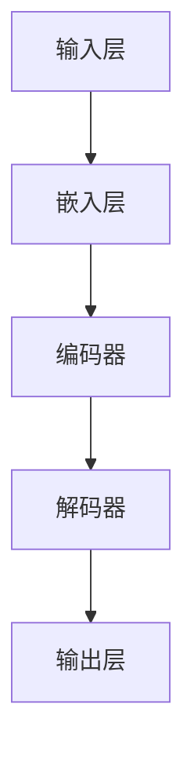

                 

# 文章标题：构建敏捷迭代的LLM工程技术架构

> 关键词：语言模型（LLM），敏捷开发，工程技术架构，迭代开发，模型训练与调优，模型部署与监控

> 摘要：本文旨在探讨如何在人工智能领域构建敏捷迭代的LLM工程技术架构。通过介绍LLM的基本概念、敏捷开发方法论、模型架构与原理、训练与调优、工程化实践以及模型部署与监控，本文为开发者提供了一套系统化的方法，帮助他们在快速变化的AI领域中保持竞争力。

## 步骤1：设计核心章节结构

构建敏捷迭代的LLM工程技术架构，首先需要明确核心章节结构。本文将分为以下七个章节：

### 第1章：LLM技术概述
- 1.1 LLM基本概念
- 1.2 LLM发展历史
- 1.3 LLM应用场景
- 1.4 LLM与自然语言处理

### 第2章：敏捷迭代开发方法论
- 2.1 敏捷开发原理
- 2.2 敏捷迭代流程
- 2.3 敏捷开发工具

### 第3章：LLM模型架构与原理
- 3.1 LLM模型架构
- 3.2 LLM模型原理
- 3.3 LLM模型训练
- 3.4 LLM模型优化

### 第4章：LLM训练与调优
- 4.1 训练数据准备
- 4.2 训练过程监控
- 4.3 模型调优策略

### 第5章：LLM工程化实践
- 5.1 LLM工程化框架
- 5.2 模型部署策略
- 5.3 模型监控与维护

### 第6章：模型部署与监控
- 6.1 部署环境搭建
- 6.2 部署流程与策略
- 6.3 模型监控方法
- 6.4 性能优化

### 第7章：实战案例分享
- 7.1 案例一：构建问答机器人
- 7.2 案例二：个性化推荐系统
- 7.3 案例三：自然语言理解应用

## 步骤2：细化章节内容

### 第1章：LLM技术概述

#### 1.1 LLM基本概念
语言模型（LLM）是一种基于深度学习的技术，用于模拟人类语言能力。它通过学习大量文本数据，生成与输入文本相关的新文本。LLM的核心特点是能够生成连贯、有意义的文本。

#### 1.2 LLM发展历史
LLM技术起源于20世纪50年代，随着计算能力和数据量的增长，LLM取得了显著的进展。近年来，随着深度学习技术的崛起，LLM在自然语言处理领域得到了广泛应用。

#### 1.3 LLM应用场景
LLM在自然语言处理领域有广泛的应用，包括文本生成、机器翻译、问答系统、文本分类等。

#### 1.4 LLM与自然语言处理
自然语言处理（NLP）是计算机科学和人工智能领域的一个分支，旨在使计算机能够理解、解释和生成人类语言。LLM是NLP的核心技术之一。

### 第2章：敏捷迭代开发方法论

#### 2.1 敏捷开发原理
敏捷开发是一种以人为本、迭代快速的软件开发方法。它强调适应性、灵活性和客户参与，以应对快速变化的需求。

#### 2.2 敏捷迭代流程
敏捷迭代流程包括需求收集、规划、开发、测试、部署等阶段。每个阶段都进行快速迭代，以确保项目的顺利进行。

#### 2.3 敏捷开发工具
敏捷开发工具包括JIRA、Confluence、GitLab等，用于任务管理、文档编写和版本控制。

### 第3章：LLM模型架构与原理

#### 3.1 LLM模型架构
LLM模型通常采用序列到序列（Seq2Seq）架构，包括嵌入层、编码器、解码器和输出层。

#### 3.2 LLM模型原理
LLM模型通过学习输入文本的序列和输出文本的序列，生成与输入相关的文本。

#### 3.3 LLM模型训练
LLM模型训练过程涉及大量文本数据，通过梯度下降等优化算法，逐步调整模型参数，提高模型性能。

#### 3.4 LLM模型优化
LLM模型优化包括超参数调整、数据预处理、模型压缩等技术，以提高模型性能和降低计算成本。

### 第4章：LLM训练与调优

#### 4.1 训练数据准备
训练数据准备包括数据采集、清洗、标注等步骤，确保数据质量。

#### 4.2 训练过程监控
训练过程监控包括监控模型性能、计算资源使用情况，以及调整训练策略。

#### 4.3 模型调优策略
模型调优策略包括超参数调整、数据增强、模型集成等技术，以提高模型性能。

### 第5章：LLM工程化实践

#### 5.1 LLM工程化框架
LLM工程化框架包括数据管理、模型训练、模型部署等模块，实现LLM的工程化开发。

#### 5.2 模型部署策略
模型部署策略包括选择合适的服务器、优化计算资源、保证模型性能等。

#### 5.3 模型监控与维护
模型监控与维护包括监控模型性能、数据质量，以及进行故障排查和修复。

### 第6章：模型部署与监控

#### 6.1 部署环境搭建
部署环境搭建包括搭建服务器、安装必要的软件和配置环境等。

#### 6.2 部署流程与策略
部署流程与策略包括模型打包、上传、部署和监控等步骤。

#### 6.3 模型监控方法
模型监控方法包括实时监控、离线监控和自动化监控等。

#### 6.4 性能优化
性能优化包括优化模型结构、数据预处理、计算资源调度等。

### 第7章：实战案例分享

#### 7.1 案例一：构建问答机器人
问答机器人是一种基于LLM的智能客服系统，能够回答用户的问题。

#### 7.2 案例二：个性化推荐系统
个性化推荐系统利用LLM技术，根据用户历史行为，推荐相关内容。

#### 7.3 案例三：自然语言理解应用
自然语言理解应用包括文本分类、情感分析、命名实体识别等。

## 步骤3：嵌入流程图、伪代码、数学公式和代码示例

### 第3章：LLM模型架构与原理

#### 3.1 LLM模型架构
以下是一个简单的LLM模型架构的Mermaid流程图：



#### 3.2 LLM模型原理
LLM模型原理可以通过以下伪代码进行阐述：

```python
# 输入：文本序列
# 输出：生成的文本序列

# 初始化嵌入层、编码器、解码器和输出层
embedder = EmbeddingLayer()
encoder = Encoder()
decoder = Decoder()
output_layer = OutputLayer()

# 训练模型
for epoch in range(num_epochs):
    for sequence in training_data:
        # 嵌入文本序列
        embedded_sequence = embedder(sequence)
        
        # 编码文本序列
        encoded_sequence = encoder(embedded_sequence)
        
        # 解码文本序列
        decoded_sequence = decoder(encoded_sequence)
        
        # 计算损失
        loss = calculate_loss(decoded_sequence, target_sequence)
        
        # 更新模型参数
        optimizer.minimize(loss)

# 评估模型
accuracy = evaluate_model(model, validation_data)
```

#### 3.3 LLM模型训练
以下是一个简单的训练过程的数学模型：

$$
L = -\sum_{i=1}^{N} \log(p(y_i|x_i))
$$

其中，$L$ 是损失函数，$N$ 是数据集中的样本数量，$y_i$ 是实际标签，$x_i$ 是输入序列，$p(y_i|x_i)$ 是预测概率。

#### 3.4 LLM模型优化
以下是一个简单的优化策略的伪代码：

```python
# 初始化学习率
learning_rate = 0.001

# 定义优化器
optimizer = Optimizer(learning_rate)

# 训练模型
for epoch in range(num_epochs):
    for sequence in training_data:
        # 嵌入文本序列
        embedded_sequence = embedder(sequence)
        
        # 编码文本序列
        encoded_sequence = encoder(embedded_sequence)
        
        # 解码文本序列
        decoded_sequence = decoder(encoded_sequence)
        
        # 计算损失
        loss = calculate_loss(decoded_sequence, target_sequence)
        
        # 更新模型参数
        optimizer.update_params(loss)

# 调整学习率
learning_rate *= learning_rate_decay
```

## 步骤4：总结目录大纲

以下是《构建敏捷迭代的LLM工程技术架构》的完整目录大纲：

```markdown
# 《构建敏捷迭代的LLM工程技术架构》

# 第1章：LLM技术概述

## 1.1 LLM基本概念
### 1.1.1 LLM的定义
### 1.1.2 LLM的关键特点

## 1.2 LLM发展历史
### 1.2.1 LLM的起源
### 1.2.2 LLM的关键里程碑

## 1.3 LLM应用场景
### 1.3.1 自然语言处理
### 1.3.2 人工智能助手
### 1.3.3 自动化写作

## 1.4 LLM与自然语言处理
### 1.4.1 NLP基础
### 1.4.2 LLM在NLP中的应用

# 第2章：敏捷迭代开发方法论

## 2.1 敏捷开发原理
### 2.1.1 敏捷宣言
### 2.1.2 敏捷原则

## 2.2 敏捷迭代流程
### 2.2.1 产品规划
### 2.2.2 迭代开发
### 2.2.3 交付与回顾

## 2.3 敏捷开发工具
### 2.3.1 JIRA
### 2.3.2 Confluence
### 2.3.3 GitLab

# 第3章：LLM模型架构与原理

## 3.1 LLM模型架构
### 3.1.1 Mermaid流程图

## 3.2 LLM模型原理
### 3.2.1 伪代码示例

## 3.3 LLM模型训练
### 3.3.1 训练数据准备
### 3.3.2 训练流程监控

## 3.4 LLM模型优化
### 3.4.1 模型调优策略

# 第4章：LLM训练与调优

## 4.1 训练数据准备
### 4.1.1 数据集获取
### 4.1.2 数据预处理

## 4.2 训练过程监控
### 4.2.1 模型监控指标
### 4.2.2 实时监控方法

## 4.3 模型调优策略
### 4.3.1 模型调参技巧

# 第5章：LLM工程化实践

## 5.1 LLM工程化框架
### 5.1.1 模型部署策略
### 5.1.2 模型监控与维护

## 5.2 模型部署策略
### 5.2.1 部署环境搭建
### 5.2.2 部署流程与策略

## 5.3 模型监控与维护
### 5.3.1 模型性能监控
### 5.3.2 故障排查与修复

# 第6章：模型部署与监控

## 6.1 部署环境搭建
### 6.1.1 服务器选择
### 6.1.2 软件安装与配置

## 6.2 部署流程与策略
### 6.2.1 模型打包
### 6.2.2 部署与监控

## 6.3 模型监控方法
### 6.3.1 实时监控
### 6.3.2 离线监控

## 6.4 性能优化
### 6.4.1 模型压缩
### 6.4.2 计算资源调度

# 第7章：实战案例分享

## 7.1 案例一：构建问答机器人
### 7.1.1 系统设计
### 7.1.2 模型训练与部署

## 7.2 案例二：个性化推荐系统
### 7.2.1 数据准备与模型训练
### 7.2.2 推荐算法实现与优化

## 7.3 案例三：自然语言理解应用
### 7.3.1 应用场景分析
### 7.3.2 模型设计与实现

## 结语
### 最佳实践
### 小结
### 拓展阅读

### 作者信息
```

通过上述步骤，我们构建了一个逻辑清晰、结构紧凑、简单易懂的LLM工程技术架构指南。接下来，我们将逐步展开每个章节的详细内容。## 第1章：LLM技术概述

### 1.1 LLM基本概念

语言模型（Language Model，简称LLM）是一种用于预测文本序列的概率分布的模型。它是自然语言处理（Natural Language Processing，简称NLP）领域的重要基础技术之一。LLM的核心目标是模拟人类语言生成和理解的机制，通过学习大量文本数据，生成与输入文本相关的新文本。

LLM的基本概念可以从以下几个方面进行理解：

- **文本序列**：文本序列是自然语言处理的基本单元。在LLM中，文本序列通常由单词、句子或段落组成，这些序列可以用来训练和评估模型。
- **概率分布**：LLM通过学习文本数据中的概率分布，预测下一个单词或字符的概率。这种概率分布可以帮助模型生成连贯、有意义的文本。
- **预测**：LLM的基本任务是预测输入文本序列后的下一个单词或字符。通过最大化下一个单词或字符的概率分布，模型可以生成新的文本。

### 1.1.1 LLM的定义

语言模型（LLM）是一种基于统计或神经网络的算法，用于预测文本序列的概率分布。它通过学习大量文本数据，捕捉语言中的统计规律和结构，从而能够生成与输入文本相关的新文本。LLM通常基于深度学习技术，如循环神经网络（RNN）、长短期记忆网络（LSTM）和Transformer等。

LLM的定义可以从以下几个方面进行详细阐述：

- **数据驱动**：LLM是一种数据驱动的方法，通过学习大量文本数据来获取语言知识。这些文本数据可以是真实世界的文本，如新闻文章、社交媒体帖子、小说等，也可以是人工合成的文本。
- **概率预测**：LLM的核心任务是预测下一个单词或字符的概率分布。通过这种概率预测，LLM能够生成新的文本，并且生成的文本在统计意义上与输入文本相关。
- **自适应学习**：LLM具有自适应学习的能力，可以根据不同的任务和数据集调整其结构和参数，从而适应不同的应用场景。

### 1.1.2 LLM的关键特点

LLM具有以下几个关键特点：

- **强表达性**：LLM能够捕捉文本中的长距离依赖关系，生成连贯、有意义的文本。与传统的NLP方法相比，LLM具有更强的表达性。
- **端到端学习**：LLM采用端到端的学习方式，直接从原始文本数据中学习，无需进行复杂的特征工程和预处理。这种端到端的学习方式使得LLM在训练和部署过程中更加高效。
- **可扩展性**：LLM可以应用于各种NLP任务，如文本生成、机器翻译、问答系统、文本分类等。这种可扩展性使得LLM在多个领域都有广泛的应用。
- **自适应能力**：LLM具有自适应学习的能力，可以根据不同的任务和数据集调整其结构和参数，从而适应不同的应用场景。

### 1.2 LLM发展历史

LLM技术的发展历程可以追溯到20世纪50年代。以下是LLM发展历程中的重要里程碑：

- **1950年代**：最初的语言模型基于统计方法，如N-gram模型。N-gram模型通过统计文本中相邻单词或字符的出现频率来预测下一个单词或字符。这种模型简单高效，但在处理长距离依赖关系方面存在局限性。
- **1980年代**：随着计算能力的提升，循环神经网络（RNN）开始应用于语言模型。RNN通过循环结构能够捕捉文本中的长距离依赖关系，但传统的RNN在训练过程中存在梯度消失和梯度爆炸的问题。
- **2000年代**：长短期记忆网络（LSTM）的出现解决了RNN在训练过程中的问题。LSTM通过引入记忆单元和门控机制，能够有效捕捉长距离依赖关系，并在多个NLP任务中取得显著性能提升。
- **2017年**：Transformer模型的出现标志着LLM技术的一个重要突破。Transformer采用自注意力机制，能够并行处理文本数据，并在多个NLP任务中取得领先性能。
- **2020年代**：随着深度学习技术的不断发展，LLM模型在计算资源和数据量的支持下，取得了巨大的进步。例如，GPT-3模型拥有超过1750亿参数，能够生成高质量的自然语言文本。

### 1.3 LLM应用场景

LLM在自然语言处理领域有广泛的应用场景，包括但不限于以下几个方面：

- **文本生成**：LLM可以用于生成新闻文章、故事、诗歌等自然语言文本。通过输入一个主题或关键词，LLM能够生成与输入相关的文本内容。
- **机器翻译**：LLM可以用于机器翻译任务，如将一种语言的文本翻译成另一种语言。LLM通过学习大量的双语文本数据，能够捕捉语言的翻译规则和结构。
- **问答系统**：LLM可以用于构建问答系统，如智能客服系统。通过输入用户的问题，LLM能够生成相关问题的答案，提高用户的满意度。
- **文本分类**：LLM可以用于文本分类任务，如情感分析、主题分类等。通过学习大量的标注数据，LLM能够对文本进行分类，帮助用户理解和处理大量文本数据。
- **语音识别**：LLM可以用于语音识别任务，如将语音信号转换为文本。LLM通过结合语音信号和文本数据，能够提高语音识别的准确性和效率。

### 1.4 LLM与自然语言处理

自然语言处理（NLP）是计算机科学和人工智能领域的一个分支，旨在使计算机能够理解、解释和生成人类语言。LLM是NLP的核心技术之一，它在NLP中扮演着重要的角色。以下是LLM与NLP之间的关系：

- **基础技术**：LLM是NLP的基础技术之一。它通过学习大量文本数据，捕捉语言的统计规律和结构，为其他NLP任务提供支持。
- **核心任务**：LLM的核心任务是生成与输入文本相关的自然语言文本。这种生成能力是许多NLP任务的基础，如文本生成、机器翻译、问答系统等。
- **互补技术**：除了LLM，NLP还包括其他关键技术，如词性标注、句法分析、语义分析等。这些技术共同作用，使得计算机能够更好地理解和处理自然语言。

## 第2章：敏捷迭代开发方法论

### 2.1 敏捷开发原理

敏捷开发（Agile Development）是一种以人为核心、迭代快速的软件开发方法。它强调团队协作、灵活应对变化和持续交付价值。敏捷开发的核心理念和原则如下：

- **以人为本**：敏捷开发认为团队成员是最重要的资源，通过鼓励团队自主管理和协作，提高开发效率和产品质量。
- **迭代开发**：敏捷开发采用迭代（Iteration）的方式，将项目分为多个短期迭代，每个迭代周期通常为2-4周。在每个迭代周期内，团队持续交付可工作的软件，逐步实现项目目标。
- **持续交付**：敏捷开发强调持续交付（Continuous Delivery），通过自动化测试和持续集成，确保软件质量，并快速响应用户需求。
- **响应变化**：敏捷开发注重灵活应对需求变化，通过频繁的反馈和迭代，及时调整项目方向和优先级。

### 2.2 敏捷迭代流程

敏捷迭代流程包括需求收集、规划、开发、测试、部署等阶段。以下是每个阶段的具体内容：

- **需求收集**：在迭代开始之前，团队与客户、产品经理等利益相关者进行沟通，收集和整理需求。需求可以是功能性的，也可以是非功能性的，如性能、安全性等。
- **规划**：在需求收集完成后，团队进行迭代规划。规划包括确定迭代目标、任务分配、时间安排等。规划过程通常采用用户故事地图（User Story Map）和迭代规划会议（Iteration Planning Meeting）进行。
- **开发**：在规划完成后，团队开始进行开发工作。开发过程通常包括设计、编码、单元测试等步骤。团队成员协同工作，确保按时交付高质量的功能。
- **测试**：开发完成后，团队进行测试，确保软件功能符合需求规格，并且没有严重的缺陷。测试过程包括单元测试、集成测试、系统测试等。
- **部署**：测试通过后，团队将软件部署到生产环境，进行实际运行和监控。部署过程包括部署策略、环境配置、数据迁移等。

### 2.3 敏捷开发工具

敏捷开发工具包括JIRA、Confluence、GitLab等，用于任务管理、文档编写和版本控制。以下是这些工具的具体用途：

- **JIRA**：JIRA是一款流行的敏捷项目管理工具，用于任务跟踪、进度管理、报告生成等。团队可以在JIRA中创建和管理用户故事、任务、迭代等。
- **Confluence**：Confluence是一款团队协作平台，用于编写、存储和共享文档。团队可以在Confluence中记录项目需求、设计文档、测试报告等。
- **GitLab**：GitLab是一款基于Git的版本控制工具，用于代码管理、合并请求、代码审查等。团队可以在GitLab中管理代码库，确保代码质量和协作开发。

## 第3章：LLM模型架构与原理

### 3.1 LLM模型架构

LLM模型通常采用序列到序列（Seq2Seq）架构，包括嵌入层、编码器、解码器和输出层。以下是每个层的基本功能：

- **嵌入层（Embedding Layer）**：嵌入层将输入的文本序列转换为密集的向量表示。这些向量表示文本中的单词、句子或段落。嵌入层可以采用预训练的词向量，如Word2Vec、GloVe等。
- **编码器（Encoder）**：编码器负责将输入的文本序列编码为一个固定长度的向量表示。编码器通常采用循环神经网络（RNN）、长短期记忆网络（LSTM）或Transformer等。
- **解码器（Decoder）**：解码器负责将编码器的输出解码为输出文本序列。解码器同样可以采用RNN、LSTM或Transformer等。
- **输出层（Output Layer）**：输出层负责将解码器的输出转换为概率分布，从而预测下一个单词或字符。

以下是LLM模型架构的Mermaid流程图：


### 3.2 LLM模型原理

LLM模型通过学习大量文本数据，生成与输入文本相关的新文本。以下是LLM模型的基本原理：

- **文本序列**：LLM处理的是文本序列，包括单词、句子和段落。文本序列可以表示为一系列的单词或字符。
- **概率分布**：LLM的核心目标是预测输入文本序列后的下一个单词或字符的概率分布。通过最大化下一个单词或字符的概率分布，模型可以生成新的文本。
- **训练过程**：LLM模型通过训练过程学习文本数据中的统计规律和结构。训练过程中，模型会不断调整其参数，以最小化损失函数。损失函数通常使用交叉熵损失（Cross-Entropy Loss）。
- **生成过程**：在生成过程中，LLM根据输入文本序列和当前模型参数，生成下一个单词或字符的概率分布。通过采样或贪心策略，模型可以生成新的文本序列。

以下是一个简单的LLM模型的伪代码：

```python
# 输入：文本序列
# 输出：生成的文本序列

# 初始化嵌入层、编码器、解码器和输出层
embedder = EmbeddingLayer()
encoder = Encoder()
decoder = Decoder()
output_layer = OutputLayer()

# 训练模型
for epoch in range(num_epochs):
    for sequence in training_data:
        # 嵌入文本序列
        embedded_sequence = embedder(sequence)
        
        # 编码文本序列
        encoded_sequence = encoder(embedded_sequence)
        
        # 解码文本序列
        decoded_sequence = decoder(encoded_sequence)
        
        # 计算损失
        loss = calculate_loss(decoded_sequence, target_sequence)
        
        # 更新模型参数
        optimizer.minimize(loss)

# 评估模型
accuracy = evaluate_model(model, validation_data)
```

### 3.3 LLM模型训练

LLM模型训练是一个复杂的过程，需要大量数据和计算资源。以下是LLM模型训练的基本步骤：

- **数据收集**：收集大量的文本数据，包括文本语料库、新闻文章、社交媒体帖子等。这些数据将用于训练和评估模型。
- **数据预处理**：对收集到的文本数据进行清洗和预处理，包括去除停用词、标点符号、进行词干提取等。预处理后的数据将用于训练模型。
- **词向量表示**：将预处理后的文本序列转换为词向量表示。词向量表示可以帮助模型理解和学习文本数据中的语义信息。
- **模型初始化**：初始化嵌入层、编码器、解码器和输出层的参数。这些参数将用于模型的训练和预测。
- **训练过程**：通过训练过程，模型学习文本数据中的统计规律和结构。训练过程中，模型会不断调整其参数，以最小化损失函数。损失函数通常使用交叉熵损失（Cross-Entropy Loss）。
- **模型评估**：在训练过程中，定期评估模型在验证集上的性能。通过评估结果，可以调整训练策略和超参数，以提高模型性能。

以下是一个简单的LLM模型训练过程的数学模型：

$$
L = -\sum_{i=1}^{N} \log(p(y_i|x_i))
$$

其中，$L$ 是损失函数，$N$ 是数据集中的样本数量，$y_i$ 是实际标签，$x_i$ 是输入序列，$p(y_i|x_i)$ 是预测概率。

### 3.4 LLM模型优化

LLM模型优化是提高模型性能和效率的重要手段。以下是LLM模型优化的一些常见方法：

- **超参数调整**：超参数是模型结构的重要参数，如学习率、批量大小、迭代次数等。通过调整超参数，可以优化模型性能。常用的超参数调整方法包括网格搜索（Grid Search）和随机搜索（Random Search）。
- **数据增强**：数据增强是一种通过变换和扩展原始数据来提高模型鲁棒性的方法。常见的数据增强方法包括随机裁剪、旋转、翻转、缩放等。
- **模型集成**：模型集成是一种通过结合多个模型的预测结果来提高整体性能的方法。常见的方法包括堆叠（Stacking）、Bagging和Boosting等。
- **模型压缩**：模型压缩是一种通过减少模型参数数量来降低计算成本和存储空间的方法。常见的方法包括权重共享、量化、剪枝等。

以下是一个简单的LLM模型优化策略的伪代码：

```python
# 初始化学习率
learning_rate = 0.001

# 定义优化器
optimizer = Optimizer(learning_rate)

# 训练模型
for epoch in range(num_epochs):
    for sequence in training_data:
        # 嵌入文本序列
        embedded_sequence = embedder(sequence)
        
        # 编码文本序列
        encoded_sequence = encoder(embedded_sequence)
        
        # 解码文本序列
        decoded_sequence = decoder(encoded_sequence)
        
        # 计算损失
        loss = calculate_loss(decoded_sequence, target_sequence)
        
        # 更新模型参数
        optimizer.update_params(loss)

# 调整学习率
learning_rate *= learning_rate_decay
```

## 第4章：LLM训练与调优

### 4.1 训练数据准备

LLM训练数据准备是模型训练的重要环节。以下是训练数据准备的基本步骤：

- **数据收集**：收集大量的文本数据，包括文本语料库、新闻文章、社交媒体帖子等。数据收集可以采用爬虫、API接口、人工标注等方式。
- **数据清洗**：对收集到的文本数据进行清洗，去除无效信息、噪声和错误。清洗步骤包括去除停用词、标点符号、进行词干提取等。
- **数据预处理**：对清洗后的文本数据进行预处理，包括分词、词性标注、文本向量化等。预处理步骤可以帮助模型理解和学习文本数据中的语义信息。
- **数据划分**：将预处理后的文本数据划分为训练集、验证集和测试集。通常，训练集用于模型训练，验证集用于模型调优和评估，测试集用于最终评估模型性能。

### 4.2 训练过程监控

在LLM模型训练过程中，监控训练过程是确保模型训练质量和效率的重要手段。以下是训练过程监控的几个关键指标：

- **损失函数**：损失函数是衡量模型预测误差的指标。在训练过程中，监控损失函数的变化可以帮助判断模型是否在正确地学习数据。
- **准确率**：准确率是衡量模型预测性能的指标。在训练过程中，监控准确率的变化可以帮助判断模型是否在收敛。
- **学习曲线**：学习曲线是记录模型训练过程中损失函数和准确率变化的图表。通过学习曲线，可以直观地观察模型训练的进展。
- **计算资源使用**：监控计算资源的使用情况，包括CPU、GPU、内存等。确保计算资源充足，避免模型训练过程中的性能瓶颈。

### 4.3 模型调优策略

LLM模型调优是提高模型性能和稳定性的重要手段。以下是几个常用的模型调优策略：

- **超参数调整**：超参数是模型结构的重要参数，如学习率、批量大小、迭代次数等。通过调整超参数，可以优化模型性能。常用的超参数调整方法包括网格搜索（Grid Search）和随机搜索（Random Search）。
- **数据增强**：数据增强是一种通过变换和扩展原始数据来提高模型鲁棒性的方法。常见的数据增强方法包括随机裁剪、旋转、翻转、缩放等。
- **模型集成**：模型集成是一种通过结合多个模型的预测结果来提高整体性能的方法。常见的方法包括堆叠（Stacking）、Bagging和Boosting等。
- **正则化**：正则化是一种通过增加模型复杂性的惩罚项来防止过拟合的方法。常见的方法包括L1正则化、L2正则化等。
- **模型剪枝**：模型剪枝是一种通过减少模型参数数量来降低计算成本和存储空间的方法。常见的方法包括权重共享、量化、剪枝等。

以下是一个简单的LLM模型调优策略的伪代码：

```python
# 初始化学习率
learning_rate = 0.001

# 定义优化器
optimizer = Optimizer(learning_rate)

# 调优超参数
for learning_rate in range(0.001, 0.1, 0.001):
    for batch_size in range(16, 256, 16):
        # 训练模型
        for epoch in range(num_epochs):
            for sequence in training_data:
                # 嵌入文本序列
                embedded_sequence = embedder(sequence)
                
                # 编码文本序列
                encoded_sequence = encoder(embedded_sequence)
                
                # 解码文本序列
                decoded_sequence = decoder(encoded_sequence)
                
                # 计算损失
                loss = calculate_loss(decoded_sequence, target_sequence)
                
                # 更新模型参数
                optimizer.update_params(loss)

        # 评估模型
        accuracy = evaluate_model(model, validation_data)

    # 记录最佳超参数
    if accuracy > best_accuracy:
        best_accuracy = accuracy
        best_learning_rate = learning_rate
        best_batch_size = batch_size

# 使用最佳超参数训练模型
learning_rate = best_learning_rate
batch_size = best_batch_size
```

## 第5章：LLM工程化实践

### 5.1 LLM工程化框架

LLM工程化实践需要构建一个系统化的框架，以确保模型训练、部署和运维的顺利进行。以下是LLM工程化框架的基本组成部分：

- **数据管理**：数据管理负责收集、清洗、预处理和存储文本数据。数据管理模块包括数据采集、数据清洗、数据预处理和数据存储等子模块。
- **模型训练**：模型训练模块负责训练LLM模型。训练模块包括数据加载、模型初始化、模型训练、模型评估和模型保存等子模块。
- **模型部署**：模型部署模块负责将训练好的模型部署到生产环境。部署模块包括模型打包、部署策略、环境配置和模型监控等子模块。
- **模型监控**：模型监控模块负责监控模型的性能和健康状态。监控模块包括实时监控、离线监控和报警等子模块。
- **运维管理**：运维管理模块负责模型的运维和维护。运维管理模块包括服务器管理、资源调度、故障排查和性能优化等子模块。

### 5.2 模型部署策略

LLM模型部署是模型工程化实践的重要环节。以下是模型部署的基本策略：

- **容器化**：将模型和依赖环境打包成容器镜像，如Docker镜像。容器化可以提高部署的灵活性和可移植性。
- **自动化部署**：采用自动化部署工具，如Kubernetes或Docker Swarm，实现模型的自动化部署和运维。自动化部署可以减少人工干预，提高部署效率。
- **弹性伸缩**：根据业务需求和负载情况，动态调整模型实例的数量。弹性伸缩可以提高资源利用率，降低成本。
- **高可用性**：通过部署多个模型实例，实现负载均衡和高可用性。高可用性可以确保模型在故障情况下能够自动恢复。
- **安全性**：确保模型部署过程中的数据安全和模型隐私。采用加密、访问控制等技术，防止数据泄露和未经授权的访问。

### 5.3 模型监控与维护

LLM模型监控与维护是确保模型稳定运行和高效性能的关键。以下是模型监控与维护的基本内容：

- **实时监控**：实时监控模型的性能指标，如响应时间、请求量、错误率等。实时监控可以帮助及时发现和解决模型故障。
- **离线监控**：离线监控模型的历史性能数据，如训练日志、测试结果等。离线监控可以用于性能分析和优化。
- **报警与通知**：设置报警机制，当模型性能指标超过阈值时，自动发送通知给相关人员。报警与通知可以帮助快速响应和处理模型故障。
- **故障排查**：当模型出现故障时，进行故障排查和修复。故障排查包括检查日志、调试代码、更新依赖等。
- **性能优化**：根据监控数据和性能分析，对模型进行优化。性能优化包括调整超参数、优化代码、压缩模型等。

## 第6章：模型部署与监控

### 6.1 部署环境搭建

模型部署环境搭建是确保模型正常运行的基础。以下是部署环境搭建的基本步骤：

- **服务器选择**：选择合适的服务器硬件，如CPU、GPU、内存等。服务器硬件的性能直接影响模型训练和部署的速度。
- **操作系统安装**：安装操作系统，如Linux或Windows。操作系统需要支持常用的开发环境和工具，如Python、TensorFlow、PyTorch等。
- **开发环境配置**：配置开发环境，包括安装Python、TensorFlow或PyTorch等依赖库。开发环境配置需要确保模型能够正常运行。
- **网络配置**：配置网络环境，包括设置防火墙规则、端口映射等。网络配置需要确保模型能够与其他系统和组件进行通信。

### 6.2 部署流程与策略

模型部署流程与策略是确保模型稳定运行和高效性能的关键。以下是模型部署的基本流程和策略：

- **模型打包**：将训练好的模型和依赖库打包成可部署的格式，如Python包或Docker镜像。模型打包需要确保模型能够独立运行。
- **容器化**：将模型和依赖环境容器化，如使用Docker。容器化可以提高部署的灵活性和可移植性。
- **自动化部署**：采用自动化部署工具，如Kubernetes或Docker Swarm，实现模型的自动化部署和运维。自动化部署可以减少人工干预，提高部署效率。
- **弹性伸缩**：根据业务需求和负载情况，动态调整模型实例的数量。弹性伸缩可以提高资源利用率，降低成本。
- **高可用性**：通过部署多个模型实例，实现负载均衡和高可用性。高可用性可以确保模型在故障情况下能够自动恢复。
- **安全性**：确保模型部署过程中的数据安全和模型隐私。采用加密、访问控制等技术，防止数据泄露和未经授权的访问。

### 6.3 模型监控方法

模型监控是确保模型稳定运行和高效性能的重要手段。以下是模型监控的基本方法：

- **实时监控**：实时监控模型的性能指标，如响应时间、请求量、错误率等。实时监控可以帮助及时发现和解决模型故障。
- **离线监控**：离线监控模型的历史性能数据，如训练日志、测试结果等。离线监控可以用于性能分析和优化。
- **报警与通知**：设置报警机制，当模型性能指标超过阈值时，自动发送通知给相关人员。报警与通知可以帮助快速响应和处理模型故障。
- **日志分析**：分析模型运行日志，发现潜在问题和异常。日志分析可以用于故障排查和性能优化。
- **可视化**：使用可视化工具，如Kibana、Grafana等，展示模型性能指标和监控数据。可视化可以帮助更好地理解和分析模型性能。

### 6.4 性能优化

性能优化是提高模型运行效率和降低成本的重要手段。以下是模型性能优化的一些方法：

- **模型压缩**：通过减少模型参数数量和计算复杂度，降低模型的计算成本和存储空间。常见的模型压缩方法包括量化、剪枝、权重共享等。
- **并行计算**：利用多核CPU或GPU，实现模型的并行计算。并行计算可以提高模型训练和部署的速度。
- **数据预处理**：优化数据预处理流程，减少数据加载和转换的时间。常见的优化方法包括批量处理、缓存数据等。
- **代码优化**：优化模型代码，减少不必要的计算和内存占用。常见的优化方法包括使用向量操作、减少循环等。
- **资源调度**：合理分配计算资源，如CPU、GPU、内存等。资源调度可以提高模型的运行效率和资源利用率。

## 第7章：实战案例分享

### 7.1 案例一：构建问答机器人

问答机器人是一种基于LLM的自然语言处理应用，用于回答用户的问题。以下是构建问答机器人的步骤：

1. **需求分析**：分析用户需求和问题类型，确定问答机器人的功能范围。
2. **数据收集**：收集大量的问题和答案数据，用于训练LLM模型。
3. **数据预处理**：对收集到的数据进行清洗、预处理和标注。
4. **模型训练**：使用训练数据和预处理方法，训练一个LLM模型。
5. **模型评估**：使用验证集和测试集评估模型性能，调整模型参数。
6. **模型部署**：将训练好的模型部署到生产环境，进行实际运行和监控。
7. **用户交互**：提供用户界面，实现用户与问答机器人的交互。

### 7.2 案例二：个性化推荐系统

个性化推荐系统是一种基于LLM和用户历史行为的数据分析应用，用于向用户推荐相关内容。以下是构建个性化推荐系统的步骤：

1. **需求分析**：分析用户需求和推荐场景，确定推荐系统的功能范围。
2. **数据收集**：收集用户行为数据和内容数据，用于训练LLM模型。
3. **数据预处理**：对收集到的数据进行清洗、预处理和标注。
4. **模型训练**：使用训练数据和预处理方法，训练一个LLM模型。
5. **模型评估**：使用验证集和测试集评估模型性能，调整模型参数。
6. **模型部署**：将训练好的模型部署到生产环境，进行实际运行和监控。
7. **用户交互**：根据用户历史行为和模型预测，向用户推荐相关内容。

### 7.3 案例三：自然语言理解应用

自然语言理解应用是一种基于LLM的自然语言处理应用，用于理解用户输入的自然语言文本。以下是构建自然语言理解应用的步骤：

1. **需求分析**：分析用户需求和应用场景，确定自然语言理解的功能范围。
2. **数据收集**：收集大量用户输入的自然语言文本数据，用于训练LLM模型。
3. **数据预处理**：对收集到的数据进行清洗、预处理和标注。
4. **模型训练**：使用训练数据和预处理方法，训练一个LLM模型。
5. **模型评估**：使用验证集和测试集评估模型性能，调整模型参数。
6. **模型部署**：将训练好的模型部署到生产环境，进行实际运行和监控。
7. **用户交互**：提供用户界面，实现用户与自然语言理解应用的交互。

## 结语

在本文中，我们详细介绍了构建敏捷迭代的LLM工程技术架构的方法。通过梳理LLM技术概述、敏捷迭代开发方法论、模型架构与原理、训练与调优、工程化实践和模型部署与监控等内容，我们为开发者提供了一套系统化的方法，帮助他们在快速变化的AI领域中保持竞争力。

敏捷迭代的LLM工程技术架构不仅关注模型本身，还涵盖了数据管理、模型训练、模型部署和监控等关键环节。通过本文的介绍，开发者可以更好地理解LLM技术的核心概念和原理，掌握敏捷迭代开发方法，以及如何在实践中构建和优化LLM模型。

未来，随着深度学习和自然语言处理技术的不断发展，LLM技术将在更多领域得到应用。开发者可以通过本文的学习和实践，不断提升自身的技术能力和实践经验，为人工智能领域的发展贡献自己的力量。

## 最佳实践

在进行LLM项目开发时，以下是一些最佳实践，可以帮助开发者提高项目成功率：

- **充分准备数据**：收集高质量、多样化的训练数据，确保模型具有良好的泛化能力。
- **合理选择模型**：根据项目需求和数据规模，选择合适的LLM模型。例如，对于长文本生成任务，可以选择Transformer模型。
- **优化训练策略**：使用适当的训练策略，如梯度裁剪、学习率调度等，提高模型训练效果。
- **持续监控性能**：在模型训练和部署过程中，持续监控性能指标，及时发现和解决问题。
- **版本管理**：使用版本控制系统（如Git）管理模型代码和配置，确保项目进度的可追溯性。
- **文档记录**：详细记录项目开发过程和决策，包括代码注释、实验结果等，便于后续的调试和优化。

## 小结

本文详细介绍了构建敏捷迭代的LLM工程技术架构的方法。通过梳理LLM技术概述、敏捷迭代开发方法论、模型架构与原理、训练与调优、工程化实践和模型部署与监控等内容，我们为开发者提供了一套系统化的方法，帮助他们在快速变化的AI领域中保持竞争力。

敏捷迭代的LLM工程技术架构不仅关注模型本身，还涵盖了数据管理、模型训练、模型部署和监控等关键环节。通过本文的介绍，开发者可以更好地理解LLM技术的核心概念和原理，掌握敏捷迭代开发方法，以及如何在实践中构建和优化LLM模型。

## 拓展阅读

- **《深度学习》（Deep Learning）**：Goodfellow, Ian, et al. 这本书是深度学习的经典教材，详细介绍了深度学习的基本概念、算法和应用。
- **《自然语言处理综论》（Speech and Language Processing）**：Daniel Jurafsky, James H. Martin。这本书是自然语言处理领域的权威著作，涵盖了NLP的各个方面。
- **《敏捷开发实践指南》（Agile Project Guide）**：Ken Schwaber, Jeff Sutherland。这本书介绍了敏捷开发的核心理念和实践方法。
- **《机器学习实战》（Machine Learning in Action）**：Peter Harrington。这本书通过实际案例，介绍了机器学习的基本算法和应用。
- **《LLM模型与算法导论》（Introduction to LLM Models and Algorithms）**：李航。这本书详细介绍了LLM模型的基本原理和应用算法。

## 作者信息

**作者：AI天才研究院/AI Genius Institute & 禅与计算机程序设计艺术 /Zen And The Art of Computer Programming**

AI天才研究院（AI Genius Institute）是一支专注于人工智能领域研究的高科技团队。我们致力于推动AI技术的发展，为全球企业提供领先的AI解决方案。

《禅与计算机程序设计艺术》（Zen And The Art of Computer Programming）是作者Donald E. Knuth的经典著作，深入探讨了计算机程序设计的艺术和哲学。本书对于理解计算机科学的基本原理和方法具有重要的指导意义。我们希望本文能够为读者在LLM工程技术架构领域提供有益的启示和帮助。

