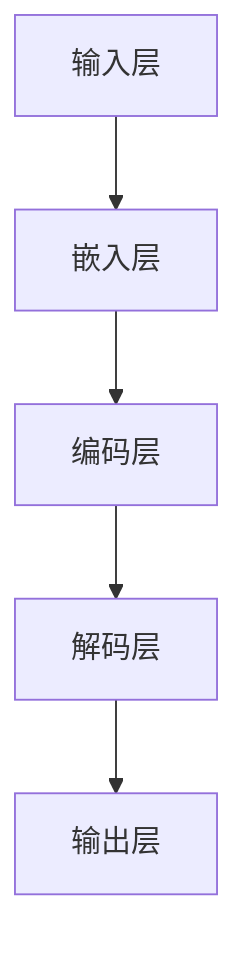
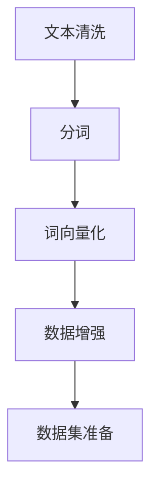
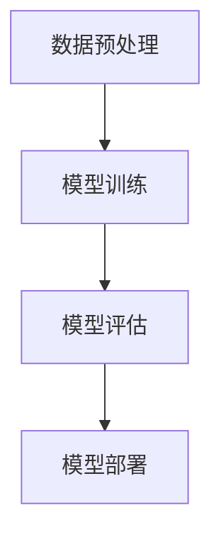
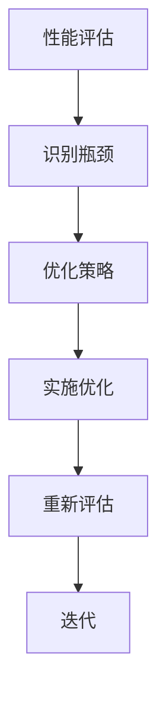

                 

### 文章标题：构建敏捷迭代的LLM工程技术架构

### 关键词：大型语言模型（LLM），敏捷迭代，工程技术架构，开发实践，性能优化，安全性

### 摘要：
本文旨在探讨如何在人工智能领域构建一个敏捷迭代的LLM工程技术架构。我们将从基础概念出发，逐步深入到LLM的核心算法原理，数学模型，以及工程化实践。通过详细讲解敏捷迭代理论，我们将展示如何在LLM工程中应用这一方法，从而提高开发效率与系统性能。文章还将讨论部署与运维、性能优化、安全性与隐私保护等关键技术问题，并以实际案例进行分析。最终，本文将总结最佳实践，为未来的研究和应用提供指导。

## 第一部分: LLM技术基础

### 1.1 LLM核心概念介绍

#### 什么是LLM

大型语言模型（Large Language Model，简称LLM）是一种基于深度学习技术构建的文本处理模型，它通过学习海量的文本数据，能够理解和生成自然语言。LLM具有强大的语言理解和生成能力，能够应用于自然语言处理（NLP）的各个领域，如机器翻译、文本生成、问答系统、对话系统等。

#### LLM的发展历程

LLM的发展可以追溯到1980年代，当时出现了如ELIZA等早期自然语言处理系统。然而，受限于计算能力和算法复杂性，这些系统效果有限。随着深度学习技术的发展，尤其是2018年GPT-2模型的推出，LLM的研究和应用迎来了新的高潮。如今，LLM已经成为人工智能领域的重要研究方向和应用方向。

### 1.2 LLM的原理与架构

#### Mermaid流程图：LLM的基本架构

下面是一个简单的Mermaid流程图，展示了LLM的基本架构：



- **输入层**：接收用户输入的文本。
- **嵌入层**：将输入文本转化为向量形式。
- **编码层**：对嵌入向量进行编码，提取语义信息。
- **解码层**：根据编码信息生成输出文本。
- **输出层**：输出最终的文本结果。

#### LLM的核心算法原理讲解

LLM的核心算法是基于变分自编码器（Variational Autoencoder，VAE）和生成对抗网络（Generative Adversarial Network，GAN）的结合。以下是伪代码示例：

```python
# VAE伪代码
def encode(x):
    z_mean = ... # 编码层的均值
    z_log_var = ... # 编码层的方差
    z = sample(z_mean, z_log_var)
    return z

def decode(z):
    x_mean = ... # 解码层的均值
    x = sample(x_mean)
    return x

def VAE(x):
    z = encode(x)
    x_hat = decode(z)
    return x_hat
```

#### 数学模型与公式

LLM的数学模型基于概率图模型，其中关键公式包括：

$$
p(z|x) = \mathcal{N}(z|\mu(x), \sigma^2(x))
$$

$$
p(x|z) = \mathcal{N}(x|\mu(z), \sigma^2(z))
$$

其中，\( z \) 表示编码后的隐变量，\( x \) 表示输入的文本数据，\( \mu(x) \) 和 \( \sigma^2(x) \) 分别为编码层的均值和方差。

#### 详细讲解与举例

这些公式描述了LLM如何通过概率分布来编码和解码文本数据。在训练过程中，模型通过最小化损失函数来调整参数，以优化模型的性能。以下是具体的损失函数示例：

$$
\mathcal{L} = -\sum_{i=1}^{N} \log p(x_i|z_i) - D_{KL}(p(z|x)||p(z))
$$

其中，\( N \) 表示训练样本的数量，\( D_{KL} \) 表示KL散度，用于衡量两个概率分布的差异。

### 1.3 数据集与预处理

#### 常见数据集介绍

- **WikiText-2**：来自维基百科的文本数据集，包含约2.5亿词。
- **Common Crawl**：一个大规模的网页数据集，包含超过10亿个网页的文本。
- **Gutenberg**：来自Project Gutenberg的文本数据集，包含数千本书籍。

#### 数据预处理方法与技巧

数据预处理是构建LLM的重要环节，主要包括以下步骤：

1. **文本清洗**：去除HTML标签、特殊字符和停用词。
2. **分词**：将文本分割成单词或子词。
3. **词向量化**：将文本转化为向量表示。
4. **数据增强**：通过随机插入、替换、删除等操作增加数据的多样性。

#### 数据预处理流程



### 1.4 模型训练与优化

#### 模型训练流程

模型训练是构建LLM的关键步骤，主要包括以下环节：

1. **数据加载**：从预处理后的数据集中加载训练数据和验证数据。
2. **前向传播**：将输入数据通过模型进行前向传播，得到输出结果。
3. **损失计算**：计算模型的损失函数值，衡量模型的表现。
4. **反向传播**：根据损失函数计算梯度，更新模型参数。
5. **评估与调整**：在验证集上评估模型性能，根据评估结果调整训练参数。

#### 优化算法与调参技巧

常用的优化算法包括随机梯度下降（SGD）、Adam、Adagrad等。以下是Adam优化器的伪代码：

```python
# Adam优化器伪代码
def update_parameters(params, gradients, t):
    m_t = beta1 * m_{t-1} + (1 - beta1) * gradients
    v_t = beta2 * v_{t-1} + (1 - beta2) * (gradients ** 2)
    m_hat_t = m_t / (1 - beta1 ** t)
    v_hat_t = v_t / (1 - beta2 ** t)
    params -= learning_rate * m_hat_t / (sqrt(v_hat_t) + epsilon)
    return params
```

#### 调参技巧

1. **学习率调整**：选择合适的学习率，可以通过使用学习率衰减策略来避免梯度消失或爆炸。
2. **批次大小**：选择适当的批次大小，以平衡计算效率和模型性能。
3. **正则化**：使用L1、L2正则化来防止过拟合。

## 第二部分: LLM工程技术实践

### 2.1 LLM工程化开发

#### 开发流程与工具链

LLM工程化开发涉及多个环节，包括数据预处理、模型训练、模型评估、模型部署等。以下是开发流程的Mermaid流程图：



#### 持续集成与持续部署

持续集成（CI）和持续部署（CD）是LLM工程开发的重要实践，有助于确保模型的高质量和快速迭代。以下是CI/CD流程的伪代码：

```python
# CI/CD伪代码
def run_tests():
    # 运行模型测试
    pass

def deploy_model():
    # 部署模型到生产环境
    pass

def ci_cd流程():
    if run_tests() == "成功":
        deploy_model()
    else:
        print("测试失败，模型部署中止")
```

### 2.2 LLM部署与运维

#### 部署策略与架构设计

LLM部署涉及到将训练好的模型部署到生产环境中，并提供高性能的服务。以下是常见的部署策略：

1. **微服务架构**：将模型部署为微服务，以提高系统的可扩展性和容错性。
2. **容器化**：使用容器（如Docker）来封装模型和服务，以便于部署和迁移。
3. **分布式部署**：将模型部署到多个服务器上，以实现负载均衡和高可用性。

#### 运维挑战与解决方案

LLM运维面临的主要挑战包括：

1. **性能监控**：监控模型的运行性能，确保其稳定性和高效性。
2. **故障处理**：快速定位和处理模型故障，以减少对用户的影响。
3. **资源调度**：根据业务需求动态调整资源分配，以优化模型性能。

解决方案包括：

1. **性能监控工具**：使用性能监控工具（如Prometheus、Grafana）来实时监控模型性能。
2. **自动化运维**：使用自动化工具（如Ansible、Kubernetes）来自动化部署和运维流程。
3. **弹性伸缩**：根据负载情况动态调整服务器数量和资源分配，以实现弹性伸缩。

### 2.3 LLM性能优化

#### 性能评估指标

LLM性能优化需要使用一系列评估指标，包括：

1. **准确性**：模型输出的文本与真实文本的匹配程度。
2. **流畅性**：模型生成的文本是否流畅自然。
3. **多样性**：模型生成的文本是否具有多样性。

#### 性能优化方法与技巧

1. **模型压缩**：使用模型压缩技术（如剪枝、量化）来减少模型大小，提高推理速度。
2. **模型融合**：将多个模型融合为一个，以提高模型性能和鲁棒性。
3. **分布式训练**：使用分布式训练技术（如DataParallel、Horovod）来加速模型训练。

#### 优化流程



### 2.4 LLM安全性与隐私保护

#### 安全性问题分析

LLM在应用过程中可能面临以下安全问题：

1. **数据泄露**：模型训练和推理过程中可能泄露敏感数据。
2. **模型篡改**：恶意用户可能通过输入特定文本来篡改模型输出。
3. **黑盒攻击**：攻击者无法获取模型内部结构，但可以通过输入特定样本来攻击模型。

#### 隐私保护策略与实践

1. **数据加密**：对敏感数据进行加密存储和传输。
2. **差分隐私**：在模型训练和推理过程中引入噪声，以保护用户隐私。
3. **模型签名**：为模型输出添加签名，确保模型输出的真实性。

## 第三部分: 敏捷迭代方法在LLM工程中的应用

### 2.5 敏捷迭代理论概述

#### 敏捷迭代的核心原则

敏捷迭代是一种以用户需求为导向的开发方法，其核心原则包括：

1. **快速迭代**：通过短期迭代周期快速交付可用的产品功能。
2. **用户反馈**：及时获取用户反馈，以指导后续迭代。
3. **持续集成**：确保代码质量和系统稳定性，快速响应变更。
4. **团队协作**：通过跨职能团队的合作，提高开发效率。

#### 敏捷迭代与传统开发方法的对比

敏捷迭代与传统开发方法（如瀑布模型）相比，具有以下优势：

1. **灵活性**：敏捷迭代能够快速响应需求变化，而传统方法往往在需求确定后才开始开发。
2. **用户参与**：敏捷迭代强调用户参与，用户可以实时看到产品进展，并提供反馈。
3. **持续改进**：敏捷迭代过程中，团队不断优化开发流程和产品功能。

### 2.6 敏捷迭代在LLM工程中的应用

#### 敏捷迭代流程与模型迭代策略

在LLM工程中，敏捷迭代流程可以概括为以下步骤：

1. **需求分析**：明确用户需求，确定模型功能目标。
2. **数据准备**：收集和预处理数据，为模型训练做准备。
3. **模型设计**：设计模型架构，选择合适的算法和框架。
4. **模型训练**：使用训练数据训练模型，并进行调参优化。
5. **模型评估**：在验证集上评估模型性能，确保达到预期目标。
6. **部署上线**：将训练好的模型部署到生产环境，进行实际应用。
7. **用户反馈**：收集用户反馈，进行后续迭代优化。

#### 敏捷迭代的工具与最佳实践

1. **版本控制工具**：如Git，用于管理代码和模型版本。
2. **自动化测试**：使用自动化测试工具（如JUnit、Selenium）确保模型稳定性和可靠性。
3. **敏捷开发框架**：如Scrum、Kanban，用于管理迭代过程和任务分配。

### 2.7 案例研究

#### 案例一：某企业LLM工程化实践

某企业在构建LLM系统时，采用敏捷迭代方法进行开发。以下是该案例的详细分析：

1. **需求分析**：企业明确了构建一个能够处理海量文本数据的智能问答系统的需求。
2. **数据准备**：企业收集了大量的企业内部文档、用户问答记录等数据，并进行了预处理。
3. **模型设计**：选择了基于BERT的模型架构，并使用TensorFlow作为开发框架。
4. **模型训练**：使用预处理后的数据对模型进行训练，并进行多次调参优化。
5. **模型评估**：在验证集上评估模型性能，达到了较高的准确性和流畅性。
6. **部署上线**：将训练好的模型部署到生产环境，并通过API接口提供服务。
7. **用户反馈**：收集用户反馈，发现模型在部分场景下存在理解误差，进行了再次迭代优化。

#### 案例二：敏捷迭代在LLM开发中的成功应用

某AI研究团队在开发一款智能客服系统时，采用敏捷迭代方法。以下是该案例的详细分析：

1. **需求分析**：团队明确了开发一个能够自动回答用户常见问题的客服系统。
2. **数据准备**：团队收集了大量的用户问题和答案，并进行了预处理。
3. **模型设计**：选择了基于GPT-3的模型架构，并使用Python和PyTorch进行开发。
4. **模型训练**：使用预处理后的数据对模型进行训练，并进行了多次迭代优化。
5. **模型评估**：在验证集上评估模型性能，结果显示模型在多样性和准确性方面都有显著提升。
6. **部署上线**：将训练好的模型部署到生产环境，并通过Web接口提供服务。
7. **用户反馈**：用户反馈良好，系统成功提升了客服效率，并降低了人力成本。

## 附录

### A.1 工程技术资源汇总

1. **开源框架与工具**
   - TensorFlow：用于构建和训练深度学习模型。
   - PyTorch：用于构建和训练深度学习模型。
   - BERT：用于构建大型语言模型。
   - Hugging Face：用于自然语言处理任务。
2. **开发环境搭建指南**
   - 搭建TensorFlow环境：https://www.tensorflow.org/install
   - 搭建PyTorch环境：https://pytorch.org/get-started/locally/
   - 搭建BERT环境：https://github.com/google-research/bert

### A.2 进一步学习资源

1. **相关书籍与论文推荐**
   - 《深度学习》（Goodfellow, Bengio, Courville）
   - 《自然语言处理实战》（Peter Harrington）
   - “Attention Is All You Need”（Vaswani et al., 2017）
   - “BERT: Pre-training of Deep Bidirectional Transformers for Language Understanding”（Devlin et al., 2019）
2. **在线课程与培训资源**
   - Coursera：深度学习课程
   - edX：自然语言处理课程
   - fast.ai：深度学习课程

## 文章小结

本文详细介绍了构建敏捷迭代的LLM工程技术架构的方法和实践。从LLM的核心概念、算法原理，到工程化实践和敏捷迭代方法，本文覆盖了构建高效、可靠的LLM系统所需的关键技术和方法。通过实际案例的分析，本文展示了敏捷迭代在LLM工程中的应用效果。未来的研究和应用可以在此基础上，进一步探索LLM技术的新应用场景和优化方法。

## 注意事项与拓展阅读

1. **注意事项**：
   - 在模型训练过程中，确保数据质量和多样性，以避免过拟合。
   - 在部署模型时，注意性能优化和安全防护，确保系统稳定可靠。
   - 定期更新模型，以适应新的数据和环境变化。

2. **拓展阅读**：
   - 探索基于GAN的LLM生成模型。
   - 学习如何使用深度强化学习优化LLM。
   - 研究跨语言的LLM模型和应用。

作者：AI天才研究院/AI Genius Institute & 禅与计算机程序设计艺术 /Zen And The Art of Computer Programming

