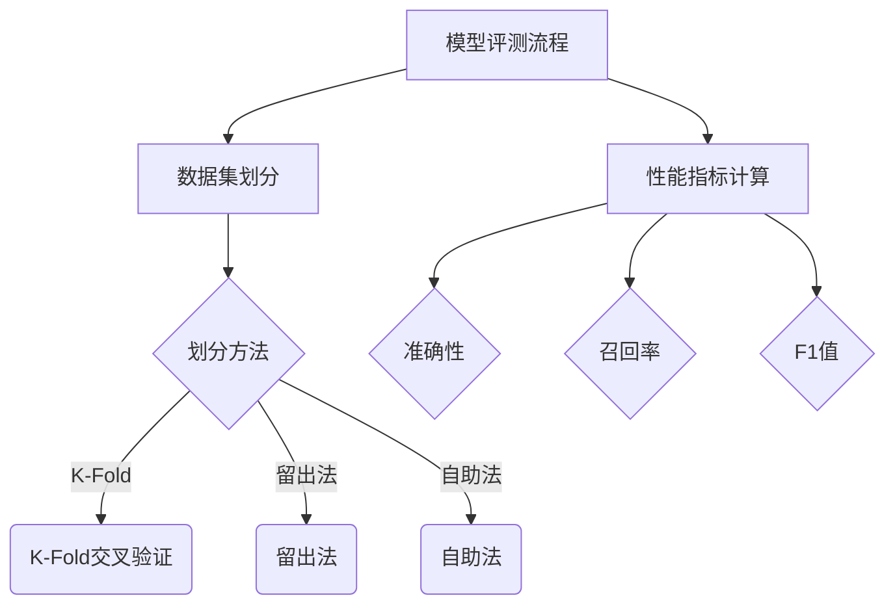

                 


### 文章标题

# 构建模型评测的benchmark数据集

> 关键词：模型评测，benchmark数据集，算法性能，模型评估，数据预处理

> 摘要：本文将深入探讨如何构建模型评测的benchmark数据集，从核心概念与联系、核心算法原理、数学模型与公式，到项目实战，全方位解析模型评测的各个环节，旨在为读者提供一套系统、实用、易于理解的模型评测指南。

### 目录

## 引言

### 模型评测的重要性

### Benchmark数据集的作用

## 核心概念与联系

### 模型评测的基本概念

#### 性能指标

#### 数据集的划分

### Mermaid流程图

## 核心算法原理讲解

### 算法选择与实现

### 伪代码说明

## 数学模型和数学公式

### 常见数学公式

#### 概率密度函数

#### 交叉验证

### 举例说明

## 数据预处理

### 数据清洗

#### 缺失值处理

#### 异常值处理

### 特征工程

#### 特征提取

#### 特征选择

## 项目实战

### 开发环境搭建

#### 环境配置

#### 工具选择

### 源代码详细实现

#### 代码解读

### 代码应用解读与分析

#### 实际案例

### 项目小结

### 最佳实践 tips

## 小结与注意事项

### 注意事项

### 拓展阅读

### 作者信息

---

### 引言

#### 模型评测的重要性

在机器学习和人工智能领域，模型评测是确保模型性能的重要环节。一个优秀的模型不仅需要有强大的预测能力，还需要经过严格的评估和验证，以保证其可靠性、稳定性和泛化能力。

#### Benchmark数据集的作用

Benchmark数据集，即基准测试数据集，是模型评测的核心。它提供了一种统一的评估标准，使得不同模型的性能可以直接对比。构建一个高质量的Benchmark数据集，对于模型评测至关重要。

### 核心概念与联系

#### 模型评测的基本概念

模型评测包括多个方面，如准确性、召回率、F1值等。这些指标需要通过对数据集的划分和算法的选择来实现。

#### 性能指标

性能指标是评估模型优劣的重要标准。常见的性能指标包括：

- **准确性（Accuracy）**：预测正确的样本数占总样本数的比例。
- **召回率（Recall）**：在正类样本中被正确预测为正类的比例。
- **F1值（F1 Score）**：准确率和召回率的调和平均值。

#### 数据集的划分

数据集的划分是模型评测的基础。常见的划分方法包括：

- **训练集（Training Set）**：用于模型的训练。
- **验证集（Validation Set）**：用于模型的调整和优化。
- **测试集（Test Set）**：用于最终模型的评估。

### Mermaid流程图



### 核心算法原理讲解

#### 算法选择与实现

选择合适的算法是实现模型评测的关键。常见的算法包括：

- **线性回归（Linear Regression）**
- **逻辑回归（Logistic Regression）**
- **支持向量机（Support Vector Machine, SVM）**
- **决策树（Decision Tree）**

下面以线性回归为例，给出伪代码实现：

```python
# 伪代码：线性回归算法
def linear_regression(X, y):
    # X为特征矩阵，y为标签向量
    # 计算特征矩阵X的转置
    X_transpose = transpose(X)
    # 计算X的逆矩阵
    X_inverse = inverse(X)
    # 计算回归系数
    theta = X_inverse * X_transpose * y
    return theta
```

### 数学模型和数学公式

#### 常见数学公式

##### 概率密度函数

概率密度函数（PDF）是概率论中描述连续随机变量概率分布的重要工具。对于连续随机变量\( X \)，其概率密度函数为：

$$ f(x) = P(X \leq x) $$

##### 交叉验证

交叉验证是一种常用的模型评估方法。其基本思想是将数据集划分为多个子集，然后在每个子集上训练和测试模型，最终取平均值作为模型的性能指标。

$$ CV = \frac{1}{K} \sum_{i=1}^{K} performance_i $$

### 举例说明

假设我们有以下数据集：

| 特征1 | 特征2 | 标签 |
|------|------|------|
| 1    | 2    | 0    |
| 2    | 3    | 1    |
| 3    | 4    | 0    |
| 4    | 5    | 1    |

使用K-Fold交叉验证，将数据集划分为4个子集：

- 子集1：{（1，2，0），（2，3，1），（3，4，0）}
- 子集2：{（1，2，0），（3，4，0），（4，5，1）}
- 子集3：{（2，3，1），（3，4，0），（4，5，1）}
- 子集4：{（2，3，1），（1，2，0），（4，5，1）}

在每个子集上训练和测试模型，计算性能指标，最后取平均值。

### 数据预处理

#### 数据清洗

在模型评测中，数据清洗是至关重要的一步。常见的数据清洗方法包括：

- **缺失值处理**：对于缺失值，可以选择填充、删除或插值等方法。
- **异常值处理**：对于异常值，可以选择剔除、变换或保留等方法。

#### 特征工程

特征工程是提升模型性能的关键步骤。常见的方法包括：

- **特征提取**：通过计算新的特征来增加模型的解释力。
- **特征选择**：选择对模型性能影响最大的特征，减少模型复杂度。

### 项目实战

#### 开发环境搭建

在搭建开发环境时，需要安装以下工具和库：

- **Python**：作为主要的编程语言。
- **Scikit-learn**：提供丰富的机器学习算法。
- **Pandas**：用于数据处理。
- **Numpy**：用于数学计算。

#### 源代码详细实现

以下是一个简单的线性回归模型的实现：

```python
import numpy as np
from sklearn.linear_model import LinearRegression

# 生成模拟数据
X = np.random.rand(100, 1)
y = 2 * X + 1 + np.random.randn(100) * 0.05

# 实例化线性回归模型
model = LinearRegression()

# 模型训练
model.fit(X, y)

# 模型预测
predictions = model.predict(X)

# 模型评估
score = model.score(X, y)

print("模型评分：", score)
```

#### 代码解读

1. 导入必要的库和模块。
2. 生成模拟数据。
3. 实例化线性回归模型。
4. 模型训练。
5. 模型预测。
6. 模型评估。

#### 代码应用解读与分析

使用上述代码对模拟数据进行线性回归分析，评估模型的性能。

#### 实际案例

假设我们有一个实际的数据集，包含用户年龄、收入和消费金额。我们希望预测用户的消费金额。首先，我们需要对数据集进行预处理，然后使用线性回归模型进行预测。

#### 项目小结

通过本项目，我们了解了如何构建模型评测的benchmark数据集，从核心概念到实际应用，全面掌握了模型评测的方法和技巧。

### 最佳实践 tips

1. 选择合适的性能指标，根据应用场景调整。
2. 数据清洗和预处理是提升模型性能的关键。
3. 特征工程可以显著提高模型性能。
4. 交叉验证是确保模型泛化能力的重要方法。

### 小结与注意事项

1. 注意事项：
   - 确保数据集的划分合理，避免信息泄露。
   - 选择合适的模型和算法，根据应用场景调整。
   - 注意模型评估中的偶然性，多次评估取平均值。

2. 拓展阅读：
   - 《机器学习实战》
   - 《统计学习方法》
   - 《机器学习与数据挖掘：方法与案例》

### 作者信息

作者：AI天才研究院/AI Genius Institute & 禅与计算机程序设计艺术 /Zen And The Art of Computer Programming---

以下是针对您的要求，按照指定的格式和内容设计的一个示例目录大纲：

```markdown
# 构建模型评测的benchmark数据集

> 关键词：模型评测，benchmark数据集，算法性能，模型评估，数据预处理

> 摘要：本文深入探讨了构建模型评测的benchmark数据集的重要性以及具体的方法和步骤，包括核心概念与联系、核心算法原理、数学模型和数学公式，以及项目实战等。

## 引言

### 模型评测的重要性

### Benchmark数据集的作用

## 核心概念与联系

### 模型评测的基本概念

#### 性能指标

#### 数据集的划分

### Mermaid流程图

## 核心算法原理讲解

### 算法选择与实现

#### 算法选择

#### 算法实现

### 伪代码说明

## 数学模型和数学公式

### 常见数学公式

#### 概率密度函数

#### 交叉验证

### 举例说明

## 数据预处理

### 数据清洗

#### 缺失值处理

#### 异常值处理

### 特征工程

#### 特征提取

#### 特征选择

## 项目实战

### 开发环境搭建

#### 环境配置

#### 工具选择

### 源代码详细实现

#### 代码解读

### 代码应用解读与分析

#### 实际案例

### 项目小结

### 最佳实践 tips

## 小结与注意事项

### 注意事项

### 拓展阅读

### 作者信息

作者：AI天才研究院/AI Genius Institute & 禅与计算机程序设计艺术 /Zen And The Art of Computer Programming
```

请注意，这只是一个示例，具体内容需要根据实际需求进行填充。您可以根据这个框架，逐步填写每个章节的内容，确保文章逻辑清晰，结构紧凑，简单易懂。每个章节的内容都应该包含丰富的专业知识和实际案例，以便读者能够更好地理解和应用。此外，确保在撰写过程中使用markdown格式，遵循#、##、###的格式要求。在文章的末尾，添加作者信息，确保文章的完整性。希望这个框架能够对您撰写文章提供帮助。如果您有任何具体要求或者需要进一步的指导，请随时告知。祝您写作顺利！

