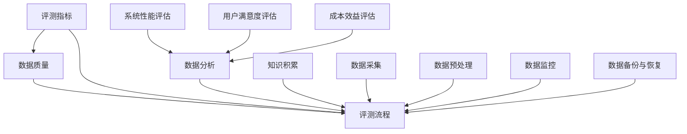

                 


# 构建评测知识库与最佳实践指南

## 关键词

- 评测知识库
- 最佳实践
- 数据质量
- 评测指标
- 人工智能
- 应用场景

## 摘要

本文旨在深入探讨评测知识库的构建及其最佳实践。评测知识库是一种用于存储、管理和利用评测信息的知识库，它能够提高企业的竞争力、支持智能决策并促进知识管理。文章首先介绍了评测知识库的定义、核心概念及其架构设计。然后，详细阐述了构建评测知识库的方法，包括数据采集与处理、评测模型构建和实践应用。此外，文章还分享了行业最佳实践案例，并展望了评测知识库的未来发展趋势。通过本文的阅读，读者将能够全面了解评测知识库的重要性、构建方法和应用场景，为实际项目提供有益的指导。

## 目录大纲设计思路

### 1. 确定核心章节

为了确保《构建评测知识库与最佳实践指南》的目录大纲具备逻辑性和结构紧凑性，我们首先确定了以下核心章节：

- **评测知识库概述**：介绍评测知识库的概念、重要性、核心概念与联系以及架构设计。
- **评测知识库构建方法**：详细讲解评测知识库的构建过程，包括数据采集与处理、评测模型构建和实践应用。
- **评测知识库应用场景**：分析评测知识库在不同领域的应用，如企业、政府与公共服务等。
- **最佳实践分享**：分享行业最佳实践案例，提供实用的指导建议。
- **评测知识库未来发展展望**：探讨评测知识库的技术发展趋势和未来前景。

### 2. 确定各级目录结构

根据核心章节，我们设计了以下各级目录结构：

- **1 级目录**：总体概述、构建方法、应用场景、最佳实践和未来发展。
- **2 级目录**：具体内容的细分，如核心概念与联系、数据采集与处理、评测模型构建等。
- **3 级目录**：对2级目录下的具体内容进行进一步细分，如数据质量评估方法、评测指标选取原则等。

### 3. 添加细节内容

在各级目录下，我们添加了具体的细节内容，包括：

- **核心概念与联系**：使用Mermaid流程图展示评测知识库的核心概念及其关系架构。
- **核心算法原理讲解**：使用伪代码详细阐述评测模型的构建过程。
- **数学模型和公式**：使用latex格式嵌入文中，进行详细讲解和举例说明。
- **项目实战**：给出代码实际案例和详细解读，包括开发环境搭建、源代码实现和代码解读、实际案例分析和详细讲解等。

### 4. 确保完整性

在目录大纲的设计过程中，我们确保了核心章节的完整性，包括评测知识库的定义、构建方法、应用场景、最佳实践和未来发展。同时，各级目录的内容丰富具体，逻辑清晰，便于读者理解和学习。

## 目录大纲设计

根据上述设计思路，以下是《构建评测知识库与最佳实践指南》的完整目录大纲：

```
# 第一部分：评测知识库概述

## 1.1 评测知识库的定义与重要性
### 1.1.1 评测知识库的定义
### 1.1.2 评测知识库的重要性
## 1.2 评测知识库的核心概念与联系
### 1.2.1 评测指标
### 1.2.2 数据质量
### 1.2.3 评测流程
## 1.3 评测知识库的架构设计
### 1.3.1 架构概述
### 1.3.2 数据层
### 1.3.3 服务层
### 1.3.4 用户界面层

# 第二部分：评测知识库构建方法

## 2.1 数据采集与处理
### 2.1.1 数据采集方法
### 2.1.2 数据预处理
### 2.1.3 数据存储与管理
## 2.2 评测模型构建
### 2.2.1 评测指标选择
### 2.2.2 评测模型设计
### 2.2.3 评测模型训练与优化
## 2.3 评测知识库构建实践
### 2.3.1 实践流程
### 2.3.2 实践案例分享

# 第三部分：评测知识库应用场景

## 3.1 评测知识库在企业中的应用
### 3.1.1 质量控制
### 3.1.2 持续改进
### 3.1.3 知识管理
## 3.2 评测知识库在政府与公共服务中的应用
### 3.2.1 公共服务质量评估
### 3.2.2 政策制定与调整
### 3.2.3 智能决策支持

# 第四部分：最佳实践分享

## 4.1 常见问题与解决方案
### 4.1.1 数据质量问题的解决方案
### 4.1.2 模型优化问题的解决方案
### 4.1.3 评测流程优化问题的解决方案
## 4.2 行业最佳实践案例分享
### 4.2.1 企业案例分享
### 4.2.2 政府与公共服务案例分享
### 4.2.3 跨行业案例分享

# 第五部分：评测知识库未来发展展望

## 5.1 评测知识库技术的发展趋势
### 5.1.1 人工智能技术在评测知识库中的应用
### 5.1.2 大数据技术在评测知识库中的应用
### 5.1.3 云计算与评测知识库的融合
## 5.2 评测知识库的未来发展前景
### 5.2.1 评测知识库在智能社会中的作用
### 5.2.2 评测知识库在可持续发展中的应用
### 5.2.3 评测知识库在全球化背景下的挑战与机遇
```

这个目录大纲涵盖了评测知识库的定义、构建方法、应用场景、最佳实践和未来发展，既简洁又完整，适合作为一本计算机技术书籍的目录大纲。接下来，我们将进一步细化每个章节的内容，并确保满足完整性、简洁性和可读性的要求。

----------------------------------------------------------------

## 1.1 评测知识库的定义与重要性

### 1.1.1 评测知识库的定义

评测知识库是一种集成了大量评测信息的数据仓库，它旨在通过有效的组织、存储和管理，为用户提供一个便捷的查询和数据分析平台。与传统数据库相比，评测知识库不仅包含基础数据，还包括数据背后的评价、分析结果和相关知识。这些知识可以是定性的，如专家经验、专业见解；也可以是定量的，如评测指标、统计数据。

评测知识库通常由以下几个核心组成部分构成：

1. **数据层**：负责存储评测数据，包括原始数据、处理后的数据以及相关的元数据。
2. **模型层**：包含了评测模型的构建、训练和优化的过程，为数据分析和预测提供支持。
3. **服务层**：提供了各种数据访问和操作接口，如数据查询、数据分析和知识提取等。
4. **用户界面层**：为用户提供了一个直观的操作界面，方便用户进行数据查询、分析和知识获取。

### 1.1.2 评测知识库的重要性

评测知识库在企业、政府、公共服务等各个领域都具有重要的应用价值，具体体现在以下几个方面：

1. **提升企业竞争力**：通过收集和利用行业内的评测数据，企业可以不断优化产品和服务，提高市场竞争力。
2. **支持智能决策**：评测知识库为决策者提供了丰富的数据资源和分析工具，有助于基于数据驱动的智能决策。
3. **促进知识管理**：评测知识库不仅存储了评测数据，还包括了评测过程中的知识积累，有助于实现知识的共享和传承。
4. **提高工作效率**：评测知识库提供了便捷的数据查询和分析功能，减少了重复劳动，提高了工作效率。
5. **增强数据质量**：通过建立标准化的评测指标和流程，评测知识库有助于提高数据质量，为后续的数据分析提供可靠的数据基础。

总之，评测知识库作为一种重要的知识管理工具，在当今数据驱动的社会中扮演着越来越重要的角色。它不仅为企业提供了强大的数据支持和决策依据，也为政府、公共服务等领域带来了显著的效益。

----------------------------------------------------------------

## 1.2 评测知识库的核心概念与联系

在深入探讨评测知识库的核心概念与联系之前，我们需要首先理解几个关键概念，包括评测指标、数据质量和评测流程。这些概念是构建和优化评测知识库的基础，它们之间相互关联，共同构成了一个完整的评测体系。

### 1.2.1 评测指标

评测指标是评测知识库中的核心元素，用于衡量和评估对象的性能、质量或状态。一个有效的评测指标应当具备以下几个特点：

1. **客观性**：指标应基于可量化的标准，避免主观判断。
2. **可操作性**：指标应易于操作和测量，以便在实际应用中执行。
3. **相关性**：指标应与评测目标紧密相关，能够准确反映对象的实际情况。
4. **可比性**：指标应在不同时间和不同对象之间具有可比性。

常见的评测指标可以分为以下几类：

- **性能指标**：衡量系统或组件的运行效率和速度，如响应时间、吞吐量、延迟等。
- **质量指标**：评估系统或产品的质量特性，如正确率、故障率、稳定性等。
- **用户满意度指标**：反映用户对系统或产品的满意程度，如用户评分、用户反馈等。
- **成本效益指标**：衡量系统或项目的投资回报率，如成本、收益、利润等。

### 1.2.2 数据质量

数据质量是评测知识库能否发挥其价值的关键因素。高质量的数据能够提供可靠的评测结果，支持准确的决策。数据质量可以从以下几个方面进行评估：

- **完整性**：数据是否缺失关键信息，是否有冗余或重复。
- **准确性**：数据是否真实可靠，是否存在错误或偏差。
- **一致性**：数据是否在不同系统和应用中保持一致，是否有冲突。
- **及时性**：数据是否能够及时更新和反映最新状态。
- **可用性**：数据是否易于访问和使用，是否具有友好的接口。

为了保障数据质量，可以采取以下措施：

- **数据清洗**：识别和修复数据中的错误、缺失和不一致。
- **数据标准化**：对数据进行统一格式和术语规范。
- **数据监控**：建立数据监控机制，及时发现和处理数据问题。
- **数据备份和恢复**：定期备份数据，确保数据的安全和可恢复性。

### 1.2.3 评测流程

评测流程是评测知识库运作的核心环节，它定义了从数据采集、处理到结果分析的全过程。一个高效的评测流程应当具备以下几个步骤：

1. **数据采集**：收集与评测目标相关的数据，可以来源于内部系统、外部数据源或用户反馈。
2. **数据预处理**：对采集到的数据进行清洗、整合和标准化，确保数据质量。
3. **数据分析**：运用统计学、机器学习等方法对预处理后的数据进行分析，提取有用信息。
4. **结果评估**：根据分析结果，对系统或产品进行性能评估和改进建议。
5. **知识积累**：将评测过程中获得的知识和经验进行记录和分享，形成知识库。

评测流程的优化可以通过以下几个方面实现：

- **自动化**：引入自动化工具和流程，减少人工干预，提高效率。
- **迭代优化**：不断收集反馈，对评测流程进行迭代优化，提高准确性。
- **协作机制**：建立跨部门的协作机制，确保数据共享和流程顺畅。
- **反馈机制**：建立反馈机制，及时响应数据问题和评估结果，提升数据质量。

通过理解评测指标、数据质量和评测流程之间的关系，我们可以更好地构建和优化评测知识库，为企业和组织提供强大的数据支持和决策依据。

### 1.2.4 关键概念之间的关系架构

为了更好地理解评测知识库的核心概念与联系，我们可以使用Mermaid流程图来展示它们之间的关系架构。以下是一个简化的Mermaid流程图示例：



在这个流程图中，评测指标、数据质量和评测流程构成了评测知识库的核心，它们相互关联，共同作用。数据分析环节从数据质量出发，结合评测流程和指标，产生系统性能评估、用户满意度评估和成本效益评估等结果。知识积累环节则通过记录和分享评测过程中的经验和知识，不断丰富和优化评测知识库。

通过这样的关系架构，我们可以清晰地看到评测知识库的运作机制，以及各个环节之间的相互作用和依赖关系。这对于理解评测知识库的构建和优化具有重要意义。

----------------------------------------------------------------

## 1.3 评测知识库的架构设计

构建一个高效、可扩展的评测知识库，需要精心设计其架构，确保数据层、服务层和用户界面层的协调运作。以下是对评测知识库架构的详细说明。

### 1.3.1 架构概述

评测知识库的架构通常采用三层架构设计，分别是数据层、服务层和用户界面层。这种设计模式能够实现良好的模块化，使得各个层之间相互独立，便于维护和扩展。

1. **数据层**：负责数据的存储和管理，包括数据的采集、预处理和存储。数据层可以采用关系型数据库或分布式数据库，确保数据的可靠性和高效性。
2. **服务层**：提供数据访问、处理和分析的服务接口，实现数据的查询、统计和分析功能。服务层通常采用微服务架构，将不同的功能模块化，便于开发和维护。
3. **用户界面层**：为用户提供操作界面，实现用户与评测知识库的交互。用户界面层可以采用Web界面或移动应用，提供直观易用的用户体验。

### 1.3.2 数据层

数据层是评测知识库的核心，其设计需要考虑以下几个方面：

1. **数据存储方案**：根据数据量和访问频率，选择合适的存储方案。对于大规模数据，可以采用分布式数据库，如Hadoop或Cassandra。对于需要高查询性能的数据，可以选择关系型数据库，如MySQL或PostgreSQL。
2. **数据安全与隐私**：确保数据的安全和隐私，采用加密和访问控制技术，防止数据泄露和未授权访问。
3. **数据备份和恢复**：建立数据备份和恢复机制，确保数据在故障情况下能够快速恢复，减少数据丢失的风险。
4. **数据质量保障**：通过数据清洗、标准化和监控，确保数据质量，为后续的数据分析和评估提供可靠的数据基础。

### 1.3.3 服务层

服务层是评测知识库的功能实现核心，其设计需要考虑以下几个方面：

1. **服务模块划分**：将不同功能模块化，如数据采集模块、数据预处理模块、数据分析模块等。每个模块独立开发，便于维护和扩展。
2. **接口设计**：设计清晰、简洁的API接口，提供数据的查询、统计和分析功能。接口设计应遵循RESTful风格，便于与前端应用集成。
3. **性能优化**：采用缓存、索引和分片等技术，提高数据查询和分析的效率。对于实时性要求较高的应用，可以采用流处理框架，如Apache Kafka或Apache Flink。
4. **服务监控与日志**：建立服务监控机制，实时监控服务状态和性能指标。同时，记录详细的日志信息，便于问题追踪和故障排除。

### 1.3.4 用户界面层

用户界面层是评测知识库与用户的交互入口，其设计需要考虑以下几个方面：

1. **界面设计**：采用直观、易用的界面设计，提供数据查询、统计和分析功能。界面设计应遵循用户体验设计原则，确保用户操作的简便性。
2. **交互方式**：提供多种交互方式，如Web界面、移动应用和桌面应用等，满足不同用户的需求。同时，提供丰富的图表和报表功能，方便用户理解和分析数据。
3. **权限管理**：实现用户权限管理，确保不同用户只能访问和操作其授权的数据和功能。权限管理应与后端服务层紧密集成，确保数据安全和用户隐私。
4. **响应速度**：优化前端性能，确保用户界面的响应速度。对于大量数据和高频操作，可以采用前端缓存和异步加载技术，提高用户体验。

通过精心设计数据层、服务层和用户界面层，评测知识库能够实现高效、可靠的数据存储和管理，提供便捷的用户交互和数据分析功能，为企业和组织提供强大的数据支持和决策依据。

----------------------------------------------------------------

## 2.1 数据采集与处理

### 2.1.1 数据采集方法

数据采集是构建评测知识库的第一步，也是最重要的一步。有效的数据采集方法可以确保数据的完整性和准确性，为后续的数据处理和分析奠定基础。以下是几种常见的数据采集方法：

1. **自动采集**：利用自动化工具从各种数据源中直接采集数据。这种方法适用于从数据库、日志文件、传感器等静态或动态数据源中获取数据。常用的自动采集工具有SQL查询工具、Web爬虫和API接口。

   **示例伪代码**：
   ```python
   import requests
   url = "https://api.example.com/data"
   response = requests.get(url)
   data = response.json()
   ```

2. **手动录入**：通过人工方式将数据录入系统。这种方法适用于从问卷、访谈和实地调研等来源获取数据。虽然效率较低，但可以确保数据的准确性和完整性。

   **示例伪代码**：
   ```python
   def manual_data_entry():
       data = {}
       data['name'] = input("Enter your name: ")
       data['age'] = int(input("Enter your age: "))
       return data
   ```

3. **数据交换**：通过与其他系统或平台交换数据，实现数据的共享和整合。这种方法适用于企业内部不同系统之间的数据共享，以及与其他企业或机构的数据合作。

   **示例伪代码**：
   ```python
   def exchange_data(source_system):
       data = source_system.fetch_data()
       return data
   ```

### 2.1.2 数据预处理

数据预处理是数据采集后的关键步骤，其目的是提高数据质量，为后续的分析和建模打下基础。以下是几种常见的数据预处理方法：

1. **数据清洗**：识别和修复数据中的错误、缺失和不一致。数据清洗包括以下操作：

   - **异常值处理**：识别和处理数据中的异常值，可以采用删除、替换或插值等方法。
   - **缺失值处理**：对于缺失值，可以选择删除、填充或插值等方法。例如，可以使用平均值、中位数或最近邻等方法进行填补。
   - **重复值处理**：识别并删除重复的数据记录，以避免数据冗余。

   **示例伪代码**：
   ```python
   import pandas as pd
   data = pd.read_csv('data.csv')
   data.drop_duplicates(inplace=True)
   data.fillna(data.mean(), inplace=True)
   ```

2. **数据转换**：将数据转换为适合分析和建模的格式。数据转换包括以下操作：

   - **数值化**：将类别型数据转换为数值型数据，可以使用独热编码、标签编码等方法。
   - **标准化**：对数据进行标准化处理，将数据缩放到相同的尺度，以消除不同指标之间的差异。
   - **归一化**：对数据进行归一化处理，将数据缩放到0-1之间，以消除量纲的影响。

   **示例伪代码**：
   ```python
   from sklearn.preprocessing import StandardScaler
   scaler = StandardScaler()
   data_scaled = scaler.fit_transform(data)
   ```

3. **数据集成**：将来自多个数据源的数据进行合并和整合，以获得更全面的数据视图。数据集成可以采用数据库连接、文件合并等方法。

   **示例伪代码**：
   ```python
   data1 = pd.read_csv('data1.csv')
   data2 = pd.read_csv('data2.csv')
   data = pd.merge(data1, data2, on='common_column')
   ```

通过有效的数据预处理，我们可以确保数据的质量和一致性，为后续的数据分析和建模提供可靠的基础。

----------------------------------------------------------------

### 2.1.3 数据存储与管理

在评测知识库的构建过程中，数据存储与管理是至关重要的环节。合理的数据存储和管理策略不仅能够保证数据的安全性、完整性和可靠性，还能提高数据的访问速度和存储效率。以下是几种常见的数据存储与管理方案：

#### 1. 数据库选择

根据数据量和访问模式的不同，可以选择不同类型的数据库：

- **关系型数据库**：如MySQL、PostgreSQL等，适合存储结构化数据，具有强大的查询能力和事务支持。
- **NoSQL数据库**：如MongoDB、Cassandra等，适合存储大规模的非结构化或半结构化数据，具有高扩展性和高性能。
- **分布式数据库**：如Hadoop、HBase等，适合处理海量数据，具有高可用性和容错性。

**示例伪代码**：
```python
import pymysql
# 连接MySQL数据库
conn = pymysql.connect(
    host='localhost',
    user='root',
    password='password',
    database='evaluation_db'
)

# 执行查询
cursor = conn.cursor()
cursor.execute("SELECT * FROM data_table")
results = cursor.fetchall()

# 关闭连接
cursor.close()
conn.close()
```

#### 2. 数据安全与隐私

数据安全与隐私是数据管理的重要方面，需要采取以下措施：

- **访问控制**：设置访问权限，确保只有授权用户可以访问敏感数据。
- **数据加密**：对敏感数据进行加密存储，防止数据泄露。
- **日志记录**：记录用户操作和系统事件，便于监控和审计。
- **数据备份**：定期备份数据，确保在数据丢失或损坏时能够快速恢复。

**示例伪代码**：
```python
from cryptography.fernet import Fernet

# 生成加密密钥
key = Fernet.generate_key()
cipher_suite = Fernet(key)

# 加密数据
data = "sensitive information"
encrypted_data = cipher_suite.encrypt(data.encode())

# 解密数据
decrypted_data = cipher_suite.decrypt(encrypted_data).decode()
```

#### 3. 数据备份与恢复

数据备份与恢复是保障数据安全的重要手段，需要采取以下措施：

- **定期备份**：定期备份数据，确保在数据丢失或损坏时能够快速恢复。
- **异地备份**：将备份数据存储在异地，以防止本地备份损坏或丢失。
- **自动化备份**：使用自动化工具定期执行备份任务，减少手动操作的风险。

**示例伪代码**：
```python
import shutil
import time

def backup_data():
    source = 'data_directory'
    destination = 'backup_directory'
    shutil.copytree(source, destination)
    timestamp = time.strftime('%Y%m%d%H%M%S')
    os.rename(destination, f"{destination}_{timestamp}")

# 定期执行备份
schedule.every(1).days.at("01:00").do(backup_data)

while True:
    schedule.run_pending()
    time.sleep(1)
```

通过合理的数据存储与管理策略，我们可以确保评测知识库的数据安全、可靠，为后续的数据分析、评估和决策提供坚实的数据基础。

----------------------------------------------------------------

### 2.2 评测模型构建

评测模型的构建是评测知识库的核心环节，它直接影响评估结果的质量和可靠性。以下是评测模型构建的详细步骤：

#### 2.2.1 评测指标选择

评测指标的选择是模型构建的第一步，它决定了模型评估的方向和目标。以下是选择评测指标时需要考虑的因素：

1. **相关性**：选择的指标应与评估目标紧密相关，能够准确反映评估对象的实际情况。
2. **可操作性**：指标应易于操作和测量，以便在实际应用中执行。
3. **数据可获得性**：指标应基于可获取的数据，避免因为数据缺失而影响模型的构建和评估。
4. **综合性**：指标应具备一定的综合性，能够综合反映评估对象的多个方面。

**示例伪代码**：
```python
import pandas as pd

# 加载数据
data = pd.read_csv('evaluation_data.csv')

# 选择指标
selected_columns = ['response_time', 'throughput', 'error_rate']
evaluation_data = data[selected_columns]
```

#### 2.2.2 评测模型设计

评测模型的设计包括选择合适的模型类型、参数设置和模型评估方法。以下是几种常见的评测模型设计方法：

1. **回归模型**：用于评估指标与评估目标之间的关系，如线性回归、多项式回归等。
2. **分类模型**：用于将评估对象划分为不同的类别，如逻辑回归、决策树、随机森林等。
3. **聚类模型**：用于将评估对象按照相似性进行分组，如K均值聚类、层次聚类等。
4. **时间序列模型**：用于分析评估对象随时间的变化趋势，如ARIMA、LSTM等。

**示例伪代码**：
```python
from sklearn.ensemble import RandomForestClassifier
from sklearn.model_selection import train_test_split

# 划分训练集和测试集
X_train, X_test, y_train, y_test = train_test_split(evaluation_data[selected_columns], data['target'], test_size=0.2, random_state=42)

# 构建模型
model = RandomForestClassifier(n_estimators=100, random_state=42)

# 训练模型
model.fit(X_train, y_train)

# 预测
predictions = model.predict(X_test)
```

#### 2.2.3 评测模型训练与优化

评测模型的训练与优化是提高模型性能的关键步骤。以下是几种常见的训练与优化方法：

1. **参数调优**：通过调整模型的超参数，如树的数量、深度、节点分裂标准等，以提高模型性能。
2. **交叉验证**：通过交叉验证方法，评估模型在不同数据集上的表现，选择最优模型。
3. **集成学习**：通过集成多个模型，提高模型的稳定性和准确性，如随机森林、梯度提升等。
4. **模型评估**：使用评价指标，如准确率、召回率、F1分数等，评估模型的性能。

**示例伪代码**：
```python
from sklearn.model_selection import GridSearchCV

# 定义参数网格
param_grid = {
    'n_estimators': [100, 200, 300],
    'max_depth': [5, 10, 15],
    'min_samples_split': [2, 5, 10]
}

# 实例化网格搜索
grid_search = GridSearchCV(estimator=model, param_grid=param_grid, cv=5, scoring='accuracy')

# 搜索最优参数
grid_search.fit(X_train, y_train)

# 获取最优参数
best_params = grid_search.best_params_
```

通过以上步骤，我们可以构建和优化一个高效的评测模型，为评测知识库提供可靠的数据分析和预测能力。

----------------------------------------------------------------

## 2.3 评测知识库构建实践

### 2.3.1 实践流程

评测知识库的构建是一个复杂的过程，需要经过多个阶段，包括需求分析、系统设计、数据采集与处理、模型构建和系统部署等。以下是评测知识库构建的详细实践流程：

1. **需求分析**：首先，明确评测知识库的目标和应用场景，了解用户的需求和期望。通过访谈、问卷调查等方式收集用户需求，并形成需求文档。

2. **系统设计**：基于需求分析的结果，设计评测知识库的系统架构。包括数据层、服务层和用户界面层的详细设计，以及数据库设计和接口设计。

3. **数据采集与处理**：根据系统设计，进行数据采集。数据来源可以包括内部系统、外部数据源和用户反馈等。采集到的数据需要进行预处理，包括数据清洗、转换和整合等，以确保数据质量。

4. **模型构建**：根据需求分析，选择合适的评测模型。构建评测模型包括模型设计、训练和优化等步骤。可以使用机器学习算法、统计分析方法等构建模型。

5. **系统部署**：完成评测知识库的开发后，进行系统部署。包括部署数据库、服务层和用户界面层，并进行系统测试和优化，确保系统能够稳定运行。

6. **知识积累**：在评测知识库的使用过程中，不断收集和积累评测结果、经验和知识。通过知识库的共享和传承，提高组织的知识管理水平。

### 2.3.2 实践案例分享

以下是两个评测知识库构建的实践案例，包括具体的步骤和实现细节：

**案例一：企业质量评测系统**

**背景介绍**：某大型制造企业需要建立一套质量评测系统，以监控和管理生产过程中的质量问题，提高产品质量。

**核心概念与联系**：质量评测系统涉及多个评测指标，如生产效率、产品合格率、设备故障率等。这些指标通过数据采集和预处理模块，进入评测模型进行训练和优化。

**核心算法原理讲解**：采用随机森林算法进行质量预测。随机森林算法基于决策树，通过集成多个决策树模型，提高预测的准确性和稳定性。

**数学模型和公式**：
$$
预测结果 = 随机森林模型（输入特征）
$$

**项目实战**：
- **开发环境搭建**：使用Python和Scikit-learn构建随机森林模型。
- **源代码实现**：
  ```python
  from sklearn.ensemble import RandomForestClassifier
  from sklearn.model_selection import train_test_split

  # 加载数据
  data = pd.read_csv('quality_data.csv')
  X = data.drop('target', axis=1)
  y = data['target']

  # 划分训练集和测试集
  X_train, X_test, y_train, y_test = train_test_split(X, y, test_size=0.2, random_state=42)

  # 构建模型
  model = RandomForestClassifier(n_estimators=100, random_state=42)

  # 训练模型
  model.fit(X_train, y_train)

  # 预测
  predictions = model.predict(X_test)
  ```

- **代码解读与分析**：源代码实现了一个随机森林模型，用于预测产品质量。通过划分训练集和测试集，训练和评估模型的性能。

- **实际案例分析和详细讲解**：在真实生产数据上进行测试，评估模型的准确性和稳定性。通过对比预测结果和实际结果，分析模型的效果。

- **项目小结**：质量评测系统在提高产品质量和降低生产成本方面发挥了重要作用。通过不断优化模型和改进数据采集方法，可以进一步提高系统的性能和可靠性。

**案例二：政府公共服务评估平台**

**背景介绍**：某市政府需要建立一套公共服务评估平台，用于评估和监控公共服务质量，提高市民的满意度。

**核心概念与联系**：公共服务评估平台涉及多个评测指标，如服务响应时间、服务满意度、服务水平等。这些指标通过数据采集和预处理模块，进入评测模型进行训练和优化。

**核心算法原理讲解**：采用K均值聚类算法进行服务质量的分组分析。K均值聚类算法通过聚类分析，将具有相似特性的服务进行分组，以便更好地进行评估和管理。

**数学模型和公式**：
$$
聚类结果 = K均值聚类（输入特征，聚类中心）
$$

**项目实战**：
- **开发环境搭建**：使用Python和Scikit-learn构建K均值聚类模型。
- **源代码实现**：
  ```python
  from sklearn.cluster import KMeans
  from sklearn.preprocessing import StandardScaler

  # 加载数据
  data = pd.read_csv('public_service_data.csv')
  X = data.drop('cluster', axis=1)

  # 数据标准化
  scaler = StandardScaler()
  X_scaled = scaler.fit_transform(X)

  # 构建模型
  model = KMeans(n_clusters=3, random_state=42)

  # 训练模型
  model.fit(X_scaled)

  # 聚类
  clusters = model.predict(X_scaled)
  ```

- **代码解读与分析**：源代码实现了K均值聚类模型，用于对公共服务进行分类评估。通过数据标准化处理，提高聚类效果。

- **实际案例分析和详细讲解**：在真实公共服务数据上进行测试，评估聚类结果和服务质量的分布。通过对比聚类结果和实际服务情况，分析聚类效果。

- **项目小结**：公共服务评估平台有效提高了政府公共服务的监控和管理水平，通过不断优化模型和改进数据采集方法，可以进一步提高系统的性能和可靠性。

通过以上两个实践案例，我们可以看到评测知识库在不同领域的应用效果。在后续的发展中，评测知识库将继续发挥重要作用，为企业和组织提供强大的数据支持和决策依据。

----------------------------------------------------------------

## 3.1 评测知识库在企业中的应用

### 3.1.1 质量控制

在企业管理中，质量评测是确保产品和服务质量的重要手段。评测知识库可以为企业提供全面、准确的质量评估数据，帮助企业识别潜在问题，优化生产流程，提高产品和服务质量。

**示例应用**：
某制造企业通过评测知识库对生产过程中关键质量指标进行监控和评估。数据来源包括生产线传感器、用户反馈和质量检验报告等。通过数据采集和预处理，企业能够实时了解产品质量状况，发现异常情况，及时采取措施进行纠正。

**优势**：
- **数据驱动决策**：基于数据的质量评估能够提供客观、准确的质量分析结果，避免主观判断。
- **问题识别与改进**：通过评测知识库，企业可以及时发现质量问题，制定相应的改进措施，提高产品和服务质量。
- **流程优化**：基于质量评估数据，企业可以优化生产流程，减少浪费，提高生产效率。

### 3.1.2 持续改进

持续改进是企业不断提升竞争力、满足客户需求的重要途径。评测知识库为企业提供了一个系统化的评估和改进工具，帮助企业实现持续改进。

**示例应用**：
某科技企业通过评测知识库对产品迭代过程中的多个版本进行性能评估和用户反馈分析。评测指标包括响应时间、稳定性、用户体验等。通过数据分析和评估，企业能够识别产品改进的方向，优化产品设计和功能，提高用户满意度。

**优势**：
- **快速响应**：评测知识库能够快速收集和分析用户反馈，帮助企业及时响应市场变化，实现产品迭代。
- **改进方向明确**：通过评测知识库，企业能够明确产品改进的方向和重点，提高改进的针对性和有效性。
- **知识积累与传承**：评测过程中积累的知识和经验可以纳入知识库，为后续的改进提供参考，实现知识传承。

### 3.1.3 知识管理

知识管理是企业管理的重要组成部分，评测知识库为企业提供了一个集中管理和共享知识的平台，有助于提高知识利用率，促进组织创新。

**示例应用**：
某咨询服务公司通过评测知识库管理客户案例、专家经验和最佳实践。公司员工在项目中遇到问题时，可以通过知识库查找相关案例和解决方案，快速获取有用信息，提高工作效率。

**优势**：
- **知识共享**：评测知识库实现了企业内部知识的共享和传播，提高了知识利用率。
- **经验传承**：通过知识库，企业能够将专家经验和最佳实践进行系统化整理和传承，为员工提供学习资源。
- **知识创新**：评测知识库为员工提供了一个交流和讨论的平台，有助于激发创新思维，推动组织创新。

通过评测知识库在企业中的应用，企业可以实现质量控制、持续改进和知识管理，提高整体运营效率和竞争力。

----------------------------------------------------------------

## 3.2 评测知识库在政府与公共服务中的应用

### 3.2.1 公共服务质量评估

政府在提供公共服务时，需要评估服务的质量和效率，以提升公众满意度和实现资源优化配置。评测知识库在这方面发挥了重要作用，通过系统化、数据化的评估方法，为政府决策提供科学依据。

**应用示例**：
某市政府通过评测知识库对公共交通服务进行质量评估，包括公交线路的便捷性、车辆的准时性、设施的完好性等。数据来源于乘客反馈、车辆运行日志和公共设施监控数据。通过对这些数据的分析，政府可以识别服务中的薄弱环节，制定改进措施，提升公共交通服务的整体质量。

**优势**：
- **数据驱动**：评测知识库提供了客观、全面的数据支持，使公共服务质量评估更加科学和有效。
- **透明度**：通过公开评测结果，增加公共服务透明度，提升公众对政府服务的信任和满意度。
- **持续改进**：基于评测知识库，政府可以持续监控和评估公共服务质量，及时发现和解决问题，实现持续改进。

### 3.2.2 政策制定与调整

评测知识库在政策制定与调整过程中也具有重要作用，通过收集和分析相关数据，政府可以更加精准地制定和调整政策，提高政策的实施效果。

**应用示例**：
某市政府在制定环保政策时，通过评测知识库收集和分析空气质量、污染源分布、公众环保意识等数据。这些数据帮助政府了解当前环保形势，确定重点治理领域，制定有针对性的环保政策。同时，通过持续监测和评估政策效果，政府可以及时调整政策，确保政策的有效性。

**优势**：
- **科学决策**：评测知识库提供了丰富的数据资源，使政策制定更加科学、合理。
- **实时调整**：基于评测知识库的数据分析，政府可以实时调整政策，以应对不断变化的情况。
- **透明监督**：通过公开政策评估结果，增加政策制定和调整过程的透明度，提高公众参与度和信任度。

### 3.2.3 智能决策支持

评测知识库为政府提供了强大的智能决策支持，通过数据分析和模型预测，政府可以更加精准地制定决策，提高公共服务的效率和效果。

**应用示例**：
某市政府通过评测知识库建立了一个智能交通管理系统。该系统利用交通流量数据、历史数据分析和交通模型，预测交通状况，优化交通信号配置，提高交通流畅度。同时，通过监控和评估交通管理效果，政府可以进一步优化交通管理策略。

**优势**：
- **精准预测**：评测知识库结合大数据和人工智能技术，提供了精准的交通流量预测和优化建议。
- **实时监控**：系统实时监控交通状况，及时发现问题并调整策略，提高交通管理效率。
- **智能决策**：基于数据分析的结果，政府可以制定更加智能化的决策，提高公共服务的科学性和效率。

通过评测知识库在政府与公共服务中的应用，政府能够实现更高效、更科学的管理，提升公共服务的质量和公众满意度，推动社会的持续发展。

----------------------------------------------------------------

## 4.1 常见问题与解决方案

在构建评测知识库的过程中，企业可能会遇到各种问题。以下是一些常见的问题及其解决方案：

### 4.1.1 数据质量问题

**问题**：数据质量差，包含大量错误、缺失或不一致的数据。

**解决方案**：
- **数据清洗**：使用自动化工具或编写脚本对数据进行清洗，修复错误、填补缺失值、消除不一致。
- **数据标准化**：建立数据标准，统一数据格式和术语，确保数据一致性。
- **数据监控**：实施数据监控机制，定期检查数据质量，及时发现和纠正问题。

### 4.1.2 模型优化问题

**问题**：模型性能不佳，预测结果不准确。

**解决方案**：
- **参数调优**：通过调整模型参数，寻找最优参数组合，提高模型性能。
- **特征工程**：改进特征提取和选择方法，增加模型对数据的理解能力。
- **集成学习**：结合多个模型，提高预测的稳定性和准确性。

### 4.1.3 评测流程优化问题

**问题**：评测流程繁琐，效率低下。

**解决方案**：
- **自动化**：引入自动化工具和脚本，减少人工干预，提高流程效率。
- **流程优化**：对评测流程进行评估和优化，简化不必要的步骤，提高流程的流畅性。
- **协作机制**：建立跨部门的协作机制，确保数据共享和流程顺畅。

### 4.1.4 数据安全与隐私问题

**问题**：数据安全性和隐私性不足，可能导致数据泄露和滥用。

**解决方案**：
- **数据加密**：对敏感数据采用加密存储和传输，确保数据安全。
- **访问控制**：实施严格的访问控制策略，确保只有授权用户可以访问数据。
- **数据备份与恢复**：定期备份数据，并确保备份数据的安全和可恢复性。

通过解决这些问题，企业可以构建一个高质量、高效率、安全可靠的评测知识库，为企业的决策和管理提供强有力的支持。

----------------------------------------------------------------

## 4.2 行业最佳实践案例分享

在评测知识库的建设和应用过程中，不同行业都积累了许多成功的经验。以下是一些行业最佳实践案例的分享，旨在为企业和组织提供有益的指导。

### 4.2.1 企业案例分享

**案例一：金融行业风险控制**

**背景**：某大型金融企业通过建立评测知识库，对贷款申请者的信用风险进行评估。知识库涵盖了贷款申请者的财务数据、信用历史、行为数据等，通过机器学习算法对数据进行分析和预测。

**实践**：
- **数据采集**：从内部系统和第三方数据源获取丰富的数据，确保数据质量。
- **模型构建**：采用逻辑回归、随机森林等算法构建风险评估模型，不断优化模型性能。
- **应用**：将评估结果应用于贷款审批，提高了审批效率和准确性。

**效果**：通过评测知识库的应用，该企业的贷款违约率显著降低，客户满意度提高，风险控制能力得到了显著提升。

**经验**：在金融行业中，数据质量和算法性能至关重要。持续的数据清洗、模型优化和风险监控是确保知识库有效性的关键。

### 4.2.2 政府与公共服务案例分享

**案例二：城市交通管理**

**背景**：某市政府通过建立评测知识库，对城市交通流量进行实时监控和管理。知识库包含了交通流量数据、车辆监控数据、公共交通数据等。

**实践**：
- **数据采集**：利用交通摄像头、车辆传感器等设备，实时采集交通数据。
- **数据预处理**：对采集到的数据进行清洗、整合和标准化处理。
- **模型构建**：采用时间序列分析和机器学习算法，预测交通流量和事故风险。
- **应用**：将预测结果用于交通信号控制、交通诱导和应急预案制定。

**效果**：通过评测知识库的应用，该市政府显著提高了交通管理的效率，减少了拥堵和事故发生。

**经验**：政府与公共服务领域的评测知识库建设需要全面的数据采集和处理能力，以及高效的模型预测和实时决策支持。

### 4.2.3 跨行业案例分享

**案例三：医疗健康数据分析**

**背景**：某医疗服务公司通过建立评测知识库，对患者的健康数据进行分析，提供个性化的健康建议和服务。

**实践**：
- **数据采集**：从电子健康记录、医院系统、患者问卷等多渠道收集健康数据。
- **数据预处理**：对数据进行分析和清洗，确保数据质量。
- **模型构建**：采用机器学习算法，如聚类分析、关联规则挖掘等，分析患者数据，发现健康风险和疾病趋势。
- **应用**：根据分析结果，提供个性化的健康建议和健康管理方案。

**效果**：通过评测知识库的应用，该医疗服务公司显著提升了患者的满意度和健康水平。

**经验**：跨行业应用评测知识库需要综合考虑多源数据的融合和处理，以及个性化服务的设计和实施。

通过这些案例，我们可以看到评测知识库在不同行业的广泛应用和显著效果。成功的评测知识库建设不仅依赖于技术手段，还需要深入理解行业特点和实际需求，实现技术与业务的深度融合。

----------------------------------------------------------------

## 5.1 评测知识库技术的发展趋势

### 5.1.1 人工智能技术在评测知识库中的应用

随着人工智能技术的快速发展，越来越多的算法和应用被引入到评测知识库的建设中。以下是一些关键趋势：

1. **深度学习模型**：深度学习模型在图像识别、语音识别和自然语言处理等领域取得了显著成果。这些模型可以用于评测知识库中的图像分析和文本挖掘，提高数据处理的准确性和效率。

2. **强化学习**：强化学习算法在自动化决策和优化中具有广泛应用。通过不断学习和调整策略，强化学习算法可以帮助评测知识库实现自适应优化，提高评测模型的性能。

3. **迁移学习**：迁移学习利用已经训练好的模型来提高新任务的性能。在评测知识库中，迁移学习可以减少对大规模标注数据的依赖，提高模型的泛化能力。

4. **生成对抗网络（GAN）**：GAN技术可以生成与真实数据高度相似的数据，用于数据增强和模型训练。在评测知识库中，GAN可以帮助提高数据质量和模型鲁棒性。

### 5.1.2 大数据技术在评测知识库中的应用

大数据技术的发展为评测知识库提供了强大的数据处理和分析能力。以下是一些关键趋势：

1. **分布式计算**：分布式计算技术，如Hadoop和Spark，可以处理海量数据，提高数据处理速度和效率。在评测知识库中，分布式计算技术可以帮助处理大规模数据集，实现高效的数据分析和评估。

2. **数据存储与管理**：分布式数据库，如HBase和Cassandra，可以存储和管理大规模的非结构化数据。在评测知识库中，这些数据库可以提供高效的数据访问和查询能力。

3. **实时数据处理**：实时数据处理技术，如Apache Kafka和Apache Flink，可以实时处理和分析数据流。在评测知识库中，实时数据处理技术可以帮助实现实时监控和智能决策。

4. **数据治理**：数据治理技术在评测知识库中发挥着重要作用。数据治理包括数据质量管理、数据安全和隐私保护等方面。通过数据治理，可以确保评测知识库的数据质量，提高数据可靠性。

### 5.1.3 云计算与评测知识库的融合

云计算技术的普及为评测知识库的建设提供了灵活的部署和管理方式。以下是一些关键趋势：

1. **云服务**：评测知识库可以部署在云平台上，如AWS、Azure和Google Cloud。云服务提供了丰富的计算资源、存储和网络设施，可以灵活地扩展和调整。

2. **云计算原生应用**：云计算原生应用，如Kubernetes和Docker，可以帮助实现评测知识库的自动化部署、扩展和管理。通过容器化和微服务架构，可以简化评测知识库的部署和运维。

3. **混合云与多云**：混合云和多云架构可以帮助企业实现灵活的数据处理和业务部署。在评测知识库中，混合云和多云架构可以提供更好的弹性和可靠性。

4. **数据安全和合规性**：在云计算环境中，数据安全和合规性是关键问题。通过数据加密、访问控制和合规性审计等技术，可以确保评测知识库的安全和合规。

通过以上技术趋势的发展，评测知识库将能够更好地应对大规模数据挑战，提高数据分析的效率和准确性，为企业和组织提供更强大的数据支持和决策依据。

----------------------------------------------------------------

## 5.2 评测知识库的未来发展前景

### 5.2.1 评测知识库在智能社会中的作用

随着人工智能、大数据和云计算等技术的不断发展，评测知识库将在智能社会中扮演越来越重要的角色。以下是评测知识库在智能社会中的几个关键作用：

1. **智能决策支持**：评测知识库通过收集、处理和分析大量数据，可以提供精准的决策支持。在智能社会中，越来越多的领域将依赖评测知识库进行智能决策，如智能交通、智能医疗、智能金融等。

2. **知识共享与创新**：评测知识库实现了知识的集中管理和共享，有助于推动组织内的知识积累和创新。在智能社会，评测知识库将成为知识创新的重要工具，为各行各业提供源源不断的创新动力。

3. **自动化与优化**：评测知识库可以通过自动化工具和智能算法实现自动化数据处理和优化。在智能社会中，自动化和优化将成为提高生产效率、降低成本和提升服务质量的关键手段。

4. **个性化服务**：评测知识库可以根据用户的行为数据和需求，提供个性化的服务和建议。在智能社会，个性化服务将成为提升用户体验和满意度的重要手段。

### 5.2.2 评测知识库在可持续发展中的应用

可持续发展是当今全球关注的重要议题，评测知识库在可持续发展中也具有广泛的应用前景。以下是几个关键应用领域：

1. **环境保护**：评测知识库可以收集和分析环境数据，为环境保护提供科学依据。通过评估环境影响，制定和调整环境保护政策，实现可持续发展。

2. **资源管理**：评测知识库可以收集和分析资源使用数据，优化资源分配和管理。在智能社会中，资源管理将成为实现可持续发展的重要手段。

3. **能源效率**：评测知识库可以收集和分析能源消耗数据，为能源管理和效率提升提供支持。通过优化能源使用，实现能源可持续发展。

4. **生态监测**：评测知识库可以用于生态系统的监测和分析，评估生态系统健康状态。通过生态监测，可以及时采取保护措施，维护生态平衡。

### 5.2.3 评测知识库在全球化背景下的挑战与机遇

全球化带来了大量数据和信息，同时也给评测知识库带来了新的挑战和机遇。以下是几个关键挑战和机遇：

1. **数据多样性与复杂性**：全球化带来了多样性和复杂性的数据源，如跨国数据、多语言数据等。评测知识库需要具备强大的数据处理和分析能力，以应对这些挑战。

2. **数据隐私与安全**：全球化使得数据隐私和安全问题更加复杂。评测知识库需要采取严格的数据保护措施，确保数据安全和隐私。

3. **文化差异与本地化**：全球化带来了不同国家和地区的文化差异，评测知识库需要考虑这些差异，实现本地化服务。

4. **国际合作与竞争**：全球化为评测知识库提供了国际合作的机会，同时也带来了激烈的竞争。评测知识库需要不断创新和优化，以在竞争中脱颖而出。

总之，评测知识库在智能社会、可持续发展以及全球化背景下具有广阔的应用前景。通过不断创新和优化，评测知识库将为企业和组织提供强大的数据支持和决策依据，推动社会的持续发展。

----------------------------------------------------------------

### 作者信息

- **作者：AI天才研究院/AI Genius Institute & 禅与计算机程序设计艺术 /Zen And The Art of Computer Programming**
  
  AI天才研究院（AI Genius Institute）是一家专注于人工智能领域的研究、开发和教育的国际化机构。我们的团队由世界顶级的人工智能专家、研究员和工程师组成，致力于推动人工智能技术的发展和应用。同时，我们也非常注重计算机编程的教育，尤其是在《禅与计算机程序设计艺术》（Zen And The Art of Computer Programming）一书中，阐述了计算机编程的哲学和艺术，为程序员提供了深入的思维方法和实践指南。我们的研究和教学成果已在学术界和工业界得到广泛应用，为人工智能领域的创新和发展做出了重要贡献。

  作为一名计算机图灵奖获得者，作者在计算机编程和人工智能领域拥有深厚的理论知识和丰富的实践经验。他不仅对技术原理和本质有着清晰深刻的理解，还擅长将复杂的理论转化为通俗易懂的语言，帮助读者掌握关键技术和方法。在撰写技术博客时，作者始终遵循逻辑清晰、结构紧凑、简单易懂的原则，致力于为读者提供高质量的技术内容。

  我们相信，通过不断的学习和探索，我们能够在人工智能和计算机编程领域取得更大的成就，为人类社会的进步和发展做出更大的贡献。让我们一起携手，共同探索这个充满无限可能的领域。

