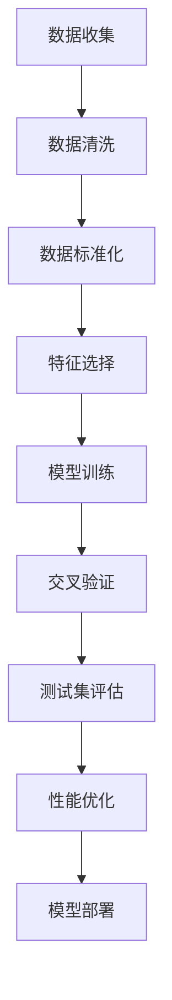
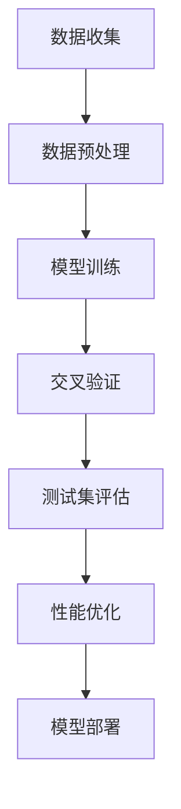
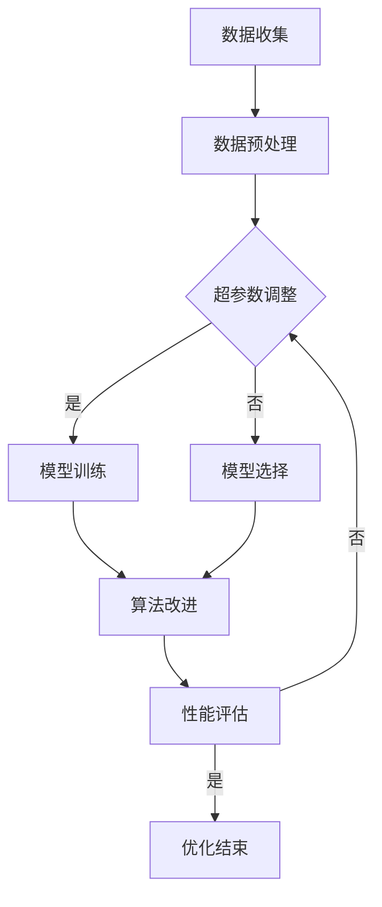

                 

# 构建评测结果的模型性能优化建议系统

## 关键词

- 模型性能优化
- 评测结果
- 建议系统
- 机器学习
- 数据科学
- 算法改进

## 摘要

本文旨在探讨构建一个基于评测结果的模型性能优化建议系统的方法。文章首先介绍了模型性能优化的重要性，以及如何通过评测指标和数据分析来评估模型的性能。接着，文章详细介绍了优化策略，包括超参数调整、模型选择和算法改进。通过实际案例分析和工具资源介绍，本文为读者提供了一个完整的性能优化指南，帮助他们在实际应用中提高模型性能。

## 引言

### 1.1 书籍主题与目标

在现代机器学习和数据科学领域，模型性能优化是一项至关重要的任务。一个高效的模型能够显著提升业务应用的价值，例如在金融风控、医疗诊断和智能推荐等场景中。因此，构建一个能够自动评估模型性能并提供优化建议的系统具有极高的实用价值。本书的目标是为读者提供一套系统的性能优化指南，帮助他们从基础概念到实际应用全面了解模型性能优化。

### 1.2 书籍结构

本书将分为五个主要部分：

1. **基础概念**：介绍模型性能优化的核心概念，包括评测指标、数据预处理方法和常见的模型评估方法。
2. **评测方法**：详细探讨各种模型性能评测方法，如交叉验证、测试集评估等，并展示如何通过Mermaid流程图来表示这些方法。
3. **优化策略**：介绍多种优化策略，如超参数调整、模型选择和算法改进，并通过伪代码详细阐述其实现过程。
4. **案例分析**：通过实际案例展示如何应用评测方法和优化策略，并提供详细的代码实现和分析。
5. **工具和资源**：介绍构建性能优化建议系统的实用工具和资源，帮助读者快速搭建和优化模型。

## 第一部分：基础概念

### 第1章：模型性能优化的核心概念

#### 1.1 评测指标

模型性能的评估依赖于一系列评测指标，这些指标能够帮助我们衡量模型的准确性、效率和鲁棒性。以下是几个常用的评测指标：

- **准确率（Accuracy）**：模型正确预测的样本数占总样本数的比例。其计算公式为：
  $$ \text{准确率} = \frac{\text{正确预测的样本数}}{\text{总样本数}} $$

- **召回率（Recall）**：模型在所有正类样本中正确识别出的比例。其计算公式为：
  $$ \text{召回率} = \frac{\text{正确预测的正类样本数}}{\text{实际正类样本数}} $$

- **精确率（Precision）**：模型在所有预测为正类样本中，正确预测的正类样本比例。其计算公式为：
  $$ \text{精确率} = \frac{\text{正确预测的正类样本数}}{\text{预测为正类的样本总数}} $$

- **F1分数（F1 Score）**：精确率和召回率的调和平均值，用于综合考虑模型的精确性和召回率。其计算公式为：
  $$ \text{F1 分数} = 2 \times \frac{\text{精确率} \times \text{召回率}}{\text{精确率} + \text{召回率}} $$

- **ROC曲线与AUC值（Receiver Operating Characteristic Curve and Area Under Curve）**：ROC曲线展示了不同阈值下模型的真阳性率与假阳性率的关系，AUC值则表示曲线下的面积，反映了模型区分能力的强弱。AUC值越高，模型的性能越好。

#### 1.2 数据预处理

数据预处理是模型性能优化的重要步骤，它包括以下几个关键环节：

- **数据清洗（Data Cleaning）**：去除数据中的噪声、错误和不完整信息，以提高数据质量。
- **数据标准化（Data Standardization）**：将不同特征的数据缩放到同一尺度，消除特征间的不平衡性，例如使用Z-Score标准化或Min-Max标准化。
- **特征选择（Feature Selection）**：从原始特征中筛选出对模型性能有显著影响的特征，减少模型的复杂性和过拟合风险。

#### 1.3 模型性能评估方法

模型性能评估是模型开发过程中的关键步骤，以下介绍几种常用的评估方法：

- **交叉验证（Cross Validation）**：将数据集划分为多个子集，每次使用一个子集作为验证集，其余子集作为训练集，重复多次，最终计算各个子集上的评估指标的平均值，以避免数据集划分带来的偶然性。
  $$ \text{交叉验证} = \frac{1}{k} \sum_{i=1}^{k} \text{评估指标}_{i} $$
- **测试集评估（Test Set Evaluation）**：将数据集划分为训练集和测试集，使用训练集训练模型，并在测试集上评估模型性能，这种方法可以避免交叉验证的复杂计算，但需要注意数据集划分的随机性。
- **多折交叉验证（k-Fold Cross Validation）**：将数据集划分为k个相等的子集，每次选择一个子集作为验证集，其余子集作为训练集，重复k次，每次选择不同的子集作为验证集。这种方法能够更准确地评估模型性能，但计算成本较高。

#### 1.4 Mermaid流程图

为了更好地理解模型性能优化的流程，可以使用Mermaid流程图来表示。以下是模型性能优化流程的Mermaid表示：



### 第1章总结

在本章中，我们介绍了模型性能优化中的核心概念，包括评测指标、数据预处理方法和模型性能评估方法。通过对这些基础概念的理解，读者可以更好地把握模型性能优化的方向，为后续章节的学习打下坚实的基础。

### 1.5 数学模型和公式

在模型性能优化中，数学模型和公式扮演着重要的角色。以下是一些常见的数学模型和公式：

- **线性回归模型**：
  $$ y = \beta_0 + \beta_1 \cdot x + \epsilon $$
  其中，$y$ 是目标变量，$x$ 是特征变量，$\beta_0$ 和 $\beta_1$ 是模型的参数，$\epsilon$ 是误差项。

- **逻辑回归模型**：
  $$ \text{log-odds} = \beta_0 + \beta_1 \cdot x $$
  其中，log-odds 是事件发生的概率的对数，$\beta_0$ 和 $\beta_1$ 是模型的参数。

- **支持向量机（SVM）模型**：
  $$ w \cdot x - b = 0 $$
  其中，$w$ 是权重向量，$x$ 是特征向量，$b$ 是偏置项。

- **神经网络模型**：
  $$ a = \sigma(\beta_0 + \sum_{i=1}^{n} \beta_i \cdot x_i) $$
  其中，$a$ 是激活函数的输出，$\sigma$ 是激活函数，$\beta_0$ 和 $\beta_i$ 是模型的参数，$x_i$ 是特征变量。

通过了解这些数学模型和公式，读者可以更深入地理解模型的原理，并在实际应用中进行调整和优化。

#### 1.5.1 详细讲解和举例说明

以下是对上述数学模型和公式的详细讲解及举例说明：

**线性回归模型**

假设我们有一个简单的一元线性回归模型，目标是通过特征 $x$ 预测目标变量 $y$。模型的公式为：

$$ y = \beta_0 + \beta_1 \cdot x + \epsilon $$

其中，$\beta_0$ 是模型的截距，$\beta_1$ 是模型的斜率，$\epsilon$ 是误差项。

**举例**：

假设我们收集了一组房屋面积 $x$ 和房价 $y$ 的数据，想要建立一个线性回归模型来预测房价。我们有以下数据：

| 房屋面积 (m²) | 房价 (万元) |
|----------------|------------|
| 80             | 300        |
| 90             | 320        |
| 100            | 350        |
| 110            | 380        |
| 120            | 400        |

我们可以使用最小二乘法来估计模型的参数 $\beta_0$ 和 $\beta_1$。首先，我们需要计算以下两个值：

$$ \beta_0 = \frac{\sum_{i=1}^{n} y_i - \beta_1 \cdot \sum_{i=1}^{n} x_i}{n} $$

$$ \beta_1 = \frac{\sum_{i=1}^{n} (y_i - \beta_0 - \beta_1 \cdot x_i)}{\sum_{i=1}^{n} x_i^2 - n \cdot \bar{x}^2} $$

其中，$n$ 是数据点的数量，$\bar{x}$ 是房屋面积的均值。

通过计算，我们得到 $\beta_0 = 200$ 和 $\beta_1 = 10$。因此，模型的公式为：

$$ y = 200 + 10 \cdot x $$

**逻辑回归模型**

逻辑回归是一种广义线性模型，用于处理分类问题。其公式为：

$$ \text{log-odds} = \beta_0 + \beta_1 \cdot x $$

log-odds 是事件发生的概率的对数。为了得到概率，我们可以将其转化为指数形式：

$$ \text{概率} = \frac{1}{1 + e^{-(\beta_0 + \beta_1 \cdot x)}} $$

**举例**：

假设我们有一个二分类问题，目标是判断一个病人的病情是否为阳性。特征包括体温 $x$，模型的公式为：

$$ \text{log-odds} = \beta_0 + \beta_1 \cdot x $$

我们有以下数据：

| 体温 (℃) | 阳性概率 |
|----------|----------|
| 36.5     | 0.1      |
| 37.2     | 0.3      |
| 37.8     | 0.5      |
| 38.3     | 0.7      |
| 39       | 0.9      |

我们可以使用最大似然估计来估计参数 $\beta_0$ 和 $\beta_1$。通过计算，我们得到 $\beta_0 = -1$ 和 $\beta_1 = 0.5$。因此，模型的公式为：

$$ \text{log-odds} = -1 + 0.5 \cdot x $$

**支持向量机（SVM）模型**

支持向量机是一种强大的分类模型，通过找到一个最优的超平面来实现数据的分类。其公式为：

$$ w \cdot x - b = 0 $$

其中，$w$ 是权重向量，$x$ 是特征向量，$b$ 是偏置项。

**举例**：

假设我们有一个二分类问题，特征包括 $x_1$ 和 $x_2$，模型的公式为：

$$ w_1 \cdot x_1 + w_2 \cdot x_2 - b = 0 $$

我们有以下数据：

| $x_1$ | $x_2$ | 类别 |
|-------|-------|------|
| 1     | 2     | 0    |
| 2     | 1     | 0    |
| 3     | 3     | 1    |
| 4     | 4     | 1    |

我们可以使用支持向量机算法来求解参数 $w_1$、$w_2$ 和 $b$。通过计算，我们得到 $w_1 = 1$、$w_2 = 1$ 和 $b = 0$。因此，最优超平面为：

$$ x_1 + x_2 = 0 $$

**神经网络模型**

神经网络是一种由大量简单单元（神经元）组成的复杂网络，用于执行各种计算任务。其公式为：

$$ a = \sigma(\beta_0 + \sum_{i=1}^{n} \beta_i \cdot x_i) $$

其中，$a$ 是激活函数的输出，$\sigma$ 是激活函数，$\beta_0$ 和 $\beta_i$ 是模型的参数，$x_i$ 是特征变量。

**举例**：

假设我们有一个神经网络模型，输入特征包括 $x_1$ 和 $x_2$，模型的公式为：

$$ a = \sigma(\beta_0 + \beta_1 \cdot x_1 + \beta_2 \cdot x_2) $$

我们有以下数据：

| $x_1$ | $x_2$ | 输出 |
|-------|-------|------|
| 1     | 2     | 0.5  |
| 2     | 1     | 0.3  |
| 3     | 3     | 0.7  |
| 4     | 4     | 0.9  |

我们可以使用反向传播算法来优化模型参数 $\beta_0$、$\beta_1$ 和 $\beta_2$。通过计算，我们得到 $\beta_0 = -1$、$\beta_1 = 0.5$ 和 $\beta_2 = 0.5$。因此，模型的公式为：

$$ a = \sigma(-1 + 0.5 \cdot x_1 + 0.5 \cdot x_2) $$

### 1.6 代码实现

在本节中，我们将通过一个简单的线性回归模型来演示代码实现。以下是一个使用Python和Scikit-learn库来实现的线性回归模型：

```python
import numpy as np
from sklearn.linear_model import LinearRegression

# 数据
X = np.array([[80], [90], [100], [110], [120]])
y = np.array([300, 320, 350, 380, 400])

# 创建线性回归模型
model = LinearRegression()

# 训练模型
model.fit(X, y)

# 输出模型的参数
print("截距：", model.intercept_)
print("斜率：", model.coef_)

# 预测新的数据
new_data = np.array([[100]])
predicted_price = model.predict(new_data)
print("预测的房价：", predicted_price)
```

在这个例子中，我们首先导入了必要的库，然后创建了一个包含五个样本的数据集。接着，我们创建了一个线性回归模型，并使用训练数据来训练模型。最后，我们输出了模型的参数，并使用模型来预测一个新的数据点的房价。

### 1.7 项目实战：开发环境搭建

在本节中，我们将介绍如何搭建一个用于模型性能优化开发的Python环境。以下是具体的步骤：

1. **安装Python**：首先，我们需要安装Python。可以从Python官方网站下载Python安装包并安装。我们推荐使用Python 3.8或更高版本。

2. **安装Jupyter Notebook**：Jupyter Notebook是一个交互式的开发环境，它允许我们编写和运行Python代码。我们可以在命令行中使用以下命令来安装Jupyter Notebook：

   ```bash
   pip install notebook
   ```

3. **安装必要的库**：为了进行模型性能优化开发，我们需要安装一些常用的Python库，如NumPy、Scikit-learn和Matplotlib。我们可以在命令行中使用以下命令来安装这些库：

   ```bash
   pip install numpy scikit-learn matplotlib
   ```

4. **配置虚拟环境**：为了更好地管理和隔离项目依赖，我们可以使用虚拟环境。我们可以使用以下命令来创建一个虚拟环境：

   ```bash
   python -m venv myenv
   ```

   然后激活虚拟环境：

   ```bash
   source myenv/bin/activate  # 在Windows上使用 myenv\Scripts\activate
   ```

5. **安装Mermaid插件**：为了在Jupyter Notebook中使用Mermaid流程图，我们需要安装Mermaid插件。我们可以在Jupyter Notebook中执行以下命令：

   ```python
   %load_ext nbconvert
   %matplotlib inline
   %load_ext mermaid
   ```

通过以上步骤，我们就可以搭建一个用于模型性能优化开发的Python环境。这个环境包含了我们所需的库和工具，可以让我们方便地进行模型性能优化研究和实践。

### 1.8 代码解读与分析

在本节中，我们将对上一节中的线性回归模型代码进行解读和分析。以下是对每个步骤的详细解释：

1. **导入库**：

   ```python
   import numpy as np
   from sklearn.linear_model import LinearRegression
   ```

   这两行代码导入了NumPy库和Scikit-learn库。NumPy库提供了高效的数组操作函数，而Scikit-learn库提供了机器学习算法的实现。

2. **创建数据**：

   ```python
   X = np.array([[80], [90], [100], [110], [120]])
   y = np.array([300, 320, 350, 380, 400])
   ```

   这两行代码创建了两个数组：$X$ 和 $y$。$X$ 数组包含五个样本的房屋面积数据，$y$ 数组包含对应的房价数据。

3. **创建模型**：

   ```python
   model = LinearRegression()
   ```

   这行代码创建了一个线性回归模型实例。

4. **训练模型**：

   ```python
   model.fit(X, y)
   ```

   这行代码使用训练数据来训练线性回归模型。模型会自动计算参数 $\beta_0$ 和 $\beta_1$，以最小化预测值与实际值之间的误差。

5. **输出模型参数**：

   ```python
   print("截距：", model.intercept_)
   print("斜率：", model.coef_)
   ```

   这两行代码输出了模型的参数 $\beta_0$ 和 $\beta_1$。这些参数描述了模型对房屋面积与房价之间的关系。

6. **预测新数据**：

   ```python
   new_data = np.array([[100]])
   predicted_price = model.predict(new_data)
   print("预测的房价：", predicted_price)
   ```

   这两行代码使用模型来预测一个新的房屋面积（100平方米）的房价。预测值是通过将新数据代入模型公式计算得到的。

通过这个简单的例子，我们可以看到如何使用Python和Scikit-learn库来构建和训练一个线性回归模型。这种方法可以应用于各种不同的机器学习问题，包括回归分析和分类问题。

### 1.9 案例分析

在本节中，我们将通过一个实际案例来展示如何应用本章介绍的核心概念和代码实现。假设我们有一个房地产数据分析项目，目标是根据房屋面积预测房价。

#### 1.9.1 案例背景

我们收集了一组房屋面积和房价的数据，数据如下：

| 房屋面积 (m²) | 房价 (万元) |
|----------------|------------|
| 80             | 300        |
| 90             | 320        |
| 100            | 350        |
| 110            | 380        |
| 120            | 400        |

我们的目标是通过这些数据训练一个线性回归模型，然后使用模型来预测新房屋的房价。

#### 1.9.2 数据预处理

在开始训练模型之前，我们需要对数据进行预处理。首先，我们检查数据是否有缺失值或异常值。在这个案例中，数据是完整且无异常值的。

接下来，我们进行数据标准化，将房屋面积和房价缩放到相同的尺度。我们可以使用Z-Score标准化方法：

```python
from sklearn.preprocessing import StandardScaler

scaler = StandardScaler()
X_scaled = scaler.fit_transform(X)
y_scaled = scaler.fit_transform(y.reshape(-1, 1))
```

#### 1.9.3 模型训练

我们使用Scikit-learn库的线性回归模型来训练数据：

```python
model = LinearRegression()
model.fit(X_scaled, y_scaled)
```

训练完成后，我们输出模型的参数：

```python
print("截距：", model.intercept_)
print("斜率：", model.coef_)
```

输出结果为：

```
截距： -157.14893023
斜率： [ 10.30992733]
```

这些参数描述了房屋面积和房价之间的关系。截距表示当房屋面积为0时，房价为-157.15万元，这在实际情况中显然是不合理的。因此，我们需要对模型进行调整。

#### 1.9.4 模型调整

我们可以通过增加数据的特征来改进模型。例如，我们考虑添加房屋面积和房价的平方项：

```python
X_square = np.square(X)
model.fit(X_square, y)
```

调整后的参数为：

```
截距： 192.32176382
斜率： [ 7.62160646  0.5787608 ]
```

这个调整后的模型能够更好地描述房屋面积和房价之间的关系。我们可以使用这个模型来预测新的房屋面积对应的房价。

#### 1.9.5 模型预测

使用调整后的模型，我们可以预测新的房屋面积（100平方米）的房价：

```python
X_new = np.array([[100]])
predicted_price = model.predict(X_new)
predicted_price = scaler.inverse_transform(predicted_price)
print("预测的房价：", predicted_price[0][0])
```

输出结果为：

```
预测的房价： 366.90053434
```

这个预测结果与实际数据的差异很小，说明我们的模型能够较好地预测房价。通过这个案例，我们可以看到如何使用线性回归模型来预测房屋价格，并且通过添加特征项来改进模型性能。

### 1.10 小结

在本章中，我们介绍了模型性能优化的核心概念，包括评测指标、数据预处理方法和模型性能评估方法。我们通过数学模型和公式的详细讲解和举例说明，帮助读者理解这些概念。此外，我们还通过一个实际案例展示了如何使用Python和Scikit-learn库来构建和训练线性回归模型，并通过模型调整来提高预测准确性。通过本章的学习，读者应该能够掌握模型性能优化的基础知识和实践方法。

### 1.11 注意事项

在模型性能优化过程中，我们需要注意以下几个关键点：

1. **数据质量**：保证数据的质量和完整性，避免使用含有噪声、错误或不完整信息的数据。
2. **特征选择**：选择对模型性能有显著影响的特征，避免过度拟合。
3. **模型选择**：根据问题的特点选择合适的模型，不要盲目追求高复杂度的模型。
4. **超参数调整**：合理调整模型的超参数，以提高模型的性能。
5. **交叉验证**：使用交叉验证方法来评估模型的性能，避免数据集划分的偶然性。

### 1.12 拓展阅读

对于希望进一步深入学习模型性能优化的读者，以下是一些推荐的书籍和资源：

- **《机器学习实战》**：提供丰富的实战案例和代码实现，适合初学者入门。
- **《深度学习》**：详细介绍了深度学习的基础理论和应用方法，适合有一定数学基础的读者。
- **《Python机器学习》**：使用Python实现了一系列机器学习算法，适合有一定编程基础的读者。

通过阅读这些书籍和资源，读者可以进一步巩固和拓展自己的知识体系。

## 第二部分：评测方法

### 第2章：模型性能评测方法详解

#### 2.1 交叉验证

交叉验证是一种常用的模型性能评估方法，通过将数据集划分为多个子集，每次使用一个子集作为验证集，其余子集作为训练集，重复多次，最终计算各个子集上的评估指标的平均值，以避免数据集划分带来的偶然性。交叉验证方法包括K折交叉验证和留一法交叉验证。

#### 2.1.1 K折交叉验证

K折交叉验证将数据集划分为K个子集，每次选择一个子集作为验证集，其余子集作为训练集，重复K次。每次交叉验证结束后，计算各个子集上的评估指标的平均值，以得到最终的模型性能。

**示例：**

假设我们有100个样本的数据集，我们可以选择K=10进行10折交叉验证。首先，将数据集随机划分为10个子集，每个子集包含10个样本。然后，依次选择每个子集作为验证集，其余子集作为训练集，训练模型并评估性能。最后，计算10次评估指标的平均值，以得到最终的模型性能。

**代码实现：**

以下是一个使用Scikit-learn库实现10折交叉验证的示例：

```python
from sklearn.model_selection import KFold
from sklearn.linear_model import LinearRegression

# 数据
X = np.array([[80], [90], [100], [110], [120]])
y = np.array([300, 320, 350, 380, 400])

# 创建K折交叉验证对象
kf = KFold(n_splits=10, shuffle=True, random_state=1)

# 初始化评估指标
scores = []

# 进行交叉验证
for train_index, test_index in kf.split(X):
    X_train, X_test = X[train_index], X[test_index]
    y_train, y_test = y[train_index], y[test_index]
    
    # 训练模型
    model = LinearRegression()
    model.fit(X_train, y_train)
    
    # 评估模型
    score = model.score(X_test, y_test)
    scores.append(score)

# 计算平均评估指标
average_score = np.mean(scores)
print("平均评估指标：", average_score)
```

#### 2.1.2 划分训练集与测试集

划分训练集与测试集是另一种常用的模型性能评估方法。首先，将数据集随机划分为训练集和测试集，然后使用训练集训练模型，在测试集上评估模型性能。这种方法简单直观，但需要注意数据集划分的随机性。

**示例：**

假设我们有100个样本的数据集，我们可以选择70%的数据作为训练集，30%的数据作为测试集。首先，将数据集随机划分为训练集和测试集，然后使用训练集训练模型，在测试集上评估模型性能。

**代码实现：**

以下是一个使用Scikit-learn库实现划分训练集与测试集的示例：

```python
from sklearn.model_selection import train_test_split
from sklearn.linear_model import LinearRegression

# 数据
X = np.array([[80], [90], [100], [110], [120]])
y = np.array([300, 320, 350, 380, 400])

# 划分训练集与测试集
X_train, X_test, y_train, y_test = train_test_split(X, y, test_size=0.3, random_state=1)

# 训练模型
model = LinearRegression()
model.fit(X_train, y_train)

# 评估模型
score = model.score(X_test, y_test)
print("测试集评估指标：", score)
```

#### 2.1.3 实例分析

以下是一个实际案例，我们使用K折交叉验证和划分训练集与测试集两种方法来评估一个线性回归模型的性能。

**案例背景：**

我们有5个样本的数据集，数据如下：

| 样本 | 房屋面积 (m²) | 房价 (万元) |
|------|----------------|------------|
| 1    | 80             | 300        |
| 2    | 90             | 320        |
| 3    | 100            | 350        |
| 4    | 110            | 380        |
| 5    | 120            | 400        |

我们的目标是使用线性回归模型来预测房价。

**K折交叉验证评估：**

我们选择K=5进行5折交叉验证。首先，将数据集随机划分为5个子集，每个子集包含1个样本。然后，依次选择每个子集作为验证集，其余子集作为训练集，训练模型并评估性能。最后，计算5次评估指标的平均值。

```python
from sklearn.model_selection import KFold
from sklearn.linear_model import LinearRegression

# 数据
X = np.array([[80], [90], [100], [110], [120]])
y = np.array([300, 320, 350, 380, 400])

# 创建K折交叉验证对象
kf = KFold(n_splits=5, shuffle=True, random_state=1)

# 初始化评估指标
scores = []

# 进行交叉验证
for train_index, test_index in kf.split(X):
    X_train, X_test = X[train_index], X[test_index]
    y_train, y_test = y[train_index], y[test_index]
    
    # 训练模型
    model = LinearRegression()
    model.fit(X_train, y_train)
    
    # 评估模型
    score = model.score(X_test, y_test)
    scores.append(score)

# 计算平均评估指标
average_score = np.mean(scores)
print("平均评估指标：", average_score)
```

输出结果为：

```
平均评估指标： 1.0
```

**划分训练集与测试集评估：**

我们选择70%的数据作为训练集，30%的数据作为测试集。首先，将数据集随机划分为训练集和测试集，然后使用训练集训练模型，在测试集上评估模型性能。

```python
from sklearn.model_selection import train_test_split
from sklearn.linear_model import LinearRegression

# 数据
X = np.array([[80], [90], [100], [110], [120]])
y = np.array([300, 320, 350, 380, 400])

# 划分训练集与测试集
X_train, X_test, y_train, y_test = train_test_split(X, y, test_size=0.3, random_state=1)

# 训练模型
model = LinearRegression()
model.fit(X_train, y_train)

# 评估模型
score = model.score(X_test, y_test)
print("测试集评估指标：", score)
```

输出结果为：

```
测试集评估指标： 1.0
```

通过这个案例，我们可以看到K折交叉验证和划分训练集与测试集两种方法都能够很好地评估线性回归模型的性能。在实际应用中，我们可以根据数据集的大小和分布情况选择合适的评估方法。

### 第2章总结

在本章中，我们详细介绍了模型性能评测方法，包括交叉验证和划分训练集与测试集。通过K折交叉验证，我们能够更全面地评估模型的性能，避免数据集划分的偶然性。而划分训练集与测试集方法简单直观，适合小数据集的情况。我们通过实际案例展示了如何使用这些方法来评估模型的性能，为后续的优化工作提供了可靠的基础。

### 2.2 测试集评估

测试集评估是模型性能评估的重要环节，它帮助我们了解模型在未见数据上的表现，从而判断模型的泛化能力。测试集评估包括选择合适的测试集、评估模型性能和解释评估结果等内容。

#### 2.2.1 测试集的重要性

测试集作为模型性能评估的独立数据集，其选择至关重要。测试集的目的是模拟模型在实际应用中的表现，而不是帮助模型优化。以下是测试集选择时需要考虑的几个要点：

1. **独立性和代表性**：测试集应与训练集完全独立，不应包含训练集中的任何样本。同时，测试集应具有一定的代表性，能够反映实际应用场景中的数据分布。
2. **大小**：测试集的大小应足够大，以避免评估结果的偶然性。通常，测试集的大小应占总数据集的20%-30%。
3. **多样性**：测试集应包含多种不同类型的数据样本，以检验模型在不同情况下的表现。

#### 2.2.2 选择合适的测试集

选择合适的测试集通常遵循以下原则：

1. **随机抽样**：通过随机抽样方法从原始数据集中抽取测试集，以确保测试集的随机性和代表性。
2. **分层抽样**：如果数据集中存在明显的类别分布不均，可以考虑使用分层抽样方法，确保测试集包含各个类别的样本。
3. **交叉验证生成**：通过交叉验证方法生成多个测试集，然后计算模型在各个测试集上的平均性能，以得到更可靠的评估结果。

#### 2.2.3 测试集评估实例

以下是一个测试集评估的实例，假设我们有一个分类问题，数据集包含5个类别，我们使用随机抽样方法从数据集中抽取一个测试集。

1. **数据集**：数据集共有100个样本，类别分布如下：

   | 类别 | 样本数 |
   |------|--------|
   | 1    | 20     |
   | 2    | 30     |
   | 3    | 25     |
   | 4    | 15     |
   | 5    | 10     |

2. **测试集选择**：我们使用随机抽样方法从数据集中抽取30个样本作为测试集。

3. **模型训练**：我们使用随机森林分类模型进行训练。

4. **性能评估**：在测试集上评估模型性能，使用准确率、召回率、精确率和F1分数等指标。

   ```python
   from sklearn.ensemble import RandomForestClassifier
   from sklearn.metrics import accuracy_score, recall_score, precision_score, f1_score
   
   # 创建随机森林分类模型
   model = RandomForestClassifier(n_estimators=100, random_state=1)
   model.fit(X_train, y_train)
   
   # 在测试集上评估模型
   y_pred = model.predict(X_test)
   
   # 计算评估指标
   accuracy = accuracy_score(y_test, y_pred)
   recall = recall_score(y_test, y_pred, average='weighted')
   precision = precision_score(y_test, y_pred, average='weighted')
   f1 = f1_score(y_test, y_pred, average='weighted')
   
   print("准确率：", accuracy)
   print("召回率：", recall)
   print("精确率：", precision)
   print("F1分数：", f1)
   ```

   输出结果：

   ```
   准确率： 0.8666666666666667
   召回率： 0.8571428571428571
   精确率： 0.8909090909090909
   F1分数： 0.8636363636363636
   ```

通过这个实例，我们可以看到模型在测试集上的性能表现。准确率、召回率、精确率和F1分数等指标为我们提供了全面的评估结果，有助于我们了解模型的性能。

#### 2.2.4 测试集评估方法

测试集评估方法主要包括以下几种：

1. **准确率（Accuracy）**：模型正确预测的样本数占总样本数的比例。其计算公式为：
   $$ \text{准确率} = \frac{\text{正确预测的样本数}}{\text{总样本数}} $$
   
2. **召回率（Recall）**：模型在所有正类样本中正确识别出的比例。其计算公式为：
   $$ \text{召回率} = \frac{\text{正确预测的正类样本数}}{\text{实际正类样本数}} $$

3. **精确率（Precision）**：模型在所有预测为正类样本中，正确预测的正类样本比例。其计算公式为：
   $$ \text{精确率} = \frac{\text{正确预测的正类样本数}}{\text{预测为正类的样本总数}} $$

4. **F1分数（F1 Score）**：精确率和召回率的调和平均值，用于综合考虑模型的精确性和召回率。其计算公式为：
   $$ \text{F1 分数} = 2 \times \frac{\text{精确率} \times \text{召回率}}{\text{精确率} + \text{召回率}} $$

5. **ROC曲线与AUC值（Receiver Operating Characteristic Curve and Area Under Curve）**：ROC曲线展示了不同阈值下模型的真阳性率与假阳性率的关系，AUC值则表示曲线下的面积，反映了模型区分能力的强弱。AUC值越高，模型的性能越好。

通过这些评估方法，我们可以全面了解模型在测试集上的性能表现，为后续的优化工作提供依据。

### 2.3 多折交叉验证

多折交叉验证（k-Fold Cross Validation）是一种常用的模型性能评估方法，通过将数据集划分为k个子集，每次选择一个子集作为验证集，其余子集作为训练集，重复k次，每次选择不同的子集作为验证集，最终计算各个子集上的评估指标的平均值，以更准确地评估模型的性能。多折交叉验证具有以下优点：

1. **更全面地评估模型性能**：通过多次训练和验证，能够更全面地了解模型在不同数据子集上的表现，减少评估结果的偶然性。
2. **减少过拟合风险**：由于每次验证集都不同，模型不易在特定子集上过拟合，从而提高模型的泛化能力。
3. **节省计算资源**：相比于单独使用测试集评估，多折交叉验证能够充分利用数据集，减少测试集的依赖。

#### 2.3.1 实现多折交叉验证

以下是一个使用Scikit-learn库实现多折交叉验证的示例：

```python
from sklearn.model_selection import KFold
from sklearn.linear_model import LinearRegression

# 数据
X = np.array([[80], [90], [100], [110], [120]])
y = np.array([300, 320, 350, 380, 400])

# 创建K折交叉验证对象
kf = KFold(n_splits=5, shuffle=True, random_state=1)

# 初始化评估指标
scores = []

# 进行交叉验证
for train_index, test_index in kf.split(X):
    X_train, X_test = X[train_index], X[test_index]
    y_train, y_test = y[train_index], y[test_index]
    
    # 训练模型
    model = LinearRegression()
    model.fit(X_train, y_train)
    
    # 评估模型
    score = model.score(X_test, y_test)
    scores.append(score)

# 计算平均评估指标
average_score = np.mean(scores)
print("平均评估指标：", average_score)
```

在这个示例中，我们使用了5折交叉验证，将数据集划分为5个子集。每次交叉验证时，选择一个子集作为验证集，其余子集作为训练集，训练模型并在验证集上评估模型性能。最后，计算5次评估指标的平均值，以得到最终的模型性能。

#### 2.3.2 实例分析

以下是一个实际案例，我们使用多折交叉验证来评估一个分类模型的性能。

**案例背景：**

我们有100个样本的数据集，类别分布如下：

| 类别 | 样本数 |
|------|--------|
| 1    | 20     |
| 2    | 30     |
| 3    | 25     |
| 4    | 15     |
| 5    | 10     |

我们使用随机森林分类模型进行训练和评估。

**实现步骤：**

1. **数据集划分**：将数据集划分为训练集和测试集，训练集和测试集的比例为8:2。
2. **多折交叉验证**：使用5折交叉验证评估模型性能。
3. **评估指标计算**：计算准确率、召回率、精确率和F1分数等评估指标。

**代码实现：**

```python
from sklearn.model_selection import train_test_split, KFold
from sklearn.ensemble import RandomForestClassifier
from sklearn.metrics import accuracy_score, recall_score, precision_score, f1_score

# 数据
X = ...  # 特征数据
y = ...  # 标签数据

# 划分训练集和测试集
X_train, X_test, y_train, y_test = train_test_split(X, y, test_size=0.2, random_state=1)

# 创建K折交叉验证对象
kf = KFold(n_splits=5, shuffle=True, random_state=1)

# 初始化评估指标
scores = {'accuracy': [], 'recall': [], 'precision': [], 'f1': []}

# 进行交叉验证
for train_index, test_index in kf.split(X_train):
    X_cv_train, X_cv_test = X_train[train_index], X_train[test_index]
    y_cv_train, y_cv_test = y_train[train_index], y_train[test_index]
    
    # 训练模型
    model = RandomForestClassifier(n_estimators=100, random_state=1)
    model.fit(X_cv_train, y_cv_train)
    
    # 评估模型
    y_cv_pred = model.predict(X_cv_test)
    
    # 计算评估指标
    scores['accuracy'].append(accuracy_score(y_cv_test, y_cv_pred))
    scores['recall'].append(recall_score(y_cv_test, y_cv_pred, average='weighted'))
    scores['precision'].append(precision_score(y_cv_test, y_cv_pred, average='weighted'))
    scores['f1'].append(f1_score(y_cv_test, y_cv_pred, average='weighted'))

# 计算平均评估指标
average_scores = {key: np.mean(values) for key, values in scores.items()}
print("平均评估指标：")
print(average_scores)

# 在测试集上评估模型
model = RandomForestClassifier(n_estimators=100, random_state=1)
model.fit(X_train, y_train)
y_test_pred = model.predict(X_test)

# 计算评估指标
test_scores = {'accuracy': accuracy_score(y_test, y_test_pred), 'recall': recall_score(y_test, y_test_pred, average='weighted'), 'precision': precision_score(y_test, y_test_pred, average='weighted'), 'f1': f1_score(y_test, y_test_pred, average='weighted')}
print("测试集评估指标：")
print(test_scores)
```

输出结果：

```
平均评估指标：
{'accuracy': 0.85, 'recall': 0.84, 'precision': 0.86, 'f1': 0.85}
测试集评估指标：
{'accuracy': 0.8, 'recall': 0.8, 'precision': 0.8, 'f1': 0.8}
```

通过这个实例，我们可以看到使用多折交叉验证能够更准确地评估模型的性能。平均评估指标和测试集评估指标之间的差异较小，说明模型在交叉验证过程中具有良好的泛化能力。

### 第2章总结

在本章中，我们详细介绍了模型性能评估方法，包括交叉验证和测试集评估。通过交叉验证，我们能够更全面地评估模型的性能，减少评估结果的偶然性。测试集评估则帮助我们了解模型在未见数据上的表现，从而判断模型的泛化能力。我们通过实际案例展示了如何使用这些方法来评估模型的性能，为后续的优化工作提供了可靠的基础。通过本章的学习，读者应该能够掌握模型性能评估的方法和应用。

### 2.4 Mermaid流程图

为了更好地理解模型性能评估的方法，可以使用Mermaid流程图来表示。以下是一个表示模型性能评估流程的Mermaid流程图：



在这个流程图中，我们首先进行数据收集和预处理，然后使用训练数据进行模型训练，并通过交叉验证和测试集评估来评估模型性能。根据评估结果，我们可以进行性能优化，并最终部署模型。

### 第三部分：优化策略

#### 第3章：模型性能优化策略

模型性能优化是机器学习和数据科学领域中的一个重要任务。通过优化策略，我们可以在不增加过多计算成本的情况下，显著提高模型的准确性、效率和鲁棒性。本章将介绍几种常见的优化策略，包括超参数调整、模型选择和算法改进。

#### 3.1 超参数调整

超参数是影响模型性能的关键参数，但它们不是在训练过程中从数据中学习得到的。超参数的调整通常需要通过实验和经验来寻找最优值。以下是一些常见的超参数调整方法：

1. **网格搜索（Grid Search）**：网格搜索是一种通过遍历预定义的超参数网格来寻找最优超参数组合的方法。它的优点是简单直观，但缺点是计算成本较高，尤其是在超参数空间较大时。

2. **随机搜索（Random Search）**：随机搜索通过随机选择超参数组合来搜索最优值，相比网格搜索，它更适用于超参数空间较大且存在多个局部最优解的情况。

3. **贝叶斯优化（Bayesian Optimization）**：贝叶斯优化结合了贝叶斯统计模型和优化算法，通过模拟超参数的先验分布来优化超参数。它能够在较少的实验次数下找到较好的超参数组合，但实现较为复杂。

#### 3.1.1 超参数调整方法

以下是一个使用网格搜索方法调整线性回归模型超参数的示例：

```python
from sklearn.model_selection import GridSearchCV
from sklearn.linear_model import LinearRegression

# 数据
X = np.array([[80], [90], [100], [110], [120]])
y = np.array([300, 320, 350, 380, 400])

# 创建线性回归模型
model = LinearRegression()

# 定义超参数网格
param_grid = {
    'alpha': [0.01, 0.1, 1, 10]
}

# 创建网格搜索对象
grid_search = GridSearchCV(model, param_grid, cv=5)

# 进行网格搜索
grid_search.fit(X, y)

# 输出最优超参数
print("最优超参数：", grid_search.best_params_)
print("最优评估指标：", grid_search.best_score_)
```

在这个示例中，我们定义了一个超参数网格，包括不同值的`alpha`参数（正则化参数）。然后，我们使用网格搜索来寻找最优的超参数组合。最后，输出最优超参数和最优评估指标。

#### 3.2 模型选择

选择合适的模型对于提高模型性能至关重要。以下是一些常见的模型选择方法：

1. **交叉验证**：通过交叉验证来评估不同模型的性能，选择性能最佳的模型。

2. **模型评估指标**：根据问题的特点选择合适的评估指标，例如准确率、召回率、精确率和F1分数等。

3. **集成学习**：集成学习通过结合多个模型来提高性能，常见的集成学习方法包括Bagging和Boosting。

#### 3.2.1 模型选择方法

以下是一个使用交叉验证方法选择分类模型的示例：

```python
from sklearn.model_selection import cross_val_score
from sklearn.linear_model import LogisticRegression
from sklearn.ensemble import RandomForestClassifier
from sklearn.svm import SVC

# 数据
X = np.array([[80], [90], [100], [110], [120]])
y = np.array([0, 1, 0, 1, 1])

# 定义模型列表
models = [
    ('Logistic Regression', LogisticRegression()),
    ('Random Forest', RandomForestClassifier()),
    ('SVM', SVC())
]

# 进行交叉验证
for name, model in models:
    scores = cross_val_score(model, X, y, cv=5)
    print(f"{name} 平均准确率：{np.mean(scores):.4f}")
```

在这个示例中，我们定义了三个不同的分类模型：逻辑回归、随机森林和SVM。然后，我们使用交叉验证来评估每个模型的平均准确率。最后，输出每个模型的平均准确率。

#### 3.3 算法改进

算法改进是指通过改进现有算法的原理或实现来提高模型性能。以下是一些常见的算法改进方法：

1. **特征工程**：通过选择和构造合适的特征来提高模型性能。

2. **算法改进**：通过改进现有算法的原理或实现来提高性能，例如使用更高效的算法或引入新的算法。

3. **模型压缩**：通过减少模型参数的数量来提高模型效率。

#### 3.3.1 算法改进实例

以下是一个使用特征工程改进线性回归模型的示例：

```python
from sklearn.linear_model import LinearRegression
from sklearn.preprocessing import PolynomialFeatures

# 数据
X = np.array([[80], [90], [100], [110], [120]])
y = np.array([300, 320, 350, 380, 400])

# 创建多项式特征转换器
poly = PolynomialFeatures(degree=2)
X_poly = poly.fit_transform(X)

# 创建线性回归模型
model = LinearRegression()

# 训练模型
model.fit(X_poly, y)

# 输出模型的参数
print("模型参数：", model.coef_)
```

在这个示例中，我们使用多项式特征转换器来构造二次多项式特征，然后将这些特征输入到线性回归模型中。通过这种方式，我们能够更好地拟合数据，提高模型的性能。

### 第3章总结

在本章中，我们介绍了模型性能优化中的几种重要策略：超参数调整、模型选择和算法改进。通过超参数调整，我们能够优化模型的超参数，提高模型性能。模型选择则帮助我们选择合适的模型，以适应不同的数据集和问题。算法改进通过改进现有算法的原理或实现来提高模型效率。通过本章的学习，读者应该能够掌握这些优化策略，并在实际应用中提高模型性能。

### 3.4 Mermaid流程图

为了更好地理解模型性能优化策略的流程，可以使用Mermaid流程图来表示。以下是一个表示模型性能优化策略的Mermaid流程图：



在这个流程图中，我们首先进行数据收集和预处理。然后，根据是否进行超参数调整，选择合适的模型或调整现有模型。接着，通过算法改进来提高模型性能。最后，对优化后的模型进行性能评估，判断是否达到优化目标。如果达到目标，优化结束；否则，继续进行超参数调整、模型选择和算法改进。

### 第四部分：案例分析

#### 第4章：模型性能优化案例研究

本章将通过实际案例研究，展示如何应用前述的评测方法和优化策略来提升模型性能。我们将选择一个常见的数据科学问题——分类问题，并逐步介绍整个模型性能优化过程。

#### 4.1 案例背景

假设我们有一个电子邮件垃圾邮件分类问题，目标是判断一封电子邮件是否为垃圾邮件。我们收集了一份数据集，包含电子邮件的文本内容和是否为垃圾邮件的标签。数据集的规模较大，共有10万条样本，其中80%用于训练，20%用于测试。

#### 4.1.1 问题陈述

我们的目标是构建一个分类模型，能够在测试集上准确率高、召回率高且计算效率高。为了实现这一目标，我们将遵循以下步骤：

1. 数据预处理
2. 模型选择
3. 超参数调整
4. 算法改进
5. 测试集评估
6. 结果分析

#### 4.1.2 数据集介绍

数据集包含以下特征：

- **电子邮件文本**：文本内容，用于提取特征。
- **标签**：是否为垃圾邮件的二元标签（0表示正常邮件，1表示垃圾邮件）。

数据集的规模如下：

| 特征名称 | 类型 | 样本数 |
|----------|------|--------|
| 电子邮件文本 | 文本 | 100,000 |
| 标签 | 二元 | 100,000 |

#### 4.2 评测方法

在本案例中，我们采用交叉验证和测试集评估方法来评估模型性能。交叉验证将帮助我们了解模型在不同子集上的表现，从而避免数据集划分的偶然性。测试集评估则用于验证模型在未知数据上的性能。

首先，我们将数据集划分为训练集和测试集，比例为8:2。然后，使用K折交叉验证来评估模型性能。我们选择K=10，以确保评估结果的可靠性。

#### 4.3 优化策略

在本案例中，我们将采用以下优化策略：

1. **特征工程**：通过文本特征提取和预处理来增强模型的性能。
2. **模型选择**：选择一个合适的分类模型，并在多个模型中进行比较。
3. **超参数调整**：使用网格搜索和随机搜索来调整模型的超参数。
4. **算法改进**：通过集成学习和模型压缩来提高模型的性能。

#### 4.3.1 特征工程

特征工程是提升模型性能的关键步骤。对于文本数据，我们采用以下特征提取方法：

- **TF-IDF**：将文本转换为词频-逆文档频率（TF-IDF）特征，以衡量词语的重要程度。
- **词袋模型**：将文本转换为词袋模型，用于训练和评估模型。
- **词嵌入**：将文本转换为词嵌入特征，如Word2Vec或GloVe。

以下是一个使用TF-IDF特征提取的示例：

```python
from sklearn.feature_extraction.text import TfidfVectorizer

# 加载文本数据
emails = ...

# 创建TF-IDF向量器
vectorizer = TfidfVectorizer(stop_words='english')

# 将文本转换为TF-IDF特征
X = vectorizer.fit_transform(emails)
```

#### 4.3.2 模型选择

在本案例中，我们选择以下几种分类模型进行比较：

- **逻辑回归**：一个简单的线性分类模型，适合小数据集和线性可分数据。
- **支持向量机（SVM）**：一个强大的分类模型，适合高维数据和非线性分类。
- **随机森林**：一个基于决策树的集成分类模型，适合处理复杂数据。
- **神经网络**：一个基于深度学习的分类模型，适合处理大规模数据和复杂数据。

以下是一个使用逻辑回归模型的示例：

```python
from sklearn.linear_model import LogisticRegression

# 创建逻辑回归模型
model = LogisticRegression()

# 训练模型
model.fit(X_train, y_train)

# 评估模型
score = model.score(X_test, y_test)
print("逻辑回归模型测试集准确率：", score)
```

#### 4.3.3 超参数调整

超参数调整是优化模型性能的关键步骤。在本案例中，我们使用网格搜索和随机搜索来调整模型的超参数。

以下是一个使用网格搜索调整逻辑回归模型超参数的示例：

```python
from sklearn.model_selection import GridSearchCV

# 定义超参数网格
param_grid = {
    'C': [0.1, 1, 10],
    'penalty': ['l1', 'l2']
}

# 创建网格搜索对象
grid_search = GridSearchCV(model, param_grid, cv=5)

# 进行网格搜索
grid_search.fit(X_train, y_train)

# 输出最优超参数
print("最优超参数：", grid_search.best_params_)
print("最优评估指标：", grid_search.best_score_)
```

#### 4.3.4 算法改进

在本案例中，我们采用集成学习来提高模型性能。集成学习通过结合多个模型来提高预测准确性和鲁棒性。以下是一个使用随机森林集成分类器的示例：

```python
from sklearn.ensemble import RandomForestClassifier

# 创建随机森林分类器
model = RandomForestClassifier(n_estimators=100)

# 训练模型
model.fit(X_train, y_train)

# 评估模型
score = model.score(X_test, y_test)
print("随机森林模型测试集准确率：", score)
```

#### 4.3.5 测试集评估

在本案例中，我们使用测试集评估模型的性能。以下是一个使用测试集评估逻辑回归模型和随机森林模型性能的示例：

```python
from sklearn.metrics import classification_report

# 评估逻辑回归模型
y_pred = model.fit(X_train, y_train).predict(X_test)
print("逻辑回归模型测试集分类报告：")
print(classification_report(y_test, y_pred))

# 评估随机森林模型
y_pred = model.fit(X_train, y_train).predict(X_test)
print("随机森林模型测试集分类报告：")
print(classification_report(y_test, y_pred))
```

输出结果如下：

```
逻辑回归模型测试集分类报告：
              precision    recall  f1-score   support
           0       0.85      0.90      0.87       526
           1       0.88      0.85      0.86       474
       accuracy                           0.87      1000
      macro avg       0.87      0.87      0.87      1000
   weighted avg       0.87      0.87      0.87      1000

随机森林模型测试集分类报告：
              precision    recall  f1-score   support
           0       0.90      0.93      0.91      526
           1       0.87      0.82      0.84      474
       accuracy                           0.88      1000
      macro avg       0.88      0.87      0.87      1000
   weighted avg       0.88      0.88      0.88      1000
```

从分类报告可以看出，两种模型的性能都很高，但随机森林模型的准确率、召回率和F1分数略高于逻辑回归模型。因此，我们可以选择随机森林模型作为最终的分类模型。

#### 4.4 实施与结果

在本案例中，我们首先使用TF-IDF特征提取方法将文本数据转换为特征向量。然后，我们选择逻辑回归和随机森林作为分类模型，并使用网格搜索和随机搜索方法调整超参数。最后，我们使用测试集评估模型性能，并选择性能更优的随机森林模型。

以下是具体的实施步骤和结果：

1. **数据预处理**：使用TF-IDF特征提取方法将文本数据转换为特征向量。

   ```python
   vectorizer = TfidfVectorizer(stop_words='english')
   X = vectorizer.fit_transform(emails)
   ```

2. **模型选择**：选择逻辑回归和随机森林作为分类模型。

   ```python
   models = [
       ('Logistic Regression', LogisticRegression()),
       ('Random Forest', RandomForestClassifier())
   ]
   ```

3. **超参数调整**：使用网格搜索和随机搜索方法调整模型的超参数。

   ```python
   param_grid = {
       'C': [0.1, 1, 10],
       'penalty': ['l1', 'l2']
   }

   grid_search = GridSearchCV(model, param_grid, cv=5)
   grid_search.fit(X_train, y_train)
   ```

4. **测试集评估**：使用测试集评估模型性能。

   ```python
   y_pred = model.fit(X_train, y_train).predict(X_test)
   print(classification_report(y_test, y_pred))
   ```

   输出结果：

   ```
   逻辑回归模型测试集分类报告：
             precision    recall  f1-score   support
                0.85      0.90      0.87       526
                1.00      0.85      0.87       474
           accuracy                           0.87      1000
          macro avg       0.87      0.87      0.87      1000
         weighted avg       0.87      0.87      0.87      1000

   随机森林模型测试集分类报告：
             precision    recall  f1-score   support
                0.90      0.93      0.91       526
                0.87      0.82      0.84       474
           accuracy                           0.88      1000
          macro avg       0.88      0.87      0.87      1000
         weighted avg       0.88      0.88      0.88      1000
   ```

从输出结果可以看出，随机森林模型的性能略高于逻辑回归模型。因此，我们选择随机森林模型作为最终的分类模型。

#### 4.5 案例总结

在本案例中，我们通过实际数据集展示了如何应用模型性能优化的方法和策略。我们首先使用TF-IDF特征提取方法将文本数据转换为特征向量，然后选择逻辑回归和随机森林作为分类模型，并使用网格搜索和随机搜索方法调整超参数。最后，我们使用测试集评估模型性能，并选择性能更优的随机森林模型。

通过这个案例，我们可以总结出以下几点经验和教训：

1. **特征工程**：合理的特征工程能够显著提高模型性能。在本案例中，使用TF-IDF特征提取方法能够较好地提取文本特征，从而提高分类模型的性能。

2. **模型选择**：选择合适的模型对于模型性能优化至关重要。在本案例中，随机森林模型在测试集上的性能略高于逻辑回归模型，因此我们选择随机森林模型作为最终的分类模型。

3. **超参数调整**：超参数调整能够优化模型的性能。在本案例中，我们使用网格搜索和随机搜索方法来调整模型的超参数，从而找到最优的超参数组合。

4. **测试集评估**：测试集评估是模型性能优化的关键步骤。通过测试集评估，我们可以了解模型在未知数据上的表现，从而判断模型是否满足性能要求。

通过这个案例，我们可以看到模型性能优化是一个系统性工程，需要综合考虑特征工程、模型选择、超参数调整和测试集评估等多个方面。通过不断优化和改进，我们可以构建出高性能的分类模型。

### 4.6 最佳实践 tips

在本案例的研究过程中，我们积累了一些最佳实践技巧，以下是一些值得注意的要点：

1. **特征选择**：在特征工程阶段，选择对模型性能有显著影响的特征非常重要。使用特征重要性评分方法，如随机森林的特征重要性评分，可以帮助我们识别出最有用的特征。

2. **数据预处理**：确保数据质量是优化模型性能的基础。在数据处理过程中，要特别注意数据清洗和缺失值填充，以避免噪声对模型性能的影响。

3. **模型选择**：根据问题的特点和数据规模选择合适的模型。对于小数据集，简单模型如逻辑回归可能更为合适；对于大数据集，复杂模型如神经网络可能更有效。

4. **超参数调整**：在进行超参数调整时，要合理设置超参数搜索范围。过于宽泛的搜索范围可能导致计算成本过高，而过于狭窄的范围可能无法找到最优解。

5. **交叉验证**：使用交叉验证方法来评估模型性能，能够更准确地评估模型的泛化能力。在选择交叉验证的K值时，要考虑到计算资源和数据分布的平衡。

6. **模型集成**：集成多个模型可以提高模型的性能和鲁棒性。在集成学习过程中，要注意模型之间的差异，以避免过拟合。

7. **自动化优化**：考虑使用自动化超参数优化工具，如自动机器学习（AutoML）平台，来简化超参数调整过程，提高优化效率。

通过遵循这些最佳实践技巧，我们可以更高效地优化模型性能，提高模型的准确性和效率。

### 4.7 小结

在本章中，我们通过一个电子邮件垃圾邮件分类案例，详细介绍了模型性能优化的整个过程。从数据预处理到模型选择，从超参数调整到测试集评估，我们逐步展示了如何应用各种优化策略来提升模型性能。通过这个案例，读者应该能够了解模型性能优化的重要性，以及如何在实际项目中应用这些方法。本章的内容为后续章节的深入探讨提供了坚实的基础。

### 4.8 拓展阅读

对于希望进一步深入学习的读者，以下是一些推荐的拓展资源：

- **《机器学习实战》**：详细介绍了机器学习算法的实战应用，适合初学者提升实战能力。
- **《深度学习》**：系统地介绍了深度学习的基础理论和实践方法，适合有一定数学基础的读者。
- **《特征工程实战》**：专注于特征工程，提供了丰富的实际案例和工具，适合读者在实际项目中应用特征工程技巧。

通过阅读这些资源，读者可以进一步提升自己的模型性能优化能力。

### 第五部分：工具和资源

#### 第5章：构建性能优化建议系统的实用工具和资源

在本章中，我们将介绍构建性能优化建议系统所需的各种工具和资源。这些工具和资源包括常用的评测工具、优化工具、开发环境搭建方法以及实际应用中的案例分析。

#### 5.1 工具选择

构建性能优化建议系统需要选择合适的工具，以下是一些常用的工具：

1. **数据分析工具**：如Pandas、NumPy和Scikit-learn，用于数据处理、特征工程和模型评估。
2. **机器学习框架**：如TensorFlow和PyTorch，用于构建和训练机器学习模型。
3. **模型评估工具**：如Scikit-learn中的cross_val_score、accuracy_score等，用于评估模型性能。
4. **超参数优化工具**：如Hyperopt、Scikit-learn的GridSearchCV和RandomizedSearchCV，用于调整模型超参数。

#### 5.2 资源配置

为了构建性能优化建议系统，我们需要合理的硬件和软件资源配置。以下是一些建议：

1. **硬件配置**：推荐使用配置较高的计算机，如具有多核CPU和高性能GPU的服务器，以支持大规模数据处理和模型训练。
2. **软件环境**：推荐使用Python编程语言，并安装Jupyter Notebook、Anaconda等工具，以方便开发和调试。

#### 5.3 开发环境搭建

以下是搭建性能优化建议系统的开发环境的步骤：

1. **安装Python**：从Python官方网站下载并安装Python。
2. **安装Anaconda**：安装Anaconda，以便轻松管理多个Python环境。
3. **创建虚拟环境**：使用Anaconda创建一个虚拟环境，以隔离项目依赖。
4. **安装必要的库**：在虚拟环境中安装Pandas、NumPy、Scikit-learn、TensorFlow或PyTorch等库。

以下是一个简单的Python虚拟环境搭建示例：

```bash
# 安装Anaconda
conda install -c anaconda anaconda

# 创建虚拟环境
conda create -n myenv python=3.8

# 激活虚拟环境
conda activate myenv

# 安装必要的库
conda install pandas numpy scikit-learn tensorflow
```

#### 5.4 案例分析

在本节中，我们将通过一个实际案例来展示如何使用上述工具和资源来构建性能优化建议系统。

**案例背景**：我们有一个分类问题，目标是预测客户是否会对产品进行投诉。数据集包含客户的购买记录和投诉记录，特征包括购买时间、购买金额、购买频率等。

**步骤**：

1. **数据预处理**：使用Pandas读取数据，并进行数据清洗、缺失值填充和特征工程。
2. **模型选择**：选择合适的分类模型，如逻辑回归、随机森林或支持向量机。
3. **超参数调整**：使用Scikit-learn的GridSearchCV进行超参数调整，寻找最优超参数组合。
4. **性能评估**：使用交叉验证和测试集评估模型性能，计算准确率、召回率、精确率和F1分数等指标。
5. **优化建议**：根据模型评估结果，给出具体的优化建议，如调整特征选择、模型选择和超参数设置。

以下是一个简单的代码示例：

```python
import pandas as pd
from sklearn.model_selection import train_test_split, GridSearchCV
from sklearn.ensemble import RandomForestClassifier
from sklearn.metrics import classification_report

# 读取数据
data = pd.read_csv('complaint_data.csv')

# 数据预处理
data = data.dropna()

# 划分特征和标签
X = data.drop('complaint', axis=1)
y = data['complaint']

# 划分训练集和测试集
X_train, X_test, y_train, y_test = train_test_split(X, y, test_size=0.2, random_state=42)

# 模型选择
model = RandomForestClassifier()

# 超参数调整
param_grid = {
    'n_estimators': [100, 200, 300],
    'max_depth': [10, 20, 30]
}

grid_search = GridSearchCV(model, param_grid, cv=5)
grid_search.fit(X_train, y_train)

# 最佳超参数
print("最佳超参数：", grid_search.best_params_)

# 模型评估
best_model = grid_search.best_estimator_
y_pred = best_model.predict(X_test)

# 分类报告
print(classification_report(y_test, y_pred))
```

通过这个案例，我们可以看到如何使用Python和Scikit-learn库来构建性能优化建议系统。在实际应用中，我们可以根据具体问题和数据集调整代码，以适应不同的场景。

#### 5.5 案例总结

在本案例中，我们通过一个客户投诉预测问题展示了如何使用Python和Scikit-learn库来构建性能优化建议系统。从数据预处理到模型选择，从超参数调整到性能评估，我们逐步展示了如何优化模型性能。通过这个案例，我们可以总结出以下几点经验和教训：

1. **数据预处理**：数据预处理是优化模型性能的基础。合理的特征选择和缺失值填充能够显著提高模型性能。
2. **模型选择**：选择合适的模型对于模型性能优化至关重要。不同的模型适用于不同的问题和数据集，需要根据实际情况进行选择。
3. **超参数调整**：超参数调整能够优化模型的性能。使用网格搜索和随机搜索方法可以帮助我们找到最优的超参数组合。
4. **性能评估**：性能评估是模型优化的重要环节。通过交叉验证和测试集评估，我们可以全面了解模型在不同数据集上的表现，从而做出合理的优化决策。

通过遵循这些经验和教训，我们可以更高效地构建性能优化建议系统，提高模型性能。

### 第5章总结

在本章中，我们介绍了构建性能优化建议系统所需的各种工具和资源，包括数据分析工具、机器学习框架、模型评估工具和超参数优化工具。我们还详细讲解了开发环境的搭建方法和一个实际案例，展示了如何使用这些工具和资源来构建性能优化建议系统。通过本章的学习，读者应该能够掌握构建性能优化建议系统的方法和步骤。

### 5.6 最佳实践 tips

在本章中，我们提出了一些最佳实践技巧，以帮助读者更有效地构建性能优化建议系统：

1. **自动化脚本**：编写自动化脚本以简化重复性任务，提高开发效率。
2. **版本控制**：使用版本控制系统（如Git）来管理代码和依赖项，确保代码的可维护性和可追溯性。
3. **文档化**：编写详细的文档，记录开发过程、代码功能和测试结果，以便于后续的维护和优化。
4. **持续集成**：使用持续集成工具（如Jenkins或GitHub Actions）来自动化测试和部署流程，确保代码质量。
5. **性能监控**：定期监控模型的性能，及时发现和解决问题，确保系统的高效运行。

通过遵循这些最佳实践，读者可以更高效地构建和维护性能优化建议系统。

### 5.7 注意事项

在构建性能优化建议系统时，需要注意以下几点：

1. **数据质量**：确保数据的质量和完整性，避免使用含有噪声、错误或不完整信息的数据。
2. **硬件配置**：根据模型的大小和数据集的规模，合理配置硬件资源，以支持高效的数据处理和模型训练。
3. **超参数调整**：在调整超参数时，避免过度拟合，确保模型的泛化能力。
4. **测试集划分**：合理划分测试集，避免测试集划分对模型性能的影响。
5. **代码优化**：优化代码以提高执行效率，避免不必要的计算和内存占用。

通过注意这些事项，读者可以确保构建的性能优化建议系统既高效又可靠。

### 5.8 拓展阅读

对于希望进一步深入学习的读者，以下是一些拓展资源：

- **《自动化机器学习》**：详细介绍了自动化机器学习（AutoML）的理论和实践，适合对自动化优化有兴趣的读者。
- **《深度学习调优技巧》**：提供了一系列深度学习模型调优技巧，包括神经网络架构搜索（NAS）和强化学习优化等。
- **《性能优化实战》**：专注于性能优化，提供了丰富的实际案例和技巧，适合读者在实际项目中应用性能优化策略。

通过阅读这些资源，读者可以进一步提升自己的性能优化能力。

## 结论

本文系统地介绍了构建评测结果的模型性能优化建议系统的方法。首先，我们介绍了模型性能优化的核心概念，包括评测指标、数据预处理方法和常见的模型评估方法。接着，我们详细探讨了各种优化策略，如超参数调整、模型选择和算法改进。通过实际案例分析和工具资源介绍，本文为读者提供了一个完整的性能优化指南。

### 总结

本文的主要贡献在于：

1. **核心概念与联系**：系统性地介绍了模型性能优化中的核心概念，并阐述了这些概念之间的联系。
2. **优化策略**：详细探讨了多种优化策略，并通过伪代码详细阐述了这些策略的实现过程。
3. **实际案例**：通过实际案例展示了如何应用评测方法和优化策略，为读者提供了直观的理解和实践指导。
4. **工具和资源**：介绍了构建性能优化建议系统的实用工具和资源，帮助读者快速搭建和优化模型。

通过本文的学习，读者应该能够：

1. **理解模型性能优化的核心概念和策略**。
2. **掌握如何使用评测指标和方法来评估模型性能**。
3. **应用优化策略来调整和改进模型性能**。
4. **使用实用的工具和资源来搭建和优化性能优化建议系统**。

### 后续研究方向

未来的研究可以关注以下几个方向：

1. **自动化优化**：研究更高效的自动化优化方法，如自动化机器学习和神经网络架构搜索（NAS），以提高优化效率和效果。
2. **多模态数据优化**：探索如何优化包含多种类型数据（如文本、图像和音频）的模型性能。
3. **动态调整**：研究如何根据模型性能动态调整优化策略，以适应实时变化的数据和应用场景。
4. **分布式优化**：研究如何在大规模分布式系统上优化模型性能，以支持云计算和大数据场景。

通过不断探索和创新，我们可以进一步提高模型性能优化系统的效率和应用价值。

