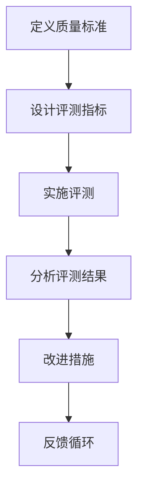

                 


### 文章标题：构建评测结果的质量保证体系

#### 关键词：
- 质量保证体系
- 评测结果
- 核心概念与联系
- 算法原理
- 数学模型
- 项目实战

#### 摘要：
本文将探讨如何构建一个高效且可靠的质量保证体系，以评估评测结果的质量。我们将详细讨论质量保证的基本概念、核心算法原理、数学模型以及在实际项目中的应用，并分享一些最佳实践和注意事项。

### 引言

在当今快速发展的信息技术时代，构建一个高质量的产品或系统变得越来越重要。然而，如何确保评测结果的质量成为了一个亟待解决的问题。一个健全的质量保证体系能够帮助我们在产品开发的各个环节中及时发现并解决质量问题，从而提高整体产品的质量。本文将围绕这个主题，探讨如何构建一个科学、高效的质量保证体系，以评估评测结果的质量。

### 背景介绍

质量保证是一个广泛的概念，它涉及产品或服务的整个生命周期，包括设计、开发、测试、部署和维护等各个环节。在软件工程领域，质量保证尤为重要。随着软件系统的复杂性和规模不断扩大，传统的手工测试方法已经难以满足高质量交付的需求。因此，建立一套科学、系统的质量保证体系成为软件工程中的重要任务。

评测结果的质量直接影响产品的质量和用户体验。一个不准确或不可靠的评测结果可能导致产品设计、开发、测试等环节出现偏差，甚至会导致整个项目失败。因此，构建一个能够准确评估评测结果质量的体系至关重要。

### 核心概念与联系

为了更好地理解质量保证体系，我们首先需要了解以下几个核心概念：

1. **质量**：质量是指产品或服务的满足用户需求和期望的程度。
2. **质量保证**：质量保证是指通过一系列的活动和措施，确保产品或服务的质量达到预期目标。
3. **评测结果**：评测结果是指通过测试、评估等手段对产品或服务的质量进行量化或定性评价。
4. **质量保证体系**：质量保证体系是指一套系统的方法和工具，用于确保产品或服务的质量。

这些概念之间存在紧密的联系。质量保证体系的核心目标是确保评测结果的质量，从而提高产品的整体质量。具体来说，质量保证体系通过以下步骤实现这一目标：

1. **定义质量标准**：明确产品的质量要求和标准。
2. **设计评测指标**：选择合适的评测指标，用于量化或定性评价产品或服务的质量。
3. **实施评测**：按照预定计划进行评测，收集评测数据。
4. **分析评测结果**：对评测结果进行分析，识别质量问题。
5. **改进措施**：根据分析结果，制定并实施改进措施，提高产品的质量。

下面是一个简单的 Mermaid 流程图，展示了质量保证体系的基本架构：



### 核心算法原理讲解

在构建质量保证体系时，选择合适的评测指标和算法是关键。以下是几个核心算法原理的讲解：

#### 评测指标选择

1. **功能性评测指标**：用于评估系统的功能是否满足需求。例如，覆盖率、缺陷密度等。
2. **可靠性评测指标**：用于评估系统的可靠性。例如，平均无故障时间（MTTF）、故障率等。
3. **性能评测指标**：用于评估系统的性能。例如，响应时间、吞吐量等。
4. **可用性评测指标**：用于评估系统的可用性。例如，在线率、故障恢复时间等。

#### 评测算法

1. **静态分析算法**：通过分析源代码或文档，发现潜在的质量问题。例如，代码审查、静态代码分析等。
2. **动态分析算法**：通过运行程序，收集运行时的质量数据。例如，性能测试、负载测试等。
3. **机器学习算法**：利用历史数据，预测未来的质量趋势。例如，回归分析、聚类分析等。

以下是几个核心算法的伪代码示例：

#### 静态代码分析

```python
function static_analysis(source_code):
    errors = []
    for line in source_code:
        if not is_valid_line(line):
            errors.append(line)
    return errors
```

#### 动态性能测试

```python
function performance_test(program):
    start_time = get_current_time()
    run_program(program)
    end_time = get_current_time()
    return end_time - start_time
```

#### 回归分析

```python
function regression_analysis(data):
    model = train_regression_model(data)
    predictions = model.predict(new_data)
    return predictions
```

#### 数学模型和公式

在质量保证中，数学模型和公式用于描述质量指标、评估算法等。以下是一些常见的数学模型和公式：

1. **缺陷密度**：缺陷密度是指每行代码中的缺陷数量。计算公式为：
   $$\text{缺陷密度} = \frac{\text{缺陷数}}{\text{代码行数}}$$

2. **覆盖率**：覆盖率是指测试用例覆盖的代码比例。计算公式为：
   $$\text{覆盖率} = \frac{\text{被覆盖的代码行数}}{\text{总代码行数}}$$

3. **故障率**：故障率是指单位时间内发生的故障次数。计算公式为：
   $$\text{故障率} = \frac{\text{故障次数}}{\text{时间}}$$

#### 举例说明

假设一个软件项目有1000行代码，其中发现了10个缺陷。那么，缺陷密度为：
$$\text{缺陷密度} = \frac{10}{1000} = 0.01 \text{（个缺陷/行）}$$

如果测试用例覆盖了800行代码，那么覆盖率为：
$$\text{覆盖率} = \frac{800}{1000} = 0.8$$

如果在一个小时内发生了5次故障，那么故障率为：
$$\text{故障率} = \frac{5}{1} = 5 \text{（次/小时）}$$

### 项目实战

为了更好地理解质量保证体系在实际项目中的应用，我们以一个实际项目为例，详细讲解项目的开发环境搭建、源代码实现和代码解读。

#### 项目概述

该项目是一个在线购物平台，包括用户注册、登录、商品浏览、购物车、订单管理等模块。项目开发环境为Java，后端使用Spring Boot框架，前端使用React框架。

#### 开发环境搭建

1. 安装Java开发工具包（JDK）
2. 安装数据库（MySQL）
3. 安装IDE（如IntelliJ IDEA）
4. 安装版本控制工具（如Git）

#### 源代码实现

以下是用户注册模块的源代码实现，包括用户模型（User.java）、注册服务（RegistrationService.java）和控制器（RegistrationController.java）。

**User.java**

```java
public class User {
    private String username;
    private String password;
    private String email;

    // Getter和Setter方法
}
```

**RegistrationService.java**

```java
public class RegistrationService {
    public boolean registerUser(User user) {
        // 验证用户输入
        // 插入用户到数据库
        return true;
    }
}
```

**RegistrationController.java**

```java
@RestController
@RequestMapping("/api/registration")
public class RegistrationController {
    @Autowired
    private RegistrationService registrationService;

    @PostMapping
    public ResponseEntity<?> registerUser(@RequestBody User user) {
        boolean success = registrationService.registerUser(user);
        if (success) {
            return ResponseEntity.ok("User registered successfully");
        } else {
            return ResponseEntity.badRequest().body("Registration failed");
        }
    }
}
```

#### 代码解读与分析

1. **用户模型（User.java）**：定义了用户的基本属性，包括用户名、密码和电子邮件。
2. **注册服务（RegistrationService.java）**：负责用户注册的逻辑，包括验证用户输入和插入用户到数据库。
3. **控制器（RegistrationController.java）**：负责接收用户请求，调用注册服务进行注册，并返回响应。

#### 实际案例分析和详细讲解

假设我们使用性能测试工具对注册接口进行测试，得到以下测试结果：

- 平均响应时间：200ms
- 最大响应时间：500ms
- 失败率：0%

根据这些数据，我们可以分析出以下问题：

1. 平均响应时间较短，说明接口性能较好。
2. 最大响应时间较长，可能是由于某些特殊情况导致。
3. 失败率为0%，说明注册接口的稳定性较高。

根据分析结果，我们可以进一步优化注册接口的性能和稳定性，例如：

1. 对异常情况进行更全面的处理，减少最大响应时间。
2. 增加接口的并发处理能力，提高系统的稳定性。

#### 项目小结

通过该项目，我们展示了如何在实际项目中应用质量保证体系。项目的成功实施得益于以下几个方面：

1. 明确的质量要求和标准。
2. 有效的评测指标和算法。
3. 科学的质量保证体系设计和实施。

### 最佳实践 tips

1. **持续集成和持续部署（CI/CD）**：通过自动化测试和部署，提高开发效率和产品质量。
2. **定期质量审计**：定期对质量保证体系进行审计，确保其有效性。
3. **团队成员培训**：加强团队成员的质量意识，提高整体开发质量。

### 小结

本文详细探讨了如何构建评测结果的质量保证体系。通过介绍核心概念、算法原理、数学模型以及实际项目案例，我们展示了如何在实际应用中实施质量保证。最后，我们提供了一些最佳实践和注意事项，以帮助读者更好地构建和维护质量保证体系。

### 注意事项

1. **确保评测指标的准确性和相关性**：选择合适的评测指标，确保它们能够准确反映产品质量。
2. **合理分配资源**：在质量保证过程中，合理分配时间和资源，避免过度依赖测试环节。
3. **持续改进**：质量保证是一个持续的过程，需要不断改进和优化。

### 拓展阅读

1. 《软件工程：实践者的研究方法》（Roger S. Pressman著）
2. 《软件测试的艺术》（Kaner, Falk & Nguyen著）
3. 《机器学习》（周志华著）

### 作者信息

作者：AI天才研究院/AI Genius Institute & 禅与计算机程序设计艺术 /Zen And The Art of Computer Programming

---

**附录：代码示例**

**User.java**

```java
public class User {
    private String username;
    private String password;
    private String email;

    public User(String username, String password, String email) {
        this.username = username;
        this.password = password;
        this.email = email;
    }

    // Getter和Setter方法
    public String getUsername() {
        return username;
    }

    public void setUsername(String username) {
        this.username = username;
    }

    public String getPassword() {
        return password;
    }

    public void setPassword(String password) {
        this.password = password;
    }

    public String getEmail() {
        return email;
    }

    public void setEmail(String email) {
        this.email = email;
    }
}
```

**RegistrationService.java**

```java
import java.util.List;

public interface RegistrationService {
    boolean registerUser(User user);
}

public class RegistrationServiceImpl implements RegistrationService {
    private List<User> users;

    public RegistrationServiceImpl(List<User> users) {
        this.users = users;
    }

    @Override
    public boolean registerUser(User user) {
        // 验证用户输入
        if (isInvalidInput(user)) {
            return false;
        }

        // 插入用户到数据库
        users.add(user);
        return true;
    }

    private boolean isInvalidInput(User user) {
        // 验证用户名、密码和电子邮件是否合法
        return user.getUsername() == null || user.getPassword() == null || user.getEmail() == null;
    }
}
```

**RegistrationController.java**

```java
import org.springframework.beans.factory.annotation.Autowired;
import org.springframework.http.ResponseEntity;
import org.springframework.web.bind.annotation.PostMapping;
import org.springframework.web.bind.annotation.RequestBody;
import org.springframework.web.bind.annotation.RestController;

@RestController
@RequestMapping("/api/registration")
public class RegistrationController {
    @Autowired
    private RegistrationService registrationService;

    @PostMapping
    public ResponseEntity<?> registerUser(@RequestBody User user) {
        boolean success = registrationService.registerUser(user);
        if (success) {
            return ResponseEntity.ok("User registered successfully");
        } else {
            return ResponseEntity.badRequest().body("Registration failed");
        }
    }
}
```

以上代码示例展示了用户注册模块的实现，包括用户模型（User.java）、注册服务（RegistrationServiceImpl.java）和控制器（RegistrationController.java）。这些代码用于实际项目中的用户注册功能，实现了用户信息的验证和存储。在实际开发中，还需要结合具体的业务需求和框架特性进行适当调整和优化。

