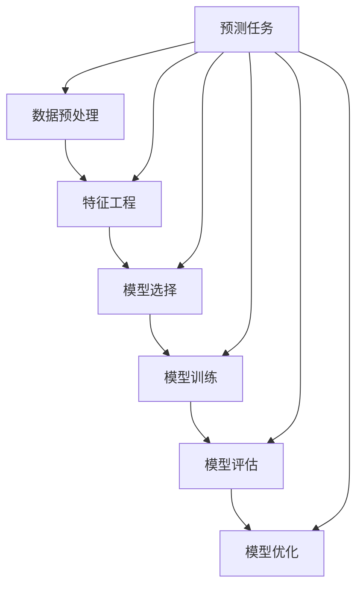

                 

### 引言与概述

#### 评测结果预测模型的重要性

在现代社会的各个领域，从商业决策、医疗诊断到科学研究，评测结果预测模型都扮演着至关重要的角色。这些模型能够从大量的数据中提取有用的信息，预测未来的趋势和结果，从而帮助决策者做出更准确、更有效的决策。特别是在大数据和人工智能迅速发展的今天，预测模型的应用范围和影响力不断扩大，成为许多行业不可或缺的技术工具。

在商业领域，预测模型可以用于市场需求的预测、产品销售趋势分析，以及客户行为分析等。例如，通过分析客户的购买历史和浏览行为，电商平台可以准确预测哪些商品在未来会有较高的销售潜力，从而调整库存和营销策略，提高销售额。在医疗领域，预测模型可以帮助医生预测疾病的发病趋势，优化治疗方案，提高疾病预防和管理的效果。在科学研究领域，预测模型可以辅助科学家进行实验设计和结果预测，加速科学研究的进展。

#### 预测模型的基本概念与原理

预测模型是一种利用历史数据来预测未来结果的数学模型。其基本原理是通过分析已有的数据，提取出数据中的模式和规律，然后利用这些模式和规律来预测新的数据。预测模型通常包括以下几个关键组件：

1. **数据收集与预处理**：收集相关的历史数据，并进行清洗、去噪、归一化等预处理操作，以确保数据的质量和一致性。
2. **特征工程**：从原始数据中提取出对预测任务有用的特征，这些特征可以是从数据中计算得出的统计量，也可以是经过人工定义的。
3. **模型选择**：根据预测任务的需求，选择合适的预测模型。常见的预测模型包括线性回归、决策树、神经网络等。
4. **模型训练**：使用历史数据来训练预测模型，使得模型能够学会从数据中提取模式和规律。
5. **模型评估**：通过评估指标来评估模型的性能，如准确率、召回率、F1分数等。
6. **模型优化**：根据评估结果，对模型进行调整和优化，以提高其预测性能。

#### 全书结构概述

本书旨在系统地介绍评测结果预测模型的理论基础、构建方法、评估与优化技术，以及实际应用案例。全书分为七个主要章节：

1. **引言与概述**：介绍评测结果预测模型的重要性、基本概念与原理，以及全书结构。
2. **基础理论与技术**：介绍预测模型的基本概念、分类、关键技术和原理。
3. **模型构建与训练**：详细讲解如何构建和训练预测模型，包括数据收集与预处理、特征工程、模型选择与训练策略等。
4. **模型评估与优化**：讨论如何评估预测模型的性能，并提出优化策略，包括评估指标、超参数调优、模型压缩与加速等。
5. **实际应用案例**：分析预测模型在不同领域的实际应用，包括商业、医疗、科学研究等。
6. **未来展望**：探讨预测模型的发展趋势和潜在应用领域。
7. **附录与资源**：提供相关的资源、工具和技术细节，以帮助读者更好地理解和应用预测模型。

通过本书的学习，读者将能够系统地掌握评测结果预测模型的理论基础和实践技能，为实际应用打下坚实的基础。

### 基础理论与技术

#### 预测模型的分类与特点

预测模型可以根据不同的分类标准进行分类。根据模型的结构，预测模型可以分为线性模型和非线性模型；根据模型的复杂性，可以分为简单模型和复杂模型；根据模型的应用领域，可以分为通用模型和专业模型。以下是几种常见的预测模型及其特点：

1. **线性回归模型**：
   - **特点**：线性回归模型是一种简单而强大的预测模型，它假设目标变量和特征变量之间存在线性关系。线性回归模型易于理解和实现，计算效率高，适用于数据量较小的场景。
   - **应用领域**：线性回归模型常用于数据拟合、趋势预测和统计分析。例如，在商业领域，它可以用于预测销售额、库存需求等。

2. **决策树模型**：
   - **特点**：决策树模型通过一系列的判断节点来对数据进行划分，形成一棵树形结构。它能够清晰地表达决策过程，易于理解和解释，但是可能会出现过拟合现象。
   - **应用领域**：决策树模型在分类和回归任务中都有广泛应用。例如，在金融领域，它可以用于客户信用评估、欺诈检测等。

3. **神经网络模型**：
   - **特点**：神经网络模型是一种基于生物神经网络的计算模型，具有强大的非线性处理能力。它能够自动学习特征，并且适用于处理大规模、复杂的数据集。
   - **应用领域**：神经网络模型广泛应用于图像识别、自然语言处理、语音识别等领域。例如，在医疗领域，它可以用于疾病诊断、药物发现等。

4. **集成模型**：
   - **特点**：集成模型是通过组合多个简单模型来构建一个更复杂的模型，旨在提高预测性能和鲁棒性。常见的集成模型包括随机森林、梯度提升机等。
   - **应用领域**：集成模型在许多领域都有成功应用。例如，在金融领域，它可以用于风险管理、投资组合优化等。

5. **时间序列模型**：
   - **特点**：时间序列模型用于分析随时间变化的数据，它假设时间序列中的数据点之间存在相关性。常见的时间序列模型包括ARIMA、LSTM等。
   - **应用领域**：时间序列模型在金融市场预测、天气预测、交通流量预测等领域有广泛应用。

#### 关键技术介绍

1. **数据预处理**：
   - **重要性**：数据预处理是预测模型构建的第一步，它对模型的性能有着重要的影响。
   - **方法**：数据预处理包括数据清洗、缺失值处理、数据归一化、数据标准化等操作。例如，对于缺失值，可以通过填补、删除或者插值等方法进行处理；对于异常值，可以通过截断、回归等策略进行处理。

2. **特征工程**：
   - **重要性**：特征工程是预测模型构建的关键步骤，它直接影响模型的性能。
   - **方法**：特征工程包括特征选择、特征提取、特征转换等。例如，通过特征选择可以去除无关或冗余的特征，通过特征提取可以生成新的特征，通过特征转换可以调整特征之间的关系。

3. **模型选择**：
   - **重要性**：选择合适的预测模型是构建有效预测模型的关键。
   - **方法**：选择模型时需要考虑预测任务的需求、数据的特点、模型的复杂性等因素。例如，对于简单且线性关系明显的任务，可以选择线性回归模型；对于复杂且非线性关系明显的任务，可以选择神经网络模型。

4. **模型训练**：
   - **重要性**：模型训练是预测模型构建的核心步骤，它决定了模型的预测能力。
   - **方法**：模型训练包括数据划分、模型初始化、迭代优化等步骤。例如，通过交叉验证可以避免过拟合，通过梯度下降算法可以优化模型参数。

5. **模型评估**：
   - **重要性**：模型评估是衡量模型性能的重要手段，它帮助决策者了解模型的预测能力。
   - **方法**：模型评估包括准确率、召回率、F1分数、ROC曲线等指标。例如，准确率可以衡量模型预测的正确性，F1分数可以平衡精确率和召回率。

6. **模型优化**：
   - **重要性**：模型优化是提高模型性能的关键步骤，它帮助决策者进一步提高模型的预测能力。
   - **方法**：模型优化包括超参数调优、模型压缩、模型加速等。例如，通过网格搜索可以找到最佳的超参数组合，通过模型压缩可以减少模型的计算量。

### 核心概念与联系

为了更好地理解预测模型的核心概念和联系，我们可以借助Mermaid流程图来展示这些概念之间的逻辑关系。



在这个流程图中，数据预处理、特征工程、模型选择、模型训练、模型评估和模型优化是预测模型构建的六个关键步骤。每个步骤都依赖于前一个步骤的结果，并且为后续步骤提供输入。预测任务是整个流程的起点和终点，它驱动着整个预测模型的构建过程。

通过这个流程图，我们可以清晰地看到预测模型构建过程中的各个步骤以及它们之间的联系，这有助于我们更好地理解预测模型的核心概念和构建方法。

#### 模型构建与训练

构建一个有效的预测模型是数据处理和分析的关键步骤。在这个过程中，数据收集与准备、模型设计、模型训练策略是三个核心环节。以下是详细的步骤和要点。

##### 数据收集与准备

数据收集与准备是预测模型构建的第一步，其质量直接影响模型的性能。以下是数据收集与准备的关键步骤：

1. **数据收集**：
   - 确定数据源：根据预测任务的需求，选择合适的数据源。数据源可以包括数据库、文件、API接口等。
   - 数据采集：使用工具如爬虫、数据库连接等，从数据源中获取所需数据。

2. **数据预处理**：
   - 数据清洗：去除无效、错误或重复的数据，确保数据的一致性和完整性。
   - 数据转换：将数据格式转换为适合分析和预测的格式。例如，将文本数据转换为数值数据。
   - 数据归一化/标准化：通过归一化或标准化处理，使不同特征的数据在同一尺度上，避免某些特征对模型产生过大的影响。

3. **数据分割**：
   - **训练集**：用于模型训练，通常占数据集的60%-80%。
   - **验证集**：用于模型评估，通常占数据集的10%-20%。
   - **测试集**：用于最终模型评估，通常占数据集的10%以下。

##### 模型设计

模型设计是预测模型构建的核心步骤，涉及选择合适的算法、定义模型架构和初始化模型参数。以下是模型设计的步骤和要点：

1. **模型选择**：
   - 根据预测任务的需求和数据特点，选择合适的模型。常见的模型包括线性回归、决策树、随机森林、神经网络等。
   - 考虑模型的复杂性、计算效率和预测性能。对于简单且线性关系明显的任务，可以选择线性回归；对于复杂且非线性关系明显的任务，可以选择神经网络。

2. **模型架构**：
   - 定义模型的输入层、隐藏层和输出层。例如，对于神经网络，需要确定隐藏层的数量、每个隐藏层的节点数量等。
   - 考虑模型的正则化方法，如L1正则化、L2正则化等，以防止过拟合。

3. **初始化参数**：
   - 初始化模型的权重和偏置。常见的初始化方法包括随机初始化、高斯初始化等。
   - 参数初始化的目的是使模型在训练过程中能够迅速收敛，并避免陷入局部最优。

##### 模型训练策略

模型训练是模型构建的关键步骤，其目标是优化模型参数，使模型能够准确预测新的数据。以下是模型训练的策略：

1. **训练算法**：
   - 选择合适的训练算法，如梯度下降、随机梯度下降、批量梯度下降等。每种算法都有其优缺点和适用场景。
   - 调整学习率，确保模型在训练过程中既能迅速收敛，又不会过拟合。

2. **迭代过程**：
   - 在训练过程中，模型会不断迭代，通过前向传播计算损失函数，然后通过反向传播更新模型参数。
   - 调整迭代次数，确保模型在验证集上的性能达到最佳。

3. **评估指标**：
   - 在训练过程中，需要定期评估模型的性能。常见的评估指标包括准确率、召回率、F1分数等。
   - 通过评估指标，可以判断模型是否过拟合或欠拟合，并调整训练策略。

4. **模型调参**：
   - 根据评估结果，调整模型参数，如学习率、正则化参数等。
   - 可以使用网格搜索、随机搜索等策略来找到最佳参数组合。

##### 伪代码示例

以下是构建预测模型的基本伪代码示例，展示了数据预处理、模型设计、模型训练和模型评估的步骤。

```python
# 数据预处理
def preprocess_data(data):
    # 数据清洗
    cleaned_data = clean_data(data)
    # 数据转换
    transformed_data = transform_data(cleaned_data)
    # 数据归一化
    normalized_data = normalize_data(transformed_data)
    return normalized_data

# 模型设计
def design_model(input_shape):
    # 初始化模型
    model = initialize_model(input_shape)
    # 定义模型架构
    model = define_model_architecture(model)
    return model

# 模型训练
def train_model(model, train_data, learning_rate):
    # 训练模型
    for epoch in range(num_epochs):
        # 前向传播
        predictions = forward_pass(model, train_data)
        # 计算损失函数
        loss = compute_loss(predictions, train_labels)
        # 反向传播
        backward_pass(model, loss, learning_rate)
        # 打印训练进度
        print(f"Epoch {epoch}: Loss = {loss}")

# 模型评估
def evaluate_model(model, test_data, test_labels):
    # 评估模型
    predictions = forward_pass(model, test_data)
    accuracy = compute_accuracy(predictions, test_labels)
    print(f"Test Accuracy: {accuracy}")

# 主程序
if __name__ == "__main__":
    # 收集数据
    data = collect_data()
    # 预处理数据
    preprocessed_data = preprocess_data(data)
    # 划分数据集
    train_data, test_data, train_labels, test_labels = split_data(preprocessed_data)
    # 设计模型
    model = design_model(train_data.shape[1:])
    # 训练模型
    learning_rate = set_learning_rate()
    train_model(model, train_data, learning_rate)
    # 评估模型
    evaluate_model(model, test_data, test_labels)
```

在这个伪代码示例中，我们首先定义了数据预处理函数，用于清洗、转换和归一化数据。然后，我们定义了模型设计函数，用于初始化模型和定义模型架构。接下来，我们定义了模型训练函数，用于迭代训练模型并更新模型参数。最后，我们定义了模型评估函数，用于评估模型的性能。整个程序通过调用这些函数，实现了从数据预处理到模型评估的全过程。

#### 模型评估与优化

模型评估与优化是预测模型构建过程中至关重要的一环。准确的评估可以确保模型的性能得到客观、全面的评价，而有效的优化则可以显著提升模型的预测能力。以下是模型评估与优化的详细方法。

##### 评估指标

选择合适的评估指标对于衡量模型性能至关重要。常见的评估指标包括：

1. **准确率（Accuracy）**：
   - **定义**：准确率是指模型预测正确的样本数量占总样本数量的比例。
   - **计算公式**：$$\text{Accuracy} = \frac{\text{预测正确数量}}{\text{总样本数量}}$$
   - **适用场景**：准确率适用于分类任务，但在类别不平衡时可能不够准确。

2. **召回率（Recall）**：
   - **定义**：召回率是指模型能够召回的实际正例样本数量占总正例样本数量的比例。
   - **计算公式**：$$\text{Recall} = \frac{\text{召回的正例数量}}{\text{实际正例数量}}$$
   - **适用场景**：召回率适用于医疗诊断、欺诈检测等任务，特别关注漏诊问题。

3. **精确率（Precision）**：
   - **定义**：精确率是指模型预测为正例的样本中实际为正例的比例。
   - **计算公式**：$$\text{Precision} = \frac{\text{召回的正例数量}}{\text{预测为正例的数量}}$$
   - **适用场景**：精确率适用于金融风控、垃圾邮件过滤等任务，特别关注误诊问题。

4. **F1分数（F1 Score）**：
   - **定义**：F1分数是精确率和召回率的调和平均，用于综合评价模型的性能。
   - **计算公式**：$$\text{F1 Score} = 2 \times \frac{\text{Precision} \times \text{Recall}}{\text{Precision} + \text{Recall}}$$
   - **适用场景**：F1分数适用于大多数分类任务，特别适用于类别不平衡的情况。

5. **ROC曲线与AUC（Area Under Curve）**：
   - **定义**：ROC曲线是真实阳性率（Recall）对假阳性率（1 - Precision）的曲线，AUC是ROC曲线下方的面积。
   - **适用场景**：ROC曲线与AUC适用于评估二分类模型的性能，特别是在类别不平衡的情况下。

##### 优化策略

在评估模型性能后，可以通过以下策略进行优化：

1. **超参数调优（Hyperparameter Tuning）**：
   - **方法**：超参数调优是调整模型中不易通过学习算法自动调整的参数，以优化模型性能。
   - **工具**：可以使用网格搜索（Grid Search）、随机搜索（Random Search）、贝叶斯优化（Bayesian Optimization）等方法。
   - **例子**：对于神经网络模型，可以调整学习率、隐藏层节点数、批量大小等超参数。

2. **模型调优（Model Tuning）**：
   - **方法**：模型调优是通过修改模型结构或算法来提升模型性能。
   - **例子**：增加隐藏层节点数、采用深度学习算法、加入正则化技术等。

3. **交叉验证（Cross-Validation）**：
   - **定义**：交叉验证是一种评估模型性能的方法，通过将数据集分割成多个子集，进行多次训练和验证。
   - **类型**：常见的交叉验证方法有K折交叉验证、留一法交叉验证等。
   - **作用**：交叉验证可以提供对模型性能的更稳健的估计，减少过拟合风险。

4. **集成方法（Ensemble Methods）**：
   - **定义**：集成方法是将多个模型合并成一个更强大的模型，以提高预测性能。
   - **类型**：常见的集成方法有随机森林（Random Forest）、梯度提升树（Gradient Boosting Tree）等。
   - **作用**：集成方法可以减少模型的方差，提高模型的泛化能力。

##### 超参数调优

超参数调优是优化模型性能的关键步骤，以下是一个简单的超参数调优流程：

1. **定义超参数空间**：
   - 根据模型的特性，确定需要调整的超参数及其可能取值范围。

2. **选择调优方法**：
   - 根据时间和计算资源，选择合适的调优方法，如网格搜索或随机搜索。

3. **执行调优**：
   - 使用调优方法，遍历超参数空间，评估每个组合的性能。

4. **选择最佳超参数**：
   - 根据评估结果，选择性能最佳的超参数组合。

5. **再次评估模型**：
   - 使用最佳超参数组合，重新训练模型，并进行评估。

##### 模型压缩与加速

为了提高模型的运行效率，尤其是在资源受限的环境下，可以对模型进行压缩和加速：

1. **模型压缩（Model Compression）**：
   - **方法**：通过减少模型参数数量、降低模型精度等手段，减小模型的大小。
   - **工具**：可以使用量化（Quantization）、剪枝（Pruning）等技术。

2. **模型加速（Model Acceleration）**：
   - **方法**：通过使用特定的硬件加速器（如GPU、TPU）或优化算法，提高模型的计算速度。
   - **工具**：可以使用深度学习框架（如TensorFlow、PyTorch）提供的优化功能。

##### 实践案例

以下是一个简单的超参数调优和模型压缩的实际案例：

```python
# 超参数调优
from sklearn.model_selection import GridSearchCV
from sklearn.ensemble import RandomForestClassifier

# 定义模型
model = RandomForestClassifier()

# 定义超参数空间
param_grid = {
    'n_estimators': [100, 200, 300],
    'max_depth': [10, 20, 30],
    'min_samples_split': [2, 5, 10]
}

# 执行网格搜索
grid_search = GridSearchCV(model, param_grid, cv=5)
grid_search.fit(train_data, train_labels)

# 获取最佳超参数
best_params = grid_search.best_params_

# 模型压缩
import tensorflow as tf

# 定义模型
model = tf.keras.Sequential([
    tf.keras.layers.Dense(128, activation='relu', input_shape=(input_shape,)),
    tf.keras.layers.Dense(1, activation='sigmoid')
])

# 编译模型
model.compile(optimizer='adam', loss='binary_crossentropy', metrics=['accuracy'])

# 减少模型精度
converter = tf.lite.TFLiteConverter.from_keras_model(model)
converter.optimizations = [tf.lite.Optimize.DEFAULT]
tflite_model = converter.convert()

# 保存模型
with open('model.tflite', 'wb') as f:
    f.write(tflite_model)
```

在这个案例中，我们使用`GridSearchCV`进行超参数调优，选择最佳超参数组合，然后使用`tensorflow`进行模型压缩，生成更小的`.tflite`模型文件，以便在资源受限的环境下部署。

通过这些评估与优化策略，我们可以构建出性能优越、稳定可靠的预测模型，从而在实际应用中取得更好的效果。

### 实际应用案例

预测模型在商业、医疗和科学研究等领域的实际应用取得了显著的成果，下面我们将分别探讨这些领域的应用案例。

#### 商业领域的应用

在商业领域，预测模型被广泛应用于市场分析、销售预测和客户行为分析等。

1. **市场分析**：
   - **案例**：一家大型电商平台使用预测模型来分析市场趋势和竞争对手的动态。通过分析历史销售数据、用户浏览行为和社交媒体上的讨论，模型可以预测未来市场的需求变化，帮助电商平台调整库存和营销策略，从而提高销售额。
   - **效果**：通过预测模型，电商平台能够更准确地把握市场变化，提前准备库存，减少库存过剩和短缺的问题，提高了运营效率和客户满意度。

2. **销售预测**：
   - **案例**：一家制造业公司使用预测模型来预测未来的产品需求。通过分析历史销售数据、季节性因素和市场趋势，模型可以预测未来几个月甚至几年的销售量。
   - **效果**：通过销售预测模型，公司能够提前安排生产计划，避免生产过剩或不足，优化生产成本，提高资源利用率。

3. **客户行为分析**：
   - **案例**：一家银行使用预测模型来分析客户的行为和需求，以便提供个性化的金融服务。通过分析客户的交易记录、贷款还款记录和社交媒体活动，模型可以预测客户的信用风险和潜在需求。
   - **效果**：通过客户行为分析模型，银行能够更精准地识别高风险客户，制定相应的风险管理策略，同时能够提供个性化的金融产品和服务，提高客户满意度和忠诚度。

#### 医疗领域的应用

在医疗领域，预测模型被广泛应用于疾病预测、诊断和治疗方案优化等。

1. **疾病预测**：
   - **案例**：一种利用预测模型来预测心脏病发病风险的系统。通过分析患者的年龄、血压、血脂等健康指标，模型可以预测患者未来几年内发生心脏病的风险。
   - **效果**：通过疾病预测模型，医生可以提前识别高风险患者，采取预防措施，降低心脏病发病率和死亡率。

2. **诊断**：
   - **案例**：一种利用深度学习模型进行肺癌诊断的系统。通过分析患者的CT扫描图像，模型可以检测出肺癌的早期迹象，帮助医生做出准确的诊断。
   - **效果**：通过诊断模型，医生能够更早地发现肺癌，提高治愈率，同时减少了不必要的侵入性检查，降低了患者的痛苦和费用。

3. **治疗方案优化**：
   - **案例**：一种利用预测模型来优化癌症治疗方案的系统。通过分析患者的基因信息、肿瘤类型和治疗历史，模型可以推荐个性化的治疗方案，提高治疗效果。
   - **效果**：通过治疗方案优化模型，医生能够为患者制定更有效的治疗方案，减少副作用和复发率，提高生存率。

#### 科学研究领域的应用

在科学研究领域，预测模型被广泛应用于实验设计、结果预测和科学发现。

1. **实验设计**：
   - **案例**：一种利用预测模型来优化实验设计的系统。通过分析已有的实验数据，模型可以预测新的实验结果，帮助科学家设计更高效的实验方案。
   - **效果**：通过预测模型，科学家能够更快地获取实验结果，减少实验次数和成本，提高研究效率。

2. **结果预测**：
   - **案例**：一种利用预测模型来预测化学反应结果的系统。通过分析反应物的结构和性质，模型可以预测化学反应的产物和反应路径。
   - **效果**：通过结果预测模型，科学家能够更准确地预测化学反应的结果，减少实验失败的风险，提高研究成功率。

3. **科学发现**：
   - **案例**：一种利用预测模型来发现新的科学规律的系统。通过分析大量的科学数据，模型可以识别出新的科学规律和现象。
   - **效果**：通过科学发现模型，科学家能够发现新的科学规律和现象，推动科学研究的进步。

通过这些实际应用案例，我们可以看到预测模型在各个领域的广泛应用和巨大潜力。预测模型不仅提高了业务运营的效率，优化了医疗诊断和治疗，还推动了科学研究的创新和发展。未来，随着预测技术的不断进步和数据的积累，预测模型将在更多领域发挥重要作用。

### 未来展望

随着人工智能和大数据技术的快速发展，评测结果预测模型的应用前景将越来越广泛。未来，预测模型的发展趋势和潜在应用领域将体现在以下几个方面：

#### 1. 深度学习与增强学习

深度学习和增强学习是预测模型的重要发展方向。深度学习通过多层神经网络可以处理复杂非线性关系，能够从大量数据中自动提取特征。增强学习则通过试错和优化策略，使模型能够在动态环境中不断改进，从而实现更高的预测准确性。未来，深度学习和增强学习将广泛应用于自动驾驶、机器人、智能客服等领域。

#### 2. 时序预测与强化学习

时序预测模型在金融、气象、交通等领域具有广泛的应用潜力。结合强化学习技术，时序预测模型可以更好地应对动态环境和不确定性。例如，在金融市场预测中，结合市场数据和历史交易数据，时序预测模型可以提供更准确的交易策略，帮助投资者做出更明智的决策。

#### 3. 多模态数据处理

随着物联网和传感器技术的普及，多模态数据（如图像、音频、文本等）将越来越多地应用于预测模型。多模态数据处理技术可以通过整合不同类型的数据，提高预测模型的准确性和泛化能力。例如，在医疗诊断中，结合患者的医疗记录、基因数据和生理信号，多模态预测模型可以提供更全面的诊断结果。

#### 4. 小样本学习与数据增强

在数据稀缺的领域，如医学影像和罕见病研究，小样本学习技术显得尤为重要。通过数据增强方法，如生成对抗网络（GANs）、迁移学习等，可以扩展训练数据集，提高模型在少量数据上的预测性能。未来，小样本学习和数据增强技术将在更多领域得到应用，推动预测模型的突破。

#### 5. 边缘计算与实时预测

随着边缘计算的兴起，越来越多的计算任务将在数据产生的边缘设备上完成，从而实现实时预测。边缘计算可以降低延迟，提高系统的响应速度和可靠性。例如，在智能交通系统中，实时预测交通流量和路况，可以为驾驶员提供最佳路线，缓解交通拥堵。

#### 潜在应用领域与挑战

未来，预测模型将在更多领域发挥重要作用，如智能城市、智能家居、环境保护、能源管理、农业等。然而，这些应用也面临一些挑战：

1. **数据隐私与安全**：随着预测模型对数据的依赖性增加，数据隐私和安全成为重要问题。如何保护用户数据隐私，确保数据安全，是未来需要解决的关键问题。

2. **算法透明性与解释性**：当前许多预测模型（如深度神经网络）缺乏透明性和解释性，难以理解其决策过程。提高算法的透明性和解释性，使其更易于被用户理解和接受，是未来需要关注的重要方向。

3. **计算资源与能耗**：随着预测模型复杂度的增加，计算资源和能耗需求也在不断增加。如何在保证预测性能的同时，降低计算资源和能耗消耗，是未来需要解决的重要问题。

4. **模型可靠性与鲁棒性**：预测模型在应对异常数据、噪声数据和不平衡数据时，可能表现出较低的可靠性。如何提高模型的鲁棒性和可靠性，使其在不同环境下都能保持稳定的预测性能，是未来需要解决的关键问题。

总之，未来预测模型将在更多领域发挥重要作用，推动科技和社会的进步。同时，我们也需要面对一系列挑战，不断优化和改进预测模型，以满足实际应用的需求。

### 附录与资源

#### 相关资源链接

1. **数据集与工具**：
   - [Kaggle](https://www.kaggle.com/datasets)：提供丰富的数据集和开源工具。
   - [UCI机器学习库](https://archive.ics.uci.edu/ml/index.php)：提供各种领域的标准数据集。

2. **预测模型开源库**：
   - [Scikit-learn](https://scikit-learn.org/)：Python开源机器学习库，包含多种预测模型。
   - [TensorFlow](https://www.tensorflow.org/)：Google开发的深度学习开源框架。
   - [PyTorch](https://pytorch.org/)：Facebook开发的深度学习开源框架。

3. **学习资源**：
   - [Coursera](https://www.coursera.org/)：提供机器学习和人工智能课程。
   - [edX](https://www.edx.org/)：提供包括机器学习在内的多种技术课程。

#### 工具与技术详情

1. **数据预处理工具**：
   - **Pandas**：Python数据操作库，用于数据清洗和转换。
   - **NumPy**：Python数值计算库，用于数据归一化和标准化。

2. **特征工程工具**：
   - **Scikit-learn**：提供多种特征选择和提取方法。
   - **Feature-engine**：Python库，用于构建和自动化特征工程。

3. **预测模型工具**：
   - **Scikit-learn**：提供多种预测模型，如线性回归、决策树、随机森林等。
   - **TensorFlow**：提供深度学习预测模型，如神经网络、卷积神经网络等。

4. **评估与优化工具**：
   - **MLflow**：提供模型管理、评估和优化的工具。
   - **Hyperopt**：Python库，用于超参数调优。

#### 参考文献

1. **Hastie, T., Tibshirani, R., & Friedman, J. (2009). The Elements of Statistical Learning: Data Mining, Inference, and Prediction. Springer.
2. **Goodfellow, I., Bengio, Y., & Courville, A. (2016). Deep Learning. MIT Press.
3. **Chollet, F. (2015). Deep Learning with Python. Manning Publications.
4. **Pedregosa, F., Varoquaux, G., Gramfort, A., Michel, V., Thirion, B., Grisel, O., ... & Duchesnay, É. (2011). Scikit-learn: Machine learning in Python. Journal of Machine Learning Research, 12, 2825-2830.
5. **Abadi, M., Barham, P., Chen, J., Chen, Z., Dean, A., Devin, M., ... & Yang, C. (2016). TensorFlow: A System for Large-Scale Machine Learning. In OSDI (pp. 265-283). ACM.

通过这些资源，读者可以进一步了解预测模型的相关技术，拓展学习内容，提高实际应用能力。希望这些资源能够对读者的研究和学习提供帮助。

### 最佳实践 Tips、小结、注意事项、拓展阅读

#### 最佳实践 Tips

1. **数据清洗与预处理**：确保数据质量是构建有效预测模型的关键。在开始模型构建之前，充分进行数据清洗和预处理，包括处理缺失值、异常值和数据归一化等。

2. **选择合适的评估指标**：根据实际问题和业务需求，选择合适的评估指标。例如，在医疗诊断中，召回率可能比精确率更重要。

3. **模型调优与验证**：模型调优是提高预测性能的关键。使用交叉验证等方法进行模型验证，避免过拟合和欠拟合。

4. **利用集成方法**：集成方法如随机森林和梯度提升机通常能提高模型的预测性能。在资源允许的情况下，考虑使用集成方法。

#### 小结

本文系统地介绍了评测结果预测模型的理论基础、构建方法、评估与优化技术，以及实际应用案例。通过学习本文，读者可以掌握预测模型的基本概念、构建和优化方法，为实际应用打下坚实基础。

#### 注意事项

1. **数据隐私**：在实际应用中，注意保护用户数据隐私，遵守相关法律法规。

2. **模型解释性**：提高模型解释性，确保决策过程透明和可解释。

3. **模型部署**：模型部署前，确保模型在不同环境和数据集上具有稳定和可靠的性能。

#### 拓展阅读

1. **《机器学习实战》**：提供了丰富的实际案例和详细的算法实现。

2. **《深度学习》**：全面介绍了深度学习的理论和应用。

3. **《数据科学入门》**：介绍了数据科学的基础知识和实际应用。

通过拓展阅读，读者可以更深入地了解预测模型和相关技术，为实际应用提供更多灵感和方法。希望本文能对读者在预测模型研究和应用过程中有所帮助。

## 结语

本文系统地介绍了评测结果预测模型的理论基础、构建方法、评估与优化技术，以及实际应用案例。通过详细的分析和实例，读者可以掌握预测模型的基本概念、构建和优化方法，为实际应用打下坚实基础。随着人工智能和大数据技术的不断发展，预测模型在各个领域的应用前景将越来越广泛。希望本文能激发读者对预测模型的兴趣，继续探索和深入研究。

作者：AI天才研究院/AI Genius Institute & 禅与计算机程序设计艺术 /Zen And The Art of Computer Programming


