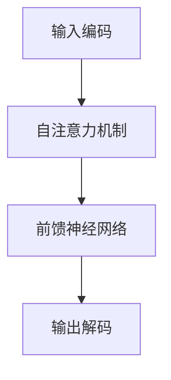
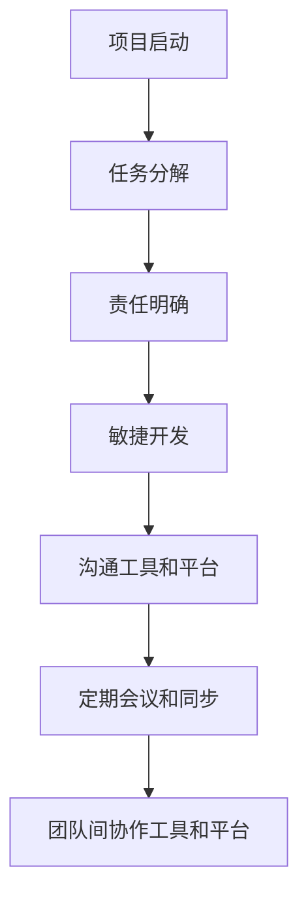
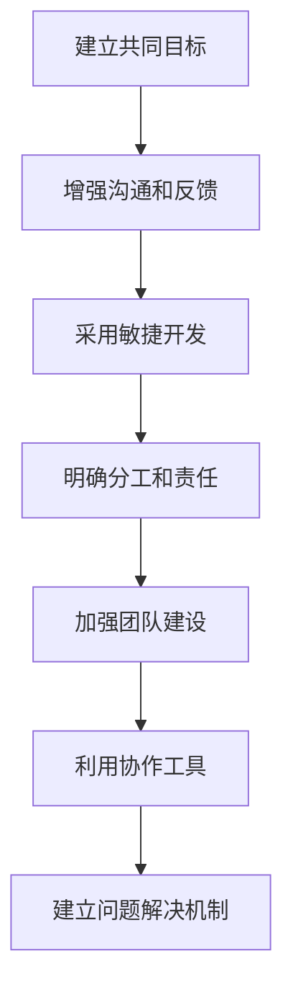
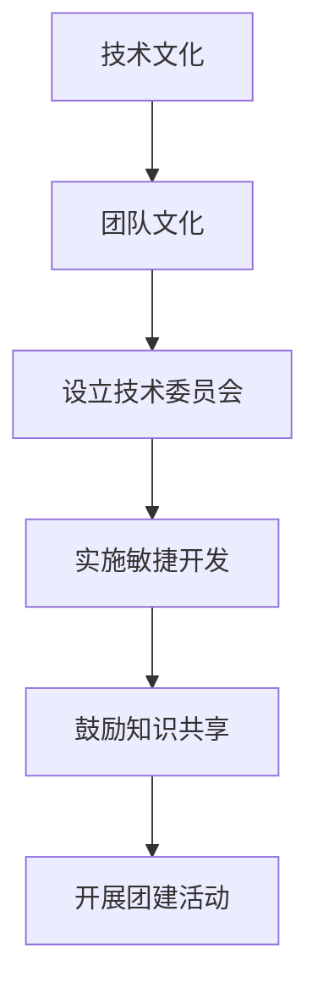
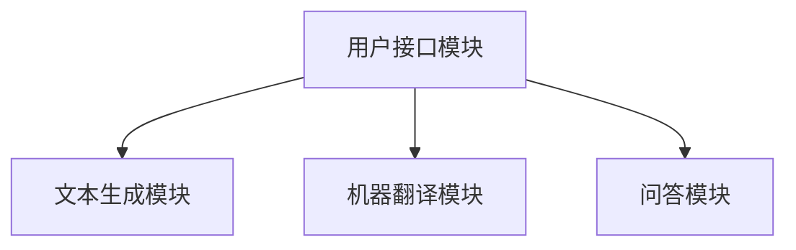

                 

### 引言

在现代IT行业，跨团队协作已逐渐成为企业提高开发效率和项目成功的关键因素。然而，随着技术的迅猛发展，尤其是大型语言模型（LLM）技术的崛起，如何构建一个支持跨团队协作的LLM应用开发文化，成为众多企业面临的新挑战。本文旨在探讨如何通过建立一套有效的LLM应用开发文化，促进跨团队协作，从而提升项目的整体质量和效率。

当前，LLM技术凭借其强大的自然语言理解和生成能力，正在逐步渗透到各个行业，如金融、医疗、教育等，为各种应用场景提供了强大的技术支持。然而，LLM应用开发并非一蹴而就，它涉及从需求分析、系统设计、开发实现到测试和部署等多个环节，这些环节的顺利进行离不开高效的团队协作。跨团队协作的挑战主要体现在以下几个方面：

1. **技术差异**：不同团队往往专注于不同的技术领域，例如数据工程、机器学习、前端开发等，技术差异可能导致沟通障碍。
2. **任务分工**：明确和高效的分工是跨团队协作的基础，但在实际操作中，如何平衡各团队的任务和资源分配是一个难题。
3. **沟通协作**：频繁、有效的沟通是确保项目顺利进行的关键，但由于团队成员的时间和地点分布，沟通协作的难度较大。
4. **文化融合**：不同团队的文化差异可能导致协作效率低下，甚至出现团队冲突。

本文将围绕上述挑战，提出一系列解决方案，并通过具体案例和实践经验，探讨如何构建一个支持跨团队协作的LLM应用开发文化。文章将从以下几个方面展开：

1. **LLM基础**：介绍LLM的基本概念、发展历程、核心原理和应用场景，为后续讨论提供技术背景。
2. **团队协作**：分析跨团队协作的重要性、协作机制和方法，提出有效的协作策略。
3. **应用开发文化**：探讨如何建立良好的应用开发文化，包括技术文化、团队文化等。
4. **项目实践**：分享具体的LLM应用开发案例，涵盖需求分析、系统设计、开发实现、测试和部署等环节。
5. **总结与展望**：对全书内容进行总结，展望LLM应用开发文化的发展趋势。

通过逐步分析推理，本文希望能为广大从事LLM应用开发的工程师和管理人员提供有价值的参考和指导。

### LLM基础

#### 基本概念

大型语言模型（Large Language Model，简称LLM）是一种基于深度学习技术的自然语言处理（Natural Language Processing，简称NLP）模型，其核心在于通过学习海量文本数据，模拟人类的语言生成和理解能力。LLM通过训练数以亿计的参数，以捕捉语言中的复杂模式和规律，从而实现文本的生成、翻译、摘要、问答等功能。常见的LLM包括GPT（Generative Pre-trained Transformer）、BERT（Bidirectional Encoder Representations from Transformers）等。

#### 发展历程

LLM技术的发展经历了多个阶段。最初的NLP模型多为规则驱动的，例如基于关键词匹配的方法。随后，统计方法如隐马尔可夫模型（HMM）和条件概率模型逐渐兴起，它们通过分析文本中的统计特征，尝试提高文本处理的准确性。进入21世纪，随着深度学习技术的突破，NLP领域迎来了新的发展机遇。2018年，Google推出的BERT模型在多个NLP任务上取得了显著突破，标志着LLM时代的到来。随后，GPT-3、T5等更大规模、更高性能的LLM模型相继问世，进一步推动了NLP技术的发展。

#### 核心原理

LLM的核心原理基于深度学习中的变换器模型（Transformer），这是一种基于自注意力机制的模型结构，能够捕捉长距离的依赖关系。具体而言，LLM通过以下几个关键步骤实现文本处理：

1. **输入编码**：将文本转换为固定长度的向量表示，通常使用词嵌入（word embeddings）技术，如Word2Vec、GloVe等。
2. **自注意力机制**：通过自注意力机制计算文本中各个词之间的关系，使得模型能够关注到文本中重要的信息。
3. **前馈神经网络**：在自注意力层之后，添加多层前馈神经网络，进一步提取和融合特征。
4. **输出解码**：将处理后的特征映射到输出空间，生成目标文本或执行特定任务。

#### 应用场景

LLM在多个应用场景中展现出了强大的能力：

1. **文本生成**：生成文章、故事、新闻报道等自然语言文本。
2. **机器翻译**：实现多种语言之间的准确翻译，如Google Translate等。
3. **问答系统**：通过理解和回答用户提出的问题，如ChatGPT、Duolingo等。
4. **文本摘要**：提取文本的核心内容，生成简洁的摘要，如NewsSummarizer等。
5. **对话系统**：构建智能对话系统，实现与用户的自然互动，如Apple Siri、Amazon Alexa等。

#### Mermaid 流程图

为了更直观地理解LLM的核心原理，我们可以使用Mermaid语言绘制一个流程图：



此图展示了LLM处理文本的四个主要步骤：输入编码、自注意力机制、前馈神经网络和输出解码。

通过上述介绍，我们可以看到LLM技术不仅具有强大的基础，而且在实际应用中也展现出巨大的潜力。接下来，我们将进一步探讨如何在跨团队协作中充分利用LLM技术，提升项目开发效率。

### 团队协作的重要性

在LLM应用开发过程中，跨团队协作的重要性不可忽视。高效、协同的团队协作能够显著提高项目开发的效率和质量，解决技术差异、任务分工、沟通协作和文化融合等方面的挑战。以下从几个方面详细分析跨团队协作的重要性。

首先，**技术差异**是跨团队协作中的一个常见挑战。不同的团队通常专注于不同的技术领域，如数据工程、机器学习、前端开发等。这种技术差异可能导致团队成员在沟通和协作时产生误解和障碍。例如，数据工程师可能更熟悉数据处理和存储技术，而机器学习工程师则擅长算法实现和模型训练。为了解决这个问题，团队需要建立一个共同的技术语言和框架，确保每个成员都能理解其他团队的技术背景和需求。同时，定期的技术交流和培训也是必不可少的，通过这些活动，团队成员可以互相学习，提升整体技术水平。

其次，**任务分工**是跨团队协作的基础。在一个复杂的项目中，明确和高效的分工能够确保项目进度和资源得到合理利用。然而，在实际操作中，如何平衡各团队的任务和资源分配是一个难题。为了解决这一问题，团队可以采用敏捷开发方法，如Scrum或Kanban，通过迭代和增量式开发，逐步明确和调整任务分配。此外，使用项目管理工具，如JIRA或Trello，可以实时跟踪任务进度，确保每个成员都能清晰了解自己的职责和目标。

第三，**沟通协作**是确保项目顺利进行的关键。在跨团队协作中，频繁、有效的沟通至关重要。但由于团队成员的时间和地点分布，沟通协作的难度较大。为了克服这一挑战，团队可以采用多种沟通工具和平台，如Slack、Zoom、Microsoft Teams等，确保信息能够及时传递。此外，定期召开团队会议，如每日站会、周会或月度会议，可以确保团队成员之间的沟通畅通，及时解决遇到的问题。在会议中，可以采用鱼骨图或因果图等工具，帮助团队成员分析和解决复杂问题。

最后，**文化融合**是跨团队协作中的一大挑战。不同团队的文化差异可能导致协作效率低下，甚至出现团队冲突。为了实现文化融合，团队需要建立一种共同的文化价值观，如开放、协作、创新等，并确保这些价值观在团队中的每个成员中得到贯彻。此外，通过团队建设活动，如团队拓展训练、团建活动等，可以增强团队成员之间的信任和合作意识，促进文化融合。

总之，跨团队协作在LLM应用开发中具有至关重要的作用。通过有效解决技术差异、任务分工、沟通协作和文化融合等方面的挑战，团队可以提升项目开发效率，确保项目顺利进行。接下来，我们将进一步探讨如何在LLM应用开发中建立有效的协作机制和方法。

### 跨团队协作机制

在LLM应用开发过程中，建立有效的跨团队协作机制是确保项目顺利进行的关键。以下从几个方面介绍常见的协作机制和方法：

#### 敏捷开发方法

敏捷开发方法，如Scrum和Kanban，是跨团队协作的有效工具。Scrum方法通过迭代和增量式开发，将项目划分为多个短期迭代（通常为2-4周），在每个迭代中，团队聚焦于完成具体的功能模块。通过每日站会、周会和回顾会，Scrum确保团队成员能够及时沟通，解决问题，调整计划。Kanban方法则通过看板（Kanban Board）可视化项目进度，帮助团队监控任务状态，避免工作积压和瓶颈。通过限制工作在流程中的数量（即“工作在进展中”的数量限制），Kanban有助于提高团队的工作效率和质量。

#### 沟通工具和平台

有效的沟通是跨团队协作的基石。为了确保信息传递的及时性和准确性，团队可以采用多种沟通工具和平台。例如，Slack是一个流行的团队沟通工具，它支持实时聊天、文件共享和任务分配等功能。Zoom和Microsoft Teams则是视频会议和在线协作的强大工具，适用于远程团队之间的沟通和协作。此外，JIRA和Trello等项目管理工具可以帮助团队实时跟踪任务进度，确保每个成员都能清晰了解项目的状态和目标。

#### 定期会议和同步

定期会议是团队协作的重要环节。每日站会、周会、月度会议等不同类型的会议，有助于团队成员之间保持沟通和同步。每日站会（Daily Stand-up）通常持续15-30分钟，每个团队成员分享自己昨天的工作成果、今天的工作计划和遇到的问题。这种简短的会议能够确保团队成员之间的快速更新和问题解决。周会和月度会议则更侧重于项目进度、风险管理、决策制定等更宏观的问题。通过这些会议，团队可以确保项目按计划推进，及时调整策略和资源分配。

#### 任务分解和责任明确

明确的任务分解和责任分配是跨团队协作的基础。在项目启动阶段，团队需要将大任务分解为多个小任务，并明确每个任务的负责人。任务分解可以采用WBS（Work Breakdown Structure）方法，将项目划分为可管理的子任务，确保每个任务都有明确的目标和负责人。在任务分配过程中，团队应充分考虑成员的专业技能和工作负荷，确保任务分配公平合理。此外，使用任务跟踪工具（如JIRA或Trello），可以实时监控任务进度，确保每个任务都能按时完成。

#### 团队间协作工具和平台

为了提高跨团队协作的效率，团队可以采用多种协作工具和平台。例如，GitLab和GitHub等版本控制系统，可以确保代码的版本管理和团队协作的一致性。Confluence和Notion等协作平台，可以用于文档管理、知识共享和团队协作。这些工具和平台不仅提高了信息传递的效率，还促进了团队成员之间的沟通和合作。

#### Mermaid 流程图

为了更直观地展示跨团队协作的机制和方法，我们可以使用Mermaid语言绘制一个流程图：



此图展示了跨团队协作的主要步骤：项目启动、任务分解、责任明确、敏捷开发、沟通工具和平台、定期会议和同步、团队间协作工具和平台。

通过上述协作机制和方法的建立，团队可以确保在LLM应用开发过程中，各个团队之间能够高效、协同地工作，从而提升项目的整体质量和效率。接下来，我们将进一步探讨如何通过建立良好的应用开发文化，进一步促进跨团队协作。

### 跨团队协作方法

在实际操作中，如何有效地促进跨团队协作，确保LLM应用开发项目的顺利进行，是每个团队都需要面对的挑战。以下是一些实用的方法和策略：

#### **1. 建立共同的目标和愿景**

共同的目标和愿景是团队协作的基石。在项目启动阶段，团队应明确项目的目标，并确保所有成员对目标有清晰的认识。通过定期的团队会议和讨论，团队成员可以共同制定项目愿景，明确项目的重要里程碑和预期成果。这种共同的目标和愿景有助于增强团队的凝聚力，激发成员的积极性和责任感。

#### **2. 增强沟通和反馈机制**

有效的沟通和反馈机制是跨团队协作的关键。首先，团队应选择合适的沟通工具和平台，如Slack、Zoom、JIRA等，确保信息传递的及时性和准确性。其次，团队应建立定期的沟通和反馈机制，如每日站会、周会和月度回顾会，确保团队成员之间能够及时交流和解决问题。在沟通中，鼓励团队成员积极分享自己的观点和反馈，通过开放、透明的沟通，增强团队间的信任和理解。

#### **3. 采用敏捷开发方法**

敏捷开发方法，如Scrum和Kanban，能够有效提高团队协作的效率。通过迭代和增量式开发，团队可以将大任务分解为小任务，确保每个迭代都能交付具体的功能模块。在每次迭代结束后，团队应进行回顾和总结，识别和解决潜在的问题，不断优化开发流程。敏捷开发方法的核心理念是“快速迭代、持续改进”，通过不断的反馈和调整，团队可以更好地应对变化和挑战。

#### **4. 明确分工和责任**

明确分工和责任是高效团队协作的基础。在项目启动阶段，团队应详细讨论并确定每个成员的角色和职责，确保任务分配公平合理。通过使用项目管理工具，如JIRA或Trello，团队可以实时跟踪任务进度，确保每个任务都有明确的负责人和截止日期。此外，团队应建立定期检查机制，确保任务按时完成，并及时解决遇到的问题。

#### **5. 加强团队建设和文化建设**

团队建设活动和文化建设有助于增强团队成员之间的信任和合作意识。通过定期的团队拓展训练、团建活动等，团队成员可以相互了解，增进感情。此外，团队应建立一种开放、协作、创新的文化，鼓励成员积极参与和分享，促进知识的传递和经验的积累。这种良好的团队文化有助于提高团队的凝聚力和协作效率。

#### **6. 利用协作工具和平台**

现代协作工具和平台为跨团队协作提供了强大的支持。GitLab和GitHub等版本控制系统可以确保代码的一致性和版本管理。Confluence和Notion等协作平台可以用于文档管理、知识共享和团队协作。通过这些工具，团队成员可以方便地共享信息、协同工作，提高工作效率。此外，使用项目管理工具，如JIRA或Trello，可以实时监控项目进度，确保项目按计划推进。

#### **7. 建立问题解决机制**

在项目开发过程中，难免会遇到各种问题和挑战。为了有效解决问题，团队应建立问题解决机制，如问题跟踪系统、问题评审会议等。通过这些问题解决机制，团队可以及时识别和解决遇到的问题，确保项目进度不受影响。此外，团队应鼓励成员提出问题和建议，通过开放、透明的讨论，共同寻找解决方案。

通过上述方法，团队可以在LLM应用开发项目中实现高效、协同的工作。以下是一个简化的Mermaid流程图，展示了跨团队协作的方法：



通过逐步实施这些协作方法，团队可以确保在LLM应用开发项目中实现高效、协同的工作，从而提升项目的整体质量和效率。

### 应用开发文化

在LLM应用开发中，建立良好的应用开发文化至关重要。一个积极向上、协作高效的文化环境能够激发团队成员的创造力，提升项目的整体质量和效率。以下从技术文化、团队文化等方面探讨如何建立和应用良好的应用开发文化。

#### **技术文化**

技术文化是应用开发文化的核心，它涵盖了团队成员的技术素养、技术追求和技术实践。为了建立良好的技术文化，团队应从以下几个方面入手：

1. **技术素养**：团队成员应具备扎实的技术基础和持续学习的意识。团队可以通过定期的技术培训、内部讲座和分享会，提升成员的技术能力。同时，鼓励团队成员参加外部技术会议和研讨会，了解最新的技术趋势和研究成果。

2. **技术追求**：团队应追求技术创新和卓越。通过设立技术挑战和目标，鼓励团队成员积极探索新的技术和解决方案。例如，可以设立技术竞赛，鼓励团队成员提出创新的技术方案，并通过实践验证其可行性。

3. **技术实践**：团队应建立规范的技术实践，如代码审查、自动化测试、持续集成和持续交付等。这些实践有助于确保代码质量和项目进度，同时提高团队的开发效率。通过技术实践的落实，团队成员可以养成良好的技术习惯，提升整体技术实力。

#### **团队文化**

团队文化是应用开发文化的基石，它关系到团队成员的协作和沟通效果。为了建立良好的团队文化，团队应关注以下几个方面：

1. **协作精神**：团队应鼓励成员之间的协作和互助。通过定期的团队活动，如团队建设训练、团建活动等，增强团队成员之间的信任和默契。在项目开发过程中，团队应鼓励成员积极参与，共同解决问题，共同承担责任。

2. **开放沟通**：团队应建立开放、透明的沟通机制。通过定期的团队会议、讨论和反馈，确保团队成员能够及时交流信息，分享经验和观点。在沟通中，应鼓励成员勇于表达自己的意见，通过开放、坦诚的讨论，共同找到最佳解决方案。

3. **创新意识**：团队应鼓励成员保持创新意识，勇于尝试新的思路和方法。通过设立创新奖项和激励机制，鼓励团队成员提出创新的想法，并为创新实践提供支持和资源。

4. **持续改进**：团队应不断反思和改进，通过定期的回顾和总结，识别和解决项目中存在的问题。通过持续改进，团队可以不断提升项目的质量和效率，形成良性循环。

#### **应用开发文化实践**

在实际应用中，团队可以通过以下实践来建立和应用良好的应用开发文化：

1. **设立技术委员会**：成立技术委员会，由技术专家和团队成员组成，负责制定和推广技术规范和最佳实践。技术委员会可以定期组织技术讲座、研讨会和培训，提升团队整体技术水平。

2. **实施敏捷开发**：采用敏捷开发方法，如Scrum或Kanban，通过迭代和增量式开发，确保项目按计划推进。在每次迭代结束后，团队应进行回顾和总结，识别和解决潜在的问题，持续优化开发流程。

3. **鼓励知识共享**：建立知识共享平台，如Wiki或博客，鼓励团队成员分享自己的技术经验和心得。通过知识共享，团队可以积累宝贵的知识财富，提高整体技术实力。

4. **开展团建活动**：定期组织团建活动，如团队拓展训练、团建旅行等，增强团队成员之间的信任和合作意识。在活动中，团队成员可以相互了解，增进感情，为项目开发创造良好的氛围。

通过建立和应用良好的应用开发文化，团队可以激发成员的积极性和创造力，提升项目的整体质量和效率。以下是一个简化的Mermaid流程图，展示了应用开发文化的建立和实践：



通过逐步实施这些实践，团队可以建立和应用良好的应用开发文化，从而在LLM应用开发项目中实现高效、协同的工作。

### 项目实践

在LLM应用开发过程中，通过具体案例和实践经验，我们可以深入了解整个项目的开发流程，包括需求分析、系统设计、开发实现、测试与部署等环节。以下通过一个虚构的案例，详细讲解这些环节。

#### **项目背景**

某金融科技公司计划开发一款基于LLM技术的智能客服系统，旨在为用户提供高效、自然的交互体验。该系统需能够处理多种语言，实现文本生成、机器翻译、问答等功能。

#### **需求分析**

项目启动初期，团队进行了详细的需求分析。通过与业务部门和客户交流，明确了以下核心需求：

1. **多语言支持**：系统能够支持多种语言，满足国际客户的沟通需求。
2. **高效回复**：系统能够快速生成自然流畅的回复，提高用户满意度。
3. **智能问答**：系统能够理解用户的问题，并提供准确的答案。
4. **模块化设计**：系统应具备模块化设计，方便后续功能扩展和优化。

#### **系统设计**

在系统设计阶段，团队进行了详细的系统架构设计。整个系统可分为以下几个模块：

1. **文本生成模块**：基于GPT模型，负责生成自然流畅的文本回复。
2. **机器翻译模块**：基于BERT模型，实现多种语言之间的准确翻译。
3. **问答模块**：基于问答系统，实现智能问答功能。
4. **用户接口模块**：提供用户交互界面，方便用户与系统进行交互。

系统架构图如下：



#### **开发实现**

在开发实现阶段，团队按照以下步骤进行：

1. **文本生成模块**：
    - **模型训练**：使用大量多语言文本数据，训练GPT模型。
    - **生成文本**：利用训练好的模型，生成自然流畅的文本回复。
    - **伪代码示例**：
        ```python
        def generate_text(prompt, model):
            inputs = tokenizer.encode(prompt, return_tensors='pt')
            outputs = model.generate(inputs, max_length=100, num_return_sequences=1)
            return tokenizer.decode(outputs[0], skip_special_tokens=True)
        ```

2. **机器翻译模块**：
    - **模型训练**：使用多语言平行语料库，训练BERT模型。
    - **翻译文本**：利用训练好的模型，实现多种语言之间的翻译。
    - **伪代码示例**：
        ```python
        def translate_text(source_text, model, target_language):
            inputs = tokenizer.encode(source_text, return_tensors='pt')
            outputs = model(inputs, labels=targets)
            loss = loss_function(outputs.logits, targets)
            return tokenizer.decode(outputs[0], skip_special_tokens=True)
        ```

3. **问答模块**：
    - **模型训练**：使用问答数据集，训练问答模型。
    - **回答问题**：利用训练好的模型，回答用户提出的问题。
    - **伪代码示例**：
        ```python
        def answer_question(question, model):
            input_ids = tokenizer.encode(question, return_tensors='pt')
            answer_ids = model.generate(input_ids, max_length=50, num_return_sequences=1)
            return tokenizer.decode(answer_ids[0], skip_special_tokens=True)
        ```

4. **用户接口模块**：
    - **界面设计**：设计简洁、直观的用户界面。
    - **交互实现**：实现用户与系统的交互功能，如文本输入、语音输入等。
    - **伪代码示例**：
        ```python
        def handle_user_input(user_input):
            # 处理用户输入，调用文本生成、翻译或问答模块
            if is_text_input:
                response = generate_text(user_input, gpt_model)
            elif is_translator_input:
                response = translate_text(user_input, bert_model, target_language)
            else:
                response = answer_question(user_input, qna_model)
            return response
        ```

#### **测试与部署**

在测试与部署阶段，团队进行了以下工作：

1. **功能测试**：对各个模块进行功能测试，确保系统能够正常运行，满足需求。
2. **性能测试**：对系统进行性能测试，确保系统能够在高并发情况下稳定运行。
3. **安全性测试**：对系统进行安全性测试，确保系统的数据安全和用户隐私。
4. **部署上线**：将系统部署到生产环境，进行实际运行和监控。

#### **项目小结**

通过上述具体案例，我们可以看到LLM应用开发项目的全过程。从需求分析到系统设计，从开发实现到测试与部署，每个环节都至关重要。以下是项目小结：

1. **需求分析**：明确项目需求和目标，确保系统功能满足用户需求。
2. **系统设计**：设计合理的系统架构，确保系统模块化、可扩展。
3. **开发实现**：按照设计进行开发，确保代码质量和开发效率。
4. **测试与部署**：进行全面的测试和部署，确保系统稳定、安全地运行。

通过实际案例的讲解，我们可以更好地理解LLM应用开发项目的整体流程，为未来的项目开发提供参考和指导。

### 总结与展望

在本文中，我们系统地探讨了如何构建跨团队协作的LLM应用开发文化。首先，我们介绍了LLM的基本概念、发展历程、核心原理和应用场景，为后续讨论提供了技术背景。接着，我们分析了跨团队协作的重要性，并提出了有效的协作机制和方法，如敏捷开发、沟通工具和平台、定期会议、任务分解、责任明确等。随后，我们探讨了如何建立良好的应用开发文化，包括技术文化和团队文化，并通过具体案例展示了项目实践的全过程。

通过上述讨论，我们得出以下结论：

1. **技术差异和任务分工是跨团队协作的主要挑战，通过共同目标和愿景、增强沟通和反馈机制、明确分工和责任等策略，可以显著提升团队协作效率。**
2. **良好的应用开发文化，如技术文化、团队文化等，有助于激发团队成员的积极性和创造力，提升项目整体质量和效率。**
3. **在LLM应用开发项目中，从需求分析到测试与部署，每个环节都需要精心设计和实施，确保项目顺利进行。**

展望未来，LLM应用开发文化的发展趋势将呈现以下特点：

1. **技术创新**：随着AI技术的不断进步，LLM的性能和应用范围将得到进一步提升，为跨团队协作提供更强大的支持。
2. **文化融合**：通过持续的文化建设和团队建设，跨团队协作将更加高效和和谐，形成一种共同的文化价值观。
3. **工具和平台**：随着协作工具和平台的不断发展，团队将能够更便捷地进行沟通、协作和知识共享，提高开发效率。
4. **持续改进**：通过定期的回顾和总结，团队将不断优化开发流程，提升项目质量和效率。

总之，构建跨团队协作的LLM应用开发文化是一项复杂而重要的任务，需要团队成员共同努力，持续改进。通过本文的探讨，我们希望为广大从事LLM应用开发的工程师和管理人员提供有价值的参考和指导，共同推动这一领域的发展。

### 最佳实践 Tips

在LLM应用开发过程中，以下是一些最佳实践和注意事项，有助于提升项目质量和团队协作效率：

1. **需求分析**：在项目启动阶段，务必进行详细的需求分析，确保项目的目标清晰明确。与业务部门和客户保持紧密沟通，确保需求准确无误。

2. **团队组建**：组建一个多元化的团队，包括数据工程师、机器学习工程师、前端工程师等，充分发挥不同团队的专业优势。

3. **沟通机制**：建立高效的沟通机制，如每日站会、周会等，确保团队成员之间信息畅通，及时解决问题。

4. **敏捷开发**：采用敏捷开发方法，如Scrum或Kanban，通过迭代和增量式开发，逐步完善功能模块，提高项目进度和灵活性。

5. **代码规范**：制定严格的代码规范，确保代码质量。通过代码审查和自动化测试，降低缺陷率，提高系统稳定性。

6. **知识共享**：鼓励团队成员分享知识和经验，建立知识共享平台，如Wiki或博客，促进团队整体技术水平的提升。

7. **团队建设**：定期组织团队建设活动，如团建训练、团建旅行等，增强团队成员之间的信任和合作意识。

8. **持续学习**：技术不断更新，团队成员应保持持续学习的态度，通过参加技术培训、研讨会和会议，不断提升自身技能。

9. **风险管理**：识别和评估项目中的风险，制定相应的应对策略，确保项目顺利进行。

10. **文档管理**：建立完善的文档管理体系，确保项目文档的及时更新和维护，为项目开发和后续维护提供支持。

通过遵循这些最佳实践，团队可以更好地应对LLM应用开发过程中的各种挑战，提高项目的整体质量和效率。

### 拓展阅读

为了深入了解LLM应用开发的相关知识和最佳实践，读者可以参考以下几本书籍和论文：

1. **书籍**：
   - 《深度学习》（Deep Learning）—— Ian Goodfellow、Yoshua Bengio、Aaron Courville 著，详细介绍深度学习的基础知识和实践方法。
   - 《自然语言处理综合教程》（Speech and Language Processing）—— Daniel Jurafsky、James H. Martin 著，全面讲解自然语言处理的核心技术和应用。
   - 《大规模语言模型：原理与实现》（Large-scale Language Models: Principles and Implementations）——刘知远 著，深入探讨大规模语言模型的设计和实现。

2. **论文**：
   - “BERT: Pre-training of Deep Bidirectional Transformers for Language Understanding” —— Jacob Devlin、 Ming-Wei Chang、 Kenton Lee、Kristina Toutanova，介绍BERT模型的原理和应用。
   - “GPT-3: Language Models are Few-Shot Learners” —— Tom B. Brown、Benjamin Mann、Nick Ryder、Mohit Singhi、Eliyanil fourtun、Anna Wallach、Surya Ganguli、Air Force Research Laboratory，探讨GPT-3模型的强大能力和应用场景。
   - “Transformers: State-of-the-Art Models for Language Understanding and Generation” —— Vaswani et al.，全面介绍Transformer模型的结构和工作原理。

此外，读者还可以关注以下在线资源：
- [TensorFlow官网](https://www.tensorflow.org/tutorials/text) 提供丰富的自然语言处理教程和实践案例。
- [PyTorch官网](https://pytorch.org/tutorials/beginner/nlp_tutorial.html) 提供详细的NLP教程和代码示例。
- [ArXiv](https://arxiv.org/) 发布最新的深度学习和自然语言处理论文，读者可以关注相关领域的最新研究动态。

通过阅读这些书籍、论文和在线资源，读者可以进一步深化对LLM应用开发的理解，提升自己在该领域的实践能力。

